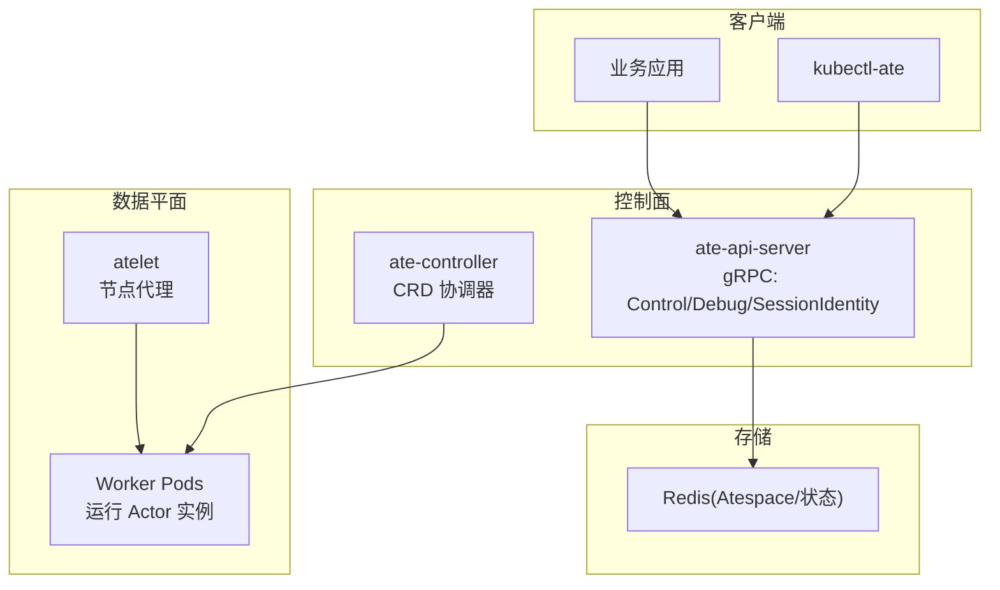
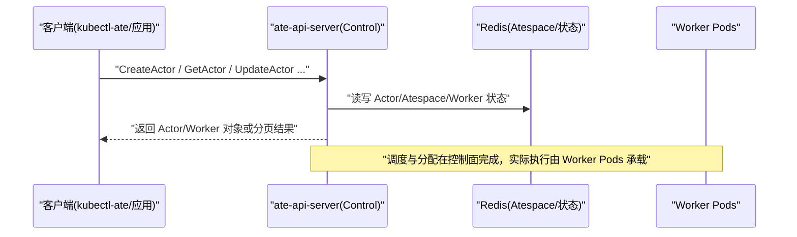
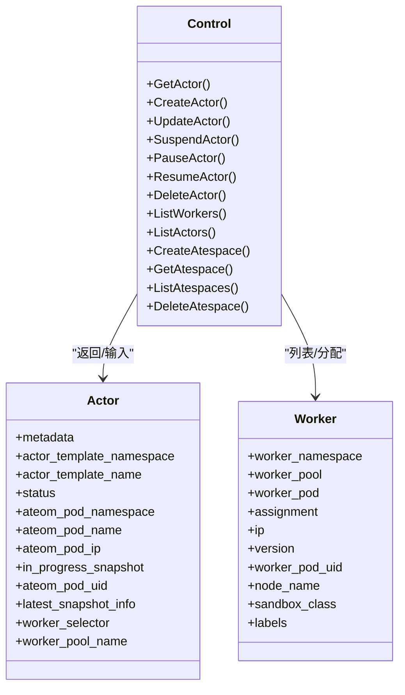
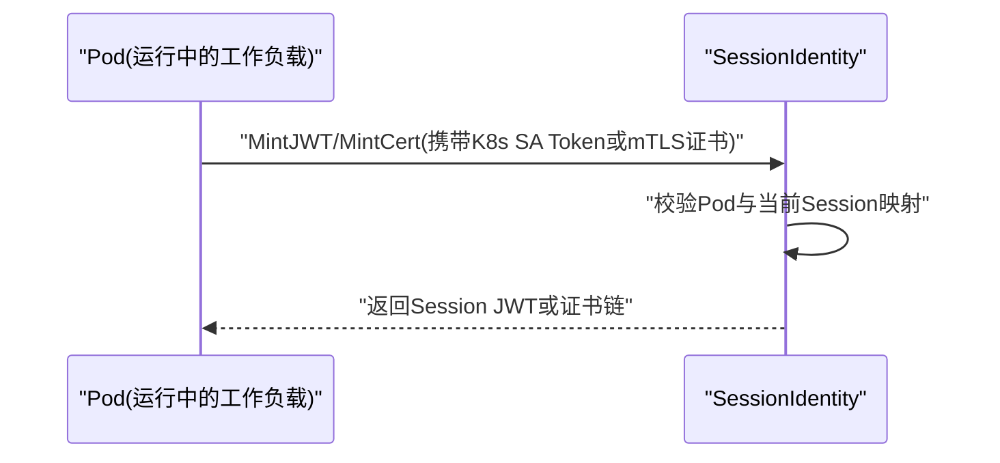
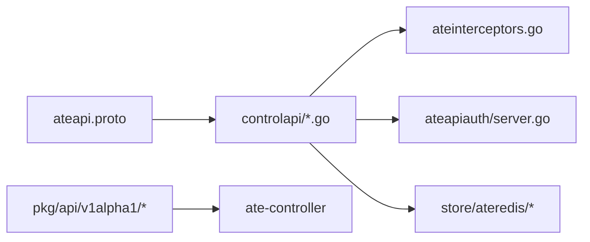

# API参考

<cite>
**本文引用的文件**
- [pkg/proto/ateapipb/ateapi.proto](file://pkg/proto/ateapipb/ateapi.proto)
- [cmd/ateapi/internal/controlapi/service.go](file://cmd/ateapi/internal/controlapi/service.go)
- [cmd/ateapi/internal/controlapi/create_actor.go](file://cmd/ateapi/internal/controlapi/create_actor.go)
- [cmd/ateapi/internal/controlapi/get_actor.go](file://cmd/ateapi/internal/controlapi/get_actor.go)
- [cmd/ateapi/internal/controlapi/update_actor.go](file://cmd/ateapi/internal/controlapi/update_actor.go)
- [cmd/ateapi/internal/controlapi/suspend_actor.go](file://cmd/ateapi/internal/controlapi/suspend_actor.go)
- [cmd/ateapi/internal/controlapi/pause_actor.go](file://cmd/ateapi/internal/controlapi/pause_actor.go)
- [cmd/ateapi/internal/controlapi/resume_actor.go](file://cmd/ateapi/internal/controlapi/resume_actor.go)
- [cmd/ateapi/internal/controlapi/delete_actor.go](file://cmd/ateapi/internal/controlapi/delete_actor.go)
- [cmd/ateapi/internal/controlapi/list_workers.go](file://cmd/ateapi/internal/controlapi/list_workers.go)
- [cmd/ateapi/internal/controlapi/list_actors.go](file://cmd/ateapi/internal/controlapi/list_actors.go)
- [cmd/ateapi/internal/controlapi/create_atespace.go](file://cmd/ateapi/internal/controlapi/create_atespace.go)
- [cmd/ateapi/internal/controlapi/get_atespace.go](file://cmd/ateapi/internal/controlapi/get_atespace.go)
- [cmd/ateapi/internal/controlapi/list_atespaces.go](file://cmd/ateapi/internal/controlapi/list_atespaces.go)
- [cmd/ateapi/internal/controlapi/delete_atespace.go](file://cmd/ateapi/internal/controlapi/delete_atespace.go)
- [cmd/ateapi/internal/debugapi/service.go](file://cmd/ateapi/internal/debugapi/service.go)
- [internal/ateapiauth/server.go](file://internal/ateapiauth/server.go)
- [internal/ateinterceptors/ateinterceptors.go](file://internal/ateinterceptors/ateinterceptors.go)
- [pkg/api/v1alpha1/workerpool_types.go](file://pkg/api/v1alpha1/workerpool_types.go)
- [pkg/api/v1alpha1/actortemplate_types.go](file://pkg/api/v1alpha1/actortemplate_types.go)
- [pkg/api/v1alpha1/sandboxconfig_types.go](file://pkg/api/v1alpha1/sandboxconfig_types.go)
- [cmd/kubectl-ate/internal/cmd/root.go](file://cmd/kubectl-ate/internal/cmd/root.go)
- [cmd/kubectl-ate/internal/cmd/create_actor.go](file://cmd/kubectl-ate/internal/cmd/create_actor.go)
- [cmd/kubectl-ate/internal/cmd/get_actors.go](file://cmd/kubectl-ate/internal/cmd/get_actors.go)
- [cmd/kubectl-ate/internal/cmd/delete_actor.go](file://cmd/kubectl-ate/internal/cmd/delete_actor.go)
- [cmd/kubectl-ate/internal/cmd/pause_actor.go](file://cmd/kubectl-ate/internal/cmd/pause_actor.go)
- [cmd/kubectl-ate/internal/cmd/resume_actor.go](file://cmd/kubectl-ate/internal/cmd/resume_actor.go)
- [cmd/kubectl-ate/internal/cmd/suspend_actor.go](file://cmd/kubectl-ate/internal/cmd/suspend_actor.go)
- [cmd/kubectl-ate/internal/cmd/admin.go](file://cmd/kubectl-ate/internal/cmd/admin.go)
- [cmd/kubectl-ate/internal/cmd/admin_make_jwt_pool.go](file://cmd/kubectl-ate/internal/cmd/admin_make_jwt_pool.go)
- [cmd/kubectl-ate/internal/cmd/admin_make_ca_pool.go](file://cmd/kubectl-ate/internal/cmd/admin_make_ca_pool.go)
- [cmd/kubectl-ate/internal/cmd/logs_actors.go](file://cmd/kubectl-ate/internal/cmd/logs_actors.go)
- [cmd/kubectl-ate/internal/cmd/get_workers.go](file://cmd/kubectl-ate/internal/cmd/get_workers.go)
- [cmd/kubectl-ate/internal/cmd/get_atespaces.go](file://cmd/kubectl-ate/internal/cmd/get_atespaces.go)
- [cmd/kubectl-ate/internal/cmd/create_atespace.go](file://cmd/kubectl-ate/internal/cmd/create_atespace.go)
- [cmd/kubectl-ate/internal/cmd/delete_atespace.go](file://cmd/kubectl-ate/internal/cmd/delete_atespace.go)
</cite>

## 目录
1. [简介](#简介)
2. [项目结构](#项目结构)
3. [核心组件](#核心组件)
4. [架构总览](#架构总览)
5. [详细组件分析](#详细组件分析)
6. [依赖关系分析](#依赖关系分析)
7. [性能与可扩展性](#性能与可扩展性)
8. [故障排查指南](#故障排查指南)
9. [结论](#结论)
10. [附录](#附录)

## 简介
本参考文档面向开发者，系统化梳理 Agent Substrate 的对外接口与资源模型，覆盖：
- gRPC API：Actor 生命周期管理、WorkerPool 操作、状态查询等核心能力
- REST API：HTTP 端点规范（URL、方法、请求头、请求体、响应）
- Kubernetes CRD：WorkerPool、ActorTemplate、SandboxConfig 的定义与验证规则
- kubectl-ate CLI：完整命令参考与示例
- 认证与授权：JWT、mTLS 等安全机制
- 错误码与错误处理策略
- 版本兼容性与迁移建议

## 项目结构
本项目采用“协议定义 + 控制面服务 + 控制器 + 节点代理 + CLI”的分层组织方式：
- 协议定义位于 pkg/proto/ateapipb/ateapi.proto，统一描述 Control、Debug、SessionIdentity 三大服务及消息类型
- 控制面服务 cmd/ateapi 实现上述 gRPC 接口，并集成鉴权拦截器
- CRD 定义位于 pkg/api/v1alpha1/*，由控制器 cmd/atecontroller 进行协调
- 节点侧代理 cmd/atelet 负责工作节点上的沙箱二进制拉取与快照协调
- CLI 工具 cmd/kubectl-ate 提供用户友好的命令行入口

图表来源
- [pkg/proto/ateapipb/ateapi.proto](file://pkg/proto/ateapipb/ateapi.proto)
- [cmd/ateapi/internal/controlapi/service.go](file://cmd/ateapi/internal/controlapi/service.go)
- [cmd/atecontroller/main.go](file://cmd/atecontroller/main.go)
- [cmd/atelet/main.go](file://cmd/atelet/main.go)

章节来源
- [README.md](file://README.md)

## 核心组件
- gRPC 服务
  - Control：Actor/Atespace/Worker 的核心控制面接口
  - Debug：调试清理接口
  - SessionIdentity：会话级 JWT/Cert 签发
- CRD
  - WorkerPool：工作池规格与副本数
  - ActorTemplate：Actor 模板（容器、卷、快照、调度选择器）
  - SandboxConfig：沙箱运行时资产配置（集群作用域）
- CLI
  - kubectl-ate：创建/获取/删除/暂停/恢复/挂起/日志等命令

章节来源
- [pkg/proto/ateapipb/ateapi.proto](file://pkg/proto/ateapipb/ateapi.proto)
- [pkg/api/v1alpha1/workerpool_types.go](file://pkg/api/v1alpha1/workerpool_types.go)
- [pkg/api/v1alpha1/actortemplate_types.go](file://pkg/api/v1alpha1/actortemplate_types.go)
- [pkg/api/v1alpha1/sandboxconfig_types.go](file://pkg/api/v1alpha1/sandboxconfig_types.go)
- [cmd/kubectl-ate/internal/cmd/root.go](file://cmd/kubectl-ate/internal/cmd/root.go)

## 架构总览
下图展示从客户端到控制面再到数据平面的关键交互路径。

图表来源
- [pkg/proto/ateapipb/ateapi.proto](file://pkg/proto/ateapipb/ateapi.proto)
- [cmd/ateapi/internal/controlapi/service.go](file://cmd/ateapi/internal/controlapi/service.go)

## 详细组件分析

### gRPC API：Control 服务
- 服务与方法
  - GetActor(GetActorRequest) -> Actor
  - CreateActor(CreateActorRequest) -> Actor
  - UpdateActor(UpdateActorRequest) -> UpdateActorResponse
  - SuspendActor(SuspendActorRequest) -> SuspendActorResponse
  - PauseActor(PauseActorRequest) -> PauseActorResponse
  - ResumeActor(ResumeActorRequest) -> ResumeActorResponse
  - DeleteActor(DeleteActorRequest) -> Actor
  - ListWorkers(ListWorkersRequest) -> ListWorkersResponse
  - ListActors(ListActorsRequest) -> ListActorsResponse
  - CreateAtespace(CreateAtespaceRequest) -> Atespace
  - GetAtespace(GetAtespaceRequest) -> Atespace
  - ListAtespaces(ListAtespacesRequest) -> ListAtespacesResponse
  - DeleteAtespace(DeleteAtespaceRequest) -> Atespace
- 关键消息
  - ResourceMetadata：通用元信息（atespace/name/uid/version/timestamps）
  - Actor：包含状态机 Status（RESUMING/RUNNING/SUSPENDING/SUSPENDED/PAUSING/PAUSED/CRASHED）、所属模板、当前 Worker 信息、快照信息等
  - Selector：基于标签的等值匹配选择器
  - Worker：包含 worker_namespace/pool/pod、Assignment、IP、版本、节点名、沙箱类、标签等
  - Assignment：关联 ActorTemplate 与 Actor
  - ObjectRef/KubeNamespacedObjectRef：资源引用
- 分页
  - ListWorkers/ListActors/ListAtespaces 均支持 page_size/page_token/next_page_token
- 行为约定
  - UpdateActor 可跨任意状态调用，变更在下一次 ResumeActor 生效
  - DeleteActor 仅允许删除已 SUSPENDED 的 Actor
  - List* 提供“软保证”，分页期间可能出现重复或缺失

图表来源
- [pkg/proto/ateapipb/ateapi.proto](file://pkg/proto/ateapipb/ateapi.proto)

章节来源
- [pkg/proto/ateapipb/ateapi.proto](file://pkg/proto/ateapipb/ateapi.proto)
- [cmd/ateapi/internal/controlapi/service.go](file://cmd/ateapi/internal/controlapi/service.go)
- [cmd/ateapi/internal/controlapi/create_actor.go](file://cmd/ateapi/internal/controlapi/create_actor.go)
- [cmd/ateapi/internal/controlapi/get_actor.go](file://cmd/ateapi/internal/controlapi/get_actor.go)
- [cmd/ateapi/internal/controlapi/update_actor.go](file://cmd/ateapi/internal/controlapi/update_actor.go)
- [cmd/ateapi/internal/controlapi/suspend_actor.go](file://cmd/ateapi/internal/controlapi/suspend_actor.go)
- [cmd/ateapi/internal/controlapi/pause_actor.go](file://cmd/ateapi/internal/controlapi/pause_actor.go)
- [cmd/ateapi/internal/controlapi/resume_actor.go](file://cmd/ateapi/internal/controlapi/resume_actor.go)
- [cmd/ateapi/internal/controlapi/delete_actor.go](file://cmd/ateapi/internal/controlapi/delete_actor.go)
- [cmd/ateapi/internal/controlapi/list_workers.go](file://cmd/ateapi/internal/controlapi/list_workers.go)
- [cmd/ateapi/internal/controlapi/list_actors.go](file://cmd/ateapi/internal/controlapi/list_actors.go)
- [cmd/ateapi/internal/controlapi/create_atespace.go](file://cmd/ateapi/internal/controlapi/create_atespace.go)
- [cmd/ateapi/internal/controlapi/get_atespace.go](file://cmd/ateapi/internal/controlapi/get_atespace.go)
- [cmd/ateapi/internal/controlapi/list_atespaces.go](file://cmd/ateapi/internal/controlapi/list_atespaces.go)
- [cmd/ateapi/internal/controlapi/delete_atespace.go](file://cmd/ateapi/internal/controlapi/delete_atespace.go)

### gRPC API：Debug 服务
- DebugClear(DebugClearRequest) -> DebugClearResponse
- 用途：开发环境清空 ate 数据库，生产禁用

章节来源
- [pkg/proto/ateapipb/ateapi.proto](file://pkg/proto/ateapipb/ateapi.proto)
- [cmd/ateapi/internal/debugapi/service.go](file://cmd/ateapi/internal/debugapi/service.go)

### gRPC API：SessionIdentity 服务
- MintJWT(MintJWTRequest) -> MintJWTResponse
  - 通过 K8s ServiceAccount Token 或 mTLS 证书认证
  - 返回 OIDC Discovery 兼容的 JWT，包含 iss/sub/aud/nbf/exp/iat 及扩展字段
- MintCert(MintCertRequest) -> MintCertResponse
  - 使用 mTLS 证书认证，返回 DER 编码的证书链（叶子证书在前）

图表来源
- [pkg/proto/ateapipb/ateapi.proto](file://pkg/proto/ateapipb/ateapi.proto)

章节来源
- [pkg/proto/ateapipb/ateapi.proto](file://pkg/proto/ateapipb/ateapi.proto)

### REST API（HTTP 网关）
- 说明
  - 控制面 gRPC 可通过 gRPC-Gateway 暴露为 HTTP/JSON 接口
  - 具体路由映射以 Gateway 配置为准；常见模式为将 gRPC 方法与路径一一对应
- 通用要求
  - 认证：Authorization: Bearer <token> 或 mTLS 客户端证书
  - 内容类型：application/json
  - 分页：GET 列表接口通常支持 page_size 与 page_token 查询参数
- 典型端点（命名约定）
  - POST /v1/atespaces
  - GET /v1/atespaces/{name}
  - GET /v1/atespaces?page_size=&page_token=
  - DELETE /v1/atespaces/{name}
  - POST /v1/actors
  - GET /v1/actors/{namespace}/{name}
  - PATCH /v1/actors/{namespace}/{name}
  - POST /v1/actors/{namespace}/{name}:suspend
  - POST /v1/actors/{namespace}/{name}:pause
  - POST /v1/actors/{namespace}/{name}:resume
  - DELETE /v1/actors/{namespace}/{name}
  - GET /v1/workers?page_size=&page_token=
  - GET /v1/actors?page_size=&page_token=&atespace=
- 注意
  - 以上为基于 gRPC 定义的常见映射约定，请以部署的 Gateway 配置为准

[本节为概念性说明，不直接分析具体文件]

### Kubernetes CRD 定义与用法

#### WorkerPool
- 作用域：Namespaced
- 关键字段
  - spec.replicas：期望副本数（>=0）
  - spec.ateomImage：工作进程镜像（必填，长度>=1）
  - spec.template：可选的 Pod 调度与资源设置（NodeSelector/Tolerations/PriorityClassName/NodeAffinity/Resources）
  - spec.sandboxClass：gvisor|microvm，默认 gvisor
  - spec.sandboxConfigName：指定同类的 SandboxConfig，为空则使用该类默认配置
- 状态
  - status.replicas：实际副本数
- 常用 kubectl 子资源
  - scale：通过 .spec.replicas 与 .status.replicas 联动

章节来源
- [pkg/api/v1alpha1/workerpool_types.go](file://pkg/api/v1alpha1/workerpool_types.go)

#### ActorTemplate
- 作用域：Namespaced
- 关键字段
  - spec.pauseImage：沙箱 pause 镜像（需带 digest）
  - spec.containers[]：最多10个容器，image 必须带 digest，command/args/env/readyz/volumeMounts 等
  - spec.snapshotsConfig：location/onPause/onCommit（Full/Data），onCommit 必须是 onPause 的子集
  - spec.sandboxClass：gvisor|microvm，默认 gvisor
  - spec.workerSelector：限制可用 WorkerPool 集合
  - spec.volumes[]：最多32个卷，目前仅支持 durableDir 类型，且每个模板最多一个 DurableDir；单个容器最多挂载一个 DurableDir；microvm 不支持 DurableDir
- 状态
  - phase/goldenActorID/goldenSnapshot/conditions
- 约束
  - spec 不可变
  - 多条件 XValidation 确保卷与挂载一致性

章节来源
- [pkg/api/v1alpha1/actortemplate_types.go](file://pkg/api/v1alpha1/actortemplate_types.go)

#### SandboxConfig
- 作用域：Cluster
- 关键字段
  - spec.sandboxClass：gvisor|microvm，默认 gvisor
  - spec.default：标记为该类默认配置（每类最多一个）
  - spec.assets：按架构与资产名索引的下载清单（含 URL 与 SHA256）
- 用途：为 WorkerPool 提供运行时二进制与固件等资产

章节来源
- [pkg/api/v1alpha1/sandboxconfig_types.go](file://pkg/api/v1alpha1/sandboxconfig_types.go)

### kubectl-ate CLI 命令参考
- 全局选项
  - --kubeconfig：kubeconfig 路径
  - --context：kubeconfig 上下文
  - --endpoint：手动指定 gRPC 目标地址（省略时自动端口转发）
  - -o, --output：输出格式 table|json|yaml
  - --trace：启用请求追踪
- 根命令
  - kubectl-ate
- 资源管理
  - create atespace：创建隔离空间
  - get atespaces：列出隔离空间
  - delete atespace：删除空隔离空间
  - create actor：基于模板创建 Actor
  - get actors：列出 Actor
  - delete actor：删除 Actor（需先挂起）
  - suspend actor：挂起 Actor（保存最新快照）
  - pause actor：暂停 Actor（保留本地快照）
  - resume actor：从最新快照恢复（支持 boot 跳过黄金快照）
  - logs actors：查看 Actor 日志
  - get workers：查看 Worker 列表
- 管理员命令
  - admin make jwt-pool：生成 JWT 密钥池
  - admin make ca-pool：生成 CA 池
  - admin debug redis flush：清空 Redis 缓存（仅限开发）

章节来源
- [cmd/kubectl-ate/internal/cmd/root.go](file://cmd/kubectl-ate/internal/cmd/root.go)
- [cmd/kubectl-ate/internal/cmd/create_atespace.go](file://cmd/kubectl-ate/internal/cmd/create_atespace.go)
- [cmd/kubectl-ate/internal/cmd/get_atespaces.go](file://cmd/kubectl-ate/internal/cmd/get_atespaces.go)
- [cmd/kubectl-ate/internal/cmd/delete_atespace.go](file://cmd/kubectl-ate/internal/cmd/delete_atespace.go)
- [cmd/kubectl-ate/internal/cmd/create_actor.go](file://cmd/kubectl-ate/internal/cmd/create_actor.go)
- [cmd/kubectl-ate/internal/cmd/get_actors.go](file://cmd/kubectl-ate/internal/cmd/get_actors.go)
- [cmd/kubectl-ate/internal/cmd/delete_actor.go](file://cmd/kubectl-ate/internal/cmd/delete_actor.go)
- [cmd/kubectl-ate/internal/cmd/suspend_actor.go](file://cmd/kubectl-ate/internal/cmd/suspend_actor.go)
- [cmd/kubectl-ate/internal/cmd/pause_actor.go](file://cmd/kubectl-ate/internal/cmd/pause_actor.go)
- [cmd/kubectl-ate/internal/cmd/resume_actor.go](file://cmd/kubectl-ate/internal/cmd/resume_actor.go)
- [cmd/kubectl-ate/internal/cmd/logs_actors.go](file://cmd/kubectl-ate/internal/cmd/logs_actors.go)
- [cmd/kubectl-ate/internal/cmd/get_workers.go](file://cmd/kubectl-ate/internal/cmd/get_workers.go)
- [cmd/kubectl-ate/internal/cmd/admin.go](file://cmd/kubectl-ate/internal/cmd/admin.go)
- [cmd/kubectl-ate/internal/cmd/admin_make_jwt_pool.go](file://cmd/kubectl-ate/internal/cmd/admin_make_jwt_pool.go)
- [cmd/kubectl-ate/internal/cmd/admin_make_ca_pool.go](file://cmd/kubectl-ate/internal/cmd/admin_make_ca_pool.go)

## 依赖关系分析
- 控制面服务依赖
  - gRPC 服务实现位于 controlapi 包，按方法拆分文件
  - 鉴权与拦截器位于 internal/ateinterceptors 与 internal/ateapiauth
- 数据持久化
  - Atespace/Actor/Worker 状态由 Redis 驱动（见 store/ateredis）
- 控制器
  - WorkerPool/ActorTemplate 由 controller-runtime 控制器协调

图表来源
- [pkg/proto/ateapipb/ateapi.proto](file://pkg/proto/ateapipb/ateapi.proto)
- [cmd/ateapi/internal/controlapi/service.go](file://cmd/ateapi/internal/controlapi/service.go)
- [internal/ateinterceptors/ateinterceptors.go](file://internal/ateinterceptors/ateinterceptors.go)
- [internal/ateapiauth/server.go](file://internal/ateapiauth/server.go)

章节来源
- [cmd/ateapi/internal/controlapi/service.go](file://cmd/ateapi/internal/controlapi/service.go)
- [internal/ateinterceptors/ateinterceptors.go](file://internal/ateinterceptors/ateinterceptors.go)
- [internal/ateapiauth/server.go](file://internal/ateapiauth/server.go)

## 性能与可扩展性
- 分页与限流
  - 列表接口支持 page_size 与 next_page_token，服务端对过大 page_size 做上限约束
- 软一致性
  - 列表操作提供“软保证”，在高并发下可能重复或缺失，客户端需具备幂等与去重逻辑
- 快照与恢复
  - Full 与 Data 两种快照范围，Data 更轻量但仅包含持久卷内容
- 调度与选择器
  - ActorTemplate 的 workerSelector 与 Actor 的 worker_selector 组合决定候选 WorkerPool 集合

[本节为通用指导，不直接分析具体文件]

## 故障排查指南
- 认证失败
  - 检查 Authorization: Bearer 或 mTLS 证书是否有效
  - 确认调用方 Pod 与目标 Session 的映射关系存在
- 权限不足
  - 确认 RBAC 与自定义鉴权策略允许访问对应资源
- 状态不一致
  - 使用 ListWorkers/ListActors 配合 next_page_token 遍历，注意幂等处理
- 快照问题
  - 核对 SnapshotsConfig.location 与 onCommit/onPause 配置
  - 确认 microvm 场景下未使用 DurableDir 卷
- 调试手段
  - 使用 DebugClear 清空测试环境数据（仅开发）
  - 使用 kubectl-ate logs actors 查看工作负载日志

章节来源
- [pkg/proto/ateapipb/ateapi.proto](file://pkg/proto/ateapipb/ateapi.proto)
- [cmd/ateapi/internal/debugapi/service.go](file://cmd/ateapi/internal/debugapi/service.go)
- [cmd/kubectl-ate/internal/cmd/logs_actors.go](file://cmd/kubectl-ate/internal/cmd/logs_actors.go)

## 结论
本参考文档围绕 gRPC API、REST 网关、CRD 模型与 CLI 工具，提供了端到端的接口与使用指南。结合鉴权、错误处理与性能要点，帮助开发者快速集成与排障。由于项目处于早期阶段，API 与资源模型仍可能演进，请持续关注版本更新与迁移说明。

[本节为总结性内容，不直接分析具体文件]

## 附录

### 认证与授权
- 支持方式
  - Bearer Token：Kubernetes ServiceAccount Token
  - mTLS：Kubernetes ServiceAccount 证书（通过 Pod Certificate polyfill）
- 适用服务
  - SessionIdentity：MintJWT/MintCert
  - Control/Debug：可按需开启鉴权拦截器
- 推荐实践
  - 最小权限原则：按需授予 Pod 访问 SessionIdentity 的权限
  - 证书轮换：定期轮换 CA 与中间证书

章节来源
- [pkg/proto/ateapipb/ateapi.proto](file://pkg/proto/ateapipb/ateapi.proto)
- [internal/ateapiauth/server.go](file://internal/ateapiauth/server.go)
- [internal/ateinterceptors/ateinterceptors.go](file://internal/ateinterceptors/ateinterceptors.go)

### 错误码与错误处理策略
- gRPC 标准状态码
  - INVALID_ARGUMENT：请求参数不合法（如 name/atespace 缺失）
  - NOT_FOUND：资源不存在
  - ALREADY_EXISTS：创建冲突
  - FAILED_PRECONDITION：前置条件不满足（如删除非 SUSPENDED 的 Actor）
  - UNAVAILABLE/RESOURCE_EXHAUSTED：系统不可用或资源耗尽
- 建议策略
  - 重试与退避：对瞬态错误（如 UNAVAILABLE）实施指数退避
  - 幂等设计：Create/Update 使用幂等键或版本号
  - 分页健壮性：处理 next_page_token 为空与重复条目

[本节为通用指导，不直接分析具体文件]

### API 版本兼容性与迁移指南
- 当前状态
  - 项目处于早期开发阶段，API 与 CRD 可能频繁变更，不提供向后兼容性保证
- 迁移建议
  - 锁定版本：在 CI/CD 中固定使用的版本标签
  - 增量升级：分阶段升级组件，优先升级只读接口与 CRD 新增字段
  - 灰度发布：对新版本 API 进行小流量验证后再全量切换
  - 回滚预案：保留旧版二进制与配置，必要时快速回滚

[本节为通用指导，不直接分析具体文件]
