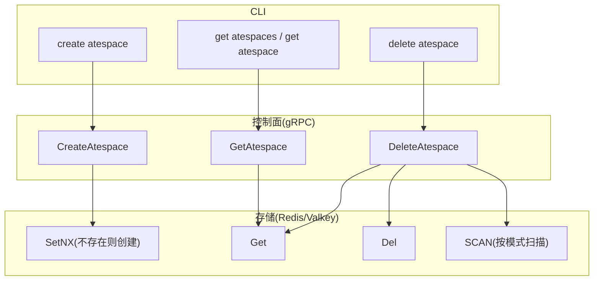
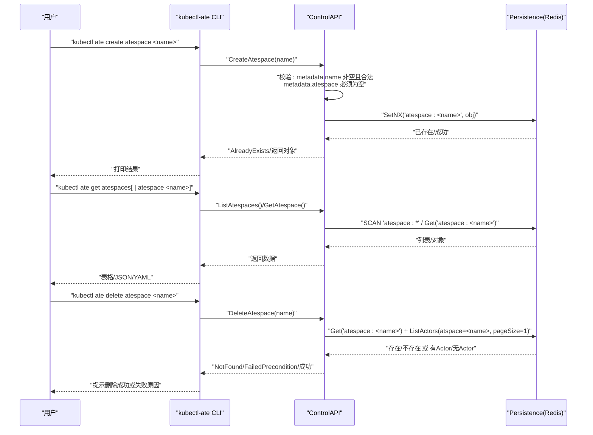
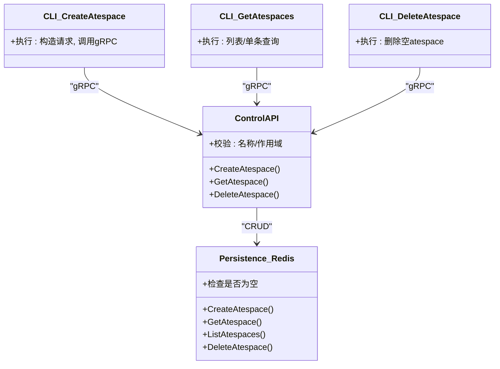

# Atespace管理命令

<cite>
**本文引用的文件**
- [cmd/kubectl-ate/internal/cmd/create_atespace.go](file://cmd/kubectl-ate/internal/cmd/create_atespace.go)
- [cmd/kubectl-ate/internal/cmd/get_atespaces.go](file://cmd/kubectl-ate/internal/cmd/get_atespaces.go)
- [cmd/kubectl-ate/internal/cmd/delete_atespace.go](file://cmd/kubectl-ate/internal/cmd/delete_atespace.go)
- [cmd/ateapi/internal/controlapi/create_atespace.go](file://cmd/ateapi/internal/controlapi/create_atespace.go)
- [cmd/ateapi/internal/controlapi/get_atespace.go](file://cmd/ateapi/internal/controlapi/get_atespace.go)
- [cmd/ateapi/internal/controlapi/delete_atespace.go](file://cmd/ateapi/internal/controlapi/delete_atespace.go)
- [cmd/ateapi/internal/store/ateredis/ateredis.go](file://cmd/ateapi/internal/store/ateredis/ateredis.go)
- [pkg/proto/ateapipb/ateapi.proto](file://pkg/proto/ateapipb/ateapi.proto)
- [internal/resources/validate.go](file://internal/resources/validate.go)
- [cmd/kubectl-ate/README.md](file://cmd/kubectl-ate/README.md)
</cite>

## 目录
1. [简介](#简介)
2. [项目结构](#项目结构)
3. [核心组件](#核心组件)
4. [架构总览](#架构总览)
5. [详细组件分析](#详细组件分析)
6. [依赖关系分析](#依赖关系分析)
7. [性能与可扩展性](#性能与可扩展性)
8. [故障排查指南](#故障排查指南)
9. [结论](#结论)
10. [附录：命令参考与最佳实践](#附录命令参考与最佳实践)

## 简介
Atespace 是 Substrate 中 Actor 的隔离边界。每个 Actor 都归属于一个 atespace，且 atespace 必须在创建 Actor 之前存在。本文件聚焦于 kubectl-ate CLI 提供的 Atespace 管理命令（create、get、delete），并结合控制面实现说明其生命周期、资源清理规则、参数选项与约束条件，以及与 Actor 的关联关系和最佳实践。

## 项目结构
kubectl-ate 作为 Kubernetes 原生插件，提供 ate 子命令；其中 Atespace 相关命令位于内部 cmd 包下，分别对应 create、get、delete 三个操作。控制面服务在 controlapi 层处理请求并持久化到 Redis（Valkey）存储。

图表来源
- [cmd/kubectl-ate/internal/cmd/create_atespace.go:26-55](file://cmd/kubectl-ate/internal/cmd/create_atespace.go#L26-L55)
- [cmd/kubectl-ate/internal/cmd/get_atespaces.go:26-73](file://cmd/kubectl-ate/internal/cmd/get_atespaces.go#L26-L73)
- [cmd/kubectl-ate/internal/cmd/delete_atespace.go:25-49](file://cmd/kubectl-ate/internal/cmd/delete_atespace.go#L25-L49)
- [cmd/ateapi/internal/controlapi/create_atespace.go:30-78](file://cmd/ateapi/internal/controlapi/create_atespace.go#L30-L78)
- [cmd/ateapi/internal/controlapi/get_atespace.go:30-60](file://cmd/ateapi/internal/controlapi/get_atespace.go#L30-L60)
- [cmd/ateapi/internal/controlapi/delete_atespace.go:30-64](file://cmd/ateapi/internal/controlapi/delete_atespace.go#L30-L64)
- [cmd/ateapi/internal/store/ateredis/ateredis.go:108-208](file://cmd/ateapi/internal/store/ateredis/ateredis.go#L108-L208)

章节来源
- [cmd/kubectl-ate/README.md:120-146](file://cmd/kubectl-ate/README.md#L120-L146)

## 核心组件
- CLI 命令层
  - create atespace：创建全局唯一的 atespace，名称需满足 DNS-1123 label 规范。
  - get atespaces / get atespace：列出所有 atespaces 或获取指定 atespace。
  - delete atespace：删除空的 atespace；若仍有 Actor 残留，将拒绝删除。
- 控制面 gRPC 服务
  - CreateAtespace/GetAtespace/DeleteAtespace：校验请求、调用持久化接口、返回标准错误码。
- 持久化层（Redis/Valkey）
  - 使用键空间“atespace:<name>”存储对象；删除前检查该 atespace 是否包含任何 Actor。

章节来源
- [cmd/kubectl-ate/internal/cmd/create_atespace.go:26-55](file://cmd/kubectl-ate/internal/cmd/create_atespace.go#L26-L55)
- [cmd/kubectl-ate/internal/cmd/get_atespaces.go:26-73](file://cmd/kubectl-ate/internal/cmd/get_atespaces.go#L26-L73)
- [cmd/kubectl-ate/internal/cmd/delete_atespace.go:25-49](file://cmd/kubectl-ate/internal/cmd/delete_atespace.go#L25-L49)
- [cmd/ateapi/internal/controlapi/create_atespace.go:30-78](file://cmd/ateapi/internal/controlapi/create_atespace.go#L30-L78)
- [cmd/ateapi/internal/controlapi/get_atespace.go:30-60](file://cmd/ateapi/internal/controlapi/get_atespace.go#L30-L60)
- [cmd/ateapi/internal/controlapi/delete_atespace.go:30-64](file://cmd/ateapi/internal/controlapi/delete_atespace.go#L30-L64)
- [cmd/ateapi/internal/store/ateredis/ateredis.go:108-208](file://cmd/ateapi/internal/store/ateredis/ateredis.go#L108-L208)

## 架构总览
下图展示了从 CLI 到控制面再到存储的完整调用链，以及关键校验点与错误映射。

图表来源
- [cmd/kubectl-ate/internal/cmd/create_atespace.go:26-55](file://cmd/kubectl-ate/internal/cmd/create_atespace.go#L26-L55)
- [cmd/kubectl-ate/internal/cmd/get_atespaces.go:26-73](file://cmd/kubectl-ate/internal/cmd/get_atespaces.go#L26-L73)
- [cmd/kubectl-ate/internal/cmd/delete_atespace.go:25-49](file://cmd/kubectl-ate/internal/cmd/delete_atespace.go#L25-L49)
- [cmd/ateapi/internal/controlapi/create_atespace.go:30-78](file://cmd/ateapi/internal/controlapi/create_atespace.go#L30-L78)
- [cmd/ateapi/internal/controlapi/get_atespace.go:30-60](file://cmd/ateapi/internal/controlapi/get_atespace.go#L30-L60)
- [cmd/ateapi/internal/controlapi/delete_atespace.go:30-64](file://cmd/ateapi/internal/controlapi/delete_atespace.go#L30-L64)
- [cmd/ateapi/internal/store/ateredis/ateredis.go:108-208](file://cmd/ateapi/internal/store/ateredis/ateredis.go#L108-L208)

## 详细组件分析

### 概念与作用
- Atespace 是全局作用域的隔离单元，用于承载一组 Actor。
- 同一集群内 atespace 名称全局唯一；Actor 通过 (atespace, name) 组合标识。
- 必须先创建 atespace，再在其中创建 Actor；删除 atespace 时要求其为空。

章节来源
- [pkg/proto/ateapipb/ateapi.proto:159-173](file://pkg/proto/ateapipb/ateapi.proto#L159-L173)
- [cmd/kubectl-ate/README.md:120-139](file://cmd/kubectl-ate/README.md#L120-L139)

### 数据结构与协议
- Atespace 消息仅包含公共元数据（名称、UID、版本、时间戳等）。
- ObjectRef 用于引用资源：对于全局资源（如 atespace），atespace 字段为空，name 为唯一标识。
- 相关请求/响应包括 CreateAtespaceRequest/Response、GetAtespaceRequest、ListAtespacesRequest/Response、DeleteAtespaceRequest。

章节来源
- [pkg/proto/ateapipb/ateapi.proto:159-205](file://pkg/proto/ateapipb/ateapi.proto#L159-L205)

### 命名与校验规则
- Atespace 名称必须是非空的 DNS-1123 label。
- 由于 Atespace 是全局资源，其 metadata.atespace 必须为空。
- 控制面在创建/获取/删除路径均进行严格校验，非法输入返回 InvalidArgument。

章节来源
- [cmd/ateapi/internal/controlapi/create_atespace.go:52-78](file://cmd/ateapi/internal/controlapi/create_atespace.go#L52-L78)
- [cmd/ateapi/internal/controlapi/get_atespace.go:46-60](file://cmd/ateapi/internal/controlapi/get_atespace.go#L46-L60)
- [cmd/ateapi/internal/controlapi/delete_atespace.go:50-64](file://cmd/ateapi/internal/controlapi/delete_atespace.go#L50-L64)
- [internal/resources/validate.go:41-72](file://internal/resources/validate.go#L41-L72)

### 存储与键空间
- Atespace 对象以“atespace:<name>”键存储在 Redis/Valkey 中。
- 创建使用 SetNX 保证幂等与冲突检测。
- 删除前会读取对象并检查该 atespace 下是否存在任何 Actor，若存在则拒绝删除。

章节来源
- [cmd/ateapi/internal/store/ateredis/ateredis.go:108-127](file://cmd/ateapi/internal/store/ateredis/ateredis.go#L108-L127)
- [cmd/ateapi/internal/store/ateredis/ateredis.go:129-146](file://cmd/ateapi/internal/store/ateredis/ateredis.go#L129-L146)
- [cmd/ateapi/internal/store/ateredis/ateredis.go:174-208](file://cmd/ateapi/internal/store/ateredis/ateredis.go#L174-L208)

### 生命周期与资源清理
- 创建：成功后即存在，可被后续 Actor 引用。
- 查询：支持分页列出全部，或按名称精确获取。
- 删除：仅允许删除空 atespace；若仍有 Actor，返回前置条件失败。
- 清理顺序建议：先删除 atespace 下的所有 Actor，再删除 atespace。

章节来源
- [cmd/kubectl-ate/README.md:134-139](file://cmd/kubectl-ate/README.md#L134-L139)
- [cmd/ateapi/internal/controlapi/delete_atespace.go:30-48](file://cmd/ateapi/internal/controlapi/delete_atespace.go#L30-L48)
- [cmd/ateapi/internal/store/ateredis/ateredis.go:174-208](file://cmd/ateapi/internal/store/ateredis/ateredis.go#L174-L208)

### 与 Actor 的关联与约束
- Actor 的存储键形如“actor:<atespace>:<name>”，表明 Actor 属于特定 atespace。
- 删除 atespace 前会检查该 atespace 下是否有 Actor，若有则拒绝删除。
- 创建 Actor 时要求 atespace 已存在，否则返回前置条件失败。

章节来源
- [cmd/ateapi/internal/store/ateredis/ateredis.go:90-102](file://cmd/ateapi/internal/store/ateredis/ateredis.go#L90-L102)
- [cmd/ateapi/internal/store/ateredis/ateredis.go:174-208](file://cmd/ateapi/internal/store/ateredis/ateredis.go#L174-L208)
- [cmd/kubectl-ate/README.md:134-139](file://cmd/kubectl-ate/README.md#L134-L139)

### 错误码与语义
- AlreadyExists：重复创建同名 atespace。
- NotFound：查询或删除不存在的 atespace。
- FailedPrecondition：删除非空 atespace。
- InvalidArgument：请求参数不合法（如名称为空或不符合规范）。

章节来源
- [cmd/ateapi/internal/controlapi/create_atespace.go:42-47](file://cmd/ateapi/internal/controlapi/create_atespace.go#L42-L47)
- [cmd/ateapi/internal/controlapi/get_atespace.go:36-41](file://cmd/ateapi/internal/controlapi/get_atespace.go#L36-L41)
- [cmd/ateapi/internal/controlapi/delete_atespace.go:37-45](file://cmd/ateapi/internal/controlapi/delete_atespace.go#L37-L45)

## 依赖关系分析
- CLI 依赖 ateclient 连接控制面；控制面依赖 persistence 接口；Redis 实现负责具体读写。
- 校验逻辑集中在 controlapi 层，复用 internal/resources 中的通用校验函数。

图表来源
- [cmd/kubectl-ate/internal/cmd/create_atespace.go:26-55](file://cmd/kubectl-ate/internal/cmd/create_atespace.go#L26-L55)
- [cmd/kubectl-ate/internal/cmd/get_atespaces.go:26-73](file://cmd/kubectl-ate/internal/cmd/get_atespaces.go#L26-L73)
- [cmd/kubectl-ate/internal/cmd/delete_atespace.go:25-49](file://cmd/kubectl-ate/internal/cmd/delete_atespace.go#L25-L49)
- [cmd/ateapi/internal/controlapi/create_atespace.go:30-78](file://cmd/ateapi/internal/controlapi/create_atespace.go#L30-L78)
- [cmd/ateapi/internal/controlapi/get_atespace.go:30-60](file://cmd/ateapi/internal/controlapi/get_atespace.go#L30-L60)
- [cmd/ateapi/internal/controlapi/delete_atespace.go:30-64](file://cmd/ateapi/internal/controlapi/delete_atespace.go#L30-L64)
- [cmd/ateapi/internal/store/ateredis/ateredis.go:108-208](file://cmd/ateapi/internal/store/ateredis/ateredis.go#L108-L208)

## 性能与可扩展性
- 列表采用分页机制，默认页大小上限为 1000，避免一次性加载过多数据。
- Redis 侧使用 SCAN 模式遍历键空间，适合大规模集合的增量读取。
- 删除路径在删除前进行一次轻量 Actor 计数扫描（pageSize=1），开销可控。

章节来源
- [cmd/kubectl-ate/internal/cmd/get_atespaces.go:50-67](file://cmd/kubectl-ate/internal/cmd/get_atespaces.go#L50-L67)
- [cmd/ateapi/internal/store/ateredis/ateredis.go:158-172](file://cmd/ateapi/internal/store/ateredis/ateredis.go#L158-L172)
- [cmd/ateapi/internal/store/ateredis/ateredis.go:174-208](file://cmd/ateapi/internal/store/ateredis/ateredis.go#L174-L208)

## 故障排查指南
- 无法创建（AlreadyExists）：确认名称是否已被占用。
- 找不到（NotFound）：确认 atespace 名称是否正确，或是否已被删除。
- 删除失败（FailedPrecondition）：attempts to delete non-empty atespace。请先删除该 atespace 下的所有 Actor，再重试删除。
- 参数错误（InvalidArgument）：名称为空或不符合 DNS-1123 label 规范；全局资源的 atespace 字段不应设置。

章节来源
- [cmd/ateapi/internal/controlapi/create_atespace.go:42-47](file://cmd/ateapi/internal/controlapi/create_atespace.go#L42-L47)
- [cmd/ateapi/internal/controlapi/get_atespace.go:36-41](file://cmd/ateapi/internal/controlapi/get_atespace.go#L36-L41)
- [cmd/ateapi/internal/controlapi/delete_atespace.go:37-45](file://cmd/ateapi/internal/controlapi/delete_atespace.go#L37-L45)
- [cmd/ateapi/internal/controlapi/create_atespace.go:52-78](file://cmd/ateapi/internal/controlapi/create_atespace.go#L52-L78)

## 结论
Atespace 作为 Actor 的隔离边界，提供了清晰的作用域划分与资源管理入口。通过 kubectl-ate 的 create/get/delete 命令，用户可以便捷地管理这些隔离单元。配合严格的命名与存在性校验、以及“仅能删除空 atespace”的安全策略，系统在保证一致性的同时降低了误删风险。

## 附录：命令参考与最佳实践

### 命令参考
- 创建 atespace
  - 用法：kubectl ate create atespace <name>
  - 行为：在全局命名空间中创建新的 atespace；若已存在则报错。
- 列出/获取 atespaces
  - 用法：kubectl ate get atespaces
  - 用法：kubectl ate get atespace <name>
  - 行为：列出所有 atespaces 或获取指定 atespace 的详细信息。
- 删除 atespace
  - 用法：kubectl ate delete atespace <name>
  - 行为：仅当 atespace 为空时删除；否则返回前置条件失败。

章节来源
- [cmd/kubectl-ate/README.md:120-146](file://cmd/kubectl-ate/README.md#L120-L146)
- [cmd/kubectl-ate/internal/cmd/create_atespace.go:26-55](file://cmd/kubectl-ate/internal/cmd/create_atespace.go#L26-L55)
- [cmd/kubectl-ate/internal/cmd/get_atespaces.go:26-73](file://cmd/kubectl-ate/internal/cmd/get_atespaces.go#L26-L73)
- [cmd/kubectl-ate/internal/cmd/delete_atespace.go:25-49](file://cmd/kubectl-ate/internal/cmd/delete_atespace.go#L25-L49)

### 参数与输出
- 全局参数（适用于所有 ate 命令）
  - --kubeconfig：kubeconfig 路径
  - --endpoint：手动指定 gRPC 端点
  - --output/-o：输出格式（table/json/yaml）
  - --trace：启用请求追踪
- get atespaces 输出列
  - NAME：全局唯一名称
  - AGE：创建时长

章节来源
- [cmd/kubectl-ate/README.md:61-70](file://cmd/kubectl-ate/README.md#L61-L70)
- [cmd/kubectl-ate/README.md:140-146](file://cmd/kubectl-ate/README.md#L140-L146)

### 使用示例
- 创建 atespace
  - kubectl ate create atespace team-a
- 列出所有 atespaces
  - kubectl ate get atespaces
- 获取单个 atespace
  - kubectl ate get atespace team-a
- 删除空 atespace
  - kubectl ate delete atespace team-a

章节来源
- [cmd/kubectl-ate/README.md:120-139](file://cmd/kubectl-ate/README.md#L120-L139)

### 最佳实践
- 命名规范：遵循 DNS-1123 label，避免特殊字符与过长名称。
- 生命周期管理：先删除 atespace 内的所有 Actor，再删除 atespace。
- 批量操作：使用 get atespaces 分页查看，结合脚本自动化清理。
- 安全策略：利用“仅能删除空 atespace”的规则，防止误删活跃资源。

章节来源
- [cmd/ateapi/internal/controlapi/delete_atespace.go:30-48](file://cmd/ateapi/internal/controlapi/delete_atespace.go#L30-L48)
- [cmd/kubectl-ate/README.md:134-139](file://cmd/kubectl-ate/README.md#L134-L139)
