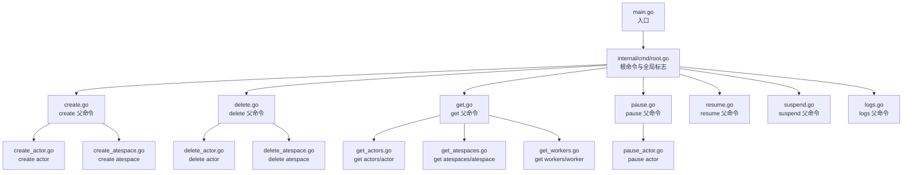
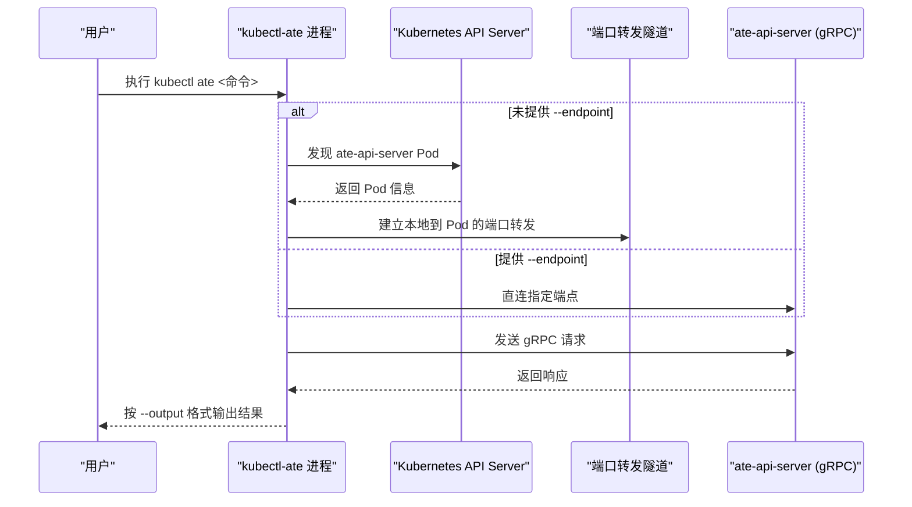
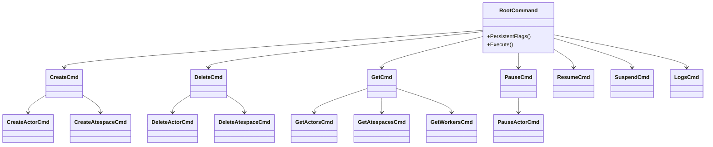

# CLI工具

<cite>
**本文引用的文件**   
- [main.go](file://cmd/kubectl-ate/main.go)
- [root.go](file://cmd/kubectl-ate/internal/cmd/root.go)
- [create.go](file://cmd/kubectl-ate/internal/cmd/create.go)
- [delete.go](file://cmd/kubectl-ate/internal/cmd/delete.go)
- [get.go](file://cmd/kubectl-ate/internal/cmd/get.go)
- [pause.go](file://cmd/kubectl-ate/internal/cmd/pause.go)
- [resume.go](file://cmd/kubectl-ate/internal/cmd/resume.go)
- [suspend.go](file://cmd/kubectl-ate/internal/cmd/suspend.go)
- [logs.go](file://cmd/kubectl-ate/internal/cmd/logs.go)
- [create_actor.go](file://cmd/kubectl-ate/internal/cmd/create_actor.go)
- [create_atespace.go](file://cmd/kubectl-ate/internal/cmd/create_atespace.go)
- [delete_actor.go](file://cmd/kubectl-ate/internal/cmd/delete_actor.go)
- [delete_atespace.go](file://cmd/kubectl-ate/internal/cmd/delete_atespace.go)
- [get_actors.go](file://cmd/kubectl-ate/internal/cmd/get_actors.go)
- [get_atespaces.go](file://cmd/kubectl-ate/internal/cmd/get_atespaces.go)
- [get_workers.go](file://cmd/kubectl-ate/internal/cmd/get_workers.go)
- [pause_actor.go](file://cmd/kubectl-ate/internal/cmd/pause_actor.go)
- [README.md](file://cmd/kubectl-ate/README.md)
</cite>

## 目录
1. [简介](#简介)
2. [项目结构](#项目结构)
3. [核心组件](#核心组件)
4. [架构总览](#架构总览)
5. [详细命令参考](#详细命令参考)
6. [依赖关系分析](#依赖关系分析)
7. [性能与输出格式](#性能与输出格式)
8. [故障排除指南](#故障排除指南)
9. [结论](#结论)
10. [附录：脚本集成与自动化示例](#附录脚本集成与自动化示例)

## 简介
kubectl-ate 是一个 Kubernetes 原生插件，用于管理 Agent Substrate 中的 Actor 和 Worker 生命周期。它通过 gRPC 与 ate-api-server 通信，默认自动发现并建立端口转发隧道；也可通过 --endpoint 直接指定服务端地址。CLI 支持多种输出格式（表格、JSON、YAML），并提供可选的按需追踪能力。

## 项目结构
本仓库中 kubectl-ate 子命令采用 Cobra 分层组织：根命令定义全局标志位，各资源类命令（如 create、delete、get、pause、resume、suspend、logs）作为一级子命令，具体资源操作（如 actor、atespace、workers）作为二级子命令。

图表来源 
- [main.go:17-23](file://cmd/kubectl-ate/main.go#L17-L23)
- [root.go:34-61](file://cmd/kubectl-ate/internal/cmd/root.go#L34-L61)
- [create.go:21-28](file://cmd/kubectl-ate/internal/cmd/create.go#L21-L28)
- [delete.go:21-28](file://cmd/kubectl-ate/internal/cmd/delete.go#L21-L28)
- [get.go:21-28](file://cmd/kubectl-ate/internal/cmd/get.go#L21-L28)
- [pause.go:21-28](file://cmd/kubectl-ate/internal/cmd/pause.go#L21-L28)
- [resume.go:21-28](file://cmd/kubectl-ate/internal/cmd/resume.go#L21-L28)
- [suspend.go:21-28](file://cmd/kubectl-ate/internal/cmd/suspend.go#L21-L28)
- [logs.go:21-28](file://cmd/kubectl-ate/internal/cmd/logs.go#L21-L28)
- [create_actor.go:30-72](file://cmd/kubectl-ate/internal/cmd/create_actor.go#L30-L72)
- [create_atespace.go:26-55](file://cmd/kubectl-ate/internal/cmd/create_atespace.go#L26-L55)
- [delete_actor.go:27-56](file://cmd/kubectl-ate/internal/cmd/delete_actor.go#L27-L56)
- [delete_atespace.go:25-49](file://cmd/kubectl-ate/internal/cmd/delete_atespace.go#L25-L49)
- [get_actors.go:31-105](file://cmd/kubectl-ate/internal/cmd/get_actors.go#L31-L105)
- [get_atespaces.go:26-73](file://cmd/kubectl-ate/internal/cmd/get_atespaces.go#L26-L73)
- [get_workers.go:26-62](file://cmd/kubectl-ate/internal/cmd/get_workers.go#L26-L62)
- [pause_actor.go:28-55](file://cmd/kubectl-ate/internal/cmd/pause_actor.go#L28-L55)

章节来源
- [main.go:17-23](file://cmd/kubectl-ate/main.go#L17-L23)
- [root.go:34-61](file://cmd/kubectl-ate/internal/cmd/root.go#L34-L61)

## 核心组件
- 根命令与全局标志
  - 提供 --kubeconfig、--context、--endpoint、--output/-o、--trace 等全局选项，并在执行前校验输出格式合法性。
- 资源命令分组
  - create：创建 atespace 与 actor
  - delete：删除 atespace 与 actor
  - get：查询 atespaces、actors、workers
  - pause：暂停 actor
  - resume：恢复 actor（实现文件存在，详见“详细命令参考”）
  - suspend：挂起 actor（实现文件存在，详见“详细命令参考”）
  - logs：查看日志（目前仅支持 actors 子资源）

章节来源
- [root.go:40-61](file://cmd/kubectl-ate/internal/cmd/root.go#L40-L61)
- [create.go:21-28](file://cmd/kubectl-ate/internal/cmd/create.go#L21-L28)
- [delete.go:21-28](file://cmd/kubectl-ate/internal/cmd/delete.go#L21-L28)
- [get.go:21-28](file://cmd/kubectl-ate/internal/cmd/get.go#L21-L28)
- [pause.go:21-28](file://cmd/kubectl-ate/internal/cmd/pause.go#L21-L28)
- [resume.go:21-28](file://cmd/kubectl-ate/internal/cmd/resume.go#L21-L28)
- [suspend.go:21-28](file://cmd/kubectl-ate/internal/cmd/suspend.go#L21-L28)
- [logs.go:21-28](file://cmd/kubectl-ate/internal/cmd/logs.go#L21-L28)

## 架构总览
kubectl-ate 通过 ateclient 构建客户端连接至 ate-api-server，使用 gRPC 调用控制面接口完成资源操作。默认情况下，CLI 会读取 kubeconfig 并自动为 ate-api-server 建立端口转发；若提供 --endpoint，则直连目标地址。

图表来源 
- [root.go:56-60](file://cmd/kubectl-ate/internal/cmd/root.go#L56-L60)
- [create_actor.go:34-40](file://cmd/kubectl-ate/internal/cmd/create_actor.go#L34-L40)
- [get_actors.go:35-43](file://cmd/kubectl-ate/internal/cmd/get_actors.go#L35-L43)
- [get_atespaces.go:30-36](file://cmd/kubectl-ate/internal/cmd/get_atespaces.go#L30-36)
- [get_workers.go:31-37](file://cmd/kubectl-ate/internal/cmd/get_workers.go#L31-37)
- [pause_actor.go:32-38](file://cmd/kubectl-ate/internal/cmd/pause_actor.go#L32-38)

## 详细命令参考

### 全局标志
- --kubeconfig：kubeconfig 文件路径
- --context：使用的 kubeconfig context
- --endpoint：手动覆盖 gRPC 目标地址（例如 localhost:8080）。不设置时自动端口转发
- --output, -o：输出格式，支持 table、json、yaml
- --trace：启用本次请求的追踪

章节来源
- [root.go:56-61](file://cmd/kubectl-ate/internal/cmd/root.go#L56-L61)
- [README.md:62-70](file://cmd/kubectl-ate/README.md#L62-L70)

### create
- create atespace [name]
  - 描述：创建隔离边界 atespace
  - 参数：位置参数 name
  - 输出：按 --output 格式打印 atespace 对象
  - 示例：
    - kubectl ate create atespace my-space
- create actor <actor-name>
  - 描述：基于模板创建 Actor
  - 必需标志：
    - --template, -t：<namespace>/<name> 格式的模板引用
    - --atespace, -a：Actor 所属 atespace
  - 输出：按 --output 格式打印 Actor 对象
  - 示例：
    - kubectl ate create actor my-actor -t demo/counter -a my-space

章节来源
- [create_atespace.go:26-55](file://cmd/kubectl-ate/internal/cmd/create_atespace.go#L26-L55)
- [create_actor.go:30-72](file://cmd/kubectl-ate/internal/cmd/create_actor.go#L30-L72)
- [README.md:124-136](file://cmd/kubectl-ate/README.md#L124-L136)
- [README.md:152-165](file://cmd/kubectl-ate/README.md#L152-L165)

### delete
- delete atespace [name]
  - 描述：删除空的 atespace（若仍有 Actor 将失败）
  - 参数：位置参数 name
  - 示例：
    - kubectl ate delete atespace my-space
- delete actor <actor-name>
  - 描述：删除指定 Actor
  - 必需标志：
    - --atespace, -a：Actor 所在 atespace
  - 示例：
    - kubectl ate delete actor my-actor -a my-space

章节来源
- [delete_atespace.go:25-49](file://cmd/kubectl-ate/internal/cmd/delete_atespace.go#L25-L49)
- [delete_actor.go:27-56](file://cmd/kubectl-ate/internal/cmd/delete_actor.go#L27-L56)
- [README.md:134-136](file://cmd/kubectl-ate/README.md#L134-L136)
- [README.md:163-165](file://cmd/kubectl-ate/README.md#L163-L165)

### get
- get atespaces [name ...]
  - 描述：列出所有 atespaces 或获取一个或多个 atespace
  - 示例：
    - kubectl ate get atespaces
    - kubectl ate get atespace my-space
- get actors <actor-name ...>
  - 描述：列出或获取 Actor
  - 标志：
    - --atespace, -a：列出单个 atespace 下的 Actor；获取单个 Actor 时必须提供
    - --all-atespaces, -A：跨所有 atespaces 列出（与 -a 互斥）
  - 注意：获取单个 Actor 必须提供 -a；列表模式必须提供 -a 或 -A
  - 示例：
    - kubectl ate get actors -a my-space
    - kubectl ate get actors -A
    - kubectl ate get actor my-actor -a my-space -o yaml
- get workers
  - 描述：列出所有物理 Worker 及其分配状态
  - 示例：
    - kubectl ate get workers

章节来源
- [get_atespaces.go:26-73](file://cmd/kubectl-ate/internal/cmd/get_atespaces.go#L26-L73)
- [get_actors.go:31-105](file://cmd/kubectl-ate/internal/cmd/get_actors.go#L31-L105)
- [get_workers.go:26-62](file://cmd/kubectl-ate/internal/cmd/get_workers.go#L26-L62)
- [README.md:78-96](file://cmd/kubectl-ate/README.md#L78-L96)
- [README.md:97-119](file://cmd/kubectl-ate/README.md#L97-L119)
- [README.md:140-146](file://cmd/kubectl-ate/README.md#L140-L146)

### pause
- pause actor <actor-name>
  - 描述：暂停 Actor（释放 Worker，保留状态以便后续恢复）
  - 必需标志：
    - --atespace, -a：Actor 所在 atespace
  - 输出：按 --output 格式打印 Actor 对象
  - 示例：
    - kubectl ate pause actor my-actor -a my-space

章节来源
- [pause_actor.go:28-55](file://cmd/kubectl-ate/internal/cmd/pause_actor.go#L28-L55)

### resume
- resume actor <actor-name>
  - 描述：恢复 Actor（分配空闲 Worker 并恢复状态）
  - 必需标志：
    - --atespace, -a：Actor 所在 atespace
  - 示例：
    - kubectl ate resume actor my-actor -a my-space

章节来源
- [resume.go:21-28](file://cmd/kubectl-ate/internal/cmd/resume.go#L21-L28)
- [README.md:157-159](file://cmd/kubectl-ate/README.md#L157-L159)

### suspend
- suspend actor <actor-name>
  - 描述：挂起 Actor（快照状态并释放 Worker）
  - 必需标志：
    - --atespace, -a：Actor 所在 atespace
  - 示例：
    - kubectl ate suspend actor my-actor -a my-space

章节来源
- [suspend.go:21-28](file://cmd/kubectl-ate/internal/cmd/suspend.go#L21-L28)
- [README.md:160-162](file://cmd/kubectl-ate/README.md#L160-L162)

### logs
- logs actors <actor-name>
  - 描述：流式输出 Actor 日志（仅在运行态可流式获取；迁移后可通过集中日志后端回溯）
  - 示例：
    - kubectl ate logs actors my-actor

章节来源
- [logs.go:21-28](file://cmd/kubectl-ate/internal/cmd/logs.go#L21-L28)
- [README.md:169-177](file://cmd/kubectl-ate/README.md#L169-L177)

## 依赖关系分析
- 命令注册关系
  - rootCmd 在 init 中注册 create、delete、get、pause、resume、suspend、logs 等一级子命令
  - 各资源子命令在各自文件的 init 中挂载到对应父命令下
- 客户端与协议
  - 各命令在执行时通过 ateclient.NewClient 构造客户端，随后调用 ateapipb 定义的 gRPC 方法完成操作
- 输出格式化
  - 各命令通过 printer 包统一输出，遵循 --output 指定的格式

图表来源 
- [root.go:34-61](file://cmd/kubectl-ate/internal/cmd/root.go#L34-L61)
- [create.go:21-28](file://cmd/kubectl-ate/internal/cmd/create.go#L21-L28)
- [delete.go:21-28](file://cmd/kubectl-ate/internal/cmd/delete.go#L21-L28)
- [get.go:21-28](file://cmd/kubectl-ate/internal/cmd/get.go#L21-L28)
- [pause.go:21-28](file://cmd/kubectl-ate/internal/cmd/pause.go#L21-L28)
- [resume.go:21-28](file://cmd/kubectl-ate/internal/cmd/resume.go#L21-L28)
- [suspend.go:21-28](file://cmd/kubectl-ate/internal/cmd/suspend.go#L21-L28)
- [logs.go:21-28](file://cmd/kubectl-ate/internal/cmd/logs.go#L21-L28)
- [create_actor.go:66-72](file://cmd/kubectl-ate/internal/cmd/create_actor.go#L66-L72)
- [create_atespace.go:53-55](file://cmd/kubectl-ate/internal/cmd/create_atespace.go#L53-L55)
- [delete_actor.go:52-56](file://cmd/kubectl-ate/internal/cmd/delete_actor.go#L52-L56)
- [delete_atespace.go:47-49](file://cmd/kubectl-ate/internal/cmd/delete_atespace.go#L47-L49)
- [get_actors.go:101-105](file://cmd/kubectl-ate/internal/cmd/get_actors.go#L101-L105)
- [get_atespaces.go:71-73](file://cmd/kubectl-ate/internal/cmd/get_atespaces.go#L71-L73)
- [get_workers.go:60-62](file://cmd/kubectl-ate/internal/cmd/get_workers.go#L60-L62)
- [pause_actor.go:51-55](file://cmd/kubectl-ate/internal/cmd/pause_actor.go#L51-L55)

章节来源
- [root.go:34-61](file://cmd/kubectl-ate/internal/cmd/root.go#L34-L61)
- [create_actor.go:66-72](file://cmd/kubectl-ate/internal/cmd/create_actor.go#L66-L72)
- [get_actors.go:101-105](file://cmd/kubectl-ate/internal/cmd/get_actors.go#L101-L105)

## 性能与输出格式
- 输出格式
  - table：人类可读的表格视图，适合交互式使用
  - json：结构化数据，便于管道处理与程序消费
  - yaml：结构化数据，适合配置化场景
- 分页与批量
  - 列表型命令（actors、atespaces、workers）内部使用分页机制，避免一次性拉取大量数据
- 网络与延迟
  - 默认自动端口转发会增加一次本地转发开销；生产环境建议通过 LoadBalancer 或 Ingress 暴露 ate-api-server，并使用 --endpoint 直连以降低延迟

章节来源
- [root.go:59-60](file://cmd/kubectl-ate/internal/cmd/root.go#L59-L60)
- [get_actors.go:76-97](file://cmd/kubectl-ate/internal/cmd/get_actors.go#L76-L97)
- [get_atespaces.go:50-67](file://cmd/kubectl-ate/internal/cmd/get_atespaces.go#L50-L67)
- [get_workers.go:39-55](file://cmd/kubectl-ate/internal/cmd/get_workers.go#L39-L55)

## 故障排除指南
- 无法连接到 ate-api-server
  - 现象：提示连接失败
  - 排查：
    - 确认 kubeconfig 与 context 正确
    - 检查集群内 ate-api-server 是否可用
    - 尝试使用 --endpoint 直连以绕过端口转发
- 输出格式错误
  - 现象：启动即报错 invalid output format
  - 原因：--output 值不在 table|json|yaml 范围内
  - 修复：设置为合法值
- 缺少必要参数
  - 现象：提示缺少 --atespace 或 --template
  - 修复：根据命令要求补全必填标志
- 追踪不可用
  - 现象：开启 --trace 后无追踪数据
  - 排查：
    - 确认已启用相关追踪服务（如 OpenTelemetry/Jaeger）
    - 确保端口转发或网络可达
    - 参考 README 中的追踪前置条件与本地 kind 环境说明

章节来源
- [root.go:40-44](file://cmd/kubectl-ate/internal/cmd/root.go#L40-L44)
- [create_actor.go:34-46](file://cmd/kubectl-ate/internal/cmd/create_actor.go#L34-L46)
- [get_actors.go:49-54](file://cmd/kubectl-ate/internal/cmd/get_actors.go#L49-L54)
- [README.md:29-59](file://cmd/kubectl-ate/README.md#L29-L59)

## 结论
kubectl-ate 提供了面向 Actor 与 Worker 生命周期的完整命令行能力，结合灵活的输出格式与可选追踪，既适合日常交互也便于自动化集成。通过合理的网络接入方式与参数配置，可在开发与生产环境中获得一致的使用体验。

## 附录：脚本集成与自动化示例
- 安装与基本用法
  - 安装为 kubectl 插件：go install ./cmd/kubectl-ate
  - 开发期直接运行：go run ./cmd/kubectl-ate <command>
- 常见工作流
  - 创建隔离空间：kubectl ate create atespace <name>
  - 基于模板创建 Actor：kubectl ate create actor <name> -t <ns>/<tpl> -a <space>
  - 查看与筛选：kubectl ate get actors -a <space> | jq ...
  - 生命周期管理：resume / pause / suspend / delete
  - 日志采集：kubectl ate logs actors <actor>
- 环境变量与认证
  - 通过 --kubeconfig 与 --context 指定上下文
  - 通过 --endpoint 直连服务端，适用于 CI/CD 或 Pod 内调用
  - 如需追踪，请确保追踪基础设施就绪并按 README 指引启用

章节来源
- [README.md:9-22](file://cmd/kubectl-ate/README.md#L9-L22)
- [README.md:24-28](file://cmd/kubectl-ate/README.md#L24-L28)
- [README.md:78-177](file://cmd/kubectl-ate/README.md#L78-L177)
