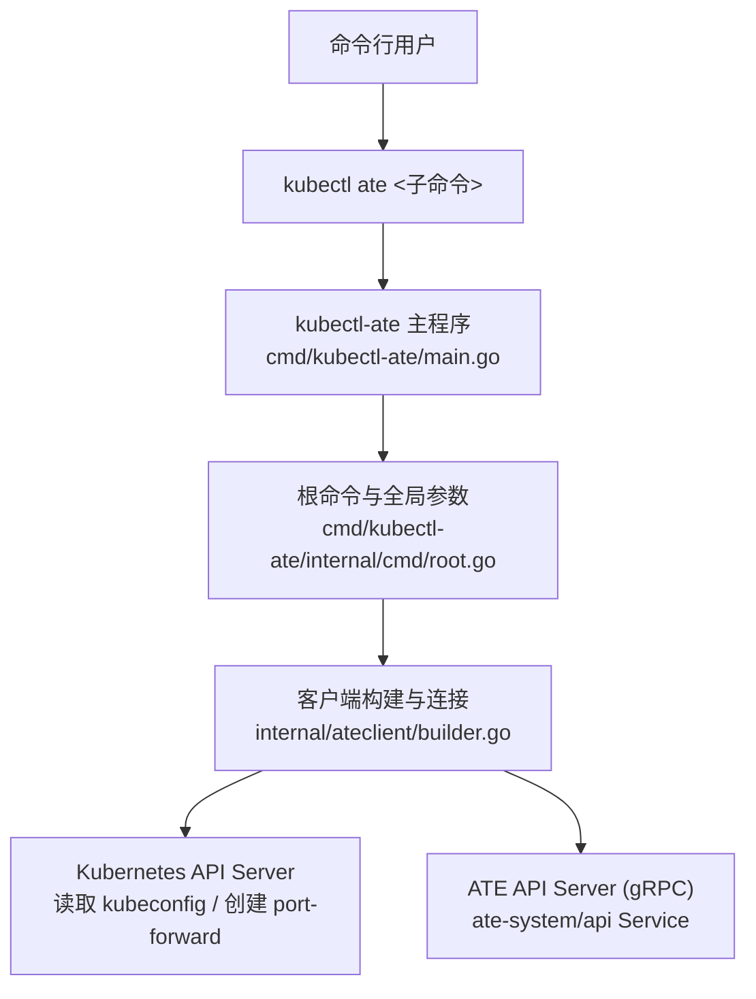
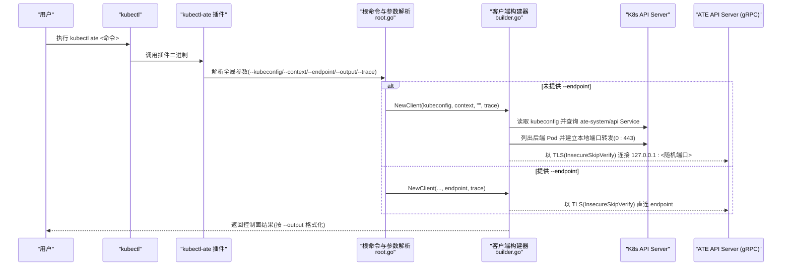
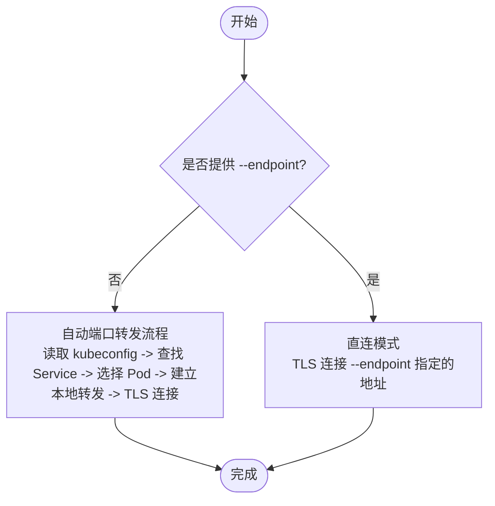
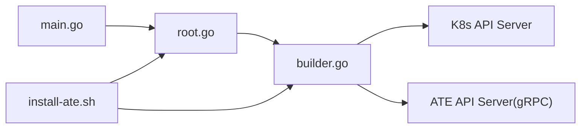

# 安装与设置

<cite>
**本文引用的文件**
- [cmd/kubectl-ate/README.md](file://cmd/kubectl-ate/README.md)
- [cmd/kubectl-ate/main.go](file://cmd/kubectl-ate/main.go)
- [cmd/kubectl-ate/internal/cmd/root.go](file://cmd/kubectl-ate/internal/cmd/root.go)
- [internal/ateclient/builder.go](file://internal/ateclient/builder.go)
- [hack/install-ate.sh](file://hack/install-ate.sh)
</cite>

## 目录
1. [简介](#简介)
2. [项目结构](#项目结构)
3. [核心组件](#核心组件)
4. [架构总览](#架构总览)
5. [详细组件分析](#详细组件分析)
6. [依赖关系分析](#依赖关系分析)
7. [性能考虑](#性能考虑)
8. [故障排除指南](#故障排除指南)
9. [结论](#结论)

## 简介
本指南面向首次使用 kubectl-ate CLI 的用户，覆盖以下主题：
- 两种安装方式：作为原生 kubectl 插件安装、通过 go install 安装
- 开发环境直接运行方法
- 连接配置：自动端口转发与手动 endpoint 配置
- 认证配置：mTLS 与 JWT 模式
- 环境变量与全局选项
- 调试与追踪（trace）
- 常见问题与排障建议

## 项目结构
kubectl-ate 是 Substrate 的 Kubernetes 原生 CLI 插件，入口位于 cmd/kubectl-ate。其根命令定义在 internal/cmd/root.go，负责解析全局参数并初始化输出格式校验等前置逻辑；实际执行由 main.go 调用 cmd.Execute() 启动。

图表来源
- [cmd/kubectl-ate/main.go:1-24](file://cmd/kubectl-ate/main.go#L1-L24)
- [cmd/kubectl-ate/internal/cmd/root.go:34-61](file://cmd/kubectl-ate/internal/cmd/root.go#L34-L61)
- [internal/ateclient/builder.go:70-92](file://internal/ateclient/builder.go#L70-L92)

章节来源
- [cmd/kubectl-ate/main.go:1-24](file://cmd/kubectl-ate/main.go#L1-L24)
- [cmd/kubectl-ate/internal/cmd/root.go:34-61](file://cmd/kubectl-ate/internal/cmd/root.go#L34-L61)

## 核心组件
- 根命令与全局参数
  - --kubeconfig：指定 kubeconfig 路径
  - --context：指定 kubeconfig context
  - --endpoint：手动指定 gRPC 目标地址（跳过自动端口转发）
  - --output/-o：输出格式（table/json/yaml），默认 table
  - --trace：开启单次请求的追踪
- 客户端连接
  - 未提供 --endpoint 时，自动发现 ate-system 命名空间下的 api Service，选择其一 Pod 建立本地端口转发到 443，并以 InsecureSkipVerify TLS 直连 localhost
  - 提供 --endpoint 时，直接以 TLS 连接该端点（同样 InsecureSkipVerify）
- 追踪
  - 启用 --trace 后，为每次 gRPC 调用注入 OpenTelemetry Span，并在 stderr 打印 Trace ID

章节来源
- [cmd/kubectl-ate/internal/cmd/root.go:54-61](file://cmd/kubectl-ate/internal/cmd/root.go#L54-L61)
- [internal/ateclient/builder.go:70-92](file://internal/ateclient/builder.go#L70-L92)
- [internal/ateclient/builder.go:126-211](file://internal/ateclient/builder.go#L126-L211)
- [internal/ateclient/builder.go:338-351](file://internal/ateclient/builder.go#L338-L351)

## 架构总览
下图展示了 kubectl-ate 在不同模式下的连接路径与关键组件交互。

图表来源
- [cmd/kubectl-ate/internal/cmd/root.go:54-61](file://cmd/kubectl-ate/internal/cmd/root.go#L54-L61)
- [internal/ateclient/builder.go:70-92](file://internal/ateclient/builder.go#L70-L92)
- [internal/ateclient/builder.go:126-211](file://internal/ateclient/builder.go#L126-L211)

## 详细组件分析

### 安装方式一：作为原生 kubectl 插件安装
- 原理
  - 将编译产物命名为 kubectl-ate 并放入 PATH 中，kubectl 会自动识别为插件，支持 kubectl ate <子命令> 调用。
- 步骤
  - 在项目根目录下执行安装命令，将二进制安装至 Go 的 bin 目录（需确保已在 PATH）。
  - 安装完成后即可在任何位置使用 kubectl ate 子命令。
- 参考
  - 安装说明与示例见 README 中的“Install as a native kubectl Plugin”段落。

章节来源
- [cmd/kubectl-ate/README.md:9-15](file://cmd/kubectl-ate/README.md#L9-L15)

### 安装方式二：使用 go install 安装
- 说明
  - 通过 go install 直接编译并安装二进制，便于快速迭代或 CI 集成。
- 步骤
  - 在项目根目录下执行 go install 指向 kubectl-ate 源码包。
  - 安装后同样可通过 kubectl ate 调用。
- 参考
  - 安装说明与示例见 README 中的“go install”段落。

章节来源
- [cmd/kubectl-ate/README.md:10-14](file://cmd/kubectl-ate/README.md#L10-L14)

### 开发环境直接运行
- 说明
  - 无需编译，直接从源码树运行，适合调试与快速验证。
- 步骤
  - 在项目根目录下使用 go run 指定入口包并传入子命令。
- 参考
  - 运行说明与示例见 README 中的“Run directly from source (Development)”段落。

章节来源
- [cmd/kubectl-ate/README.md:17-22](file://cmd/kubectl-ate/README.md#L17-L22)

### 连接配置：自动端口转发与手动 endpoint
- 自动端口转发
  - 当不提供 --endpoint 时，工具会：
    - 加载 kubeconfig 与 context
    - 查询 ate-system 命名空间下的 api Service
    - 选取一个后端 Pod，建立本地端口转发到 443
    - 以 TLS（InsecureSkipVerify）连接本地端口
- 手动 endpoint
  - 提供 --endpoint 时，跳过端口转发，直接以 TLS（InsecureSkipVerify）连接指定地址。
- 适用场景
  - 自动转发适用于本地开发或不在集群内的情况
  - 手动 endpoint 适用于从集群内或其他网络可达位置直连

图表来源
- [internal/ateclient/builder.go:70-92](file://internal/ateclient/builder.go#L70-L92)
- [internal/ateclient/builder.go:126-211](file://internal/ateclient/builder.go#L126-L211)

章节来源
- [internal/ateclient/builder.go:70-92](file://internal/ateclient/builder.go#L70-L92)
- [internal/ateclient/builder.go:126-211](file://internal/ateclient/builder.go#L126-L211)

### 认证配置：mTLS 与 JWT
- 认证模式
  - mTLS：服务端证书校验基于服务证书链，客户端身份由 mTLS 凭证提供
  - JWT：服务端校验证书 CA，客户端发送 Bearer Token 作为每 RPC 凭据
- 安装脚本对认证模式的支持
  - 通过环境变量 ATE_API_AUTH_MODE 控制部署时的认证模式（mtls 或 jwt）
  - 安装脚本会根据模式渲染不同的 overlay 并应用资源
- 客户端侧行为
  - 当前 CLI 的连接层统一使用 TLS（InsecureSkipVerify）进行本地或直连通信
  - 若需要更严格的认证策略，请结合部署环境的证书与 RBAC 策略进行管控

章节来源
- [hack/install-ate.sh:135-145](file://hack/install-ate.sh#L135-L145)
- [hack/install-ate.sh:147-167](file://hack/install-ate.sh#L147-L167)
- [internal/ateclient/builder.go:94-116](file://internal/ateclient/builder.go#L94-L116)

### 环境变量与全局选项
- 全局选项（可附加到任意子命令）
  - --kubeconfig：kubeconfig 文件路径
  - --context：kubeconfig context 名称
  - --endpoint：手动 gRPC 目标地址
  - --output/-o：输出格式（table/json/yaml）
  - --trace：开启本次请求的追踪
- 安装与环境变量
  - ATE_API_AUTH_MODE：控制安装时使用的认证模式（mtls 或 jwt）
  - KUBECTL_CONTEXT：在安装脚本中用于传递上下文给 kubectl 与 kubectl-ate 调用
- 参考
  - 全局选项定义见 root.go 的 PersistentFlags
  - 安装脚本中对 ATE_API_AUTH_MODE 的处理与渲染逻辑

章节来源
- [cmd/kubectl-ate/internal/cmd/root.go:54-61](file://cmd/kubectl-ate/internal/cmd/root.go#L54-L61)
- [hack/install-ate.sh:135-145](file://hack/install-ate.sh#L135-L145)
- [hack/install-ate.sh:100-110](file://hack/install-ate.sh#L100-L110)

### 调试与追踪（trace）
- 启用追踪
  - 在任意命令后追加 --trace，CLI 会为本次请求生成 Trace ID 并注入到 gRPC 调用中
  - 本地 kind 环境已预置 OpenTelemetry Collector 与 Jaeger，只需转发 Jaeger UI 端口即可查看
- 查看 Trace
  - 通过 kubectl port-forward 暴露 Jaeger UI，然后在浏览器中搜索最近一次 Trace
- 参考
  - README 中的 Tracing 部分提供了完整的前置条件与操作步骤

章节来源
- [cmd/kubectl-ate/README.md:29-59](file://cmd/kubectl-ate/README.md#L29-L59)
- [internal/ateclient/builder.go:338-351](file://internal/ateclient/builder.go#L338-L351)

## 依赖关系分析
- 入口与命令解析
  - main.go 仅负责调用 cmd.Execute()
  - root.go 定义根命令与全局参数，并对输出格式做基础校验
- 客户端与连接
  - builder.go 实现 NewClient，根据是否提供 endpoint 决定自动端口转发或直连
  - 自动转发流程依赖 K8s API Server 获取 Service 与 Pod 信息
- 安装脚本
  - hack/install-ate.sh 封装了系统部署、认证模式选择、资源渲染与应用等流程

图表来源
- [cmd/kubectl-ate/main.go:21-23](file://cmd/kubectl-ate/main.go#L21-L23)
- [cmd/kubectl-ate/internal/cmd/root.go:34-61](file://cmd/kubectl-ate/internal/cmd/root.go#L34-L61)
- [internal/ateclient/builder.go:70-92](file://internal/ateclient/builder.go#L70-L92)
- [hack/install-ate.sh:135-167](file://hack/install-ate.sh#L135-L167)

章节来源
- [cmd/kubectl-ate/main.go:21-23](file://cmd/kubectl-ate/main.go#L21-L23)
- [cmd/kubectl-ate/internal/cmd/root.go:34-61](file://cmd/kubectl-ate/internal/cmd/root.go#L34-L61)
- [internal/ateclient/builder.go:70-92](file://internal/ateclient/builder.go#L70-L92)
- [hack/install-ate.sh:135-167](file://hack/install-ate.sh#L135-L167)

## 性能考虑
- 自动端口转发会在本地打开随机端口并维持长连接，避免频繁重连开销
- 直连模式减少中间转发环节，适合高吞吐或低延迟场景
- 输出格式建议使用 json 或 yaml 以便自动化处理，table 更适合人类阅读

[本节为通用指导，不直接分析具体文件]

## 故障排除指南
- 无法找到 ate-api-server Pod
  - 现象：自动端口转发失败，提示未找到 Pod
  - 排查：确认 ate-system 命名空间存在且 api Service 有后端 Pod
  - 参考：自动转发流程中 Service 与 Pod 列表查询逻辑
- 认证错误
  - 现象：连接被拒绝或鉴权失败
  - 排查：检查 ATE_API_AUTH_MODE 是否与部署一致；确认 kubeconfig 与 context 正确
  - 参考：安装脚本对认证模式的校验与渲染
- 追踪不可用
  - 现象：--trace 无效果或无法查看 Trace
  - 排查：确认已启用相关 API 与 Managed OpenTelemetry；kind 环境下转发 Jaeger UI 端口
  - 参考：README 中的 Tracing 前置条件与操作指引

章节来源
- [internal/ateclient/builder.go:126-211](file://internal/ateclient/builder.go#L126-L211)
- [hack/install-ate.sh:135-145](file://hack/install-ate.sh#L135-L145)
- [cmd/kubectl-ate/README.md:29-59](file://cmd/kubectl-ate/README.md#L29-L59)

## 结论
kubectl-ate 提供了便捷的 kubectl 插件体验，支持自动端口转发与手动 endpoint 两种连接方式，配合全局选项与追踪能力，便于开发与运维。安装上既可作为原生插件长期安装，也可通过 go install 快速部署。认证方面支持 mTLS 与 JWT 模式，安装脚本提供了相应的开关与资源渲染。遇到问题时，可依据上述排障建议逐步定位。
