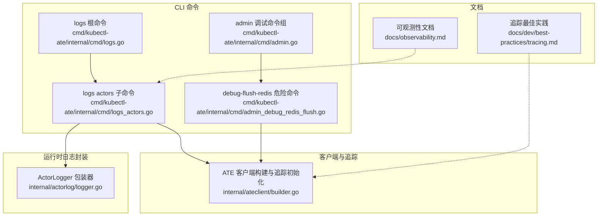
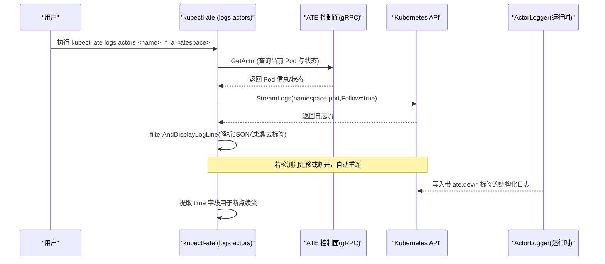
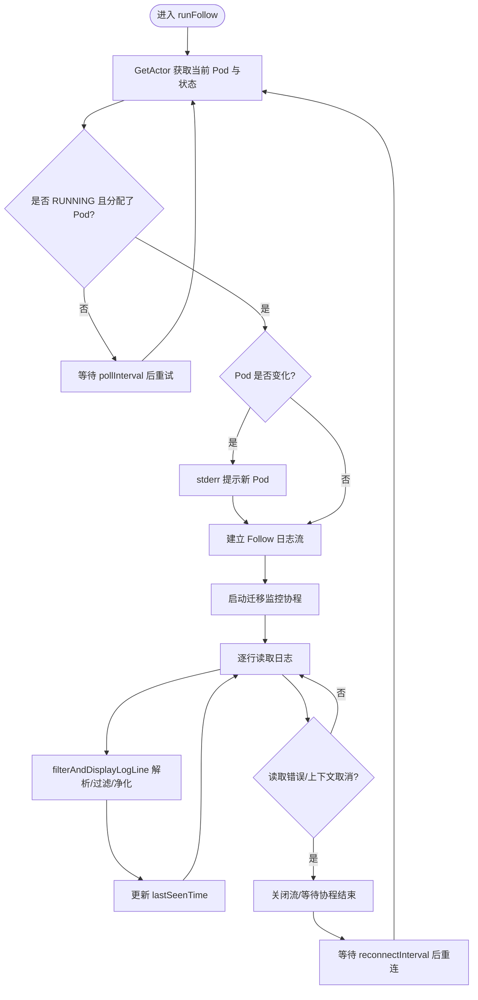
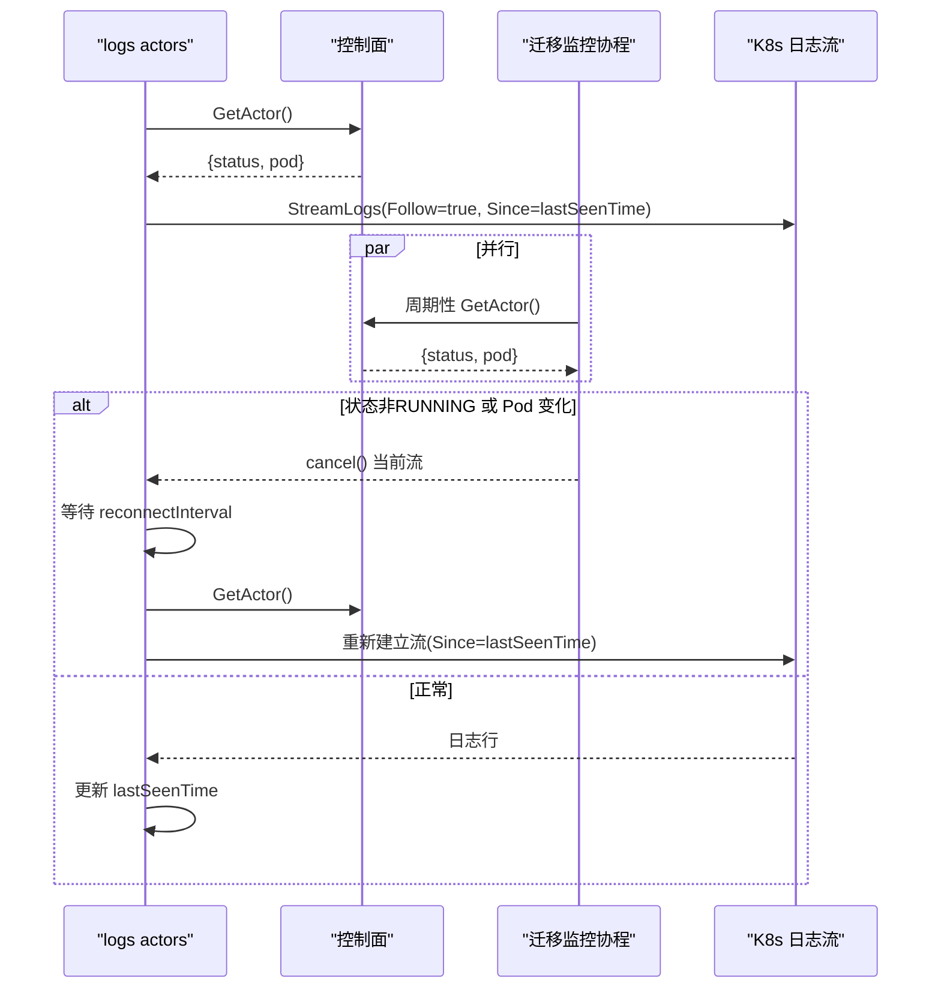
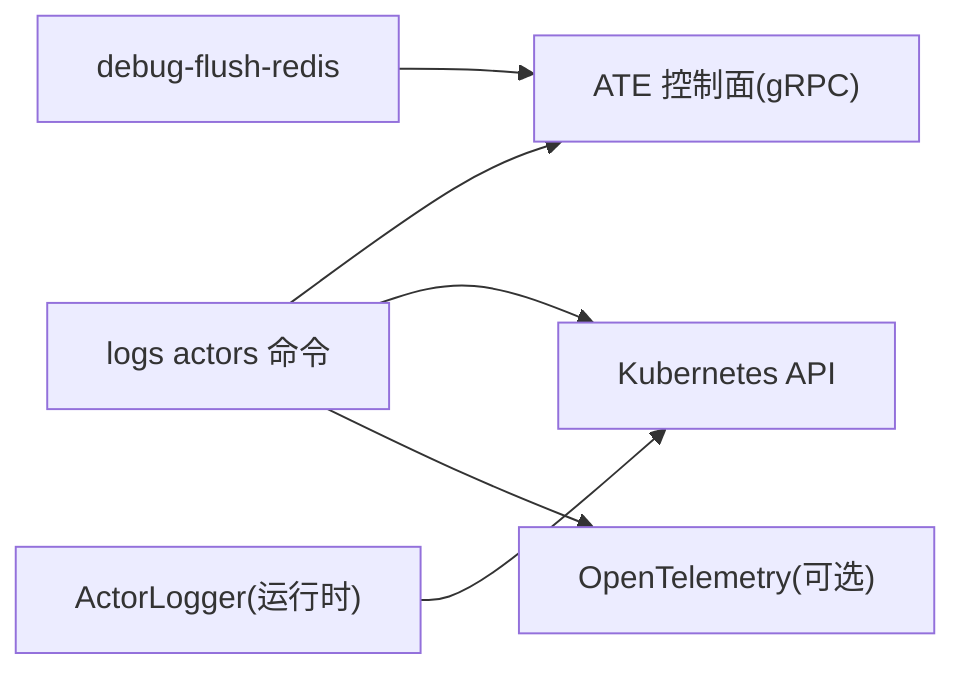

# 日志与调试

<cite>
**本文引用的文件**   
- [logs.go](file://cmd/kubectl-ate/internal/cmd/logs.go)
- [logs_actors.go](file://cmd/kubectl-ate/internal/cmd/logs_actors.go)
- [logger.go](file://internal/actorlog/logger.go)
- [observability.md](file://docs/observability.md)
- [tracing.md](file://docs/dev/best-practices/tracing.md)
- [admin.go](file://cmd/kubectl-ate/internal/cmd/admin.go)
- [admin_debug_redis_flush.go](file://cmd/kubectl-ate/internal/cmd/admin_debug_redis_flush.go)
- [builder.go](file://internal/ateclient/builder.go)
</cite>

## 目录
1. [简介](#简介)
2. [项目结构](#项目结构)
3. [核心组件](#核心组件)
4. [架构总览](#架构总览)
5. [详细组件分析](#详细组件分析)
6. [依赖关系分析](#依赖关系分析)
7. [性能考虑](#性能考虑)
8. [故障排除指南](#故障排除指南)
9. [结论](#结论)
10. [附录](#附录)

## 简介
本文件面向使用 Agent Substrate 的运维与开发者，聚焦日志收集、调试与追踪（tracing）能力。内容覆盖：
- logs 命令的使用方式，包括实时流式传输与聚合过滤
- Actor 迁移时的日志连续性保证机制
- 调试命令（如 Redis 状态清理等危险操作）的使用说明
- 追踪功能的配置与使用方法
- 日志格式、过滤选项与输出配置
- 故障排除与性能调优建议

## 项目结构
与日志和调试相关的代码主要分布在以下位置：
- CLI 子命令与实现：cmd/kubectl-ate/internal/cmd
- Actor 结构化日志封装：internal/actorlog
- 可观测性文档：docs/observability.md、docs/dev/best-practices/tracing.md
- 客户端构建与追踪初始化：internal/ateclient

图表来源
- [logs.go:21-28](file://cmd/kubectl-ate/internal/cmd/logs.go#L21-L28)
- [logs_actors.go:44-57](file://cmd/kubectl-ate/internal/cmd/logs_actors.go#L44-L57)
- [admin.go:21-28](file://cmd/kubectl-ate/internal/cmd/admin.go#L21-L28)
- [admin_debug_redis_flush.go:25-48](file://cmd/kubectl-ate/internal/cmd/admin_debug_redis_flush.go#L25-L48)
- [logger.go:50-85](file://internal/actorlog/logger.go#L50-L85)
- [builder.go:71-92](file://internal/ateclient/builder.go#L71-L92)

章节来源
- [logs.go:1-29](file://cmd/kubectl-ate/internal/cmd/logs.go#L1-L29)
- [logs_actors.go:1-57](file://cmd/kubectl-ate/internal/cmd/logs_actors.go#L1-L57)
- [admin.go:1-29](file://cmd/kubectl-ate/internal/cmd/admin.go#L1-L29)
- [admin_debug_redis_flush.go:1-48](file://cmd/kubectl-ate/internal/cmd/admin_debug_redis_flush.go#L1-L48)
- [logger.go:1-85](file://internal/actorlog/logger.go#L1-L85)
- [builder.go:71-92](file://internal/ateclient/builder.go#L71-L92)

## 核心组件
- logs 根命令：提供“打印资源日志”的统一入口，挂载子命令。
- logs actors 子命令：针对特定 Actor 的日志查看与流式跟踪，支持按 atespace 过滤、自动重连与迁移感知。
- ActorLogger：在运行期将容器标准输出包装为结构化 JSON，注入 ate.dev/* 标签，并生成生命周期事件。
- admin debug-flush-redis：危险管理命令，通过控制面接口清空 Redis 数据。
- ATE 客户端构建器：负责 gRPC 连接、端口转发、鉴权以及可选的 OpenTelemetry 追踪初始化。

章节来源
- [logs.go:21-28](file://cmd/kubectl-ate/internal/cmd/logs.go#L21-L28)
- [logs_actors.go:44-57](file://cmd/kubectl-ate/internal/cmd/logs_actors.go#L44-L57)
- [logger.go:50-85](file://internal/actorlog/logger.go#L50-L85)
- [admin_debug_redis_flush.go:25-48](file://cmd/kubectl-ate/internal/cmd/admin_debug_redis_flush.go#L25-L48)
- [builder.go:71-92](file://internal/ateclient/builder.go#L71-L92)

## 架构总览
下图展示了从 CLI 到控制面与 Kubernetes API 的调用路径，以及日志包装与追踪注入的关键点。

图表来源
- [logs_actors.go:147-244](file://cmd/kubectl-ate/internal/cmd/logs_actors.go#L147-L244)
- [logs_actors.go:309-391](file://cmd/kubectl-ate/internal/cmd/logs_actors.go#L309-L391)
- [logger.go:103-172](file://internal/actorlog/logger.go#L103-L172)

## 详细组件分析

### logs 命令与 logs actors 子命令
- 功能要点
  - 单行快照模式：一次性拉取当前运行 Pod 的日志，非流式。
  - 流式模式（--follow/-f）：持续跟踪日志，支持断线重连与 Actor 迁移感知。
  - 过滤：基于结构化 JSON 中的 ate.dev/actor_name 与 ate.dev/actor_atespace 进行匹配。
  - 输出净化：移除 ate.dev/* 标签，保留业务 JSON；若无时间字段则补回时间。
  - 断点续流：记录最后一条日志的时间戳，重连时使用 SinceTime 避免重复。
- 关键流程
  - runOneShot：获取 Actor 当前 Pod，直接拉取一次日志。
  - runFollow：循环轮询控制面，检测状态变化与 Pod 变更；建立流后启动迁移监控协程；扫描日志时更新 lastSeenTime；异常与取消处理并重连。
  - startMigrationMonitor：定时查询控制面，若 Actor 被挂起或迁移到新 Pod，主动取消当前流上下文以触发重连。
  - filterAndDisplayLogLine：解析 JSON、提取时间、校验 atespace+actorName 匹配、删除 ate.dev/* 标签、统一输出格式。

图表来源
- [logs_actors.go:147-244](file://cmd/kubectl-ate/internal/cmd/logs_actors.go#L147-L244)
- [logs_actors.go:246-277](file://cmd/kubectl-ate/internal/cmd/logs_actors.go#L246-L277)
- [logs_actors.go:309-391](file://cmd/kubectl-ate/internal/cmd/logs_actors.go#L309-L391)

章节来源
- [logs.go:21-28](file://cmd/kubectl-ate/internal/cmd/logs.go#L21-L28)
- [logs_actors.go:44-57](file://cmd/kubectl-ate/internal/cmd/logs_actors.go#L44-L57)
- [logs_actors.go:111-145](file://cmd/kubectl-ate/internal/cmd/logs_actors.go#L111-L145)
- [logs_actors.go:147-244](file://cmd/kubectl-ate/internal/cmd/logs_actors.go#L147-L244)
- [logs_actors.go:246-277](file://cmd/kubectl-ate/internal/cmd/logs_actors.go#L246-L277)
- [logs_actors.go:309-391](file://cmd/kubectl-ate/internal/cmd/logs_actors.go#L309-L391)

### Actor 迁移时的日志连续性保证
- 设计目标
  - 在 Actor 被挂起并在不同 Worker Pod 恢复时，CLI 能无缝继续输出后续日志，不丢失也不重复。
- 实现机制
  - 控制面轮询：runFollow 周期调用 GetActor，一旦发现状态非 RUNNING 或 Pod 名称变化，立即取消当前流上下文。
  - 迁移监控协程：startMigrationMonitor 独立于主扫描循环，定期探测状态与 Pod 归属，提前触发重连。
  - 断点续流：每次成功解析一行日志即更新 lastSeenTime；重连时设置 SinceTime，仅拉取该时间点之后的日志。
  - 缓冲与容错：支持超长行缓冲上限；对常见错误（如流中断）进行友好提示并自动重连。

图表来源
- [logs_actors.go:147-244](file://cmd/kubectl-ate/internal/cmd/logs_actors.go#L147-L244)
- [logs_actors.go:246-277](file://cmd/kubectl-ate/internal/cmd/logs_actors.go#L246-L277)
- [logs_actors.go:309-391](file://cmd/kubectl-ate/internal/cmd/logs_actors.go#L309-L391)

章节来源
- [logs_actors.go:147-244](file://cmd/kubectl-ate/internal/cmd/logs_actors.go#L147-L244)
- [logs_actors.go:246-277](file://cmd/kubectl-ate/internal/cmd/logs_actors.go#L246-L277)
- [logs_actors.go:309-391](file://cmd/kubectl-ate/internal/cmd/logs_actors.go#L309-L391)

### 日志格式与过滤选项
- 运行时日志格式
  - 所有 Actor 容器输出均被 ActorLogger 包装为结构化 JSON，包含：
    - time：RFC3339Nano 时间戳
    - message：原始消息或包装后的文本
    - labels 或 logging.googleapis.com/labels：包含 ate.dev/* 元数据标签
  - 生命周期事件：EmitLifecycleLog 会输出统一的合成事件，便于审计与排障。
- CLI 输出净化
  - 过滤条件：同时匹配 actorName 与 atespace，确保跨 atespace 复用同一 Pod 时的准确性。
  - 输出净化：删除 ate.dev/* 标签，保持与标准 kubectl logs 一致的简洁 JSON 行；若原行无 time，则在输出中补回。
- 聚合与多维查询
  - 借助 ate.dev/* 标签，可在集中式日志后端按 Actor、Atespace、模板、Pod 等多维度聚合查询。

章节来源
- [logger.go:50-85](file://internal/actorlog/logger.go#L50-L85)
- [logger.go:103-172](file://internal/actorlog/logger.go#L103-L172)
- [logs_actors.go:309-391](file://cmd/kubectl-ate/internal/cmd/logs_actors.go#L309-L391)
- [observability.md:9-17](file://docs/observability.md#L9-L17)
- [observability.md:68-100](file://docs/observability.md#L68-L100)

### 调试命令：Redis 状态清理（危险操作）
- 命令入口
  - admin 命令组提供调试与管理能力。
  - debug-flush-redis 子命令用于清空 Redis 全部数据，属于高危操作，请谨慎使用。
- 行为说明
  - 通过 ATE 客户端调用控制面的 DebugClear 接口完成清理。
  - 成功后输出确认信息。
- 使用建议
  - 仅在受控环境（如本地开发或明确授权的生产排障）中使用。
  - 使用前确保已备份必要状态或确认可重建。

章节来源
- [admin.go:21-28](file://cmd/kubectl-ate/internal/cmd/admin.go#L21-L28)
- [admin_debug_redis_flush.go:25-48](file://cmd/kubectl-ate/internal/cmd/admin_debug_redis_flush.go#L25-L48)

### 追踪（Tracing）配置与使用
- 客户端侧
  - 全局标志 --trace：启用后，客户端初始化 TracerProvider 并使用 AlwaysSample 采样策略，gRPC 调用链注入 TraceContext。
  - 首次请求会在 stderr 打印 Trace ID，便于在 Jaeger/GCP Trace 中检索。
- 服务端侧
  - 服务端默认 NeverSample，仅在请求携带追踪头时采样，避免生产开销。
  - 通过环境变量 OTEL_EXPORTER_OTLP_ENDPOINT 指定 OTLP 导出端点。
- 可视化
  - Kind 环境：自动部署 OpenTelemetry Collector 与 Jaeger，可通过端口转发访问 UI。
  - GKE 环境：通过 Google Managed Prometheus/Trace 进行采集与展示。

章节来源
- [builder.go:312-351](file://internal/ateclient/builder.go#L312-L351)
- [builder.go:71-92](file://internal/ateclient/builder.go#L71-L92)
- [tracing.md:32-95](file://docs/dev/best-practices/tracing.md#L32-L95)
- [observability.md:137-166](file://docs/observability.md#L137-L166)

## 依赖关系分析
- 组件耦合
  - logs actors 依赖 ATE 控制面（获取 Actor 状态与 Pod 信息）与 Kubernetes API（拉取 Pod 日志）。
  - 运行时日志由 ActorLogger 注入 ate.dev/* 标签，CLI 据此进行过滤与净化。
  - 追踪贯穿客户端与服务端，客户端通过 gRPC StatsHandler 与拦截器注入上下文。
- 外部依赖
  - gRPC 与 TLS 证书处理
  - Kubernetes Clientset 与 PortForward
  - OpenTelemetry SDK 与传播器

图表来源
- [logs_actors.go:279-307](file://cmd/kubectl-ate/internal/cmd/logs_actors.go#L279-L307)
- [builder.go:71-92](file://internal/ateclient/builder.go#L71-L92)
- [admin_debug_redis_flush.go:25-48](file://cmd/kubectl-ate/internal/cmd/admin_debug_redis_flush.go#L25-L48)

章节来源
- [logs_actors.go:279-307](file://cmd/kubectl-ate/internal/cmd/logs_actors.go#L279-L307)
- [builder.go:71-92](file://internal/ateclient/builder.go#L71-L92)
- [admin_debug_redis_flush.go:25-48](file://cmd/kubectl-ate/internal/cmd/admin_debug_redis_flush.go#L25-L48)

## 性能考虑
- 日志流缓冲
  - 支持最大 1MB 的单行缓冲，避免超大日志导致内存压力。
- 重连与轮询间隔
  - 默认轮询与重连间隔分别为 2s 与 1s，可根据网络与集群规模调整，平衡实时性与负载。
- 过滤与序列化
  - 每行 JSON 解码/编码会带来 CPU 开销，建议在集中式日志后端做过滤与索引，减少 CLI 侧负担。
- 追踪采样
  - 客户端默认 AlwaysSample（当启用 --trace），服务端默认 NeverSample，按需开启以避免额外开销。

[本节为通用指导，不直接分析具体文件]

## 故障排除指南
- 常见问题
  - Actor 未运行：单行模式会直接报错提示未在当前 Worker Pod 上运行。
  - 流中断：遇到读取错误或上下文取消，CLI 会提示并自动重连。
  - 长行截断：超过缓冲限制会返回错误，需检查上游日志输出。
- 定位步骤
  - 使用 --trace 标记发起请求，获取 Trace ID 并在 Jaeger/GCP Trace 中查看完整链路。
  - 在集中式日志后端按 ate.dev/* 标签过滤，确认 Actor 生命周期事件与容器日志一致性。
  - 对于 Redis 相关异常，谨慎使用 debug-flush-redis 清理状态后再复现问题。

章节来源
- [logs_actors.go:111-145](file://cmd/kubectl-ate/internal/cmd/logs_actors.go#L111-L145)
- [logs_actors.go:226-244](file://cmd/kubectl-ate/internal/cmd/logs_actors.go#L226-L244)
- [observability.md:137-166](file://docs/observability.md#L137-L166)
- [admin_debug_redis_flush.go:25-48](file://cmd/kubectl-ate/internal/cmd/admin_debug_redis_flush.go#L25-L48)

## 结论
Agent Substrate 通过结构化日志与 ate.dev/* 标签体系，结合 CLI 的迁移感知与断点续流能力，实现了 Actor 生命周期内的连续可观测性。配合 OpenTelemetry 的按需追踪与集中式日志后端的多维聚合，可有效支撑日常排障与性能优化。使用时应遵循最小权限与按需采样原则，谨慎使用危险调试命令。

[本节为总结性内容，不直接分析具体文件]

## 附录
- 常用命令参考
  - 查看单个 Actor 日志（一次性）：kubectl ate logs actors <actor-name> -a <atespace>
  - 实时流式跟踪：kubectl ate logs actors <actor-name> -a <atespace> -f
  - 启用追踪：在上述命令后追加 --trace
  - 危险操作（清空 Redis）：kubectl ate admin debug-flush-redis

章节来源
- [logs_actors.go:44-57](file://cmd/kubectl-ate/internal/cmd/logs_actors.go#L44-L57)
- [builder.go:312-351](file://internal/ateclient/builder.go#L312-L351)
- [admin_debug_redis_flush.go:25-48](file://cmd/kubectl-ate/internal/cmd/admin_debug_redis_flush.go#L25-L48)
