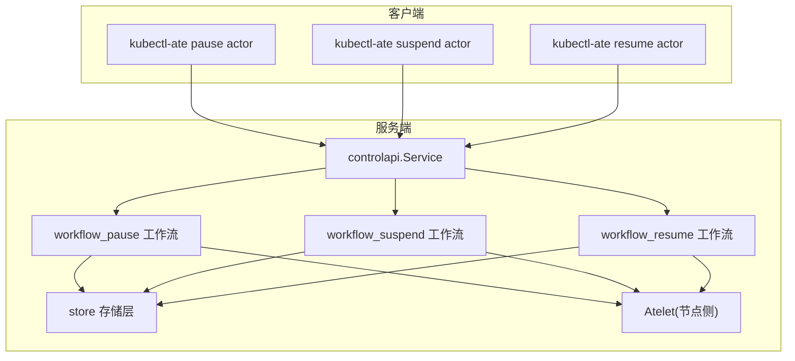
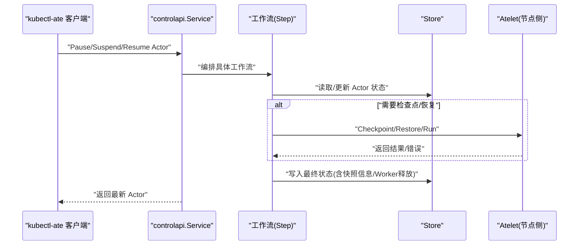
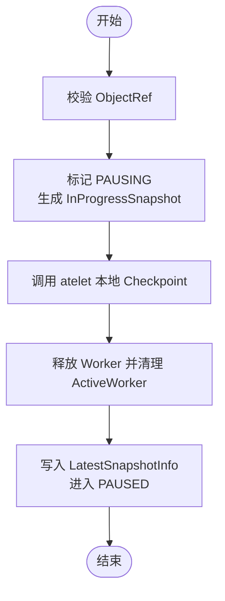
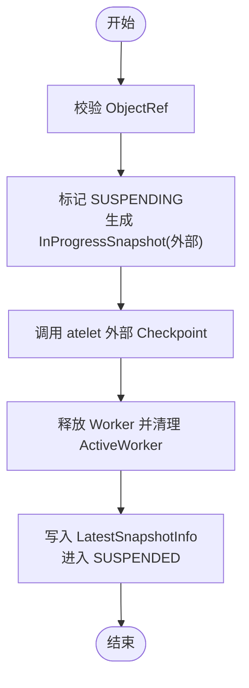
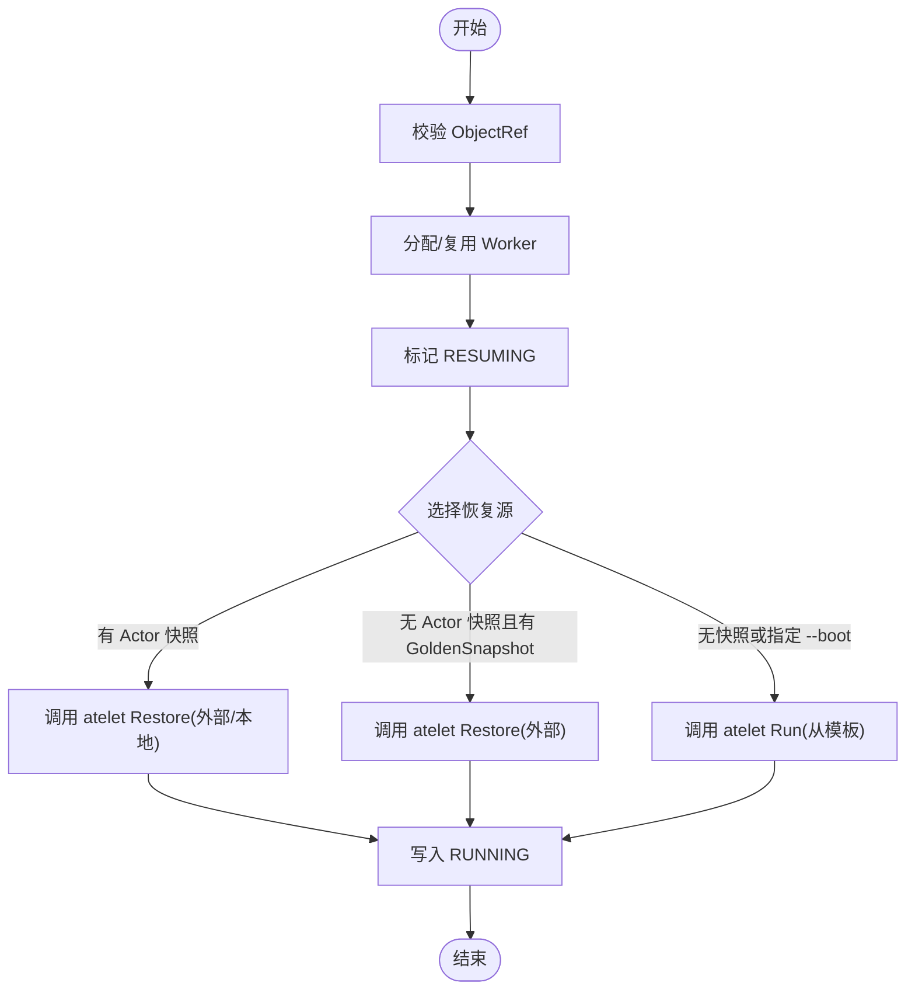
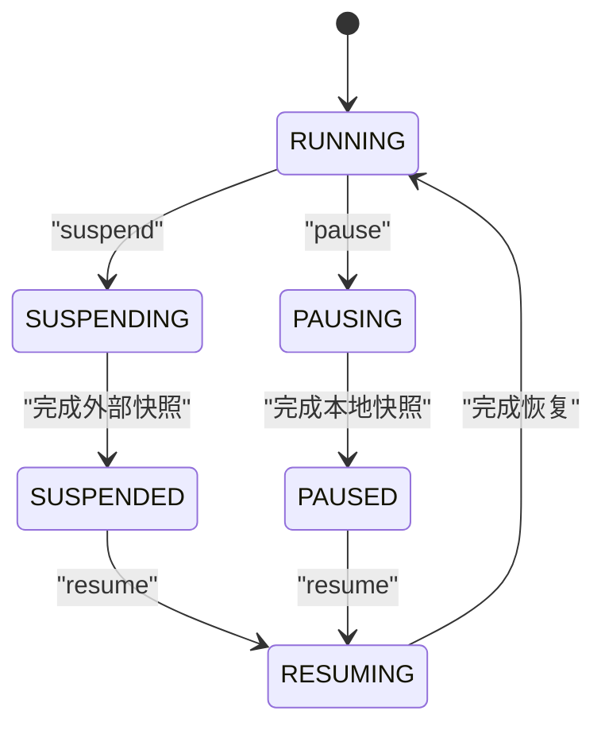
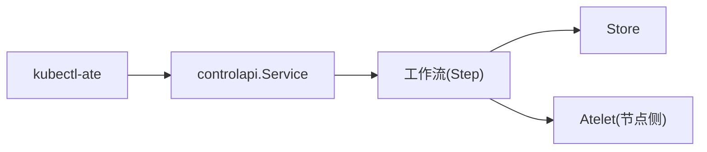

# 生命周期控制命令

<cite>
**本文引用的文件**
- [pause_actor.go](file://cmd/ateapi/internal/controlapi/pause_actor.go)
- [resume_actor.go](file://cmd/ateapi/internal/controlapi/resume_actor.go)
- [suspend_actor.go](file://cmd/ateapi/internal/controlapi/suspend_actor.go)
- [workflow_pause.go](file://cmd/ateapi/internal/controlapi/workflow_pause.go)
- [workflow_resume.go](file://cmd/ateapi/internal/controlapi/workflow_resume.go)
- [workflow_suspend.go](file://cmd/ateapi/internal/controlapi/workflow_suspend.go)
- [pause_actor.go](file://cmd/kubectl-ate/internal/cmd/pause_actor.go)
- [resume_actor.go](file://cmd/kubectl-ate/internal/cmd/resume_actor.go)
- [suspend_actor.go](file://cmd/kubectl-ate/internal/cmd/suspend_actor.go)
- [ateapi.pb.go](file://pkg/proto/ateapipb/ateapi.pb.go)
</cite>

## 目录
1. [简介](#简介)
2. [项目结构](#项目结构)
3. [核心组件](#核心组件)
4. [架构总览](#架构总览)
5. [详细组件分析](#详细组件分析)
6. [依赖关系分析](#依赖关系分析)
7. [性能与可靠性考虑](#性能与可靠性考虑)
8. [故障排查指南](#故障排查指南)
9. [结论](#结论)
10. [附录：使用示例](#附录使用示例)

## 简介
本文件面向需要管理 Actor 生命周期的用户与开发者，系统性说明以下命令的用法、参数、执行流程与状态转换逻辑：
- pause（暂停）：将运行中的 Actor 进行本地快照并释放 Worker，进入 PAUSED。
- suspend（挂起）：将运行中的 Actor 进行外部快照并释放 Worker，进入 SUSPENDED。
- resume（恢复）：从 SUSPENDED 或 PAUSED 恢复为 RUNNING；支持是否跳过“黄金快照”直接启动。

同时明确四种关键状态的转换规则：
- STATUS_RESUMING：正在恢复中
- STATUS_RUNNING：运行中
- STATUS_SUSPENDING：正在挂起中
- STATUS_SUSPENDED：已挂起

此外，文档还包含错误处理、重试机制、常见场景与排障建议。

## 项目结构
与生命周期控制相关的代码主要分布在两个层次：
- gRPC 服务端实现：位于 controlapi 包，负责校验请求、编排工作流、持久化状态、调用 atelet 完成实际沙箱操作。
- kubectl 客户端插件：提供命令行入口，构造请求并打印结果。

图表来源
- [pause_actor.go:29-48](file://cmd/ateapi/internal/controlapi/pause_actor.go#L29-L48)
- [resume_actor.go:29-48](file://cmd/ateapi/internal/controlapi/resume_actor.go#L29-L48)
- [suspend_actor.go:29-48](file://cmd/ateapi/internal/controlapi/suspend_actor.go#L29-L48)
- [workflow_pause.go:78-167](file://cmd/ateapi/internal/controlapi/workflow_pause.go#L78-L167)
- [workflow_suspend.go:79-170](file://cmd/ateapi/internal/controlapi/workflow_suspend.go#L79-L170)
- [workflow_resume.go:142-477](file://cmd/ateapi/internal/controlapi/workflow_resume.go#L142-L477)

章节来源
- [pause_actor.go:29-48](file://cmd/ateapi/internal/controlapi/pause_actor.go#L29-L48)
- [resume_actor.go:29-48](file://cmd/ateapi/internal/controlapi/resume_actor.go#L29-L48)
- [suspend_actor.go:29-48](file://cmd/ateapi/internal/controlapi/suspend_actor.go#L29-L48)
- [pause_actor.go:28-55](file://cmd/kubectl-ate/internal/cmd/pause_actor.go#L28-L55)
- [resume_actor.go:29-58](file://cmd/kubectl-ate/internal/cmd/resume_actor.go#L29-L58)
- [suspend_actor.go:28-55](file://cmd/kubectl-ate/internal/cmd/suspend_actor.go#L28-L55)

## 核心组件
- gRPC 服务接口
  - PauseActor：接收暂停请求，校验后交由工作流执行。
  - SuspendActor：接收挂起请求，校验后交由工作流执行。
  - ResumeActor：接收恢复请求，支持 Boot 选项，校验后交由工作流执行。
- 工作流步骤（Step）
  - 加载 Actor 与模板信息
  - 标记中间状态（如 SUSPENDING/PAUSING/RESUMING）
  - 调用 atelet 执行 Checkpoint/Restore/Run
  - 最终化状态并释放 Worker
- 客户端命令
  - kubectl-ate pause/suspend/resume actor：构建 ObjectRef 并调用对应 gRPC 方法，输出 Actor 对象。

章节来源
- [pause_actor.go:29-48](file://cmd/ateapi/internal/controlapi/pause_actor.go#L29-L48)
- [resume_actor.go:29-48](file://cmd/ateapi/internal/controlapi/resume_actor.go#L29-L48)
- [suspend_actor.go:29-48](file://cmd/ateapi/internal/controlapi/suspend_actor.go#L29-L48)
- [workflow_pause.go:78-167](file://cmd/ateapi/internal/controlapi/workflow_pause.go#L78-L167)
- [workflow_suspend.go:79-170](file://cmd/ateapi/internal/controlapi/workflow_suspend.go#L79-L170)
- [workflow_resume.go:142-477](file://cmd/ateapi/internal/controlapi/workflow_resume.go#L142-L477)
- [pause_actor.go:28-55](file://cmd/kubectl-ate/internal/cmd/pause_actor.go#L28-L55)
- [resume_actor.go:29-58](file://cmd/kubectl-ate/internal/cmd/resume_actor.go#L29-L58)
- [suspend_actor.go:28-55](file://cmd/kubectl-ate/internal/cmd/suspend_actor.go#L28-L55)

## 架构总览
下图展示三类命令在客户端与服务端之间的交互，以及工作流如何协调存储与 atelet。

图表来源
- [pause_actor.go:29-48](file://cmd/ateapi/internal/controlapi/pause_actor.go#L29-L48)
- [resume_actor.go:29-48](file://cmd/ateapi/internal/controlapi/resume_actor.go#L29-L48)
- [suspend_actor.go:29-48](file://cmd/ateapi/internal/controlapi/suspend_actor.go#L29-L48)
- [workflow_pause.go:78-167](file://cmd/ateapi/internal/controlapi/workflow_pause.go#L78-L167)
- [workflow_suspend.go:79-170](file://cmd/ateapi/internal/controlapi/workflow_suspend.go#L79-L170)
- [workflow_resume.go:142-477](file://cmd/ateapi/internal/controlapi/workflow_resume.go#L142-L477)

## 详细组件分析

### 状态定义与转换规则
- 状态枚举
  - STATUS_RESUMING：恢复中
  - STATUS_RUNNING：运行中
  - STATUS_SUSPENDING：挂起中
  - STATUS_SUSPENDED：已挂起
  - 另有 PAUSING/PAUSED/CRASHED 等辅助状态用于内部流转与异常保护
- 基本转换约束
  - suspend：仅允许从 RUNNING -> SUSPENDING -> SUSPENDED
  - pause：仅允许从 RUNNING -> PAUSING -> PAUSED
  - resume：仅允许从 SUSPENDED 或 PAUSED -> RESUMING -> RUNNING
  - 任何中间步骤失败且无法安全推进时，可能置为 CRASHED 以终止不可恢复的状态

章节来源
- [ateapi.pb.go:41-76](file://pkg/proto/ateapipb/ateapi.pb.go#L41-L76)
- [workflow_suspend.go:88-93](file://cmd/ateapi/internal/controlapi/workflow_suspend.go#L88-L93)
- [workflow_pause.go:87-93](file://cmd/ateapi/internal/controlapi/workflow_pause.go#L87-L93)
- [workflow_resume.go:154-161](file://cmd/ateapi/internal/controlapi/workflow_resume.go#L154-L161)

### 命令：pause（暂停）
- 功能
  - 对运行中的 Actor 触发本地快照，随后释放 Worker，进入 PAUSED。
- 参数
  - 位置参数：actor-name
  - 标志：--atespace/-a（必填）
- 执行流程
  - 校验 ObjectRef
  - 标记 PAUSING，生成 InProgressSnapshot
  - 连接 atelet 执行本地 Checkpoint
  - 释放 Worker，记录 LatestSnapshotInfo，清理 ActiveWorker 字段，进入 PAUSED
- 错误与重试
  - 并发更新冲突：Aborted（提示重试）
  - 找不到 Actor：NotFound
  - 无可用 Worker 或 Worker 丢失：FailedPrecondition 或 Crash
- 典型用例
  - 临时释放资源但不保留外部快照，后续可快速恢复但需重新拉起进程

图表来源
- [pause_actor.go:29-48](file://cmd/ateapi/internal/controlapi/pause_actor.go#L29-L48)
- [workflow_pause.go:78-167](file://cmd/ateapi/internal/controlapi/workflow_pause.go#L78-L167)
- [workflow_pause.go:169-266](file://cmd/ateapi/internal/controlapi/workflow_pause.go#L169-L266)

章节来源
- [pause_actor.go:29-48](file://cmd/ateapi/internal/controlapi/pause_actor.go#L29-L48)
- [workflow_pause.go:78-167](file://cmd/ateapi/internal/controlapi/workflow_pause.go#L78-L167)
- [workflow_pause.go:169-266](file://cmd/ateapi/internal/controlapi/workflow_pause.go#L169-L266)
- [pause_actor.go:28-55](file://cmd/kubectl-ate/internal/cmd/pause_actor.go#L28-L55)

### 命令：suspend（挂起）
- 功能
  - 对运行中的 Actor 触发外部快照，随后释放 Worker，进入 SUSPENDED。
- 参数
  - 位置参数：actor-name
  - 标志：--atespace/-a（必填）
- 执行流程
  - 校验 ObjectRef
  - 标记 SUSPENDING，生成 InProgressSnapshot（外部路径）
  - 连接 atelet 执行外部 Checkpoint
  - 释放 Worker，记录 LatestSnapshotInfo，清理 ActiveWorker 字段，进入 SUSPENDED
- 错误与重试
  - 并发更新冲突：Aborted（提示重试）
  - 找不到 Actor：NotFound
  - Worker 消失或 Checkpoint 失败：Crash 或 FailedPrecondition
- 典型用例
  - 保存外部快照以便跨节点迁移或长期保留，后续通过 resume 恢复

图表来源
- [suspend_actor.go:29-48](file://cmd/ateapi/internal/controlapi/suspend_actor.go#L29-L48)
- [workflow_suspend.go:79-170](file://cmd/ateapi/internal/controlapi/workflow_suspend.go#L79-L170)
- [workflow_suspend.go:172-249](file://cmd/ateapi/internal/controlapi/workflow_suspend.go#L172-L249)

章节来源
- [suspend_actor.go:29-48](file://cmd/ateapi/internal/controlapi/suspend_actor.go#L29-L48)
- [workflow_suspend.go:79-170](file://cmd/ateapi/internal/controlapi/workflow_suspend.go#L79-L170)
- [workflow_suspend.go:172-249](file://cmd/ateapi/internal/controlapi/workflow_suspend.go#L172-L249)
- [suspend_actor.go:28-55](file://cmd/kubectl-ate/internal/cmd/suspend_actor.go#L28-L55)

### 命令：resume（恢复）
- 功能
  - 从 SUSPENDED 或 PAUSED 恢复为 RUNNING。
  - 可选 --boot：跳过“黄金快照”，直接从模板 spec 启动。
- 参数
  - 位置参数：actor-name
  - 标志：--atespace/-a（必填），--boot（可选）
- 执行流程
  - 校验 ObjectRef
  - 分配 Worker（若已有历史分配则复用并校验一致性）
  - 标记 RESUMING
  - 根据策略选择恢复源：
    - 优先 Actor 自身 LatestSnapshotInfo（外部或本地）
    - 否则使用模板 GoldenSnapshot（除非 --boot）
    - 否则从模板 spec 直接 Run
  - 最终化状态为 RUNNING
- 错误与重试
  - 并发更新冲突：Aborted（提示重试）
  - 找不到 Actor：NotFound
  - 无可用 Worker：FailedPrecondition
  - Worker 不匹配或不合法：Crash 或 Aborted
- 典型用例
  - 从最近的外部快照恢复，或从本地快照恢复，或全新启动

图表来源
- [resume_actor.go:29-48](file://cmd/ateapi/internal/controlapi/resume_actor.go#L29-L48)
- [workflow_resume.go:142-252](file://cmd/ateapi/internal/controlapi/workflow_resume.go#L142-L252)
- [workflow_resume.go:296-446](file://cmd/ateapi/internal/controlapi/workflow_resume.go#L296-L446)
- [workflow_resume.go:448-477](file://cmd/ateapi/internal/controlapi/workflow_resume.go#L448-L477)

章节来源
- [resume_actor.go:29-48](file://cmd/ateapi/internal/controlapi/resume_actor.go#L29-L48)
- [workflow_resume.go:142-252](file://cmd/ateapi/internal/controlapi/workflow_resume.go#L142-L252)
- [workflow_resume.go:296-446](file://cmd/ateapi/internal/controlapi/workflow_resume.go#L296-L446)
- [workflow_resume.go:448-477](file://cmd/ateapi/internal/controlapi/workflow_resume.go#L448-L477)
- [resume_actor.go:29-58](file://cmd/kubectl-ate/internal/cmd/resume_actor.go#L29-L58)

### 状态机图（四类核心状态）

图表来源
- [workflow_suspend.go:88-93](file://cmd/ateapi/internal/controlapi/workflow_suspend.go#L88-L93)
- [workflow_pause.go:87-93](file://cmd/ateapi/internal/controlapi/workflow_pause.go#L87-L93)
- [workflow_resume.go:154-161](file://cmd/ateapi/internal/controlapi/workflow_resume.go#L154-L161)

## 依赖关系分析
- 客户端到服务端
  - kubectl-ate 通过 ateclient 建立 gRPC 连接，构造 ObjectRef 并调用 Service 方法。
- 服务端到存储
  - 工作流各 Step 通过 store.Interface 读写 Actor/Worker 元数据，保证幂等与一致性。
- 服务端到节点侧
  - 通过 AteletDialer 连接目标 Worker Pod 上的 atelet，执行 Checkpoint/Restore/Run。
- 外部依赖
  - Snapshot 类型包括 Local 与 External，分别对应本地与外部存储路径前缀。

图表来源
- [pause_actor.go:29-48](file://cmd/ateapi/internal/controlapi/pause_actor.go#L29-L48)
- [resume_actor.go:29-48](file://cmd/ateapi/internal/controlapi/resume_actor.go#L29-L48)
- [suspend_actor.go:29-48](file://cmd/ateapi/internal/controlapi/suspend_actor.go#L29-L48)
- [workflow_resume.go:296-446](file://cmd/ateapi/internal/controlapi/workflow_resume.go#L296-L446)

章节来源
- [pause_actor.go:29-48](file://cmd/ateapi/internal/controlapi/pause_actor.go#L29-L48)
- [resume_actor.go:29-48](file://cmd/ateapi/internal/controlapi/resume_actor.go#L29-L48)
- [suspend_actor.go:29-48](file://cmd/ateapi/internal/controlapi/suspend_actor.go#L29-L48)
- [workflow_resume.go:296-446](file://cmd/ateapi/internal/controlapi/workflow_resume.go#L296-L446)

## 性能与可靠性考虑
- 幂等与快速前进
  - 各 Step 的 IsComplete 会判断当前状态，避免重复执行已完成步骤。
- 重试与退避
  - 部分步骤（如分配 Worker）内置指数退避与抖动，提高稳定性。
- 快照策略
  - pause 使用本地快照，恢复更快但受限于节点；suspend 使用外部快照，便于迁移与持久化。
- 资源释放
  - 最终化阶段确保释放 Worker 并清理关联字段，防止资源泄漏。

[本节为通用指导，无需特定文件引用]

## 故障排查指南
- 常见错误码与含义
  - InvalidArgument：ObjectRef 缺失或非法
  - NotFound：Actor 不存在
  - FailedPrecondition：状态不满足转换要求（例如非 RUNNING 调用 suspend/pause）
  - Aborted：并发更新冲突，客户端应重试
  - Crash：当 Worker 丢失或状态不一致时，系统主动置为 CRASHED 以终止不可恢复流程
- 定位要点
  - 确认当前状态是否符合预期（查看返回的 Actor.Status）
  - 检查 Worker 是否存在且仍被该 Actor 占用
  - 核对快照路径与权限（外部/本地）
  - 观察 atelet 侧日志，确认 Checkpoint/Restore/Run 是否成功

章节来源
- [pause_actor.go:35-44](file://cmd/ateapi/internal/controlapi/pause_actor.go#L35-L44)
- [resume_actor.go:35-44](file://cmd/ateapi/internal/controlapi/resume_actor.go#L35-L44)
- [suspend_actor.go:35-44](file://cmd/ateapi/internal/controlapi/suspend_actor.go#L35-L44)
- [workflow_pause.go:121-128](file://cmd/ateapi/internal/controlapi/workflow_pause.go#L121-L128)
- [workflow_suspend.go:122-129](file://cmd/ateapi/internal/controlapi/workflow_suspend.go#L122-L129)
- [workflow_resume.go:316-347](file://cmd/ateapi/internal/controlapi/workflow_resume.go#L316-L347)

## 结论
- pause/suspend/resume 提供了完整的 Actor 生命周期管理能力。
- 通过严格的状态机与工作流步骤，系统在异常情况下也能保持健壮性。
- 合理选择快照策略（本地 vs 外部）与恢复方式（快照 vs 黄金快照 vs 从头启动）是运维的关键。

[本节为总结，无需特定文件引用]

## 附录：使用示例
以下为常用场景的命令示例（请替换 <atespace> 与 <actor-name> 为实际值）：
- 暂停一个运行中的 Actor
  - kubectl-ate pause actor <actor-name> --atespace <atespace>
- 挂起一个运行中的 Actor（生成外部快照）
  - kubectl-ate suspend actor <actor-name> --atespace <atespace>
- 从挂起状态恢复（默认尝试从最近快照恢复）
  - kubectl-ate resume actor <actor-name> --atespace <atespace>
- 从挂起状态恢复（跳过黄金快照，直接从模板启动）
  - kubectl-ate resume actor <actor-name> --atespace <atespace> --boot

章节来源
- [pause_actor.go:28-55](file://cmd/kubectl-ate/internal/cmd/pause_actor.go#L28-L55)
- [resume_actor.go:29-58](file://cmd/kubectl-ate/internal/cmd/resume_actor.go#L29-L58)
- [suspend_actor.go:28-55](file://cmd/kubectl-ate/internal/cmd/suspend_actor.go#L28-L55)
