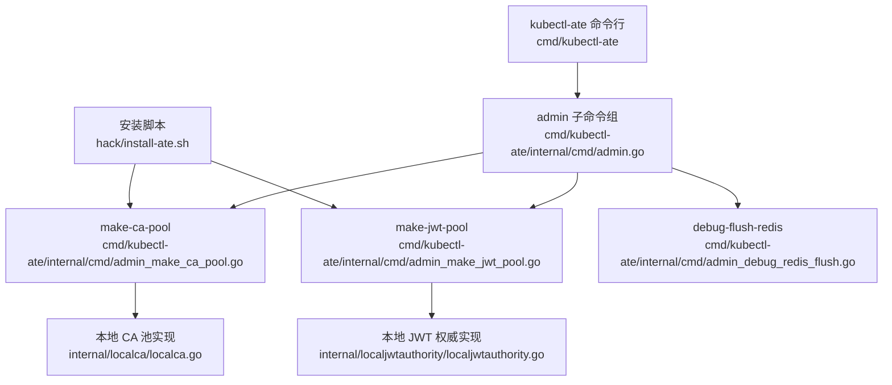
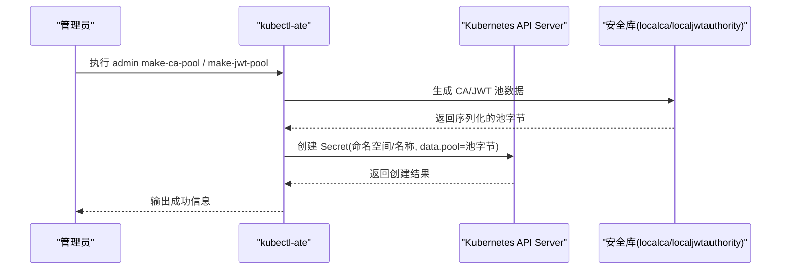
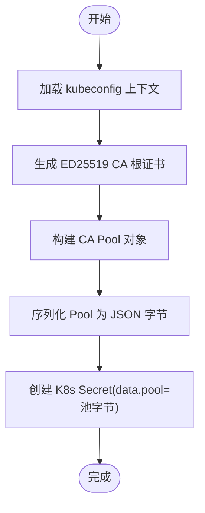
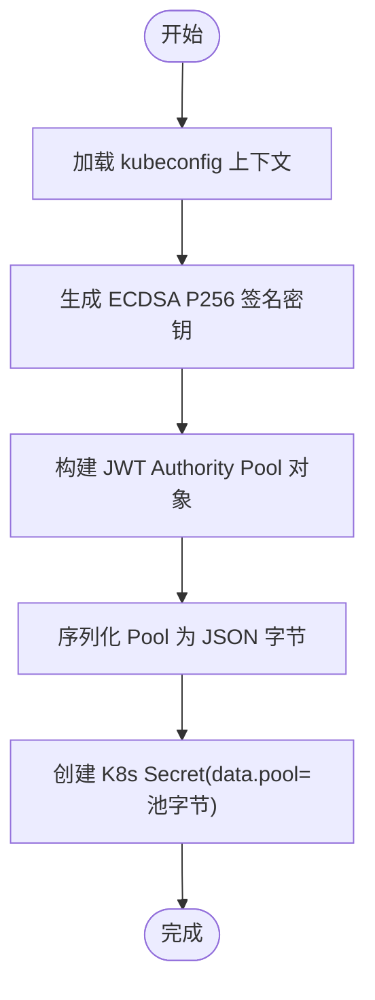
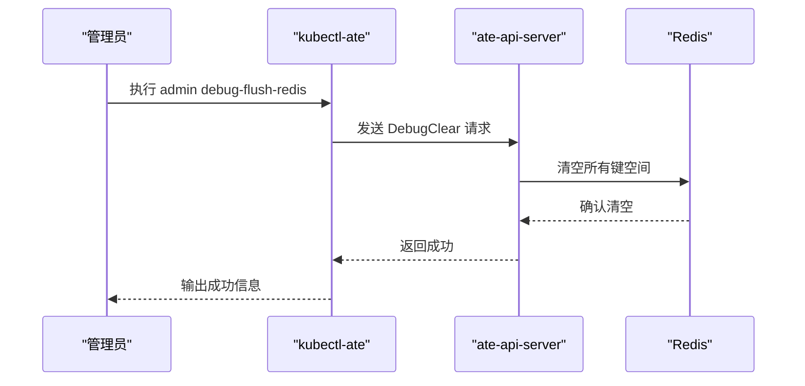
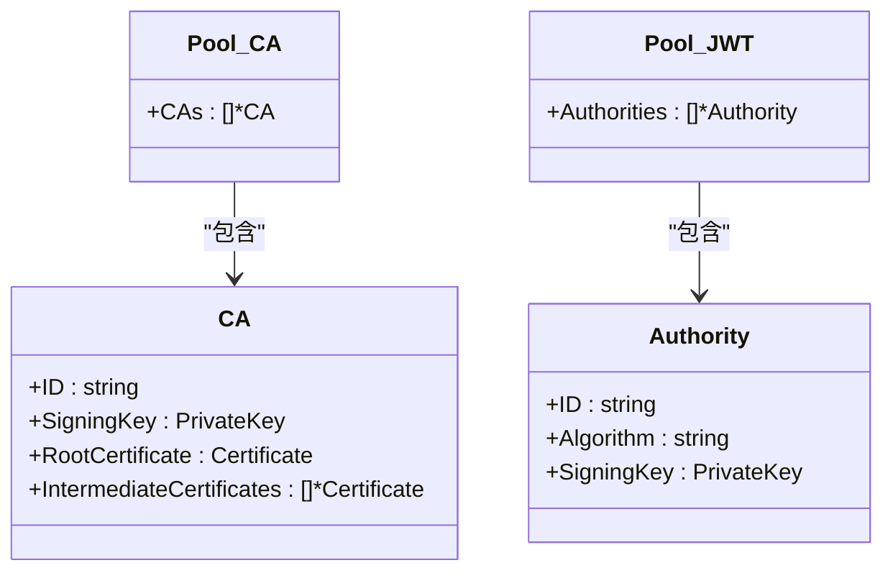
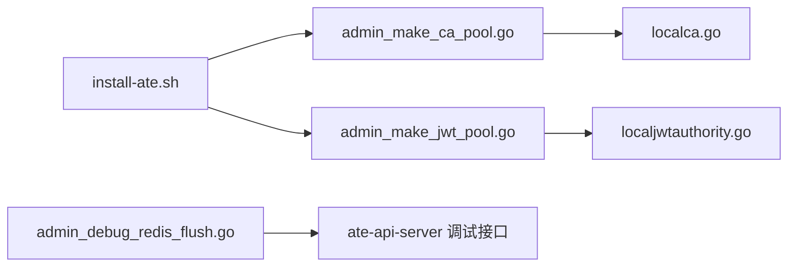

# 系统管理命令

<cite>
**本文引用的文件**   
- [admin.go](file://cmd/kubectl-ate/internal/cmd/admin.go)
- [admin_make_ca_pool.go](file://cmd/kubectl-ate/internal/cmd/admin_make_ca_pool.go)
- [admin_make_jwt_pool.go](file://cmd/kubectl-ate/internal/cmd/admin_make_jwt_pool.go)
- [admin_debug_redis_flush.go](file://cmd/kubectl-ate/internal/cmd/admin_debug_redis_flush.go)
- [localca.go](file://internal/localca/localca.go)
- [localjwtauthority.go](file://internal/localjwtauthority/localjwtauthority.go)
- [README.md](file://cmd/kubectl-ate/README.md)
- [install-ate.sh](file://hack/install-ate.sh)
</cite>

## 目录
1. [简介](#简介)
2. [项目结构](#项目结构)
3. [核心组件](#核心组件)
4. [架构总览](#架构总览)
5. [详细组件分析](#详细组件分析)
6. [依赖关系分析](#依赖关系分析)
7. [性能与可用性考虑](#性能与可用性考虑)
8. [故障排查指南](#故障排查指南)
9. [结论](#结论)
10. [附录：生产部署最佳实践](#附录生产部署最佳实践)

## 简介
本文件面向系统管理员与安全运维人员，系统化说明 kubectl-ate 的 admin 子命令组及其安全相关能力，包括 CA 证书池生成、JWT 密钥池管理、调试清理等。文档同时覆盖证书与密钥的管理策略、权限控制与访问限制建议、备份恢复与灾难恢复流程，以及生产环境部署的配置示例与最佳实践。

## 项目结构
kubectl-ate 的 admin 子命令位于 cmd/kubectl-ate/internal/cmd 下，通过 Cobra 组织命令树；安全相关的“池”数据结构与算法实现位于 internal/localca 与 internal/localjwtauthority 包中；安装脚本 hack/install-ate.sh 演示了如何在集群初始化时自动创建这些池 Secret。

图表来源
- [admin.go:21-28](file://cmd/kubectl-ate/internal/cmd/admin.go#L21-L28)
- [admin_make_ca_pool.go:32-88](file://cmd/kubectl-ate/internal/cmd/admin_make_ca_pool.go#L32-L88)
- [admin_make_jwt_pool.go:30-86](file://cmd/kubectl-ate/internal/cmd/admin_make_jwt_pool.go#L30-L86)
- [admin_debug_redis_flush.go:25-48](file://cmd/kubectl-ate/internal/cmd/admin_debug_redis_flush.go#L25-L48)
- [localca.go:30-193](file://internal/localca/localca.go#L30-L193)
- [localjwtauthority.go:29-138](file://internal/localjwtauthority/localjwtauthority.go#L29-L138)
- [install-ate.sh:188-215](file://hack/install-ate.sh#L188-L215)

章节来源
- [admin.go:1-29](file://cmd/kubectl-ate/internal/cmd/admin.go#L1-L29)
- [admin_make_ca_pool.go:1-89](file://cmd/kubectl-ate/internal/cmd/admin_make_ca_pool.go#L1-L89)
- [admin_make_jwt_pool.go:1-87](file://cmd/kubectl-ate/internal/cmd/admin_make_jwt_pool.go#L1-L87)
- [admin_debug_redis_flush.go:1-49](file://cmd/kubectl-ate/internal/cmd/admin_debug_redis_flush.go#L1-L49)
- [localca.go:1-193](file://internal/localca/localca.go#L1-L193)
- [localjwtauthority.go:1-138](file://internal/localjwtauthority/localjwtauthority.go#L1-L138)
- [README.md:179-198](file://cmd/kubectl-ate/README.md#L179-L198)
- [install-ate.sh:188-215](file://hack/install-ate.sh#L188-L215)

## 核心组件
- admin 子命令组：提供系统管理与调试入口，当前包含三个子命令：
  - make-ca-pool：生成新的 CA 池并写入 Kubernetes Secret
  - make-jwt-pool：生成新的 JWT 签名密钥池并写入 Kubernetes Secret
  - debug-flush-redis：危险操作，清空 Redis 中的全部运行时状态
- 本地 CA 池（localca）：支持 ED25519 根证书与中间证书的序列化/反序列化，并提供生成函数
- 本地 JWT 权威（localjwtauthority）：支持 ECDSA P256（ES256）签名密钥的序列化/反序列化，并提供生成函数
- 安装脚本（install-ate.sh）：在集群初始化阶段调用上述命令，自动创建所需的 Secret

章节来源
- [admin.go:21-28](file://cmd/kubectl-ate/internal/cmd/admin.go#L21-L28)
- [admin_make_ca_pool.go:32-88](file://cmd/kubectl-ate/internal/cmd/admin_make_ca_pool.go#L32-L88)
- [admin_make_jwt_pool.go:30-86](file://cmd/kubectl-ate/internal/cmd/admin_make_jwt_pool.go#L30-L86)
- [admin_debug_redis_flush.go:25-48](file://cmd/kubectl-ate/internal/cmd/admin_debug_redis_flush.go#L25-L48)
- [localca.go:30-193](file://internal/localca/localca.go#L30-L193)
- [localjwtauthority.go:29-138](file://internal/localjwtauthority/localjwtauthority.go#L29-L138)
- [install-ate.sh:188-215](file://hack/install-ate.sh#L188-L215)

## 架构总览
下图展示了从 CLI 到 K8s Secret 的数据流，以及与内部安全库的交互关系。

图表来源
- [admin_make_ca_pool.go:35-78](file://cmd/kubectl-ate/internal/cmd/admin_make_ca_pool.go#L35-L78)
- [admin_make_jwt_pool.go:33-76](file://cmd/kubectl-ate/internal/cmd/admin_make_jwt_pool.go#L33-L76)
- [localca.go:53-81](file://internal/localca/localca.go#L53-L81)
- [localjwtauthority.go:50-74](file://internal/localjwtauthority/localjwtauthority.go#L50-L74)

## 详细组件分析

### 子命令：make-ca-pool
- 功能概述
  - 使用 localca 生成一个 ED25519 根 CA，并将其封装为 Pool 对象
  - 将 Pool 序列化为 JSON 字节，写入名为 pool 的 Secret Data 字段
  - 支持指定初始 CA ID、目标 Secret 命名空间与名称
- 关键参数
  - --ca-id：初始 CA 标识符
  - --secret-namespace：Secret 所在命名空间（默认 default）
  - --name：Secret 名称（必填）
- 行为要点
  - 若 Secret 已存在则创建失败（由 K8s API 返回错误）
  - 生成的 RootCertificate 有效期为一年，IsCA=true，具备数字签名与证书签发用途
- 典型用法参考
  - 参见 README 中的示例与安装脚本中的调用方式

图表来源
- [admin_make_ca_pool.go:35-78](file://cmd/kubectl-ate/internal/cmd/admin_make_ca_pool.go#L35-L78)
- [localca.go:159-193](file://internal/localca/localca.go#L159-L193)

章节来源
- [admin_make_ca_pool.go:1-89](file://cmd/kubectl-ate/internal/cmd/admin_make_ca_pool.go#L1-L89)
- [localca.go:30-193](file://internal/localca/localca.go#L30-L193)
- [README.md:183-188](file://cmd/kubectl-ate/README.md#L183-L188)
- [install-ate.sh:196-202](file://hack/install-ate.sh#L196-L202)

### 子命令：make-jwt-pool
- 功能概述
  - 使用 localjwtauthority 生成一个 ECDSA P256（ES256）签名密钥，并将其封装为 Authority Pool
  - 将 Pool 序列化为 JSON 字节，写入名为 pool 的 Secret Data 字段
  - 支持指定初始密钥 ID、目标 Secret 命名空间与名称
- 关键参数
  - --key-id：初始 JWT 签名密钥标识符（默认 1）
  - --secret-namespace：Secret 所在命名空间（默认 default）
  - --name：Secret 名称（必填）
- 行为要点
  - 生成的 Authority 包含算法标识 ES256 与私钥（PKCS#8）
  - 同样以 Secret.data.pool 形式持久化
- 典型用法参考
  - 参见 README 中的示例与安装脚本中的调用方式

图表来源
- [admin_make_jwt_pool.go:33-76](file://cmd/kubectl-ate/internal/cmd/admin_make_jwt_pool.go#L33-L76)
- [localjwtauthority.go:125-137](file://internal/localjwtauthority/localjwtauthority.go#L125-L137)

章节来源
- [admin_make_jwt_pool.go:1-87](file://cmd/kubectl-ate/internal/cmd/admin_make_jwt_pool.go#L1-L87)
- [localjwtauthority.go:29-138](file://internal/localjwtauthority/localjwtauthority.go#L29-L138)
- [README.md:189-193](file://cmd/kubectl-ate/README.md#L189-L193)
- [install-ate.sh:188-194](file://hack/install-ate.sh#L188-L194)

### 子命令：debug-flush-redis
- 功能概述
  - 通过 ate-api-server 提供的调试接口，清空 Redis 中所有与 Actor/Worker 相关的运行时状态
  - 该操作不可逆，会丢失会话、工作负载调度状态等
- 风险与约束
  - 仅用于开发或紧急排障场景
  - 在生产环境应严格限制访问，避免误用
- 调用路径
  - 客户端连接 ate-api-server，发送 DebugClear 请求，成功后提示“已成功清空 Redis”

图表来源
- [admin_debug_redis_flush.go:25-48](file://cmd/kubectl-ate/internal/cmd/admin_debug_redis_flush.go#L25-L48)

章节来源
- [admin_debug_redis_flush.go:1-49](file://cmd/kubectl-ate/internal/cmd/admin_debug_redis_flush.go#L1-L49)
- [README.md:195-197](file://cmd/kubectl-ate/README.md#L195-L197)

### 安全模型与数据结构
- CA 池（localca.Pool）
  - 包含多个 CA 对象，每个 CA 拥有唯一 ID、私钥、根证书与可选中间证书链
  - 支持 PKCS#8 与 PEM 两种私钥格式解析，证书支持 DER 与 PEM 解析
- JWT 权威池（localjwtauthority.Pool）
  - 包含多个 Authority 对象，每个 Authority 拥有唯一 ID、算法（如 ES256）与私钥
  - 私钥统一以 PKCS#8 格式序列化存储

图表来源
- [localca.go:30-51](file://internal/localca/localca.go#L30-L51)
- [localjwtauthority.go:29-48](file://internal/localjwtauthority/localjwtauthority.go#L29-L48)

章节来源
- [localca.go:30-193](file://internal/localca/localca.go#L30-L193)
- [localjwtauthority.go:29-138](file://internal/localjwtauthority/localjwtauthority.go#L29-L138)

## 依赖关系分析
- 外部依赖
  - Kubernetes Client-Go：用于创建和管理 Secret
  - gRPC 客户端：用于调用 ate-api-server 的调试接口
- 内部依赖
  - localca：负责 CA 池的生成与序列化
  - localjwtauthority：负责 JWT 权威池的生成与序列化
- 耦合与内聚
  - admin 子命令对安全库的依赖清晰且单一职责，便于扩展更多池类型
  - 安装脚本集中编排了各池 Secret 的创建顺序与命名规范

图表来源
- [admin_make_ca_pool.go:32-88](file://cmd/kubectl-ate/internal/cmd/admin_make_ca_pool.go#L32-L88)
- [admin_make_jwt_pool.go:30-86](file://cmd/kubectl-ate/internal/cmd/admin_make_jwt_pool.go#L30-L86)
- [admin_debug_redis_flush.go:25-48](file://cmd/kubectl-ate/internal/cmd/admin_debug_redis_flush.go#L25-L48)
- [install-ate.sh:188-215](file://hack/install-ate.sh#L188-L215)

章节来源
- [admin_make_ca_pool.go:1-89](file://cmd/kubectl-ate/internal/cmd/admin_make_ca_pool.go#L1-L89)
- [admin_make_jwt_pool.go:1-87](file://cmd/kubectl-ate/internal/cmd/admin_make_jwt_pool.go#L1-L87)
- [admin_debug_redis_flush.go:1-49](file://cmd/kubectl-ate/internal/cmd/admin_debug_redis_flush.go#L1-L49)
- [install-ate.sh:188-215](file://hack/install-ate.sh#L188-L215)

## 性能与可用性考虑
- 池大小与轮转
  - 建议定期轮换 CA/JWT 密钥，采用多密钥共存策略，确保旧密钥在有效期内仍可验证
  - 池对象以 Secret.data.pool 存储，注意 Secret 大小限制与读写频率
- 并发与幂等
  - 创建 Secret 时应处理冲突（例如先检查是否存在），避免重复创建导致失败
- 可观测性
  - 结合 OpenTelemetry 与日志系统记录池创建与更新事件，便于审计与回溯

[本节为通用指导，不直接分析具体文件]

## 故障排查指南
- 常见错误
  - Secret 已存在：当目标命名空间与名称已被占用时，创建会失败。应先删除或更换名称
  - kubeconfig 配置错误：无法连接到集群或选择错误的上下文会导致客户端初始化失败
  - Redis 清空后服务异常：debug-flush-redis 会清除运行时状态，需等待服务重新建立必要状态
- 定位方法
  - 查看命令输出与错误信息
  - 检查 K8s Secret 是否按预期创建（命名空间、名称、data.pool 内容）
  - 核对 ate-api-server 健康状态与日志

章节来源
- [admin_make_ca_pool.go:35-78](file://cmd/kubectl-ate/internal/cmd/admin_make_ca_pool.go#L35-L78)
- [admin_make_jwt_pool.go:33-76](file://cmd/kubectl-ate/internal/cmd/admin_make_jwt_pool.go#L33-L76)
- [admin_debug_redis_flush.go:25-48](file://cmd/kubectl-ate/internal/cmd/admin_debug_redis_flush.go#L25-L48)

## 结论
admin 子命令组提供了系统初始化与日常维护的关键能力：安全池的生成与注入、运行时的快速清理。配合安装脚本，可在集群启动阶段自动化完成必要的信任与认证材料准备。生产环境中应严格管控这些命令的访问权限，遵循最小权限原则，并结合备份与灾备策略保障业务连续性。

[本节为总结性内容，不直接分析具体文件]

## 附录：生产部署最佳实践

- 权限控制与访问限制
  - 使用 RBAC 限制 admin 子命令的执行主体，仅允许受信任的管理员或服务账号执行
  - 将 Secret 的读取权限限定于需要使用的组件（如控制器、网关等），避免全局可见
  - 对 debug-flush-redis 进行额外保护，建议在独立的管理通道或受限终端中使用

- 证书与密钥管理策略
  - CA 池：
    - 使用独立的命名空间存放不同用途的 CA 池（如 session-id、pod-identity、service-dns）
    - 定期轮换根 CA 与中间证书，保留历史池以实现平滑过渡
    - 严格控制私钥导出与访问，仅在必要时解密查看
  - JWT 密钥池：
    - 使用 ES256 算法，合理设置密钥 ID 以便版本化管理
    - 实施密钥轮转计划，确保新旧密钥并存期足够长，避免验证失败
    - 将池 Secret 纳入机密管理工具（如 Sealed Secrets、External Secrets）进行加密存储

- 备份与恢复
  - 定期导出 Secret.data.pool 内容作为离线备份，并记录创建时间与密钥 ID
  - 恢复流程：
    - 停止受影响的服务（如 ate-api-server）
    - 替换 Secret.data.pool 为新备份内容
    - 重启服务并验证鉴权与签名链路正常
  - 灾难恢复演练：
    - 模拟集群故障，完整演练从备份恢复 CA/JWT 池的过程
    - 验证下游组件（控制器、网关、工作节点）能正确加载新池

- 生产环境配置示例（基于安装脚本）
  - 创建 JWT 权威池 Secret：
    - 使用 install-ate.sh 的 create-jwt-authority-pool-secret 逻辑，调用 admin make-jwt-pool 指定 key-id、name、secret-namespace
  - 创建 Session ID CA 池 Secret：
    - 使用 install-ate.sh 的 create-session-id-ca-pool-secret 逻辑，调用 admin make-ca-pool 指定 ca-id、name、secret-namespace
  - 创建 Pod Certificate Controller 所需 CA 池：
    - 使用 install-ate.sh 的 create-podcertificate-controller-cas 逻辑，分别创建 service-dns-ca-pool 与 pod-identity-ca-pool

章节来源
- [install-ate.sh:188-215](file://hack/install-ate.sh#L188-L215)
- [README.md:183-197](file://cmd/kubectl-ate/README.md#L183-L197)
