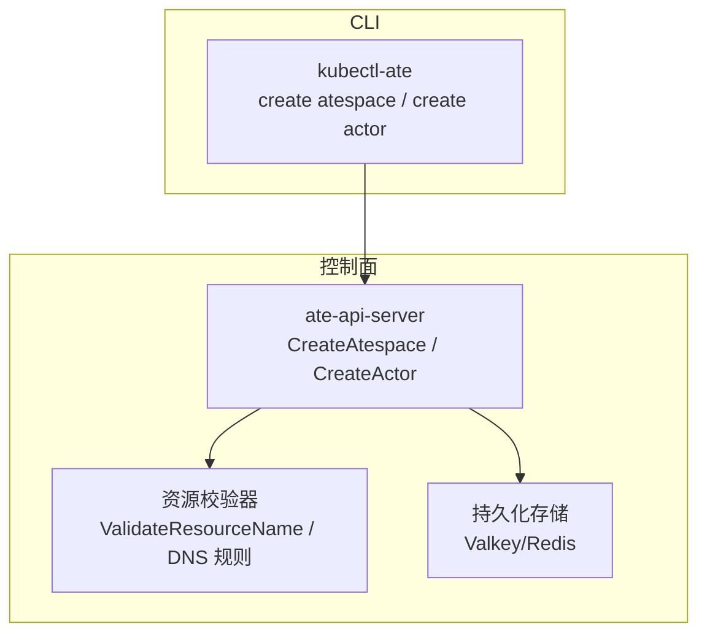
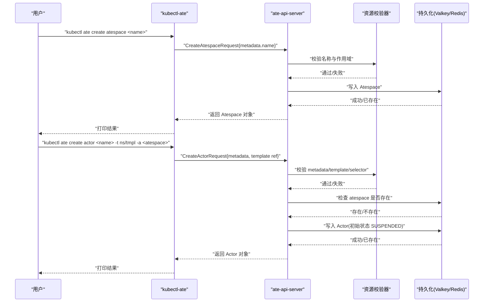
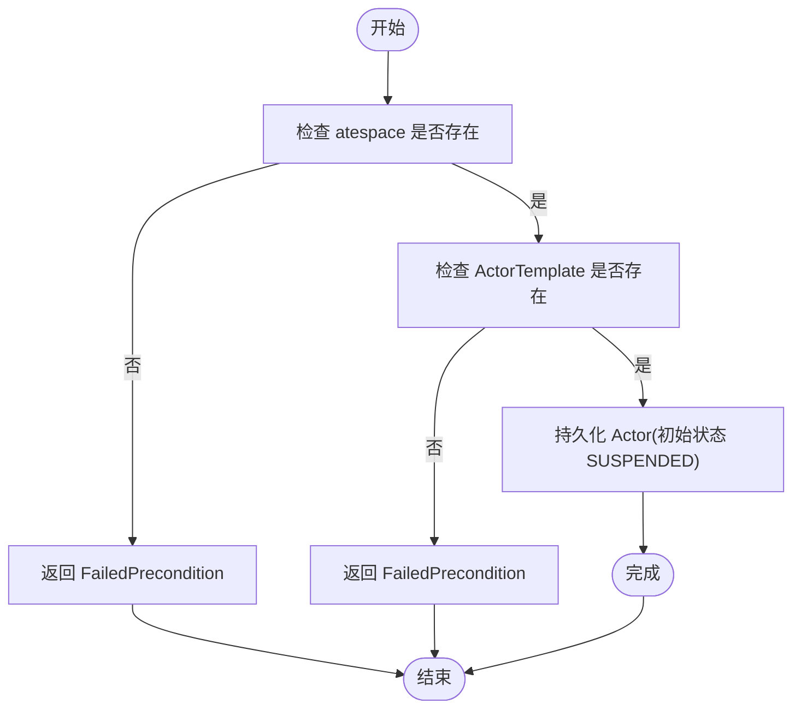
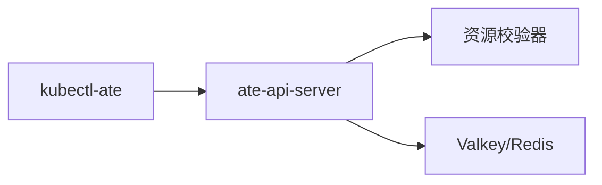

# 创建资源命令

<cite>
**本文引用的文件**   
- [README.md](file://README.md)
- [cmd/kubectl-ate/README.md](file://cmd/kubectl-ate/README.md)
- [cmd/kubectl-ate/internal/cmd/create.go](file://cmd/kubectl-ate/internal/cmd/create.go)
- [cmd/kubectl-ate/internal/cmd/create_actor.go](file://cmd/kubectl-ate/internal/cmd/create_actor.go)
- [cmd/kubectl-ate/internal/cmd/create_atespace.go](file://cmd/kubectl-ate/internal/cmd/create_atespace.go)
- [cmd/ateapi/internal/controlapi/create_actor.go](file://cmd/ateapi/internal/controlapi/create_actor.go)
- [cmd/ateapi/internal/controlapi/create_atespace.go](file://cmd/ateapi/internal/controlapi/create_atespace.go)
- [internal/resources/actor.go](file://internal/resources/actor.go)
- [internal/resources/validate.go](file://internal/resources/validate.go)
</cite>

## 目录
1. [简介](#简介)
2. [项目结构](#项目结构)
3. [核心组件](#核心组件)
4. [架构总览](#架构总览)
5. [详细组件分析](#详细组件分析)
6. [依赖关系分析](#依赖关系分析)
7. [性能与可用性考虑](#性能与可用性考虑)
8. [故障排查指南](#故障排查指南)
9. [结论](#结论)
10. [附录：使用示例与最佳实践](#附录使用示例与最佳实践)

## 简介
本文件面向使用 Agent Substrate 的用户，聚焦“创建资源”的 CLI 命令与后端校验逻辑，覆盖以下主题：
- kubectl-ate 插件中 create atespace 与 create actor 的用法、参数与输出
- 服务端（ate-api-server）对请求的验证规则与约束条件
- 资源命名规范、DNS 可达性与全局/命名空间作用域约定
- 资源依赖关系与推荐创建顺序
- 常见错误与排障建议

## 项目结构
与“创建资源”相关的代码主要分布在两个位置：
- CLI 层：kubectl-ate 插件负责解析用户输入、构造 gRPC 请求并打印结果
- 控制面 API 层：ate-api-server 负责校验、持久化与返回资源对象

图表来源
- [cmd/kubectl-ate/internal/cmd/create_atespace.go:26-55](file://cmd/kubectl-ate/internal/cmd/create_atespace.go#L26-L55)
- [cmd/kubectl-ate/internal/cmd/create_actor.go:30-72](file://cmd/kubectl-ate/internal/cmd/create_actor.go#L30-L72)
- [cmd/ateapi/internal/controlapi/create_atespace.go:30-50](file://cmd/ateapi/internal/controlapi/create_atespace.go#L30-L50)
- [cmd/ateapi/internal/controlapi/create_actor.go:32-82](file://cmd/ateapi/internal/controlapi/create_actor.go#L32-L82)
- [internal/resources/validate.go:29-48](file://internal/resources/validate.go#L29-L48)

章节来源
- [README.md:211-225](file://README.md#L211-L225)
- [cmd/kubectl-ate/README.md:1-70](file://cmd/kubectl-ate/README.md#L1-L70)

## 核心组件
- kubectl-ate 插件
  - create atespace：创建隔离边界（全局作用域），成功后可在此边界内创建多个 Actor
  - create actor：在指定 atespace 中基于 ActorTemplate 创建 Actor；模板引用格式为 namespace/name
- ate-api-server 控制面
  - CreateAtespace：校验名称与作用域，写入持久化
  - CreateActor：校验元数据与模板引用，检查 atespace 存在性，写入持久化并返回初始状态
- 资源校验器
  - ValidateResourceName：遵循 DNS-1123 Label 子集规则
  - DNS 相关：Actor 的网格访问名由 atespace 与 actor name 组合构成

章节来源
- [cmd/kubectl-ate/internal/cmd/create_atespace.go:26-55](file://cmd/kubectl-ate/internal/cmd/create_atespace.go#L26-L55)
- [cmd/kubectl-ate/internal/cmd/create_actor.go:30-72](file://cmd/kubectl-ate/internal/cmd/create_actor.go#L30-L72)
- [cmd/ateapi/internal/controlapi/create_atespace.go:30-50](file://cmd/ateapi/internal/controlapi/create_atespace.go#L30-L50)
- [cmd/ateapi/internal/controlapi/create_actor.go:32-82](file://cmd/ateapi/internal/controlapi/create_actor.go#L32-L82)
- [internal/resources/validate.go:29-48](file://internal/resources/validate.go#L29-L48)
- [internal/resources/actor.go:22-39](file://internal/resources/actor.go#L22-L39)

## 架构总览
下图展示了从 CLI 到控制面的完整调用链，以及关键校验点。

图表来源
- [cmd/kubectl-ate/internal/cmd/create_atespace.go:26-55](file://cmd/kubectl-ate/internal/cmd/create_atespace.go#L26-L55)
- [cmd/kubectl-ate/internal/cmd/create_actor.go:30-72](file://cmd/kubectl-ate/internal/cmd/create_actor.go#L30-L72)
- [cmd/ateapi/internal/controlapi/create_atespace.go:30-50](file://cmd/ateapi/internal/controlapi/create_atespace.go#L30-L50)
- [cmd/ateapi/internal/controlapi/create_actor.go:32-82](file://cmd/ateapi/internal/controlapi/create_actor.go#L32-L82)
- [internal/resources/validate.go:29-48](file://internal/resources/validate.go#L29-L48)

## 详细组件分析

### 命令：create atespace
- 用途：创建全局作用域的隔离边界（atespace）。必须在创建任何 Actor 之前完成。
- 语法与参数
  - 基本语法：kubectl ate create atespace <name>
  - 全局标志：--kubeconfig、--endpoint、--output(-o)、--trace
- 行为说明
  - 名称必须满足资源命名规则（DNS-1123 Label 子集）
  - atespace 是全局作用域，不允许设置 atespace 字段
  - 若已存在则返回 AlreadyExists
- 典型输出列
  - NAME：全局唯一名称
  - AGE：创建时间距今

章节来源
- [cmd/kubectl-ate/README.md:120-146](file://cmd/kubectl-ate/README.md#L120-L146)
- [cmd/kubectl-ate/internal/cmd/create_atespace.go:26-55](file://cmd/kubectl-ate/internal/cmd/create_atespace.go#L26-L55)
- [cmd/ateapi/internal/controlapi/create_atespace.go:30-50](file://cmd/ateapi/internal/controlapi/create_atespace.go#L30-L50)
- [cmd/ateapi/internal/controlapi/create_atespace.go:52-78](file://cmd/ateapi/internal/controlapi/create_atespace.go#L52-L78)
- [internal/resources/validate.go:29-48](file://internal/resources/validate.go#L29-L48)

### 命令：create actor
- 用途：在指定 atespace 中基于 ActorTemplate 创建 Actor。Actor 默认以 SUSPENDED 状态记录，等待后续 Resume。
- 语法与参数
  - 基本语法：kubectl ate create actor <actor-name> --template <namespace>/<name> --atespace <atespace>
  - 简写：-t/--template、-a/--atespace
  - 全局标志：--kubeconfig、--endpoint、--output(-o)、--trace
- 行为说明
  - 必填项：--template、--atespace
  - 模板引用格式必须为 namespace/name
  - 服务端会校验 ActorTemplate 是否存在、atespace 是否已存在
  - 若同名 Actor 已存在则返回 AlreadyExists
- 典型输出列
  - ATESPACE、NAME、TEMPLATE、STATUS、ATEOM POD/IP、VERSION、AGE

章节来源
- [cmd/kubectl-ate/README.md:147-165](file://cmd/kubectl-ate/README.md#L147-L165)
- [cmd/kubectl-ate/internal/cmd/create_actor.go:30-72](file://cmd/kubectl-ate/internal/cmd/create_actor.go#L30-L72)
- [cmd/ateapi/internal/controlapi/create_actor.go:32-82](file://cmd/ateapi/internal/controlapi/create_actor.go#L32-L82)
- [cmd/ateapi/internal/controlapi/create_actor.go:84-130](file://cmd/ateapi/internal/controlapi/create_actor.go#L84-L130)

### 资源命名与 DNS 规则
- 资源命名
  - 所有资源名称需符合 DNS-1123 Label 子集规则（小写字母、数字、短横线，且不以短横线开头或结尾）
- Actor 网格访问名
  - 形如：<actor_name>.<atespace>.actors.resources.substrate.ate.dev
  - atespace 作为域名一部分，确保跨 atespace 的唯一性
- 全局 vs 命名空间作用域
  - atespace 为全局作用域，其 metadata.atespace 必须为空
  - Actor 属于某个 atespace，其 metadata.atespace 必须非空且有效

章节来源
- [internal/resources/validate.go:29-48](file://internal/resources/validate.go#L29-L48)
- [internal/resources/actor.go:22-39](file://internal/resources/actor.go#L22-L39)
- [cmd/ateapi/internal/controlapi/create_atespace.go:63-72](file://cmd/ateapi/internal/controlapi/create_atespace.go#L63-L72)
- [cmd/ateapi/internal/controlapi/create_actor.go:95-105](file://cmd/ateapi/internal/controlapi/create_actor.go#L95-L105)

### 资源依赖关系与创建顺序
- 依赖关系
  - Actor 依赖于：
    - 同名的 atespace 必须已存在
    - 指定的 ActorTemplate(namespace/name) 必须存在
- 推荐顺序
  1) 先创建 atespace
  2) 再创建 Actor（指定模板与 atespace）
  3) 随后按需执行 resume/suspend/delete 等生命周期操作

图表来源
- [cmd/ateapi/internal/controlapi/create_actor.go:42-60](file://cmd/ateapi/internal/controlapi/create_actor.go#L42-L60)
- [cmd/ateapi/internal/controlapi/create_actor.go:62-82](file://cmd/ateapi/internal/controlapi/create_actor.go#L62-L82)

章节来源
- [cmd/ateapi/internal/controlapi/create_actor.go:42-60](file://cmd/ateapi/internal/controlapi/create_actor.go#L42-L60)
- [cmd/ateapi/internal/controlapi/create_actor.go:62-82](file://cmd/ateapi/internal/controlapi/create_actor.go#L62-L82)

## 依赖关系分析
- CLI 与控制面
  - kubectl-ate 通过自动端口转发或直接 endpoint 连接 ate-api-server
  - 支持可选的 on-demand tracing（--trace）
- 控制面与校验器
  - 所有关键字段在进入持久化前均经过严格校验
- 控制面与存储
  - atespace 与 Actor 信息存储在 Valkey/Redis（控制平面存储），而非 Kubernetes etcd

图表来源
- [cmd/kubectl-ate/README.md:24-30](file://cmd/kubectl-ate/README.md#L24-L30)
- [cmd/ateapi/internal/controlapi/create_atespace.go:30-50](file://cmd/ateapi/internal/controlapi/create_atespace.go#L30-L50)
- [cmd/ateapi/internal/controlapi/create_actor.go:32-82](file://cmd/ateapi/internal/controlapi/create_actor.go#L32-L82)

章节来源
- [cmd/kubectl-ate/README.md:24-30](file://cmd/kubectl-ate/README.md#L24-L30)
- [cmd/ateapi/internal/controlapi/create_atespace.go:30-50](file://cmd/ateapi/internal/controlapi/create_atespace.go#L30-L50)
- [cmd/ateapi/internal/controlapi/create_actor.go:32-82](file://cmd/ateapi/internal/controlapi/create_actor.go#L32-L82)

## 性能与可用性考虑
- 自动端口转发：kubectl-ate 默认发现 ate-api-server 并建立临时隧道，适合本地开发；生产环境建议使用直连 endpoint
- On-demand tracing：通过 --trace 开启单次请求追踪，便于定位问题
- 资源状态：Actor 创建后处于 SUSPENDED，Resume 后才分配 Worker 并恢复状态，避免不必要的资源占用

章节来源
- [cmd/kubectl-ate/README.md:24-30](file://cmd/kubectl-ate/README.md#L24-L30)
- [cmd/kubectl-ate/README.md:29-59](file://cmd/kubectl-ate/README.md#L29-L59)
- [cmd/ateapi/internal/controlapi/create_actor.go:62-82](file://cmd/ateapi/internal/controlapi/create_actor.go#L62-L82)

## 故障排查指南
- 常见错误与原因
  - InvalidArgument：名称不符合 DNS-1123 Label 规则、模板引用格式不正确、缺少必填字段
  - FailedPrecondition：指定的 atespace 不存在、ActorTemplate 不存在
  - AlreadyExists：重复创建同名 atespace 或 Actor
- 快速定位
  - 确认 atespace 已存在：kubectl ate get atespaces
  - 确认模板存在：kubectl get actortemplate -n <namespace> <name>
  - 查看输出格式：使用 -o json/yaml 获取结构化响应
  - 启用追踪：添加 --trace 并在 Jaeger 中检索对应 trace

章节来源
- [cmd/ateapi/internal/controlapi/create_atespace.go:52-78](file://cmd/ateapi/internal/controlapi/create_atespace.go#L52-L78)
- [cmd/ateapi/internal/controlapi/create_actor.go:84-130](file://cmd/ateapi/internal/controlapi/create_actor.go#L84-L130)
- [cmd/kubectl-ate/README.md:24-30](file://cmd/kubectl-ate/README.md#L24-L30)
- [cmd/kubectl-ate/README.md:29-59](file://cmd/kubectl-ate/README.md#L29-L59)

## 结论
- 创建资源的正确顺序为先 atespace 后 actor
- 名称与引用必须符合严格的 DNS-1123 规则
- 服务端在持久化前进行强校验，保证一致性
- 借助 CLI 的全局标志与 tracing，可高效定位问题

## 附录：使用示例与最佳实践
- 安装与运行
  - 安装 kubectl-ate：go install ./cmd/kubectl-ate
  - 直接运行：go run ./cmd/kubectl-ate <command>
- 创建 atespace
  - kubectl ate create atespace demo
- 创建 actor
  - kubectl ate create actor my-counter-1 --template ate-demo-counter/counter -a demo
- 列出与查看
  - kubectl ate get actors -a demo
  - kubectl ate get actor my-counter-1 -a demo -o yaml
- 删除
  - kubectl ate delete actor my-counter-1 -a demo
  - kubectl ate delete atespace demo（需为空）

章节来源
- [README.md:97-128](file://README.md#L97-L128)
- [cmd/kubectl-ate/README.md:120-165](file://cmd/kubectl-ate/README.md#L120-L165)
