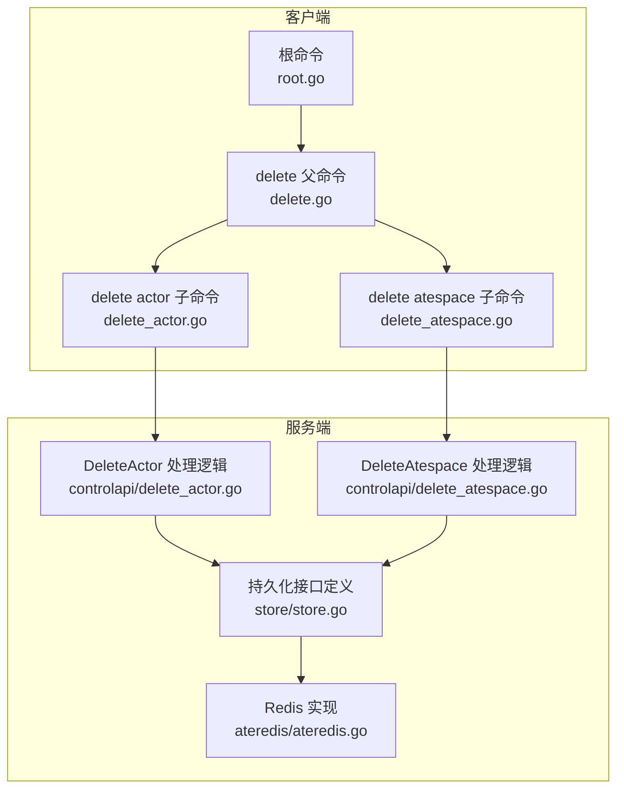
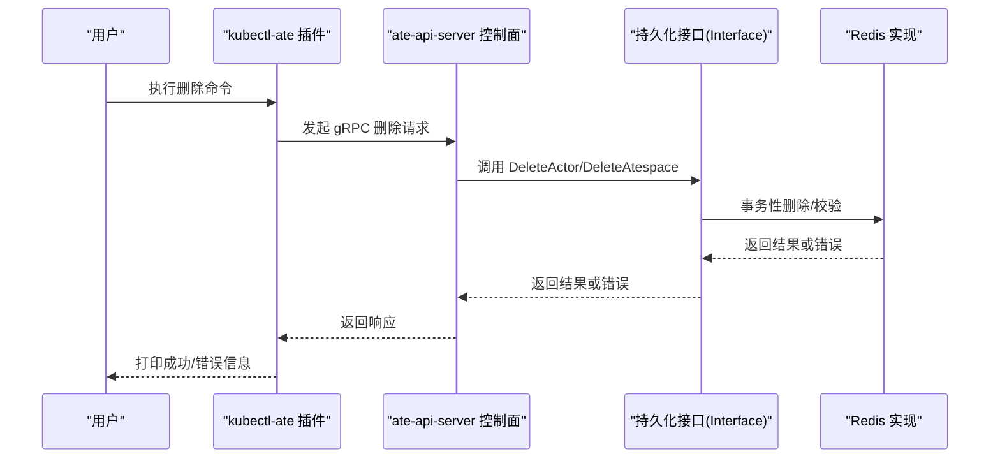
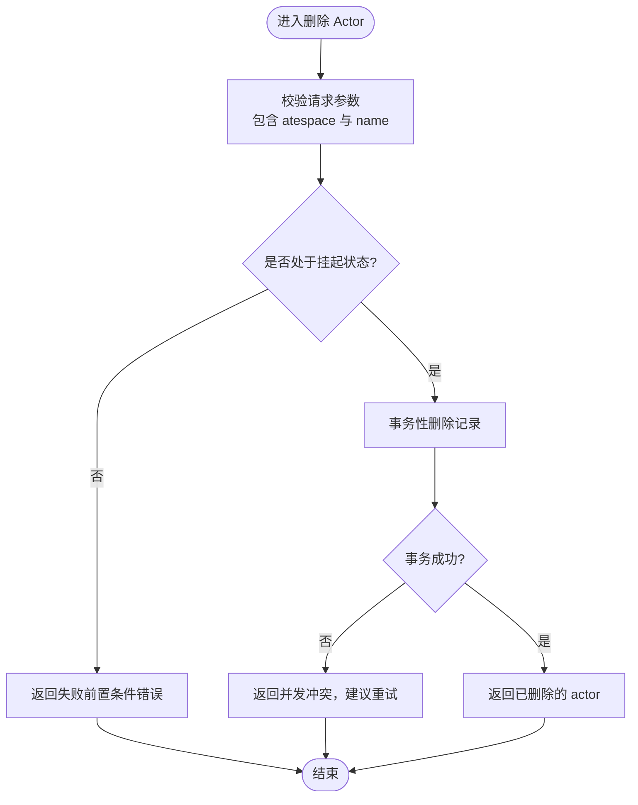
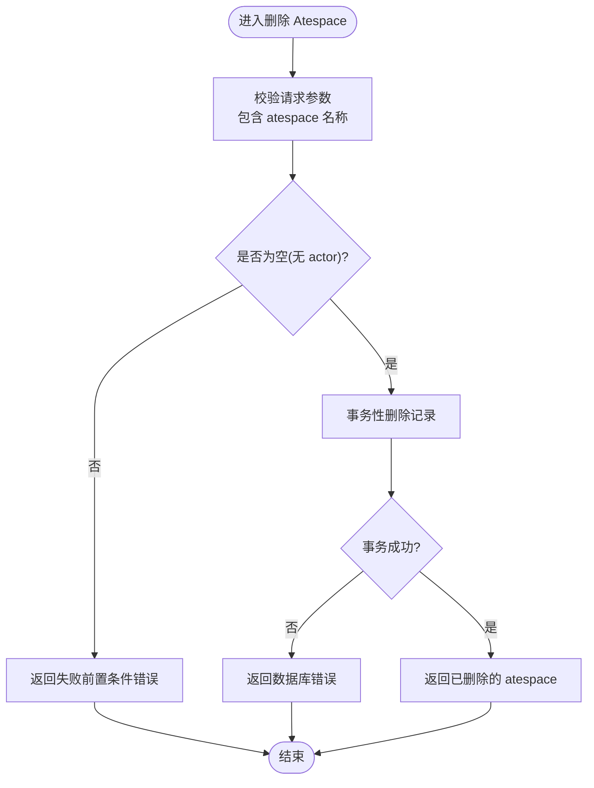
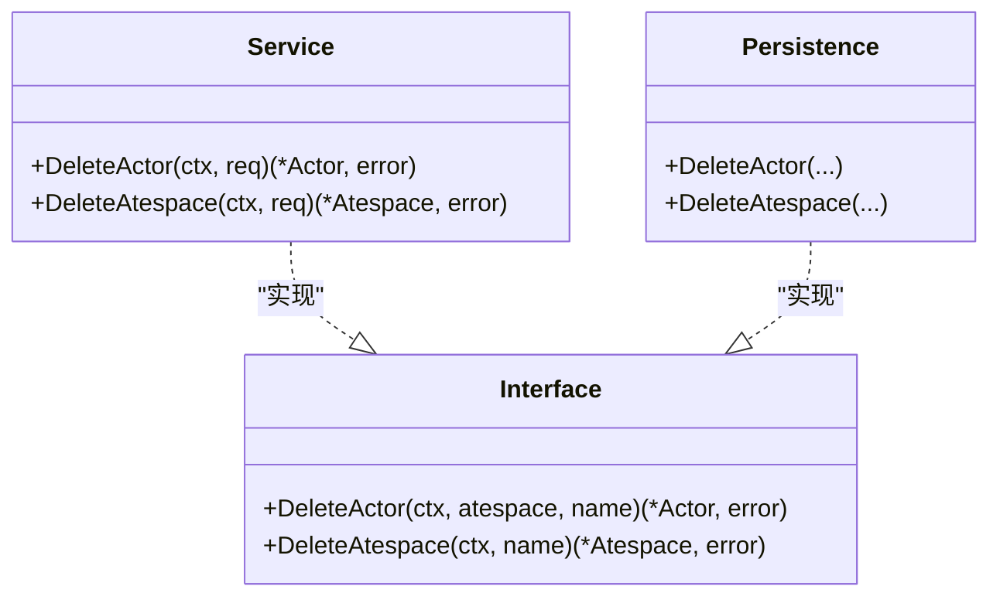

# 删除资源命令

<cite>
**本文引用的文件**   
- [cmd/kubectl-ate/internal/cmd/root.go](file://cmd/kubectl-ate/internal/cmd/root.go)
- [cmd/kubectl-ate/internal/cmd/delete.go](file://cmd/kubectl-ate/internal/cmd/delete.go)
- [cmd/kubectl-ate/internal/cmd/delete_actor.go](file://cmd/kubectl-ate/internal/cmd/delete_actor.go)
- [cmd/kubectl-ate/internal/cmd/delete_atespace.go](file://cmd/kubectl-ate/internal/cmd/delete_atespace.go)
- [cmd/ateapi/internal/controlapi/delete_actor.go](file://cmd/ateapi/internal/controlapi/delete_actor.go)
- [cmd/ateapi/internal/controlapi/delete_atespace.go](file://cmd/ateapi/internal/controlapi/delete_atespace.go)
- [cmd/ateapi/internal/store/store.go](file://cmd/ateapi/internal/store/store.go)
- [cmd/ateapi/internal/store/ateredis/ateredis.go](file://cmd/ateapi/internal/store/ateredis/ateredis.go)
- [internal/resources/actor.go](file://internal/resources/actor.go)
</cite>

## 目录
1. [简介](#简介)
2. [项目结构](#项目结构)
3. [核心组件](#核心组件)
4. [架构总览](#架构总览)
5. [详细组件分析](#详细组件分析)
6. [依赖关系分析](#依赖关系分析)
7. [性能与一致性考虑](#性能与一致性考虑)
8. [故障排查指南](#故障排查指南)
9. [结论](#结论)
10. [附录：使用示例与最佳实践](#附录使用示例与最佳实践)

## 简介
本文件面向使用 kubectl-ate 插件的运维与开发者，聚焦“删除资源”相关 CLI 命令，包括：
- 删除 Actor（需指定所属 atespace）
- 删除空 Atespace（若存在未清理的 Actor 将被拒绝）

文档将详细说明命令用法、参数选项、级联删除行为、资源清理机制、确认与回滚策略、以及删除前的检查清单与安全最佳实践。

## 项目结构
删除功能涉及两层：
- 客户端层：kubectl-ate 插件提供 delete actor / delete atespace 子命令
- 服务端层：ate-api-server 暴露 gRPC 控制面接口，负责校验、持久化与状态变更

图表来源
- [cmd/kubectl-ate/internal/cmd/root.go:34-61](file://cmd/kubectl-ate/internal/cmd/root.go#L34-L61)
- [cmd/kubectl-ate/internal/cmd/delete.go:21-28](file://cmd/kubectl-ate/internal/cmd/delete.go#L21-L28)
- [cmd/kubectl-ate/internal/cmd/delete_actor.go:27-56](file://cmd/kubectl-ate/internal/cmd/delete_actor.go#L27-L56)
- [cmd/kubectl-ate/internal/cmd/delete_atespace.go:25-49](file://cmd/kubectl-ate/internal/cmd/delete_atespace.go#L25-L49)
- [cmd/ateapi/internal/controlapi/delete_actor.go:30-71](file://cmd/ateapi/internal/controlapi/delete_actor.go#L30-L71)
- [cmd/ateapi/internal/controlapi/delete_atespace.go:30-64](file://cmd/ateapi/internal/controlapi/delete_atespace.go#L30-L64)
- [cmd/ateapi/internal/store/store.go:40-118](file://cmd/ateapi/internal/store/store.go#L40-L118)
- [cmd/ateapi/internal/store/ateredis/ateredis.go:500-521](file://cmd/ateapi/internal/store/ateredis/ateredis.go#L500-L521)

章节来源
- [cmd/kubectl-ate/internal/cmd/root.go:34-61](file://cmd/kubectl-ate/internal/cmd/root.go#L34-L61)
- [cmd/kubectl-ate/internal/cmd/delete.go:21-28](file://cmd/kubectl-ate/internal/cmd/delete.go#L21-L28)
- [cmd/kubectl-ate/internal/cmd/delete_actor.go:27-56](file://cmd/kubectl-ate/internal/cmd/delete_actor.go#L27-L56)
- [cmd/kubectl-ate/internal/cmd/delete_atespace.go:25-49](file://cmd/kubectl-ate/internal/cmd/delete_atespace.go#L25-L49)

## 核心组件
- 根命令与全局选项
  - 支持输出格式、gRPC 端点覆盖、Kubernetes context 等全局参数
- delete 父命令
  - 作为删除类子命令的容器
- delete actor 子命令
  - 必填参数：actor 名称
  - 必填标志：--atespace/-a（指定 actor 所在 atespace）
  - 行为：调用服务端 DeleteActor 接口删除处于挂起状态的 actor
- delete atespace 子命令
  - 必填参数：atespace 名称
  - 行为：仅允许删除空的 atespace；若仍有 actor 则失败

章节来源
- [cmd/kubectl-ate/internal/cmd/root.go:34-61](file://cmd/kubectl-ate/internal/cmd/root.go#L34-L61)
- [cmd/kubectl-ate/internal/cmd/delete.go:21-28](file://cmd/kubectl-ate/internal/cmd/delete.go#L21-L28)
- [cmd/kubectl-ate/internal/cmd/delete_actor.go:27-56](file://cmd/kubectl-ate/internal/cmd/delete_actor.go#L27-L56)
- [cmd/kubectl-ate/internal/cmd/delete_atespace.go:25-49](file://cmd/kubectl-ate/internal/cmd/delete_atespace.go#L25-L49)

## 架构总览
下图展示了从 CLI 到服务端的完整调用链，以及服务端对持久化层的访问路径。

图表来源
- [cmd/kubectl-ate/internal/cmd/delete_actor.go:31-48](file://cmd/kubectl-ate/internal/cmd/delete_actor.go#L31-L48)
- [cmd/kubectl-ate/internal/cmd/delete_atespace.go:29-43](file://cmd/kubectl-ate/internal/cmd/delete_atespace.go#L29-L43)
- [cmd/ateapi/internal/controlapi/delete_actor.go:30-55](file://cmd/ateapi/internal/controlapi/delete_actor.go#L30-L55)
- [cmd/ateapi/internal/controlapi/delete_atespace.go:30-48](file://cmd/ateapi/internal/controlapi/delete_atespace.go#L30-L48)
- [cmd/ateapi/internal/store/store.go:40-118](file://cmd/ateapi/internal/store/store.go#L40-L118)
- [cmd/ateapi/internal/store/ateredis/ateredis.go:500-521](file://cmd/ateapi/internal/store/ateredis/ateredis.go#L500-L521)

## 详细组件分析

### 删除 Actor（delete actor）
- 命令语法
  - kubectl-ate delete actor <actor-name> --atespace <atespace>
- 关键参数
  - --atespace, -a：必填，指定 actor 所在的 atespace
- 前置条件
  - 目标 actor 必须处于“已挂起”状态，否则返回失败前置条件错误
- 返回值与输出
  - 成功时返回被删除的 actor 对象；CLI 会打印简短成功消息
- 错误码与语义
  - 未找到：返回 NotFound
  - 非挂起状态：返回 FailedPrecondition，并附带当前状态
  - 并发冲突：返回 Aborted，提示重试
- 级联与清理
  - 不触发级联删除其他资源；仅删除该 actor 记录
  - 删除后，该 actor 不再可被发现或调度

图表来源
- [cmd/ateapi/internal/controlapi/delete_actor.go:30-71](file://cmd/ateapi/internal/controlapi/delete_actor.go#L30-L71)
- [cmd/ateapi/internal/store/ateredis/ateredis.go:500-521](file://cmd/ateapi/internal/store/ateredis/ateredis.go#L500-L521)

章节来源
- [cmd/kubectl-ate/internal/cmd/delete_actor.go:27-56](file://cmd/kubectl-ate/internal/cmd/delete_actor.go#L27-L56)
- [cmd/ateapi/internal/controlapi/delete_actor.go:30-71](file://cmd/ateapi/internal/controlapi/delete_actor.go#L30-L71)
- [cmd/ateapi/internal/store/store.go:55-57](file://cmd/ateapi/internal/store/store.go#L55-L57)
- [cmd/ateapi/internal/store/ateredis/ateredis.go:500-521](file://cmd/ateapi/internal/store/ateredis/ateredis.go#L500-L521)

### 删除 Atespace（delete atespace）
- 命令语法
  - kubectl-ate delete atespace <atespace-name>
- 前置条件
  - 目标 atespace 必须为空（不存在任何 actor），否则返回失败前置条件错误
- 返回值与输出
  - 成功时返回被删除的 atespace 对象；CLI 会打印简短成功消息
- 错误码与语义
  - 未找到：返回 NotFound
  - 非空：返回 FailedPrecondition
- 级联与清理
  - 不触发级联删除；必须先手动删除所有 actor，再删除 atespace
  - 删除后，该 atespace 不再可被发现或创建新资源

图表来源
- [cmd/ateapi/internal/controlapi/delete_atespace.go:30-64](file://cmd/ateapi/internal/controlapi/delete_atespace.go#L30-L64)

章节来源
- [cmd/kubectl-ate/internal/cmd/delete_atespace.go:25-49](file://cmd/kubectl-ate/internal/cmd/delete_atespace.go#L25-L49)
- [cmd/ateapi/internal/controlapi/delete_atespace.go:30-64](file://cmd/ateapi/internal/controlapi/delete_atespace.go#L30-L64)
- [cmd/ateapi/internal/store/store.go:77-80](file://cmd/ateapi/internal/store/store.go#L77-L80)

### 命名与范围约束
- Actor 名称与 DNS 命名规范
  - 名称遵循统一的资源命名正则模式
  - 通过 atespace + actor name 组合保证唯一性
- 作用域
  - Actor 属于特定 atespace；删除时必须显式指定 atespace
  - Atespace 为全局资源；删除时需确保其下无任何 actor

章节来源
- [internal/resources/actor.go:22-39](file://internal/resources/actor.go#L22-L39)

## 依赖关系分析
- 客户端依赖
  - kubectl-ate 插件通过 ateclient 连接 ate-api-server（可通过 --endpoint 直连或通过端口转发自动发现）
- 服务端依赖
  - controlapi 层负责请求校验、错误映射与链路追踪
  - store.Interface 抽象了持久化能力，具体由 Redis 实现
- 错误传播
  - 存储层错误统一转换为标准 gRPC 状态码返回给客户端

图表来源
- [cmd/ateapi/internal/controlapi/delete_actor.go:30-71](file://cmd/ateapi/internal/controlapi/delete_actor.go#L30-L71)
- [cmd/ateapi/internal/controlapi/delete_atespace.go:30-64](file://cmd/ateapi/internal/controlapi/delete_atespace.go#L30-L64)
- [cmd/ateapi/internal/store/store.go:40-118](file://cmd/ateapi/internal/store/store.go#L40-L118)
- [cmd/ateapi/internal/store/ateredis/ateredis.go:500-521](file://cmd/ateapi/internal/store/ateredis/ateredis.go#L500-L521)

章节来源
- [cmd/kubectl-ate/internal/cmd/root.go:54-61](file://cmd/kubectl-ate/internal/cmd/root.go#L54-L61)
- [cmd/ateapi/internal/store/store.go:40-118](file://cmd/ateapi/internal/store/store.go#L40-L118)

## 性能与一致性考虑
- 事务性与幂等性
  - 删除操作在 Redis 中以事务形式执行，避免部分写入
  - 删除本身具备幂等语义：重复删除不会造成额外副作用
- 并发冲突
  - 当底层事务失败（如 Watch 冲突）时，返回 Aborted，客户端应进行退避重试
- 扫描与空检测
  - 删除 atespace 前会检查是否存在关联 actor；若存在则拒绝删除
  - 列表与扫描采用分页与分片策略，避免全量扫描带来的延迟

章节来源
- [cmd/ateapi/internal/store/ateredis/ateredis.go:500-521](file://cmd/ateapi/internal/store/ateredis/ateredis.go#L500-L521)
- [cmd/ateapi/internal/controlapi/delete_actor.go:48-50](file://cmd/ateapi/internal/controlapi/delete_actor.go#L48-L50)
- [cmd/ateapi/internal/controlapi/delete_atespace.go:41-43](file://cmd/ateapi/internal/controlapi/delete_atespace.go#L41-L43)

## 故障排查指南
- 常见错误与定位
  - NotFound：确认名称与作用域（atespace）是否正确
  - FailedPrecondition：
    - 删除 actor：确认其状态是否为“已挂起”，必要时先暂停/挂起
    - 删除 atespace：确认其下是否还有 actor，先逐一删除
  - Aborted：并发冲突，稍后重试即可
- 日志与追踪
  - 可使用 --trace 开启请求追踪，便于定位问题
- 验证步骤
  - 先列出 atespace 下的 actor，确认是否为空
  - 再次尝试删除，观察错误码变化

章节来源
- [cmd/kubectl-ate/internal/cmd/root.go:54-61](file://cmd/kubectl-ate/internal/cmd/root.go#L54-L61)
- [cmd/ateapi/internal/controlapi/delete_actor.go:38-50](file://cmd/ateapi/internal/controlapi/delete_actor.go#L38-L50)
- [cmd/ateapi/internal/controlapi/delete_atespace.go:38-43](file://cmd/ateapi/internal/controlapi/delete_atespace.go#L38-L43)

## 结论
- 删除 actor 需要显式指定 atespace，且目标必须处于挂起状态
- 删除 atespace 要求其为空，不支持级联删除
- 删除操作基于事务与乐观锁，遇到并发冲突应重试
- 建议在删除前进行充分检查，遵循安全删除的最佳实践

## 附录：使用示例与最佳实践

- 基本用法
  - 删除指定 atespace 中的 actor
    - kubectl-ate delete actor <actor-name> --atespace <atespace>
  - 删除空的 atespace
    - kubectl-ate delete atespace <atespace-name>
- 删除前检查清单
  - 确认 atespace 名称与 actor 名称正确
  - 确认 actor 状态为“已挂起”
  - 确认 atespace 下无活跃或待处理的 actor
  - 如需批量清理，先逐个删除 actor，再删除 atespace
- 安全删除最佳实践
  - 优先使用只读命令（如 list/get）核对资源状态
  - 对关键环境，先在测试环境演练删除流程
  - 结合 --output=json 或 --output=yaml 保存上下文，便于审计
- 确认与回滚
  - 当前删除命令不提供交互式确认与回滚开关
  - 若误删，请依据业务恢复策略重建资源（例如重新创建 actor 与 atespace）
- 常见问题
  - 删除 atespace 失败：说明仍有关联 actor，请先删除这些 actor
  - 删除 actor 失败：说明其未处于挂起状态，请先将其挂起后再删除

章节来源
- [cmd/kubectl-ate/internal/cmd/delete_actor.go:27-56](file://cmd/kubectl-ate/internal/cmd/delete_actor.go#L27-L56)
- [cmd/kubectl-ate/internal/cmd/delete_atespace.go:25-49](file://cmd/kubectl-ate/internal/cmd/delete_atespace.go#L25-L49)
- [cmd/ateapi/internal/controlapi/delete_actor.go:30-71](file://cmd/ateapi/internal/controlapi/delete_actor.go#L30-L71)
- [cmd/ateapi/internal/controlapi/delete_atespace.go:30-64](file://cmd/ateapi/internal/controlapi/delete_atespace.go#L30-L64)
