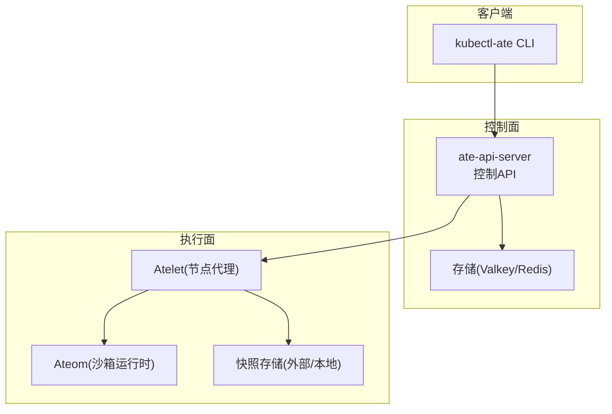
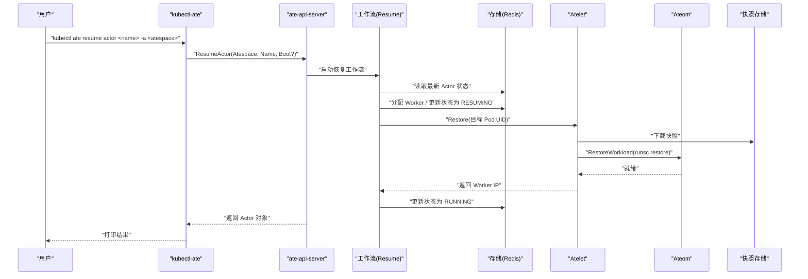
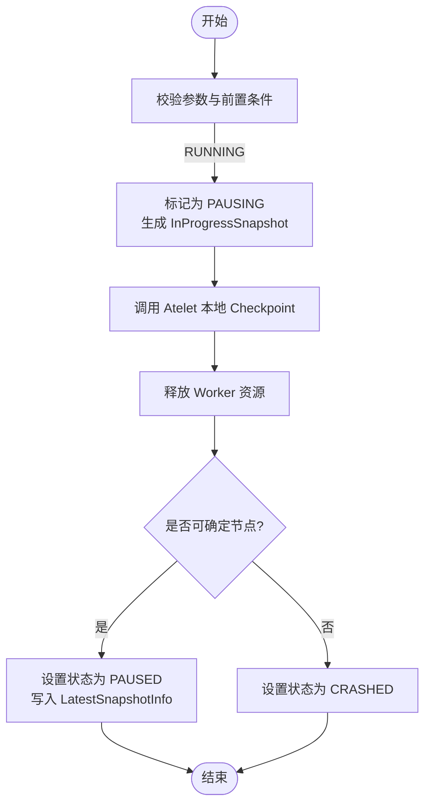
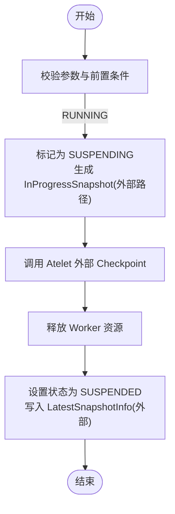
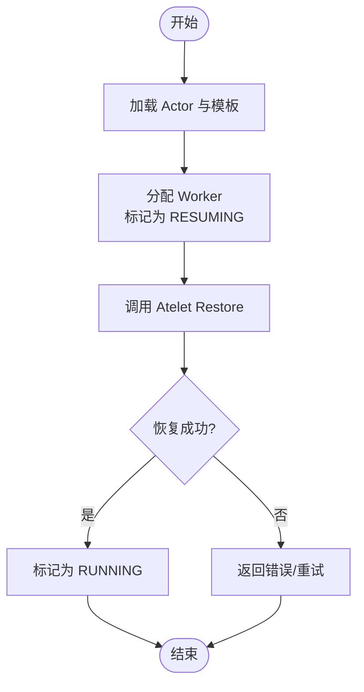
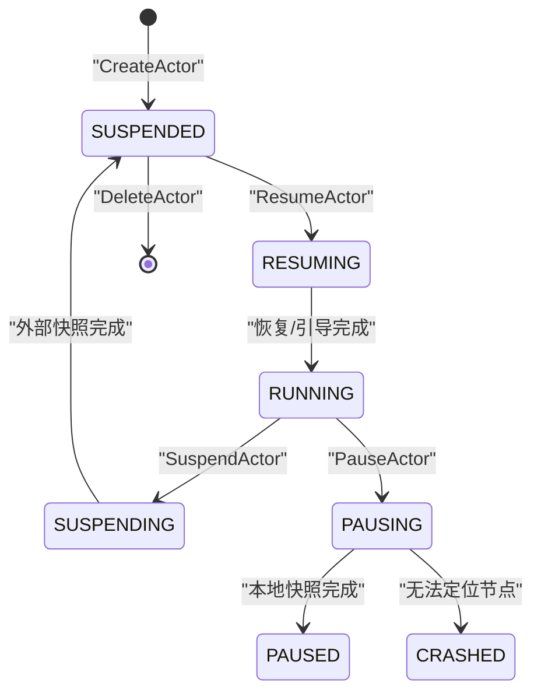
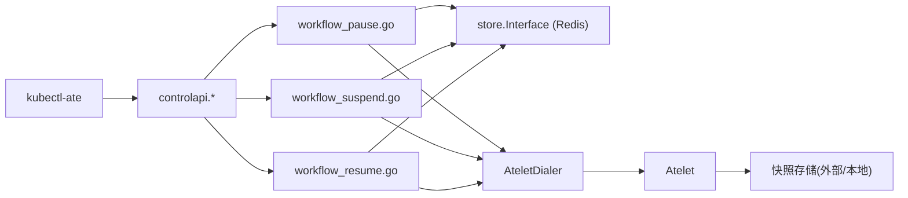

# 生命周期管理命令

<cite>
**本文引用的文件**
- [README.md](file://cmd/kubectl-ate/README.md)
- [pause.go](file://cmd/kubectl-ate/internal/cmd/pause.go)
- [resume.go](file://cmd/kubectl-ate/internal/cmd/resume.go)
- [suspend.go](file://cmd/kubectl-ate/internal/cmd/suspend.go)
- [pause_actor.go](file://cmd/kubectl-ate/internal/cmd/pause_actor.go)
- [resume_actor.go](file://cmd/kubectl-ate/internal/cmd/resume_actor.go)
- [suspend_actor.go](file://cmd/kubectl-ate/internal/cmd/suspend_actor.go)
- [pause_actor.go](file://cmd/ateapi/internal/controlapi/pause_actor.go)
- [resume_actor.go](file://cmd/ateapi/internal/controlapi/resume_actor.go)
- [suspend_actor.go](file://cmd/ateapi/internal/controlapi/suspend_actor.go)
- [workflow_pause.go](file://cmd/ateapi/internal/controlapi/workflow_pause.go)
- [workflow_suspend.go](file://cmd/ateapi/internal/controlapi/workflow_suspend.go)
- [workflow_resume.go](file://cmd/ateapi/internal/controlapi/workflow_resume.go)
- [ateredis.go](file://cmd/ateapi/internal/store/ateredis/ateredis.go)
- [architecture.md](file://docs/architecture.md)
</cite>

## 目录
1. [简介](#简介)
2. [项目结构](#项目结构)
3. [核心组件](#核心组件)
4. [架构总览](#架构总览)
5. [详细组件分析](#详细组件分析)
6. [依赖关系分析](#依赖关系分析)
7. [性能与可靠性考虑](#性能与可靠性考虑)
8. [故障排查指南](#故障排查指南)
9. [结论](#结论)
10. [附录：使用示例与最佳实践](#附录使用示例与最佳实践)

## 简介
本文件聚焦于 Actor 生命周期管理的 CLI 命令，包括 pause、resume、suspend 的用法、参数选项、状态转换含义与影响，并提供完整的状态管理与恢复流程示例。同时说明状态持久化与恢复机制，以及监控与故障恢复的实践建议。

## 项目结构
CLI 层通过 kubectl-ate 暴露子命令，调用 ate-api-server 的控制面 API；控制面通过工作流编排（Workflow）协调存储（Redis）、Atelet（节点侧代理）与 Ateom（沙箱运行时），完成暂停、挂起、恢复等操作。

图表来源
- [README.md:1-198](file://cmd/kubectl-ate/README.md#L1-L198)
- [architecture.md:353-396](file://docs/architecture.md#L353-L396)

章节来源
- [README.md:1-198](file://cmd/kubectl-ate/README.md#L1-L198)

## 核心组件
- CLI 命令组
  - pause / resume / suspend：顶层分组命令
  - pause actor / resume actor / suspend actor：针对 Actor 的具体操作
- 控制面 API
  - PauseActor / ResumeActor / SuspendActor：校验请求、触发工作流、返回最终 Actor 状态
- 工作流（Workflow）
  - 将复杂操作分解为步骤（加载、标记中间态、调用 Atelet、清理与收尾等），具备幂等与快速前进能力
- 存储与快照
  - Redis 持久化 Actor/Worker 元数据
  - 外部或本地快照存储用于状态保存与恢复

章节来源
- [pause.go:1-29](file://cmd/kubectl-ate/internal/cmd/pause.go#L1-L29)
- [resume.go:1-29](file://cmd/kubectl-ate/internal/cmd/resume.go#L1-L29)
- [suspend.go:1-29](file://cmd/kubectl-ate/internal/cmd/suspend.go#L1-L29)
- [pause_actor.go:1-56](file://cmd/kubectl-ate/internal/cmd/pause_actor.go#L1-L56)
- [resume_actor.go:1-59](file://cmd/kubectl-ate/internal/cmd/resume_actor.go#L1-L59)
- [suspend_actor.go:1-56](file://cmd/kubectl-ate/internal/cmd/suspend_actor.go#L1-L56)
- [pause_actor.go:1-65](file://cmd/ateapi/internal/controlapi/pause_actor.go#L1-L65)
- [resume_actor.go:1-65](file://cmd/ateapi/internal/controlapi/resume_actor.go#L1-L65)
- [suspend_actor.go:1-65](file://cmd/ateapi/internal/controlapi/suspend_actor.go#L1-L65)
- [workflow_pause.go:1-267](file://cmd/ateapi/internal/controlapi/workflow_pause.go#L1-L267)
- [workflow_suspend.go:1-250](file://cmd/ateapi/internal/controlapi/workflow_suspend.go#L1-L250)
- [workflow_resume.go:41-76](file://cmd/ateapi/internal/controlapi/workflow_resume.go#L41-L76)
- [ateredis.go:313-334](file://cmd/ateapi/internal/store/ateredis/ateredis.go#L313-L334)

## 架构总览
下图展示一次“恢复”请求从 CLI 到运行时的端到端流程，以及关键的状态迁移。

图表来源
- [architecture.md:353-396](file://docs/architecture.md#L353-L396)
- [resume_actor.go:1-65](file://cmd/ateapi/internal/controlapi/resume_actor.go#L1-L65)
- [workflow_resume.go:41-76](file://cmd/ateapi/internal/controlapi/workflow_resume.go#L41-L76)

章节来源
- [architecture.md:353-396](file://docs/architecture.md#L353-L396)

## 详细组件分析

### 命令：pause actor
- 用途
  - 将处于运行中的 Actor 进入“暂停”流程：在节点侧进行本地快照，随后释放 Worker，使 Actor 进入 PAUSED 状态。
- 参数
  - --atespace/-a：必填，指定 Actor 所属 atespace
- 行为要点
  - 仅允许从 RUNNING 进入 PAUSING
  - 调用 Atelet 执行本地 Checkpoint（类型 LOCAL）
  - 完成后释放 Worker，并记录本地快照信息；若无法定位节点则置为 CRASHED

图表来源
- [workflow_pause.go:78-103](file://cmd/ateapi/internal/controlapi/workflow_pause.go#L78-L103)
- [workflow_pause.go:107-167](file://cmd/ateapi/internal/controlapi/workflow_pause.go#L107-L167)
- [workflow_pause.go:169-267](file://cmd/ateapi/internal/controlapi/workflow_pause.go#L169-L267)

章节来源
- [pause_actor.go:1-56](file://cmd/kubectl-ate/internal/cmd/pause_actor.go#L1-L56)
- [pause_actor.go:1-65](file://cmd/ateapi/internal/controlapi/pause_actor.go#L1-L65)
- [workflow_pause.go:1-267](file://cmd/ateapi/internal/controlapi/workflow_pause.go#L1-L267)

### 命令：suspend actor
- 用途
  - 将处于运行中的 Actor 进入“挂起”流程：在节点侧进行外部快照（落盘至外部存储），随后释放 Worker，使 Actor 进入 SUSPENDED 状态。
- 参数
  - --atespace/-a：必填，指定 Actor 所属 atespace
- 行为要点
  - 仅允许从 RUNNING 进入 SUSPENDING
  - 调用 Atelet 执行外部 Checkpoint（类型 EXTERNAL）
  - 完成后释放 Worker，并记录外部快照 URI 前缀；若 Worker Pod 丢失且未写出快照，则置为 CRASHED

图表来源
- [workflow_suspend.go:79-106](file://cmd/ateapi/internal/controlapi/workflow_suspend.go#L79-L106)
- [workflow_suspend.go:108-170](file://cmd/ateapi/internal/controlapi/workflow_suspend.go#L108-L170)
- [workflow_suspend.go:172-250](file://cmd/ateapi/internal/controlapi/workflow_suspend.go#L172-L250)

章节来源
- [suspend_actor.go:1-56](file://cmd/kubectl-ate/internal/cmd/suspend_actor.go#L1-L56)
- [suspend_actor.go:1-65](file://cmd/ateapi/internal/controlapi/suspend_actor.go#L1-L65)
- [workflow_suspend.go:1-250](file://cmd/ateapi/internal/controlapi/workflow_suspend.go#L1-L250)

### 命令：resume actor
- 用途
  - 将处于 SUSPENDED 或 PAUSED 的 Actor 恢复到运行中；支持跳过黄金快照直接从模板引导（Boot）。
- 参数
  - --boot：可选，布尔值，表示跳过黄金快照，从头引导
  - --atespace/-a：必填，指定 Actor 所属 atespace
- 行为要点
  - 从 SUSPENDED/PAUSED 进入 RESUMING
  - 分配 Worker，调用 Atelet Restore，完成后进入 RUNNING
  - 若已处于 RESUMING/RUNNING，工作流会快速前进（幂等）

图表来源
- [workflow_resume.go:41-76](file://cmd/ateapi/internal/controlapi/workflow_resume.go#L41-L76)
- [resume_actor.go:1-65](file://cmd/ateapi/internal/controlapi/resume_actor.go#L1-L65)

章节来源
- [resume_actor.go:1-59](file://cmd/kubectl-ate/internal/cmd/resume_actor.go#L1-L59)
- [resume_actor.go:1-65](file://cmd/ateapi/internal/controlapi/resume_actor.go#L1-L65)
- [workflow_resume.go:41-76](file://cmd/ateapi/internal/controlapi/workflow_resume.go#L41-L76)

### 状态机与转换规则
- 主要状态
  - SUSPENDED、RESUMING、RUNNING、SUSPENDING、PAUSING、PAUSED、CRASHED
- 典型转换
  - CreateActor → SUSPENDED
  - ResumeActor → RESUMING → RUNNING
  - SuspendActor → SUSPENDING → SUSPENDED
  - PauseActor → PAUSING → PAUSED（或 CRASHED）
  - DeleteActor → 删除

图表来源
- [architecture.md:386-396](file://docs/architecture.md#L386-L396)
- [workflow_suspend.go:84-106](file://cmd/ateapi/internal/controlapi/workflow_suspend.go#L84-L106)
- [workflow_pause.go:82-103](file://cmd/ateapi/internal/controlapi/workflow_pause.go#L82-L103)

章节来源
- [architecture.md:353-396](file://docs/architecture.md#L353-L396)

## 依赖关系分析
- CLI 层依赖 ateclient 建立 gRPC 连接，构造请求并打印结果
- 控制面 API 负责参数校验、设置 Span 属性、调用工作流
- 工作流依赖：
  - store.Interface（Redis 实现）读写 Actor/Worker 元数据
  - AteletDialer 连接具体 Worker Pod 上的 Atelet
  - ActorTemplateLister 获取模板配置（决定快照范围与位置）
- 存储层
  - Redis 作为控制面状态存储，提供事务与 Pub/Sub 能力
  - 快照存储支持外部与本地两种模式

图表来源
- [pause_actor.go:1-56](file://cmd/kubectl-ate/internal/cmd/pause_actor.go#L1-L56)
- [resume_actor.go:1-59](file://cmd/kubectl-ate/internal/cmd/resume_actor.go#L1-L59)
- [suspend_actor.go:1-56](file://cmd/kubectl-ate/internal/cmd/suspend_actor.go#L1-L56)
- [workflow_pause.go:1-267](file://cmd/ateapi/internal/controlapi/workflow_pause.go#L1-L267)
- [workflow_suspend.go:1-250](file://cmd/ateapi/internal/controlapi/workflow_suspend.go#L1-L250)
- [workflow_resume.go:41-76](file://cmd/ateapi/internal/controlapi/workflow_resume.go#L41-L76)
- [ateredis.go:313-334](file://cmd/ateapi/internal/store/ateredis/ateredis.go#L313-L334)

章节来源
- [pause_actor.go:1-56](file://cmd/kubectl-ate/internal/cmd/pause_actor.go#L1-L56)
- [resume_actor.go:1-59](file://cmd/kubectl-ate/internal/cmd/resume_actor.go#L1-L59)
- [suspend_actor.go:1-56](file://cmd/kubectl-ate/internal/cmd/suspend_actor.go#L1-L56)
- [workflow_pause.go:1-267](file://cmd/ateapi/internal/controlapi/workflow_pause.go#L1-L267)
- [workflow_suspend.go:1-250](file://cmd/ateapi/internal/controlapi/workflow_suspend.go#L1-L250)
- [workflow_resume.go:41-76](file://cmd/ateapi/internal/controlapi/workflow_resume.go#L41-L76)
- [ateredis.go:313-334](file://cmd/ateapi/internal/store/ateredis/ateredis.go#L313-L334)

## 性能与可靠性考虑
- 幂等性与快速前进
  - 工作流各步骤具备 IsComplete 判断，避免重复执行，提升幂等性
- 并发冲突处理
  - 存储层并发更新冲突时返回 Aborted，客户端应重试
- 快照策略
  - OnPause 使用本地快照，OnCommit 使用外部快照；合理选择可减少网络开销与降低恢复延迟
- 资源释放
  - 暂停/挂起完成后均会释放 Worker 绑定，避免资源泄漏
- 观测性
  - 支持 on-demand tracing（--trace），便于定位问题链路

[本节为通用指导，不直接分析具体文件]

## 故障排查指南
- 常见错误码与原因
  - NotFound：Actor 不存在
  - InvalidArgument：参数校验失败（如缺少 atespace）
  - FailedPrecondition：当前状态不允许该转换（例如非 RUNNING 调用 suspend/pause）
  - Aborted：并发更新冲突，需重试
- 定位手段
  - 使用 --trace 开启追踪，结合 Jaeger/OTel 查看完整链路
  - 检查 Redis 中 Actor 最新状态与版本
  - 确认 Worker Pod 是否存在并可被 Atelet 访问
- 恢复建议
  - 对 Aborted 错误实施指数退避重试
  - 若因 Worker Pod 丢失导致 CRASHED，需重新创建或修复节点后再次尝试恢复

章节来源
- [pause_actor.go:1-65](file://cmd/ateapi/internal/controlapi/pause_actor.go#L1-L65)
- [resume_actor.go:1-65](file://cmd/ateapi/internal/controlapi/resume_actor.go#L1-L65)
- [suspend_actor.go:1-65](file://cmd/ateapi/internal/controlapi/suspend_actor.go#L1-L65)
- [workflow_pause.go:107-167](file://cmd/ateapi/internal/controlapi/workflow_pause.go#L107-L167)
- [workflow_suspend.go:108-170](file://cmd/ateapi/internal/controlapi/workflow_suspend.go#L108-L170)

## 结论
pause、suspend、resume 三类命令分别对应不同的状态迁移路径与持久化策略。通过工作流编排，系统实现了幂等、可观测、可扩展的 Actor 生命周期管理。配合合理的快照策略与监控手段，可在保证一致性的前提下获得良好的可用性与性能。

[本节为总结性内容，不直接分析具体文件]

## 附录：使用示例与最佳实践
- 基本用法
  - 列出与查询
    - 列出某 atespace 下的所有 Actor：kubectl ate get actors -a <atespace>
    - 跨 atespaces 列出：kubectl ate get actors -A
    - 查看单个 Actor 详情：kubectl ate get actor <actor-name> -a <atespace> -o yaml
  - 生命周期管理
    - 创建：kubectl ate create actor <name> --template=<namespace>/<template> -a <atespace>
    - 恢复：kubectl ate resume actor <name> -a <atespace> [--boot]
    - 挂起：kubectl ate suspend actor <name> -a <atespace>
    - 暂停：kubectl ate pause actor <name> -a <atespace>
    - 删除：kubectl ate delete actor <name> -a <atespace>
- 输出字段说明
  - STATUS 列包含：STATUS_RESUMING、STATUS_RUNNING、STATUS_SUSPENDING、STATUS_SUSPENDED、STATUS_PAUSING、STATUS_PAUSED、STATUS_CRASHED
- 日志与追踪
  - 实时日志：kubectl ate logs actors <actor-name>（仅在 RUNNING 时可流式输出）
  - 追踪：添加 --trace 并在 Jaeger UI 中检索最近链路
- 最佳实践
  - 优先使用 suspend 以保留外部快照，便于跨节点恢复
  - 需要快速冻结时使用 pause（本地快照更快，但受限于节点可达性）
  - 对 Aborted 错误采用带退避的重试逻辑
  - 定期观察 WORKER 分配与 Actor 状态，确保资源健康

章节来源
- [README.md:73-198](file://cmd/kubectl-ate/README.md#L73-L198)
