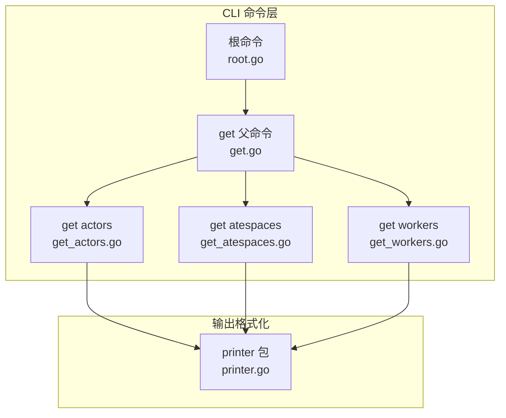
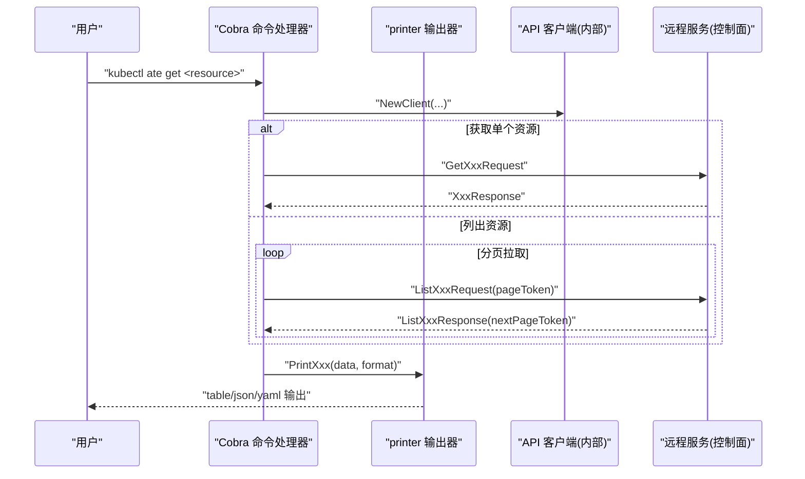
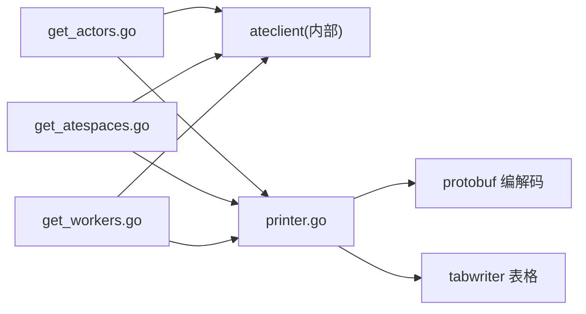

# 获取资源命令

<cite>
**本文引用的文件**
- [cmd/kubectl-ate/internal/cmd/root.go](file://cmd/kubectl-ate/internal/cmd/root.go)
- [cmd/kubectl-ate/internal/cmd/get.go](file://cmd/kubectl-ate/internal/cmd/get.go)
- [cmd/kubectl-ate/internal/cmd/get_actors.go](file://cmd/kubectl-ate/internal/cmd/get_actors.go)
- [cmd/kubectl-ate/internal/cmd/get_atespaces.go](file://cmd/kubectl-ate/internal/cmd/get_atespaces.go)
- [cmd/kubectl-ate/internal/cmd/get_workers.go](file://cmd/kubectl-ate/internal/cmd/get_workers.go)
- [cmd/kubectl-ate/internal/printer/printer.go](file://cmd/kubectl-ate/internal/printer/printer.go)
- [cmd/kubectl-ate/README.md](file://cmd/kubectl-ate/README.md)
</cite>

## 目录
1. [简介](#简介)
2. [项目结构](#项目结构)
3. [核心组件](#核心组件)
4. [架构总览](#架构总览)
5. [详细命令分析](#详细命令分析)
6. [依赖关系分析](#依赖关系分析)
7. [性能与输出格式](#性能与输出格式)
8. [故障排查指南](#故障排查指南)
9. [结论](#结论)

## 简介
本文件聚焦于 kubectl-ate 插件中“获取资源”相关的 CLI 命令，包括：
- get actors（或 get actor）
- get atespaces（或 get atespace）
- get workers（或 get worker）

内容涵盖命令用法、参数选项、输出格式、过滤与排序能力、表格打印配置、常见错误处理与排障建议。读者无需深入代码即可理解如何高效查询 Actor、Atespace 与 Worker 的状态信息。

## 项目结构
获取资源相关命令位于 kubectl-ate 子命令树中，采用 Cobra 构建命令行框架；输出格式化逻辑集中在 printer 包中。

图表来源
- [cmd/kubectl-ate/internal/cmd/root.go:34-61](file://cmd/kubectl-ate/internal/cmd/root.go#L34-L61)
- [cmd/kubectl-ate/internal/cmd/get.go:21-28](file://cmd/kubectl-ate/internal/cmd/get.go#L21-L28)
- [cmd/kubectl-ate/internal/cmd/get_actors.go:31-98](file://cmd/kubectl-ate/internal/cmd/get_actors.go#L31-L98)
- [cmd/kubectl-ate/internal/cmd/get_atespaces.go:26-68](file://cmd/kubectl-ate/internal/cmd/get_atespaces.go#L26-L68)
- [cmd/kubectl-ate/internal/cmd/get_workers.go:26-57](file://cmd/kubectl-ate/internal/cmd/get_workers.go#L26-L57)
- [cmd/kubectl-ate/internal/printer/printer.go:45-174](file://cmd/kubectl-ate/internal/printer/printer.go#L45-L174)

章节来源
- [cmd/kubectl-ate/internal/cmd/root.go:34-61](file://cmd/kubectl-ate/internal/cmd/root.go#L34-L61)
- [cmd/kubectl-ate/internal/cmd/get.go:21-28](file://cmd/kubectl-ate/internal/cmd/get.go#L21-L28)

## 核心组件
- 全局持久化标志（所有子命令共享）
  - --kubeconfig：指定 kubeconfig 路径
  - --context：指定 kubeconfig 上下文
  - --endpoint：手动覆盖 gRPC 目标地址（不自动端口转发）
  - -o/--output：输出格式，支持 table、json、yaml
  - --trace：开启请求追踪
- get 命令组
  - get actors / get actor：列出或获取一个或多个 Actor
  - get atespaces / get atespace：列出或获取一个或多个 Atespace
  - get workers / get worker：列出所有 Worker
- 输出格式化器
  - 统一通过 printer 包进行排序与渲染，支持表格、JSON、YAML

章节来源
- [cmd/kubectl-ate/internal/cmd/root.go:54-61](file://cmd/kubectl-ate/internal/cmd/root.go#L54-L61)
- [cmd/kubectl-ate/internal/cmd/get_actors.go:101-105](file://cmd/kubectl-ate/internal/cmd/get_actors.go#L101-L105)
- [cmd/kubectl-ate/internal/cmd/get_atespaces.go:71-73](file://cmd/kubectl-ate/internal/cmd/get_atespaces.go#L71-L73)
- [cmd/kubectl-ate/internal/cmd/get_workers.go:60-62](file://cmd/kubectl-ate/internal/cmd/get_workers.go#L60-L62)
- [cmd/kubectl-ate/internal/printer/printer.go:45-174](file://cmd/kubectl-ate/internal/printer/printer.go#L45-L174)

## 架构总览
下图展示了从用户执行到最终输出的关键调用链：Cobra 解析命令与参数 → 建立客户端连接 → 调用 API 列表/获取资源 → 排序与格式化输出。

图表来源
- [cmd/kubectl-ate/internal/cmd/get_actors.go:35-98](file://cmd/kubectl-ate/internal/cmd/get_actors.go#L35-L98)
- [cmd/kubectl-ate/internal/cmd/get_atespaces.go:30-68](file://cmd/kubectl-ate/internal/cmd/get_atespaces.go#L30-L68)
- [cmd/kubectl-ate/internal/cmd/get_workers.go:31-57](file://cmd/kubectl-ate/internal/cmd/get_workers.go#L31-L57)
- [cmd/kubectl-ate/internal/printer/printer.go:45-174](file://cmd/kubectl-ate/internal/printer/printer.go#L45-L174)

## 详细命令分析

### 通用全局标志
- --kubeconfig：kubeconfig 文件路径
- --context：kubeconfig 上下文名称
- --endpoint：直接指定 gRPC 端点（跳过自动端口转发）
- -o/--output：输出格式，可选值 table、json、yaml
- --trace：为本次请求启用追踪

说明
- 根命令在启动时校验 -o 的取值，非法值将报错并退出。

章节来源
- [cmd/kubectl-ate/internal/cmd/root.go:40-45](file://cmd/kubectl-ate/internal/cmd/root.go#L40-L45)
- [cmd/kubectl-ate/internal/cmd/root.go:54-61](file://cmd/kubectl-ate/internal/cmd/root.go#L54-L61)

### get actors / get actor
用途
- 列出某 atespace 下全部 Actor，或跨所有 atespaces 列出
- 获取指定 atespace 下的一个或多个 Actor

必要参数与互斥规则
- 获取单个或多名 Actor 时，必须提供 --atespace/-a；不允许使用 -A/--all-atespaces
- 列出时，二选一：--atespace/-a 指定单一 atespace，或 -A/--all-atespaces 列出全部
- --atespace 与 -A 互斥

分页与限制
- 列表接口按页拉取，每页最大 1000 条，直至 next_page_token 为空

输出列（表格模式）
- ATESPACE：Actor 所属隔离域
- NAME：Actor 名称
- TEMPLATE：模板引用，形如 namespace/name
- STATUS：运行状态枚举
- ATEOM POD：当前承载 Pod（namespace/name），挂起时为空
- ATEOM IP：Pod IP，挂起时为空
- VERSION：单调递增版本号
- AGE：创建时长（人类可读）

过滤与排序
- 过滤：仅支持按 atespace 范围筛选（--atespace 或 -A）
- 排序：先按 atespace，再按模板命名空间、模板名、最后按 Actor 名称

示例
- 列出某 atespace 下所有 Actor：kubectl ate get actors --atespace <name>
- 列出所有 atespaces 下所有 Actor：kubectl ate get actors -A
- 获取单个 Actor（需指定 atespace）：kubectl ate get actor <actor-name> --atespace <name>
- 以 YAML 输出：kubectl ate get actors --atespace <name> -o yaml

章节来源
- [cmd/kubectl-ate/internal/cmd/get_actors.go:31-98](file://cmd/kubectl-ate/internal/cmd/get_actors.go#L31-L98)
- [cmd/kubectl-ate/internal/cmd/get_actors.go:101-105](file://cmd/kubectl-ate/internal/cmd/get_actors.go#L101-L105)
- [cmd/kubectl-ate/README.md:75-96](file://cmd/kubectl-ate/README.md#L75-L96)
- [cmd/kubectl-ate/README.md:97-109](file://cmd/kubectl-ate/README.md#L97-L109)
- [cmd/kubectl-ate/internal/printer/printer.go:50-93](file://cmd/kubectl-ate/internal/printer/printer.go#L50-L93)

### get atespaces / get atespace
用途
- 列出所有 Atespace，或获取一个或多个指定名称的 Atespace

分页与限制
- 列表接口按页拉取，每页最大 1000 条，直至 next_page_token 为空

输出列（表格模式）
- NAME：Atespace 名称（全局唯一）
- AGE：创建时长（人类可读）

过滤与排序
- 过滤：无额外过滤项
- 排序：按名称升序

示例
- 列出所有 Atespace：kubectl ate get atespaces
- 获取单个 Atespace：kubectl ate get atespace <name>
- 以 JSON 输出：kubectl ate get atespaces -o json

章节来源
- [cmd/kubectl-ate/internal/cmd/get_atespaces.go:26-68](file://cmd/kubectl-ate/internal/cmd/get_atespaces.go#L26-L68)
- [cmd/kubectl-ate/README.md:120-146](file://cmd/kubectl-ate/README.md#L120-L146)
- [cmd/kubectl-ate/internal/printer/printer.go:152-174](file://cmd/kubectl-ate/internal/printer/printer.go#L152-L174)

### get workers / get worker
用途
- 列出所有 Worker（物理工作进程/容器）

分页与限制
- 列表接口按页拉取，每页最大 1000 条，直至 next_page_token 为空

输出列（表格模式）
- NAMESPACE：WorkerPool 所在命名空间
- POOL：WorkerPool 名称
- POD：Worker Pod 名称
- STATUS：FREE（空闲）或 ASSIGNED（已分配）
- ASSIGNED ACTOR：当状态为 ASSIGNED 时显示，形如 namespace/template/atespace/actor

过滤与排序
- 过滤：无额外过滤项
- 排序：先按命名空间，再按池名，最后按 Pod 名

示例
- 列出所有 Worker：kubectl ate get workers
- 以 YAML 输出：kubectl ate get workers -o yaml

章节来源
- [cmd/kubectl-ate/internal/cmd/get_workers.go:26-57](file://cmd/kubectl-ate/internal/cmd/get_workers.go#L26-L57)
- [cmd/kubectl-ate/README.md:89-96](file://cmd/kubectl-ate/README.md#L89-L96)
- [cmd/kubectl-ate/internal/printer/printer.go:100-140](file://cmd/kubectl-ate/internal/printer/printer.go#L100-L140)

## 依赖关系分析
- 命令层依赖
  - get_actors.go、get_atespaces.go、get_workers.go 均依赖 ateclient 建立连接并调用远端 API
  - 三者均依赖 printer 完成数据排序与输出
- 输出层依赖
  - printer 使用标准库与 protobuf 编解码工具实现 table/json/yaml 三种格式
  - 表格输出使用 tabwriter 对齐列宽

图表来源
- [cmd/kubectl-ate/internal/cmd/get_actors.go:35-98](file://cmd/kubectl-ate/internal/cmd/get_actors.go#L35-L98)
- [cmd/kubectl-ate/internal/cmd/get_atespaces.go:30-68](file://cmd/kubectl-ate/internal/cmd/get_atespaces.go#L30-L68)
- [cmd/kubectl-ate/internal/cmd/get_workers.go:31-57](file://cmd/kubectl-ate/internal/cmd/get_workers.go#L31-L57)
- [cmd/kubectl-ate/internal/printer/printer.go:45-174](file://cmd/kubectl-ate/internal/printer/printer.go#L45-L174)

章节来源
- [cmd/kubectl-ate/internal/cmd/get_actors.go:35-98](file://cmd/kubectl-ate/internal/cmd/get_actors.go#L35-L98)
- [cmd/kubectl-ate/internal/cmd/get_atespaces.go:30-68](file://cmd/kubectl-ate/internal/cmd/get_atespaces.go#L30-L68)
- [cmd/kubectl-ate/internal/cmd/get_workers.go:31-57](file://cmd/kubectl-ate/internal/cmd/get_workers.go#L31-L57)
- [cmd/kubectl-ate/internal/printer/printer.go:45-174](file://cmd/kubectl-ate/internal/printer/printer.go#L45-L174)

## 性能与输出格式
- 分页策略
  - 列表类命令默认每页 1000 条，循环拉取直到 next_page_token 为空
- 排序开销
  - 内存中对结果切片进行排序，时间复杂度近似 O(n log n)，n 为返回条目数
- 输出格式
  - table：适合终端阅读，列宽自适应
  - json：结构化输出，便于脚本处理
  - yaml：人类可读的结构化输出
- 自定义输出
  - 当前不支持自定义列或字段选择，如需定制可结合 -o json/yaml 后使用外部工具（jq、yq）二次加工

章节来源
- [cmd/kubectl-ate/internal/cmd/get_actors.go:76-97](file://cmd/kubectl-ate/internal/cmd/get_actors.go#L76-L97)
- [cmd/kubectl-ate/internal/cmd/get_atespaces.go:50-67](file://cmd/kubectl-ate/internal/cmd/get_atespaces.go#L50-L67)
- [cmd/kubectl-ate/internal/cmd/get_workers.go:39-55](file://cmd/kubectl-ate/internal/cmd/get_workers.go#L39-L55)
- [cmd/kubectl-ate/internal/printer/printer.go:45-174](file://cmd/kubectl-ate/internal/printer/printer.go#L45-L174)

## 故障排查指南
常见问题与定位要点
- 未指定必要的 atespace
  - 现象：获取单个 Actor 时报错提示需要 --atespace
  - 解决：显式传入 --atespace/-a
- 同时使用 --atespace 与 -A
  - 现象：报错提示二者互斥
  - 解决：仅保留其一
- 输出格式非法
  - 现象：启动即报错，提示 -o 必须是 table/json/yaml 之一
  - 解决：修正 -o 的值
- 无法连接服务端
  - 现象：连接 ate-api-server 失败
  - 排查：检查 --endpoint 是否指向正确地址；若未设置，确认集群内端口转发是否正常；必要时使用 --endpoint 直连
- 列表结果为空
  - 现象：get actors 无输出
  - 排查：确认 atespace 是否正确；确认是否存在该 Actor；注意 get actors 在无参数时必须使用 -A 或 --atespace

章节来源
- [cmd/kubectl-ate/internal/cmd/get_actors.go:46-74](file://cmd/kubectl-ate/internal/cmd/get_actors.go#L46-L74)
- [cmd/kubectl-ate/internal/cmd/root.go:40-45](file://cmd/kubectl-ate/internal/cmd/root.go#L40-L45)
- [cmd/kubectl-ate/internal/cmd/get_actors.go:35-43](file://cmd/kubectl-ate/internal/cmd/get_actors.go#L35-L43)
- [cmd/kubectl-ate/internal/cmd/get_atespaces.go:30-47](file://cmd/kubectl-ate/internal/cmd/get_atespaces.go#L30-L47)
- [cmd/kubectl-ate/internal/cmd/get_workers.go:31-47](file://cmd/kubectl-ate/internal/cmd/get_workers.go#L31-L47)

## 结论
- get actors、get atespaces、get workers 三组命令覆盖了 Substrate 控制面核心资源的查看需求
- 通过统一的 -o 输出格式与稳定的排序策略，既能满足交互式浏览，也便于自动化处理
- 建议在大规模场景下优先使用 -o json/yaml 并结合外部工具进行过滤与聚合
- 遇到连接或参数问题时，依据本节“故障排查指南”逐项定位
