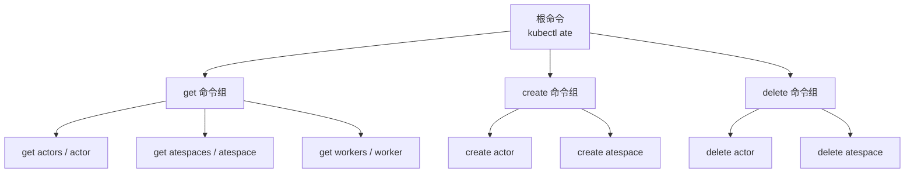
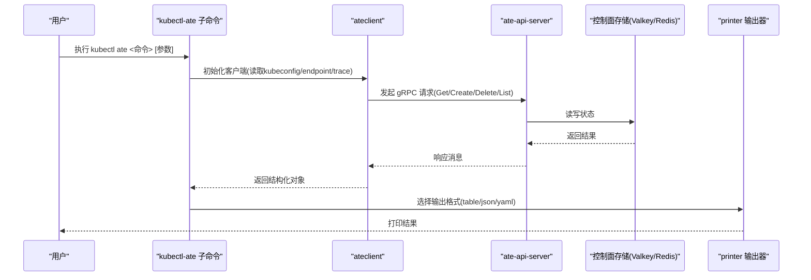

# 资源管理命令

<cite>
**本文引用的文件**   
- [README.md](file://cmd/kubectl-ate/README.md)
- [get.go](file://cmd/kubectl-ate/internal/cmd/get.go)
- [create.go](file://cmd/kubectl-ate/internal/cmd/create.go)
- [delete.go](file://cmd/kubectl-ate/internal/cmd/delete.go)
- [get_actors.go](file://cmd/kubectl-ate/internal/cmd/get_actors.go)
- [get_atespaces.go](file://cmd/kubectl-ate/internal/cmd/get_atespaces.go)
- [get_workers.go](file://cmd/kubectl-ate/internal/cmd/get_workers.go)
- [create_actor.go](file://cmd/kubectl-ate/internal/cmd/create_actor.go)
- [create_atespace.go](file://cmd/kubectl-ate/internal/cmd/create_atespace.go)
- [delete_actor.go](file://cmd/kubectl-ate/internal/cmd/delete_actor.go)
- [delete_atespace.go](file://cmd/kubectl-ate/internal/cmd/delete_atespace.go)
- [printer.go](file://cmd/kubectl-ate/internal/printer/printer.go)
- [actortemplate_types.go](file://pkg/api/v1alpha1/actortemplate_types.go)
- [workerpool_types.go](file://pkg/api/v1alpha1/workerpool_types.go)
</cite>

## 目录
1. [简介](#简介)
2. [项目结构](#项目结构)
3. [核心组件](#核心组件)
4. [架构总览](#架构总览)
5. [详细命令说明](#详细命令说明)
6. [依赖关系与约束](#依赖关系与约束)
7. [输出格式与表格打印配置](#输出格式与表格打印配置)
8. [性能与使用建议](#性能与使用建议)
9. [故障排查指南](#故障排查指南)
10. [结论](#结论)

## 简介
本章节面向使用 kubectl-ate 插件的用户，系统化梳理资源管理相关 CLI 命令，覆盖 get、create、delete 等核心操作，并详细说明 Actor、WorkerPool、ActorTemplate 等 Kubernetes CRD 资源的 CRUD 能力。文档同时提供参数选项、标志位、配置文件说明、常见使用示例、输出格式与表格打印配置，以及资源间的依赖关系与约束条件。

## 项目结构
kubectl-ate 作为 kubectl 的插件，通过 Cobra 构建子命令树，按功能拆分到独立文件：
- 根命令与分组：get、create、delete
- 资源子命令：actors、atespaces、workers、actor、atespace
- 输出格式化：统一由 printer 包处理 table/json/yaml



图表来源
- [get.go:21-28](file://cmd/kubectl-ate/internal/cmd/get.go#L21-L28)
- [create.go:21-28](file://cmd/kubectl-ate/internal/cmd/create.go#L21-L28)
- [delete.go:21-28](file://cmd/kubectl-ate/internal/cmd/delete.go#L21-L28)
- [get_actors.go:31-105](file://cmd/kubectl-ate/internal/cmd/get_actors.go#L31-L105)
- [get_atespaces.go:26-73](file://cmd/kubectl-ate/internal/cmd/get_atespaces.go#L26-L73)
- [get_workers.go:26-62](file://cmd/kubectl-ate/internal/cmd/get_workers.go#L26-L62)
- [create_actor.go:30-72](file://cmd/kubectl-ate/internal/cmd/create_actor.go#L30-L72)
- [create_atespace.go:26-55](file://cmd/kubectl-ate/internal/cmd/create_atespace.go#L26-L55)
- [delete_actor.go:27-56](file://cmd/kubectl-ate/internal/cmd/delete_actor.go#L27-L56)
- [delete_atespace.go:25-49](file://cmd/kubectl-ate/internal/cmd/delete_atespace.go#L25-L49)

章节来源
- [README.md:1-198](file://cmd/kubectl-ate/README.md#L1-L198)

## 核心组件
- 命令注册与入口
  - get、create、delete 三个顶级命令分别挂载各自子命令，形成清晰的资源操作边界。
- 客户端连接
  - 各子命令在运行前通过 ateclient 建立与 ate-api-server 的连接（支持自动端口转发或手动 endpoint）。
- 数据访问
  - 针对 Actor、Atespace、Worker 的获取、创建、删除均调用对应的 gRPC 接口。
- 输出格式化
  - 统一通过 printer 包将结果以 table/json/yaml 输出，table 模式包含固定列头与排序逻辑。

章节来源
- [get.go:21-28](file://cmd/kubectl-ate/internal/cmd/get.go#L21-L28)
- [create.go:21-28](file://cmd/kubectl-ate/internal/cmd/create.go#L21-L28)
- [delete.go:21-28](file://cmd/kubectl-ate/internal/cmd/delete.go#L21-L28)
- [get_actors.go:35-98](file://cmd/kubectl-ate/internal/cmd/get_actors.go#L35-L98)
- [get_atespaces.go:30-68](file://cmd/kubectl-ate/internal/cmd/get_atespaces.go#L30-L68)
- [get_workers.go:31-57](file://cmd/kubectl-ate/internal/cmd/get_workers.go#L31-L57)
- [create_actor.go:34-63](file://cmd/kubectl-ate/internal/cmd/create_actor.go#L34-L63)
- [create_atespace.go:30-50](file://cmd/kubectl-ate/internal/cmd/create_atespace.go#L30-L50)
- [delete_actor.go:31-48](file://cmd/kubectl-ate/internal/cmd/delete_actor.go#L31-L48)
- [delete_atespace.go:29-43](file://cmd/kubectl-ate/internal/cmd/delete_atespace.go#L29-L43)
- [printer.go:45-218](file://cmd/kubectl-ate/internal/printer/printer.go#L45-L218)

## 架构总览
下图展示了从用户执行命令到服务端返回结果的端到端流程，包括全局标志解析、gRPC 调用与输出格式化。



图表来源
- [get_actors.go:35-98](file://cmd/kubectl-ate/internal/cmd/get_actors.go#L35-L98)
- [create_actor.go:34-63](file://cmd/kubectl-ate/internal/cmd/create_actor.go#L34-L63)
- [delete_actor.go:31-48](file://cmd/kubectl-ate/internal/cmd/delete_actor.go#L31-L48)
- [get_atespaces.go:30-68](file://cmd/kubectl-ate/internal/cmd/get_atespaces.go#L30-L68)
- [create_atespace.go:30-50](file://cmd/kubectl-ate/internal/cmd/create_atespace.go#L30-L50)
- [delete_atespace.go:29-43](file://cmd/kubectl-ate/internal/cmd/delete_atespace.go#L29-L43)
- [get_workers.go:31-57](file://cmd/kubectl-ate/internal/cmd/get_workers.go#L31-L57)
- [printer.go:45-218](file://cmd/kubectl-ate/internal/printer/printer.go#L45-L218)

## 详细命令说明

### 全局标志
- --kubeconfig：kubeconfig 路径，默认 ~/.kube/config
- --endpoint：手动指定 gRPC 端点，绕过自动端口转发
- -o/--output：输出格式，支持 table、json、yaml，默认 table
- --trace：开启单次请求的追踪

章节来源
- [README.md:62-70](file://cmd/kubectl-ate/README.md#L62-L70)

### get 命令族
- get actors / actor
  - 用途：列出所有 Actor 或获取一个或多个 Actor
  - 必填/可选参数
    - 获取单个或多名 Actor：必须提供 --atespace/-a；不支持 -A
    - 列出 Actor：必须提供 --atespace/-a 或 -A/--all-atespaces，二者互斥
  - 输出列（table）：ATESPACE、NAME、TEMPLATE、STATUS、ATEOM POD、ATEOM IP、VERSION、AGE
- get atespaces / atespace
  - 用途：列出所有 Atespace 或获取一个或多个 Atespace
  - 无额外标志
  - 输出列（table）：NAME、AGE
- get workers / worker
  - 用途：列出所有 Worker
  - 无额外标志
  - 输出列（table）：NAMESPACE、POOL、POD、STATUS、ASSIGNED ACTOR

章节来源
- [get_actors.go:31-105](file://cmd/kubectl-ate/internal/cmd/get_actors.go#L31-L105)
- [get_atespaces.go:26-73](file://cmd/kubectl-ate/internal/cmd/get_atespaces.go#L26-L73)
- [get_workers.go:26-62](file://cmd/kubectl-ate/internal/cmd/get_workers.go#L26-L62)
- [README.md:73-119](file://cmd/kubectl-ate/README.md#L73-L119)

### create 命令族
- create atespace
  - 用途：创建一个隔离域（Atespace），必须先于 Actor 存在
  - 参数：位置参数 name
- create actor
  - 用途：基于 ActorTemplate 创建 Actor
  - 必填标志
    - --template/-t：模板引用，格式为 namespace/name
    - --atespace/-a：目标 Atespace 名称
  - 注意：若 Atespace 不存在会失败

章节来源
- [create_atespace.go:26-55](file://cmd/kubectl-ate/internal/cmd/create_atespace.go#L26-L55)
- [create_actor.go:30-72](file://cmd/kubectl-ate/internal/cmd/create_actor.go#L30-L72)
- [README.md:120-138](file://cmd/kubectl-ate/README.md#L120-L138)

### delete 命令族
- delete atespace
  - 用途：删除空的 Atespace（若有 Actor 残留则失败）
  - 参数：位置参数 name
- delete actor
  - 用途：删除指定 Actor
  - 必填标志：--atespace/-a

章节来源
- [delete_atespace.go:25-49](file://cmd/kubectl-ate/internal/cmd/delete_atespace.go#L25-L49)
- [delete_actor.go:27-56](file://cmd/kubectl-ate/internal/cmd/delete_actor.go#L27-L56)
- [README.md:134-138](file://cmd/kubectl-ate/README.md#L134-L138)

### 常用场景示例
- 列出某 Atespace 下的所有 Actor
  - kubectl ate get actors --atespace <atespace>
- 跨所有 Atespace 列出 Actor
  - kubectl ate get actors -A
- 获取单个 Actor 并以 YAML 输出
  - kubectl ate get actor <name> --atespace <atespace> -o yaml
- 列出所有 Worker
  - kubectl ate get workers
- 创建 Atespace
  - kubectl ate create atespace <name>
- 基于模板创建 Actor
  - kubectl ate create actor <name> --template <ns>/<tpl> --atespace <atespace>
- 删除 Actor
  - kubectl ate delete actor <name> --atespace <atespace>
- 删除空 Atespace
  - kubectl ate delete atespace <name>

章节来源
- [README.md:73-165](file://cmd/kubectl-ate/README.md#L73-L165)

## 依赖关系与约束
- Atespace 是 Actor 的隔离边界，必须在创建 Actor 之前存在；删除 Atespace 仅允许为空。
- Actor 的生命周期受 WorkerPool 调度影响，但 Actor 本身并非 Kubernetes CRD，其状态位于控制面存储中。
- WorkerPool 与 ActorTemplate 是 Kubernetes CRD，可通过标准 kubectl 进行 CRUD。

```mermaid
classDiagram
class ActorTemplate {
+spec.sandboxClass
+spec.workerSelector
+spec.volumes
+spec.containers
+status.phase
}
class WorkerPool {
+spec.replicas
+spec.ateomImage
+spec.sandboxClass
+spec.sandboxConfigName
+status.replicas
}
class Atespace {
+metadata.name
+metadata.createTime
}
class Actor {
+metadata.atespace
+metadata.name
+actorTemplateNamespace
+actorTemplateName
+status
+ateomPod*
}
Actor --> Atespace : "归属"
Actor --> ActorTemplate : "派生自"
ActorPoolNote["调度约束：ActorTemplate 的 sandboxClass 需与 WorkerPool 匹配"]
```

图表来源
- [actortemplate_types.go:283-375](file://pkg/api/v1alpha1/actortemplate_types.go#L283-L375)
- [workerpool_types.go:54-122](file://pkg/api/v1alpha1/workerpool_types.go#L54-L122)
- [get_actors.go:31-105](file://cmd/kubectl-ate/internal/cmd/get_actors.go#L31-L105)
- [get_atespaces.go:26-73](file://cmd/kubectl-ate/internal/cmd/get_atespaces.go#L26-L73)

章节来源
- [README.md:95-96](file://cmd/kubectl-ate/README.md#L95-L96)
- [README.md:120-138](file://cmd/kubectl-ate/README.md#L120-L138)
- [actortemplate_types.go:283-375](file://pkg/api/v1alpha1/actortemplate_types.go#L283-L375)
- [workerpool_types.go:54-122](file://pkg/api/v1alpha1/workerpool_types.go#L54-L122)

## 输出格式与表格打印配置
- 支持的输出格式
  - table：人类可读的表格视图，含固定列头与排序
  - json：规范化 JSON 输出（缩进一致）
  - yaml：由 JSON 转换而来，末尾带换行
- 表格列定义
  - actors：ATESPACE、NAME、TEMPLATE、STATUS、ATEOM POD、ATEOM IP、VERSION、AGE
  - atespaces：NAME、AGE
  - workers：NAMESPACE、POOL、POD、STATUS、ASSIGNED ACTOR
- 排序规则
  - actors：按 atespace → 模板命名空间 → 模板名称 → actor 名称排序
  - workers：按命名空间 → pool → pod 排序
  - atespaces：按名称排序
- 时间显示
  - AGE 采用人类可读的相对时间（如 5m、3h、2d）

章节来源
- [printer.go:45-218](file://cmd/kubectl-ate/internal/printer/printer.go#L45-L218)
- [README.md:97-119](file://cmd/kubectl-ate/README.md#L97-L119)

## 性能与使用建议
- 分页拉取：列表类命令内部使用分页（PageSize=1000），适合大规模资源场景
- 避免重复查询：结合 -o yaml/json 将结果持久化，减少多次网络往返
- 合理筛选范围：尽量使用 --atespace 限定范围，避免全量扫描
- 观察 Worker 分配：通过 get workers 了解负载分布，辅助定位热点

[本节为通用建议，不直接分析具体文件]

## 故障排查指南
- 连接问题
  - 现象：无法连接到 ate-api-server
  - 排查：检查 kubeconfig、集群上下文、是否启用自动端口转发或是否正确设置 --endpoint
- 参数校验错误
  - 现象：缺少 --atespace 或 -A 冲突
  - 排查：遵循“获取单个 Actor 必须 --atespace；列出时二选一”的规则
- 前置条件失败
  - 现象：创建 Actor 时报 FailedPrecondition
  - 排查：确认 Atespace 已存在；删除 Atespace 前确保其中无 Actor
- 输出异常
  - 现象：-o 值不被支持
  - 排查：仅支持 table/json/yaml

章节来源
- [get_actors.go:49-74](file://cmd/kubectl-ate/internal/cmd/get_actors.go#L49-L74)
- [create_actor.go:43-46](file://cmd/kubectl-ate/internal/cmd/create_actor.go#L43-L46)
- [README.md:134-138](file://cmd/kubectl-ate/README.md#L134-L138)
- [printer.go:181-218](file://cmd/kubectl-ate/internal/printer/printer.go#L181-L218)

## 结论
kubectl-ate 提供了围绕 Actor、Atespace、Worker 的一体化资源管理能力，并通过统一的输出格式与严格的参数校验提升易用性与可观测性。配合 ActorTemplate 与 WorkerPool 两个 CRD，可实现对沙箱工作负载的声明式编排与弹性伸缩。建议在复杂环境中优先使用 --atespace 缩小查询范围，并结合日志与追踪能力进行排障与优化。
