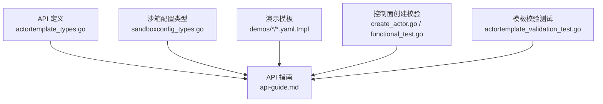
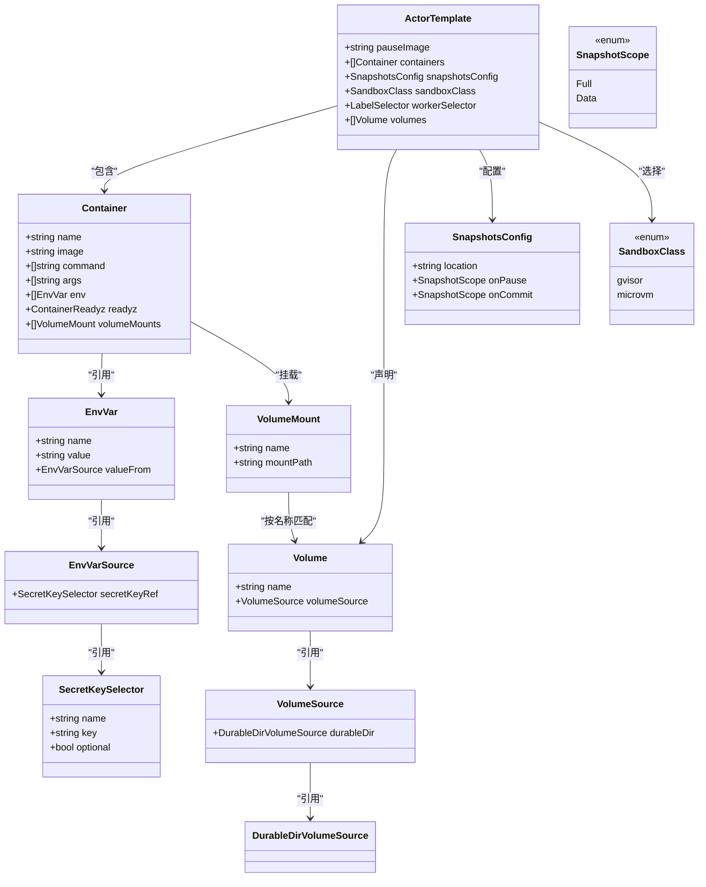
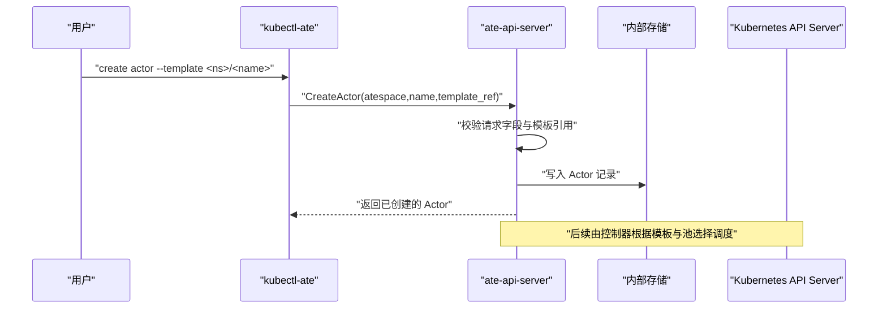
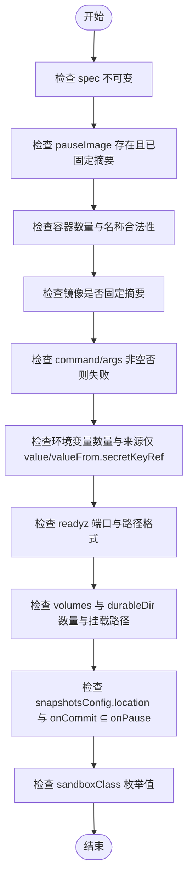
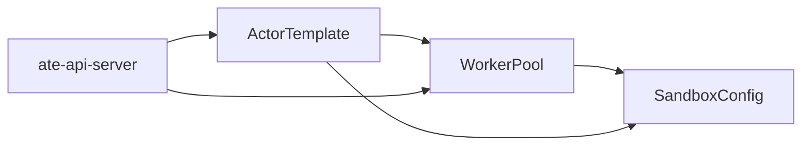

# ActorTemplate资源

<cite>
**本文引用的文件**   
- [actortemplate_types.go](file://pkg/api/v1alpha1/actortemplate_types.go)
- [sandboxconfig_types.go](file://pkg/api/v1alpha1/sandboxconfig_types.go)
- [api-guide.md](file://docs/api-guide.md)
- [counter.yaml.tmpl](file://demos/counter/counter.yaml.tmpl)
- [counter-microvm.yaml.tmpl](file://demos/counter/counter-microvm.yaml.tmpl)
- [multi-template.yaml.tmpl](file://demos/multi-template/multi-template.yaml.tmpl)
- [agent-secret.yaml.tmpl](file://demos/agent-secret/agent-secret.yaml.tmpl)
- [sandbox.yaml.tmpl](file://demos/sandbox/sandbox.yaml.tmpl)
- [create_actor.go](file://cmd/ateapi/internal/controlapi/create_actor.go)
- [functional_test.go](file://cmd/ateapi/internal/controlapi/functional_test.go)
- [actortemplate_validation_test.go](file://pkg/api/v1alpha1/actortemplate_validation_test.go)
</cite>

## 目录
1. [简介](#简介)
2. [项目结构](#项目结构)
3. [核心组件](#核心组件)
4. [架构总览](#架构总览)
5. [详细组件分析](#详细组件分析)
6. [依赖关系分析](#依赖关系分析)
7. [性能与快照策略](#性能与快照策略)
8. [故障排除指南](#故障排除指南)
9. [结论](#结论)
10. [附录：YAML示例与kubectl操作](#附录yaml示例与kubectl操作)

## 简介
本文件系统性说明 ActorTemplate 自定义资源定义（CRD）的完整字段结构、校验规则、运行时行为以及与 WorkerPool、SandboxConfig 的关系。重点覆盖：
- 容器镜像配置、环境变量、就绪探针、存储卷挂载
- SandboxClass 如何指定沙箱运行时类型（gvisor 或 microvm）及关联配置
- 模板继承与组合模式
- Actor 实例创建流程与模板验证规则
- kubectl 操作示例与常见问题排查

## 项目结构
ActorTemplate 的定义位于 API 包中，配合文档与演示模板共同构成使用参考。关键位置如下：
- CRD 类型定义与校验注解：pkg/api/v1alpha1/actortemplate_types.go
- 沙箱运行时族与二进制配置：pkg/api/v1alpha1/sandboxconfig_types.go
- 官方 API 指南：docs/api-guide.md
- 演示模板（gVisor 与 microvm 两种运行方式）：demos/counter/*.yaml.tmpl, demos/multi-template/*.yaml.tmpl, demos/agent-secret/*.yaml.tmpl, demos/sandbox/*.yaml.tmpl
- 控制面创建 Actor 的校验与错误路径：cmd/ateapi/internal/controlapi/create_actor.go, functional_test.go
- 模板字段级单元测试（覆盖大量校验场景）：pkg/api/v1alpha1/actortemplate_validation_test.go

**图表来源**
- [actortemplate_types.go:1-390](file://pkg/api/v1alpha1/actortemplate_types.go#L1-L390)
- [sandboxconfig_types.go:1-117](file://pkg/api/v1alpha1/sandboxconfig_types.go#L1-L117)
- [api-guide.md:1-311](file://docs/api-guide.md#L1-L311)
- [create_actor.go:1-120](file://cmd/ateapi/internal/controlapi/create_actor.go#L1-L120)
- [functional_test.go:1924-2021](file://cmd/ateapi/internal/controlapi/functional_test.go#L1924-L2021)
- [actortemplate_validation_test.go:1-800](file://pkg/api/v1alpha1/actortemplate_validation_test.go#L1-L800)

**章节来源**
- [actortemplate_types.go:1-390](file://pkg/api/v1alpha1/actortemplate_types.go#L1-L390)
- [sandboxconfig_types.go:1-117](file://pkg/api/v1alpha1/sandboxconfig_types.go#L1-L117)
- [api-guide.md:1-311](file://docs/api-guide.md#L1-L311)

## 核心组件
- ActorTemplate：描述工作负载蓝图（容器镜像、命令参数、环境变量、就绪探针、持久化卷、快照策略、沙箱类、调度选择器）。
- Container：单个进程定义，包含镜像、入口、参数、环境变量、就绪探针、卷挂载等。
- EnvVar/EnvVarSource/SecretKeySelector：环境变量值来源（仅支持字面值与 SecretKeyRef）。
- Volume/VolumeSource/DurableDirVolumeSource/VolumeMount：当前支持的卷类型为“可持久化目录”，参与快照并在恢复后保留。
- SnapshotsConfig：快照位置与范围（Full/Data），以及暂停/提交时的快照策略。
- SandboxClass：gvisor 或 microvm，作为强约束的调度门控。
- WorkerSelector：限制可选的 WorkerPool 集合。

上述字段在 CRD 中使用 kubebuilder 注解进行必填、长度、枚举、正则表达式与跨字段一致性校验。

**章节来源**
- [actortemplate_types.go:80-340](file://pkg/api/v1alpha1/actortemplate_types.go#L80-L340)
- [actortemplate_types.go:236-276](file://pkg/api/v1alpha1/actortemplate_types.go#L236-L276)
- [actortemplate_types.go:278-340](file://pkg/api/v1alpha1/actortemplate_types.go#L278-L340)
- [api-guide.md:83-176](file://docs/api-guide.md#L83-L176)

## 架构总览
ActorTemplate 通过 sandboxClass 与 WorkerPool 的沙箱运行时家族匹配，结合 workerSelector 进一步缩小候选池；SandboxConfig 提供运行时二进制（如 gVisor runsc 或 microvm 工具链），由 WorkerPool 解析并驱动 ateom 执行。

**图表来源**
- [actortemplate_types.go:80-340](file://pkg/api/v1alpha1/actortemplate_types.go#L80-L340)
- [actortemplate_types.go:236-276](file://pkg/api/v1alpha1/actortemplate_types.go#L236-L276)
- [actortemplate_types.go:278-340](file://pkg/api/v1alpha1/actortemplate_types.go#L278-L340)

## 详细组件分析

### 容器镜像与启动参数
- 镜像必须使用固定摘要（含 @sha256:...），变更镜像会失效快照。
- command/args 与镜像 ENTRYPOINT/CMD 的解析遵循 Kubernetes 语义；若最终 argv 为空，Run/Restore 失败。
- 不支持变量展开（$(VAR_NAME) 不展开）。

**章节来源**
- [actortemplate_types.go:89-116](file://pkg/api/v1alpha1/actortemplate_types.go#L89-L116)
- [api-guide.md:113-127](file://docs/api-guide.md#L113-L127)

### 环境变量设置
- 支持两种来源：
  - 字面值 value
  - 从 Secret 读取：valueFrom.secretKeyRef（name/key 必填，支持 optional）
- 不支持其他 valueFrom 来源（如 configMapKeyRef、fieldRef 等）。
- 安全注意：Secret 变更不会自动重启或使快照失效，需显式生命周期动作。

**章节来源**
- [actortemplate_types.go:169-234](file://pkg/api/v1alpha1/actortemplate_types.go#L169-L234)
- [api-guide.md:101](file://docs/api-guide.md#L101)

### 就绪探针（readyz）
- 可选 HTTP GET 探针，默认 path=/readyz，port 必填且范围 1..65535。
- 当任一容器未声明 readyz，平台沿用“启动即就绪”的旧行为；全部容器均声明时，Golden Snapshot 跳过默认等待。
- Run/Restore 阻塞直到所有带 readyz 的容器返回 200。

**章节来源**
- [actortemplate_types.go:124-167](file://pkg/api/v1alpha1/actortemplate_types.go#L124-L167)
- [api-guide.md:129-146](file://docs/api-guide.md#L129-L146)

### 存储卷挂载（DurableDir）
- 当前仅支持 durableDir 类型的卷，表示 rootfs 上的可持久化目录，参与快照并在恢复后保留。
- 每个 ActorTemplate 最多一个 durableDir 卷；每个容器最多挂载一个 durableDir 卷。
- mountPath 必须是干净的绝对 Unix 路径，禁止根路径、相对路径、尾随斜杠、重复斜杠、冒号、控制字符、.. 和 . 组件等。

**章节来源**
- [actortemplate_types.go:32-78](file://pkg/api/v1alpha1/actortemplate_types.go#L32-L78)
- [actortemplate_types.go:278-340](file://pkg/api/v1alpha1/actortemplate_types.go#L278-L340)
- [actortemplate_validation_test.go:563-800](file://pkg/api/v1alpha1/actortemplate_validation_test.go#L563-L800)

### 快照策略（SnapshotsConfig）
- location：快照存储位置（GCS 等对象存储地址）。
- onPause/onCommit：取值 Full 或 Data。onCommit 必须是 onPause 的子集；默认均为 Full。
- 当 onPause=Data 时，onCommit 也必须为 Data。

**章节来源**
- [actortemplate_types.go:236-276](file://pkg/api/v1alpha1/actortemplate_types.go#L236-L276)
- [actortemplate_validation_test.go:507-562](file://pkg/api/v1alpha1/actortemplate_validation_test.go#L507-L562)

### 沙箱类（SandboxClass）与 SandboxConfig
- sandboxClass 取值 gvisor 或 microvm，作为强约束的调度门控，与 WorkerPool 的 sandboxClass 严格匹配。
- 沙箱二进制（runsc 或 microvm 工具链）不再配置在 ActorTemplate，而是由 WorkerPool 解析其 SandboxConfig（按名称或集群默认）。
- microvm 需要 KVM/vhost 设备与特定节点标签，且对 assets 有完整性校验。

**章节来源**
- [actortemplate_types.go:306-324](file://pkg/api/v1alpha1/actortemplate_types.go#L306-L324)
- [sandboxconfig_types.go:21-79](file://pkg/api/v1alpha1/sandboxconfig_types.go#L21-L79)
- [api-guide.md:99-101](file://docs/api-guide.md#L99-L101)
- [api-guide.md:180-221](file://docs/api-guide.md#L180-L221)

### 工作池选择器（WorkerSelector）
- 通过 label selector 限制 Actor 可用的 WorkerPool 集合；可与 Actor 自身的 worker_selector 叠加，只能收窄不能扩大。
- 与 sandboxClass 一起构成硬门控。

**章节来源**
- [actortemplate_types.go:326-333](file://pkg/api/v1alpha1/actortemplate_types.go#L326-L333)
- [api-guide.md:92-99](file://docs/api-guide.md#L92-L99)

### 模板状态与不可变性
- spec 不可变（创建后不允许修改）。
- status 包含阶段、黄金快照相关字段与条件。

**章节来源**
- [actortemplate_types.go:342-375](file://pkg/api/v1alpha1/actortemplate_types.go#L342-L375)
- [actortemplate_validation_test.go:999-1048](file://pkg/api/v1alpha1/actortemplate_validation_test.go#L999-L1048)

### 模板继承与组合模式
- 多模板共享同一 WorkerPool：不同命名空间下的多个 ActorTemplate 可通过相同的 workerSelector 指向同一个 pool，实现容量复用。
- 模板间无直接继承语法，但可通过共用 pool 与一致的 snapshot location 组织“组合”。

**章节来源**
- [multi-template.yaml.tmpl:15-23](file://demos/multi-template/multi-template.yaml.tmpl#L15-L23)
- [multi-template.yaml.tmpl:40-82](file://demos/multi-template/multi-template.yaml.tmpl#L40-L82)

### Actor 实例创建流程（序列图）

**图表来源**
- [create_actor.go:32-82](file://cmd/ateapi/internal/controlapi/create_actor.go#L32-L82)
- [functional_test.go:1924-2021](file://cmd/ateapi/internal/controlapi/functional_test.go#L1924-L2021)

**章节来源**
- [create_actor.go:32-82](file://cmd/ateapi/internal/controlapi/create_actor.go#L32-L82)
- [functional_test.go:1924-2021](file://cmd/ateapi/internal/controlapi/functional_test.go#L1924-L2021)

### 模板验证规则（流程图）

**图表来源**
- [actortemplate_types.go:278-340](file://pkg/api/v1alpha1/actortemplate_types.go#L278-L340)
- [actortemplate_validation_test.go:114-127](file://pkg/api/v1alpha1/actortemplate_validation_test.go#L114-L127)
- [actortemplate_validation_test.go:507-562](file://pkg/api/v1alpha1/actortemplate_validation_test.go#L507-L562)
- [actortemplate_validation_test.go:563-800](file://pkg/api/v1alpha1/actortemplate_validation_test.go#L563-L800)

**章节来源**
- [actortemplate_validation_test.go:114-127](file://pkg/api/v1alpha1/actortemplate_validation_test.go#L114-L127)
- [actortemplate_validation_test.go:507-562](file://pkg/api/v1alpha1/actortemplate_validation_test.go#L507-L562)
- [actortemplate_validation_test.go:563-800](file://pkg/api/v1alpha1/actortemplate_validation_test.go#L563-L800)

## 依赖关系分析
- ActorTemplate 依赖：
  - WorkerPool：通过 sandboxClass 与 workerSelector 选择可用物理池。
  - SandboxConfig：由 WorkerPool 解析，决定实际使用的沙箱二进制。
- 控制面依赖：
  - CreateActor 接口负责请求校验与落库，随后由控制器完成调度与资源编排。

**图表来源**
- [actortemplate_types.go:306-333](file://pkg/api/v1alpha1/actortemplate_types.go#L306-L333)
- [sandboxconfig_types.go:52-79](file://pkg/api/v1alpha1/sandboxconfig_types.go#L52-L79)
- [create_actor.go:32-82](file://cmd/ateapi/internal/controlapi/create_actor.go#L32-L82)

**章节来源**
- [actortemplate_types.go:306-333](file://pkg/api/v1alpha1/actortemplate_types.go#L306-L333)
- [sandboxconfig_types.go:52-79](file://pkg/api/v1alpha1/sandboxconfig_types.go#L52-L79)
- [create_actor.go:32-82](file://cmd/ateapi/internal/controlapi/create_actor.go#L32-L82)

## 性能与快照策略
- 就绪探针优化：当所有容器都声明 readyz，Golden Snapshot 跳过默认等待，加速模板就绪。
- 快照范围：Full 捕获内存+文件系统增量；Data 仅捕获支持快照的卷内容。合理选择可减少快照体积与恢复时间。
- 镜像固定：强制摘要避免镜像漂移导致快照不可用。

[本节为通用指导，无需源码引用]

## 故障排除指南
- 常见创建错误（来自控制面校验）：
  - 缺少或非法的 atespace/name
  - 模板命名空间/名称无效
  - worker_selector 键值非法或过多
- 模板校验失败：
  - 镜像未固定摘要
  - 环境变量同时设置 value 与 valueFrom
  - Secret 引用缺失 name/key 或格式非法
  - readyz 端口越界或路径不符合 RFC 3986
  - durableDir 卷数量超限或 mountPath 非法
  - onCommit 不是 onPause 的子集
  - sandboxClass 取值为非法枚举

建议定位步骤：
- 查看模板与 WorkerPool 的 sandboxClass 是否一致
- 确认 snapshotsConfig.location 可达且权限正确
- 检查 Secret 是否存在且 key 正确
- 使用 kubectl describe 查看条件与事件

**章节来源**
- [functional_test.go:1924-2021](file://cmd/ateapi/internal/controlapi/functional_test.go#L1924-L2021)
- [actortemplate_validation_test.go:114-127](file://pkg/api/v1alpha1/actortemplate_validation_test.go#L114-L127)
- [actortemplate_validation_test.go:278-390](file://pkg/api/v1alpha1/actortemplate_validation_test.go#L278-L390)
- [actortemplate_validation_test.go:494-506](file://pkg/api/v1alpha1/actortemplate_validation_test.go#L494-L506)
- [actortemplate_validation_test.go:507-562](file://pkg/api/v1alpha1/actortemplate_validation_test.go#L507-L562)
- [actortemplate_validation_test.go:563-800](file://pkg/api/v1alpha1/actortemplate_validation_test.go#L563-L800)

## 结论
ActorTemplate 提供了以“快照优先”的高密度 Agent 运行蓝图，通过严格的字段校验与沙箱类门控，确保可移植性与稳定性。结合 WorkerPool 与 SandboxConfig，可实现灵活的运行时选择与资源隔离。推荐在生产环境中：
- 固定镜像与沙箱版本
- 明确快照策略与存储位置
- 使用 readyz 提升就绪确定性
- 通过 workerSelector 精细化调度

[本节为总结性内容，无需源码引用]

## 附录：YAML示例与kubectl操作

### 基础应用模板（gVisor）
- 参考：[counter.yaml.tmpl:35-62](file://demos/counter/counter.yaml.tmpl#L35-L62)
- 要点：
  - 指定 pauseImage、containers.image（固定摘要）、readyz、workerSelector、snapshotsConfig.location
  - 使用 durableDir 卷挂载到容器路径

**章节来源**
- [counter.yaml.tmpl:35-62](file://demos/counter/counter.yaml.tmpl#L35-L62)

### 带持久化存储的模板
- 参考：[counter.yaml.tmpl:59-62](file://demos/counter/counter.yaml.tmpl#L59-L62)
- 要点：
  - volumes.durableDir 声明一个可持久化目录
  - container.volumeMounts.mountPath 为干净绝对路径

**章节来源**
- [counter.yaml.tmpl:59-62](file://demos/counter/counter.yaml.tmpl#L59-L62)

### 需要特殊权限的模板（microvm）
- 参考：[counter-microvm.yaml.tmpl:104-127](file://demos/counter/counter-microvm.yaml.tmpl#L104-L127)
- 要点：
  - sandboxClass=microvm，需对应 SandboxConfig 提供云超管与内核等资产
  - WorkerPool 指定 sandboxClass 与 sandboxConfigName

**章节来源**
- [counter-microvm.yaml.tmpl:104-127](file://demos/counter/counter-microvm.yaml.tmpl#L104-L127)
- [counter-microvm.yaml.tmpl:39-86](file://demos/counter/counter-microvm.yaml.tmpl#L39-L86)

### 多模板共享 WorkerPool（组合模式）
- 参考：[multi-template.yaml.tmpl:40-82](file://demos/multi-template/multi-template.yaml.tmpl#L40-L82)
- 要点：
  - 多个 ActorTemplate 使用相同 workerSelector 指向同一 pool
  - 各自独立 snapshotsConfig.location

**章节来源**
- [multi-template.yaml.tmpl:40-82](file://demos/multi-template/multi-template.yaml.tmpl#L40-L82)

### 环境变量注入（Secret）
- 参考：[agent-secret.yaml.tmpl:64-77](file://demos/agent-secret/agent-secret.yaml.tmpl#L64-L77)
- 要点：
  - env.value 字面值注入
  - 如需 SecretKeyRef，请确保 RBAC 允许 api-server 读取目标 Secret

**章节来源**
- [agent-secret.yaml.tmpl:64-77](file://demos/agent-secret/agent-secret.yaml.tmpl#L64-L77)

### 最小可用模板（无持久化）
- 参考：[sandbox.yaml.tmpl:31-49](file://demos/sandbox/sandbox.yaml.tmpl#L31-L49)
- 要点：
  - 仅声明必要字段：pauseImage、containers、workerSelector、snapshotsConfig.location

**章节来源**
- [sandbox.yaml.tmpl:31-49](file://demos/sandbox/sandbox.yaml.tmpl#L31-L49)

### kubectl 操作示例
- 安装 CLI 插件：
  - go install ./cmd/kubectl-ate
- 创建 atespace 与 Actor：
  - kubectl ate create atespace demo
  - kubectl ate create actor my-sandbox-1 -a demo --template ate-demo-sandbox/sandbox-template
- 等待模板就绪：
  - kubectl wait --for=condition=Ready actortemplate/sandbox-template -n ate-demo-sandbox --timeout=5m
- 删除 Actor 与 atespace：
  - kubectl ate delete actor my-sandbox-1 -a demo
  - kubectl ate delete atespace demo

**章节来源**
- [sandbox/README.md:40-97](file://demos/sandbox/README.md#L40-L97)
