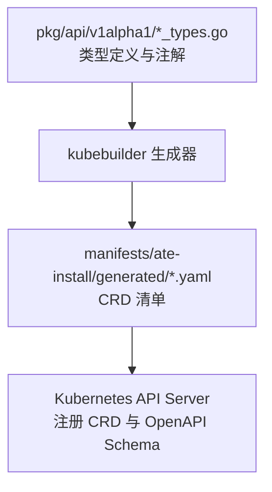
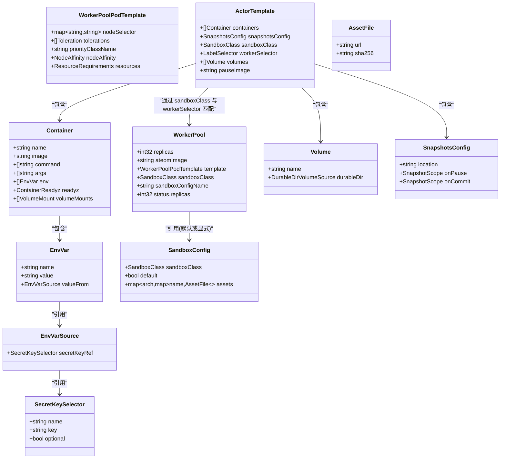
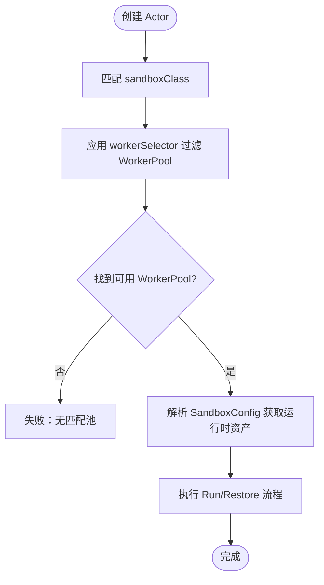

# Kubernetes CRD

<cite>
**本文引用的文件**   
- [pkg/api/v1alpha1/workerpool_types.go](file://pkg/api/v1alpha1/workerpool_types.go)
- [pkg/api/v1alpha1/actortemplate_types.go](file://pkg/api/v1alpha1/actortemplate_types.go)
- [pkg/api/v1alpha1/sandboxconfig_types.go](file://pkg/api/v1alpha1/sandboxconfig_types.go)
- [manifests/ate-install/generated/ate.dev_workerpools.yaml](file://manifests/ate-install/generated/ate.dev_workerpools.yaml)
- [manifests/ate-install/generated/ate.dev_actortemplates.yaml](file://manifests/ate-install/generated/ate.dev_actortemplates.yaml)
- [manifests/ate-install/generated/ate.dev_sandboxconfigs.yaml](file://manifests/ate-install/generated/ate.dev_sandboxconfigs.yaml)
- [docs/api-guide.md](file://docs/api-guide.md)
- [README.md](file://README.md)
</cite>

## 目录
1. [简介](#简介)
2. [项目结构](#项目结构)
3. [核心组件](#核心组件)
4. [架构总览](#架构总览)
5. [详细组件分析](#详细组件分析)
6. [依赖关系分析](#依赖关系分析)
7. [性能与扩缩容](#性能与扩缩容)
8. [故障排查指南](#故障排查指南)
9. [结论](#结论)
10. [附录：kubectl 使用示例与最佳实践](#附录kubectl-使用示例与最佳实践)

## 简介
本参考文档聚焦于 Agent Substrate 的 Kubernetes 自定义资源定义（CRD），覆盖以下三类资源：
- WorkerPool：物理“热”工作节点池，管理待命 Pod 的数量、调度与资源。
- ActorTemplate：应用蓝图，描述容器镜像、环境变量、卷挂载、快照策略以及沙箱运行类。
- SandboxConfig：集群级配置，声明 gVisor 或 MicroVM 运行时二进制资产及其校验信息。

文档提供字段说明、验证规则、YAML 示例路径、版本兼容性信息与迁移建议，并给出 kubectl 操作示例与最佳实践。

## 项目结构
本项目将 CRD 类型定义集中在 pkg/api/v1alpha1 下，并通过 kubebuilder 注解生成 OpenAPI v3 Schema，最终产出 manifests/ate-install/generated/*.yaml 中的 CRD 清单。

图表来源
- [pkg/api/v1alpha1/workerpool_types.go:1-136](file://pkg/api/v1alpha1/workerpool_types.go#L1-L136)
- [pkg/api/v1alpha1/actortemplate_types.go:1-390](file://pkg/api/v1alpha1/actortemplate_types.go#L1-L390)
- [pkg/api/v1alpha1/sandboxconfig_types.go:1-117](file://pkg/api/v1alpha1/sandboxconfig_types.go#L1-L117)
- [manifests/ate-install/generated/ate.dev_workerpools.yaml:1-438](file://manifests/ate-install/generated/ate.dev_workerpools.yaml#L1-L438)
- [manifests/ate-install/generated/ate.dev_actortemplates.yaml:1-488](file://manifests/ate-install/generated/ate.dev_actortemplates.yaml#L1-L488)
- [manifests/ate-install/generated/ate.dev_sandboxconfigs.yaml:1-129](file://manifests/ate-install/generated/ate.dev_sandboxconfigs.yaml#L1-L129)

章节来源
- [README.md:1-225](file://README.md#L1-L225)

## 核心组件
本节概述三类 CRD 的职责与关键能力：
- WorkerPool：声明副本数、ateom 镜像、可选的 Pod 模板（调度、亲和、容忍度、优先级、资源限制）以及沙箱运行类与默认/指定 SandboxConfig。
- ActorTemplate：声明容器镜像、入口命令与参数、环境变量、就绪探针、持久卷（仅支持 durableDir）、快照策略、沙箱运行类与 WorkerSelector。
- SandboxConfig：声明运行时家族（gvisor/microvm）、是否集群默认、按架构映射的资产集合（URL + SHA256）。

章节来源
- [pkg/api/v1alpha1/workerpool_types.go:22-89](file://pkg/api/v1alpha1/workerpool_types.go#L22-L89)
- [pkg/api/v1alpha1/actortemplate_types.go:80-340](file://pkg/api/v1alpha1/actortemplate_types.go#L80-L340)
- [pkg/api/v1alpha1/sandboxconfig_types.go:21-79](file://pkg/api/v1alpha1/sandboxconfig_types.go#L21-L79)

## 架构总览
三类 CRD 在系统中的协作关系如下：
- WorkerPool 通过 sandboxClass 与 sandboxConfigName 选择运行时家族与具体二进制资产。
- ActorTemplate 通过 sandboxClass 与 workerSelector 限定可落地的 WorkerPool 范围；其容器镜像、环境变量、卷与快照策略决定“黄金快照”的构建与恢复行为。
- SandboxConfig 为集群级运行时资产库，WorkerPool 若无显式名称则回退到对应 sandboxClass 的默认配置。

图表来源
- [pkg/api/v1alpha1/workerpool_types.go:22-89](file://pkg/api/v1alpha1/workerpool_types.go#L22-L89)
- [pkg/api/v1alpha1/actortemplate_types.go:80-340](file://pkg/api/v1alpha1/actortemplate_types.go#L80-L340)
- [pkg/api/v1alpha1/sandboxconfig_types.go:21-79](file://pkg/api/v1alpha1/sandboxconfig_types.go#L21-L79)

## 详细组件分析

### WorkerPool 资源
- 作用：定义物理“热”工作节点池，控制待命 Pod 数量、调度与资源，并选择沙箱运行类与运行时资产来源。
- 关键字段
  - replicas：期望的 Worker Pod 数量，最小值为 0。
  - ateomImage：Worker 使用的 ateom 进程镜像。
  - template：可选的 Pod 模板，包括 nodeSelector、tolerations、priorityClassName、nodeAffinity、resources。
  - sandboxClass：gvisor 或 microvm，影响 Worker Pod 形态与可用 SandboxConfig。
  - sandboxConfigName：可选，显式指定集群级 SandboxConfig 名称；为空时回退到该 sandboxClass 的默认配置。
- 状态字段
  - status.replicas：实际运行的 Worker Pod 总数。
- 子资源
  - status：用于观测状态。
  - scale：支持通过 .spec.replicas 与 .status.replicas 进行扩缩容。
- 打印列
  - Desired(.spec.replicas)、Replicas(.status.replicas)、Age。

章节来源
- [pkg/api/v1alpha1/workerpool_types.go:54-96](file://pkg/api/v1alpha1/workerpool_types.go#L54-L96)
- [manifests/ate-install/generated/ate.dev_workerpools.yaml:33-438](file://manifests/ate-install/generated/ate.dev_workerpools.yaml#L33-L438)

#### WorkerPool YAML 示例
- 基础示例与 GPU 节点调度示例请参考：
  - [docs/api-guide.md:29-79](file://docs/api-guide.md#L29-L79)

### ActorTemplate 资源
- 作用：定义应用的“蓝图”，用于构建“黄金快照”，并指导后续 Actor 的启动与恢复。
- 关键字段
  - containers：最多 10 个容器定义，每个容器包含 name、image、command、args、env、readyz、volumeMounts。
  - snapshotsConfig：快照存储位置与策略（onPause/onCommit），必填。
  - sandboxClass：gvisor 或 microvm，默认为 gvisor；与 WorkerPool 的 sandboxClass 必须匹配。
  - workerSelector：标签选择器，限制可匹配的 WorkerPool 集合。
  - volumes：当前仅支持 durableDir 类型的卷，且每个模板最多一个 durableDir。
  - pauseImage：根沙箱容器镜像，需以 digest 固定。
- 重要约束与验证
  - 所有镜像必须通过 digest 固定（包含 @sha256:...），否则拒绝。
  - spec 不可变。
  - 仅允许至多一个 durableDir 卷；容器最多挂载一个 durableDir。
  - 当 sandboxClass=microvm 时不支持 durableDir。
  - onCommit 必须是 onPause 的子集。
- 就绪探针 readyz
  - 若所有容器都声明了 readyz，则在创建“黄金快照”前跳过默认等待时间；Run/Restore 会阻塞直到 HTTP 200。
- 环境变量
  - 支持字面值与从 Secret 中读取（secretKeyRef），不支持其他 valueFrom 来源。

章节来源
- [pkg/api/v1alpha1/actortemplate_types.go:80-340](file://pkg/api/v1alpha1/actortemplate_types.go#L80-L340)
- [manifests/ate-install/generated/ate.dev_actortemplates.yaml:38-488](file://manifests/ate-install/generated/ate.dev_actortemplates.yaml#L38-L488)
- [docs/api-guide.md:83-176](file://docs/api-guide.md#L83-L176)

#### ActorTemplate YAML 示例
- 完整示例请参考：
  - [docs/api-guide.md:148-176](file://docs/api-guide.md#L148-L176)

### SandboxConfig 资源
- 作用：集群级配置，声明特定运行时家族的资产（二进制等）及校验信息，供 WorkerPool 解析使用。
- 关键字段
  - sandboxClass：gvisor 或 microvm，默认为 gvisor。
  - default：标记是否为该 sandboxClass 的集群默认配置。
  - assets：按架构（amd64/arm64）与资产名（如 runsc、cloud-hypervisor、kata-kernel 等）映射的 URL+SHA256 集合。
- 约束
  - 每个 sandboxClass 预期只有一个 default。
  - 每份资产的 sha256 必须为小写十六进制 64 位字符串。
  - 不同后端的资产要求由 ValidatingAdmissionPolicy 在准入阶段校验。

章节来源
- [pkg/api/v1alpha1/sandboxconfig_types.go:21-79](file://pkg/api/v1alpha1/sandboxconfig_types.go#L21-L79)
- [manifests/ate-install/generated/ate.dev_sandboxconfigs.yaml:33-129](file://manifests/ate-install/generated/ate.dev_sandboxconfigs.yaml#L33-L129)
- [docs/api-guide.md:180-222](file://docs/api-guide.md#L180-L222)

#### SandboxConfig YAML 示例
- gVisor 默认配置示例请参考：
  - [docs/api-guide.md:196-215](file://docs/api-guide.md#L196-L215)

## 依赖关系分析
- WorkerPool 与 SandboxConfig
  - WorkerPool 通过 sandboxClass 与 sandboxConfigName 选择运行时家族与具体资产；未显式指定时回退到该 sandboxClass 的默认 SandboxConfig。
- ActorTemplate 与 WorkerPool
  - ActorTemplate 的 sandboxClass 必须与目标 WorkerPool 一致；workerSelector 进一步缩小候选池集合。
- 快照与运行时
  - 快照在不同 sandboxClass 之间不兼容，因此 sandboxClass 是硬性调度门控。

图表来源
- [pkg/api/v1alpha1/actortemplate_types.go:306-334](file://pkg/api/v1alpha1/actortemplate_types.go#L306-L334)
- [pkg/api/v1alpha1/workerpool_types.go:70-89](file://pkg/api/v1alpha1/workerpool_types.go#L70-L89)
- [pkg/api/v1alpha1/sandboxconfig_types.go:52-79](file://pkg/api/v1alpha1/sandboxconfig_types.go#L52-L79)

章节来源
- [pkg/api/v1alpha1/actortemplate_types.go:306-334](file://pkg/api/v1alpha1/actortemplate_types.go#L306-L334)
- [pkg/api/v1alpha1/workerpool_types.go:70-89](file://pkg/api/v1alpha1/workerpool_types.go#L70-L89)
- [pkg/api/v1alpha1/sandboxconfig_types.go:52-79](file://pkg/api/v1alpha1/sandboxconfig_types.go#L52-L79)

## 性能与扩缩容
- 扩缩容
  - WorkerPool 支持 scale 子资源，直接修改 .spec.replicas 即可扩缩容，控制器同步更新 .status.replicas。
- 就绪探针优化
  - 若 ActorTemplate 的所有容器均声明 readyz，则创建“黄金快照”时可跳过默认等待时间，加速模板就绪。
- 资源限制
  - 通过 WorkerPool.template.resources 设置每个 Worker Pod 的请求与限制，有助于稳定调度与资源隔离。

章节来源
- [manifests/ate-install/generated/ate.dev_workerpools.yaml:433-438](file://manifests/ate-install/generated/ate.dev_workerpools.yaml#L433-L438)
- [docs/api-guide.md:129-147](file://docs/api-guide.md#L129-L147)

## 故障排查指南
- 常见错误与定位
  - 镜像未固定：当容器或 pauseImage 未包含 digest 时会被拒绝。
  - 镜像名无效：容器名、卷名等需符合 DNS 标签规范。
  - 挂载路径非法：mountPath 必须为干净的绝对 Unix 路径，不允许特殊字符与相对路径。
  - durableDir 限制：microvm 沙箱类不支持 durableDir；每个模板最多一个 durableDir；每个容器最多挂载一个 durableDir。
  - 快照策略不一致：onCommit 必须是 onPause 的子集。
  - 环境值冲突：env 的 value 与 valueFrom 互斥，必须二选一。
- 诊断步骤
  - 检查 CRD 的 OpenAPI 校验错误信息（XValidation 规则）。
  - 确认 WorkerPool 的 sandboxClass 与 ActorTemplate 一致。
  - 确认 SandboxConfig 的 assets 已正确配置且 sha256 匹配。
  - 查看 WorkerPool.status.replicas 与实际 Pod 状态。

章节来源
- [manifests/ate-install/generated/ate.dev_actortemplates.yaml:397-410](file://manifests/ate-install/generated/ate.dev_actortemplates.yaml#L397-L410)
- [manifests/ate-install/generated/ate.dev_actortemplates.yaml:152-156](file://manifests/ate-install/generated/ate.dev_actortemplates.yaml#L152-L156)
- [manifests/ate-install/generated/ate.dev_actortemplates.yaml:220-227](file://manifests/ate-install/generated/ate.dev_actortemplates.yaml#L220-L227)
- [manifests/ate-install/generated/ate.dev_actortemplates.yaml:286-316](file://manifests/ate-install/generated/ate.dev_actortemplates.yaml#L286-L316)

## 结论
- WorkerPool、ActorTemplate、SandboxConfig 三者协同实现高并发、低延迟的 Agent 运行时：WorkerPool 提供物理容量，ActorTemplate 定义应用蓝图与快照策略，SandboxConfig 集中管理运行时资产。
- 严格的 OpenAPI v3 校验确保配置的正确性与一致性，便于规模化运维。
- 建议在开发阶段充分使用 readyz 探针与 immutable spec 特性，提升稳定性与可追溯性。

## 附录：kubectl 使用示例与最佳实践
- 安装与快速开始
  - 本地 kind 环境快速部署与示例应用安装请参考：
    - [README.md:97-128](file://README.md#L97-L128)
- 常用命令
  - 创建 atespace 与 actor（示例）：
    - [README.md:117-123](file://README.md#L117-L123)
  - 端口转发访问 Router：
    - [README.md:121-123](file://README.md#L121-L123)
- 最佳实践
  - 将昂贵初始化逻辑放入应用入口，以便被“黄金快照”捕获。
  - 更新代码时创建新的 ActorTemplate（例如 v2），保持模板不可变。
  - 使用 workerSelector 精细控制 Actor 与 WorkerPool 的匹配范围。
  - 为 WorkerPool 设置合理的资源请求与限制，并结合 nodeSelector/tolerations 进行调度控制。

章节来源
- [README.md:97-128](file://README.md#L97-L128)
- [docs/api-guide.md:239-243](file://docs/api-guide.md#L239-L243)
