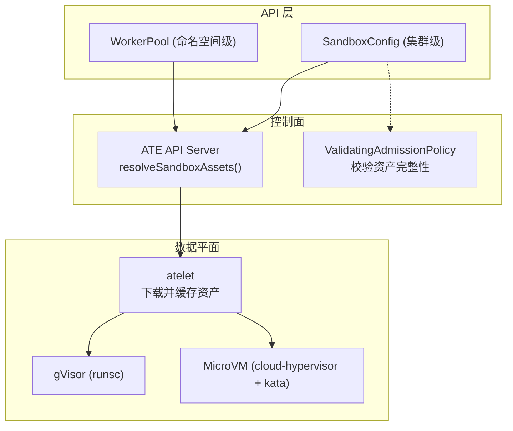
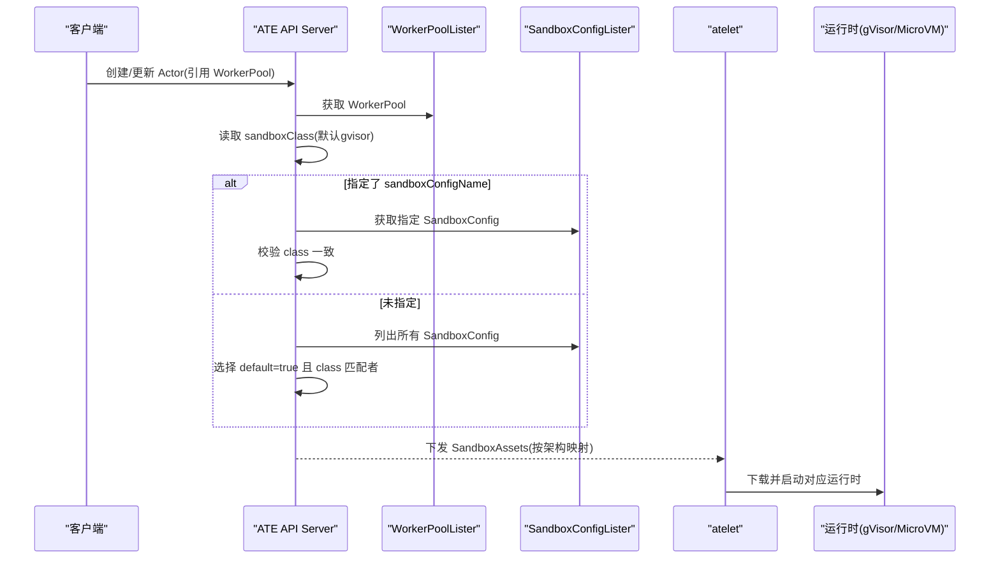
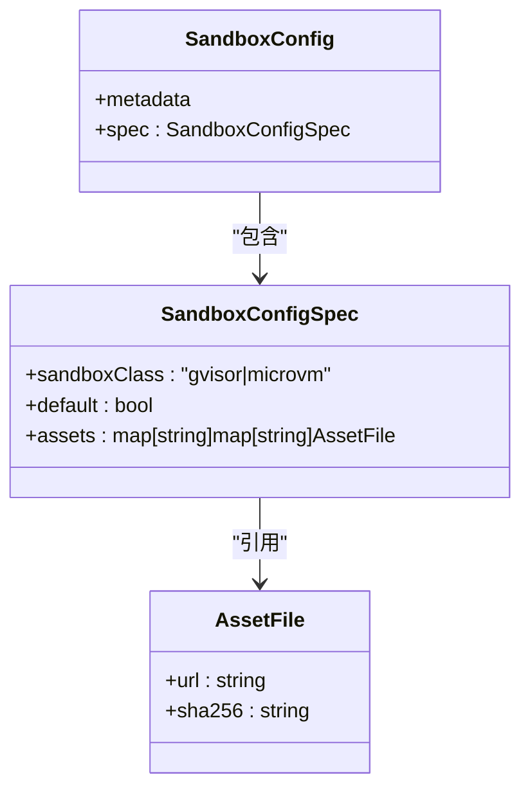
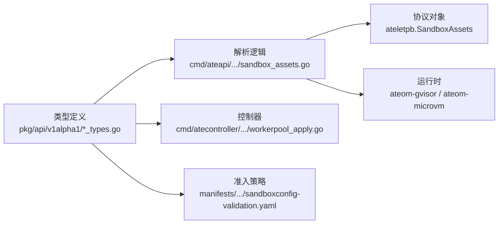

# SandboxConfig资源

<cite>
**本文引用的文件**   
- [sandboxconfig_types.go](file://pkg/api/v1alpha1/sandboxconfig_types.go)
- [workerpool_types.go](file://pkg/api/v1alpha1/workerpool_types.go)
- [sandbox_assets.go](file://cmd/ateapi/internal/controlapi/sandbox_assets.go)
- [sandboxconfig-gvisor.yaml](file://manifests/ate-install/sandboxconfig-gvisor.yaml)
- [sandboxconfig-validation.yaml](file://manifests/ate-install/sandboxconfig-validation.yaml)
- [sandboxconfig_validation_test.go](file://pkg/api/v1alpha1/sandboxconfig_validation_test.go)
- [workerpool_apply.go](file://cmd/atecontroller/internal/controllers/workerpool_apply.go)
- [spec.go](file://cmd/ateom-microvm/spec.go)
- [run.go](file://cmd/ateom-microvm/run.go)
</cite>

## 目录
1. [简介](#简介)
2. [项目结构](#项目结构)
3. [核心组件](#核心组件)
4. [架构总览](#架构总览)
5. [详细组件分析](#详细组件分析)
6. [依赖关系分析](#依赖关系分析)
7. [性能与容量考虑](#性能与容量考虑)
8. [故障诊断指南](#故障诊断指南)
9. [结论](#结论)
10. [附录：YAML示例与最佳实践](#附录yaml示例与最佳实践)

## 简介
SandboxConfig 是一个集群级自定义资源，用于集中管理不同沙箱运行时（gVisor 与 MicroVM）所需的二进制与镜像等“资产”，并作为 WorkerPool 选择具体运行时版本的依据。它通过“按架构映射到资产名”的通用结构解耦了 ActorTemplate 与底层运行时版本的选择，同时借助 ValidatingAdmissionPolicy 对每类运行时的必需资产进行强校验。

## 项目结构
- API 定义位于 pkg/api/v1alpha1，包含 SandboxConfig、WorkerPool 的类型声明与默认值约束。
- 控制面在 cmd/ateapi 中根据 WorkerPool 解析出最终要拉取的 SandboxAssets，并转换为 atelet 可消费的协议对象。
- 安装清单提供 gVisor 默认配置与针对 SandboxConfig 的准入策略。
- 控制器在创建 worker Pod 时，为 microvm 类别注入必要的设备挂载与节点亲和/污点容忍。
- 运行时实现分别位于 cmd/ateom-gvisor 与 cmd/ateom-microvm，后者对设备访问与内核参数有特定要求。

图表来源
- [sandboxconfig_types.go:52-79](file://pkg/api/v1alpha1/sandboxconfig_types.go#L52-L79)
- [workerpool_types.go:70-89](file://pkg/api/v1alpha1/workerpool_types.go#L70-L89)
- [sandbox_assets.go:26-63](file://cmd/ateapi/internal/controlapi/sandbox_assets.go#L26-L63)
- [sandboxconfig-validation.yaml:15-46](file://manifests/ate-install/sandboxconfig-validation.yaml#L15-L46)

章节来源
- [sandboxconfig_types.go:1-117](file://pkg/api/v1alpha1/sandboxconfig_types.go#L1-L117)
- [workerpool_types.go:1-136](file://pkg/api/v1alpha1/workerpool_types.go#L1-L136)
- [sandbox_assets.go:1-103](file://cmd/ateapi/internal/controlapi/sandbox_assets.go#L1-L103)
- [sandboxconfig-validation.yaml:1-55](file://manifests/ate-install/sandboxconfig-validation.yaml#L1-L55)

## 核心组件
- SandboxClass：枚举类型，表示沙箱运行时家族，支持 gvisor 与 microvm。
- AssetFile：描述一个内容寻址的资产文件，包含下载地址与 SHA256 校验值。
- SandboxConfigSpec：包含运行时家族、是否默认、以及按架构映射的资产集合。
- SandboxConfig：集群级资源，被 WorkerPool 引用或回退到默认配置。

关键字段说明
- spec.sandboxClass：必填，取值 gvisor 或 microvm；默认 gvisor。
- spec.default：可选布尔，标记该配置是否为对应 SandboxClass 的集群默认。
- spec.assets：可选，键为架构（如 amd64/arm64），值为资产名到 AssetFile 的映射。
  - gVisor：每个架构必须包含名为 runsc 的资产。
  - MicroVM：每个架构必须包含 cloud-hypervisor、virtiofsd、kata-kernel、kata-image、kata-config 五个资产。
- metadata.name：集群内唯一标识。

校验规则
- CRD 层面：url 必填且非空；sha256 必填且为 64 位小写十六进制。
- 准入策略（VAP）：按 SandboxClass 强制校验各架构下必需资产是否存在。

章节来源
- [sandboxconfig_types.go:21-79](file://pkg/api/v1alpha1/sandboxconfig_types.go#L21-L79)
- [sandboxconfig-validation.yaml:31-46](file://manifests/ate-install/sandboxconfig-validation.yaml#L31-L46)
- [sandboxconfig_validation_test.go:110-175](file://pkg/api/v1alpha1/sandboxconfig_validation_test.go#L110-L175)

## 架构总览
SandboxConfig 与 WorkerPool 的关联与优先级规则如下：
- WorkerPool.spec.sandboxClass 决定运行时家族（默认 gvisor）。
- WorkerPool.spec.sandboxConfigName 指定使用的 SandboxConfig 名称；若为空，则选择同 SandboxClass 中标记 default=true 的唯一配置。
- 若存在多个默认或没有默认，解析将失败。
- 若显式指定的 SandboxConfig 与 WorkerPool 的 sandboxClass 不一致，解析失败。

图表来源
- [sandbox_assets.go:26-63](file://cmd/ateapi/internal/controlapi/sandbox_assets.go#L26-L63)
- [sandbox_assets.go:65-85](file://cmd/ateapi/internal/controlapi/sandbox_assets.go#L65-L85)
- [workerpool_types.go:70-89](file://pkg/api/v1alpha1/workerpool_types.go#L70-L89)

章节来源
- [sandbox_assets.go:26-85](file://cmd/ateapi/internal/controlapi/sandbox_assets.go#L26-L85)
- [workerpool_types.go:70-89](file://pkg/api/v1alpha1/workerpool_types.go#L70-L89)

## 详细组件分析

### SandboxConfig 字段模型
- 顶层：metadata、spec
- spec.sandboxClass：gvisor | microvm
- spec.default：布尔
- spec.assets：map[arch]map[assetName]AssetFile
- AssetFile：url、sha256

复杂度与约束
- assets 的键为 GOARCH（如 amd64、arm64），值中的 assetName 由后端解释。
- 校验：CRD 保证 url/sha256 格式；VAP 保证每类运行时的必需资产齐全。

图表来源
- [sandboxconfig_types.go:52-79](file://pkg/api/v1alpha1/sandboxconfig_types.go#L52-L79)
- [sandboxconfig_types.go:33-50](file://pkg/api/v1alpha1/sandboxconfig_types.go#L33-L50)

章节来源
- [sandboxconfig_types.go:52-79](file://pkg/api/v1alpha1/sandboxconfig_types.go#L52-L79)

### 二进制文件获取配置（Assets）
- 按架构组织：同一份配置可同时声明 amd64 与 arm64 的资产。
- gVisor：每个架构需包含 runsc。
- MicroVM：每个架构需包含 cloud-hypervisor、virtiofsd、kata-kernel、kata-image、kata-config。
- URL 可为 gs:// 等 atelet 支持的存储地址；SHA256 用于完整性校验与缓存去重。

章节来源
- [sandboxconfig-types.go:70-79](file://pkg/api/v1alpha1/sandboxconfig_types.go#L70-L79)
- [sandboxconfig-validation.yaml:31-46](file://manifests/ate-install/sandboxconfig-validation.yaml#L31-L46)
- [sandboxconfig_validation_test.go:110-175](file://pkg/api/v1alpha1/sandboxconfig_validation_test.go#L110-L175)

### 网络隔离设置
- gVisor：在宿主机侧创建内部网络命名空间以隔离容器网络栈，便于后续接入服务网格或 DNS 路由。
- MicroVM：基于 Kata 与 virtio-fs 共享只读根文件系统，网络由 guest 内的 agent 管理。

章节来源
- [main.go:gVisor netns 相关:858-901](file://cmd/ateom-gvisor/main.go#L858-L901)
- [run.go:guest config 与 cmdline:424-467](file://cmd/ateom-microvm/run.go#L424-L467)

### 设备挂载权限
- MicroVM 需要 /dev/kvm 与 vhost 设备；控制器会为 microvm 类别的 worker Pod 挂载 /dev/kvm 并添加节点亲和与污点容忍，确保调度到具备 KVM 能力的节点。
- 运行时侧对设备 cgroup 白名单与 CPU shares 有默认限制，遵循已验证的安全基线。

章节来源
- [workerpool_apply.go:103-130](file://cmd/atecontroller/internal/controllers/workerpool_apply.go#L103-L130)
- [spec.go:123-152](file://cmd/ateom-microvm/spec.go#L123-L152)

### 沙箱运行时选择策略与优先级
- 选择顺序：WorkerPool 显式指定 sandboxConfigName → 否则选择同 SandboxClass 中标记 default=true 的配置。
- 一致性校验：显式指定的 SandboxConfig 的 sandboxClass 必须与 WorkerPool 一致。
- 冲突处理：同一 SandboxClass 下只能有一个 default=true 的配置，否则解析失败。

章节来源
- [sandbox_assets.go:26-85](file://cmd/ateapi/internal/controlapi/sandbox_assets.go#L26-L85)

### 配置验证规则
- CRD 校验：url 必填且非空；sha256 必填且为 64 位十六进制。
- 准入策略（VAP）：
  - gVisor：每个架构必须包含 runsc。
  - MicroVM：每个架构必须包含 cloud-hypervisor、virtiofsd、kata-kernel、kata-image、kata-config。
- 测试覆盖：单元测试覆盖了缺失资产、错误哈希、缺少字段等场景。

章节来源
- [sandboxconfig_types.go:40-49](file://pkg/api/v1alpha1/sandboxconfig_types.go#L40-L49)
- [sandboxconfig-validation.yaml:31-46](file://manifests/ate-install/sandboxconfig-validation.yaml#L31-L46)
- [sandboxconfig_validation_test.go:110-175](file://pkg/api/v1alpha1/sandboxconfig_validation_test.go#L110-L175)

## 依赖关系分析
- API 层：SandboxConfig 与 WorkerPool 类型定义。
- 控制面：ATE API Server 使用 listers 解析 SandboxConfig，生成 atelet 可消费的 SandboxAssets。
- 准入层：ValidatingAdmissionPolicy 在 CREATE/UPDATE 时对 SandboxConfig 做运行时资产完整性校验。
- 控制器：为 microvm 类别的 worker Pod 注入设备挂载与调度约束。
- 运行时：gVisor 与 MicroVM 各自实现网络与设备能力。

图表来源
- [sandboxconfig_types.go:52-79](file://pkg/api/v1alpha1/sandboxconfig_types.go#L52-L79)
- [workerpool_types.go:70-89](file://pkg/api/v1alpha1/workerpool_types.go#L70-L89)
- [sandbox_assets.go:26-63](file://cmd/ateapi/internal/controlapi/sandbox_assets.go#L26-L63)
- [workerpool_apply.go:103-130](file://cmd/atecontroller/internal/controllers/workerpool_apply.go#L103-L130)
- [sandboxconfig-validation.yaml:15-46](file://manifests/ate-install/sandboxconfig-validation.yaml#L15-L46)

章节来源
- [sandboxconfig_types.go:1-117](file://pkg/api/v1alpha1/sandboxconfig_types.go#L1-L117)
- [workerpool_types.go:1-136](file://pkg/api/v1alpha1/workerpool_types.go#L1-L136)
- [sandbox_assets.go:1-103](file://cmd/ateapi/internal/controlapi/sandbox_assets.go#L1-L103)
- [workerpool_apply.go:103-130](file://cmd/atecontroller/internal/controllers/workerpool_apply.go#L103-L130)
- [sandboxconfig-validation.yaml:1-55](file://manifests/ate-install/sandboxconfig-validation.yaml#L1-L55)

## 性能与容量考虑
- 资产缓存：SHA256 作为内容寻址键，避免重复下载与冲突。
- 多架构并行：同一 SandboxConfig 可声明多架构资产，按需分发至对应节点。
- 运行时开销：MicroVM 相比 gVisor 具有更强的隔离性，但启动与内存占用更高；建议结合节点资源与业务 SLA 评估。

## 故障诊断指南
常见问题与定位要点
- 无法解析 SandboxConfig：
  - 检查 WorkerPool 的 sandboxConfigName 是否存在且 sandboxClass 一致。
  - 确认同 SandboxClass 下仅有一个 default=true 的配置。
- 准入拒绝：
  - 查看 VAP 返回的错误信息，确认是否缺失必需资产或 sha256 格式不正确。
- 运行时启动失败：
  - MicroVM：确认节点具备 /dev/kvm 与 vhost，且 Pod 被调度到带相应标签/容忍的节点。
  - gVisor：检查网络命名空间与宿主网络能力。

参考路径
- 解析逻辑与错误信息：[sandbox_assets.go:26-85](file://cmd/ateapi/internal/controlapi/sandbox_assets.go#L26-L85)
- 准入策略与消息：[sandboxconfig-validation.yaml:31-46](file://manifests/ate-install/sandboxconfig-validation.yaml#L31-L46)
- 设备挂载与调度约束：[workerpool_apply.go:103-130](file://cmd/atecontroller/internal/controllers/workerpool_apply.go#L103-L130)

章节来源
- [sandbox_assets.go:26-85](file://cmd/ateapi/internal/controlapi/sandbox_assets.go#L26-L85)
- [sandboxconfig-validation.yaml:31-46](file://manifests/ate-install/sandboxconfig-validation.yaml#L31-L46)
- [workerpool_apply.go:103-130](file://cmd/atecontroller/internal/controllers/workerpool_apply.go#L103-L130)

## 结论
SandboxConfig 提供了统一的沙箱资产管理与选择机制，配合 WorkerPool 的 sandboxClass 与 sandboxConfigName，实现了灵活的运行时版本治理。通过 CRD 与 VAP 的双重校验，确保关键资产完整与安全基线。管理员可按业务需求提供默认配置与专用配置，并在不同环境间平滑演进。

## 附录：YAML示例与最佳实践

### YAML 示例
- gVisor 默认配置（集群预置）
  - 参考路径：[sandboxconfig-gvisor.yaml](file://manifests/ate-install/sandboxconfig-gvisor.yaml)
- 准入策略（VAP）
  - 参考路径：[sandboxconfig-validation.yaml](file://manifests/ate-install/sandboxconfig-validation.yaml)

注意：为避免泄露敏感信息，此处不直接粘贴 YAML 内容，请参考上述文件路径获取完整示例。

### 最佳实践
- 明确默认配置：为每种 SandboxClass 提供一个 default=true 的 SandboxConfig，并确保资产齐全。
- 多架构覆盖：至少提供 amd64 与 arm64 的资产，避免跨架构调度失败。
- 安全加固：
  - 固定 SHA256，禁止使用未签名或未校验的资产。
  - MicroVM 场景确保节点具备 KVM 能力，并按控制器约定打标签与污点。
- 变更流程：
  - 先创建新 SandboxConfig 并验证通过，再逐步切换 WorkerPool 指向新配置。
  - 保留旧配置直至灰度完成，避免回滚风险。

章节来源
- [sandboxconfig-gvisor.yaml:15-36](file://manifests/ate-install/sandboxconfig-gvisor.yaml#L15-L36)
- [sandboxconfig-validation.yaml:15-46](file://manifests/ate-install/sandboxconfig-validation.yaml#L15-L46)
