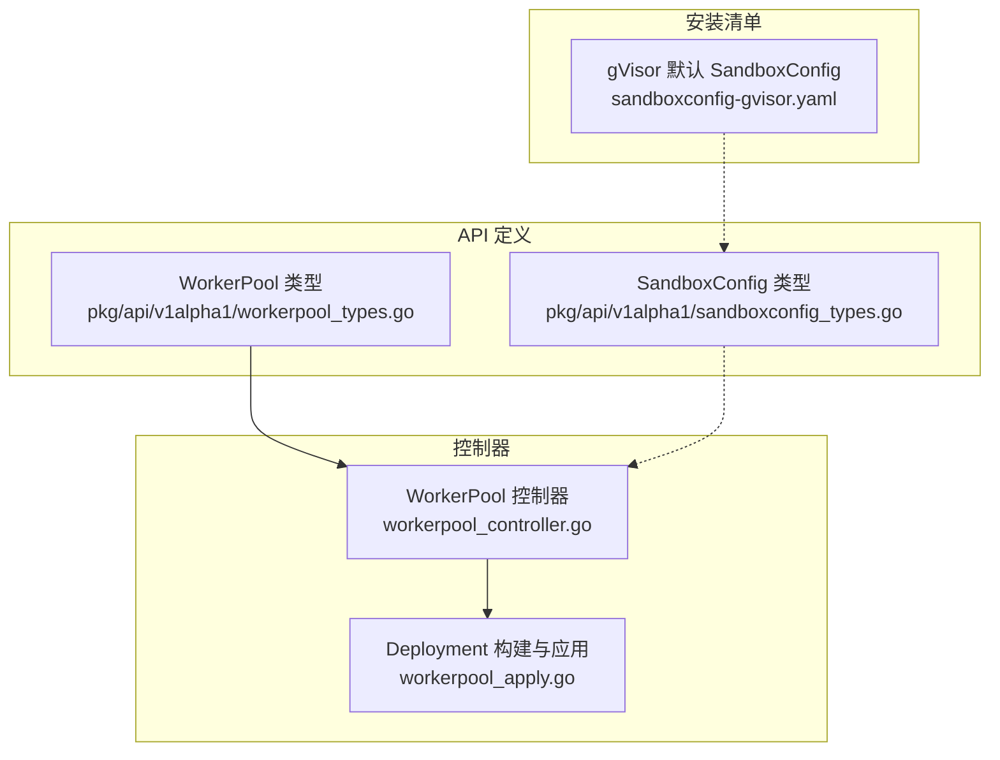
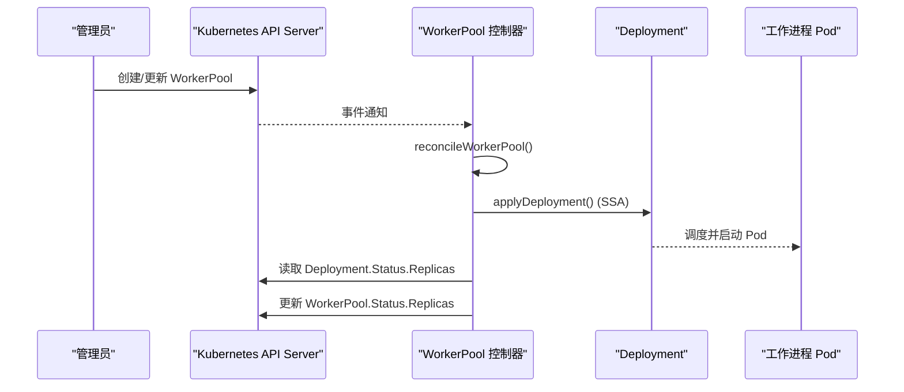
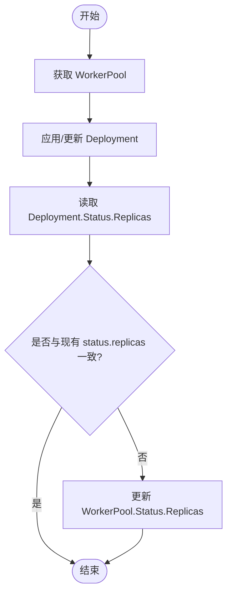
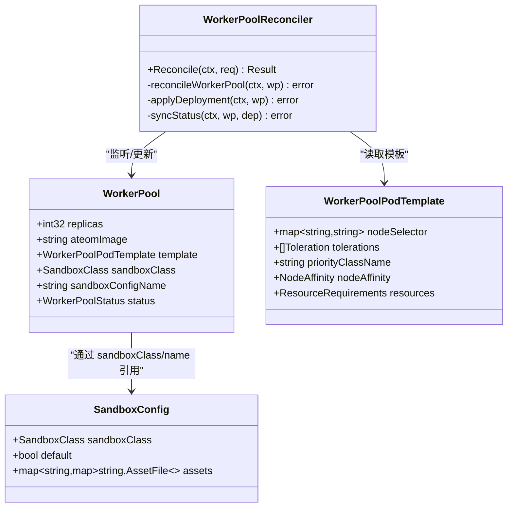

# WorkerPool资源

<cite>
**本文引用的文件**   
- [workerpool_types.go](file://pkg/api/v1alpha1/workerpool_types.go)
- [sandboxconfig_types.go](file://pkg/api/v1alpha1/sandboxconfig_types.go)
- [workerpool_controller.go](file://cmd/atecontroller/internal/controllers/workerpool_controller.go)
- [workerpool_apply.go](file://cmd/atecontroller/internal/controllers/workerpool_apply.go)
- [sandboxconfig-gvisor.yaml](file://manifests/ate-install/sandboxconfig-gvisor.yaml)
</cite>

## 目录
1. [简介](#简介)
2. [项目结构](#项目结构)
3. [核心组件](#核心组件)
4. [架构总览](#架构总览)
5. [详细组件分析](#详细组件分析)
6. [依赖关系分析](#依赖关系分析)
7. [性能与扩展性考虑](#性能与扩展性考虑)
8. [故障排查指南](#故障排查指南)
9. [结论](#结论)
10. [附录：YAML示例与kubectl用法](#附录yaml示例与kubectl用法)

## 简介
本文件面向使用 ATE（Agent Template Engine）的集群管理员与开发者，提供 WorkerPool 自定义资源定义（CRD）的完整说明。内容涵盖 spec 字段、调度模板、沙箱类与配置选择、状态更新机制，以及典型场景下的 YAML 示例与 kubectl 操作建议。

## 项目结构
WorkerPool 相关代码主要分布在以下位置：
- CRD 类型定义：pkg/api/v1alpha1/workerpool_types.go
- 控制器实现：cmd/atecontroller/internal/controllers/workerpool_controller.go 与 workerpool_apply.go
- 关联的沙箱配置类型与默认清单：pkg/api/v1alpha1/sandboxconfig_types.go 与 manifests/ate-install/sandboxconfig-gvisor.yaml

图表来源
- [workerpool_types.go:54-122](file://pkg/api/v1alpha1/workerpool_types.go#L54-L122)
- [sandboxconfig_types.go:52-103](file://pkg/api/v1alpha1/sandboxconfig_types.go#L52-L103)
- [workerpool_controller.go:47-121](file://cmd/atecontroller/internal/controllers/workerpool_controller.go#L47-L121)
- [workerpool_apply.go:30-83](file://cmd/atecontroller/internal/controllers/workerpool_apply.go#L30-L83)
- [sandboxconfig-gvisor.yaml:20-36](file://manifests/ate-install/sandboxconfig-gvisor.yaml#L20-L36)

章节来源
- [workerpool_types.go:1-136](file://pkg/api/v1alpha1/workerpool_types.go#L1-L136)
- [sandboxconfig_types.go:1-117](file://pkg/api/v1alpha1/sandboxconfig_types.go#L1-L117)
- [workerpool_controller.go:1-121](file://cmd/atecontroller/internal/controllers/workerpool_controller.go#L1-L121)
- [workerpool_apply.go:1-245](file://cmd/atecontroller/internal/controllers/workerpool_apply.go#L1-L245)
- [sandboxconfig-gvisor.yaml:1-36](file://manifests/ate-install/sandboxconfig-gvisor.yaml#L1-L36)

## 核心组件
- WorkerPool：命名空间级资源，用于声明一组工作进程 Pod 的期望副本数、容器镜像、调度与资源设置，并可选择沙箱类与沙箱配置。
- WorkerPoolPodTemplate：可选的 Pod 调度与资源模板，包含 NodeSelector、Tolerations、PriorityClassName、NodeAffinity、Resources。
- SandboxClass：枚举 gvisor 与 microvm，决定运行时家族与节点放置策略。
- SandboxConfig：集群级资源，描述特定沙箱类的二进制资产（如 runsc），支持按架构分发，并可标记为默认。

章节来源
- [workerpool_types.go:22-89](file://pkg/api/v1alpha1/workerpool_types.go#L22-L89)
- [sandboxconfig_types.go:21-79](file://pkg/api/v1alpha1/sandboxconfig_types.go#L21-L79)

## 架构总览
WorkerPool 控制器通过 SSA Apply 方式创建或更新一个 Deployment，该 Deployment 管理实际的工作进程 Pod。控制器还会将 Deployment 的 replicas 同步回 WorkerPool.status.replicas。

图表来源
- [workerpool_controller.go:73-112](file://cmd/atecontroller/internal/controllers/workerpool_controller.go#L73-L112)
- [workerpool_apply.go:30-83](file://cmd/atecontroller/internal/controllers/workerpool_apply.go#L30-L83)

## 详细组件分析

### WorkerPool 字段详解
- spec.replicas：期望的工作进程 Pod 数量，非负整数。
- spec.ateomImage：工作进程使用的 ateom 容器镜像地址。
- spec.template：可选的调度与资源模板，映射到 Pod 的对应字段。
  - nodeSelector：节点标签选择器。
  - tolerations：容忍规则，最多 16 条。
  - priorityClassName：优先级类名。
  - nodeAffinity：节点亲和性，直接映射到 Pod 的 affinity.nodeAffinity。
  - resources：每个 Pod 的资源请求与限制。
- spec.sandboxClass：沙箱类选择，取值 gvisor 或 microvm，默认 gvisor。影响 Pod 形状（设备挂载、节点放置）及可用的 SandboxConfig。
- spec.sandboxConfigName：引用集群级 SandboxConfig 的名称，覆盖该沙箱类的集群默认配置；若为空则使用默认 SandboxConfig。

注意：
- sandboxClass 与 sandboxConfigName 共同决定运行时家族与二进制来源。
- template 中的调度字段与控制器根据 sandboxClass 注入的策略是“合并而非覆盖”的关系。

章节来源
- [workerpool_types.go:54-89](file://pkg/api/v1alpha1/workerpool_types.go#L54-L89)
- [workerpool_types.go:22-52](file://pkg/api/v1alpha1/workerpool_types.go#L22-L52)

### 调度与资源模板（spec.template）
- NodeSelector：将 Pod 调度到满足标签的节点。
- Tolerations：允许 Pod 调度到被污点的节点。
- PriorityClassName：控制 Pod 在资源竞争时的优先级。
- NodeAffinity：更灵活的节点亲和性规则，包括 RequiredDuringSchedulingIgnoredDuringExecution 与 PreferredDuringSchedulingIgnoredDuringExecution。
- Resources：requests 与 limits，分别表示最小保证与上限。

控制器对 template 的处理要点：
- 初始化空集合后，再按用户提供的值进行填充。
- 对于 microvm 沙箱类，控制器会额外注入 /dev/kvm 设备挂载与节点选择/容忍，以适配 KVM 能力节点。

章节来源
- [workerpool_types.go:22-52](file://pkg/api/v1alpha1/workerpool_types.go#L22-L52)
- [workerpool_apply.go:132-166](file://cmd/atecontroller/internal/controllers/workerpool_apply.go#L132-L166)
- [workerpool_apply.go:94-130](file://cmd/atecontroller/internal/controllers/workerpool_apply.go#L94-L130)

### 沙箱类与沙箱配置（SandboxClass 与 SandboxConfig）
- SandboxClass：
  - gvisor：基于 gVisor/runsc 的轻量沙箱。
  - microvm：基于微虚拟机（kata + cloud-hypervisor），需要 /dev/kvm 与 vhost 设备。
- SandboxConfig：
  - 集群级资源，描述某沙箱类的二进制资产（按架构与名称索引）。
  - 可标记 default=true 作为该沙箱类的默认配置。
  - WorkerPool 若未显式指定 sandboxConfigName，则解析为该沙箱类的默认 SandboxConfig。

控制器行为：
- 当 sandboxClass=microvm 时，控制器会在 PodSpec 中追加 /dev/kvm 设备挂载，并通过 nodeSelector 与 toleration 将 Pod 调度到具备 KVM 能力的节点。
- 这些注入与用户配置的 template 字段是叠加关系。

章节来源
- [sandboxconfig_types.go:21-79](file://pkg/api/v1alpha1/sandboxconfig_types.go#L21-L79)
- [workerpool_apply.go:94-130](file://cmd/atecontroller/internal/controllers/workerpool_apply.go#L94-L130)
- [sandboxconfig-gvisor.yaml:20-36](file://manifests/ate-install/sandboxconfig-gvisor.yaml#L20-L36)

### 状态字段 status.replicas 的含义与更新机制
- 含义：当前由 Deployment 管理的副本总数（即实际运行的 Pod 副本数）。
- 更新机制：
  - 控制器每次 reconcile 都会读取目标 Deployment 的 Status.Replicas。
  - 若与 WorkerPool.Status.Replicas 不一致，则更新之。
  - 因此 status.replicas 反映的是 Deployment 所维护的实际副本规模。

图表来源
- [workerpool_controller.go:73-112](file://cmd/atecontroller/internal/controllers/workerpool_controller.go#L73-L112)

章节来源
- [workerpool_types.go:91-96](file://pkg/api/v1alpha1/workerpool_types.go#L91-L96)
- [workerpool_controller.go:100-112](file://cmd/atecontroller/internal/controllers/workerpool_controller.go#L100-L112)

## 依赖关系分析
- WorkerPool 控制器依赖 Kubernetes Apps v1 Deployment 来管理 Pod 生命周期。
- WorkerPool 与 SandboxConfig 通过 sandboxClass 与 sandboxConfigName 建立间接依赖：前者决定运行时家族，后者决定二进制来源。
- 控制器在构建 Deployment 时会注入与 sandboxClass 相关的 Pod 形状（例如 microvm 的设备与节点约束）。

图表来源
- [workerpool_types.go:54-122](file://pkg/api/v1alpha1/workerpool_types.go#L54-L122)
- [sandboxconfig_types.go:52-103](file://pkg/api/v1alpha1/sandboxconfig_types.go#L52-L103)
- [workerpool_controller.go:35-121](file://cmd/atecontroller/internal/controllers/workerpool_controller.go#L35-L121)

章节来源
- [workerpool_types.go:1-136](file://pkg/api/v1alpha1/workerpool_types.go#L1-L136)
- [sandboxconfig_types.go:1-117](file://pkg/api/v1alpha1/sandboxconfig_types.go#L1-L117)
- [workerpool_controller.go:1-121](file://cmd/atecontroller/internal/controllers/workerpool_controller.go#L1-L121)

## 性能与扩展性考虑
- 副本扩缩容：通过调整 spec.replicas 触发 Deployment 滚动更新，status.replicas 最终收敛到期望值。
- 调度优化：合理使用 NodeSelector、NodeAffinity 与 Tolerations，结合 PriorityClassName 提升关键工作进程的抢占能力。
- 资源隔离：为每个 Pod 设置合理的 requests 与 limits，避免资源争用与 OOM。
- 沙箱选择：microvm 需要 KVM 能力节点，需确保节点池具备相应硬件与标签/污点；gvisor 对节点要求较低。

[本节为通用指导，不直接分析具体文件]

## 故障排查指南
- 无法调度到节点：
  - 检查 NodeSelector、NodeAffinity 与 Tolerations 是否与实际节点匹配。
  - 若使用 microvm，确认节点具备 /dev/kvm 且带有对应的标签与容忍。
- 副本不增长：
  - 查看 WorkerPool.status.replicas 与 Deployment 的副本数是否一致。
  - 检查 ateomImage 是否可拉取，镜像仓库访问权限是否正确。
- 二进制缺失或校验失败：
  - 确认 SandboxConfig 的 assets 中 URL 可达且 SHA256 正确。
  - 若未显式指定 sandboxConfigName，确认存在对应沙箱类的默认 SandboxConfig。

章节来源
- [workerpool_apply.go:94-130](file://cmd/atecontroller/internal/controllers/workerpool_apply.go#L94-L130)
- [sandboxconfig_types.go:52-79](file://pkg/api/v1alpha1/sandboxconfig_types.go#L52-L79)
- [workerpool_controller.go:100-112](file://cmd/atecontroller/internal/controllers/workerpool_controller.go#L100-L112)

## 结论
WorkerPool 提供了声明式的方式管理工作进程 Pod 的规模、镜像与调度策略，并通过沙箱类与沙箱配置解耦运行时选择与二进制来源。配合控制器自动同步的状态字段，便于观测与自动化运维。

[本节为总结，不直接分析具体文件]

## 附录：YAML示例与kubectl用法

### 基础配置（gvisor，默认沙箱类）
- 仅设置 replicas 与 ateomImage，使用默认的 gvisor 沙箱类与默认 SandboxConfig。
- 参考路径：
  - [workerpool_types.go:54-89](file://pkg/api/v1alpha1/workerpool_types.go#L54-L89)
  - [sandboxconfig-gvisor.yaml:20-36](file://manifests/ate-install/sandboxconfig-gvisor.yaml#L20-L36)

### 高级调度策略（NodeSelector、Tolerations、PriorityClassName、NodeAffinity）
- 在 spec.template 中配置上述字段，控制器会将其应用到 Pod 上。
- 参考路径：
  - [workerpool_types.go:22-52](file://pkg/api/v1alpha1/workerpool_types.go#L22-L52)
  - [workerpool_apply.go:132-166](file://cmd/atecontroller/internal/controllers/workerpool_apply.go#L132-L166)

### 资源限制设置（Requests/Limits）
- 在 spec.template.resources 中设置 requests 与 limits。
- 参考路径：
  - [workerpool_types.go:48-52](file://pkg/api/v1alpha1/workerpool_types.go#L48-L52)
  - [workerpool_apply.go:158-166](file://cmd/atecontroller/internal/controllers/workerpool_apply.go#L158-L166)

### 使用 microvm 沙箱类
- 设置 spec.sandboxClass=microvm，控制器会自动注入 /dev/kvm 设备挂载与节点选择/容忍。
- 参考路径：
  - [workerpool_types.go:70-80](file://pkg/api/v1alpha1/workerpool_types.go#L70-L80)
  - [workerpool_apply.go:94-130](file://cmd/atecontroller/internal/controllers/workerpool_apply.go#L94-L130)

### 指定 SandboxConfig
- 通过 spec.sandboxConfigName 引用集群级 SandboxConfig，覆盖默认配置。
- 参考路径：
  - [workerpool_types.go:82-88](file://pkg/api/v1alpha1/workerpool_types.go#L82-L88)
  - [sandboxconfig_types.go:52-79](file://pkg/api/v1alpha1/sandboxconfig_types.go#L52-L79)

### kubectl 常用命令
- 创建/更新 WorkerPool：
  - kubectl apply -f <your-workerpool.yaml>
- 查看 WorkerPool 状态：
  - kubectl get workerpool <name> -o wide
  - kubectl describe workerpool <name>
- 查看状态副本数：
  - kubectl get workerpool <name> -o jsonpath='{.status.replicas}'
- 扩缩容（两种方式）：
  - 直接编辑 spec.replicas：kubectl edit workerpool <name>
  - 使用 scale 子资源：kubectl scale workerpool <name> --replicas=<n>
- 查看关联的 Deployment：
  - kubectl get deployment -l ate.dev/worker-pool=<workerpool-name>

[本节为操作指引，不直接分析具体文件]
