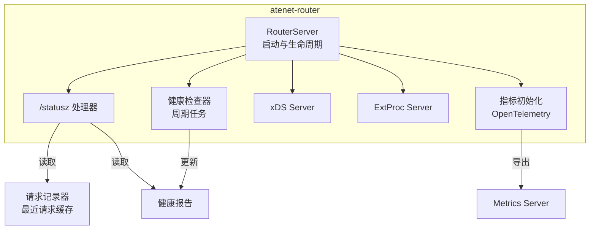
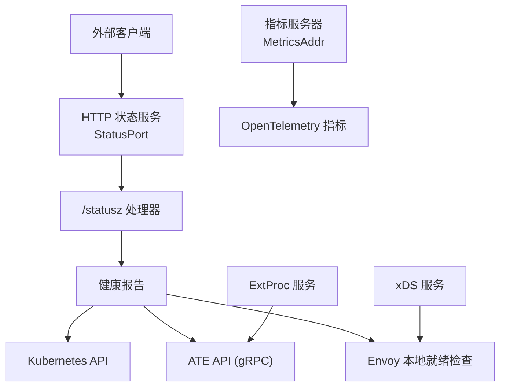
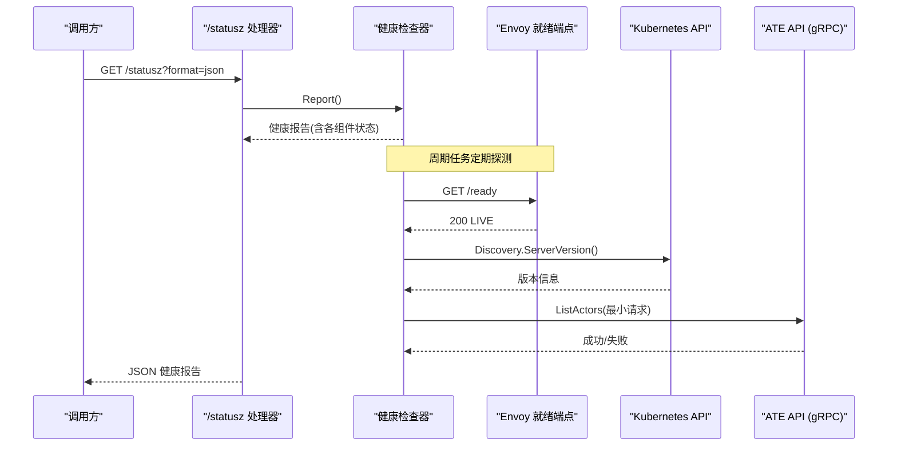
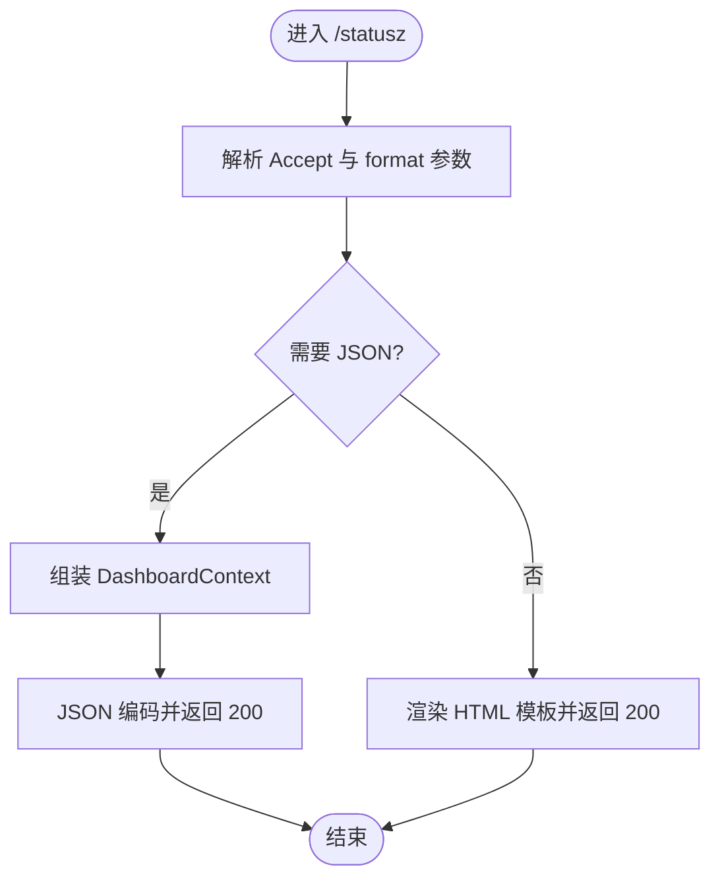
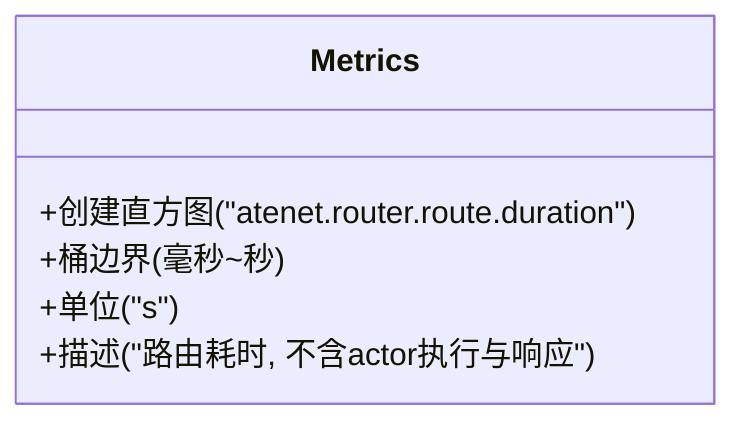
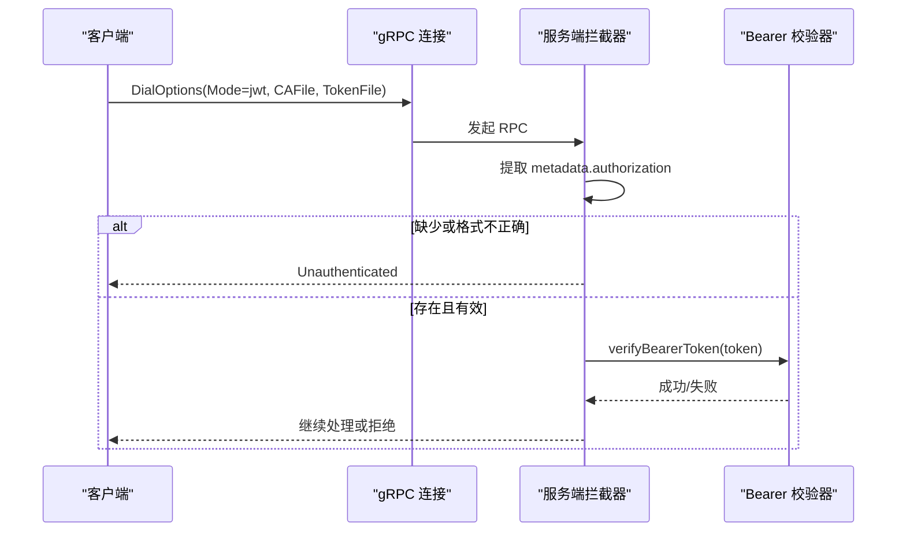
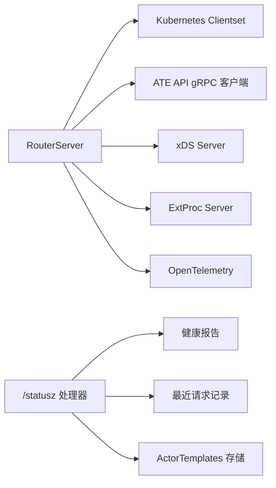

# REST API

<cite>
**本文引用的文件**   
- [README.md](file://README.md)
- [router.go](file://cmd/atenet/internal/router/router.go)
- [status.go](file://cmd/atenet/internal/router/status.go)
- [health.go](file://cmd/atenet/internal/router/health.go)
- [metrics.go](file://cmd/atenet/internal/router/metrics.go)
- [server.go](file://internal/ateapiauth/server.go)
- [client.go](file://internal/ateapiauth/client.go)
- [api-conventions.md](file://.agents/skills/review-crds/references/api-conventions.md)
- [threat-model.md](file://docs/threat-model.md)
</cite>

## 目录
1. [简介](#简介)
2. [项目结构](#项目结构)
3. [核心组件](#核心组件)
4. [架构总览](#架构总览)
5. [详细组件分析](#详细组件分析)
6. [依赖关系分析](#依赖关系分析)
7. [性能与可观测性](#性能与可观测性)
8. [故障排查指南](#故障排查指南)
9. [结论](#结论)
10. [附录](#附录)

## 简介
本参考文档聚焦于 HTTP 路由代理（atenet-router）对外暴露的 REST 端点，包括：
- 健康检查接口
- 状态查询接口
- 监控指标导出接口

同时说明认证机制（JWT 令牌验证与 mTLS 证书认证）、错误响应格式与 HTTP 状态码、CORS 与安全注意事项、限流策略建议，并提供 curl 示例与 Python/Go 客户端集成要点。

## 项目结构
HTTP 路由代理由 atenet-router 提供，关键实现位于 cmd/atenet/internal/router 包中：
- router.go：服务启动、端口监听、HTTP 路由注册、xDS/ExtProc 服务启动、健康检查周期任务等
- status.go：/statusz 处理器，支持 HTML 与 JSON 两种输出
- health.go：周期性健康检查（Envoy/K8s API/gRPC ATE API），并生成健康报告
- metrics.go：定义 OpenTelemetry 指标名称与直方图桶边界

图表来源
- [router.go:289-312](file://cmd/atenet/internal/router/router.go#L289-L312)
- [status.go:180-281](file://cmd/atenet/internal/router/status.go#L180-L281)
- [health.go:74-147](file://cmd/atenet/internal/router/health.go#L74-L147)
- [metrics.go:32-51](file://cmd/atenet/internal/router/metrics.go#L32-L51)

章节来源
- [router.go:152-315](file://cmd/atenet/internal/router/router.go#L152-L315)
- [status.go:180-281](file://cmd/atenet/internal/router/status.go#L180-L281)
- [health.go:74-147](file://cmd/atenet/internal/router/health.go#L74-L147)
- [metrics.go:24-51](file://cmd/atenet/internal/router/metrics.go#L24-L51)

## 核心组件
- RouterServer：负责启动 xDS、ExtProc、HTTP 状态服务、健康检查与指标采集
- /statusz 处理器：返回运行时信息、参数、最近请求与健康报告
- 健康检查器：定时探测 Envoy、Kubernetes API、ATE API gRPC 连通性与就绪状态
- 指标系统：基于 OpenTelemetry 的直方图指标，用于路由耗时统计

章节来源
- [router.go:94-150](file://cmd/atenet/internal/router/router.go#L94-L150)
- [status.go:132-161](file://cmd/atenet/internal/router/status.go#L132-L161)
- [health.go:32-72](file://cmd/atenet/internal/router/health.go#L32-L72)
- [metrics.go:24-51](file://cmd/atenet/internal/router/metrics.go#L24-L51)

## 架构总览
下图展示了 atenet-router 的关键子进程与服务之间的关系，以及对外暴露的 HTTP 端口与内部通信路径。

图表来源
- [router.go:224-312](file://cmd/atenet/internal/router/router.go#L224-L312)
- [health.go:149-208](file://cmd/atenet/internal/router/health.go#L149-L208)
- [metrics.go:32-51](file://cmd/atenet/internal/router/metrics.go#L32-L51)

## 详细组件分析

### 健康检查接口
- 目的：快速判断 atenet-router 及其依赖（Envoy、Kubernetes API、ATE API gRPC）是否可用
- 访问方式：通过 /statusz 的健康字段获取；也可在浏览器或脚本中解析 JSON
- 触发方式：后台周期性任务自动执行，结果写入内存报告供 /statusz 使用

图表来源
- [status.go:180-281](file://cmd/atenet/internal/router/status.go#L180-L281)
- [health.go:74-147](file://cmd/atenet/internal/router/health.go#L74-L147)
- [health.go:149-208](file://cmd/atenet/internal/router/health.go#L149-L208)

章节来源
- [health.go:74-147](file://cmd/atenet/internal/router/health.go#L74-L147)
- [status.go:180-281](file://cmd/atenet/internal/router/status.go#L180-L281)

### 状态查询接口
- 端点：GET /statusz
- 内容类型协商：
  - Accept: application/json 或 query 参数 format=json 时返回 JSON
  - 否则返回 HTML 仪表板页面
- 主要字段（JSON）：
  - build_tag：构建标签与提交修订号
  - router_cluster_ip：当前 Pod 所在 Service 的 ClusterIP（独立模式时为提示文本）
  - namespace：命名空间
  - port_http/xds/extproc/status_port：各服务端口
  - args/flags：进程参数与命令行标志
  - queries：最近请求列表（已脱敏路径，不含查询字符串）
  - health：健康报告（envoy/k8s_api/ate_api 三组件）
  - templates：已就绪的 ActorTemplate 列表（name/namespace）
- 安全注意：路径中的查询字符串会被剥离以避免泄露凭据

图表来源
- [status.go:180-281](file://cmd/atenet/internal/router/status.go#L180-L281)
- [status.go:107-130](file://cmd/atenet/internal/router/status.go#L107-L130)

章节来源
- [status.go:132-161](file://cmd/atenet/internal/router/status.go#L132-L161)
- [status.go:180-281](file://cmd/atenet/internal/router/status.go#L180-L281)

### 监控指标导出接口
- 指标服务器地址：由 --metrics-addr 配置项决定（默认未启用需显式设置）
- 指标名称：atenet.router.route.duration（单位秒，直方图）
- 描述：从 ext_proc 收到请求到解析出目标 worker 端点的延迟（不包含 actor 执行与响应时间）
- 桶边界：毫秒级到数十秒的多档分桶，便于低延迟场景观测

图表来源
- [metrics.go:24-51](file://cmd/atenet/internal/router/metrics.go#L24-L51)

章节来源
- [metrics.go:24-51](file://cmd/atenet/internal/router/metrics.go#L24-L51)

### 认证机制（JWT 与 mTLS）
- 适用对象：ATE API（gRPC）服务端鉴权拦截器与客户端拨号选项
- 模式：
  - mtls（默认）：身份由传输层 mTLS 建立，应用层不做额外校验
  - jwt：要求每个 RPC 携带 authorization: Bearer <SA token>，并在服务端进行校验
- 客户端配置：
  - CAFile：必填，用于 TLS 根证书校验（jwt 模式必须）
  - TokenFile：jwt 模式下必填，每次 RPC 动态读取以支持令牌轮换
  - ServerName：可选，覆盖 SNI/主机名校验
- 服务端拦截器：
  - Unary/Stream 拦截器根据 Mode 选择认证器
  - JWT 模式缺失或无效 Bearer 将返回 Unauthenticated

图表来源
- [server.go:81-127](file://internal/ateapiauth/server.go#L81-L127)
- [server.go:141-152](file://internal/ateapiauth/server.go#L141-L152)
- [client.go:57-95](file://internal/ateapiauth/client.go#L57-L95)
- [client.go:104-114](file://internal/ateapiauth/client.go#L104-L114)

章节来源
- [server.go:35-70](file://internal/ateapiauth/server.go#L35-L70)
- [server.go:81-127](file://internal/ateapiauth/server.go#L81-L127)
- [client.go:34-95](file://internal/ateapiauth/client.go#L34-L95)

### 错误响应格式与 HTTP 状态码
- 通用约定：遵循 Kubernetes API 风格的状态对象与状态码语义
- 常见状态码与建议行为：
  - 400/401/403/404/405/409/410/422/429/500/503/504 等
  - 429 应包含 Retry-After 头，客户端按指数退避重试
- 状态对象：当操作失败或 DELETE 成功时返回 JSON 格式的 Status 对象，包含 kind、apiVersion、metadata、status、message、reason、details、code 等字段

章节来源
- [api-conventions.md:1504-1610](file://.agents/skills/review-crds/references/api-conventions.md#L1504-L1610)
- [api-conventions.md:1612-1797](file://.agents/skills/review-crds/references/api-conventions.md#L1612-L1797)

### CORS 配置与安全考虑
- CORS：当前代码库未发现针对 HTTP 状态服务的显式 CORS 中间件或配置；如需跨域访问，应在网关或反向代理层统一配置
- 安全建议：
  - 组件间通信默认采用加密与双向认证（mTLS）
  - 控制面与数据面隔离，避免将敏感组件与不可信沙箱同机部署
  - 对 API 与代理实施配额与速率限制，防止滥用与 DoS
  - 仅允许受信任网络访问 ate-apiserver 与核心组件，结合 NetworkPolicy 限制入站流量
  - 所有内部流量默认加密，避免被窃听或篡改

章节来源
- [threat-model.md:72-91](file://docs/threat-model.md#L72-L91)

## 依赖关系分析
- RouterServer 依赖：
  - Kubernetes clientset：用于读取 Service ClusterIP、健康检查
  - ATE API gRPC 客户端：用于健康检查与后续路由决策
  - xDS/ExtProc 服务：为 Envoy 提供配置与外部处理
  - OpenTelemetry：指标与追踪
- /statusz 处理器依赖：
  - 健康报告（来自健康检查器）
  - 最近请求记录（来自 ExtProc 记录器）
  - ActorTemplate 存储（文件或 K8s）

图表来源
- [router.go:152-315](file://cmd/atenet/internal/router/router.go#L152-L315)
- [status.go:180-281](file://cmd/atenet/internal/router/status.go#L180-L281)

章节来源
- [router.go:152-315](file://cmd/atenet/internal/router/router.go#L152-L315)
- [status.go:180-281](file://cmd/atenet/internal/router/status.go#L180-L281)

## 性能与可观测性
- 指标：atenet.router.route.duration 直方图，覆盖毫秒到数十秒范围，适合低延迟场景
- 追踪：通过 OpenTelemetry 注入 HTTP/gRPC 链路追踪，便于端到端定位瓶颈
- 日志：结构化 JSON 日志，支持不同级别（debug/warn/error/info）

章节来源
- [metrics.go:24-51](file://cmd/atenet/internal/router/metrics.go#L24-L51)
- [router.go:176-194](file://cmd/atenet/internal/router/router.go#L176-L194)

## 故障排查指南
- 无法访问 /statusz：
  - 确认 StatusPort 已启用且未被防火墙阻断
  - 检查浏览器或脚本是否正确设置 Accept 或 format=json
- 健康检查失败：
  - Envoy 就绪端点返回非 200 或非 LIVE
  - Kubernetes API 不可达或权限不足
  - ATE API gRPC 连接失败或鉴权失败（JWT 模式）
- 指标不可用：
  - 确认 MetricsAddr 已正确配置并监听
  - 检查 Prometheus 或其他采集器是否能访问该地址

章节来源
- [health.go:149-208](file://cmd/atenet/internal/router/health.go#L149-L208)
- [router.go:289-312](file://cmd/atenet/internal/router/router.go#L289-L312)

## 结论
atenet-router 提供了简洁易用的 HTTP 状态与健康接口，配合 OpenTelemetry 指标与追踪，有助于运维与排障。认证方面，ATE API 支持 mTLS 与 JWT 两种模式，建议在生产环境启用严格的安全策略与网络隔离。对于跨域访问与速率限制，建议在网关层统一治理。

## 附录

### HTTP 路由代理 REST 端点规范
- 端点：GET /statusz
- 方法：GET
- URL 路径：/statusz
- 查询参数：
  - format=json（可选）：强制返回 JSON
- 请求头：
  - Accept: application/json（可选，与 format=json 等效）
- 响应体：
  - JSON：DashboardContext 结构（见上文字段说明）
  - HTML：仪表板页面（默认）
- 状态码：
  - 200 OK：成功
  - 500 Internal Server Error：模板解析失败等内部错误

章节来源
- [status.go:180-281](file://cmd/atenet/internal/router/status.go#L180-L281)

### curl 示例
- 获取 JSON 状态：
  - curl -H "Accept: application/json" http://<router-status-host>:<status-port>/statusz
  - curl "http://<router-status-host>:<status-port>/statusz?format=json"
- 获取 HTML 仪表板：
  - curl http://<router-status-host>:<status-port>/statusz

章节来源
- [status.go:180-281](file://cmd/atenet/internal/router/status.go#L180-L281)

### Python 客户端集成要点
- 使用 requests 发送 GET 请求到 /statusz
- 设置 headers={"Accept": "application/json"} 或在 URL 追加 ?format=json
- 解析返回的 JSON 对象，读取 health.queries 与 health.envoy/k8s_api/ate_api 字段

章节来源
- [status.go:132-161](file://cmd/atenet/internal/router/status.go#L132-L161)

### Go 客户端集成要点
- 使用 net/http 发送 GET 请求到 /statusz
- 设置 Header Accept: application/json 或使用 format=json 参数
- 解码 JSON 到自定义结构体（与 DashboardContext 对应）

章节来源
- [status.go:132-161](file://cmd/atenet/internal/router/status.go#L132-L161)

### ATE API 认证（gRPC）集成要点
- 客户端：
  - Mode=mtls：使用 InsecureSkipVerify 的 TLS（开发/测试环境），生产环境建议完善 mTLS 校验
  - Mode=jwt：提供 CAFile 与 TokenFile，每 RPC 动态读取令牌
- 服务端：
  - 配置 Mode=jwt 并注入 VerifyBearerToken 回调
  - 缺失或无效 Bearer 将返回 Unauthenticated

章节来源
- [client.go:57-95](file://internal/ateapiauth/client.go#L57-L95)
- [server.go:81-127](file://internal/ateapiauth/server.go#L81-L127)

### 限流与速率限制策略
- 现状：代码库未发现内置的 HTTP 限流中间件
- 建议：
  - 在网关/反向代理层实施基于 IP/用户/租户的速率限制
  - 对 /statusz 等只读接口设置较宽松限制，对写操作接口更严格
  - 结合 429 与 Retry-After 头，客户端实现指数退避重试

章节来源
- [api-conventions.md:1504-1610](file://.agents/skills/review-crds/references/api-conventions.md#L1504-L1610)
