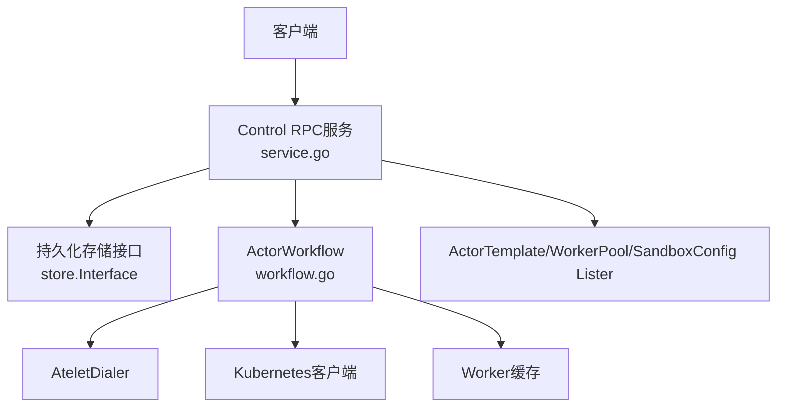
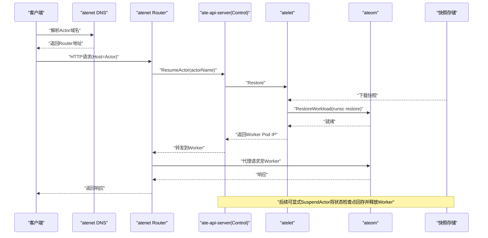
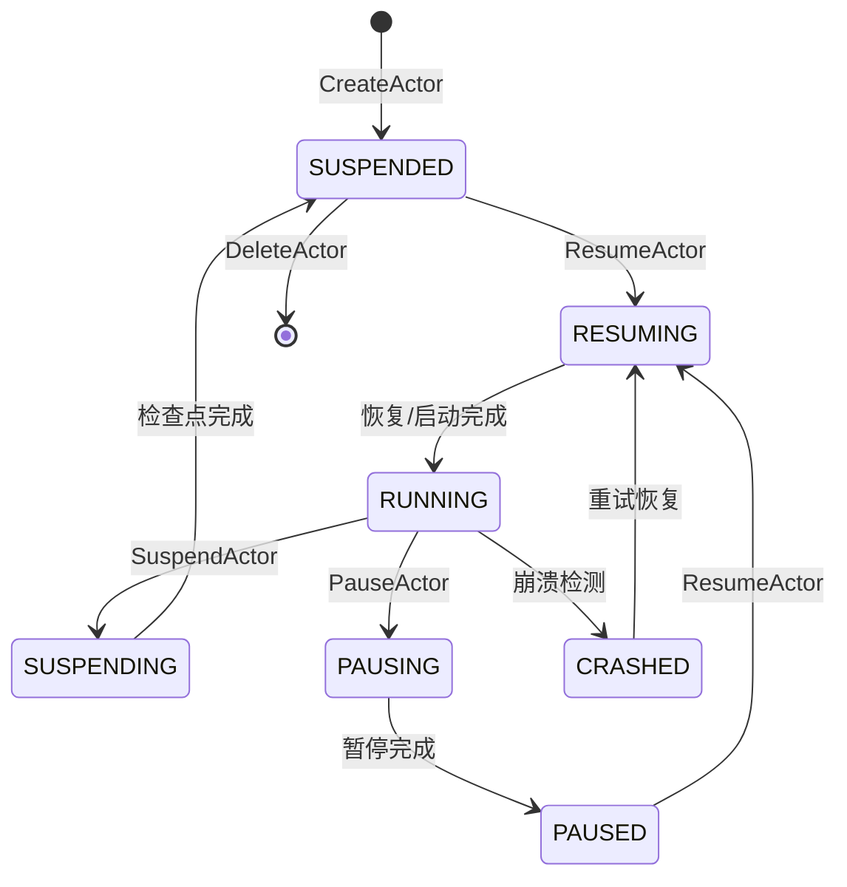
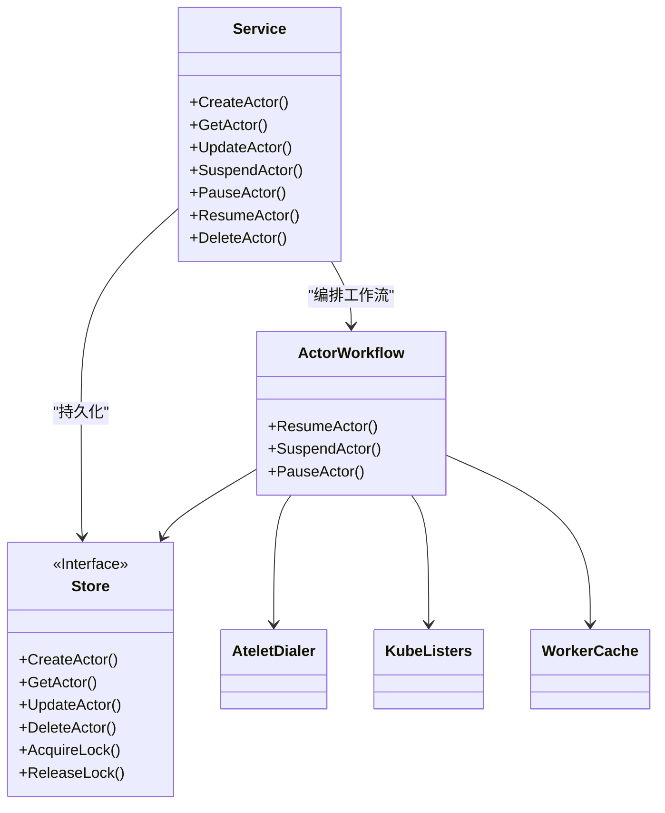

# Actor生命周期管理

<cite>
**本文引用的文件**   
- [pkg/proto/ateapipb/ateapi.proto](file://pkg/proto/ateapipb/ateapi.proto)
- [cmd/ateapi/internal/controlapi/service.go](file://cmd/ateapi/internal/controlapi/service.go)
- [cmd/ateapi/internal/controlapi/create_actor.go](file://cmd/ateapi/internal/controlapi/create_actor.go)
- [cmd/ateapi/internal/controlapi/get_actor.go](file://cmd/ateapi/internal/controlapi/get_actor.go)
- [cmd/ateapi/internal/controlapi/update_actor.go](file://cmd/ateapi/internal/controlapi/update_actor.go)
- [cmd/ateapi/internal/controlapi/suspend_actor.go](file://cmd/ateapi/internal/controlapi/suspend_actor.go)
- [cmd/ateapi/internal/controlapi/pause_actor.go](file://cmd/ateapi/internal/controlapi/pause_actor.go)
- [cmd/ateapi/internal/controlapi/resume_actor.go](file://cmd/ateapi/internal/controlapi/resume_actor.go)
- [cmd/ateapi/internal/controlapi/delete_actor.go](file://cmd/ateapi/internal/controlapi/delete_actor.go)
- [cmd/ateapi/internal/controlapi/workflow.go](file://cmd/ateapi/internal/controlapi/workflow.go)
- [docs/architecture.md](file://docs/architecture.md)
</cite>

## 目录
1. [简介](#简介)
2. [项目结构](#项目结构)
3. [核心组件](#核心组件)
4. [架构总览](#架构总览)
5. [详细组件分析](#详细组件分析)
6. [依赖关系分析](#依赖关系分析)
7. [性能与一致性考虑](#性能与一致性考虑)
8. [故障排查指南](#故障排查指南)
9. [结论](#结论)
10. [附录：gRPC客户端调用示例与常见模式](#附录grpc客户端调用示例与常见模式)

## 简介
本文件面向需要集成或运维Actor生命周期管理的开发者，提供完整的API规范、状态机定义、错误码约定、以及端到端调用流程说明。内容基于仓库中的Proto定义与控制面实现，覆盖CreateActor、GetActor、UpdateActor、SuspendActor、PauseActor、ResumeActor、DeleteActor等接口，并给出状态转换图与最佳实践建议。

## 项目结构
与Actor生命周期相关的代码主要分布在以下位置：
- Proto定义与服务接口声明：pkg/proto/ateapipb/ateapi.proto
- gRPC服务实现（控制面）：cmd/ateapi/internal/controlapi/*
- 工作流编排与并发控制：cmd/ateapi/internal/controlapi/workflow.go
- 架构文档中的生命周期序列图与状态机：docs/architecture.md



图表来源
- [cmd/ateapi/internal/controlapi/service.go:25-56](file://cmd/ateapi/internal/controlapi/service.go#L25-L56)
- [cmd/ateapi/internal/controlapi/workflow.go:131-163](file://cmd/ateapi/internal/controlapi/workflow.go#L131-L163)

章节来源
- [pkg/proto/ateapipb/ateapi.proto:25-65](file://pkg/proto/ateapipb/ateapi.proto#L25-L65)
- [cmd/ateapi/internal/controlapi/service.go:25-56](file://cmd/ateapi/internal/controlapi/service.go#L25-L56)

## 核心组件
- Control服务：暴露Actor生命周期相关的所有RPC方法，包括创建、查询、更新、挂起、暂停、恢复、删除等。
- Actor模型：包含资源元数据、模板引用、运行状态、调度选择器、最新快照信息等字段。
- Selector：用于按标签匹配WorkerPool的约束条件。
- ObjectRef：以(atespace, name)形式引用资源。
- SnapshotInfo：描述外部或本地快照信息。
- ActorWorkflow：封装了跨步骤的幂等工作流，负责加锁、加载资源、分配Worker、调用底层节点执行、最终状态落盘等。

章节来源
- [pkg/proto/ateapipb/ateapi.proto:117-157](file://pkg/proto/ateapipb/ateapi.proto#L117-L157)
- [pkg/proto/ateapipb/ateapi.proto:87-91](file://pkg/proto/ateapipb/ateapi.proto#L87-L91)
- [pkg/proto/ateapipb/ateapi.proto:166-173](file://pkg/proto/ateapipb/ateapi.proto#L166-L173)
- [pkg/proto/ateapipb/ateapi.proto:67-85](file://pkg/proto/ateapipb/ateapi.proto#L67-L85)
- [cmd/ateapi/internal/controlapi/workflow.go:131-163](file://cmd/ateapi/internal/controlapi/workflow.go#L131-L163)

## 架构总览
下图展示了网络请求触发自动恢复的典型路径，以及Actor状态机的关键转换。



图表来源
- [docs/architecture.md:353-384](file://docs/architecture.md#L353-L384)



图表来源
- [docs/architecture.md:386-396](file://docs/architecture.md#L386-L396)

## 详细组件分析

### 通用概念与类型
- ObjectRef
  - atespace: 资源所属命名空间；全局资源为空。
  - name: 资源名称，在atspace内唯一或全局唯一。
- Selector
  - match_labels: 键值对集合，仅支持相等匹配。
- SnapshotInfo
  - external.snapshot_uri_prefix: 外部快照URI前缀。
  - local.snapshot_prefix: 本地快照前缀。
  - local.node_vms_with_local_snapshots: 持有本地快照的节点VM列表（PAUSED时）。
- Actor.Status枚举
  - STATUS_UNSPECIFIED、STATUS_RESUMING、STATUS_RUNNING、STATUS_SUSPENDING、STATUS_SUSPENDED、STATUS_PAUSING、STATUS_PAUSED、STATUS_CRASHED。

章节来源
- [pkg/proto/ateapipb/ateapi.proto:166-173](file://pkg/proto/ateapipb/ateapi.proto#L166-L173)
- [pkg/proto/ateapipb/ateapi.proto:87-91](file://pkg/proto/ateapipb/ateapi.proto#L87-L91)
- [pkg/proto/ateapipb/ateapi.proto:67-85](file://pkg/proto/ateapipb/ateapi.proto#L67-L85)
- [pkg/proto/ateapipb/ateapi.proto:124-133](file://pkg/proto/ateapipb/ateapi.proto#L124-L133)

### GetActor
- 功能：根据ObjectRef获取Actor完整信息。
- 请求参数
  - actor: ObjectRef（必填），包含atspace与name。
- 响应
  - Actor对象，包含status、模板引用、worker_selector、最新快照信息等。
- 错误码
  - InvalidArgument：actor为nil或ObjectRef校验失败。
  - NotFound：Actor不存在。
  - 其他：内部错误。

章节来源
- [pkg/proto/ateapipb/ateapi.proto:207-209](file://pkg/proto/ateapipb/ateapi.proto#L207-L209)
- [cmd/ateapi/internal/controlapi/get_actor.go:30-41](file://cmd/ateapi/internal/controlapi/get_actor.go#L30-L41)
- [cmd/ateapi/internal/controlapi/get_actor.go:43-57](file://cmd/ateapi/internal/controlapi/get_actor.go#L43-L57)

### CreateActor
- 功能：基于ActorTemplate创建新Actor，初始状态为SUSPENDED。
- 请求参数
  - actor: Actor对象（必填），必须包含metadata.atespace、metadata.name、actor_template_namespace、actor_template_name；可选worker_selector。
- 响应
  - 新建的Actor对象。
- 错误码
  - InvalidArgument：必填字段缺失或格式不合法（如DNS子域/标签名值）。
  - FailedPrecondition：ActorTemplate不存在或Atespace不存在。
  - AlreadyExists：同名Actor已存在。
  - 其他：内部错误。

章节来源
- [pkg/proto/ateapipb/ateapi.proto:211-215](file://pkg/proto/ateapipb/ateapi.proto#L211-L215)
- [cmd/ateapi/internal/controlapi/create_actor.go:32-82](file://cmd/ateapi/internal/controlapi/create_actor.go#L32-L82)
- [cmd/ateapi/internal/controlapi/create_actor.go:84-152](file://cmd/ateapi/internal/controlapi/create_actor.go#L84-L152)

### UpdateActor
- 功能：更新Actor的可变字段（当前支持worker_selector）。变更在下一次ResumeActor生效。
- 请求参数
  - actor: ObjectRef（必填）。
  - worker_selector: Selector（可选）。
- 响应
  - UpdateActorResponse.actor：更新后的Actor。
- 错误码
  - InvalidArgument：ObjectRef或Selector校验失败。
  - NotFound：Actor不存在。
  - Aborted：并发更新冲突，需重试。
  - 其他：内部错误。

章节来源
- [pkg/proto/ateapipb/ateapi.proto:217-230](file://pkg/proto/ateapipb/ateapi.proto#L217-L230)
- [cmd/ateapi/internal/controlapi/update_actor.go:30-53](file://cmd/ateapi/internal/controlapi/update_actor.go#L30-L53)
- [cmd/ateapi/internal/controlapi/update_actor.go:55-73](file://cmd/ateapi/internal/controlapi/update_actor.go#L55-L73)

### SuspendActor
- 功能：将RUNNING状态的Actor进行快照检查点并释放Worker，进入SUSPENDED。
- 请求参数
  - actor: ObjectRef（必填）。
- 响应
  - SuspendActorResponse.actor：更新后的Actor。
- 错误码
  - InvalidArgument：ObjectRef校验失败。
  - NotFound：Actor不存在。
  - Aborted：并发操作冲突，需重试。
  - 其他：内部错误。

章节来源
- [pkg/proto/ateapipb/ateapi.proto:232-238](file://pkg/proto/ateapipb/ateapi.proto#L232-L238)
- [cmd/ateapi/internal/controlapi/suspend_actor.go:29-48](file://cmd/ateapi/internal/controlapi/suspend_actor.go#L29-L48)
- [cmd/ateapi/internal/controlapi/suspend_actor.go:50-64](file://cmd/ateapi/internal/controlapi/suspend_actor.go#L50-L64)
- [cmd/ateapi/internal/controlapi/workflow.go:196-224](file://cmd/ateapi/internal/controlapi/workflow.go#L196-L224)

### PauseActor
- 功能：将RUNNING状态的Actor暂停，保留本地快照于节点VM，进入PAUSED。
- 请求参数
  - actor: ObjectRef（必填）。
- 响应
  - PauseActorResponse.actor：更新后的Actor。
- 错误码
  - InvalidArgument：ObjectRef校验失败。
  - NotFound：Actor不存在。
  - Aborted：并发操作冲突，需重试。
  - 其他：内部错误。

章节来源
- [pkg/proto/ateapipb/ateapi.proto:240-246](file://pkg/proto/ateapipb/ateapi.proto#L240-L246)
- [cmd/ateapi/internal/controlapi/pause_actor.go:29-48](file://cmd/ateapi/internal/controlapi/pause_actor.go#L29-L48)
- [cmd/ateapi/internal/controlapi/pause_actor.go:50-64](file://cmd/ateapi/internal/controlapi/pause_actor.go#L50-L64)
- [cmd/ateapi/internal/controlapi/workflow.go:226-254](file://cmd/ateapi/internal/controlapi/workflow.go#L226-L254)

### ResumeActor
- 功能：从最新快照恢复Actor，或指定boot=true时跳过黄金快照直接从头启动。
- 请求参数
  - actor: ObjectRef（必填）。
  - boot: bool（可选），是否跳过黄金快照直接启动。
- 响应
  - ResumeActorResponse.actor：更新后的Actor。
- 错误码
  - InvalidArgument：ObjectRef校验失败。
  - NotFound：Actor不存在。
  - Aborted：并发操作冲突，需重试。
  - 其他：内部错误。

章节来源
- [pkg/proto/ateapipb/ateapi.proto:248-257](file://pkg/proto/ateapipb/ateapi.proto#L248-L257)
- [cmd/ateapi/internal/controlapi/resume_actor.go:29-48](file://cmd/ateapi/internal/controlapi/resume_actor.go#L29-L48)
- [cmd/ateapi/internal/controlapi/resume_actor.go:50-64](file://cmd/ateapi/internal/controlapi/resume_actor.go#L50-L64)
- [cmd/ateapi/internal/controlapi/workflow.go:165-194](file://cmd/ateapi/internal/controlapi/workflow.go#L165-L194)

### DeleteActor
- 功能：删除Actor。仅允许删除处于SUSPENDED状态的Actor。
- 请求参数
  - actor: ObjectRef（必填）。
- 响应
  - 被删除的Actor对象。
- 错误码
  - InvalidArgument：ObjectRef校验失败。
  - NotFound：Actor不存在。
  - FailedPrecondition：Actor未处于SUSPENDED状态。
  - Aborted：并发操作冲突，需重试。
  - 其他：内部错误。

章节来源
- [pkg/proto/ateapipb/ateapi.proto:259-261](file://pkg/proto/ateapipb/ateapi.proto#L259-L261)
- [cmd/ateapi/internal/controlapi/delete_actor.go:30-55](file://cmd/ateapi/internal/controlapi/delete_actor.go#L30-L55)
- [cmd/ateapi/internal/controlapi/delete_actor.go:57-71](file://cmd/ateapi/internal/controlapi/delete_actor.go#L57-L71)

### 工作流与并发控制
- 工作流步骤
  - Resume：LoadActorForResumeStep → AssignWorkerStep → CallAteletRestoreStep → FinalizeRunningStep。
  - Suspend：LoadActorForSuspendStep → MarkSuspendingStep → CallAteletSuspendStep → FinalizeSuspendedStep。
  - Pause：LoadActorForPauseStep → MarkPausingStep → CallAteletPauseStep → FinalizePausedStep。
- 并发控制
  - 通过分布式锁保证同一Actor的并发操作串行化，锁TTL约30秒，工作流上下文提前超时以确保安全释放。
  - 遇到ErrPersistenceRetry会指数退避重试；Aborted表示有其它操作正在进行或冲突。

章节来源
- [cmd/ateapi/internal/controlapi/workflow.go:165-194](file://cmd/ateapi/internal/controlapi/workflow.go#L165-L194)
- [cmd/ateapi/internal/controlapi/workflow.go:196-224](file://cmd/ateapi/internal/controlapi/workflow.go#L196-L224)
- [cmd/ateapi/internal/controlapi/workflow.go:226-254](file://cmd/ateapi/internal/controlapi/workflow.go#L226-L254)
- [cmd/ateapi/internal/controlapi/workflow.go:256-279](file://cmd/ateapi/internal/controlapi/workflow.go#L256-L279)

## 依赖关系分析
- Service层依赖
  - persistence.store.Interface：读写Actor、Atespace、锁等。
  - AteletDialer：与节点侧atelet通信，执行restore/suspend/pause。
  - Kubernetes Listers：读取ActorTemplate、WorkerPool、SandboxConfig等资源。
  - workercache.Cache：缓存Worker信息以提升调度效率。
- 对外依赖
  - Kubernetes API：拉取模板与池配置。
  - 快照存储：外部或本地快照的存取。



图表来源
- [cmd/ateapi/internal/controlapi/service.go:25-56](file://cmd/ateapi/internal/controlapi/service.go#L25-L56)
- [cmd/ateapi/internal/controlapi/workflow.go:131-163](file://cmd/ateapi/internal/controlapi/workflow.go#L131-L163)

## 性能与一致性考虑
- 幂等性
  - Resume/Suspend/Pause工作流设计为幂等，重复调用不会导致副作用。
- 并发控制
  - 使用分布式锁避免同一Actor的并发写冲突；遇到Aborted应遵循客户端重试策略。
- 快照与恢复
  - Resume可从外部或本地快照恢复；boot=true可跳过黄金快照直接启动，适用于冷启动场景。
- 调度选择器
  - worker_selector仅在下次Resume生效，便于动态调整目标WorkerPool而不中断当前运行实例。

[本节为通用指导，无需列出具体文件来源]

## 故障排查指南
- InvalidArgument
  - 检查ObjectRef是否为空、name/atspace是否符合命名规范、Selector标签键值是否合法。
- NotFound
  - 确认Actor是否存在；若刚创建，确保Atespace与ActorTemplate均已存在。
- FailedPrecondition
  - CreateActor：模板或命名空间不存在。
  - DeleteActor：Actor未处于SUSPENDED状态。
- Aborted
  - 并发冲突或另一操作进行中；客户端应实施指数退避重试。
- 运行时异常
  - 关注工作流各步骤日志，定位CallAtelet*或Finalize*阶段失败原因。

章节来源
- [cmd/ateapi/internal/controlapi/create_actor.go:32-82](file://cmd/ateapi/internal/controlapi/create_actor.go#L32-L82)
- [cmd/ateapi/internal/controlapi/delete_actor.go:30-55](file://cmd/ateapi/internal/controlapi/delete_actor.go#L30-L55)
- [cmd/ateapi/internal/controlapi/workflow.go:256-279](file://cmd/ateapi/internal/controlapi/workflow.go#L256-L279)

## 结论
Actor生命周期管理通过清晰的RPC接口与幂等工作流实现，结合分布式锁与快照机制，提供了高可用、可扩展的Agent运行环境。建议在客户端实现合理的重试与超时策略，并充分利用Selector与快照能力优化调度与恢复成本。

[本节为总结，无需列出具体文件来源]

## 附录：gRPC客户端调用示例与常见模式
以下为Python gRPC客户端调用示例片段（基于生成的Python stub），展示如何构造ObjectRef并调用ResumeActor与SuspendActor。请根据实际部署替换连接信息与认证头。

```python
import grpc
from common import ateapi_pb2, ateapi_pb2_grpc

def call_resume(stub, atespace, name):
    req = ateapi_pb2.ResumeActorRequest(
        actor=ateapi_pb2.ObjectRef(atespace=atespace, name=name),
        boot=False,
    )
    resp = stub.ResumeActor(req)
    print("Actor status after resume:", resp.actor.status)

def call_suspend(stub, atespace, name):
    req = ateapi_pb2.SuspendActorRequest(
        actor=ateapi_pb2.ObjectRef(atespace=atespace, name=name),
    )
    resp = stub.SuspendActor(req)
    print("Actor status after suspend:", resp.actor.status)

# 示例用法
channel = grpc.insecure_channel("localhost:50051")
stub = ateapi_pb2_grpc.ControlStub(channel)
call_resume(stub, "demo", "my-actor")
call_suspend(stub, "demo", "my-actor")
```

常见使用模式
- 先创建后恢复：CreateActor(SUSPENDED) → ResumeActor(RESUMING→RUNNING)。
- 按需暂停与恢复：PauseActor(PAUSING→PAUSED) → ResumeActor(RESUMING→RUNNING)。
- 清理资源：SuspendActor(SUSPENDING→SUSPENDED) → DeleteActor。
- 动态调度：UpdateActor修改worker_selector，下次Resume生效。

章节来源
- [benchmarking/locust/tests/ate_api.py:102-118](file://benchmarking/locust/tests/ate_api.py#L102-L118)
- [pkg/proto/ateapipb/ateapi.proto:248-257](file://pkg/proto/ateapipb/ateapi.proto#L248-L257)
- [pkg/proto/ateapipb/ateapi.proto:232-238](file://pkg/proto/ateapipb/ateapi.proto#L232-L238)
