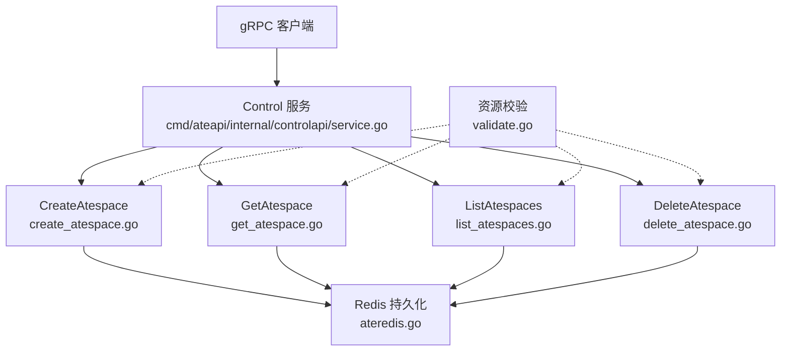
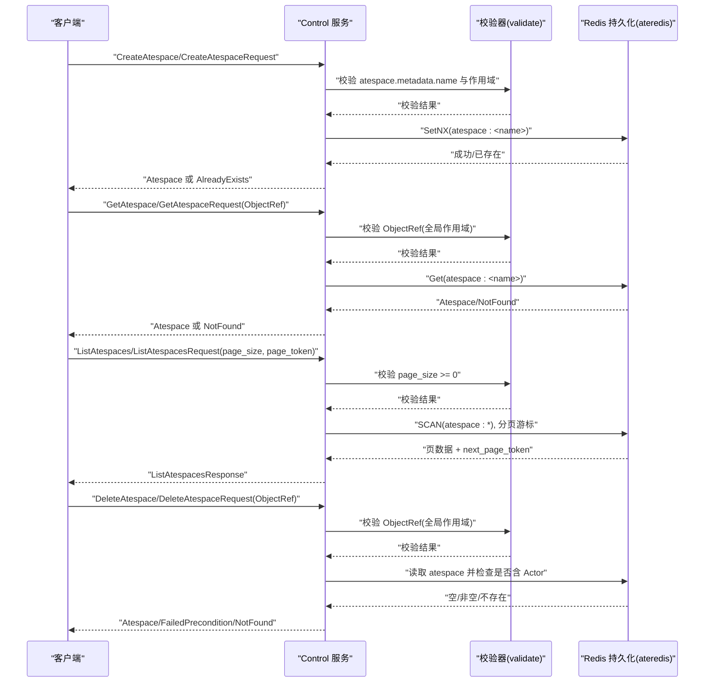
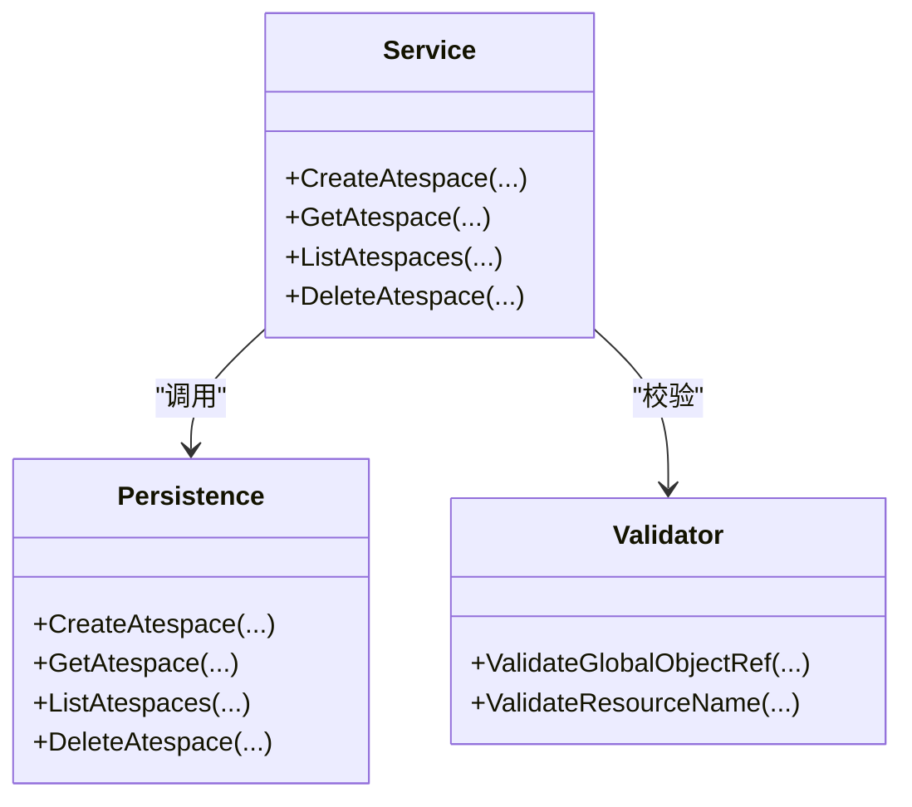
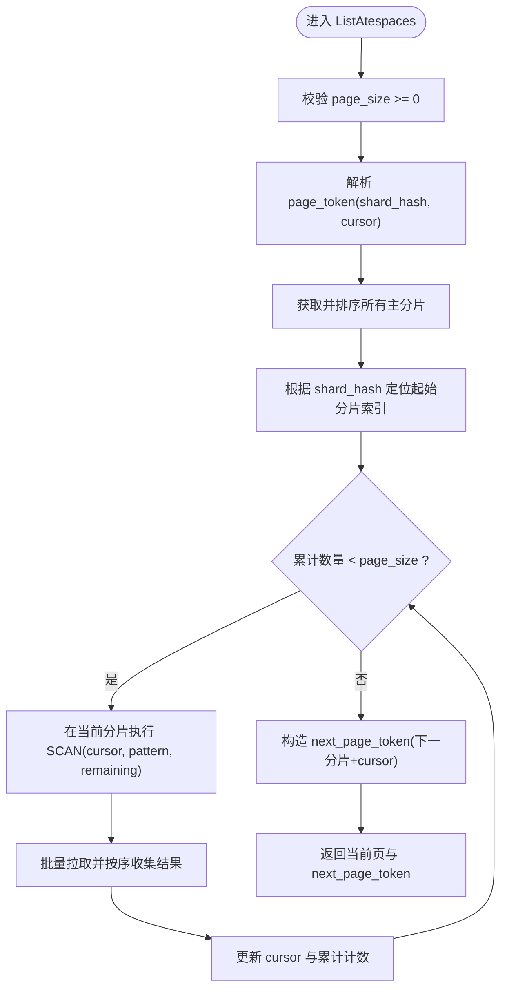

# Atespace管理

<cite>
**本文引用的文件**   
- [ateapi.proto](file://pkg/proto/ateapipb/ateapi.proto)
- [create_atespace.go](file://cmd/ateapi/internal/controlapi/create_atespace.go)
- [get_atespace.go](file://cmd/ateapi/internal/controlapi/get_atespace.go)
- [list_atespaces.go](file://cmd/ateapi/internal/controlapi/list_atespaces.go)
- [delete_atespace.go](file://cmd/ateapi/internal/controlapi/delete_atespace.go)
- [service.go](file://cmd/ateapi/internal/controlapi/service.go)
- [validate.go](file://internal/resources/validate.go)
- [ateredis.go](file://cmd/ateapi/internal/store/ateredis/ateredis.go)
- [ateapi_pb2_grpc.py](file://benchmarking/locust/common/ateapi_pb2_grpc.py)
</cite>

## 目录
1. [简介](#简介)
2. [项目结构](#项目结构)
3. [核心组件](#核心组件)
4. [架构总览](#架构总览)
5. [详细组件分析](#详细组件分析)
6. [依赖关系分析](#依赖关系分析)
7. [性能与分页实现细节](#性能与分页实现细节)
8. [故障排查指南](#故障排查指南)
9. [结论](#结论)
10. [附录：gRPC客户端调用示例与最佳实践](#附录grpc客户端调用示例与最佳实践)

## 简介
本文件为 Atespace 管理的完整 API 文档。Atespace 是 Agent Substrate 中的“隔离边界”，用于将 Actor（工作负载）划分到不同的命名空间，从而实现资源、状态和访问控制层面的隔离。本文围绕以下 gRPC 方法提供规范说明：CreateAtespace、GetAtespace、ListAtespaces、DeleteAtespace，包括请求参数定义、响应格式、数据校验规则、错误码约定、以及分页查询的实现细节与最佳实践。同时给出实际 gRPC 客户端调用示例路径与常见使用场景。

## 项目结构
与 Atespace 管理相关的代码主要分布在如下位置：
- 接口定义：pkg/proto/ateapipb/ateapi.proto
- 服务实现：cmd/ateapi/internal/controlapi/*_atespace.go
- 存储后端：cmd/ateapi/internal/store/ateredis/ateredis.go
- 通用校验：internal/resources/validate.go
- 服务装配：cmd/ateapi/internal/controlapi/service.go
- Python 客户端生成桩：benchmarking/locust/common/ateapi_pb2_grpc.py

图表来源
- [service.go:25-57](file://cmd/ateapi/internal/controlapi/service.go#L25-L57)
- [create_atespace.go:30-79](file://cmd/ateapi/internal/controlapi/create_atespace.go#L30-L79)
- [get_atespace.go:30-61](file://cmd/ateapi/internal/controlapi/get_atespace.go#L30-L61)
- [list_atespaces.go:27-55](file://cmd/ateapi/internal/controlapi/list_atespaces.go#L27-L55)
- [delete_atespace.go:30-65](file://cmd/ateapi/internal/controlapi/delete_atespace.go#L30-L65)
- [ateredis.go:108-208](file://cmd/ateapi/internal/store/ateredis/ateredis.go#L108-L208)
- [validate.go:74-96](file://internal/resources/validate.go#L74-L96)

章节来源
- [service.go:25-57](file://cmd/ateapi/internal/controlapi/service.go#L25-L57)
- [ateapi.proto:25-65](file://pkg/proto/ateapipb/ateapi.proto#L25-L65)

## 核心组件
- Control 服务：对外暴露 gRPC 接口，包含 Atespace 的 CRUD 操作。
- 持久化层（Redis）：以键值形式存储 Atespace 元信息，并提供分页扫描能力。
- 校验器：对 ObjectRef、名称等字段进行严格校验，确保全局作用域约束与 DNS-1123 标签合规。

章节来源
- [ateapi.proto:159-205](file://pkg/proto/ateapipb/ateapi.proto#L159-L205)
- [validate.go:74-96](file://internal/resources/validate.go#L74-L96)
- [ateredis.go:108-208](file://cmd/ateapi/internal/store/ateredis/ateredis.go#L108-L208)

## 架构总览
下图展示了 Atespace 管理在 gRPC 调用链中的关键交互：客户端通过 Control 服务发起请求，服务层执行参数校验并调用 Redis 持久化层完成读写；删除时还会检查 Atespace 是否为空。

图表来源
- [create_atespace.go:30-79](file://cmd/ateapi/internal/controlapi/create_atespace.go#L30-L79)
- [get_atespace.go:30-61](file://cmd/ateapi/internal/controlapi/get_atespace.go#L30-L61)
- [list_atespaces.go:27-55](file://cmd/ateapi/internal/controlapi/list_atespaces.go#L27-L55)
- [delete_atespace.go:30-65](file://cmd/ateapi/internal/controlapi/delete_atespace.go#L30-L65)
- [ateredis.go:108-208](file://cmd/ateapi/internal/store/ateredis/ateredis.go#L108-L208)
- [validate.go:74-96](file://internal/resources/validate.go#L74-L96)

## 详细组件分析

### Atespace 概念与隔离机制
- Atespace 是全局作用域资源，其标识由 metadata.name 唯一确定，metadata.atespace 必须为空。
- 隔离边界体现在：Actor 创建时必须指定所属 Atespace；系统通过 Atespace 前缀组织键空间（如 actor:<atespace>:<name>），从而在逻辑上隔离不同租户/团队的数据与生命周期。
- 删除保护：仅当 Atespace 内无 Actor 时允许删除，避免误删仍在使用的隔离边界。

章节来源
- [ateapi.proto:159-173](file://pkg/proto/ateapipb/ateapi.proto#L159-L173)
- [ateredis.go:90-106](file://cmd/ateapi/internal/store/ateredis/ateredis.go#L90-L106)
- [delete_atespace.go:30-65](file://cmd/ateapi/internal/controlapi/delete_atespace.go#L30-L65)

### CreateAtespace
- 功能：创建一个 Atespace。
- 请求体：CreateAtespaceRequest
  - atespace: Atespace
    - metadata.atespace: 必须为空（全局作用域）
    - metadata.name: 必填且符合 DNS-1123 标签规则
- 响应体：Atespace
  - 返回服务器生成的 metadata（uid、version、时间戳等）
- 错误码：
  - InvalidArgument：请求体缺失或 name 不合法
  - AlreadyExists：同名 Atespace 已存在
- 服务端行为：
  - 校验通过后，以 SetNX 原子写入 Redis 键 atespace:<name>
  - 若 key 已存在则返回 AlreadyExists

章节来源
- [ateapi.proto:175-178](file://pkg/proto/ateapipb/ateapi.proto#L175-L178)
- [create_atespace.go:30-79](file://cmd/ateapi/internal/controlapi/create_atespace.go#L30-L79)
- [validate.go:74-96](file://internal/resources/validate.go#L74-L96)
- [ateredis.go:108-127](file://cmd/ateapi/internal/store/ateredis/ateredis.go#L108-L127)

### GetAtespace
- 功能：按 ObjectRef 获取 Atespace。
- 请求体：GetAtespaceRequest
  - atespace: ObjectRef
    - atespace: 必须为空（全局作用域）
    - name: 必填且符合 DNS-1123 标签规则
- 响应体：Atespace
- 错误码：
  - InvalidArgument：ObjectRef 非法
  - NotFound：未找到对应 Atespace

章节来源
- [ateapi.proto:180-182](file://pkg/proto/ateapipb/ateapi.proto#L180-L182)
- [get_atespace.go:30-61](file://cmd/ateapi/internal/controlapi/get_atespace.go#L30-L61)
- [validate.go:74-96](file://internal/resources/validate.go#L74-L96)
- [ateredis.go:129-146](file://cmd/ateapi/internal/store/ateredis/ateredis.go#L129-L146)

### ListAtespaces
- 功能：分页列出所有 Atespace。
- 请求体：ListAtespacesRequest
  - page_size: 可选，>=0；超过上限会被服务端限制（见下文）
  - page_token: 可选，首次为空，后续携带上一次返回的 next_page_token
- 响应体：ListAtespacesResponse
  - atespaces: 当前页 Atespace 列表
  - next_page_token: 下一页游标，空表示最后一页
- 错误码：
  - InvalidArgument：page_size < 0
- 服务端行为：
  - 基于 Redis SCAN 遍历 atespace:* 模式，跨主分片稳定排序后分页
  - 分页令牌包含起始分片哈希与 cursor，保证拓扑不变时的可恢复性

章节来源
- [ateapi.proto:184-201](file://pkg/proto/ateapipb/ateapi.proto#L184-L201)
- [list_atespaces.go:27-55](file://cmd/ateapi/internal/controlapi/list_atespaces.go#L27-L55)
- [ateredis.go:158-172](file://cmd/ateapi/internal/store/ateredis/ateredis.go#L158-L172)
- [ateredis.go:649-702](file://cmd/ateapi/internal/store/ateredis/ateredis.go#L649-L702)

### DeleteAtespace
- 功能：删除一个空的 Atespace。
- 请求体：DeleteAtespaceRequest
  - atespace: ObjectRef
    - atespace: 必须为空（全局作用域）
    - name: 必填且符合 DNS-1123 标签规则
- 响应体：Atespace（被删除的资源）
- 错误码：
  - InvalidArgument：ObjectRef 非法
  - NotFound：Atespace 不存在
  - FailedPrecondition：Atespace 非空（仍有 Actor）
- 服务端行为：
  - 先读取 Atespace 记录，再检查该 Atespace 下是否存在任何 Actor
  - 若为空则删除 atespace:<name> 键并返回被删对象

章节来源
- [ateapi.proto:203-205](file://pkg/proto/ateapipb/ateapi.proto#L203-L205)
- [delete_atespace.go:30-65](file://cmd/ateapi/internal/controlapi/delete_atespace.go#L30-L65)
- [ateredis.go:174-208](file://cmd/ateapi/internal/store/ateredis/ateredis.go#L174-L208)

## 依赖关系分析
- Control 服务依赖：
  - 持久化接口 store.Interface（Redis 实现 ateredis）
  - 资源校验 internal/resources
- 持久化层依赖：
  - Redis ClusterClient，支持 SCAN、Watch、Pub/Sub 等
- 校验器依赖：
  - k8s.io/apimachinery 的 DNS-1123 校验工具

图表来源
- [service.go:25-57](file://cmd/ateapi/internal/controlapi/service.go#L25-L57)
- [create_atespace.go:30-79](file://cmd/ateapi/internal/controlapi/create_atespace.go#L30-L79)
- [get_atespace.go:30-61](file://cmd/ateapi/internal/controlapi/get_atespace.go#L30-L61)
- [list_atespaces.go:27-55](file://cmd/ateapi/internal/controlapi/list_atespaces.go#L27-L55)
- [delete_atespace.go:30-65](file://cmd/ateapi/internal/controlapi/delete_atespace.go#L30-L65)
- [validate.go:74-96](file://internal/resources/validate.go#L74-L96)
- [ateredis.go:108-208](file://cmd/ateapi/internal/store/ateredis/ateredis.go#L108-L208)

章节来源
- [service.go:25-57](file://cmd/ateapi/internal/controlapi/service.go#L25-L57)
- [validate.go:74-96](file://internal/resources/validate.go#L74-L96)
- [ateredis.go:108-208](file://cmd/ateapi/internal/store/ateredis/ateredis.go#L108-L208)

## 性能与分页实现细节
- 分页策略
  - 使用 Redis SCAN 遍历匹配模式 atespace:*，避免一次性加载全量数据。
  - 分页令牌包含两个字段：
    - shard_hash：当前分片地址的哈希，用于在拓扑变化时定位起始分片
    - cursor：当前分片的 SCAN 游标
  - 多主分片有序合并：对所有主节点地址排序，按顺序依次 SCAN，直到收集到 pageSize 条记录为止。
- 大小限制
  - page_size 最大会被限制为 1000（协议注释中明确说明）。
- 一致性
  - 列表为“软保证”：在遍历期间若底层数据变更，可能出现重复或缺失条目。
- 复杂度
  - 单次 List 的时间复杂度近似 O(N_scan + K_fetch)，其中 N_scan 为扫描到的键数，K_fetch 为最终返回的记录数。
  - 空间复杂度近似 O(K_fetch)。

图表来源
- [list_atespaces.go:27-55](file://cmd/ateapi/internal/controlapi/list_atespaces.go#L27-L55)
- [ateredis.go:649-702](file://cmd/ateapi/internal/store/ateredis/ateredis.go#L649-L702)
- [ateredis.go:704-734](file://cmd/ateapi/internal/store/ateredis/ateredis.go#L704-L734)

章节来源
- [ateapi.proto:184-201](file://pkg/proto/ateapipb/ateapi.proto#L184-L201)
- [list_atespaces.go:27-55](file://cmd/ateapi/internal/controlapi/list_atespaces.go#L27-L55)
- [ateredis.go:649-702](file://cmd/ateapi/internal/store/ateredis/ateredis.go#L649-L702)

## 故障排查指南
- InvalidArgument
  - 现象：请求参数缺失或不符合规则（如 name 不是合法的 DNS-1123 标签、ObjectRef 的 atespace 不为空等）。
  - 排查要点：确认 ObjectRef 的 atespace 是否为空（全局作用域）、name 是否符合命名规范。
- NotFound
  - 现象：Get/Delete 指定名称的 Atespace 不存在。
  - 排查要点：确认名称拼写与大小写；确认是否已被删除。
- AlreadyExists
  - 现象：Create 时同名 Atespace 已存在。
  - 排查要点：幂等处理，先 Get 判断是否存在，或直接捕获错误做幂等重试。
- FailedPrecondition
  - 现象：尝试删除非空 Atespace。
  - 排查要点：先清理该 Atespace 下的所有 Actor，再重试删除。

章节来源
- [create_atespace.go:30-79](file://cmd/ateapi/internal/controlapi/create_atespace.go#L30-L79)
- [get_atespace.go:30-61](file://cmd/ateapi/internal/controlapi/get_atespace.go#L30-L61)
- [list_atespaces.go:27-55](file://cmd/ateapi/internal/controlapi/list_atespaces.go#L27-L55)
- [delete_atespace.go:30-65](file://cmd/ateapi/internal/controlapi/delete_atespace.go#L30-L65)

## 结论
Atespace 作为全局作用域的隔离边界，提供了清晰的资源分组与删除保护机制。API 设计遵循统一的 ObjectRef 引用模型与严格的命名校验，配合 Redis 的分页扫描实现高效的可扩展列表能力。建议在生产环境中结合幂等与重试策略，合理设置 page_size，并在删除前确保目标 Atespace 为空。

## 附录：gRPC客户端调用示例与最佳实践

### 常用使用场景
- 初始化环境：为每个团队/项目创建独立的 Atespace，随后在其下创建 Actor。
- 运维巡检：定期 ListAtespaces 统计各隔离边界的规模与健康状况。
- 清理回收：在确认 Atespace 为空后执行删除，释放资源。

### gRPC 客户端调用示例（Python）
- 参考路径：[ateapi_pb2_grpc.py](file://benchmarking/locust/common/ateapi_pb2_grpc.py)
- 示例方法：
  - GetAtespace：unary_unary 调用 /ateapi.Control/GetAtespace
  - ListAtespaces：unary_unary 调用 /ateapi.Control/ListAtespaces
- 使用建议：
  - 构建 GetAtespaceRequest 时，确保 ObjectRef.atespace 为空，name 合法。
  - 构建 ListAtespacesRequest 时，首次调用不传 page_token，后续循环传入上一次返回的 next_page_token，直至为空。
  - 合理设置 page_size（不超过 1000），并结合超时与重试策略提升鲁棒性。

章节来源
- [ateapi_pb2_grpc.py:564-616](file://benchmarking/locust/common/ateapi_pb2_grpc.py#L564-L616)
