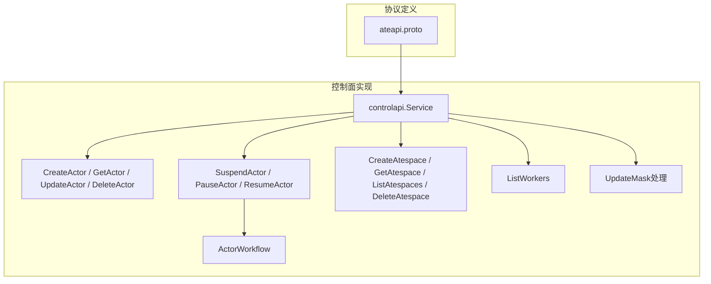
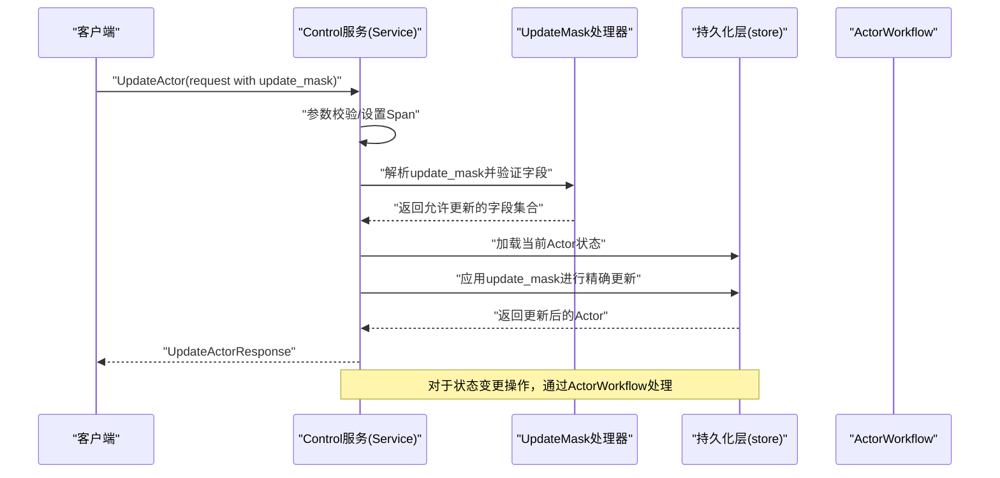
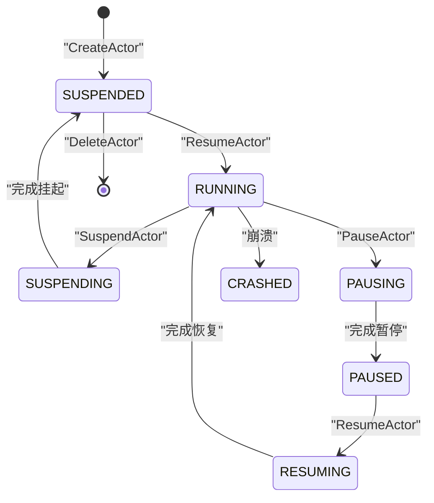
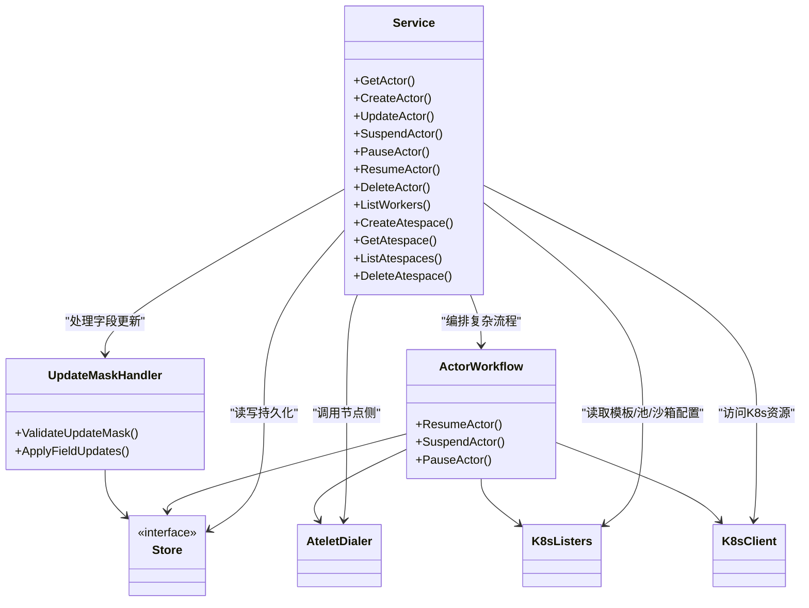

# Control服务

<cite>
**本文引用的文件**   
- [ateapi.proto](file://pkg/proto/ateapipb/ateapi.proto)
- [service.go](file://cmd/ateapi/internal/controlapi/service.go)
- [workflow.go](file://cmd/ateapi/internal/controlapi/workflow.go)
- [create_actor.go](file://cmd/ateapi/internal/controlapi/create_actor.go)
- [get_actor.go](file://cmd/ateapi/internal/controlapi/get_actor.go)
- [update_actor.go](file://cmd/ateapi/internal/controlapi/update_actor.go)
- [suspend_actor.go](file://cmd/ateapi/internal/controlapi/suspend_actor.go)
- [pause_actor.go](file://cmd/ateapi/internal/controlapi/pause_actor.go)
- [resume_actor.go](file://cmd/ateapi/internal/controlapi/resume_actor.go)
- [delete_actor.go](file://cmd/ateapi/internal/controlapi/delete_actor.go)
- [create_atespace.go](file://cmd/ateapi/internal/controlapi/create_atespace.go)
- [get_atespace.go](file://cmd/ateapi/internal/controlapi/get_atespace.go)
- [list_atespaces.go](file://cmd/ateapi/internal/controlapi/list_atespaces.go)
- [delete_atespace.go](file://cmd/ateapi/internal/controlapi/delete_atespace.go)
- [list_workers.go](file://cmd/ateapi/internal/controlapi/list_workers.go)
- [update_mask.go](file://cmd/ateapi/internal/controlapi/update_mask.go)
</cite>

## 更新摘要
**所做更改**
- 更新了UpdateActor接口规范，从简单的字段更新重构为基于update_mask的精确字段更新模式
- 新增了update_mask机制说明，支持更精细的字段控制和worker_selector管理
- 更新了相关错误处理和并发控制逻辑
- 增强了API文档以反映新的更新模式

## 目录
1. [简介](#简介)
2. [项目结构](#项目结构)
3. [核心组件](#核心组件)
4. [架构总览](#架构总览)
5. [详细组件分析](#详细组件分析)
6. [依赖关系分析](#依赖关系分析)
7. [性能与一致性](#性能与一致性)
8. [故障排查指南](#故障排查指南)
9. [结论](#结论)
10. [附录：gRPC客户端调用示例](#附录grpc客户端调用示例)

## 简介
Control服务是Agentic Substrate的主要gRPC控制面，提供Actor生命周期管理、Atespace（隔离域）CRUD以及Worker列表查询等能力。其接口定义采用Protocol Buffers，并通过工作流引擎实现幂等、可重试的复杂操作（如Suspend/Pause/Resume）。**更新**：UpdateActor API已重构为使用update_mask模式，支持更精确的字段更新和worker_selector管理。

## 项目结构
- 协议定义位于 pkg/proto/ateapipb/ateapi.proto，包含所有消息类型与服务方法。
- 控制面实现位于 cmd/ateapi/internal/controlapi 下，按功能拆分到多个文件：Service入口、各RPC处理函数、工作流编排与校验逻辑。
- Service通过持久化层、Kubernetes lister、Atelet拨号器与缓存协作完成业务逻辑。



图表来源
- [ateapi.proto:26-65](file://pkg/proto/ateapipb/ateapi.proto#L26-L65)
- [service.go:25-56](file://cmd/ateapi/internal/controlapi/service.go#L25-L56)
- [workflow.go:131-254](file://cmd/ateapi/internal/controlapi/workflow.go#L131-L254)
- [update_mask.go:1-50](file://cmd/ateapi/internal/controlapi/update_mask.go#L1-L50)

章节来源
- [ateapi.proto:26-65](file://pkg/proto/ateapipb/ateapi.proto#L26-L65)
- [service.go:25-56](file://cmd/ateapi/internal/controlapi/service.go#L25-L56)

## 核心组件
- Service：实现 ateapipb.ControlServer，负责参数校验、权限/上下文注入、调用持久化与工作流。
- ActorWorkflow：封装Actor状态变更的幂等工作流，支持锁、前置检查、步骤执行与指数退避重试。
- **更新处理器**：新增的update_mask机制，用于精确控制哪些字段需要更新，避免不必要的字段覆盖。
- 持久化层（store.Interface）：对外暴露Actor/Atespace/Worker的CRUD与分页查询。
- Kubernetes Lister：读取ActorTemplate、WorkerPool、SandboxConfig等资源以辅助调度与恢复。
- AteletDialer：与节点侧Atelet通信，触发实际挂起/暂停/恢复等操作。

章节来源
- [service.go:25-56](file://cmd/ateapi/internal/controlapi/service.go#L25-L56)
- [workflow.go:131-163](file://cmd/ateapi/internal/controlapi/workflow.go#L131-L163)
- [update_mask.go:1-50](file://cmd/ateapi/internal/controlapi/update_mask.go#L1-L50)

## 架构总览
Control服务作为统一入口，将请求路由至具体处理器；涉及跨进程或外部系统调用的复杂流程由ActorWorkflow编排，确保幂等性与可恢复性。**更新**：UpdateActor现在通过update_mask机制进行精确字段更新，提高了并发安全性和更新效率。



图表来源
- [update_actor.go:30-53](file://cmd/ateapi/internal/controlapi/update_actor.go#L30-53)
- [update_mask.go:1-50](file://cmd/ateapi/internal/controlapi/update_mask.go#L1-L50)
- [workflow.go:196-224](file://cmd/ateapi/internal/controlapi/workflow.go#L196-L224)

## 详细组件分析

### 协议与服务概览
- 服务名：Control
- 主要方法：GetActor、CreateActor、UpdateActor、SuspendActor、PauseActor、ResumeActor、DeleteActor、ListWorkers、ListActors、CreateAtespace、GetAtespace、ListAtespaces、DeleteAtespace

章节来源
- [ateapi.proto:26-65](file://pkg/proto/ateapipb/ateapi.proto#L26-L65)

### 数据模型与验证规则
- ResourceMetadata：通用元信息（atespace、name、uid、version、create_time、update_time），创建时指定且不可变字段包括atespace/name/uid，version随每次变更递增。
- ObjectRef：引用资源（atespace, name），用于定位Actor/Atespace等。
- Selector：基于标签的匹配（match_labels），仅支持等值匹配，键值需符合Kubernetes Label规范，数量上限为10。
- Actor：包含模板引用、状态机状态、分配信息、最新快照信息等。
- Atespace：全局作用域资源，metadata.atespace必须为空，name唯一。
- Worker/Assignment/KubeNamespacedObjectRef：用于列出Worker及其分配情况。

验证要点
- CreateActor：actor_template_namespace/name必填且符合DNS命名规范；worker_selector可选但需满足Label键值约束；atespace/name必填且为有效资源名；创建前需校验Atespace存在与ActorTemplate存在。
- **UpdateActor（已更新）**：现在使用update_mask模式，仅更新指定的字段（当前主要为worker_selector）；并发冲突返回Aborted；update_mask必须明确指定要更新的字段。
- DeleteActor：仅允许删除处于SUSPENDED状态的Actor，否则返回FailedPrecondition。
- Atespace CRUD：名称必填且有效；删除空Atespace，非空返回FailedPrecondition。
- 分页：page_size>=0，服务端可能限制最大页大小（例如1000）。

章节来源
- [ateapi.proto:87-173](file://pkg/proto/ateapipb/ateapi.proto#L87-L173)
- [create_actor.go:84-152](file://cmd/ateapi/internal/controlapi/create_actor.go#L84-L152)
- [update_actor.go:30-53](file://cmd/ateapi/internal/controlapi/update_actor.go#L30-53)
- [update_mask.go:1-50](file://cmd/ateapi/internal/controlapi/update_mask.go#L1-L50)
- [delete_actor.go:57-71](file://cmd/ateapi/internal/controlapi/delete_actor.go#L57-L71)
- [create_atespace.go:52-78](file://cmd/ateapi/internal/controlapi/create_atespace.go#L52-L78)
- [delete_atespace.go:50-64](file://cmd/ateapi/internal/controlapi/delete_atespace.go#L50-L64)
- [list_atespaces.go:42-54](file://cmd/ateapi/internal/controlapi/list_atespaces.go#L42-L54)
- [list_workers.go:42-54](file://cmd/ateapi/internal/controlapi/list_workers.go#L42-L54)

### RPC接口规范

#### GetActor
- 描述：根据ObjectRef获取Actor。
- 请求：GetActorRequest.actor（必填，ObjectRef）。
- 响应：Actor。
- 错误码：
  - InvalidArgument：参数校验失败。
  - NotFound：Actor不存在。
- 行为：直接读取持久化层。

章节来源
- [get_actor.go:30-41](file://cmd/ateapi/internal/controlapi/get_actor.go#L30-L41)
- [get_actor.go:43-57](file://cmd/ateapi/internal/controlapi/get_actor.go#L43-L57)

#### CreateActor
- 描述：基于ActorTemplate创建新Actor，初始状态为SUSPENDED。
- 请求：CreateActorRequest.actor（必填，含metadata、模板引用、可选worker_selector）。
- 响应：Actor。
- 错误码：
  - InvalidArgument：参数校验失败（模板命名、Selector键值、资源名等）。
  - FailedPrecondition：ActorTemplate或Atespace不存在。
  - AlreadyExists：同名Actor已存在。
- 行为：校验模板与Atespace存在后写入持久化层。

章节来源
- [create_actor.go:32-82](file://cmd/ateapi/internal/controlapi/create_actor.go#L32-L82)
- [create_actor.go:84-152](file://cmd/ateapi/internal/controlapi/create_actor.go#L84-L152)

#### UpdateActor（已更新）
- 描述：**重构为update_mask模式**，通过update_mask精确指定要更新的字段，当前主要支持worker_selector的更新。
- 请求：UpdateActorRequest.actor（必填）、update_mask（必填，指定要更新的字段路径）。
- 响应：UpdateActorResponse.actor。
- 错误码：
  - InvalidArgument：参数校验失败或update_mask无效。
  - NotFound：Actor不存在。
  - Aborted：并发更新冲突，建议重试。
- 行为：使用update_mask进行精确字段更新，避免不必要的字段覆盖，提高并发安全性。

**更新内容**
- 从简单的字段更新改为基于update_mask的精确更新模式
- 支持更细粒度的字段控制
- 改进了并发更新的安全性
- 增强了字段验证和错误处理

章节来源
- [update_actor.go:30-53](file://cmd/ateapi/internal/controlapi/update_actor.go#L30-L53)
- [update_mask.go:1-50](file://cmd/ateapi/internal/controlapi/update_mask.go#L1-L50)

#### SuspendActor
- 描述：将运行中的Actor挂起到快照，进入SUSPENDED状态。
- 请求：SuspendActorRequest.actor（必填）。
- 响应：SuspendActorResponse.actor。
- 错误码：
  - InvalidArgument：参数校验失败。
  - NotFound：Actor不存在。
  - Aborted：并发冲突，建议重试。
- 行为：通过ActorWorkflow执行多步工作流（加锁、加载、标记、调用Atelet、最终化）。

章节来源
- [suspend_actor.go:29-48](file://cmd/ateapi/internal/controlapi/suspend_actor.go#L29-L48)
- [workflow.go:196-224](file://cmd/ateapi/internal/controlapi/workflow.go#L196-L224)

#### PauseActor
- 描述：暂停Actor，保留本地快照于节点VM，进入PAUSED状态。
- 请求：PauseActorRequest.actor（必填）。
- 响应：PauseActorResponse.actor。
- 错误码：
  - InvalidArgument：参数校验失败。
  - NotFound：Actor不存在。
  - Aborted：并发冲突，建议重试。
- 行为：通过ActorWorkflow执行多步工作流（加锁、加载、标记、调用Atelet、最终化）。

章节来源
- [pause_actor.go:29-48](file://cmd/ateapi/internal/controlapi/pause_actor.go#L29-L48)
- [workflow.go:226-254](file://cmd/ateapi/internal/controlapi/workflow.go#L226-L254)

#### ResumeActor
- 描述：从最新快照恢复Actor，可选择跳过黄金快照从头启动（boot=true）。
- 请求：ResumeActorRequest.actor（必填）、boot（可选布尔）。
- 响应：ResumeActorResponse.actor。
- 错误码：
  - InvalidArgument：参数校验失败。
  - NotFound：Actor不存在。
  - Aborted：并发冲突，建议重试。
- 行为：通过ActorWorkflow执行多步工作流（加锁、加载、分配Worker、调用Atelet恢复、最终化RUNNING）。

章节来源
- [resume_actor.go:29-48](file://cmd/ateapi/internal/controlapi/resume_actor.go#L29-L48)
- [workflow.go:165-194](file://cmd/ateapi/internal/controlapi/workflow.go#L165-L194)

#### DeleteActor
- 描述：删除Actor，仅允许删除处于SUSPENDED状态的Actor。
- 请求：DeleteActorRequest.actor（必填）。
- 响应：Actor（被删除的Actor）。
- 错误码：
  - InvalidArgument：参数校验失败。
  - NotFound：Actor不存在。
  - FailedPrecondition：Actor未处于SUSPENDED状态。
  - Aborted：并发冲突，建议重试。
- 行为：先校验状态再删除。

章节来源
- [delete_actor.go:30-55](file://cmd/ateapi/internal/controlapi/delete_actor.go#L30-L55)
- [delete_actor.go:57-71](file://cmd/ateapi/internal/controlapi/delete_actor.go#L57-L71)

#### ListWorkers
- 描述：分页列出Worker。
- 请求：ListWorkersRequest.page_size（>=0）、page_token。
- 响应：ListWorkersResponse.workers、next_page_token。
- 错误码：InvalidArgument（page_size非法）。
- 行为：直接从持久化层分页读取。

章节来源
- [list_workers.go:27-40](file://cmd/ateapi/internal/controlapi/list_workers.go#L27-L40)
- [list_workers.go:42-54](file://cmd/ateapi/internal/controlapi/list_workers.go#L42-L54)

#### Atespace管理（CRUD）
- CreateAtespace
  - 请求：CreateAtespaceRequest.atespace（必填，全局作用域，metadata.atespace必须为空，name必填且有效）。
  - 响应：Atespace。
  - 错误码：InvalidArgument、AlreadyExists。
- GetAtespace
  - 请求：GetAtespaceRequest.atespace（必填，全局ObjectRef）。
  - 响应：Atespace。
  - 错误码：InvalidArgument、NotFound。
- ListAtespaces
  - 请求：ListAtespacesRequest.page_size（>=0）、page_token。
  - 响应：ListAtespacesResponse.atespaces、next_page_token。
  - 错误码：InvalidArgument。
- DeleteAtespace
  - 请求：DeleteAtespaceRequest.atespace（必填，全局ObjectRef）。
  - 响应：Atespace。
  - 错误码：InvalidArgument、NotFound、FailedPrecondition（非空）。

章节来源
- [create_atespace.go:30-49](file://cmd/ateapi/internal/controlapi/create_atespace.go#L30-L49)
- [create_atespace.go:52-78](file://cmd/ateapi/internal/controlapi/create_atespace.go#L52-L78)
- [get_atespace.go:30-44](file://cmd/ateapi/internal/controlapi/get_atespace.go#L30-L44)
- [get_atespace.go:46-60](file://cmd/ateapi/internal/controlapi/get_atespace.go#L46-L60)
- [list_atespaces.go:27-40](file://cmd/ateapi/internal/controlapi/list_atespaces.go#L27-L40)
- [list_atespaces.go:42-54](file://cmd/ateapi/internal/controlapi/list_atespaces.go#L42-L54)
- [delete_atespace.go:30-48](file://cmd/ateapi/internal/controlapi/delete_atespace.go#L30-L48)
- [delete_atespace.go:50-64](file://cmd/ateapi/internal/controlapi/delete_atespace.go#L50-L64)

### Actor状态转换图


图表来源
- [ateapi.proto:124-134](file://pkg/proto/ateapipb/ateapi.proto#L124-L134)
- [workflow.go:165-254](file://cmd/ateapi/internal/controlapi/workflow.go#L165-L254)

### 生命周期最佳实践
- 幂等与重试：对Suspend/Pause/Resume等长流程使用客户端重试，遇到Aborted应退避重试。
- 状态约束：仅在SUSPENDED状态下删除Actor；更新worker_selector后需在下次Resume生效。
- **更新策略（已更新）**：使用update_mask进行精确字段更新，避免不必要的字段覆盖；合理配置Selector以匹配目标WorkerPool，避免不必要的迁移。
- 快照策略：Resume时如需冷启动可设置boot=true跳过黄金快照；常规场景优先复用快照以提升性能。
- 并发安全：避免对同一Actor并发发起状态变更操作，必要时加应用层锁。

[本节为概念性指导，不直接分析具体文件]

## 依赖关系分析
- Service依赖：
  - store.Interface：持久化Actor/Atespace/Worker。
  - workercache.Cache：Worker缓存。
  - AteletDialer：与节点侧Atelet通信。
  - K8s Lister：ActorTemplate、WorkerPool、SandboxConfig。
  - kubernetes.Interface：访问K8s资源。
- ActorWorkflow依赖：
  - 上述全部依赖，并通过RunWorkflow驱动步骤执行与重试。
- **UpdateMask处理器（新增）**：专门处理update_mask逻辑，验证允许的更新字段。



图表来源
- [service.go:25-56](file://cmd/ateapi/internal/controlapi/service.go#L25-L56)
- [workflow.go:131-163](file://cmd/ateapi/internal/controlapi/workflow.go#L131-L163)
- [update_mask.go:1-50](file://cmd/ateapi/internal/controlapi/update_mask.go#L1-L50)

章节来源
- [service.go:25-56](file://cmd/ateapi/internal/controlapi/service.go#L25-L56)
- [workflow.go:131-163](file://cmd/ateapi/internal/controlapi/workflow.go#L131-L163)
- [update_mask.go:1-50](file://cmd/ateapi/internal/controlapi/update_mask.go#L1-L50)

## 性能与一致性
- 幂等与锁：工作流在执行前获取分布式锁（TTL+padding），防止并发操作导致状态不一致。
- 重试机制：针对持久化冲突（ErrPersistenceRetry）自动指数退避重试，提升鲁棒性。
- 分页限制：page_size超过阈值会被服务端限制（例如1000），避免大页扫描。
- 快照与恢复：优先复用快照减少冷启动开销；boot=true会跳过快照，适合调试或镜像更新。
- **更新优化（新增）**：update_mask模式减少了不必要的数据传输和字段比较，提高了更新操作的效率和并发安全性。

章节来源
- [workflow.go:256-279](file://cmd/ateapi/internal/controlapi/workflow.go#L256-L279)
- [workflow.go:110-129](file://cmd/ateapi/internal/controlapi/workflow.go#L110-L129)
- [ateapi.proto:185-201](file://pkg/proto/ateapipb/ateapi.proto#L185-L201)
- [ateapi.proto:263-280](file://pkg/proto/ateapipb/ateapi.proto#L263-L280)
- [update_mask.go:1-50](file://cmd/ateapi/internal/controlapi/update_mask.go#L1-L50)

## 故障排查指南
- 常见错误码
  - InvalidArgument：请求参数不符合规范（如命名、标签、分页大小、update_mask格式）。
  - NotFound：Actor/Atespace不存在。
  - AlreadyExists：重复创建。
  - FailedPrecondition：状态不满足（如删除非SUSPENDED Actor、删除非空Atespace、模板/Atespace不存在）。
  - Aborted：并发冲突，建议客户端退避重试。
- 定位建议
  - 检查Actor状态是否为预期（SUSPENDED/PAUSED/RUNNING）。
  - 确认Selector与WorkerPool标签匹配。
  - 查看工作流步骤日志与Span，定位失败步骤。
  - 对于持久化冲突，增加重试间隔与最大重试次数。
  - **更新问题排查（新增）**：检查update_mask是否正确指定了允许的字段；确认字段路径语法正确；验证并发更新时的版本冲突。

章节来源
- [create_actor.go:32-82](file://cmd/ateapi/internal/controlapi/create_actor.go#L32-L82)
- [delete_actor.go:30-55](file://cmd/ateapi/internal/controlapi/delete_actor.go#L30-L55)
- [delete_atespace.go:30-48](file://cmd/ateapi/internal/controlapi/delete_atespace.go#L30-L48)
- [update_actor.go:30-53](file://cmd/ateapi/internal/controlapi/update_actor.go#L30-L53)
- [update_mask.go:1-50](file://cmd/ateapi/internal/controlapi/update_mask.go#L1-L50)

## 结论
Control服务通过清晰的协议定义与稳健的工作流编排，提供了完整的Actor生命周期管理与Atespace管理能力。**更新**：UpdateActor API的重构采用了update_mask模式，显著提升了字段更新的精确性和并发安全性。遵循状态约束与幂等设计，结合合理的重试与分页策略，可在生产环境中获得高可用与一致性的保障。

[本节为总结性内容，不直接分析具体文件]

## 附录：gRPC客户端调用示例
以下为Python gRPC客户端调用示例（以SuspendActor为例），展示如何构造请求、发送RPC并处理响应与错误。

```python
import grpc
from pkg.proto.ateapipb import ateapi_pb2, ateapi_pb2_grpc

def suspend_actor_example():
    channel = grpc.insecure_channel("localhost:50051")
    stub = ateapi_pb2_grpc.ControlStub(channel)

    request = ateapi_pb2.SuspendActorRequest(
        actor=ateapi_pb2.ObjectRef(
            atespace="my-atespace",
            name="my-actor"
        )
    )

    try:
        response = stub.SuspendActor(request)
        print(f"成功挂起: {response.actor.metadata.name}")
    except grpc.RpcError as e:
        if e.code() == grpc.StatusCode.NOT_FOUND:
            print("Actor不存在")
        elif e.code() == grpc.StatusCode.ABORTED:
            print("并发冲突，请重试")
        else:
            print(f"错误: {e.details()}")

def update_actor_with_mask_example():
    """更新Actor使用update_mask模式的示例"""
    channel = grpc.insecure_channel("localhost:50051")
    stub = ateapi_pb2_grpc.ControlStub(channel)

    request = ateapi_pb2.UpdateActorRequest(
        actor=ateapi_pb2.ObjectRef(
            atespace="my-atespace",
            name="my-actor"
        ),
        update_mask=ateapi_pb2.FieldMask(
            paths=["worker_selector"]  # 只更新worker_selector字段
        )
    )

    try:
        response = stub.UpdateActor(request)
        print(f"成功更新: {response.actor.metadata.name}")
    except grpc.RpcError as e:
        if e.code() == grpc.StatusCode.INVALID_ARGUMENT:
            print("update_mask格式错误或字段不允许更新")
        elif e.code() == grpc.StatusCode.NOT_FOUND:
            print("Actor不存在")
        elif e.code() == grpc.StatusCode.ABORTED:
            print("并发冲突，请重试")
        else:
            print(f"错误: {e.details()}")
```

说明
- 替换channel地址与认证方式（mTLS或Bearer Token）以适配部署环境。
- 其他接口（CreateActor/DeleteActor/ListWorkers/CreateAtespace等）调用方式类似，参考对应请求/响应消息类型。
- **更新示例（新增）**：UpdateActor现在需要使用update_mask来指定要更新的字段，提高更新操作的精确性和安全性。

章节来源
- [ateapi.proto:26-65](file://pkg/proto/ateapipb/ateapi.proto#L26-L65)
- [update_actor.go:30-53](file://cmd/ateapi/internal/controlapi/update_actor.go#L30-L53)
- [update_mask.go:1-50](file://cmd/ateapi/internal/controlapi/update_mask.go#L1-L50)
