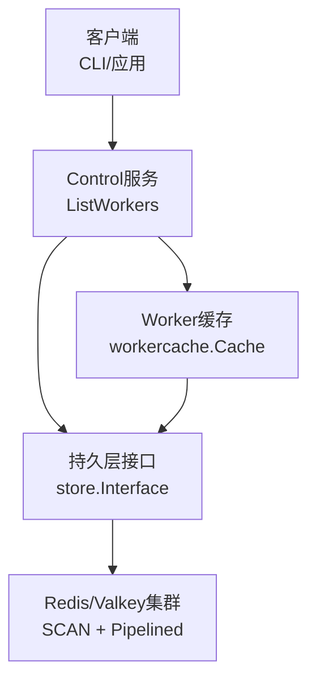
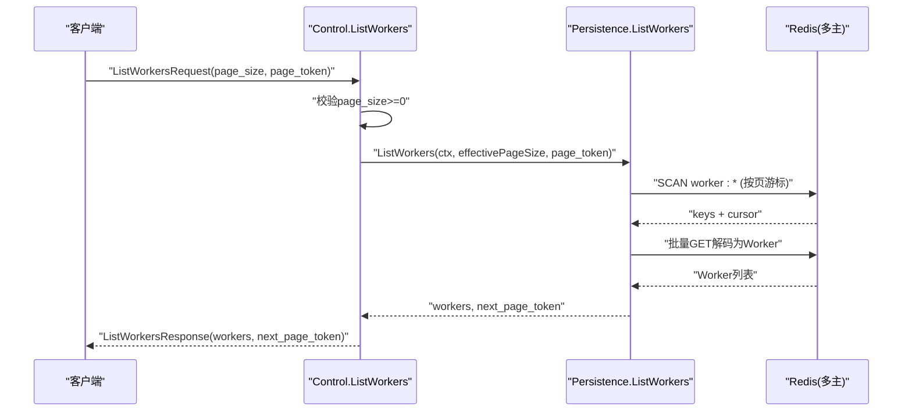
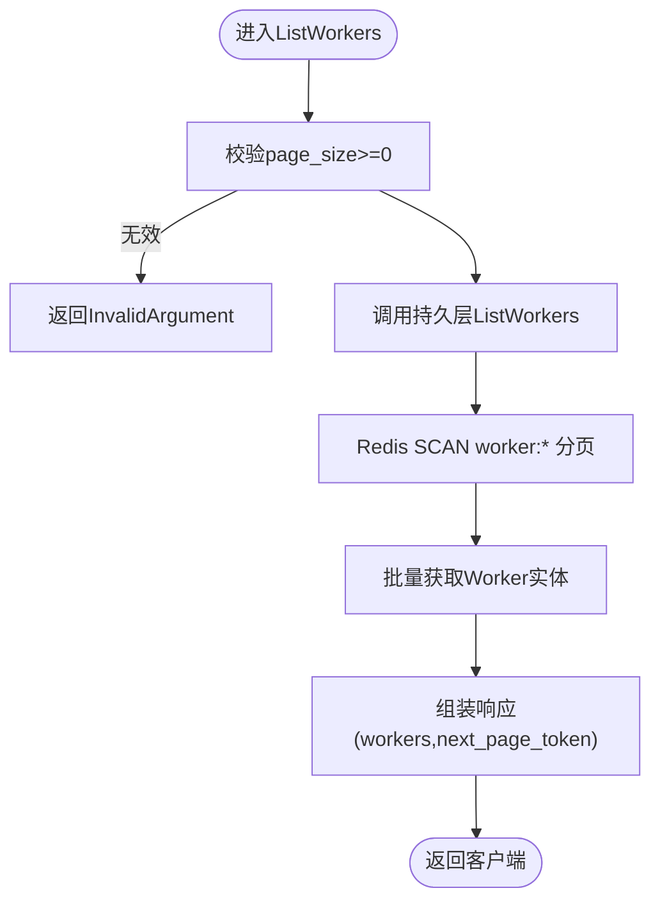
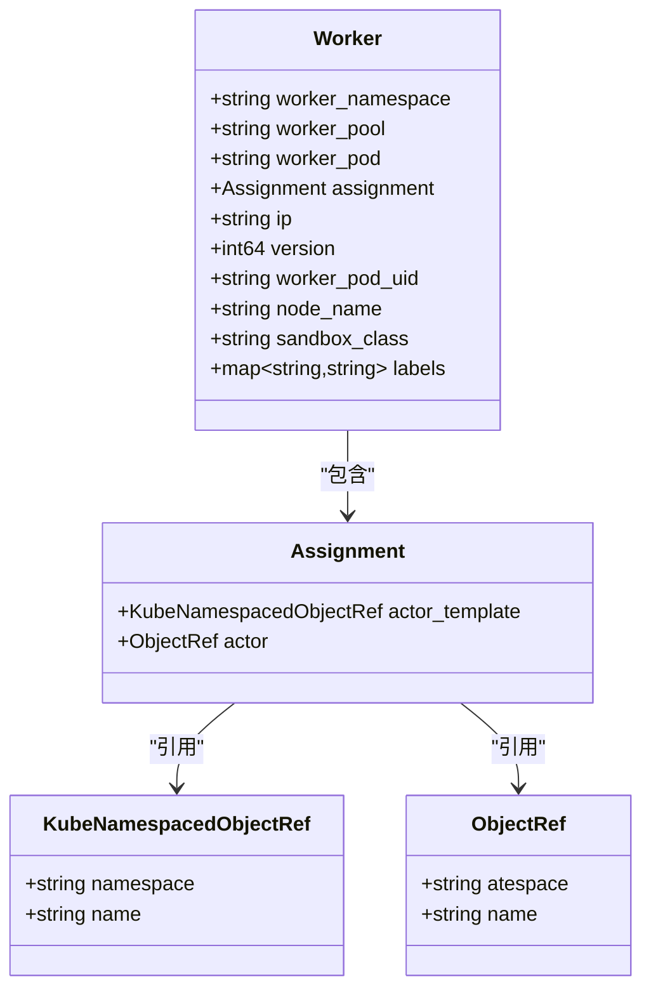
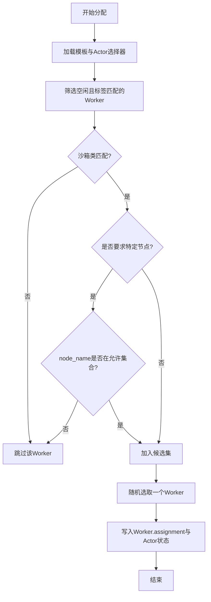
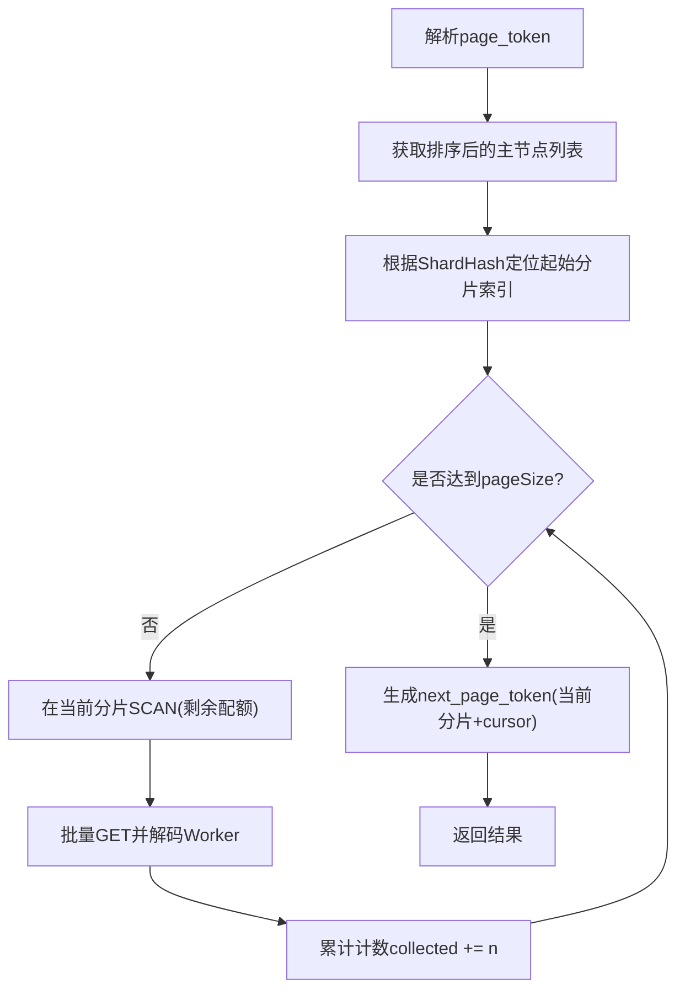
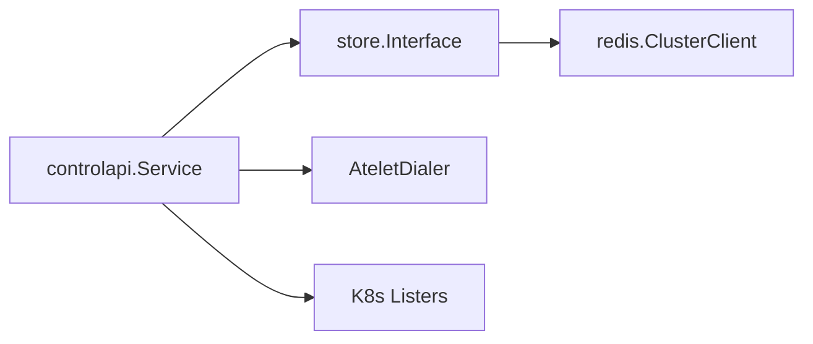
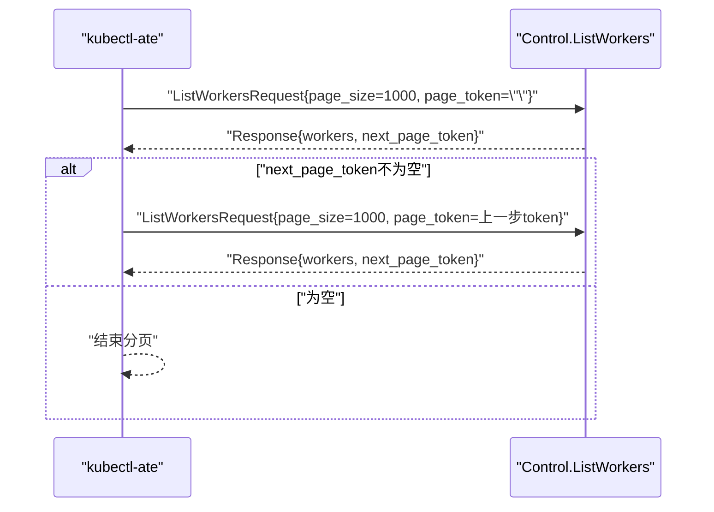

# Worker管理

<cite>
**本文引用的文件**   
- [ateapi.proto](file://pkg/proto/ateapipb/ateapi.proto)
- [list_workers.go](file://cmd/ateapi/internal/controlapi/list_workers.go)
- [service.go](file://cmd/ateapi/internal/controlapi/service.go)
- [workflow.go](file://cmd/ateapi/internal/controlapi/workflow.go)
- [workflow_resume.go](file://cmd/ateapi/internal/controlapi/workflow_resume.go)
- [ateredis.go](file://cmd/ateapi/internal/store/ateredis/ateredis.go)
- [store.go](file://cmd/ateapi/internal/store/store.go)
- [get_workers.go](file://cmd/kubectl-ate/internal/cmd/get_workers.go)
</cite>

## 目录
1. [简介](#简介)
2. [项目结构](#项目结构)
3. [核心组件](#核心组件)
4. [架构总览](#架构总览)
5. [详细组件分析](#详细组件分析)
6. [依赖关系分析](#依赖关系分析)
7. [性能与分页实现](#性能与分页实现)
8. [监控与资源使用最佳实践](#监控与资源使用最佳实践)
9. [gRPC客户端调用示例与调试技巧](#grpc客户端调用示例与调试技巧)
10. [故障排查指南](#故障排查指南)
11. [结论](#结论)

## 简介
本文件面向需要管理与查询Worker的开发者与运维人员，聚焦以下目标：
- 详细说明ListWorkers接口的功能、请求/响应结构与实现路径
- 给出Worker对象的完整字段定义（包含worker_namespace、worker_pool、worker_pod、Assignment、IP地址、版本信息等）
- 解释Worker分配机制与调度策略（含标签选择器、沙箱类匹配、节点亲和等）
- 阐述分页查询的实现细节与多分片Redis下的注意事项
- 提供Worker状态监控与资源使用查询的最佳实践
- 给出gRPC客户端调用示例与调试技巧

## 项目结构
与Worker管理相关的关键代码分布在如下模块：
- API协议定义：pkg/proto/ateapipb/ateapi.proto
- gRPC服务实现与控制面逻辑：cmd/ateapi/internal/controlapi/*
- 持久化存储（Redis/Valkey）：cmd/ateapi/internal/store/ateredis/ateredis.go
- 通用存储接口与事件订阅：cmd/ateapi/internal/store/store.go
- CLI客户端示例：cmd/kubectl-ate/internal/cmd/get_workers.go

图表来源
- [list_workers.go:27-40](file://cmd/ateapi/internal/controlapi/list_workers.go#L27-L40)
- [ateredis.go:586-702](file://cmd/ateapi/internal/store/ateredis/ateredis.go#L586-L702)
- [service.go:25-56](file://cmd/ateapi/internal/controlapi/service.go#L25-L56)

章节来源
- [service.go:25-56](file://cmd/ateapi/internal/controlapi/service.go#L25-L56)
- [list_workers.go:27-40](file://cmd/ateapi/internal/controlapi/list_workers.go#L27-L40)
- [ateredis.go:586-702](file://cmd/ateapi/internal/store/ateredis/ateredis.go#L586-L702)

## 核心组件
- ListWorkers RPC：控制面对外暴露的列表接口，负责参数校验、分页读取与结果返回。
- Worker对象：描述一个工作节点的元数据与当前分配情况。
- 分配与调度：在Actor恢复流程中完成，基于模板与Actor的选择器进行匹配，并考虑节点限制。
- 持久化与分页：基于Redis SCAN遍历键空间，跨主分片聚合，支持稳定分页游标。
- 事件订阅：通过Pub/Sub推送Worker变更事件，便于实时观察。

章节来源
- [ateapi.proto:263-324](file://pkg/proto/ateapipb/ateapi.proto#L263-L324)
- [list_workers.go:27-54](file://cmd/ateapi/internal/controlapi/list_workers.go#L27-L54)
- [workflow_resume.go:119-294](file://cmd/ateapi/internal/controlapi/workflow_resume.go#L119-L294)
- [ateredis.go:586-702](file://cmd/ateapi/internal/store/ateredis/ateredis.go#L586-L702)
- [store.go:129-154](file://cmd/ateapi/internal/store/store.go#L129-L154)

## 架构总览
ListWorkers从控制面进入，经持久层对Redis进行分页扫描，最终返回Worker页面与下一页令牌。

图表来源
- [list_workers.go:27-40](file://cmd/ateapi/internal/controlapi/list_workers.go#L27-L40)
- [ateredis.go:586-702](file://cmd/ateapi/internal/store/ateredis/ateredis.go#L586-L702)

## 详细组件分析

### ListWorkers接口
- 功能：分页列出所有Worker，支持page_size与page_token；当page_size未指定或过大时由服务端规范化。
- 参数校验：拒绝负数page_size，返回InvalidArgument错误。
- 数据源：调用持久层的ListWorkers，内部基于Redis SCAN与批量获取。
- 返回值：Worker数组与next_page_token（空表示最后一页）。

图表来源
- [list_workers.go:27-54](file://cmd/ateapi/internal/controlapi/list_workers.go#L27-L54)
- [ateredis.go:586-702](file://cmd/ateapi/internal/store/ateredis/ateredis.go#L586-L702)

章节来源
- [list_workers.go:27-54](file://cmd/ateapi/internal/controlapi/list_workers.go#L27-L54)
- [ateredis.go:586-702](file://cmd/ateapi/internal/store/ateredis/ateredis.go#L586-L702)

### Worker对象模型
- 关键字段
  - worker_namespace：Worker所在命名空间
  - worker_pool：所属WorkerPool名称
  - worker_pod：Worker Pod名称
  - assignment：当前分配的Actor信息（可为空）
  - ip：Worker Pod IP
  - version：版本号（乐观锁）
  - worker_pod_uid：Pod UID
  - node_name：节点名（用于亲和/快照位置约束）
  - sandbox_class：沙箱类型（如gvisor/microvm）
  - labels：标签映射（用于选择器匹配）
- Assignment
  - actor_template：KubeNamespacedObjectRef（namespace,name）
  - actor：ObjectRef（atespace,name）

图表来源
- [ateapi.proto:306-329](file://pkg/proto/ateapipb/ateapi.proto#L306-L329)

章节来源
- [ateapi.proto:306-329](file://pkg/proto/ateapipb/ateapi.proto#L306-L329)

### Worker分配机制与调度策略
- 触发时机：在Actor恢复流程中执行AssignWorkerStep。
- 候选过滤
  - 仅考虑空闲Worker（assignment为空）
  - 标签选择器匹配：同时满足模板选择器与Actor选择器
  - 沙箱类一致：Worker.sandbox_class必须等于模板的沙箱类
  - 节点限制：若存在本地快照节点集合，则优先选择匹配的node_name
- 选择策略：在候选集中随机打乱后取第一个，避免热点
- 幂等与回滚
  - 若发现历史残留的“已分配但不可用”的Worker，会尝试释放其assignment
  - 更新Worker与Actor状态时使用乐观锁version，冲突自动重试

图表来源
- [workflow_resume.go:119-294](file://cmd/ateapi/internal/controlapi/workflow_resume.go#L119-L294)

章节来源
- [workflow_resume.go:119-294](file://cmd/ateapi/internal/controlapi/workflow_resume.go#L119-L294)

### 分页查询实现细节与多分片一致性
- 分页令牌结构：包含起始分片哈希与当前SCAN游标
- 分片顺序：对所有Redis主节点地址排序，保证遍历顺序稳定
- 跨分片聚合：按页大小累计，直到达到pageSize或遍历完所有分片
- 边界处理：当某分片cursor归零时移动到下一个分片；若仍在分片内，记录下一分片与游标作为next_page_token
- 拓扑变化保护：若next_page_token指向的分片不存在，视为拓扑变化并报错

图表来源
- [ateredis.go:602-702](file://cmd/ateapi/internal/store/ateredis/ateredis.go#L602-L702)

章节来源
- [ateredis.go:602-702](file://cmd/ateapi/internal/store/ateredis/ateredis.go#L602-L702)

### 事件订阅与实时观察
- 发布通道：worker-changes
- 事件类型：创建、更新、删除
- 订阅方式：WatchWorkers返回事件通道，关闭时释放订阅
- 典型用途：构建实时监控面板、告警与审计

章节来源
- [ateredis.go:238-297](file://cmd/ateapi/internal/store/ateredis/ateredis.go#L238-L297)
- [store.go:129-154](file://cmd/ateapi/internal/store/store.go#L129-L154)

## 依赖关系分析
- Service依赖持久层接口与Dialer、Listers等，ListWorkers直接委托给Persistence
- Persistence基于Redis ClusterClient，封装了SCAN、Pipelined、事务与Pub/Sub
- 分配逻辑位于控制面工作流中，依赖缓存与持久层

图表来源
- [service.go:25-56](file://cmd/ateapi/internal/controlapi/service.go#L25-L56)
- [ateredis.go:76-88](file://cmd/ateapi/internal/store/ateredis/ateredis.go#L76-L88)

章节来源
- [service.go:25-56](file://cmd/ateapi/internal/controlapi/service.go#L25-L56)
- [ateredis.go:76-88](file://cmd/ateapi/internal/store/ateredis/ateredis.go#L76-L88)

## 性能与分页实现
- 分页大小建议：默认值由服务端决定，超过上限会被规范化；合理设置可平衡吞吐与延迟
- 多分片扫描：按固定顺序遍历主分片，减少重复与遗漏风险
- 批量获取：使用Pipelined批量GET，降低网络往返
- 内存与序列化：Worker以protojson存储，注意大对象时的序列化开销
- 并发与锁：更新操作采用乐观锁version，配合指数退避重试

章节来源
- [ateredis.go:586-702](file://cmd/ateapi/internal/store/ateredis/ateredis.go#L586-L702)
- [workflow.go:110-129](file://cmd/ateapi/internal/controlapi/workflow.go#L110-L129)

## 监控与资源使用最佳实践
- 使用WatchWorkers监听Worker变更，构建实时看板
- 结合Labels与NodeName进行分组统计，识别热点节点与闲置池
- 关注Version字段变化，判断最近一次更新
- 将NextPageToken持久化以便断点续查
- 对频繁调用的ListWorkers做客户端侧缓存与去抖

章节来源
- [ateredis.go:238-297](file://cmd/ateapi/internal/store/ateredis/ateredis.go#L238-L297)
- [store.go:129-154](file://cmd/ateapi/internal/store/store.go#L129-L154)

## gRPC客户端调用示例与调试技巧
- 基本调用模式：循环调用ListWorkers，携带上一页返回的next_page_token，直至为空
- 参考实现：kubectl-ate的get workers命令展示了标准分页循环

图表来源
- [get_workers.go:31-57](file://cmd/kubectl-ate/internal/cmd/get_workers.go#L31-L57)

章节来源
- [get_workers.go:31-57](file://cmd/kubectl-ate/internal/cmd/get_workers.go#L31-L57)

调试技巧
- 打印NextPageToken与每页数量，确认分页连续性
- 检查page_size是否为非负数，避免InvalidArgument
- 在分布式环境下，若出现“拓扑变化”错误，应重置分页并从第一页重新开始
- 结合WatchWorkers验证变更是否及时送达

## 故障排查指南
- InvalidArgument：page_size为负数
- 拓扑变化：next_page_token对应的分片不存在，需从头分页
- 分配失败：无可用Worker或选择器不匹配，检查标签、沙箱类与节点限制
- 版本冲突：UpdateWorker/UpdateActor因version不一致导致重试，关注重试次数与退避

章节来源
- [list_workers.go:42-54](file://cmd/ateapi/internal/controlapi/list_workers.go#L42-L54)
- [ateredis.go:724-734](file://cmd/ateapi/internal/store/ateredis/ateredis.go#L724-L734)
- [workflow_resume.go:254-261](file://cmd/ateapi/internal/controlapi/workflow_resume.go#L254-L261)

## 结论
ListWorkers提供了高效、可扩展的Worker管理能力，配合稳定的分页与事件订阅，可满足大规模集群的查询与监控需求。在分配与调度方面，系统通过严格的标签与沙箱类匹配、节点亲和以及乐观锁保障正确性与幂等性。建议在生产环境中结合WatchWorkers与合理的分页策略，构建健壮的监控与排障体系。
