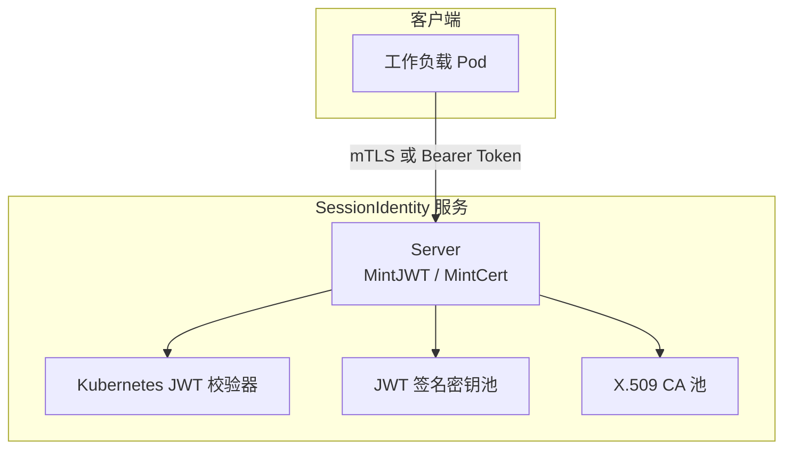
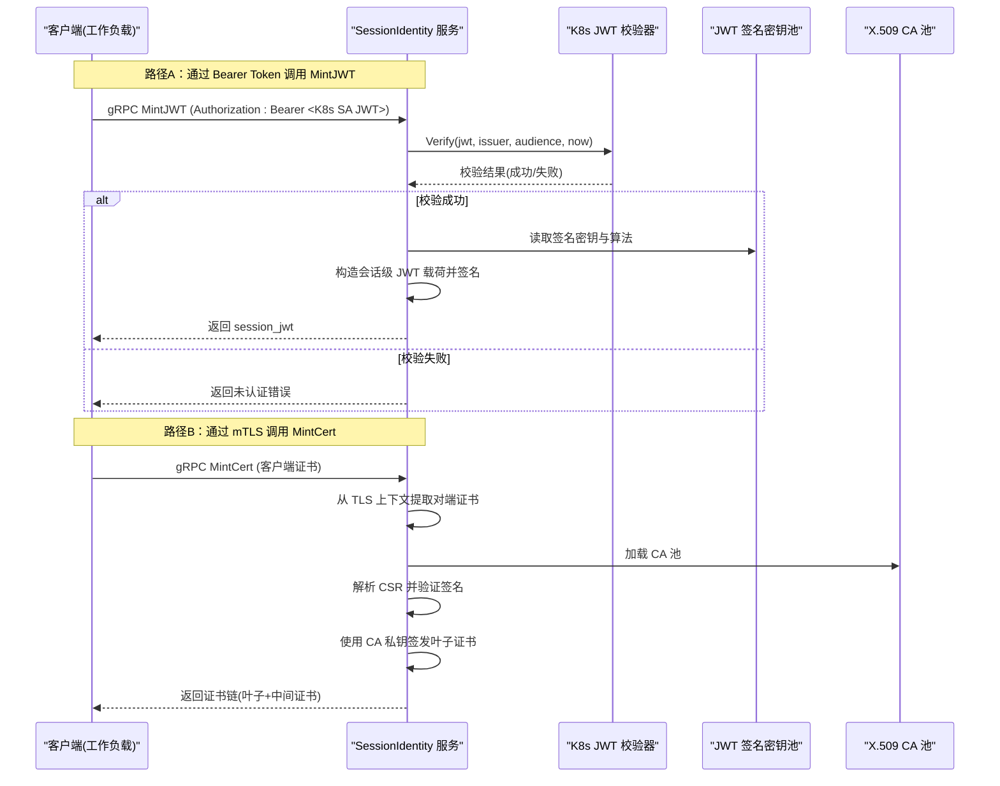
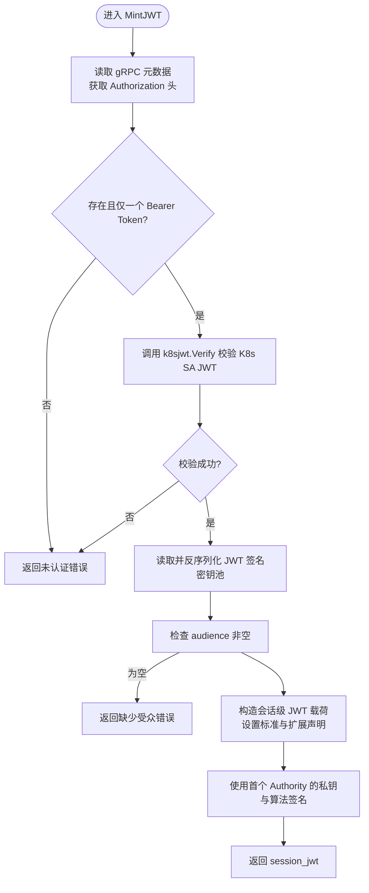
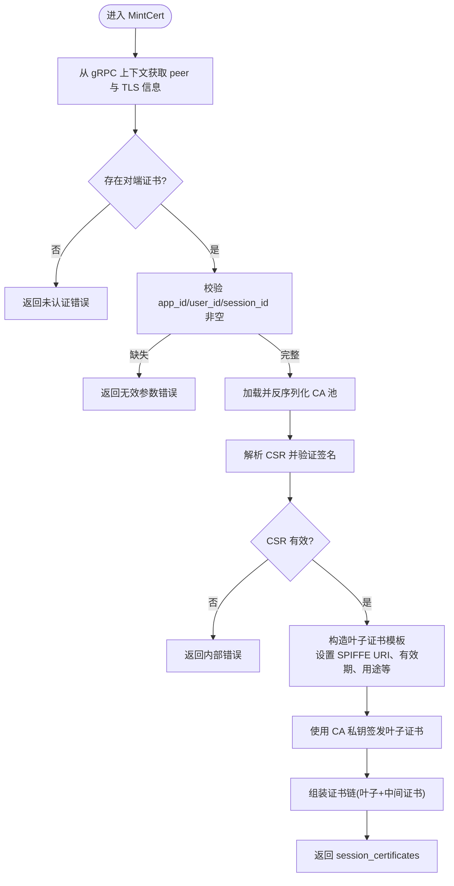
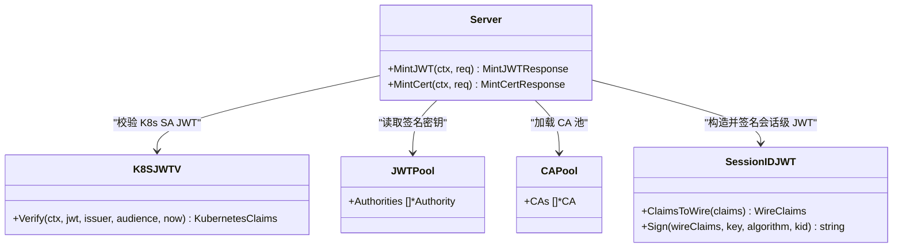

# 会话身份认证

<cite>
**本文引用的文件列表**
- [ateapi.proto](file://pkg/proto/ateapipb/ateapi.proto)
- [sessionidentity.go](file://cmd/ateapi/internal/sessionidentity/sessionidentity.go)
- [sessionidjwt.go](file://cmd/ateapi/internal/sessionidjwt/sessionidjwt.go)
- [k8sjwt.go](file://cmd/ateapi/internal/k8sjwt/k8sjwt.go)
- [localca.go](file://internal/localca/localca.go)
- [localjwtauthority.go](file://internal/localjwtauthority/localjwtauthority.go)
</cite>

## 目录
1. [简介](#简介)
2. [项目结构](#项目结构)
3. [核心组件](#核心组件)
4. [架构总览](#架构总览)
5. [详细组件分析](#详细组件分析)
6. [依赖关系分析](#依赖关系分析)
7. [性能与可扩展性](#性能与可扩展性)
8. [故障排查指南](#故障排查指南)
9. [结论](#结论)
10. [附录：API 定义与安全最佳实践](#附录api-定义与安全最佳实践)

## 简介
本文件面向需要集成“会话身份认证”的开发者，聚焦 SessionIdentity 服务的两个核心接口：MintJWT 与 MintCert。文档将详细说明：
- 会话级凭证（Session-level）与基础设施级凭证（Infrastructure-level）的区别与迁移机制
- MintJWTRequest 与 MintCertRequest 的请求参数定义（包含 app_id、user_id、session_id 等）
- JWT 令牌结构与 OIDC 兼容性
- mTLS 证书颁发流程与 X.509 证书链生成
- 完整的认证流程示例与集成指南
- 安全考虑与最佳实践建议

## 项目结构
与本次文档相关的代码主要分布在以下位置：
- API 协议定义：pkg/proto/ateapipb/ateapi.proto
- 服务实现：cmd/ateapi/internal/sessionidentity/sessionidentity.go
- JWT 签发与载荷构建：cmd/ateapi/internal/sessionidjwt/sessionidjwt.go
- Kubernetes JWT 校验：cmd/ateapi/internal/k8sjwt/k8sjwt.go
- 本地 CA 池（用于证书签发）：internal/localca/localca.go
- 本地 JWT 签名密钥池：internal/localjwtauthority/localjwtauthority.go

图表来源
- [sessionidentity.go:70-142](file://cmd/ateapi/internal/sessionidentity/sessionidentity.go#L70-L142)
- [sessionidentity.go:144-225](file://cmd/ateapi/internal/sessionidentity/sessionidentity.go#L144-L225)
- [k8sjwt.go:118-261](file://cmd/ateapi/internal/k8sjwt/k8sjwt.go#L118-L261)
- [localca.go:83-120](file://internal/localca/localca.go#L83-L120)
- [localjwtauthority.go:76-101](file://internal/localjwtauthority/localjwtauthority.go#L76-L101)

章节来源
- [ateapi.proto:342-416](file://pkg/proto/ateapipb/ateapi.proto#L342-L416)
- [sessionidentity.go:43-69](file://cmd/ateapi/internal/sessionidentity/sessionidentity.go#L43-L69)

## 核心组件
- SessionIdentity 服务
  - 提供两个 RPC：MintJWT 与 MintCert
  - 支持两种认证方式：
    - Bearer Token：使用 Kubernetes 绑定服务账号 JWT 进行鉴权
    - mTLS：使用客户端证书进行鉴权
- JWT 签发模块
  - 负责构造会话级 JWT 载荷并签名
  - 从本地 JWT 签名密钥池中读取私钥与算法信息
- mTLS 证书签发模块
  - 解析 CSR，提取公钥
  - 使用本地 CA 池签发叶子证书，并返回完整证书链（叶子到根顺序）
- Kubernetes JWT 校验器
  - 基于 OIDC Discovery + JWKS 验证 K8s 绑定服务账号 JWT
  - 校验 issuer、audience、时间窗口等

章节来源
- [sessionidentity.go:70-142](file://cmd/ateapi/internal/sessionidentity/sessionidentity.go#L70-L142)
- [sessionidentity.go:144-225](file://cmd/ateapi/internal/sessionidentity/sessionidentity.go#L144-L225)
- [sessionidjwt.go:76-164](file://cmd/ateapi/internal/sessionidjwt/sessionidjwt.go#L76-L164)
- [k8sjwt.go:118-261](file://cmd/ateapi/internal/k8sjwt/k8sjwt.go#L118-L261)
- [localca.go:83-120](file://internal/localca/localca.go#L83-L120)
- [localjwtauthority.go:76-101](file://internal/localjwtauthority/localjwtauthority.go#L76-L101)

## 架构总览
下图展示了从客户端发起请求到服务端完成认证与签发的整体流程，包括两种认证路径（Bearer Token 与 mTLS）。

图表来源
- [sessionidentity.go:70-142](file://cmd/ateapi/internal/sessionidentity/sessionidentity.go#L70-L142)
- [sessionidentity.go:144-225](file://cmd/ateapi/internal/sessionidentity/sessionidentity.go#L144-L225)
- [k8sjwt.go:118-261](file://cmd/ateapi/internal/k8sjwt/k8sjwt.go#L118-L261)
- [localca.go:83-120](file://internal/localca/localca.go#L83-L120)
- [localjwtauthority.go:76-101](file://internal/localjwtauthority/localjwtauthority.go#L76-L101)

## 详细组件分析

### 接口定义与请求参数
- 服务名与方法
  - Service: ateapi.SessionIdentity
  - Methods: MintJWT(MintJWTRequest) -> MintJWTResponse；MintCert(MintCertRequest) -> MintCertResponse
- MintJWTRequest
  - audience: 字符串数组，至少一个目标受众
  - app_id: 应用标识
  - user_id: 用户标识
  - session_id: 会话标识
- MintCertRequest
  - app_id: 应用标识
  - user_id: 用户标识
  - session_id: 会话标识
  - certificate_signing_request: DER 编码的 X.509 CSR 字节串

章节来源
- [ateapi.proto:370-416](file://pkg/proto/ateapipb/ateapi.proto#L370-L416)

### MintJWT 流程与 JWT 结构
- 认证方式
  - 要求请求头 Authorization: Bearer <Kubernetes 绑定服务账号 JWT>
  - 服务端使用 k8sjwt.Verify 进行 OIDC Discovery + JWKS 校验，检查 issuer、audience、时间窗口等
- 签发逻辑
  - 从本地 JWT 签名密钥池读取第一个 Authority 的私钥与算法
  - 构造会话级 JWT 载荷，包含标准声明与扩展声明
  - 使用所选算法与私钥签名，返回 session_jwt
- JWT 结构与 OIDC 兼容性
  - iss: 发行者 URL（OIDC Discovery 兼容）
  - sub: 主体，格式为 apps/{app_id}/users/{user_id}/sessions/{session_id}
  - aud: 目标受众（来自请求）
  - nbf/exp/iat/jti: 标准时间戳与唯一 ID
  - ate.dev: 扩展对象，包含 appID、userID、sessionID
  - 注意：当前实现中子体前缀为 apps/...，而注释描述为 app/...，请以实际实现为准

图表来源
- [sessionidentity.go:70-142](file://cmd/ateapi/internal/sessionidentity/sessionidentity.go#L70-L142)
- [sessionidjwt.go:76-164](file://cmd/ateapi/internal/sessionidjwt/sessionidjwt.go#L76-L164)
- [k8sjwt.go:118-261](file://cmd/ateapi/internal/k8sjwt/k8sjwt.go#L118-L261)

章节来源
- [sessionidentity.go:70-142](file://cmd/ateapi/internal/sessionidentity/sessionidentity.go#L70-L142)
- [sessionidjwt.go:30-98](file://cmd/ateapi/internal/sessionidjwt/sessionidjwt.go#L30-L98)
- [k8sjwt.go:118-261](file://cmd/ateapi/internal/k8sjwt/k8sjwt.go#L118-L261)

### MintCert 流程与证书链生成
- 认证方式
  - 必须使用 mTLS 客户端证书进行鉴权
  - 服务端从 gRPC peer 的 TLSInfo 中提取对端证书
- 签发逻辑
  - 校验 app_id、user_id、session_id 必填
  - 加载本地 CA 池，解析 CSR 并验证其签名
  - 构造叶子证书模板，包含 SPIFFE URI、有效期、用途等
  - 使用 CA 私钥签发叶子证书，并附加中间证书，按“叶子到根”顺序返回
- 证书链
  - 响应中的 session_certificates 列表：第一项为叶子证书，后续为中间证书

图表来源
- [sessionidentity.go:144-225](file://cmd/ateapi/internal/sessionidentity/sessionidentity.go#L144-L225)
- [localca.go:83-120](file://internal/localca/localca.go#L83-L120)

章节来源
- [sessionidentity.go:144-225](file://cmd/ateapi/internal/sessionidentity/sessionidentity.go#L144-L225)
- [localca.go:83-120](file://internal/localca/localca.go#L83-L120)

### 会话级凭证 vs 基础设施级凭证与迁移机制
- 基础设施级凭证
  - 例如 Kubernetes 绑定服务账号 JWT 或 Pod 证书，代表运行在特定节点上的工作负载身份
  - 生命周期与物理 Worker/Pod 绑定，随调度迁移而变化
- 会话级凭证
  - 由 SessionIdentity 服务签发，代表 Substrate 会话的稳定身份
  - 与会话生命周期一致，跨 Worker 迁移保持不变
- 迁移机制
  - 工作负载以基础设施级凭证向 SessionIdentity 服务申请会话级凭证（JWT 或证书）
  - 服务校验基础设施级凭证与请求的会话映射后，签发会话级凭证
  - 下游服务信任会话级凭证，从而屏蔽底层 Worker 迁移带来的身份变化

章节来源
- [ateapi.proto:342-368](file://pkg/proto/ateapipb/ateapi.proto#L342-L368)
- [sessionidentity.go:70-142](file://cmd/ateapi/internal/sessionidentity/sessionidentity.go#L70-L142)
- [sessionidentity.go:144-225](file://cmd/ateapi/internal/sessionidentity/sessionidentity.go#L144-L225)

## 依赖关系分析
- SessionIdentity 服务依赖
  - k8sjwt：用于校验 Kubernetes 绑定服务账号 JWT
  - localjwtauthority：用于加载 JWT 签名密钥池
  - localca：用于加载 CA 池并签发 X.509 证书
  - sessionidjwt：用于构造与签名会话级 JWT 载荷

图表来源
- [sessionidentity.go:70-142](file://cmd/ateapi/internal/sessionidentity/sessionidentity.go#L70-L142)
- [sessionidentity.go:144-225](file://cmd/ateapi/internal/sessionidentity/sessionidentity.go#L144-L225)
- [k8sjwt.go:118-261](file://cmd/ateapi/internal/k8sjwt/k8sjwt.go#L118-L261)
- [localjwtauthority.go:76-101](file://internal/localjwtauthority/localjwtauthority.go#L76-L101)
- [localca.go:83-120](file://internal/localca/localca.go#L83-L120)
- [sessionidjwt.go:76-164](file://cmd/ateapi/internal/sessionidjwt/sessionidjwt.go#L76-L164)

章节来源
- [sessionidentity.go:43-69](file://cmd/ateapi/internal/sessionidentity/sessionidentity.go#L43-L69)

## 性能与可扩展性
- 密钥与证书池缓存
  - 当前实现每次请求都从文件读取密钥池与 CA 池，存在 I/O 开销
  - 建议在内存中缓存并定期刷新，减少磁盘访问
- 并发与锁
  - 多实例部署时，需确保密钥池与 CA 池的一致性，避免并发写入冲突
- 证书链长度
  - 返回的证书链包含叶子与中间证书，客户端应正确构建信任链
- 时间窗口
  - JWT 与证书的有效期较短，适合高频轮换，降低泄露风险

[本节为通用指导，不直接分析具体文件]

## 故障排查指南
- 未认证错误
  - MintJWT：缺少或多余的 Authorization 头、K8s SA JWT 校验失败（issuer/audience/时间窗口不符）
  - MintCert：未提供 mTLS 客户端证书或对端证书为空
- 参数错误
  - MintJWT：未指定 audience
  - MintCert：app_id/user_id/session_id 缺失
- 内部错误
  - 无法读取或反序列化 JWT 签名密钥池或 CA 池
  - CSR 解析或签名验证失败
  - 证书签发失败

章节来源
- [sessionidentity.go:70-142](file://cmd/ateapi/internal/sessionidentity/sessionidentity.go#L70-L142)
- [sessionidentity.go:144-225](file://cmd/ateapi/internal/sessionidentity/sessionidentity.go#L144-L225)

## 结论
SessionIdentity 服务通过两种认证路径（Bearer Token 与 mTLS）将基础设施级凭证转换为稳定的会话级凭证，从而实现跨 Worker 迁移的身份一致性。JWT 与 X.509 证书均具备短生命周期与严格的校验策略，有助于提升系统安全性。建议在生产环境中引入密钥与证书池的内存缓存、完善的监控与审计，以及最小权限原则的受众绑定。

[本节为总结，不直接分析具体文件]

## 附录：API 定义与安全最佳实践

### API 定义摘要
- 服务：ateapi.SessionIdentity
- 方法：
  - MintJWT(MintJWTRequest) -> MintJWTResponse
  - MintCert(MintCertRequest) -> MintCertResponse
- 请求字段：
  - MintJWTRequest：audience[], app_id, user_id, session_id
  - MintCertRequest：app_id, user_id, session_id, certificate_signing_request(DER)
- 响应字段：
  - MintJWTResponse：session_jwt
  - MintCertResponse：session_certificates[]（DER 编码，叶子在前，随后为中间证书）

章节来源
- [ateapi.proto:370-416](file://pkg/proto/ateapipb/ateapi.proto#L370-L416)

### JWT 结构与 OIDC 兼容性
- 标准声明：iss、sub、aud、nbf、exp、iat、jti
- 扩展声明：ate.dev.appID、ate.dev.userID、ate.dev.sessionID
- 兼容性：
  - iss 为 OIDC Discovery 兼容 URL
  - 支持 RS256/RS384/RS512 与 ES256 算法（依据实现）
- 注意：
  - 当前实现中 sub 前缀为 apps/...，与注释描述的 app/... 不一致，应以实现为准

章节来源
- [sessionidentity.go:112-141](file://cmd/ateapi/internal/sessionidentity/sessionidentity.go#L112-L141)
- [sessionidjwt.go:30-98](file://cmd/ateapi/internal/sessionidjwt/sessionidjwt.go#L30-L98)

### mTLS 证书颁发与证书链
- 客户端生成 CSR（DER），并通过 mTLS 发送 MintCert 请求
- 服务端：
  - 校验对端证书
  - 解析 CSR 并验证签名
  - 使用 CA 私钥签发叶子证书，附带中间证书
  - 返回证书链（叶子到根顺序）

章节来源
- [sessionidentity.go:144-225](file://cmd/ateapi/internal/sessionidentity/sessionidentity.go#L144-L225)
- [localca.go:83-120](file://internal/localca/localca.go#L83-L120)

### 集成指南（步骤）
- 准备基础设施级凭证
  - 使用 Kubernetes 绑定服务账号 JWT（用于 MintJWT）
  - 或使用 Pod 证书作为 mTLS 客户端证书（用于 MintCert）
- 调用 MintJWT
  - 设置 Authorization: Bearer <K8s SA JWT>
  - 填写 audience、app_id、user_id、session_id
  - 接收并存储 session_jwt
- 调用 MintCert
  - 配置 mTLS 客户端证书
  - 生成 CSR（DER），填入 certificate_signing_request
  - 填写 app_id、user_id、session_id
  - 接收证书链并构建信任链
- 下游服务验证
  - JWT：根据 iss 发现 JWKS，校验签名与受众
  - 证书：使用返回的中间证书与受信任根构建链，验证证书用途与有效期

章节来源
- [sessionidentity.go:70-142](file://cmd/ateapi/internal/sessionidentity/sessionidentity.go#L70-L142)
- [sessionidentity.go:144-225](file://cmd/ateapi/internal/sessionidentity/sessionidentity.go#L144-L225)
- [k8sjwt.go:118-261](file://cmd/ateapi/internal/k8sjwt/k8sjwt.go#L118-L261)

### 安全考虑与最佳实践
- 最小受众绑定：仅在必要场景下发带受众绑定的 JWT
- 短生命周期：JWT 与证书有效期较短，频繁轮换
- 严格校验：校验 issuer、audience、时间窗口与证书用途
- 密钥保护：生产环境使用安全的密钥存储与轮换机制
- 日志与审计：记录关键操作与错误，便于追踪问题
- 网络隔离：限制 SessionIdentity 服务访问范围，仅允许可信工作负载调用

[本节为通用指导，不直接分析具体文件]
