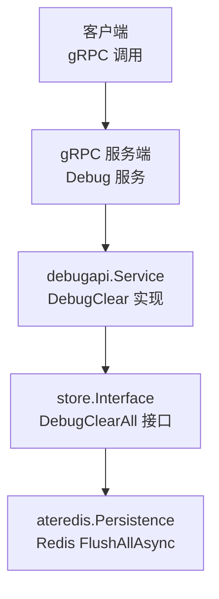
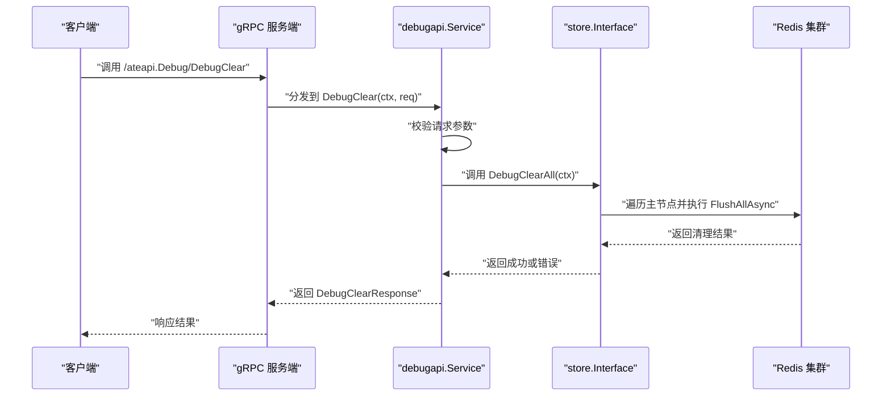
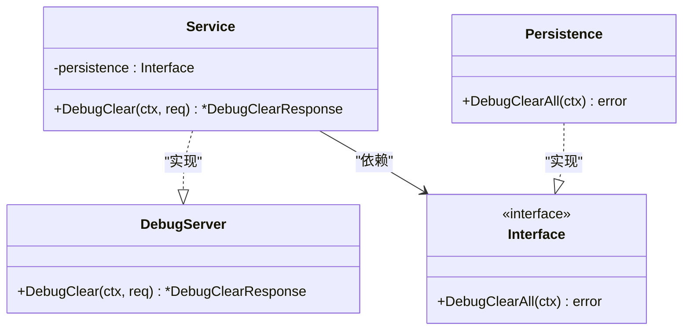
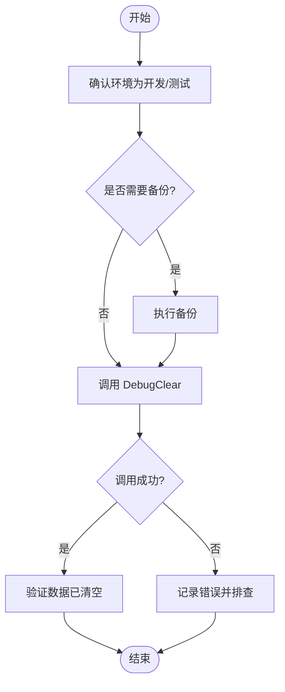

# 调试服务

<cite>
**本文引用的文件**
- [cmd/ateapi/internal/debugapi/service.go](file://cmd/ateapi/internal/debugapi/service.go)
- [cmd/ateapi/internal/debugapi/debug_clear.go](file://cmd/ateapi/internal/debugapi/debug_clear.go)
- [pkg/proto/ateapipb/ateapi.proto](file://pkg/proto/ateapipb/ateapi.proto)
- [pkg/proto/ateapipb/ateapi_grpc.pb.go](file://pkg/proto/ateapipb/ateapi_grpc.pb.go)
- [pkg/proto/ateapipb/ateapi.pb.go](file://pkg/proto/ateapipb/ateapi.pb.go)
- [cmd/ateapi/internal/store/store.go](file://cmd/ateapi/internal/store/store.go)
- [cmd/ateapi/internal/store/ateredis/ateredis.go](file://cmd/ateapi/internal/store/ateredis/ateredis.go)
- [cmd/kubectl-ate/internal/cmd/admin_debug_redis_flush.go](file://cmd/kubectl-ate/internal/cmd/admin_debug_redis_flush.go)
</cite>

## 目录
1. [简介](#简介)
2. [项目结构](#项目结构)
3. [核心组件](#核心组件)
4. [架构总览](#架构总览)
5. [详细组件分析](#详细组件分析)
6. [依赖关系分析](#依赖关系分析)
7. [性能与影响评估](#性能与影响评估)
8. [使用指南与安全警告](#使用指南与安全警告)
9. [故障排除建议](#故障排除建议)
10. [结论](#结论)

## 简介
本文件为“调试服务”的 API 文档，聚焦于 DebugClear 接口。该接口用于在开发与测试环境中快速清空持久化数据（当前实现为 Redis），以便进行可重复的测试或环境重置。生产环境严禁启用或暴露此能力。

## 项目结构
调试服务位于 ateapi 服务的内部模块中，通过 gRPC 对外暴露 Debug 服务，其中包含 DebugClear 方法。请求经 gRPC 路由到 debugapi.Service，再由其调用持久层接口的清理方法，最终由 Redis 后端执行全量数据清除。

图表来源
- [cmd/ateapi/internal/debugapi/service.go:22-36](file://cmd/ateapi/internal/debugapi/service.go#L22-L36)
- [cmd/ateapi/internal/debugapi/debug_clear.go:24-32](file://cmd/ateapi/internal/debugapi/debug_clear.go#L24-L32)
- [cmd/ateapi/internal/store/store.go:115-118](file://cmd/ateapi/internal/store/store.go#L115-L118)
- [cmd/ateapi/internal/store/ateredis/ateredis.go:299-311](file://cmd/ateapi/internal/store/ateredis/ateredis.go#L299-L311)

章节来源
- [cmd/ateapi/internal/debugapi/service.go:1-36](file://cmd/ateapi/internal/debugapi/service.go#L1-L36)
- [cmd/ateapi/internal/debugapi/debug_clear.go:1-37](file://cmd/ateapi/internal/debugapi/debug_clear.go#L1-L37)
- [pkg/proto/ateapipb/ateapi.proto:331-340](file://pkg/proto/ateapipb/ateapi.proto#L331-L340)
- [pkg/proto/ateapipb/ateapi_grpc.pb.go:625-688](file://pkg/proto/ateapipb/ateapi_grpc.pb.go#L625-L688)
- [cmd/ateapi/internal/store/store.go:115-118](file://cmd/ateapi/internal/store/store.go#L115-L118)
- [cmd/ateapi/internal/store/ateredis/ateredis.go:299-311](file://cmd/ateapi/internal/store/ateredis/ateredis.go#L299-L311)

## 核心组件
- gRPC 服务定义：Debug 服务及其 DebugClear 方法
- 消息类型：DebugClearRequest、DebugClearResponse
- 服务实现：debugapi.Service.DebugClear
- 持久层接口：store.Interface.DebugClearAll
- 后端实现：ateredis.Persistence.DebugClearAll（基于 Redis）

章节来源
- [pkg/proto/ateapipb/ateapi.proto:331-340](file://pkg/proto/ateapipb/ateapi.proto#L331-L340)
- [pkg/proto/ateapipb/ateapi_grpc.pb.go:625-688](file://pkg/proto/ateapipb/ateapi_grpc.pb.go#L625-L688)
- [cmd/ateapi/internal/debugapi/service.go:22-36](file://cmd/ateapi/internal/debugapi/service.go#L22-L36)
- [cmd/ateapi/internal/debugapi/debug_clear.go:24-32](file://cmd/ateapi/internal/debugapi/debug_clear.go#L24-L32)
- [cmd/ateapi/internal/store/store.go:115-118](file://cmd/ateapi/internal/store/store.go#L115-L118)
- [cmd/ateapi/internal/store/ateredis/ateredis.go:299-311](file://cmd/ateapi/internal/store/ateredis/ateredis.go#L299-L311)

## 架构总览
下图展示了从客户端发起 gRPC 调用到 Redis 执行全量清理的完整链路。

图表来源
- [pkg/proto/ateapipb/ateapi_grpc.pb.go:625-688](file://pkg/proto/ateapipb/ateapi_grpc.pb.go#L625-L688)
- [cmd/ateapi/internal/debugapi/debug_clear.go:24-32](file://cmd/ateapi/internal/debugapi/debug_clear.go#L24-L32)
- [cmd/ateapi/internal/store/store.go:115-118](file://cmd/ateapi/internal/store/store.go#L115-L118)
- [cmd/ateapi/internal/store/ateredis/ateredis.go:299-311](file://cmd/ateapi/internal/store/ateredis/ateredis.go#L299-L311)

## 详细组件分析

### Debug 服务与 gRPC 接口
- 服务名与方法
  - 服务：Debug
  - 方法：DebugClear(DebugClearRequest) returns (DebugClearResponse)
- 语义说明
  - 用于调试目的，清空 ate 数据库中的所有数据（当前实现为 Redis）。
- 生成代码位置
  - gRPC 客户端与服务端接口定义位于生成的 Go 文件中。

章节来源
- [pkg/proto/ateapipb/ateapi.proto:331-340](file://pkg/proto/ateapipb/ateapi.proto#L331-L340)
- [pkg/proto/ateapipb/ateapi_grpc.pb.go:625-688](file://pkg/proto/ateapipb/ateapi_grpc.pb.go#L625-L688)

### 消息结构定义
- DebugClearRequest
  - 空消息，不包含字段。
- DebugClearResponse
  - 空消息，不包含字段。

章节来源
- [pkg/proto/ateapipb/ateapi.proto:338-340](file://pkg/proto/ateapipb/ateapi.proto#L338-L340)
- [pkg/proto/ateapipb/ateapi.pb.go:1875-1915](file://pkg/proto/ateapipb/ateapi.pb.go#L1875-L1915)

### 服务实现：debugapi.Service.DebugClear
- 处理流程
  - 校验请求参数（当前为空对象，无需额外校验）
  - 调用持久层接口 s.persistence.DebugClearAll(ctx)
  - 若失败则包装错误返回；否则返回空的 DebugClearResponse
- 设计要点
  - 将“是否允许清理”的控制点放在上层（例如启动开关、鉴权拦截器），此处仅负责转发与错误包装。

章节来源
- [cmd/ateapi/internal/debugapi/debug_clear.go:24-32](file://cmd/ateapi/internal/debugapi/debug_clear.go#L24-L32)
- [cmd/ateapi/internal/debugapi/service.go:22-36](file://cmd/ateapi/internal/debugapi/service.go#L22-L36)

### 持久层接口：store.Interface.DebugClearAll
- 职责
  - 提供统一的“清空所有数据”能力，便于在不同存储后端切换时保持上层一致。
- 适用场景
  - 开发/测试环境的快速重置。

章节来源
- [cmd/ateapi/internal/store/store.go:115-118](file://cmd/ateapi/internal/store/store.go#L115-L118)

### 后端实现：ateredis.Persistence.DebugClearAll
- 行为
  - 遍历 Redis 集群的所有主节点，对每个主节点执行异步全量清理命令。
- 影响范围
  - 会清空该 Redis 实例上的全部键值，包括 Actor、Atespace、Worker 等所有资源状态。
- 注意事项
  - 属于破坏性操作，不可恢复。
  - 在集群模式下会对多个分片依次执行，耗时取决于数据规模与网络状况。

章节来源
- [cmd/ateapi/internal/store/ateredis/ateredis.go:299-311](file://cmd/ateapi/internal/store/ateredis/ateredis.go#L299-L311)

### 管理工具集成示例
- kubectl-ate 提供了便捷的管理子命令，直接调用 DebugClear 以清空 Redis。
- 典型用法
  - 通过命令行工具连接 ate-api-server，发送 DebugClear 请求，成功后输出提示。

章节来源
- [cmd/kubectl-ate/internal/cmd/admin_debug_redis_flush.go:25-48](file://cmd/kubectl-ate/internal/cmd/admin_debug_redis_flush.go#L25-L48)

## 依赖关系分析
- 组件耦合
  - debugapi.Service 依赖 store.Interface，屏蔽了具体存储实现差异。
  - ateredis.Persistence 实现了 store.Interface，直接操作 Redis。
- 外部依赖
  - gRPC 运行时（客户端/服务端）
  - Redis 集群客户端库
- 潜在风险
  - 若未做访问控制，任何能访问 gRPC 端点的客户端均可触发全量清理。

图表来源
- [pkg/proto/ateapipb/ateapi_grpc.pb.go:658-688](file://pkg/proto/ateapipb/ateapi_grpc.pb.go#L658-L688)
- [cmd/ateapi/internal/debugapi/service.go:22-36](file://cmd/ateapi/internal/debugapi/service.go#L22-L36)
- [cmd/ateapi/internal/store/store.go:115-118](file://cmd/ateapi/internal/store/store.go#L115-L118)
- [cmd/ateapi/internal/store/ateredis/ateredis.go:299-311](file://cmd/ateapi/internal/store/ateredis/ateredis.go#L299-L311)

## 性能与影响评估
- 时间复杂度
  - 取决于 Redis 数据总量与集群规模，FlushAllAsync 会在每个主节点上执行，整体耗时近似 O(N)（N 为键数量）。
- 资源占用
  - 清理期间可能引起 Redis CPU 与内存抖动，影响正常读写延迟。
- 并发影响
  - 清理过程中其他请求可能读到空数据或遇到临时错误，需在上层做好重试与降级策略。
- 幂等性
  - 多次调用是幂等的（再次清空无副作用），但每次都会产生开销。

[本节为通用性能讨论，不直接分析具体文件]

## 使用指南与安全警告

### 环境与限制
- 仅限开发与测试环境使用。
- 生产环境必须禁用或严格隔离该服务，避免被意外调用。

### 安全要求
- 访问控制
  - 强烈建议仅在受控网络内暴露该 gRPC 端口，并结合 mTLS、IP 白名单、RBAC 等手段限制访问。
- 最小权限
  - 仅授权给可信的管理员账号或服务账户。
- 审计与告警
  - 记录所有 DebugClear 调用日志，设置告警阈值，防止误用或滥用。

### 操作流程（概念性）
- 准备阶段
  - 确认目标环境为开发/测试。
  - 确保已备份必要数据（如需）。
- 执行阶段
  - 通过 gRPC 客户端或管理工具调用 DebugClear。
  - 等待响应并检查错误码。
- 验证阶段
  - 确认关键资源已被清空，必要时重新初始化初始数据。

[本图为概念流程图，不映射具体源码文件]

### 实际使用示例（路径指引）
- 通过 gRPC 客户端调用
  - 参考 gRPC 客户端接口定义与调用方式：[pkg/proto/ateapipb/ateapi_grpc.pb.go:625-688](file://pkg/proto/ateapipb/ateapi_grpc.pb.go#L625-L688)
- 通过 kubectl-ate 管理命令
  - 参考管理命令实现：[cmd/kubectl-ate/internal/cmd/admin_debug_redis_flush.go:25-48](file://cmd/kubectl-ate/internal/cmd/admin_debug_redis_flush.go#L25-48)

章节来源
- [pkg/proto/ateapipb/ateapi_grpc.pb.go:625-688](file://pkg/proto/ateapipb/ateapi_grpc.pb.go#L625-L688)
- [cmd/kubectl-ate/internal/cmd/admin_debug_redis_flush.go:25-48](file://cmd/kubectl-ate/internal/cmd/admin_debug_redis_flush.go#L25-L48)

### 生产环境禁用配置建议
- 启动开关
  - 在服务启动时增加特性开关，默认关闭 Debug 服务或其方法。
- 网络隔离
  - 仅在内网或管理面暴露相关端口，禁止公网可达。
- 鉴权与审计
  - 强制 mTLS，结合 RBAC 与审计日志，保留调用痕迹。
- 灰度与回滚
  - 在发布流水线中加入安全检查，确保生产镜像不包含调试功能。

[本节为通用安全建议，不直接分析具体文件]

## 故障排除建议
- 常见错误
  - 连接失败：检查 gRPC 地址、证书与网络连通性。
  - 权限不足：确认调用方具备访问 Debug 服务的权限。
  - 清理失败：查看 Redis 集群健康状态与日志，确认 FlushAllAsync 是否成功。
- 定位步骤
  - 检查服务端日志中的错误包装信息（如“while running DebugClearAll”）。
  - 核对 Redis 各主节点是否在线且可写。
  - 复现问题后，收集调用上下文与时间戳，便于追踪。

章节来源
- [cmd/ateapi/internal/debugapi/debug_clear.go:24-32](file://cmd/ateapi/internal/debugapi/debug_clear.go#L24-L32)
- [cmd/ateapi/internal/store/ateredis/ateredis.go:299-311](file://cmd/ateapi/internal/store/ateredis/ateredis.go#L299-L311)

## 结论
DebugClear 是一个强大的调试工具，适用于开发与测试环境的快速重置。由于其破坏性与高影响，必须在生产环境中严格禁用并做好访问控制与审计。建议在工程实践中将其作为可选特性，并通过配置与部署策略确保不会进入生产环境。
