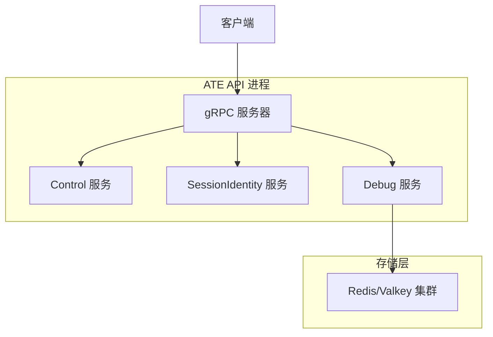
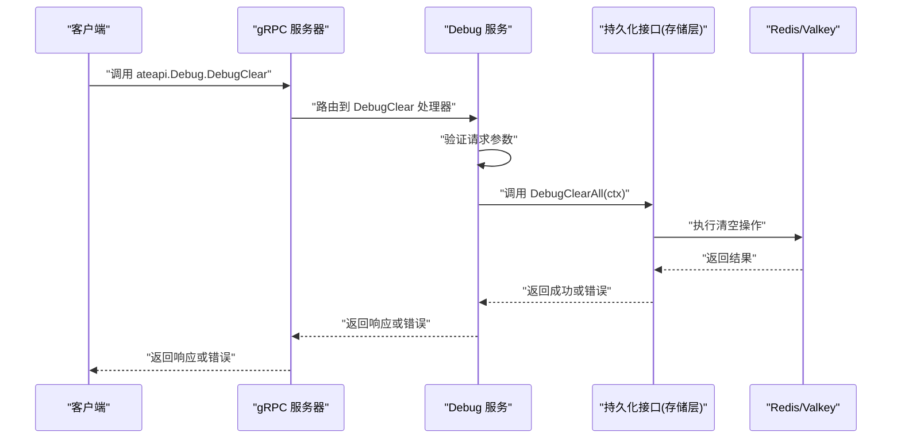
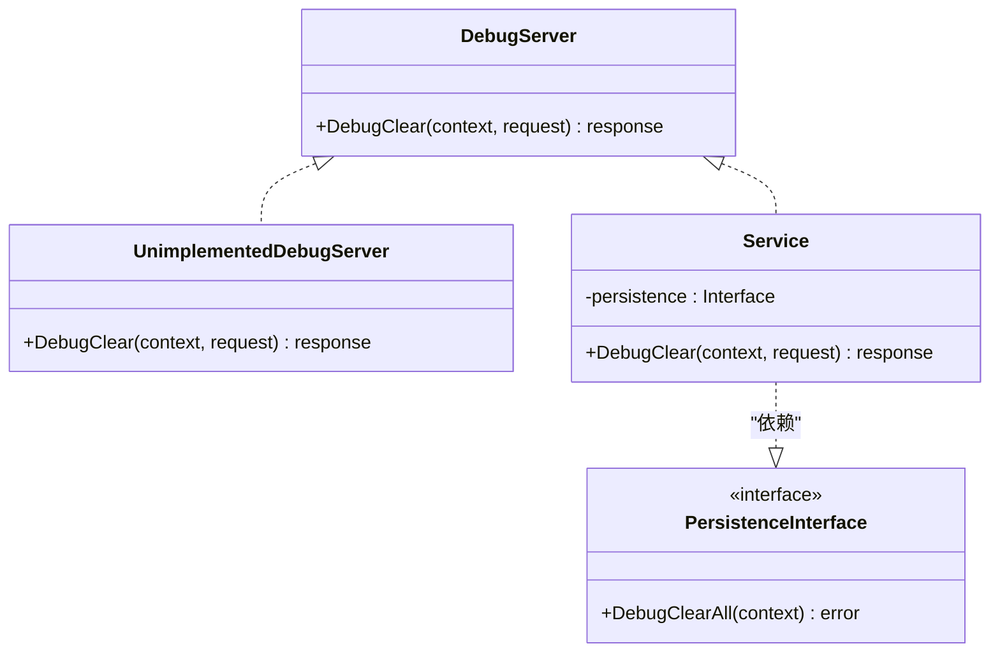
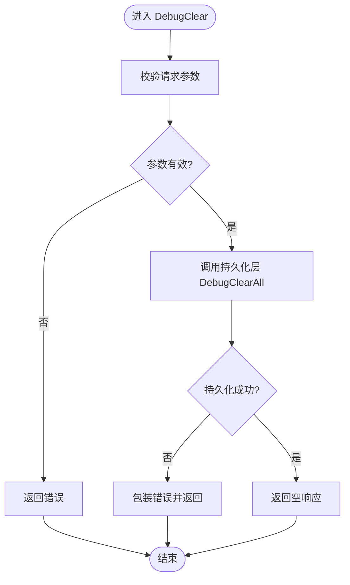
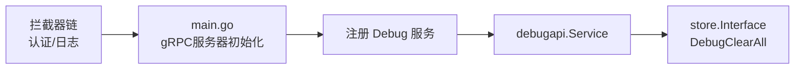

# Debug服务

<cite>
**本文引用的文件**
- [cmd/ateapi/internal/debugapi/service.go](file://cmd/ateapi/internal/debugapi/service.go)
- [cmd/ateapi/internal/debugapi/debug_clear.go](file://cmd/ateapi/internal/debugapi/debug_clear.go)
- [pkg/proto/ateapipb/ateapi.proto](file://pkg/proto/ateapipb/ateapi.proto)
- [pkg/proto/ateapipb/ateapi_grpc.pb.go](file://pkg/proto/ateapipb/ateapi_grpc.pb.go)
- [cmd/ateapi/main.go](file://cmd/ateapi/main.go)
- [internal/ateinterceptors/ateinterceptors.go](file://internal/ateinterceptors/ateinterceptors.go)
</cite>

## 目录
1. [简介](#简介)
2. [项目结构](#项目结构)
3. [核心组件](#核心组件)
4. [架构总览](#架构总览)
5. [详细组件分析](#详细组件分析)
6. [依赖关系分析](#依赖关系分析)
7. [性能与可用性考虑](#性能与可用性考虑)
8. [安全与访问控制建议](#安全与访问控制建议)
9. [使用示例](#使用示例)
10. [故障排除指南](#故障排除指南)
11. [结论](#结论)

## 简介
Debug服务提供面向开发与测试环境的运维调试RPC接口，当前包含一个用于清空系统状态的接口。该服务仅建议在开发或测试环境启用，不应在生产环境中暴露或使用。

## 项目结构
Debug服务位于ATE API服务的gRPC进程中，通过统一的gRPC服务器注册并对外提供服务。其关键位置如下：
- gRPC服务定义与消息类型：在协议定义文件中声明
- 服务端实现：在调试API包中实现
- 服务注册：在主进程启动时注册到gRPC服务器

图表来源
- [cmd/ateapi/main.go:182-196](file://cmd/ateapi/main.go#L182-L196)
- [pkg/proto/ateapipb/ateapi.proto:331-340](file://pkg/proto/ateapipb/ateapi.proto#L331-L340)

章节来源
- [cmd/ateapi/main.go:182-196](file://cmd/ateapi/main.go#L182-L196)
- [pkg/proto/ateapipb/ateapi.proto:331-340](file://pkg/proto/ateapipb/ateapi.proto#L331-L340)

## 核心组件
- Debug服务接口与消息定义
  - 服务名：Debug
  - RPC方法：DebugClear
  - 请求消息：DebugClearRequest（空消息）
  - 响应消息：DebugClearResponse（空消息）
- 服务端实现
  - Service结构体持有持久化接口引用
  - DebugClear方法执行参数校验后调用底层持久化层的清空操作
- 服务注册
  - 主进程创建gRPC服务器并注册Debug服务

章节来源
- [pkg/proto/ateapipb/ateapi.proto:331-340](file://pkg/proto/ateapipb/ateapi.proto#L331-L340)
- [cmd/ateapi/internal/debugapi/service.go:22-35](file://cmd/ateapi/internal/debugapi/service.go#L22-L35)
- [cmd/ateapi/internal/debugapi/debug_clear.go:24-32](file://cmd/ateapi/internal/debugapi/debug_clear.go#L24-L32)
- [cmd/ateapi/main.go:196](file://cmd/ateapi/main.go#L196)

## 架构总览
下图展示了从客户端发起DebugClear请求到持久化层完成数据清空的完整流程。

图表来源
- [cmd/ateapi/main.go:182-196](file://cmd/ateapi/main.go#L182-L196)
- [cmd/ateapi/internal/debugapi/debug_clear.go:24-32](file://cmd/ateapi/internal/debugapi/debug_clear.go#L24-L32)

## 详细组件分析

### Debug服务类图

图表来源
- [pkg/proto/ateapipb/ateapi_grpc.pb.go:658-688](file://pkg/proto/ateapipb/ateapi_grpc.pb.go#L658-L688)
- [cmd/ateapi/internal/debugapi/service.go:22-35](file://cmd/ateapi/internal/debugapi/service.go#L22-L35)

章节来源
- [pkg/proto/ateapipb/ateapi_grpc.pb.go:658-688](file://pkg/proto/ateapipb/ateapi_grpc.pb.go#L658-L688)
- [cmd/ateapi/internal/debugapi/service.go:22-35](file://cmd/ateapi/internal/debugapi/service.go#L22-L35)

### DebugClear处理流程

图表来源
- [cmd/ateapi/internal/debugapi/debug_clear.go:24-32](file://cmd/ateapi/internal/debugapi/debug_clear.go#L24-L32)

章节来源
- [cmd/ateapi/internal/debugapi/debug_clear.go:24-32](file://cmd/ateapi/internal/debugapi/debug_clear.go#L24-L32)

### 协议与消息定义
- 服务与方法
  - 服务：Debug
  - 方法：rpc DebugClear(DebugClearRequest) returns (DebugClearResponse)
- 请求消息
  - DebugClearRequest：无字段
- 响应消息
  - DebugClearResponse：无字段

章节来源
- [pkg/proto/ateapipb/ateapi.proto:331-340](file://pkg/proto/ateapipb/ateapi.proto#L331-L340)

## 依赖关系分析
- 服务注册依赖
  - 主进程创建gRPC服务器并注册Debug服务
- 实现依赖
  - Debug服务依赖持久化接口以执行清空操作
- 拦截器链
  - gRPC服务器配置了认证与日志拦截器，所有RPC均会经过统一处理

图表来源
- [cmd/ateapi/main.go:182-196](file://cmd/ateapi/main.go#L182-L196)
- [cmd/ateapi/internal/debugapi/service.go:22-35](file://cmd/ateapi/internal/debugapi/service.go#L22-L35)
- [internal/ateinterceptors/ateinterceptors.go:39-86](file://internal/ateinterceptors/ateinterceptors.go#L39-L86)

章节来源
- [cmd/ateapi/main.go:182-196](file://cmd/ateapi/main.go#L182-L196)
- [internal/ateinterceptors/ateinterceptors.go:39-86](file://internal/ateinterceptors/ateinterceptors.go#L39-L86)

## 性能与可用性考虑
- 清空操作的代价
  - 清空数据库状态可能涉及大量键的删除，耗时与数据量相关
- 并发与锁
  - 清空期间应避免其他写操作导致的状态不一致
- 可观测性
  - 通过拦截器记录RPC耗时、方法与错误信息，便于定位问题

[本节为通用指导，不直接分析具体文件]

## 安全与访问控制建议
- 环境限制
  - 仅在开发与测试环境启用；生产环境应禁用或严格隔离
- 传输安全
  - 使用mTLS或受控网络通道访问gRPC端口
- 身份与鉴权
  - 结合现有认证拦截器，确保只有授权主体可调用Debug接口
- 最小权限
  - 将Debug服务限定在内部网络或专用管理平面，避免公网暴露
- 审计与告警
  - 对DebugClear调用进行审计记录，并在异常或高频调用时触发告警

[本节为通用指导，不直接分析具体文件]

## 使用示例
以下为常见调用方式说明（不包含代码片段，仅提供路径参考）：
- gRPC命令行工具
  - 使用grpcurl或类似工具调用 ateapi.Debug.DebugClear
  - 参考：[cmd/ateapi/main.go:182-196](file://cmd/ateapi/main.go#L182-L196)
- Go客户端
  - 生成客户端代码后构造空请求并调用
  - 参考：[pkg/proto/ateapipb/ateapi_grpc.pb.go:658-688](file://pkg/proto/ateapipb/ateapi_grpc.pb.go#L658-L688)
- Python客户端
  - 使用生成的Python stub调用
  - 参考：[benchmarking/locust/common/ateapi_pb2_grpc.py:664-695](file://benchmarking/locust/common/ateapi_pb2_grpc.py#L664-L695)

章节来源
- [cmd/ateapi/main.go:182-196](file://cmd/ateapi/main.go#L182-L196)
- [pkg/proto/ateapipb/ateapi_grpc.pb.go:658-688](file://pkg/proto/ateapipb/ateapi_grpc.pb.go#L658-L688)
- [benchmarking/locust/common/ateapi_pb2_grpc.py:664-695](file://benchmarking/locust/common/ateapi_pb2_grpc.py#L664-L695)

## 故障排除指南
- 常见问题
  - 连接失败：检查gRPC监听地址与证书配置
    - 参考：[cmd/ateapi/main.go:182-196](file://cmd/ateapi/main.go#L182-L196)
  - 认证失败：确认认证模式与凭据是否正确
    - 参考：[cmd/ateapi/main.go:171-192](file://cmd/ateapi/main.go#L171-L192)
  - 清空失败：查看持久化层错误与日志
    - 参考：[cmd/ateapi/internal/debugapi/debug_clear.go:24-32](file://cmd/ateapi/internal/debugapi/debug_clear.go#L24-L32)
- 日志与追踪
  - 使用拦截器记录的RPC信息与耗时辅助定位
    - 参考：[internal/ateinterceptors/ateinterceptors.go:39-86](file://internal/ateinterceptors/ateinterceptors.go#L39-L86)
- 恢复策略
  - 清空后需重新初始化必要资源与缓存，确保系统处于一致状态

章节来源
- [cmd/ateapi/main.go:171-196](file://cmd/ateapi/main.go#L171-L196)
- [cmd/ateapi/internal/debugapi/debug_clear.go:24-32](file://cmd/ateapi/internal/debugapi/debug_clear.go#L24-L32)
- [internal/ateinterceptors/ateinterceptors.go:39-86](file://internal/ateinterceptors/ateinterceptors.go#L39-L86)

## 结论
Debug服务提供了简洁而强大的调试能力，适用于开发与测试阶段快速清理系统状态。为确保安全与稳定性，请严格限制其使用范围与访问权限，并结合监控与审计机制保障可观测性与合规性。
