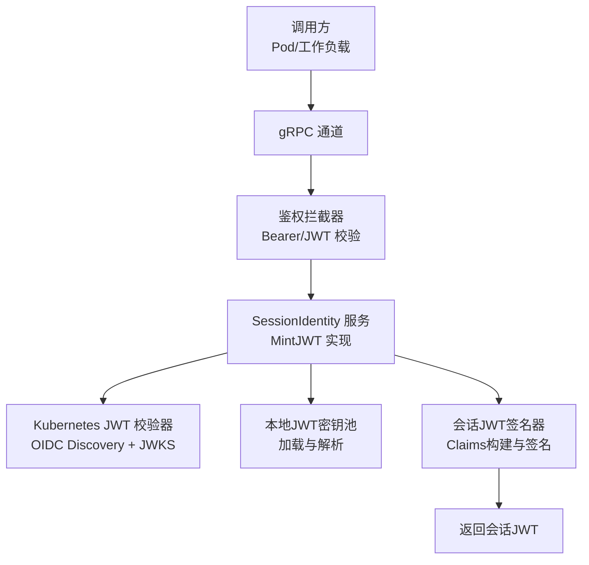
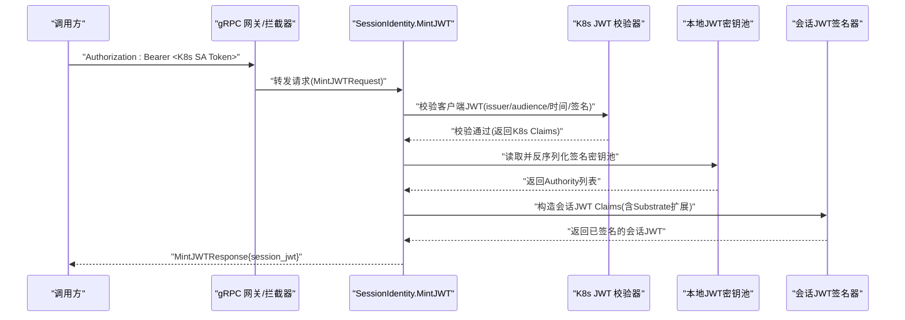
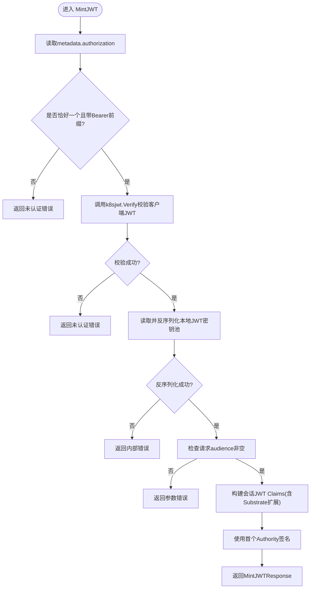
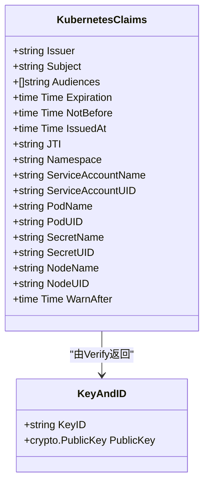
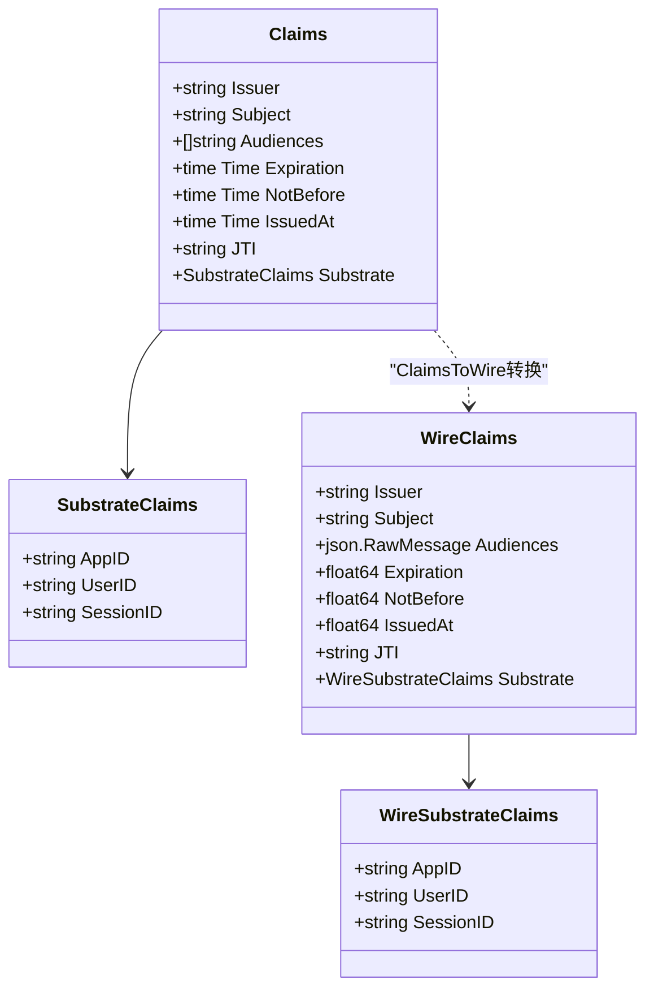
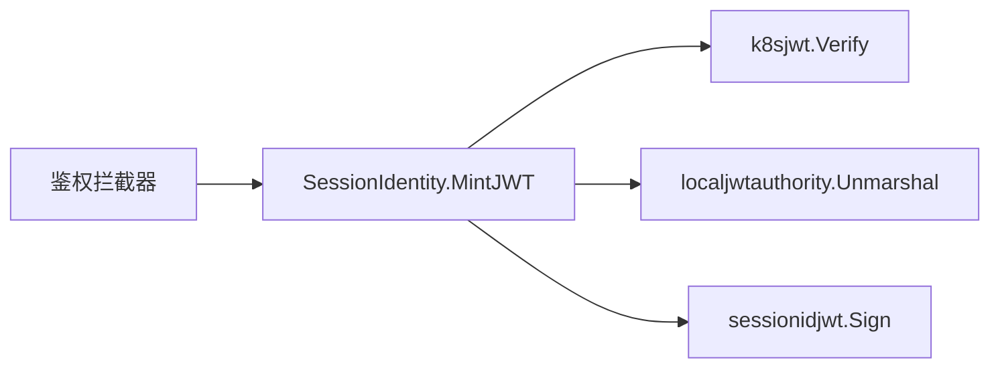

# JWT令牌颁发

<cite>
**本文引用的文件**
- [ateapi.proto](file://pkg/proto/ateapipb/ateapi.proto)
- [sessionidentity.go](file://cmd/ateapi/internal/sessionidentity/sessionidentity.go)
- [k8sjwt.go](file://cmd/ateapi/internal/k8sjwt/k8sjwt.go)
- [sessionidjwt.go](file://cmd/ateapi/internal/sessionidjwt/sessionidjwt.go)
- [localjwtauthority.go](file://internal/localjwtauthority/localjwtauthority.go)
- [server.go](file://internal/ateapiauth/server.go)
- [main.go](file://cmd/ateapi/main.go)
</cite>

## 目录
1. [简介](#简介)
2. [项目结构](#项目结构)
3. [核心组件](#核心组件)
4. [架构总览](#架构总览)
5. [详细组件分析](#详细组件分析)
6. [依赖关系分析](#依赖关系分析)
7. [性能与可扩展性](#性能与可扩展性)
8. [故障排查指南](#故障排查指南)
9. [结论](#结论)
10. [附录：消息定义与使用示例](#附录消息定义与使用示例)

## 简介
本文件聚焦于 Substrate 的“JWT令牌颁发”能力，围绕 SessionIdentity 服务的 MintJWT RPC 展开，详细说明：
- MintJWT 方法的工作流程（客户端认证、会话声明生成、签名）
- MintJWTRequest 与 MintJWTResponse 的消息结构与字段语义
- OIDC 兼容的 JWT 标准声明与 Substrate 自定义声明
- Bearer Token 认证机制与 Kubernetes JWT 验证集成
- 获取与使用令牌的端到端示例
- 安全最佳实践与错误处理策略

## 项目结构
与 JWT 颁发相关的代码主要分布在以下模块：
- 协议定义：pkg/proto/ateapipb/ateapi.proto
- 服务端实现：cmd/ateapi/internal/sessionidentity/sessionidentity.go
- Kubernetes JWT 校验：cmd/ateapi/internal/k8sjwt/k8sjwt.go
- 会话 JWT 签发：cmd/ateapi/internal/sessionidjwt/sessionidjwt.go
- 本地 JWT 密钥池：internal/localjwtauthority/localjwtauthority.go
- gRPC 鉴权拦截器：internal/ateapiauth/server.go
- 服务启动与配置：cmd/ateapi/main.go

图表来源
- [sessionidentity.go:71-142](file://cmd/ateapi/internal/sessionidentity/sessionidentity.go#L71-L142)
- [k8sjwt.go:118-261](file://cmd/ateapi/internal/k8sjwt/k8sjwt.go#L118-L261)
- [sessionidjwt.go:76-164](file://cmd/ateapi/internal/sessionidjwt/sessionidjwt.go#L76-L164)
- [localjwtauthority.go:76-101](file://internal/localjwtauthority/localjwtauthority.go#L76-L101)
- [server.go:137-152](file://internal/ateapiauth/server.go#L137-L152)

章节来源
- [ateapi.proto:358-398](file://pkg/proto/ateapipb/ateapi.proto#L358-L398)
- [sessionidentity.go:71-142](file://cmd/ateapi/internal/sessionidentity/sessionidentity.go#L71-L142)

## 核心组件
- SessionIdentity 服务：提供 MintJWT 和 MintCert 两个接口。MintJWT 用于将基础设施级身份（如 Kubernetes ServiceAccount Bearer Token）交换为子strate 会话级 JWT。
- Kubernetes JWT 校验器：基于 OIDC Discovery 与 JWKS 动态拉取公钥，完成对客户端传入的 SA Bearer Token 的签名、发行者、受众与时序校验。
- 会话 JWT 签名器：根据请求参数构造 OIDC 兼容的会话 JWT，并写入 Substrate 扩展声明。
- 本地 JWT 密钥池：以 JSON 形式持久化一组可签名的权威实体（包含算法、kid、私钥），供签发时使用。
- gRPC 鉴权拦截器：支持 mTLS 或 JWT 模式；在 JWT 模式下要求每个 RPC 携带 Authorization: Bearer <SA token>。

章节来源
- [ateapi.proto:358-398](file://pkg/proto/ateapipb/ateapi.proto#L358-L398)
- [server.go:137-152](file://internal/ateapiauth/server.go#L137-L152)
- [k8sjwt.go:118-261](file://cmd/ateapi/internal/k8sjwt/k8sjwt.go#L118-L261)
- [sessionidjwt.go:30-98](file://cmd/ateapi/internal/sessionidjwt/sessionidjwt.go#L30-L98)
- [localjwtauthority.go:29-101](file://internal/localjwtauthority/localjwtauthority.go#L29-L101)

## 架构总览
MintJWT 的整体交互如下：

图表来源
- [sessionidentity.go:71-142](file://cmd/ateapi/internal/sessionidentity/sessionidentity.go#L71-L142)
- [k8sjwt.go:118-261](file://cmd/ateapi/internal/k8sjwt/k8sjwt.go#L118-L261)
- [sessionidjwt.go:76-164](file://cmd/ateapi/internal/sessionidjwt/sessionidjwt.go#L76-L164)
- [localjwtauthority.go:76-101](file://internal/localjwtauthority/localjwtauthority.go#L76-L101)

## 详细组件分析

### MintJWT 方法工作流程
- 从 gRPC 上下文提取 metadata.authorization，要求仅有一个值且以 Bearer 前缀开头。
- 调用 k8sjwt.Verify 对客户端提供的 SA Bearer Token 进行完整校验：
  - 解析头部与载荷，校验 typ 允许为空或 JWT
  - 校验 issuer 与 expectedIssuer 一致
  - 通过 OIDC Discovery 获取 JWKS，按 kid 选择公钥
  - 校验签名（支持 RS256/RS384/RS512 与 ES256/ES384/ES512）
  - 校验 audience 包含 expectedAudience
  - 校验 exp/nbf/iat 时序，允许一定 skew
- 从磁盘读取 sessionIDJWTPoolFile，反序列化为本地 JWT 密钥池，选择第一个 Authority 作为签名者。
- 校验请求至少包含一个 audience，否则拒绝。
- 构造会话 JWT 的 Claims：
  - iss：固定为内部服务地址（需全局唯一）
  - sub：格式为 apps/{app_id}/users/{user_id}/sessions/{session_id}
  - aud：来自请求的 audience 列表
  - nbf/exp/iat/jti：当前时间派生与随机 ID
  - ate.dev 扩展：包含 appID/userID/sessionID
- 将 Claims 转换为 Wire 表示并签名，返回 session_jwt。

图表来源
- [sessionidentity.go:71-142](file://cmd/ateapi/internal/sessionidentity/sessionidentity.go#L71-L142)
- [k8sjwt.go:118-261](file://cmd/ateapi/internal/k8sjwt/k8sjwt.go#L118-L261)
- [localjwtauthority.go:76-101](file://internal/localjwtauthority/localjwtauthority.go#L76-L101)

章节来源
- [sessionidentity.go:71-142](file://cmd/ateapi/internal/sessionidentity/sessionidentity.go#L71-L142)

### Kubernetes JWT 验证集成
- 发现阶段：根据 issuer 拼接 .well-known/openid-configuration 路径，获取 jwks_uri。
- 密钥阶段：拉取 JWKS，按 kid 匹配到对应公钥（RSA/EC）。
- 签名阶段：根据 alg 选择 RSA PKCS1v15 或 ECDSA 验签。
- 时序与受众：校验 exp/nbf/iat 与 expectedAudience。

图表来源
- [k8sjwt.go:87-111](file://cmd/ateapi/internal/k8sjwt/k8sjwt.go#L87-L111)
- [k8sjwt.go:118-261](file://cmd/ateapi/internal/k8sjwt/k8sjwt.go#L118-L261)

章节来源
- [k8sjwt.go:118-261](file://cmd/ateapi/internal/k8sjwt/k8sjwt.go#L118-L261)

### 会话 JWT 声明与签名
- 标准声明（RFC7519/OIDC）：iss、sub、aud、nbf、exp、iat、jti。
- Substrate 自定义声明：ate.dev 命名空间下的 appID、userID、sessionID。
- 签名算法：支持 RS256/RS384/RS512 与 ES256（ES384/ES512 在签名器中未实现）。
- 密钥来源：本地 JWT 密钥池中的 Authorities，默认使用第一个 Authority。

图表来源
- [sessionidjwt.go:30-98](file://cmd/ateapi/internal/sessionidjwt/sessionidjwt.go#L30-L98)
- [sessionidjwt.go:100-164](file://cmd/ateapi/internal/sessionidjwt/sessionidjwt.go#L100-L164)

章节来源
- [sessionidjwt.go:30-98](file://cmd/ateapi/internal/sessionidjwt/sessionidjwt.go#L30-L98)
- [sessionidjwt.go:100-164](file://cmd/ateapi/internal/sessionidjwt/sessionidjwt.go#L100-L164)

### Bearer Token 认证机制
- gRPC 层支持两种模式：mTLS 与 JWT。
- JWT 模式下，鉴权拦截器会强制要求每个 RPC 携带 Authorization: Bearer <token>，并通过注入的 verifyBearerToken 函数进行校验。
- 对于 MintJWT，服务端还会进一步用 k8sjwt.Verify 校验该 Bearer Token 是否为合法的 Kubernetes SA Token。

章节来源
- [server.go:137-152](file://internal/ateapiauth/server.go#L137-L152)
- [sessionidentity.go:71-88](file://cmd/ateapi/internal/sessionidentity/sessionidentity.go#L71-L88)

### 配置与运行要点
- 服务启动时可通过命令行参数控制鉴权模式（mtls|jwt）。
- 当启用 JWT 模式时，客户端需在每次 RPC 上附带 SA Bearer Token。
- 服务端在需要访问 OIDC 元数据时会注入 SA Token 到出站 HTTP 请求头，以便访问受保护的 JWKS。

章节来源
- [main.go:74](file://cmd/ateapi/main.go#L74)
- [main.go:414-431](file://cmd/ateapi/main.go#L414-L431)

## 依赖关系分析
- SessionIdentity 服务依赖：
  - k8sjwt：负责客户端 SA Token 的 OIDC/JWKS 校验
  - localjwtauthority：负责加载本地 JWT 签名密钥池
  - sessionidjwt：负责会话 JWT 的 Claims 构建与签名
- gRPC 鉴权拦截器：
  - 在 JWT 模式下，统一抽取并校验 Authorization: Bearer 头

图表来源
- [sessionidentity.go:71-142](file://cmd/ateapi/internal/sessionidentity/sessionidentity.go#L71-L142)
- [server.go:137-152](file://internal/ateapiauth/server.go#L137-L152)

章节来源
- [sessionidentity.go:71-142](file://cmd/ateapi/internal/sessionidentity/sessionidentity.go#L71-L142)
- [server.go:137-152](file://internal/ateapiauth/server.go#L137-L152)

## 性能与可扩展性
- 密钥缓存：当前实现每次请求都会从磁盘读取并反序列化本地 JWT 密钥池，存在 I/O 开销。建议引入内存缓存并在必要时热更新。
- OIDC/JWKS 缓存：k8sjwt 目前未缓存发现的 keys，建议按 kid 做短期缓存以减少网络开销。
- 并发安全：若引入缓存，需注意并发读写与失效策略。
- 算法选择：优先使用 ES256 以获得更小的签名体积与更快的计算。

[本节为通用指导，不直接分析具体文件]

## 故障排查指南
- 未认证错误
  - 现象：返回 Unauthenticated
  - 可能原因：缺少 Authorization 头、非 Bearer 前缀、k8sjwt.Verify 失败（issuer/audience/时间/签名不匹配）
  - 定位：检查客户端是否正确注入 SA Token；核对 expectedIssuer/expectedAudience 配置
- 参数错误
  - 现象：返回 InvalidArgument 或参数缺失错误
  - 可能原因：请求未包含任何 audience
  - 定位：确保 MintJWTRequest.audience 非空
- 内部错误
  - 现象：返回 Internal
  - 可能原因：本地 JWT 密钥池文件读取/反序列化失败、证书池加载失败等
  - 定位：检查 sessionIDJWTPoolFile 路径与内容完整性

章节来源
- [sessionidentity.go:71-142](file://cmd/ateapi/internal/sessionidentity/sessionidentity.go#L71-L142)
- [server.go:137-152](file://internal/ateapiauth/server.go#L137-L152)

## 结论
MintJWT 提供了将 Kubernetes 基础设施身份转换为 Substrate 会话级 JWT 的能力。其流程清晰、遵循 OIDC 规范，并通过 ate.dev 扩展承载应用域标识。生产部署应关注密钥缓存、JWKS 缓存与严格的受众绑定，以确保性能与安全。

[本节为总结，不直接分析具体文件]

## 附录：消息定义与使用示例

### 消息结构定义
- MintJWTRequest
  - audience: 字符串数组，目标受众列表（必须非空）
  - app_id: 应用标识
  - user_id: 用户标识
  - session_id: 会话标识
- MintJWTResponse
  - session_jwt: 会话 JWT 字符串（OIDC Discovery 兼容）

章节来源
- [ateapi.proto:370-398](file://pkg/proto/ateapipb/ateapi.proto#L370-L398)

### OIDC 兼容声明与 Substrate 扩展
- 标准声明
  - iss：发行者 URL（指向 OIDC Discovery 文档）
  - sub：主体，格式为 apps/{app_id}/users/{user_id}/sessions/{session_id}
  - aud：受众，与服务绑定的目标服务标识
  - nbf：生效时间（Unix 秒）
  - exp：过期时间（Unix 秒）
  - iat：签发时间（Unix 秒）
  - jti：一次性令牌 ID
- Substrate 扩展（ate.dev）
  - appID：应用标识
  - userID：用户标识
  - sessionID：会话标识

章节来源
- [ateapi.proto:378-398](file://pkg/proto/ateapipb/ateapi.proto#L378-L398)
- [sessionidjwt.go:30-98](file://cmd/ateapi/internal/sessionidjwt/sessionidjwt.go#L30-L98)

### Bearer Token 认证与 Kubernetes JWT 验证
- 客户端在每个 gRPC 调用中携带 Authorization: Bearer <K8s SA Token>
- 服务端通过 k8sjwt.Verify 完成：
  - 从 issuer 发现 OIDC 配置并拉取 JWKS
  - 按 kid 选择公钥并校验签名
  - 校验 issuer、audience、时间窗口
- 服务端再据此签发会话 JWT

章节来源
- [server.go:137-152](file://internal/ateapiauth/server.go#L137-L152)
- [k8sjwt.go:118-261](file://cmd/ateapi/internal/k8sjwt/k8sjwt.go#L118-L261)

### 端到端示例（步骤说明）
- 准备
  - 确保 Pod 具有有效的 Kubernetes ServiceAccount Token
  - 确认 ateapi 服务以 jwt 模式运行，并正确配置 expectedIssuer/expectedAudience
- 获取会话 JWT
  - 向 SessionIdentity.MintJWT 发起 gRPC 调用
  - 设置 Authorization: Bearer <SA Token>
  - 填写 audience、app_id、user_id、session_id
  - 接收 MintJWTResponse.session_jwt
- 使用会话 JWT
  - 后续访问受保护服务时，将该 session_jwt 作为 Bearer Token 传递
  - 目标服务依据 iss 发现公钥并校验签名与受众

[本节为概念性示例，不直接分析具体文件]

### 安全最佳实践
- 严格受众绑定：仅在请求中包含必要的 audience，避免过度授权
- 短生命周期：合理设置 exp/nbf，减少泄露风险
- 密钥管理：本地 JWT 密钥池文件权限最小化，定期轮换
- 缓存策略：对 JWKS 与本地密钥池实施合理的缓存与失效策略
- 日志脱敏：避免在日志中输出完整的 JWT 或敏感标识

[本节为通用指导，不直接分析具体文件]
