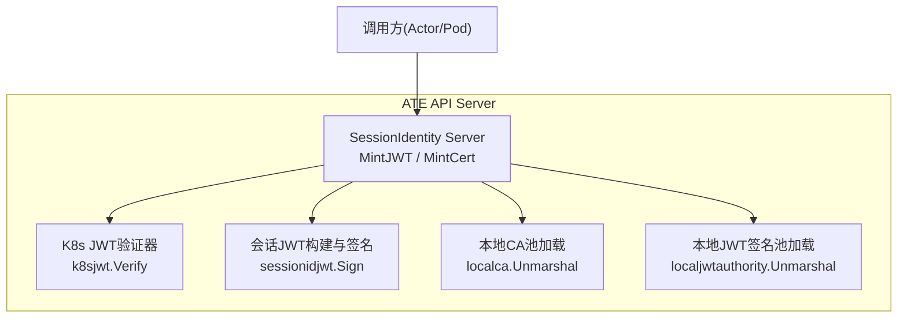
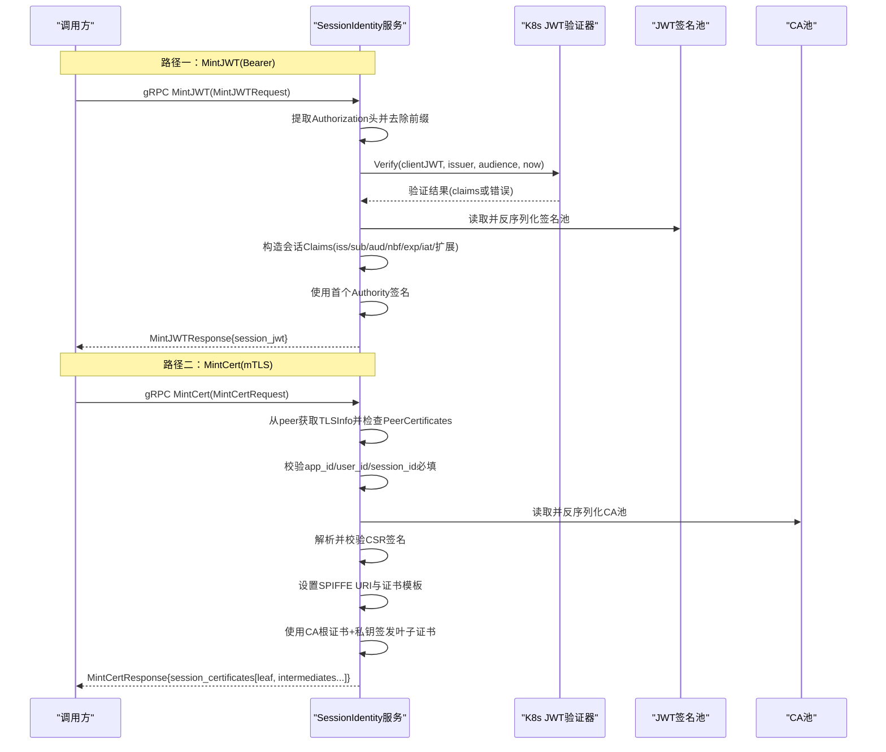
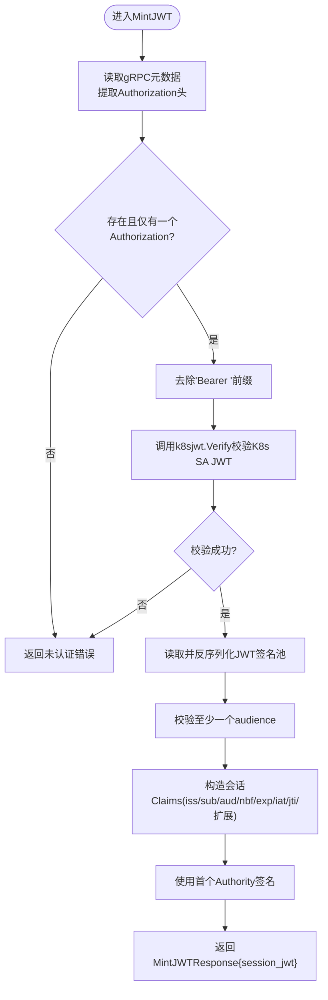
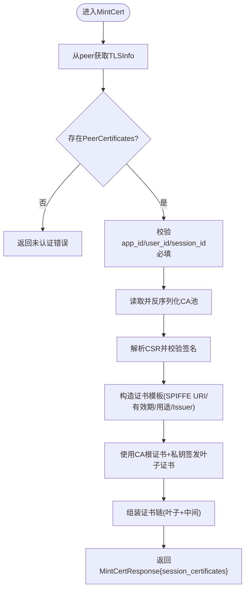
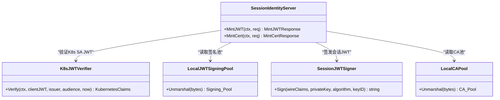

# SessionIdentity服务

<cite>
**本文引用的文件**   
- [sessionidentity.go](file://cmd/ateapi/internal/sessionidentity/sessionidentity.go)
- [ateapi.proto](file://pkg/proto/ateapipb/ateapi.proto)
- [ateapi.pb.go](file://pkg/proto/ateapipb/ateapi.pb.go)
- [ateapi_grpc.pb.go](file://pkg/proto/ateapipb/ateapi_grpc.pb.go)
- [k8sjwt.go](file://cmd/ateapi/internal/k8sjwt/k8sjwt.go)
- [sessionidjwt.go](file://cmd/ateapi/internal/sessionidjwt/sessionidjwt.go)
- [localca.go](file://internal/localca/localca.go)
- [localjwtauthority.go](file://internal/localjwtauthority/localjwtauthority.go)
- [api-guide.md](file://docs/api-guide.md)
</cite>

## 目录
1. [简介](#简介)
2. [项目结构](#项目结构)
3. [核心组件](#核心组件)
4. [架构总览](#架构总览)
5. [详细组件分析](#详细组件分析)
6. [依赖关系分析](#依赖关系分析)
7. [性能与可用性考虑](#性能与可用性考虑)
8. [故障排查指南](#故障排查指南)
9. [结论](#结论)
10. [附录：集成示例与安全最佳实践](#附录集成示例与安全最佳实践)

## 简介
SessionIdentity服务为工作负载提供“会话级身份”，将短暂的Kubernetes凭证转换为稳定的、跨物理节点迁移仍保持一致的会话身份。该服务支持两种认证方式：
- Bearer Token（基于Kubernetes ServiceAccount JWT）
- mTLS（基于客户端证书）

核心能力包括：
- MintJWT：颁发OIDC兼容的JWT，包含标准声明及扩展字段
- MintCert：对CSR进行签名，返回会话证书链，用于mTLS通信

## 项目结构
SessionIdentity服务位于ATE API Server内部，实现gRPC接口并依赖本地密钥池与CA池完成签发。

图表来源
- [sessionidentity.go:71-142](file://cmd/ateapi/internal/sessionidentity/sessionidentity.go#L71-L142)
- [sessionidentity.go:144-225](file://cmd/ateapi/internal/sessionidentity/sessionidentity.go#L144-L225)
- [k8sjwt.go:183-247](file://cmd/ateapi/internal/k8sjwt/k8sjwt.go#L183-L247)
- [sessionidjwt.go:100-118](file://cmd/ateapi/internal/sessionidjwt/sessionidjwt.go#L100-L118)
- [ateapi.proto:370-416](file://pkg/proto/ateapipb/ateapi.proto#L370-L416)

章节来源
- [api-guide.md:289-296](file://docs/api-guide.md#L289-L296)

## 核心组件
- gRPC服务定义与消息类型
  - 服务名：ateapi.SessionIdentity
  - 方法：MintJWT、MintCert
  - 请求/响应消息：MintJWTRequest、MintJWTResponse、MintCertRequest、MintCertResponse
- 服务端实现
  - 解析认证上下文（Bearer或mTLS）
  - 校验客户端身份（K8s SA JWT或客户端证书）
  - 加载签名材料（JWT签名池、CA池）
  - 生成会话JWT或会话证书链
- 依赖库
  - k8sjwt：验证Kubernetes Bound ServiceAccount JWT
  - sessionidjwt：构造并签名会话JWT
  - localca：加载本地CA池以签发证书
  - localjwtauthority：加载JWT签名密钥池

章节来源
- [ateapi_grpc.pb.go:760-769](file://pkg/proto/ateapipb/ateapi_grpc.pb.go#L760-L769)
- [ateapi.pb.go:1947-2040](file://pkg/proto/ateapipb/ateapi.pb.go#L1947-L2040)
- [ateapi.pb.go:2079-2197](file://pkg/proto/ateapipb/ateapi.pb.go#L2079-L2197)
- [sessionidentity.go:43-69](file://cmd/ateapi/internal/sessionidentity/sessionidentity.go#L43-L69)

## 架构总览
SessionIdentity服务在两个路径上提供身份：
- 通过HTTP Authorization: Bearer <K8s SA JWT> 调用MintJWT
- 通过mTLS客户端证书调用MintCert

图表来源
- [sessionidentity.go:71-142](file://cmd/ateapi/internal/sessionidentity/sessionidentity.go#L71-L142)
- [sessionidentity.go:144-225](file://cmd/ateapi/internal/sessionidentity/sessionidentity.go#L144-L225)
- [k8sjwt.go:183-247](file://cmd/ateapi/internal/k8sjwt/k8sjwt.go#L183-L247)
- [ateapi.proto:370-416](file://pkg/proto/ateapipb/ateapi.proto#L370-L416)

## 详细组件分析

### 接口与消息定义
- 服务与方法
  - 服务名：ateapi.SessionIdentity
  - 方法：
    - MintJWT：需要Barear Token认证
    - MintCert：需要mTLS客户端证书认证
- 消息结构
  - MintJWTRequest
    - audience：[]string，目标受众列表
    - app_id：string，应用标识
    - user_id：string：用户标识
    - session_id：string：会话标识
  - MintJWTResponse
    - session_jwt：string，OIDC兼容JWT
  - MintCertRequest
    - app_id：string
    - user_id：string
    - session_id：string
    - certificate_signing_request：bytes，DER编码的x509 CSR
  - MintCertResponse
    - session_certificates：[][]byte，DER编码证书列表，首项为叶子证书，后续为中间证书

章节来源
- [ateapi.proto:370-416](file://pkg/proto/ateapipb/ateapi.proto#L370-L416)
- [ateapi.pb.go:1947-2040](file://pkg/proto/ateapipb/ateapi.pb.go#L1947-L2040)
- [ateapi.pb.go:2079-2197](file://pkg/proto/ateapipb/ateapi.pb.go#L2079-L2197)
- [ateapi_grpc.pb.go:760-769](file://pkg/proto/ateapipb/ateapi_grpc.pb.go#L760-L769)

### MintJWT流程详解
- 认证阶段
  - 从gRPC元数据中读取Authorization头
  - 去除“Bearer ”前缀后得到clientJWT
  - 调用k8sjwt.Verify进行签名、发行者、受众、时间绑定等校验
- 授权与参数校验
  - 要求至少一个audience
  - 当前实现未做K8s身份到会话映射的交叉校验（TODO）
- 签发阶段
  - 从磁盘读取JWT签名池并反序列化
  - 构造会话Claims：
    - iss：发行者URL
    - sub：格式为“apps/{app_id}/users/{user_id}/sessions/{session_id}”
    - aud：来自请求的受众列表
    - nbf/exp/iat：相对当前时间的窗口
    - jti：随机ID
    - ate.dev扩展：包含appID、userID、sessionID
  - 使用签名池中的第一个Authority进行签名
- 返回
  - 返回MintJWTResponse，包含session_jwt

图表来源
- [sessionidentity.go:71-142](file://cmd/ateapi/internal/sessionidentity/sessionidentity.go#L71-L142)
- [k8sjwt.go:183-247](file://cmd/ateapi/internal/k8sjwt/k8sjwt.go#L183-L247)
- [sessionidjwt.go:100-118](file://cmd/ateapi/internal/sessionidjwt/sessionidjwt.go#L100-L118)

章节来源
- [sessionidentity.go:71-142](file://cmd/ateapi/internal/sessionidentity/sessionidentity.go#L71-L142)
- [k8sjwt.go:183-247](file://cmd/ateapi/internal/k8sjwt/k8sjwt.go#L183-L247)
- [sessionidjwt.go:100-118](file://cmd/ateapi/internal/sessionidjwt/sessionidjwt.go#L100-L118)

### MintCert流程详解
- 认证阶段
  - 从gRPC peer中提取TLSInfo
  - 要求存在PeerCertificates（即mTLS客户端证书）
- 参数校验
  - 要求app_id、user_id、session_id均非空
- 签发阶段
  - 读取并反序列化本地CA池
  - 解析CSR并校验其签名
  - 构造证书模板：
    - SPIFFE URI：spiffe://substrate-session.local/app/{app_id}/user/{user_id}/session/{session_id}
    - 有效期：nbf为当前时间-5分钟，exp为当前时间+15分钟
    - 用途：数字签名、客户端认证
    - Issuer CN：集群API地址
  - 使用CA根证书和私钥签发叶子证书
- 返回
  - 返回MintCertResponse，包含叶子证书与中间证书序列

图表来源
- [sessionidentity.go:144-225](file://cmd/ateapi/internal/sessionidentity/sessionidentity.go#L144-L225)
- [ateapi.proto:400-416](file://pkg/proto/ateapipb/ateapi.proto#L400-L416)

章节来源
- [sessionidentity.go:144-225](file://cmd/ateapi/internal/sessionidentity/sessionidentity.go#L144-L225)

### OIDC兼容JWT声明说明
- 标准声明
  - iss：发行者URL，供依赖方拉取OIDC发现文档
  - sub：主体，格式为“apps/{app_id}/users/{user_id}/sessions/{session_id}”
  - aud：受众，字符串数组，表示可信任的服务
  - nbf：生效时间（Unix时间戳）
  - exp：过期时间（Unix时间戳）
  - iat：签发时间（Unix时间戳）
- 扩展声明
  - 命名空间：ate.dev
  - 内容：JSON对象，包含appID、userID、sessionID

章节来源
- [ateapi.proto:378-398](file://pkg/proto/ateapipb/ateapi.proto#L378-L398)
- [ateapi.pb.go:2015-2040](file://pkg/proto/ateapipb/ateapi.pb.go#L2015-L2040)

### 认证机制支持
- Bearer Token
  - 通过Authorization: Bearer <K8s SA JWT>进行认证
  - 服务端使用k8sjwt.Verify进行签名、issuer、audience、时间绑定校验
- mTLS
  - 通过gRPC TLSInfo中的PeerCertificates进行认证
  - 要求客户端证书存在并通过传输层验证

章节来源
- [sessionidentity.go:71-88](file://cmd/ateapi/internal/sessionidentity/sessionidentity.go#L71-L88)
- [sessionidentity.go:144-157](file://cmd/ateapi/internal/sessionidentity/sessionidentity.go#L144-L157)
- [k8sjwt.go:183-247](file://cmd/ateapi/internal/k8sjwt/k8sjwt.go#L183-L247)

## 依赖关系分析
- 直接依赖
  - k8sjwt：验证Kubernetes Bound ServiceAccount JWT
  - sessionidjwt：构造并签名会话JWT
  - localca：加载本地CA池以签发证书
  - localjwtauthority：加载JWT签名密钥池
- 间接依赖
  - gRPC框架：服务注册、处理器、拦截器
  - x509/crypto：证书与CSR处理

图表来源
- [sessionidentity.go:71-142](file://cmd/ateapi/internal/sessionidentity/sessionidentity.go#L71-L142)
- [sessionidentity.go:144-225](file://cmd/ateapi/internal/sessionidentity/sessionidentity.go#L144-L225)
- [k8sjwt.go:183-247](file://cmd/ateapi/internal/k8sjwt/k8sjwt.go#L183-L247)
- [sessionidjwt.go:100-118](file://cmd/ateapi/internal/sessionidjwt/sessionidjwt.go#L100-L118)
- [localca.go](file://internal/localca/localca.go)
- [localjwtauthority.go](file://internal/localjwtauthority/localjwtauthority.go)

章节来源
- [ateapi_grpc.pb.go:854-863](file://pkg/proto/ateapipb/ateapi_grpc.pb.go#L854-L863)

## 性能与可用性考虑
- 密钥材料缓存
  - 当前实现每次MintJWT都会从磁盘读取并反序列化JWT签名池；建议内存缓存以减少I/O开销
- 证书签发成本
  - 证书签发涉及x509操作，需确保CA私钥安全与高效访问
- 并发与限流
  - 在高并发场景下，建议增加速率限制与熔断保护，避免密钥文件频繁读取导致延迟抖动
- 时间窗口
  - JWT与证书的nbf/exp窗口较短，客户端应做好重试与刷新策略

[本节为通用指导，不直接分析具体文件]

## 故障排查指南
- 常见错误码与原因
  - Unauthenticated：缺少或无效的Authorization头；mTLS缺失PeerCertificates
  - InvalidArgument：MintCert请求缺少app_id/user_id/session_id
  - Internal：读取或反序列化签名池/CA池失败；CSR解析或签名校验失败；证书签发失败
- 定位步骤
  - 检查Authorization头是否正确携带“Bearer ”前缀
  - 确认K8s SA JWT的issuer、audience、时间绑定是否满足要求
  - 确认mTLS客户端证书是否存在且有效
  - 检查签名池与CA池文件路径与权限
  - 查看日志输出中的错误详情（如“Failed to load session CA”、“Failed to parse CSR”等）

章节来源
- [sessionidentity.go:71-142](file://cmd/ateapi/internal/sessionidentity/sessionidentity.go#L71-L142)
- [sessionidentity.go:144-225](file://cmd/ateapi/internal/sessionidentity/sessionidentity.go#L144-L225)

## 结论
SessionIdentity服务提供了统一的会话级身份管理能力，支持JWT与mTLS两种认证方式，能够在工作负载迁移过程中保持身份稳定。通过标准化的OIDC声明与SPIFFE URI，便于与生态工具集成。建议在部署时完善密钥缓存、鉴权映射与监控告警，以提升安全性与可用性。

[本节为总结性内容，不直接分析具体文件]

## 附录：集成示例与安全最佳实践

### 集成示例（概念性步骤）
- 使用Bearer Token调用MintJWT
  - 准备K8s SA JWT
  - 设置Authorization: Bearer <token>
  - 发送MintJWTRequest，包含audience、app_id、user_id、session_id
  - 接收MintJWTResponse中的session_jwt，并在下游服务中使用
- 使用mTLS调用MintCert
  - 配置客户端证书与私钥
  - 建立gRPC连接时使用TLSInfo
  - 发送MintCertRequest，包含app_id、user_id、session_id与CSR
  - 接收MintCertResponse中的证书链，配置到mTLS客户端

[本节为概念性说明，不直接分析具体文件]

### 安全最佳实践
- 最小权限原则
  - 仅授予必要的audience与角色
- 短期令牌与证书
  - 合理设置nbf/exp窗口，定期刷新
- 密钥管理
  - 使用安全的密钥存储与轮换策略
  - 避免明文落盘，限制文件访问权限
- 审计与观测
  - 记录关键事件（认证成功、失败、签发行为）
  - 监控异常模式与告警

[本节为通用指导，不直接分析具体文件]
