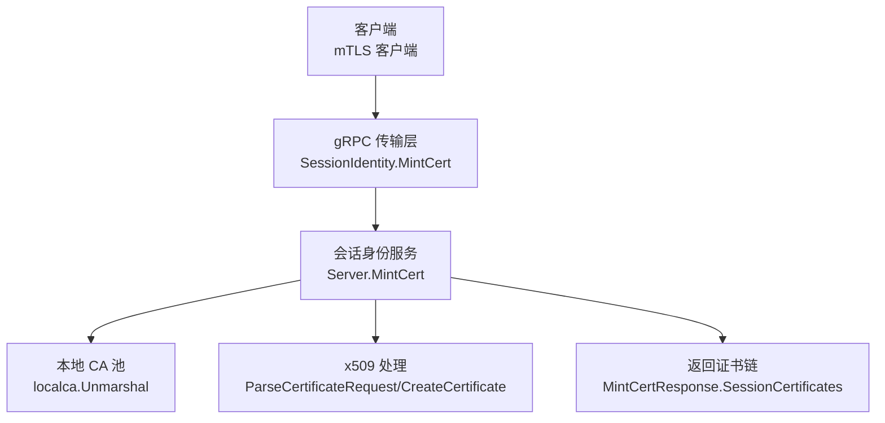
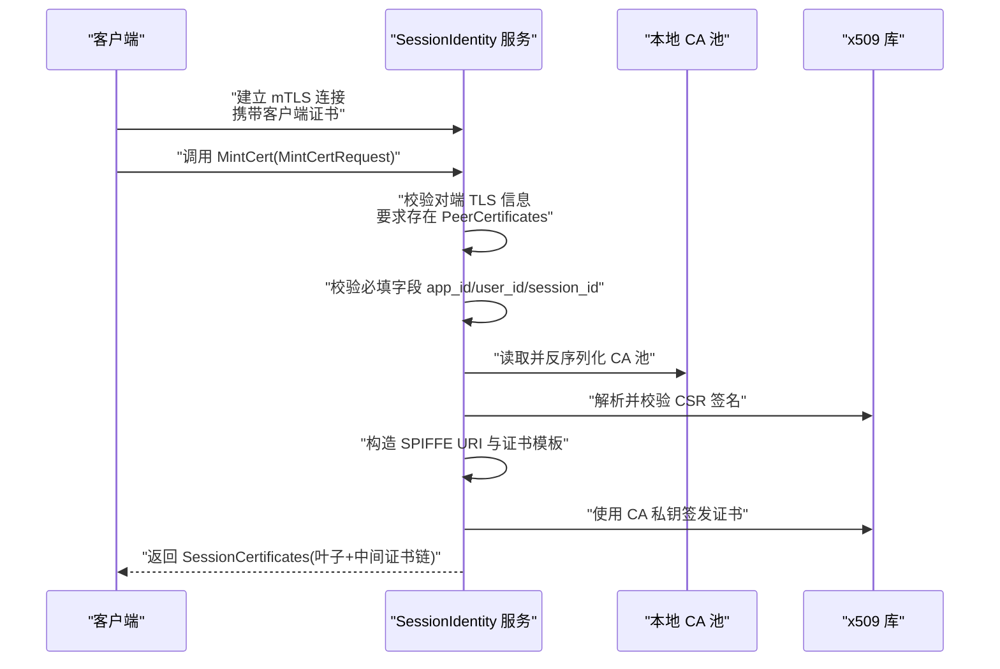
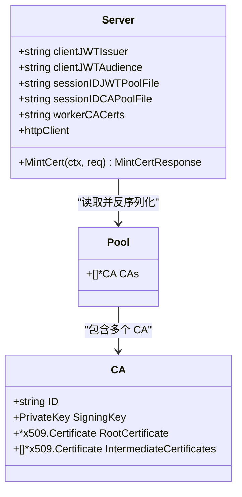
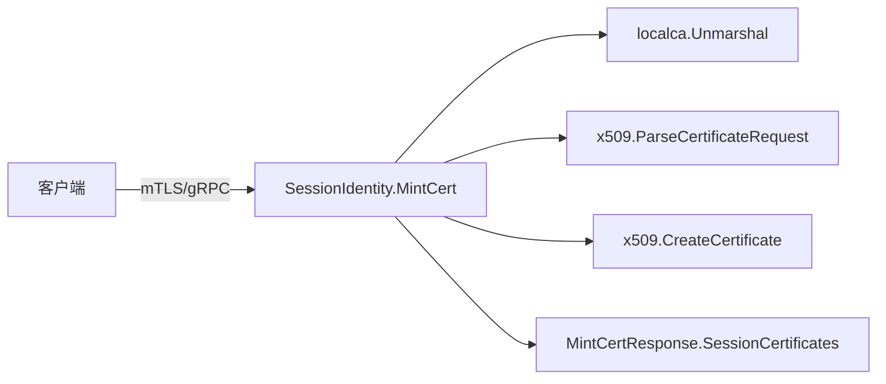

# 证书颁发

<cite>
**本文引用的文件**   
- [sessionidentity.go](file://cmd/ateapi/internal/sessionidentity/sessionidentity.go)
- [ateapi.proto](file://pkg/proto/ateapipb/ateapi.proto)
- [localca.go](file://internal/localca/localca.go)
</cite>

## 目录
1. [简介](#简介)
2. [项目结构](#项目结构)
3. [核心组件](#核心组件)
4. [架构总览](#架构总览)
5. [详细组件分析](#详细组件分析)
6. [依赖关系分析](#依赖关系分析)
7. [性能与可用性考虑](#性能与可用性考虑)
8. [故障排查指南](#故障排查指南)
9. [结论](#结论)
10. [附录：API 定义与示例](#附录api-定义与示例)

## 简介
本文件面向需要集成“证书颁发”能力的开发者，聚焦于 SessionIdentity 服务中的 MintCert RPC。内容涵盖：
- mTLS 双向认证在调用链中的作用
- CSR 解析与签名流程
- SPIFFE URI 的生成与证书模板配置（KeyUsage、ExtKeyUsage、BasicConstraints）
- CA 证书池管理与中间证书链构建
- 客户端如何申请并验证证书，以及 SPKI 指纹提取与证书轮换策略建议

## 项目结构
与证书颁发直接相关的代码位于以下位置：
- gRPC 接口与消息定义：pkg/proto/ateapipb/ateapi.proto
- 服务端实现：cmd/ateapi/internal/sessionidentity/sessionidentity.go
- 本地 CA 池序列化/反序列化与工具：internal/localca/localca.go

图表来源
- [sessionidentity.go:144-225](file://cmd/ateapi/internal/sessionidentity/sessionidentity.go#L144-L225)
- [ateapi.proto:358-416](file://pkg/proto/ateapipb/ateapi.proto#L358-L416)
- [localca.go:83-120](file://internal/localca/localca.go#L83-L120)

章节来源
- [sessionidentity.go:144-225](file://cmd/ateapi/internal/sessionidentity/sessionidentity.go#L144-L225)
- [ateapi.proto:358-416](file://pkg/proto/ateapipb/ateapi.proto#L358-L416)
- [localca.go:83-120](file://internal/localca/localca.go#L83-L120)

## 核心组件
- SessionIdentity 服务：提供 MintJWT 与 MintCert 两个 RPC。MintCert 用于基于 mTLS 的双向认证下发会话级证书。
- 本地 CA 池：以 JSON 形式持久化根证书、中间证书及私钥，支持多 CA 实例。
- x509 处理：负责解析 CSR、构造证书模板、执行签名。

章节来源
- [sessionidentity.go:144-225](file://cmd/ateapi/internal/sessionidentity/sessionidentity.go#L144-L225)
- [localca.go:30-51](file://internal/localca/localca.go#L30-L51)

## 架构总览
MintCert 的整体交互如下：

图表来源
- [sessionidentity.go:144-225](file://cmd/ateapi/internal/sessionidentity/sessionidentity.go#L144-L225)
- [ateapi.proto:400-416](file://pkg/proto/ateapipb/ateapi.proto#L400-L416)
- [localca.go:83-120](file://internal/localca/localca.go#L83-L120)

## 详细组件分析

### MintCert 方法工作原理
- 双向认证（mTLS）
  - 从上下文获取对端传输凭据，要求为 TLSInfo，且必须包含对端证书列表。若缺失则拒绝请求。
- 参数校验
  - 强制要求 app_id、user_id、session_id 非空，否则返回无效参数错误。
- CA 池加载
  - 从配置文件路径读取 CA 池 JSON，反序列化为 Pool；若为空或解析失败则返回内部错误。
- CSR 处理
  - 将请求体中的 DER 编码 CSR 解析为 x509.CertificateRequest，并校验其签名。
- 证书模板与 SPIFFE URI
  - 根据 app_id/user_id/session_id 拼接 SPIFFE URI，格式为 spiffe://substrate-session.local/app/{app}/user/{user}/session/{session}。
  - 证书模板设置：
    - URIs：包含上述 SPIFFE URI
    - NotBefore/NotAfter：相对当前时间的前后窗口
    - KeyUsage：数字签名
    - ExtKeyUsage：客户端认证
    - BasicConstraintsValid：true，IsCA：false
    - Issuer CN：固定值
- 证书签名与响应
  - 选择 CA 池中的第一个 CA，使用其 RootCertificate 与 SigningKey 对 CSR 公钥进行签名，得到叶子证书 DER。
  - 将叶子证书与所有中间证书按“叶子到根”的顺序放入 SessionCertificates 数组返回。

章节来源
- [sessionidentity.go:144-225](file://cmd/ateapi/internal/sessionidentity/sessionidentity.go#L144-L225)

### 类图（与服务相关的数据结构）

图表来源
- [sessionidentity.go:44-69](file://cmd/ateapi/internal/sessionidentity/sessionidentity.go#L44-L69)
- [localca.go:30-51](file://internal/localca/localca.go#L30-L51)

### API 消息定义（MintCertRequest / MintCertResponse）
- MintCertRequest
  - app_id：字符串，应用标识
  - user_id：字符串，用户标识
  - session_id：字符串，会话标识
  - certificate_signing_request：字节数组，DER 编码的 x509 CSR。签名者仅提取公钥，忽略其他内容。
- MintCertResponse
  - session_certificates：字节数组数组。首个元素为叶子证书 DER，后续为中间证书 DER，顺序为“叶子到根”。

章节来源
- [ateapi.proto:400-416](file://pkg/proto/ateapipb/ateapi.proto#L400-L416)

### SPIFFE URI 格式与证书模板配置
- SPIFFE URI 格式
  - scheme：spiffe
  - host：substrate-session.local
  - path：/app/{app_id}/user/{user_id}/session/{session_id}
- 证书模板关键属性
  - URIs：包含 SPIFFE URI
  - NotBefore/NotAfter：短生命周期（前推数分钟，后延约十五分钟）
  - KeyUsage：数字签名
  - ExtKeyUsage：客户端认证
  - BasicConstraintsValid：true，IsCA：false
  - Issuer CN：固定值

章节来源
- [sessionidentity.go:191-207](file://cmd/ateapi/internal/sessionidentity/sessionidentity.go#L191-L207)

### CA 证书池管理与中间证书链构建
- 数据结构
  - Pool：包含多个 CA
  - CA：包含 ID、私钥、根证书、可选的中间证书列表
- 序列化/反序列化
  - 支持 PKCS#8 或 PEM 格式的私钥与证书，支持中间证书的 DER 列表
- 中间证书链
  - 签发时，除叶子证书外，还会将 CA 中配置的中间证书一并返回，便于客户端构建完整信任链

章节来源
- [localca.go:30-51](file://internal/localca/localca.go#L30-L51)
- [localca.go:83-120](file://internal/localca/localca.go#L83-L120)

### 实际证书申请与验证示例（步骤说明）
以下为端到端操作步骤（不含具体代码片段）：
- 客户端准备
  - 生成密钥对（例如 ECDSA 或 RSA），创建 CSR，CSR 中可包含 Subject 信息（服务端会忽略，仅取公钥）。
  - 配置 mTLS 客户端，使用受信任的服务端 CA 证书建立连接。
- 发起 MintCert 请求
  - 通过 gRPC 调用 SessionIdentity.MintCert，传入 app_id、user_id、session_id 与 DER 编码的 CSR。
- 接收并安装证书链
  - 从 SessionCertificates 取出第一个元素作为叶子证书，其余为中间证书。
  - 将中间证书与已知的根证书组合成信任链，供后续 TLS 客户端使用。
- 验证证书
  - 使用根证书与中间证书构建 CertPool，验证叶子证书链是否有效。
  - 检查证书扩展：
    - URIs 中包含预期的 SPIFFE URI
    - ExtKeyUsage 包含客户端认证
    - IsCA 为 false
- 提取 SPKI 指纹（用于绑定或缓存）
  - 从叶子证书中提取公钥，计算其哈希摘要（如 SHA-256），作为该会话证书的 SPKI 指纹。
  - 可将指纹与 app_id/user_id/session_id 关联，用于快速识别与轮换策略。

[本节为概念性步骤说明，不直接分析具体文件]

### 证书轮换策略建议
- 短期有效期
  - 当前实现采用较短的有效期窗口，适合频繁轮换。
- 触发条件
  - 基于会话生命周期、安全策略或定期定时任务触发重新申请。
- 平滑过渡
  - 在旧证书过期前一段时间内并行持有新旧证书，确保无中断切换。
- 信任锚更新
  - 当 CA 根或中间证书轮换时，需同步更新客户端信任锚，避免验证失败。

[本节为通用实践建议，不直接分析具体文件]

## 依赖关系分析
- 服务端依赖
  - gRPC 传输层：用于承载 SessionIdentity.MintCert 请求
  - localca：用于加载 CA 池（JSON 序列化）
  - x509：用于解析 CSR、构造模板、签名
- 客户端依赖
  - mTLS 客户端库：用于建立双向认证连接
  - x509 验证库：用于验证返回的证书链

图表来源
- [sessionidentity.go:144-225](file://cmd/ateapi/internal/sessionidentity/sessionidentity.go#L144-L225)
- [localca.go:83-120](file://internal/localca/localca.go#L83-L120)

章节来源
- [sessionidentity.go:144-225](file://cmd/ateapi/internal/sessionidentity/sessionidentity.go#L144-L225)
- [localca.go:83-120](file://internal/localca/localca.go#L83-L120)

## 性能与可用性考虑
- 文件 I/O 开销
  - 每次请求都会读取并反序列化 CA 池文件。建议在进程内缓存 Pool，减少磁盘 I/O。
- 并发与锁
  - 若引入内存缓存，需注意并发访问与一致性（例如只读共享、写时复制）。
- 证书链长度
  - 中间证书数量会影响网络传输与客户端验证成本，应控制链长。
- 错误码与重试
  - 对于临时性错误（如文件读取失败），客户端应配合指数退避重试；对于参数错误不应重试。

[本节为通用指导，不直接分析具体文件]

## 故障排查指南
- 常见错误与定位
  - 未提供对端证书：检查 mTLS 客户端是否正确配置并携带证书。
  - 缺少必填字段：确认 app_id、user_id、session_id 均非空。
  - CA 池加载失败：检查配置文件路径与权限，确认 JSON 格式正确。
  - CSR 解析或签名校验失败：确认 CSR 为合法 DER 编码且由对应私钥签名。
  - 证书签名失败：检查 CA 私钥与根证书匹配，以及模板参数是否合理。
- 日志关键字
  - “Failed to load session CA”、“Failed to parse CSR”、“Failed to verify CSR signature”、“Failed to sign certificate”

章节来源
- [sessionidentity.go:144-225](file://cmd/ateapi/internal/sessionidentity/sessionidentity.go#L144-L225)

## 结论
MintCert 通过严格的 mTLS 双向认证与 CSR 校验，结合本地 CA 池签发短生命周期的会话证书，并以 SPIFFE URI 表达身份。返回的证书链便于客户端构建完整的信任路径。生产环境建议引入内存缓存、完善的轮换策略与监控告警，以提升可用性与安全性。

[本节为总结性内容，不直接分析具体文件]

## 附录：API 定义与示例

### gRPC 方法与消息
- 服务：SessionIdentity
  - RPC：MintCert
    - 入参：MintCertRequest
      - app_id：字符串
      - user_id：字符串
      - session_id：字符串
      - certificate_signing_request：DER 编码的 x509 CSR
    - 出参：MintCertResponse
      - session_certificates：DER 编码的证书数组（叶子在前，中间证书在后）

章节来源
- [ateapi.proto:358-416](file://pkg/proto/ateapipb/ateapi.proto#L358-L416)

### 证书模板与 SPIFFE URI 要点
- SPIFFE URI：spiffe://substrate-session.local/app/{app_id}/user/{user_id}/session/{session_id}
- KeyUsage：数字签名
- ExtKeyUsage：客户端认证
- BasicConstraintsValid：true，IsCA：false

章节来源
- [sessionidentity.go:191-207](file://cmd/ateapi/internal/sessionidentity/sessionidentity.go#L191-L207)

### CA 池结构与中间证书链
- Pool：包含多个 CA
- CA：ID、私钥、根证书、中间证书列表
- 序列化：支持 PKCS#8/PEM 私钥与证书，中间证书以 DER 列表存储

章节来源
- [localca.go:30-51](file://internal/localca/localca.go#L30-L51)
- [localca.go:83-120](file://internal/localca/localca.go#L83-L120)
