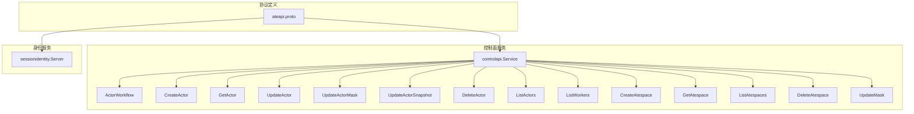
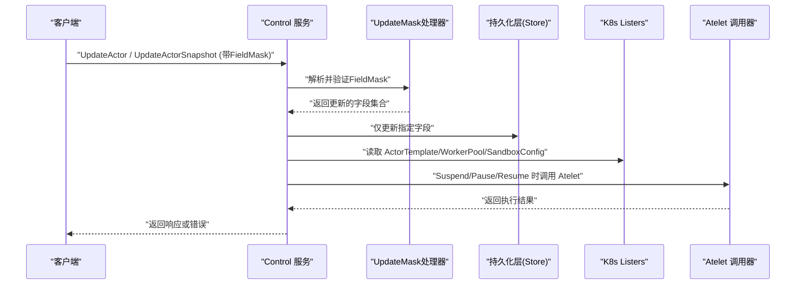
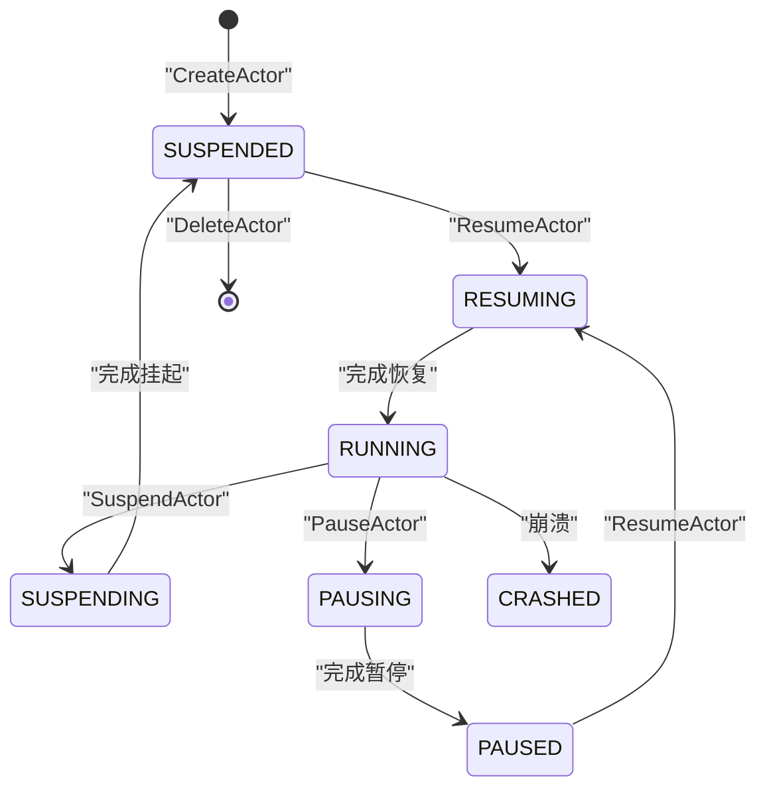
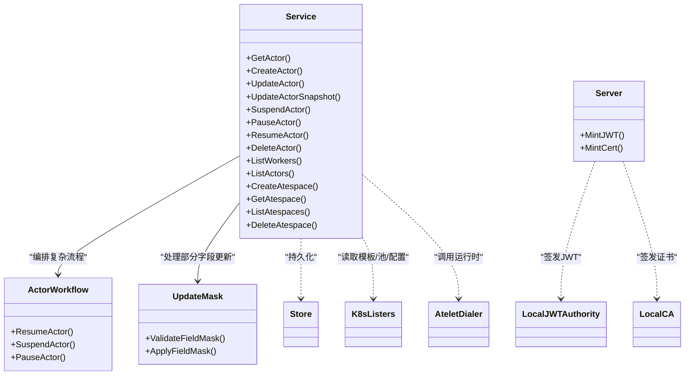
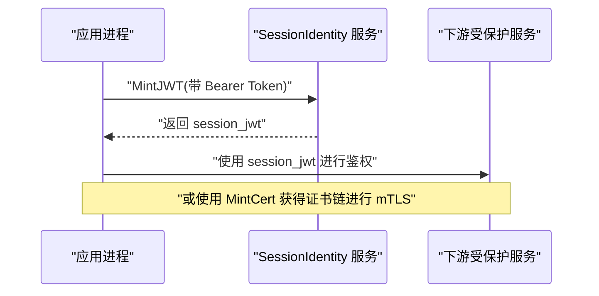

# gRPC API

<cite>
**本文引用的文件**   
- [pkg/proto/ateapipb/ateapi.proto](file://pkg/proto/ateapipb/ateapi.proto)
- [cmd/ateapi/internal/controlapi/service.go](file://cmd/ateapi/internal/controlapi/service.go)
- [cmd/ateapi/internal/controlapi/workflow.go](file://cmd/ateapi/internal/controlapi/workflow.go)
- [cmd/ateapi/internal/controlapi/create_actor.go](file://cmd/ateapi/internal/controlapi/create_actor.go)
- [cmd/ateapi/internal/controlapi/get_actor.go](file://cmd/ateapi/internal/controlapi/get_actor.go)
- [cmd/ateapi/internal/controlapi/update_actor.go](file://cmd/ateapi/internal/controlapi/update_actor.go)
- [cmd/ateapi/internal/controlapi/delete_actor.go](file://cmd/ateapi/internal/controlapi/delete_actor.go)
- [cmd/ateapi/internal/controlapi/list_actors.go](file://cmd/ateapi/internal/controlapi/list_actors.go)
- [cmd/ateapi/internal/controlapi/list_workers.go](file://cmd/ateapi/internal/controlapi/list_workers.go)
- [cmd/ateapi/internal/controlapi/create_atespace.go](file://cmd/ateapi/internal/controlapi/create_atespace.go)
- [cmd/ateapi/internal/controlapi/get_atespace.go](file://cmd/ateapi/internal/controlapi/get_atespace.go)
- [cmd/ateapi/internal/controlapi/list_atespaces.go](file://cmd/ateapi/internal/controlapi/list_atespaces.go)
- [cmd/ateapi/internal/controlapi/delete_atespace.go](file://cmd/ateapi/internal/controlapi/delete_atespace.go)
- [cmd/ateapi/internal/controlapi/update_mask.go](file://cmd/ateapi/internal/controlapi/update_mask.go)
- [cmd/ateapi/internal/controlapi/actor_snapshot.go](file://cmd/ateapi/internal/controlapi/actor_snapshot.go)
</cite>

## 更新摘要
**所做更改**
- 新增了update_mask机制用于Actor更新操作，支持部分字段更新
- 更新了UpdateActor方法的参数结构，引入FieldMask支持
- 新增UpdateActorSnapshot方法，支持快照的部分字段更新
- 增强了API的标准化和灵活性

## 目录
1. [简介](#简介)
2. [项目结构](#项目结构)
3. [核心组件](#核心组件)
4. [架构总览](#架构总览)
5. [详细组件分析](#详细组件分析)
6. [依赖关系分析](#依赖关系分析)
7. [性能与一致性](#性能与一致性)
8. [故障排查指南](#故障排查指南)
9. [结论](#结论)
10. [附录：客户端连接与认证示例](#附录客户端连接与认证示例)

## 简介
本参考文档面向使用 Agentic Substrate gRPC Control 服务的开发者，提供完整的接口规范、消息类型定义、错误码说明、状态转换图以及客户端连接与认证配置示例。服务包含三类能力：
- Actor 生命周期管理：创建、查询、更新、挂起、暂停、恢复、删除
- **新增**：基于FieldMask的部分字段更新机制，支持精确控制更新范围
- 列表查询：列出 Worker 与 Actor
- Atespace（命名空间）CRUD：创建、获取、列出、删除
- SessionIdentity：为运行中的工作负载颁发会话级 JWT 与证书

## 项目结构
gRPC 协议定义位于 pkg/proto/ateapipb/ateapi.proto；Control 服务实现位于 cmd/ateapi/internal/controlapi/*；SessionIdentity 服务实现位于 cmd/ateapi/internal/sessionidentity/sessionidentity.go。**新增的update_mask机制**由专门的update_mask.go文件处理。

**图表来源**
- [pkg/proto/ateapipb/ateapi.proto:26-65](file://pkg/proto/ateapipb/ateapi.proto#L26-L65)
- [cmd/ateapi/internal/controlapi/service.go:25-56](file://cmd/ateapi/internal/controlapi/service.go#L25-L56)
- [cmd/ateapi/internal/controlapi/update_mask.go:1-50](file://cmd/ateapi/internal/controlapi/update_mask.go#L1-L50)

## 核心组件
- Control 服务：暴露 Actor、Worker、Atespace 的 RPC 方法，内部通过持久化层与调度器交互，复杂操作由 ActorWorkflow 编排。
- **新增**：UpdateMask 处理器，支持基于FieldMask的部分字段更新
- SessionIdentity 服务：基于 Bearer Token 或 mTLS 认证，签发会话级 JWT 与证书。

**章节来源**
- [pkg/proto/ateapipb/ateapi.proto:26-65](file://pkg/proto/ateapipb/ateapi.proto#L26-L65)
- [cmd/ateapi/internal/controlapi/service.go:25-56](file://cmd/ateapi/internal/controlapi/service.go#L25-L56)
- [cmd/ateapi/internal/controlapi/update_mask.go:1-50](file://cmd/ateapi/internal/controlapi/update_mask.go#L1-L50)

## 架构总览
下图展示了 Control 服务在典型调用路径中与持久化层、Kubernetes 资源列表器、Atelet 等组件的交互关系。**新增的update_mask机制**在处理部分字段更新时提供了更精细的控制。

**图表来源**
- [cmd/ateapi/internal/controlapi/service.go:25-56](file://cmd/ateapi/internal/controlapi/service.go#L25-L56)
- [cmd/ateapi/internal/controlapi/update_mask.go:1-50](file://cmd/ateapi/internal/controlapi/update_mask.go#L1-L50)
- [cmd/ateapi/internal/controlapi/workflow.go:131-163](file://cmd/ateapi/internal/controlapi/workflow.go#L131-163)

## 详细组件分析

### Control 服务：Actor 生命周期管理

#### GetActor
- 功能：按 ObjectRef 获取 Actor 详情。
- 请求参数
  - actor: ObjectRef（必填）
    - atespace: string（可选，空表示全局作用域）
    - name: string（必填）
- 响应
  - Actor：包含元数据、模板引用、状态、调度信息、快照信息等
- 错误码
  - InvalidArgument：actor 为空或字段不合法
  - NotFound：未找到 Actor
  - Internal：数据库访问异常

**章节来源**
- [pkg/proto/ateapipb/ateapi.proto:207-209](file://pkg/proto/ateapipb/ateapi.proto#L207-L209)
- [cmd/ateapi/internal/controlapi/get_actor.go:30-57](file://cmd/ateapi/internal/controlapi/get_actor.go#L30-L57)

#### CreateActor
- 功能：基于 ActorTemplate 创建新 Actor，初始状态为 SUSPENDED。
- 请求参数
  - actor: Actor（必填）
    - metadata.atespace: string（必填，资源名校验）
    - metadata.name: string（必填，资源名校验）
    - actor_template_namespace: string（必填，DNS-1123 label）
    - actor_template_name: string（必填，DNS-1123 subdomain）
    - worker_selector: Selector（可选）
- 响应
  - Actor：已创建的 Actor
- 错误码
  - InvalidArgument：字段校验失败
  - FailedPrecondition：ActorTemplate 不存在或 Atespace 不存在
  - AlreadyExists：同名 Actor 已存在
  - Internal：存储异常

**章节来源**
- [pkg/proto/ateapipb/ateapi.proto:212-215](file://pkg/proto/ateapipb/ateapi.proto#L212-L215)
- [cmd/ateapi/internal/controlapi/create_actor.go:32-82](file://cmd/ateapi/internal/controlapi/create_actor.go#L32-L82)

#### UpdateActor
- 功能：**更新** Actor 的可变字段，**现在支持基于FieldMask的部分字段更新**。变更在下一次 ResumeActor 生效。
- 请求参数
  - actor: ObjectRef（必填）
  - **new_fields**: Actor（可选，当提供FieldMask时使用）
  - **field_mask**: FieldMask（可选，指定要更新的字段路径）
- 响应
  - UpdateActorResponse.actor: Actor
- 错误码
  - InvalidArgument：字段校验失败或FieldMask无效
  - NotFound：Actor 不存在
  - Aborted：并发更新冲突（需重试）
  - Internal：存储异常

**更新** 新增了FieldMask支持，允许精确控制要更新的字段，提高API的灵活性和效率。

**章节来源**
- [pkg/proto/ateapipb/ateapi.proto:218-230](file://pkg/proto/ateapipb/ateapi.proto#L218-L230)
- [cmd/ateapi/internal/controlapi/update_actor.go:30-73](file://cmd/ateapi/internal/controlapi/update_actor.go#L30-73)
- [cmd/ateapi/internal/controlapi/update_mask.go:1-50](file://cmd/ateapi/internal/controlapi/update_mask.go#L1-L50)

#### UpdateActorSnapshot
- 功能：**新增** 更新 Actor 快照的部分字段，支持基于FieldMask的精确更新。
- 请求参数
  - actor: ObjectRef（必填）
  - snapshot: ActorSnapshot（可选，当提供FieldMask时使用）
  - field_mask: FieldMask（可选，指定要更新的快照字段路径）
- 响应
  - UpdateActorSnapshotResponse.snapshot: ActorSnapshot
- 错误码
  - InvalidArgument：字段校验失败或FieldMask无效
  - NotFound：Actor 不存在
  - Aborted：并发更新冲突（需重试）
  - Internal：存储异常

**新增** 此方法为快照更新提供了与Actor更新相同的FieldMask机制，确保API的一致性。

**章节来源**
- [pkg/proto/ateapipb/ateapi.proto:232-238](file://pkg/proto/ateapipb/ateapi.proto#L232-L238)
- [cmd/ateapi/internal/controlapi/actor_snapshot.go:1-100](file://cmd/ateapi/internal/controlapi/actor_snapshot.go#L1-L100)

#### SuspendActor
- 功能：将运行中 Actor 挂起到最新快照，进入 SUSPENDED 状态。
- 请求参数
  - actor: ObjectRef（必填）
- 响应
  - SuspendActorResponse.actor: Actor
- 错误码
  - FailedPrecondition：前置条件不满足（如状态不允许）
  - Aborted：并发操作冲突（锁竞争）
  - Internal：持久化或 Atelet 调用异常

**章节来源**
- [pkg/proto/ateapipb/ateapi.proto:232-238](file://pkg/proto/ateapipb/ateapi.proto#L232-L238)
- [cmd/ateapi/internal/controlapi/workflow.go:196-224](file://cmd/ateapi/internal/controlapi/workflow.go#L196-L224)

#### PauseActor
- 功能：暂停 Actor，保留本地快照于节点 VM，进入 PAUSED 状态。
- 请求参数
  - actor: ObjectRef（必填）
- 响应
  - PauseActorResponse.actor: Actor
- 错误码
  - FailedPrecondition：前置条件不满足
  - Aborted：并发操作冲突
  - Internal：持久化或 Atelet 调用异常

**章节来源**
- [pkg/proto/ateapipb/ateapi.proto:240-246](file://pkg/proto/ateapipb/ateapi.proto#L240-L246)
- [cmd/ateapi/internal/controlapi/workflow.go:226-254](file://cmd/ateapi/internal/controlapi/workflow.go#L226-L254)

#### ResumeActor
- 功能：从最新快照恢复 Actor，可指定 boot=true 跳过黄金快照直接启动。
- 请求参数
  - actor: ObjectRef（必填）
  - boot: bool（可选）
- 响应
  - ResumeActorResponse.actor: Actor
- 错误码
  - FailedPrecondition：前置条件不满足
  - Aborted：并发操作冲突
  - Internal：持久化或 Atelet 调用异常

**章节来源**
- [pkg/proto/ateapipb/ateapi.proto:248-257](file://pkg/proto/ateapipb/ateapi.proto#L248-L257)
- [cmd/ateapi/internal/controlapi/workflow.go:165-194](file://cmd/ateapi/internal/controlapi/workflow.go#L165-L194)

#### DeleteActor
- 功能：删除 Actor，仅允许删除处于 SUSPENDED 状态的 Actor。
- 请求参数
  - actor: ObjectRef（必填）
- 响应
  - Actor：被删除的 Actor
- 错误码
  - InvalidArgument：字段校验失败
  - NotFound：Actor 不存在
  - FailedPrecondition：Actor 非 SUSPENDED 状态
  - Aborted：并发更新冲突
  - Internal：存储异常

**章节来源**
- [pkg/proto/ateapipb/ateapi.proto:259-261](file://pkg/proto/ateapipb/ateapi.proto#L259-L261)
- [cmd/ateapi/internal/controlapi/delete_actor.go:30-71](file://cmd/ateapi/internal/controlapi/delete_actor.go#L30-L71)

#### Actor 状态机

**图表来源**
- [pkg/proto/ateapipb/ateapi.proto:124-134](file://pkg/proto/ateapipb/ateapi.proto#L124-L134)
- [cmd/ateapi/internal/controlapi/workflow.go:165-254](file://cmd/ateapi/internal/controlapi/workflow.go#L165-L254)

### Control 服务：列表查询

#### ListWorkers
- 功能：分页列出所有 Worker。
- 请求参数
  - page_size: int32（>=0，默认由服务端决定，超过上限会被裁剪）
  - page_token: string（首次为空）
- 响应
  - workers: repeated Worker
  - next_page_token: string（末页为空）
- 错误码
  - InvalidArgument：page_size < 0

**章节来源**
- [pkg/proto/ateapipb/ateapi.proto:263-280](file://pkg/proto/ateapipb/ateapi.proto#L263-L280)
- [cmd/ateapi/internal/controlapi/list_workers.go:27-54](file://cmd/ateapi/internal/controlapi/list_workers.go#L27-L54)

#### ListActors
- 功能：分页列出 Actor，可按 atespace 过滤；空 atespace 表示列出全部。
- 请求参数
  - atespace: string（可选）
  - page_size: int32（>=0，默认由服务端决定，超过上限会被裁剪）
  - page_token: string（首次为空）
- 响应
  - actors: repeated Actor
  - next_page_token: string（末页为空）
- 错误码
  - InvalidArgument：page_size < 0 或 atespace 非法

**章节来源**
- [pkg/proto/ateapipb/ateapi.proto:284-304](file://pkg/proto/ateapipb/ateapi.proto#L284-L304)
- [cmd/ateapi/internal/controlapi/list_actors.go:39-73](file://cmd/ateapi/internal/controlapi/list_actors.go#L39-L73)

### Control 服务：Atespace 管理（CRUD）

#### CreateAtespace
- 功能：创建全局作用域的 Atespace。
- 请求参数
  - atespace: Atespace（必填）
    - metadata.atespace: 必须为空（全局资源）
    - metadata.name: 必填且合法
- 响应
  - Atespace：已创建的 Atespace
- 错误码
  - InvalidArgument：字段校验失败
  - AlreadyExists：同名 Atespace 已存在
  - Internal：存储异常

**章节来源**
- [pkg/proto/ateapipb/ateapi.proto:175-178](file://pkg/proto/ateapipb/ateapi.proto#L175-L178)
- [cmd/ateapi/internal/controlapi/create_atespace.go:30-78](file://cmd/ateapi/internal/controlapi/create_atespace.go#L30-L78)

#### GetAtespace
- 功能：按名称获取 Atespace。
- 请求参数
  - atespace: ObjectRef（必填，全局作用域）
- 响应
  - Atespace
- 错误码
  - InvalidArgument：字段校验失败
  - NotFound：未找到
  - Internal：存储异常

**章节来源**
- [pkg/proto/ateapipb/ateapi.proto:180-182](file://pkg/proto/ateapipb/ateapi.proto#L180-L182)
- [cmd/ateapi/internal/controlapi/get_atespace.go:30-60](file://cmd/ateapi/internal/controlapi/get_atespace.go#L30-L60)

#### ListAtespaces
- 功能：分页列出所有 Atespace。
- 请求参数
  - page_size: int32（>=0，默认由服务端决定，超过上限会被裁剪）
  - page_token: string（首次为空）
- 响应
  - atespaces: repeated Atespace
  - next_page_token: string（末页为空）
- 错误码
  - InvalidArgument：page_size < 0

**章节来源**
- [pkg/proto/ateapipb/ateapi.proto:184-201](file://pkg/proto/ateapipb/ateapi.proto#L184-L201)
- [cmd/ateapi/internal/controlapi/list_atespaces.go:27-54](file://cmd/ateapi/internal/controlapi/list_atespaces.go#L27-L54)

#### DeleteAtespace
- 功能：删除空的 Atespace；若仍有 Actor 则拒绝。
- 请求参数
  - atespace: ObjectRef（必填，全局作用域）
- 响应
  - Atespace：被删除的 Atespace
- 错误码
  - InvalidArgument：字段校验失败
  - NotFound：未找到
  - FailedPrecondition：Atespace 非空
  - Internal：存储异常

**章节来源**
- [pkg/proto/ateapipb/ateapi.proto:203-205](file://pkg/proto/ateapipb/ateapi.proto#L203-L205)
- [cmd/ateapi/internal/controlapi/delete_atespace.go:30-64](file://cmd/ateapi/internal/controlapi/delete_atespace.go#L30-L64)

### SessionIdentity 服务：JWT 与证书颁发

#### MintJWT
- 功能：为当前 Pod 的工作负载签发会话级 JWT。
- 认证方式
  - Authorization: Bearer <k8s SA token>
- 请求参数
  - audience: repeated string（至少一个）
  - app_id: string
  - user_id: string
  - session_id: string
- 响应
  - session_jwt: string（OIDC Discovery 兼容 JWT）
- 错误码
  - Unauthenticated：缺少或无效授权头/令牌
  - Internal：签名密钥加载或签名失败

**章节来源**
- [pkg/proto/ateapipb/ateapi.proto:358-398](file://pkg/proto/ateapipb/ateapi.proto#L358-L398)
- [cmd/ateapi/internal/sessionidentity/sessionidentity.go:71-142](file://cmd/ateapi/internal/sessionidentity/sessionidentity.go#L71-L142)

#### MintCert
- 功能：为当前 Pod 的工作负载签发会话级证书链（mTLS）。
- 认证方式
  - mTLS（客户端证书）
- 请求参数
  - app_id: string（必填）
  - user_id: string（必填）
  - session_id: string（必填）
  - certificate_signing_request: bytes（CSR DER）
- 响应
  - session_certificates: repeated bytes（首项为叶子证书，后续为中间证书）
- 错误码
  - Unauthenticated：非 mTLS 或缺少客户端证书
  - InvalidArgument：必填字段缺失
  - Internal：CA 池加载、CSR 解析或签名失败

**章节来源**
- [pkg/proto/ateapipb/ateapi.proto:400-416](file://pkg/proto/ateapipb/ateapi.proto#L400-L416)
- [cmd/ateapi/internal/sessionidentity/sessionidentity.go:144-225](file://cmd/ateapi/internal/sessionidentity/sessionidentity.go#L144-L225)

## 依赖关系分析
- Control 服务依赖：
  - 持久化层（store.Interface）：Actor/Atespace 的 CRUD 与分页
  - Kubernetes Listers：ActorTemplate、WorkerPool、SandboxConfig
  - AteletDialer：与运行时节点通信以执行挂起/暂停/恢复
  - 分布式锁：用于并发安全（基于 store.AcquireLock/ReleaseLock）
  - **新增**：UpdateMask处理器：处理FieldMask验证和应用
- SessionIdentity 服务依赖：
  - k8sjwt：验证客户端 Bearer Token
  - localjwtauthority/localca：签发 JWT 与证书
  - HTTP 客户端：访问 K8s 元数据或 JWKS

**图表来源**
- [cmd/ateapi/internal/controlapi/service.go:25-56](file://cmd/ateapi/internal/controlapi/service.go#L25-L56)
- [cmd/ateapi/internal/controlapi/workflow.go:131-163](file://cmd/ateapi/internal/controlapi/workflow.go#L131-L163)
- [cmd/ateapi/internal/controlapi/update_mask.go:1-50](file://cmd/ateapi/internal/controlapi/update_mask.go#L1-L50)
- [cmd/ateapi/internal/sessionidentity/sessionidentity.go:43-69](file://cmd/ateapi/internal/sessionidentity/sessionidentity.go#L43-L69)

**章节来源**
- [cmd/ateapi/internal/controlapi/service.go:25-56](file://cmd/ateapi/internal/controlapi/service.go#L25-L56)
- [cmd/ateapi/internal/controlapi/workflow.go:131-163](file://cmd/ateapi/internal/controlapi/workflow.go#L131-L163)
- [cmd/ateapi/internal/controlapi/update_mask.go:1-50](file://cmd/ateapi/internal/controlapi/update_mask.go#L1-L50)
- [cmd/ateapi/internal/sessionidentity/sessionidentity.go:43-69](file://cmd/ateapi/internal/sessionidentity/sessionidentity.go#L43-L69)

## 性能与一致性
- 分页限制：page_size 最大 1000，超出将被裁剪；未设置时使用服务端默认值。
- 幂等性与并发：
  - Actor 关键操作通过分布式锁保证同一时刻只有一个工作流在执行。
  - 更新冲突返回 Aborted，客户端应退避重试。
  - **新增**：FieldMask更新提供更细粒度的并发控制，减少不必要的锁竞争。
- 一致性语义：
  - ListActors 提供"软"一致性：分页期间可能遗漏或重复条目。
  - **新增**：部分字段更新保持原子性，确保数据一致性。
- 超时与回退：
  - 工作流上下文在锁 TTL 前过期，避免长时间持有锁。

**章节来源**
- [cmd/ateapi/internal/controlapi/list_actors.go:28-37](file://cmd/ateapi/internal/controlapi/list_actors.go#L28-L37)
- [cmd/ateapi/internal/controlapi/workflow.go:256-279](file://cmd/ateapi/internal/controlapi/workflow.go#L256-L279)
- [cmd/ateapi/internal/controlapi/update_actor.go:44-50](file://cmd/ateapi/internal/controlapi/update_actor.go#L44-L50)
- [cmd/ateapi/internal/controlapi/update_mask.go:1-50](file://cmd/ateapi/internal/controlapi/update_mask.go#L1-L50)

## 故障排查指南
- 常见错误码与定位
  - InvalidArgument：检查 ObjectRef、Selector、page_size、FieldMask 等字段合法性
  - NotFound：确认资源是否存在与作用域是否正确
  - FailedPrecondition：检查前置条件（如 Actor 状态、Atespace 是否为空、模板是否存在）
  - AlreadyExists：资源已存在，避免重复创建
  - Aborted：并发冲突，建议指数退避重试
  - Unauthenticated：认证头缺失或无效（Bearer Token 或 mTLS）
- **新增**：FieldMask相关错误
  - 检查FieldMask语法是否正确
  - 确认指定的字段路径是否有效
  - 验证字段类型是否与目标字段匹配
- 日志与追踪
  - 工作流步骤会生成 OpenTelemetry span，便于定位失败步骤
  - **新增**：FieldMask应用过程也会记录详细的更新日志
- 调试工具
  - Debug 服务可用于开发环境清理数据（生产禁用）

**章节来源**
- [cmd/ateapi/internal/controlapi/create_actor.go:84-129](file://cmd/ateapi/internal/controlapi/create_actor.go#L84-L129)
- [cmd/ateapi/internal/controlapi/delete_actor.go:30-55](file://cmd/ateapi/internal/controlapi/delete_actor.go#L30-L55)
- [cmd/ateapi/internal/sessionidentity/sessionidentity.go:71-142](file://cmd/ateapi/internal/sessionidentity/sessionidentity.go#L71-L142)
- [cmd/ateapi/internal/sessionidentity/sessionidentity.go:144-225](file://cmd/ateapi/internal/sessionidentity/sessionidentity.go#L144-L225)
- [cmd/ateapi/internal/controlapi/update_mask.go:1-50](file://cmd/ateapi/internal/controlapi/update_mask.go#L1-L50)

## 结论
本参考文档系统化梳理了 Control 与 SessionIdentity 两大服务的 gRPC 接口、消息模型、错误处理与状态转换，并提供了性能与一致性要点及故障排查指引。**新增的update_mask机制**显著提升了API的灵活性和效率，支持精确的部分字段更新。结合附录的连接与认证示例，读者可以快速集成并稳定使用这些 API。

## 附录：客户端连接与认证示例

### 通用连接配置
- 目标地址：Control 服务 gRPC 端点
- 传输安全：根据部署选择 TLS 或内网明文（推荐 TLS）
- 超时与重试：为长耗时操作（如 Resume/Suspend/Pause）设置合理超时与重试策略

### 认证方式一：Bearer Token（MintJWT）
- 适用场景：向 SessionIdentity.MintJWT 请求会话 JWT
- 设置方式
  - 在 gRPC 元数据中添加键 authorization，值为 "Bearer <token>"
- 注意事项
  - token 应为有效的 Kubernetes ServiceAccount Token
  - 服务端会校验 issuer 与 audience

**章节来源**
- [cmd/ateapi/internal/sessionidentity/sessionidentity.go:71-90](file://cmd/ateapi/internal/sessionidentity/sessionidentity.go#L71-L90)

### 认证方式二：mTLS（MintCert）
- 适用场景：向 SessionIdentity.MintCert 请求会话证书
- 设置方式
  - 配置 gRPC 客户端 TLS，携带客户端证书与私钥
- 注意事项
  - 服务端要求 PeerCertificates 非空
  - CSR 需有效且签名正确

**章节来源**
- [cmd/ateapi/internal/sessionidentity/sessionidentity.go:144-157](file://cmd/ateapi/internal/sessionidentity/sessionidentity.go#L144-L157)

### 调用序列示例（概念性）

[此图为概念性流程图，无需图表来源]

### 新增：FieldMask使用示例
- **部分字段更新**：只更新Actor的worker_selector字段
- **快照更新**：只更新ActorSnapshot的特定字段
- **字段路径语法**：支持嵌套字段的路径表示法

**章节来源**
- [cmd/ateapi/internal/controlapi/update_mask.go:1-50](file://cmd/ateapi/internal/controlapi/update_mask.go#L1-L50)
- [pkg/proto/ateapipb/ateapi.proto:218-230](file://pkg/proto/ateapipb/ateapi.proto#L218-L230)
