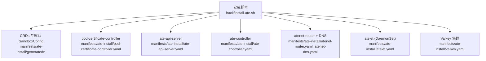
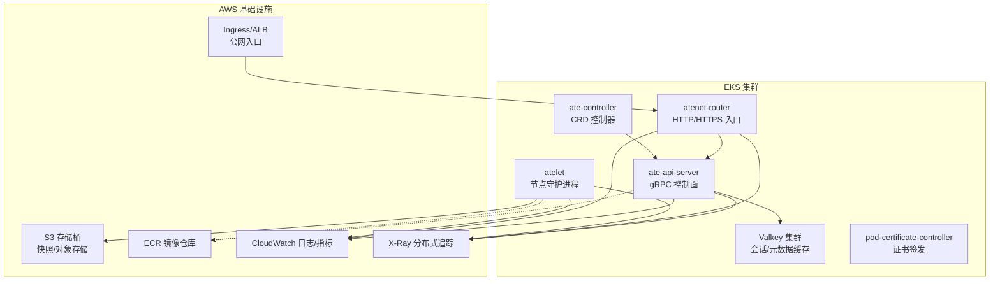
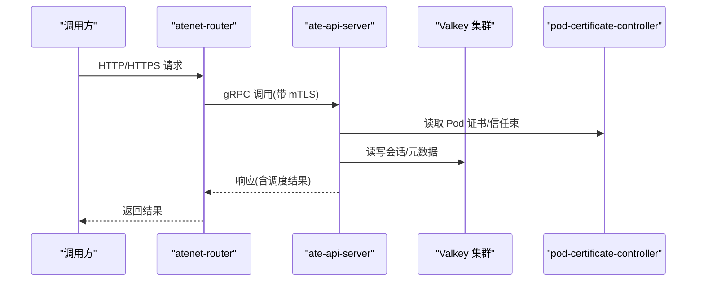
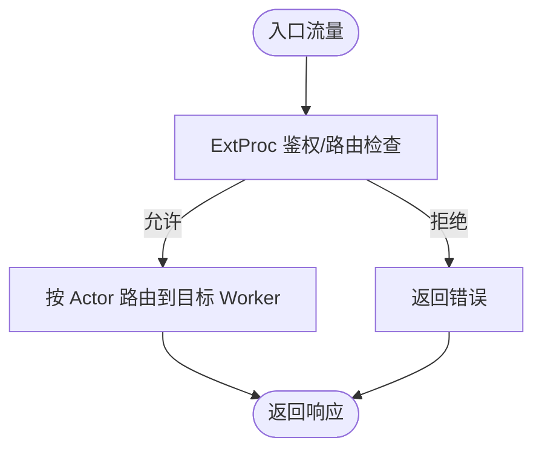
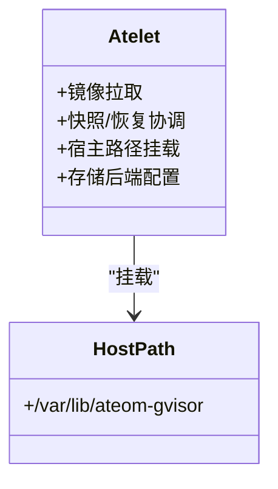
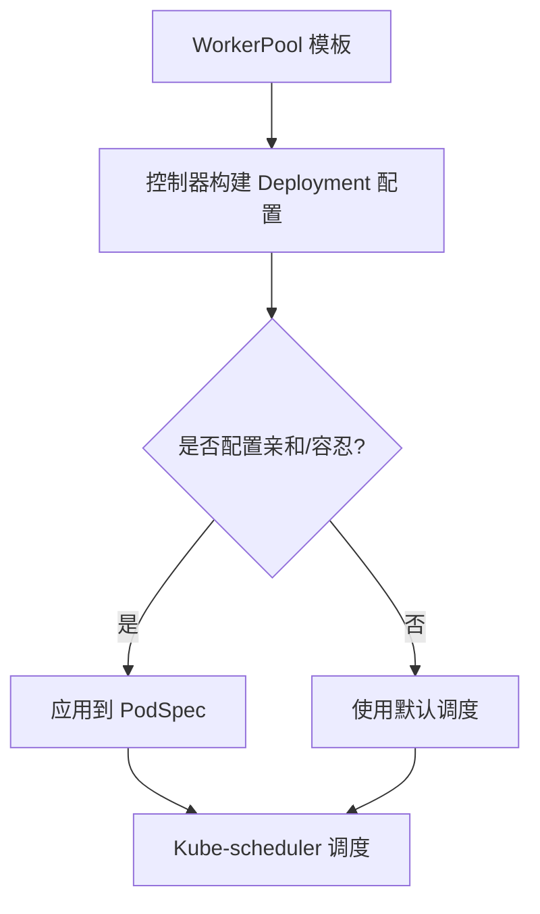
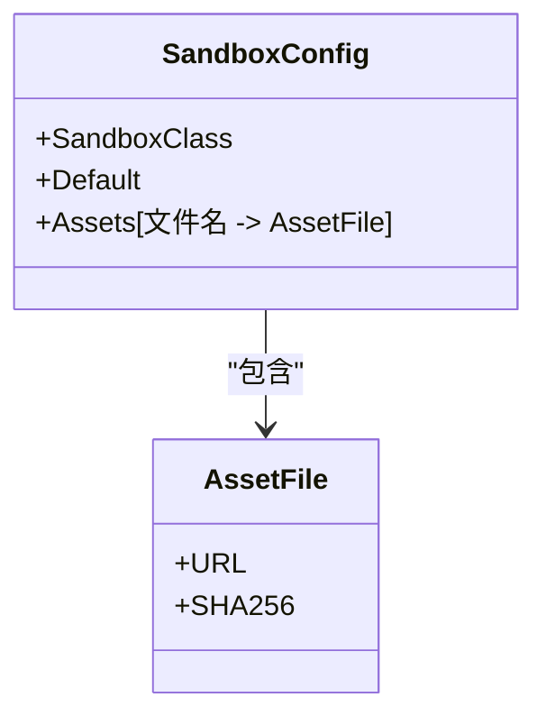
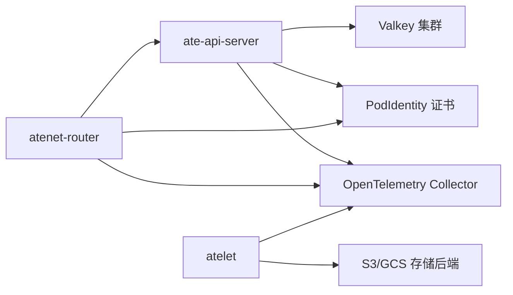

# Amazon Web Services (AWS) 部署

<cite>
**本文引用的文件**   
- [README.md](file://README.md)
- [install-ate.sh](file://hack/install-ate.sh)
- [teardown.sh](file://hack/teardown.sh)
- [setup-gcp/main.go](file://tools/setup-gcp/main.go)
- [ate-api-server.yaml](file://manifests/ate-install/ate-api-server.yaml)
- [atelet.yaml](file://manifests/ate-install/atelet.yaml)
- [atenet-router.yaml](file://manifests/ate-install/atenet-router.yaml)
- [workerpool_apply_test.go](file://cmd/atecontroller/internal/controllers/workerpool_apply_test.go)
- [sandboxconfig_types.go](file://pkg/api/v1alpha1/sandboxconfig_types.go)
- [actortemplate_types.go](file://pkg/api/v1alpha1/actortemplate_types.go)
- [zz_generated.deepcopy.go](file://pkg/api/v1alpha1/zz_generated.deepcopy.go)
- [go.sum](file://go.sum)
</cite>

## 目录
1. [简介](#简介)
2. [项目结构](#项目结构)
3. [核心组件](#核心组件)
4. [架构总览](#架构总览)
5. [详细组件分析](#详细组件分析)
6. [依赖分析](#依赖分析)
7. [性能与扩缩容建议](#性能与扩缩容建议)
8. [监控与可观测性](#监控与可观测性)
9. [安全与身份](#安全与身份)
10. [存储后端（S3/GCS）](#存储后端s3gcs)
11. [网络与负载均衡](#网络与负载均衡)
12. [成本优化建议](#成本优化建议)
13. [故障排查指南](#故障排查指南)
14. [结论](#结论)

## 简介
本指南面向在 Amazon Web Services (AWS) 生产环境部署 Agent Substrate 的工程师，聚焦 EKS 集群上的完整流程：包括 IAM 角色、VPC 网络、Elastic Container Registry (ECR) 集成、S3 存储后端配置、Pod Identity、网络安全组、负载均衡器、实例类型与 Spot 策略、自动扩缩容、CloudWatch 监控与 X-Ray 分布式追踪，以及迁移与成本优化建议。

说明：仓库中提供了 GKE 快速开始与 GCP 工具链，但本指南将把相同能力映射到 AWS/EKS 生态，确保在不修改源码的前提下完成生产级部署。

## 项目结构
Agent Substrate 由多个控制面与工作节点组件构成，并通过 Kustomize/ko 进行构建与部署。关键入口与清单如下：
- 安装脚本：提供一键部署系统组件、示例应用与基准测试的能力
- 清单文件：定义 ate-api-server、atelet、atenet-router 等核心组件的 Deployment/DaemonSet/Service/RBAC
- API 类型：ActorTemplate、WorkerPool、SandboxConfig 等 CRD 定义
- 控制器：根据 WorkerPool 生成并管理底层 Deployment/Pod 资源

图表来源
- [install-ate.sh:267-310](file://hack/install-ate.sh#L267-L310)
- [ate-api-server.yaml:59-185](file://manifests/ate-install/ate-api-server.yaml#L59-L185)
- [atelet.yaml:46-126](file://manifests/ate-install/atelet.yaml#L46-L126)
- [atenet-router.yaml:102-216](file://manifests/ate-install/atenet-router.yaml#L102-L216)

章节来源
- [README.md:97-175](file://README.md#L97-L175)
- [install-ate.sh:267-310](file://hack/install-ate.sh#L267-L310)

## 核心组件
- ate-api-server：控制面 gRPC 服务，负责 Actor/Worker 生命周期管理与路由决策；通过 PodIdentity 获取证书，连接 Valkey 缓存，暴露 Prometheus 指标端口
- ate-controller：Kubernetes Controller，根据 WorkerPool/ActorTemplate 等 CRD 生成 Deployment 等资源
- atenet-router：网络控制器，驱动 Envoy 动态配置，提供 HTTP/HTTPS 入口与 ExtProc 鉴权/路由
- atelet：节点级守护进程，负责镜像拉取、快照/恢复协调、宿主机路径挂载等
- pod-certificate-controller：签发 Pod 证书与信任束，为 ate-api-server 与 atenet-router 提供 mTLS 凭据

章节来源
- [README.md:211-225](file://README.md#L211-L225)
- [ate-api-server.yaml:59-185](file://manifests/ate-install/ate-api-server.yaml#L59-L185)
- [atenet-router.yaml:102-216](file://manifests/ate-install/atenet-router.yaml#L102-L216)
- [atelet.yaml:46-126](file://manifests/ate-install/atelet.yaml#L46-L126)

## 架构总览
下图展示了在 EKS 上部署后的主要交互关系：外部流量经 Ingress/ALB 进入 atenet-router，再由其通过 ExtProc 与 ate-api-server 协作完成会话调度与转发；工作节点由 atelet 管理，持久化状态通过 S3/GCS 后端保存。

图表来源
- [atenet-router.yaml:102-216](file://manifests/ate-install/atenet-router.yaml#L102-L216)
- [ate-api-server.yaml:59-185](file://manifests/ate-install/ate-api-server.yaml#L59-L185)
- [atelet.yaml:46-126](file://manifests/ate-install/atelet.yaml#L46-L126)

## 详细组件分析

### ate-api-server（控制面）
- 功能要点
  - 监听 gRPC 端口，使用 PodIdentity 注入的证书进行双向 TLS
  - 连接 Valkey 集群（支持 TLS、IAM 认证开关、ServerName 校验、客户端证书）
  - 暴露 Prometheus 指标端点，输出 OpenTelemetry 遥测
- 关键配置项（来自清单与环境变量）
  - gRPC 监听地址、服务端证书路径
  - Redis/Valkey 集群地址、CA 证书、是否启用 IAM 认证、TLS ServerName、客户端证书路径
  - JWT Issuer/Audience、Session ID CA/JWT Pool、WorkerPool CA 信任束
  - OTEL 资源属性与 OTLP 导出端点

图表来源
- [ate-api-server.yaml:59-185](file://manifests/ate-install/ate-api-server.yaml#L59-L185)
- [atenet-router.yaml:102-216](file://manifests/ate-install/atenet-router.yaml#L102-L216)

章节来源
- [ate-api-server.yaml:59-185](file://manifests/ate-install/ate-api-server.yaml#L59-L185)
- [install-ate.sh:217-251](file://hack/install-ate.sh#L217-L251)

### atenet-router（网络与路由）
- 功能要点
  - 运行独立模式，管理 Envoy 动态配置（XDS），提供 HTTP/HTTPS 入口
  - 通过 ExtProc 与 ate-api-server 通信，实现细粒度路由与鉴权
  - 使用 PodIdentity 注入的证书为 Envoy 提供 TLS 凭据
- 关键配置项
  - 内部 gRPC 端口、ExtProc 端口、状态端口、Prometheus 端口
  - ate-api-server 地址、OTLP 收集器地址、ATE API CA 文件路径

图表来源
- [atenet-router.yaml:51-101](file://manifests/ate-install/atenet-router.yaml#L51-L101)
- [atenet-router.yaml:102-216](file://manifests/ate-install/atenet-router.yaml#L102-L216)

章节来源
- [atenet-router.yaml:102-216](file://manifests/ate-install/atenet-router.yaml#L102-L216)

### atelet（节点守护进程）
- 功能要点
  - 在每个节点以 DaemonSet 方式运行，负责镜像拉取、快照/恢复协调
  - 挂载宿主目录用于运行时数据持久化
  - 支持通过环境变量切换存储后端（如 GCS/S3）
- 关键配置项
  - 是否启用 GCP 认证用于镜像拉取
  - 存储后端标识（例如 gcs/s3）
  - 暴露 hostPort 的 gRPC 与 Prometheus 端口

图表来源
- [atelet.yaml:46-126](file://manifests/ate-install/atelet.yaml#L46-L126)

章节来源
- [atelet.yaml:46-126](file://manifests/ate-install/atelet.yaml#L46-L126)

### WorkerPool 与调度亲和/容忍
- 控制器根据 WorkerPool 模板生成 Deployment，支持 NodeSelector、Tolerations、NodeAffinity 等调度约束
- 测试用例展示了典型用法：强制选择特定标签节点、偏好 SSD 磁盘、容忍专用污点等

图表来源
- [workerpool_apply_test.go:32-111](file://cmd/atecontroller/internal/controllers/workerpool_apply_test.go#L32-L111)
- [workerpool_apply_test.go:275-311](file://cmd/atecontroller/internal/controllers/workerpool_apply_test.go#L275-L311)

章节来源
- [workerpool_apply_test.go:32-111](file://cmd/atecontroller/internal/controllers/workerpool_apply_test.go#L32-L111)
- [workerpool_apply_test.go:275-311](file://cmd/atecontroller/internal/controllers/workerpool_apply_test.go#L275-L311)

### SandboxConfig 与资产下载
- SandboxConfig 指定沙箱运行时家族（gvisor/microvm）、是否为默认配置，以及运行时资产（二进制/内核/固件）的 URL 与 SHA256 校验
- atelet 会根据配置从远程位置拉取并缓存资产，确保一致性与安全

图表来源
- [sandboxconfig_types.go:33-68](file://pkg/api/v1alpha1/sandboxconfig_types.go#L33-L68)

章节来源
- [sandboxconfig_types.go:33-68](file://pkg/api/v1alpha1/sandboxconfig_types.go#L33-L68)

## 依赖分析
- 组件间耦合
  - atenet-router 依赖 ate-api-server（gRPC）与 PodIdentity 证书
  - ate-api-server 依赖 Valkey 集群与 PodIdentity 证书
  - atelet 依赖宿主路径与存储后端（GCS/S3）
- 外部依赖
  - AWS SDK v2（go.sum 中包含 aws-sdk-go-v2 相关模块）
  - OpenTelemetry 导出端点（指向集群内 collector）

图表来源
- [atenet-router.yaml:102-216](file://manifests/ate-install/atenet-router.yaml#L102-L216)
- [ate-api-server.yaml:59-185](file://manifests/ate-install/ate-api-server.yaml#L59-L185)
- [atelet.yaml:46-126](file://manifests/ate-install/atelet.yaml#L46-L126)
- [go.sum:54-66](file://go.sum#L54-L66)

章节来源
- [go.sum:54-66](file://go.sum#L54-L66)

## 性能与扩缩容建议
- 实例类型推荐
  - 控制面（ate-api-server、ate-controller、atenet-router）：通用型或计算优化型，结合 CPU/内存需求设置副本数与资源限制
  - 工作节点（WorkerPool）：根据 Actor 负载特性选择内存大或 CPU 密集实例；对 IO 敏感场景考虑本地 NVMe 或高性能云盘
- Spot 实例策略
  - 使用混合实例策略，将非关键或可中断任务优先投放至 Spot；配合容忍与亲和规则隔离 Spot 节点池
  - 合理设置最大价格与抢占回收策略，避免频繁驱逐导致快照/恢复开销增大
- 自动扩缩容
  - 基于 CPU/内存/自定义指标（如队列长度、活跃会话数）配置 HPA/VPA
  - 针对 atelet 所在节点，使用 Cluster Autoscaler 或 EKS Managed Node Group 的自动扩缩容

[本节为通用指导，不直接分析具体文件]

## 监控与可观测性
- CloudWatch 集成
  - 将容器日志采集到 CloudWatch Logs（可通过 Fluent Bit/Fluentd 或托管方案）
  - 将 Prometheus 指标导出到 CloudWatch Metrics（或通过托管的 OpenTelemetry Collector 转发）
- X-Ray 分布式追踪
  - 在各组件中设置 OTEL_EXPORTER_OTLP_ENDPOINT 指向集群内的 OpenTelemetry Collector
  - 在 Collector 中将 Trace 数据转发至 X-Ray，形成端到端链路视图

章节来源
- [ate-api-server.yaml:107-110](file://manifests/ate-install/ate-api-server.yaml#L107-L110)
- [atenet-router.yaml:153-156](file://manifests/ate-install/atenet-router.yaml#L153-L156)
- [atelet.yaml:104-107](file://manifests/ate-install/atelet.yaml#L104-L107)

## 安全与身份
- Pod Identity（Workload Identity）
  - 使用 pod-certificate-controller 签发 Pod 证书与信任束，供 ate-api-server 与 atenet-router 使用
  - 在 EKS 上可使用 IRSA（IAM Roles for Service Accounts）将 Kubernetes ServiceAccount 绑定到 AWS IAM Role，授予最小权限访问 S3/ECR 等
- RBAC 与最小权限
  - 各组件仅授予必要权限（如只读 Pods、CRD 列表/监听等）
  - Secret 读取采用命名空间范围的角色绑定，避免全局泄露

章节来源
- [ate-api-server.yaml:16-56](file://manifests/ate-install/ate-api-server.yaml#L16-L56)
- [atelet.yaml:22-44](file://manifests/ate-install/atelet.yaml#L22-L44)
- [atenet-router.yaml:23-48](file://manifests/ate-install/atenet-router.yaml#L23-L48)

## 存储后端（S3/GCS）
- 当前仓库默认使用 GCS（GKE 快速开始），但 atelet 支持通过环境变量切换存储后端（如 s3）
- 在 Kind 环境中存在 S3 兼容后端示例（rustfs 与 aws-cli 初始化逻辑）
- 在 AWS 生产环境建议：
  - 创建专用 S3 存储桶，开启版本控制与加密
  - 为 atelet 的 ServiceAccount 绑定 IAM Role，授予最小权限（列出/写入/删除快照对象）
  - 配置 atelet 的环境变量以指向 S3 后端（参考 Kind 中的 s3 配置示例）

章节来源
- [install-ate.sh:108-109](file://hack/install-ate.sh#L108-L109)
- [kind/rustfs.yaml:104-124](file://manifests/ate-install/kind/rustfs.yaml#L104-L124)
- [kind/atelet/kustomization.yaml:39-46](file://manifests/ate-install/kind/atelet/kustomization.yaml#L39-L46)

## 网络与负载均衡
- 入口与负载均衡
  - 在 EKS 上使用 ALB Ingress Controller 暴露 atenet-router 的 HTTP/HTTPS 服务
  - 配置健康检查与证书管理（ACM），启用 WAF 与速率限制
- VPC 与网络安全组
  - 为 EKS 节点与 Pod CIDR 配置合适的安全组规则，允许入站流量到 atenet-router 的 80/443 端口
  - 控制面与服务间通信建议使用私有子网与内网 ACL 限制
- DNS 与内部服务发现
  - 使用 CoreDNS 或托管 DNS 解析 ate-api-server 与 atenet-router 的内部服务名

[本节为通用指导，不直接分析具体文件]

## 成本优化建议
- 使用 Spot 实例承载可中断工作负载，结合容忍与亲和规则隔离节点池
- 利用 HPA/VPA 与 Cluster Autoscaler 按需扩缩容，避免长期闲置资源
- 选择合适的实例族与磁盘类型，平衡性能与成本
- 定期清理未使用的快照与对象，启用 S3 生命周期策略归档冷数据

[本节为通用指导，不直接分析具体文件]

## 故障排查指南
- 常见问题定位
  - 组件就绪：检查 Deployment/DaemonSet 滚动状态与事件
  - 证书问题：确认 PodIdentity 证书与信任束已正确挂载
  - 存储后端：验证 atelet 对 S3/GCS 的访问权限与连通性
  - 网络连通：检查 Ingress/ALB 与 atenet-router 的健康检查
- 清理与回滚
  - 使用安装脚本提供的删除选项清理系统组件与演示应用
  - 对于 GCP 资源，可使用 teardown 脚本反向操作（在 AWS 环境下需替换为对应 CLI 命令）

章节来源
- [install-ate.sh:473-482](file://hack/install-ate.sh#L473-L482)
- [teardown.sh:63-91](file://hack/teardown.sh#L63-L91)

## 结论
通过在 EKS 上部署 Agent Substrate，并结合 AWS 原生服务（IRSA、ALB、CloudWatch、X-Ray、S3/ECR），可实现高可用、可扩展且可观测的生产环境。建议在上线前完成容量规划、安全加固与监控告警配置，并在灰度阶段验证扩缩容与故障恢复策略。
