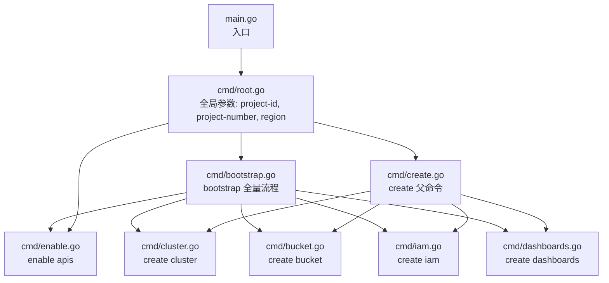
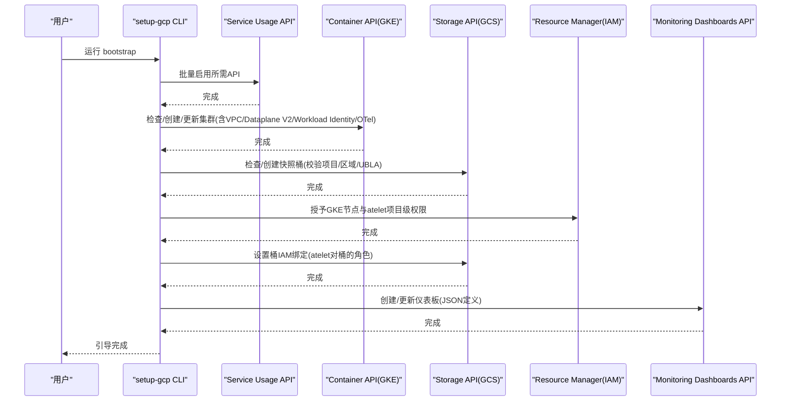
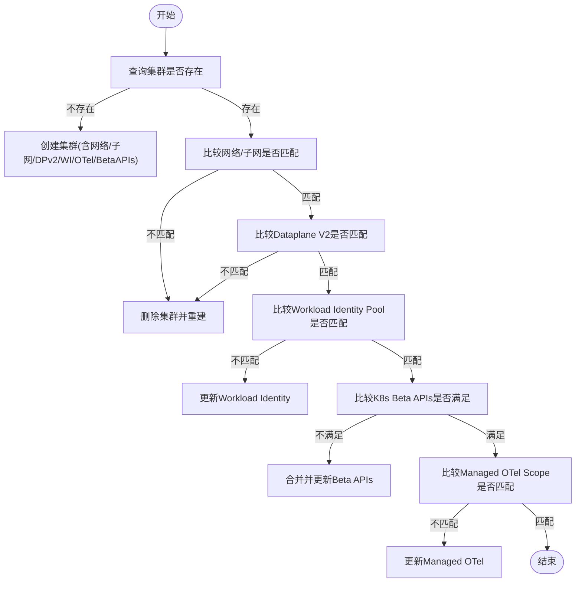
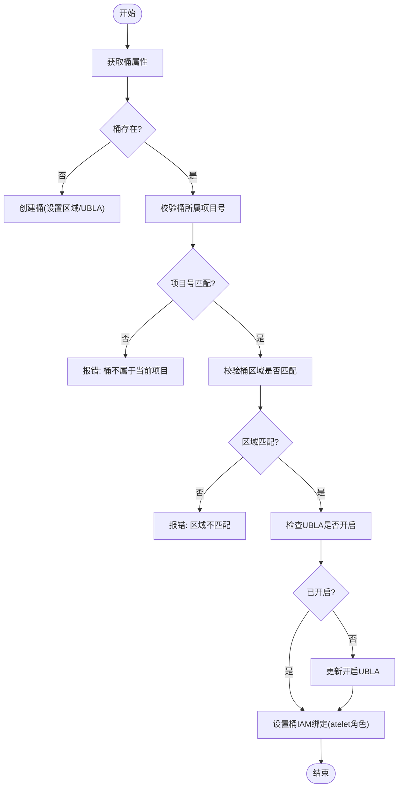
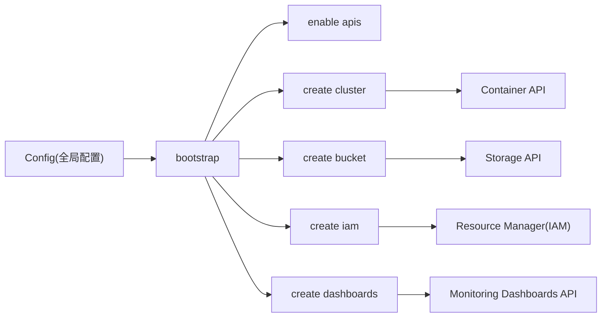

# Google Cloud Platform (GCP) 部署

<cite>
**本文引用的文件**   
- [tools/setup-gcp/README.md](file://tools/setup-gcp/README.md)
- [tools/setup-gcp/main.go](file://tools/setup-gcp/main.go)
- [tools/setup-gcp/cmd/root.go](file://tools/setup-gcp/cmd/root.go)
- [tools/setup-gcp/cmd/create.go](file://tools/setup-gcp/cmd/create.go)
- [tools/setup-gcp/cmd/bootstrap.go](file://tools/setup-gcp/cmd/bootstrap.go)
- [tools/setup-gcp/cmd/api.go](file://tools/setup-gcp/cmd/api.go)
- [tools/setup-gcp/cmd/cluster.go](file://tools/setup-gcp/cmd/cluster.go)
- [tools/setup-gcp/cmd/bucket.go](file://tools/setup-gcp/cmd/bucket.go)
- [tools/setup-gcp/cmd/iam.go](file://tools/setup-gcp/cmd/iam.go)
- [tools/setup-gcp/cmd/dashboards.go](file://tools/setup-gcp/cmd/dashboards.go)
- [tools/setup-gcp/cmd/common.go](file://tools/setup-gcp/cmd/common.go)
- [tools/setup-gcp/cmd/enable.go](file://tools/setup-gcp/cmd/enable.go)
- [tools/setup-gcp/dashboards/ate-grpc-dashboard.json](file://tools/setup-gcp/dashboards/ate-grpc-dashboard.json)
- [tools/setup-gcp/dashboards/ate-e2e-latency-dashboard.json](file://tools/setup-gcp/dashboards/ate-e2e-latency-dashboard.json)
- [tools/setup-gcp/dashboards/ate-snapshot-dashboard.json](file://tools/setup-gcp/dashboards/ate-snapshot-dashboard.json)
</cite>

## 目录
1. [简介](#简介)
2. [项目结构](#项目结构)
3. [核心组件](#核心组件)
4. [架构总览](#架构总览)
5. [详细组件分析](#详细组件分析)
6. [依赖关系分析](#依赖关系分析)
7. [性能与规模建议](#性能与规模建议)
8. [监控与日志集成](#监控与日志集成)
9. [故障排除指南](#故障排除指南)
10. [结论](#结论)

## 简介
本指南面向在 Google Cloud Platform（GCP）生产环境部署 Agent Substrate 的工程师，聚焦使用仓库内提供的 setup-gcp 工具进行自动化部署。内容涵盖：
- 项目初始化与 API 启用
- GKE 集群创建、网络 VPC 配置、节点池与 Dataplane V2
- Workload Identity 配置与 IAM 权限最小化策略
- GCS 存储桶创建与访问控制
- Cloud Monitoring 仪表板一键导入
- 不同规模的机器类型与扩缩容策略建议
- 日志聚合与可观测性实践
- 常见问题排查与性能调优要点

## 项目结构
setup-gcp 是一个基于 Cobra 的 CLI 工具，提供幂等的一键式环境引导能力。其命令分层清晰：根命令、enable、create、bootstrap 等子命令分别负责启用 API、创建资源与全量引导。

图表来源
- [tools/setup-gcp/main.go:1-30](file://tools/setup-gcp/main.go#L1-L30)
- [tools/setup-gcp/cmd/root.go:1-41](file://tools/setup-gcp/cmd/root.go#L1-L41)
- [tools/setup-gcp/cmd/enable.go:1-46](file://tools/setup-gcp/cmd/enable.go#L1-L46)
- [tools/setup-gcp/cmd/create.go:1-32](file://tools/setup-gcp/cmd/create.go#L1-L32)
- [tools/setup-gcp/cmd/cluster.go:1-298](file://tools/setup-gcp/cmd/cluster.go#L1-L298)
- [tools/setup-gcp/cmd/bucket.go:1-160](file://tools/setup-gcp/cmd/bucket.go#L1-L160)
- [tools/setup-gcp/cmd/iam.go:1-179](file://tools/setup-gcp/cmd/iam.go#L1-L179)
- [tools/setup-gcp/cmd/dashboards.go:1-119](file://tools/setup-gcp/cmd/dashboards.go#L1-L119)
- [tools/setup-gcp/cmd/bootstrap.go:1-97](file://tools/setup-gcp/cmd/bootstrap.go#L1-L97)

章节来源
- [tools/setup-gcp/README.md:1-175](file://tools/setup-gcp/README.md#L1-L175)
- [tools/setup-gcp/main.go:1-30](file://tools/setup-gcp/main.go#L1-L30)
- [tools/setup-gcp/cmd/root.go:1-41](file://tools/setup-gcp/cmd/root.go#L1-L41)
- [tools/setup-gcp/cmd/bootstrap.go:1-97](file://tools/setup-gcp/cmd/bootstrap.go#L1-L97)

## 核心组件
- 全局配置与参数解析
  - 通过环境变量与命令行标志共同驱动，支持字符串与布尔类型的环境变量解析。
  - 关键全局参数包括项目 ID、项目编号、区域等。
- 子命令实现
  - enable apis：批量启用所需 GCP API。
  - create cluster：幂等创建或更新 GKE 集群，包含网络、Dataplane V2、Workload Identity、Managed OpenTelemetry 等配置。
  - create bucket：幂等创建 GCS 快照桶并校验归属与区域，强制开启统一桶级访问控制。
  - create iam：为 GKE 节点服务账号与 atelet 工作负载授予必要权限；并为 atelet 绑定到指定 GCS 桶的细粒度角色。
  - create dashboards：按 displayName 幂等创建或更新 Cloud Monitoring 仪表板。
  - bootstrap：顺序执行上述步骤，形成端到端的一次性环境准备。

章节来源
- [tools/setup-gcp/cmd/common.go:1-72](file://tools/setup-gcp/cmd/common.go#L1-L72)
- [tools/setup-gcp/cmd/api.go:1-65](file://tools/setup-gcp/cmd/api.go#L1-L65)
- [tools/setup-gcp/cmd/cluster.go:1-298](file://tools/setup-gcp/cmd/cluster.go#L1-L298)
- [tools/setup-gcp/cmd/bucket.go:1-160](file://tools/setup-gcp/cmd/bucket.go#L1-L160)
- [tools/setup-gcp/cmd/iam.go:1-179](file://tools/setup-gcp/cmd/iam.go#L1-L179)
- [tools/setup-gcp/cmd/dashboards.go:1-119](file://tools/setup-gcp/cmd/dashboards.go#L1-L119)
- [tools/setup-gcp/cmd/bootstrap.go:1-97](file://tools/setup-gcp/cmd/bootstrap.go#L1-L97)

## 架构总览
下图展示了 setup-gcp 工具在执行 bootstrap 时的调用链与各 GCP 服务的交互关系。

图表来源
- [tools/setup-gcp/cmd/bootstrap.go:1-97](file://tools/setup-gcp/cmd/bootstrap.go#L1-L97)
- [tools/setup-gcp/cmd/api.go:1-65](file://tools/setup-gcp/cmd/api.go#L1-L65)
- [tools/setup-gcp/cmd/cluster.go:1-298](file://tools/setup-gcp/cmd/cluster.go#L1-L298)
- [tools/setup-gcp/cmd/bucket.go:1-160](file://tools/setup-gcp/cmd/bucket.go#L1-L160)
- [tools/setup-gcp/cmd/iam.go:1-179](file://tools/setup-gcp/cmd/iam.go#L1-L179)
- [tools/setup-gcp/cmd/dashboards.go:1-119](file://tools/setup-gcp/cmd/dashboards.go#L1-L119)

## 详细组件分析

### 全局配置与参数解析
- 配置结构体集中管理所有 CLI 参数，包括项目、区域、集群、网络、节点池、桶与仪表板目录等。
- getEnv 泛型函数支持字符串与布尔值的环境变量解析，并提供回退默认值。

章节来源
- [tools/setup-gcp/cmd/common.go:1-72](file://tools/setup-gcp/cmd/common.go#L1-L72)
- [tools/setup-gcp/cmd/root.go:1-41](file://tools/setup-gcp/cmd/root.go#L1-L41)

### 启用 API
- 通过 Service Usage API 批量启用容器、存储、日志、监控、追踪等必需服务。
- 幂等：重复执行不会造成副作用。

章节来源
- [tools/setup-gcp/cmd/api.go:1-65](file://tools/setup-gcp/cmd/api.go#L1-L65)
- [tools/setup-gcp/cmd/enable.go:1-46](file://tools/setup-gcp/cmd/enable.go#L1-L46)

### 创建 GKE 集群（含网络、Dataplane V2、Workload Identity、Managed OTel）
- 幂等逻辑：
  - 若集群不存在则创建；存在则对比网络、子网、Dataplane V2、Workload Identity、K8s Beta APIs、Managed OpenTelemetry 配置，不一致时触发删除重建或原地更新。
- 关键特性：
  - 支持自定义 VPC 与子网。
  - 可选启用 Dataplane V2（ADVANCED_DATAPATH）。
  - 自动配置 Workload Identity Pool。
  - 启用 Managed OpenTelemetry（采集与组件指标）。
  - 确保必要的 K8s Beta API 已启用。

图表来源
- [tools/setup-gcp/cmd/cluster.go:1-298](file://tools/setup-gcp/cmd/cluster.go#L1-L298)

章节来源
- [tools/setup-gcp/cmd/cluster.go:1-298](file://tools/setup-gcp/cmd/cluster.go#L1-L298)

### 创建 GCS 快照桶与 IAM 绑定
- 幂等创建：
  - 若桶不存在则创建，并强制开启统一桶级访问控制（UBLA），同时校验桶所属项目与区域。
- 桶级 IAM：
  - 将 atelet 的工作负载身份映射为桶成员，授予 objectAdmin 与 bucketViewer 角色，用于读写快照数据。

图表来源
- [tools/setup-gcp/cmd/bucket.go:1-160](file://tools/setup-gcp/cmd/bucket.go#L1-L160)

章节来源
- [tools/setup-gcp/cmd/bucket.go:1-160](file://tools/setup-gcp/cmd/bucket.go#L1-L160)

### IAM 权限设置（项目级与工作负载）
- GKE 节点权限：
  - 为默认计算服务账号授予读取对象与镜像制品库的权限，便于节点拉取镜像与访问对象存储。
- atelet 工作负载权限：
  - 通过 Workload Identity 将 atelet 服务账号映射为项目级成员，授予对象管理与制品库读取权限。
- 桶级绑定：
  - 针对特定桶授予 atelet 更细粒度的 objectAdmin 与 bucketViewer 角色。

章节来源
- [tools/setup-gcp/cmd/iam.go:1-179](file://tools/setup-gcp/cmd/iam.go#L1-L179)
- [tools/setup-gcp/cmd/bucket.go:1-160](file://tools/setup-gcp/cmd/bucket.go#L1-L160)

### Cloud Monitoring 仪表板集成
- 内置三个仪表板 JSON 定义：gRPC 延迟/QPS/错误、路由与端到端延迟、快照大小与 QPS。
- 工具会列出已有仪表板并按 displayName 判断“更新”或“创建”，避免重复。

章节来源
- [tools/setup-gcp/cmd/dashboards.go:1-119](file://tools/setup-gcp/cmd/dashboards.go#L1-L119)
- [tools/setup-gcp/dashboards/ate-grpc-dashboard.json:1-159](file://tools/setup-gcp/dashboards/ate-grpc-dashboard.json#L1-L159)
- [tools/setup-gcp/dashboards/ate-e2e-latency-dashboard.json:1-217](file://tools/setup-gcp/dashboards/ate-e2e-latency-dashboard.json#L1-L217)
- [tools/setup-gcp/dashboards/ate-snapshot-dashboard.json:1-137](file://tools/setup-gcp/dashboards/ate-snapshot-dashboard.json#L1-L137)

### Bootstrap 全量流程
- 顺序执行：启用 API → 创建集群 → 创建桶 → 授予节点权限 → 授予 atelet 权限 → 设置桶 IAM 绑定 → 创建仪表板。
- 严格校验必填项：project-id、project-number、bucket-name。

章节来源
- [tools/setup-gcp/cmd/bootstrap.go:1-97](file://tools/setup-gcp/cmd/bootstrap.go#L1-L97)

## 依赖关系分析
- 外部 API 依赖
  - Service Usage：批量启用 API。
  - Container（GKE）：集群生命周期与配置管理。
  - Storage（GCS）：桶创建与 IAM 策略管理。
  - Resource Manager（IAM）：项目级 IAM 策略管理。
  - Monitoring Dashboards：仪表板的创建与更新。
- 内部模块耦合
  - bootstrap 编排各子功能，共享同一 Config 结构体。
  - cluster、bucket、iam、dashboards 各自独立实现幂等逻辑，降低重复执行风险。

图表来源
- [tools/setup-gcp/cmd/bootstrap.go:1-97](file://tools/setup-gcp/cmd/bootstrap.go#L1-L97)
- [tools/setup-gcp/cmd/api.go:1-65](file://tools/setup-gcp/cmd/api.go#L1-L65)
- [tools/setup-gcp/cmd/cluster.go:1-298](file://tools/setup-gcp/cmd/cluster.go#L1-L298)
- [tools/setup-gcp/cmd/bucket.go:1-160](file://tools/setup-gcp/cmd/bucket.go#L1-L160)
- [tools/setup-gcp/cmd/iam.go:1-179](file://tools/setup-gcp/cmd/iam.go#L1-L179)
- [tools/setup-gcp/cmd/dashboards.go:1-119](file://tools/setup-gcp/cmd/dashboards.go#L1-L119)

## 性能与规模建议
以下建议结合工具默认参数与实际生产经验给出，可按业务规模调整：

- 小规模（开发/测试）
  - 机器类型：c3-standard-4（工具默认）
  - 初始节点数：2（工具默认）
  - 区域：us-central1（工具默认）
  - 适用场景：低并发、快速迭代验证

- 中等规模（预生产/中小流量）
  - 机器类型：n2-standard-8 或 c3-standard-8
  - 初始节点数：3–5
  - 区域：就近选择低延迟区域
  - 扩缩容：HPA + Cluster Autoscaler（按需扩展）

- 大规模（生产高可用）
  - 机器类型：c3-standard-8/16 或更高规格实例族
  - 初始节点数：5–10+
  - 多可用区部署：跨多个 zone 提升可用性
  - 扩缩容：HPA + CA，结合 PodDisruptionBudget 保障滚动升级

- 网络与数据面
  - 启用 Dataplane V2（ADVANCED_DATAPATH）以获得更好的转发性能与可观测性。
  - 合理划分 VPC/Subnetwork，隔离不同环境。

- 存储与快照
  - 使用同区域 GCS 桶以降低延迟与费用。
  - 开启 UBLA 并通过 Workload Identity 精确授权。

[本节为通用指导，无需代码引用]

## 监控与日志集成
- 监控仪表板
  - gRPC 延迟/QPS/错误：覆盖 ate-api-server 与 atelet 两个服务。
  - 路由与端到端延迟：展示 P50/P95/P99 及阶段分解。
  - 快照大小与 QPS：按模板维度统计分布与热点。
- 指标来源
  - 集群层面启用 Managed OpenTelemetry，采集组件与运行时指标。
  - 应用侧暴露 Prometheus 指标，由 GCP 托管的 OTel 采集后入 Monitoring。
- 日志聚合
  - 启用 logging.googleapis.com 后，Kubernetes 标准输出与系统日志可被 GCP Logging 聚合。
  - 建议在应用层结构化输出日志，便于检索与分析。

章节来源
- [tools/setup-gcp/cmd/cluster.go:1-298](file://tools/setup-gcp/cmd/cluster.go#L1-L298)
- [tools/setup-gcp/cmd/dashboards.go:1-119](file://tools/setup-gcp/cmd/dashboards.go#L1-L119)
- [tools/setup-gcp/dashboards/ate-grpc-dashboard.json:1-159](file://tools/setup-gcp/dashboards/ate-grpc-dashboard.json#L1-L159)
- [tools/setup-gcp/dashboards/ate-e2e-latency-dashboard.json:1-217](file://tools/setup-gcp/dashboards/ate-e2e-latency-dashboard.json#L1-L217)
- [tools/setup-gcp/dashboards/ate-snapshot-dashboard.json:1-137](file://tools/setup-gcp/dashboards/ate-snapshot-dashboard.json#L1-L137)

## 故障排除指南
- 认证与权限
  - 确认已通过 ADC 登录且具备 Owner/Editor 权限。
  - 若 IAM 操作失败，检查项目级策略是否被组织策略限制。
- API 未启用
  - 若出现 API 不可用错误，先执行 enable apis 再重试。
- 集群配置冲突
  - 网络/子网/Dataplane V2/Workload Identity 不匹配时会触发重建或更新，请核对参数。
- 桶归属与区域不一致
  - 工具会拒绝跨项目或跨区域的桶，需重新创建或在正确项目/区域中命名。
- 仪表板重复或更新失败
  - 工具按 displayName 去重，如仍异常，检查 Dashboard API 配额与权限。

章节来源
- [tools/setup-gcp/cmd/bootstrap.go:1-97](file://tools/setup-gcp/cmd/bootstrap.go#L1-L97)
- [tools/setup-gcp/cmd/api.go:1-65](file://tools/setup-gcp/cmd/api.go#L1-L65)
- [tools/setup-gcp/cmd/cluster.go:1-298](file://tools/setup-gcp/cmd/cluster.go#L1-L298)
- [tools/setup-gcp/cmd/bucket.go:1-160](file://tools/setup-gcp/cmd/bucket.go#L1-L160)
- [tools/setup-gcp/cmd/iam.go:1-179](file://tools/setup-gcp/cmd/iam.go#L1-L179)
- [tools/setup-gcp/cmd/dashboards.go:1-119](file://tools/setup-gcp/cmd/dashboards.go#L1-L119)

## 结论
借助 setup-gcp 工具，可在 GCP 上以幂等方式快速完成从 API 启用、GKE 集群、GCS 桶、IAM 到 Monitoring 仪表板的完整环境准备。配合合理的机器类型、扩缩容策略与 Dataplane V2、Workload Identity 等最佳实践，可满足从小规模到生产级的多种部署需求。建议在上线前完善日志与告警策略，并结合业务特征持续优化性能与成本。
