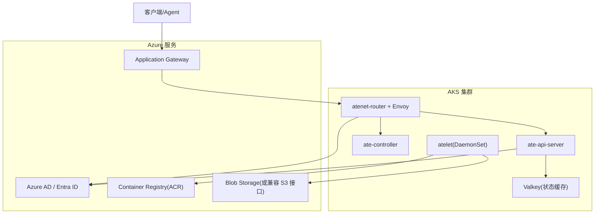
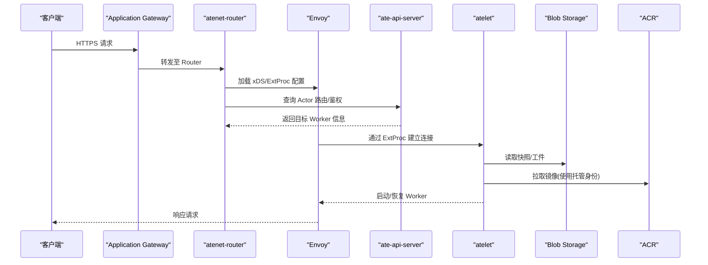
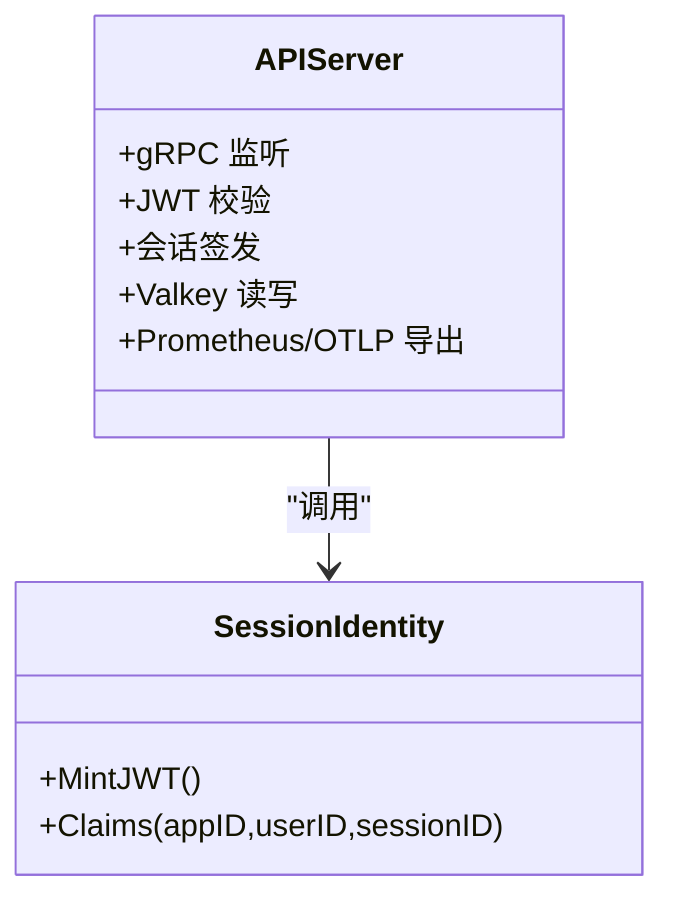
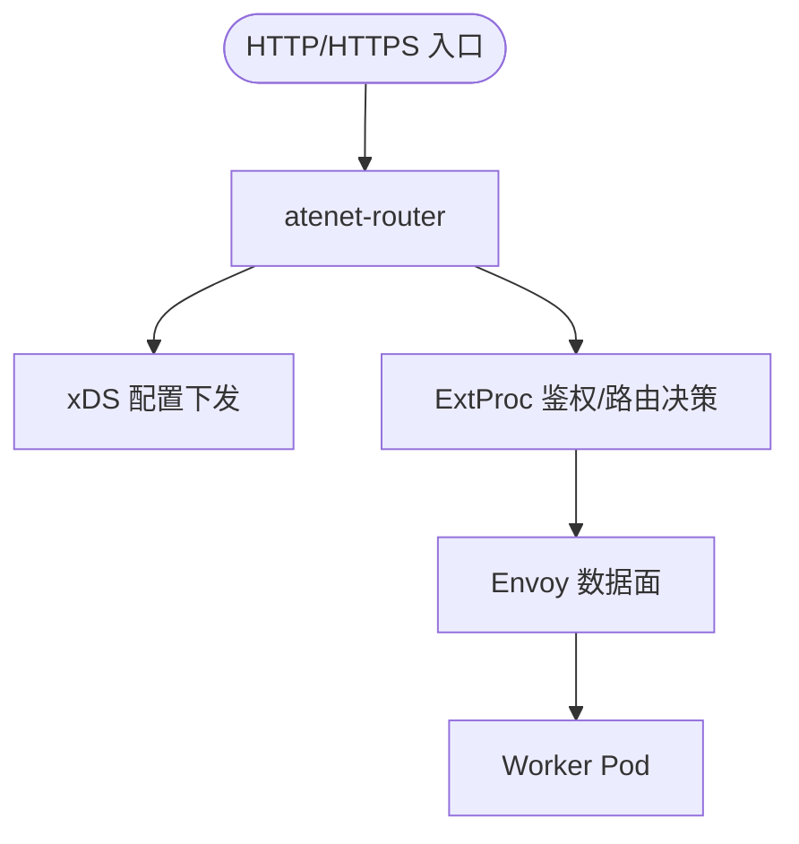
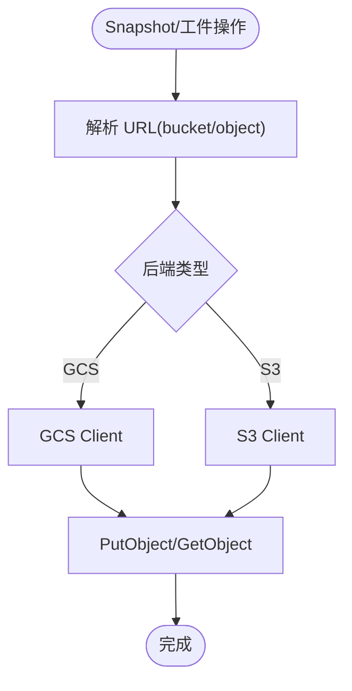
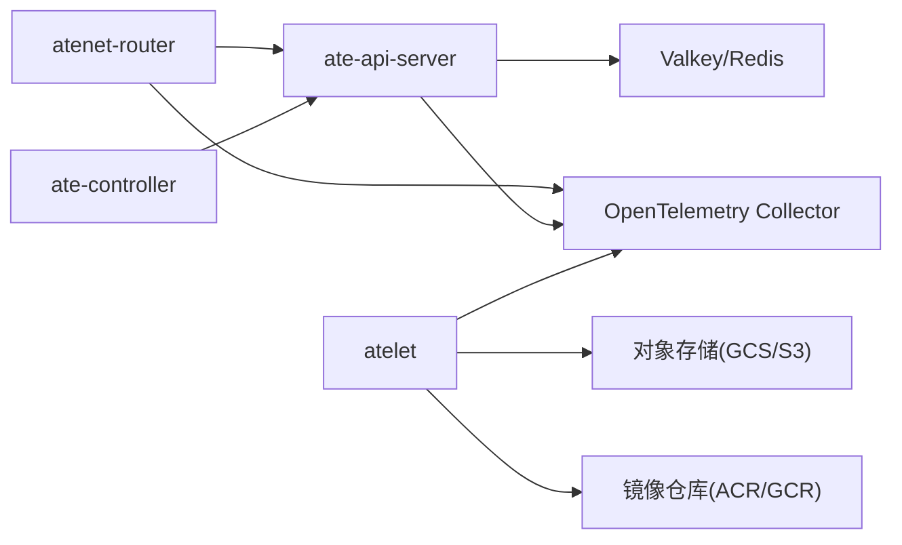

# Microsoft Azure 部署

<cite>
**本文引用的文件**   
- [README.md](file://README.md)
- [install-ate.sh](file://hack/install-ate.sh)
- [ate-api-server.yaml](file://manifests/ate-install/ate-api-server.yaml)
- [ate-controller.yaml](file://manifests/ate-install/ate-controller.yaml)
- [atelet.yaml](file://manifests/ate-install/atelet.yaml)
- [atenet-router.yaml](file://manifests/ate-install/atenet-router.yaml)
- [actortemplate_types.go](file://pkg/api/v1alpha1/actortemplate_types.go)
- [workerpool_apply_test.go](file://cmd/atecontroller/internal/controllers/workerpool_apply_test.go)
- [sessionidentity.go](file://cmd/ateapi/internal/sessionidentity/sessionidentity.go)
- [sessionidjwt.go](file://cmd/ateapi/internal/sessionidjwt/sessionidjwt.go)
- [router.go](file://cmd/atenet/internal/router.go)
- [envoyrunner.go](file://cmd/atenet/internal/router/envoyrunner.go)
- [xds_test.go](file://cmd/atenet/internal/router/xds_test.go)
- [gcs.go](file://cmd/atelet/internal/ategcs/gcs.go)
- [objects.go](file://cmd/atelet/internal/ategcs/objects.go)
- [s3.go](file://cmd/atelet/internal/ategcs/s3.go)
- [threat-model.md](file://docs/threat-model.md)
</cite>

## 目录
1. [简介](#简介)
2. [项目结构](#项目结构)
3. [核心组件](#核心组件)
4. [架构总览](#架构总览)
5. [详细组件分析](#详细组件分析)
6. [依赖关系分析](#依赖关系分析)
7. [性能与容量规划](#性能与容量规划)
8. [Azure 生产环境部署指南](#azure-生产环境部署指南)
9. [监控与可观测性](#监控与可观测性)
10. [安全与合规](#安全与合规)
11. [成本优化建议](#成本优化建议)
12. [故障排查指南](#故障排查指南)
13. [结论](#结论)

## 简介
本指南面向在 Microsoft Azure 上以生产标准部署 Agent Substrate（以下简称“Substrate”）的工程师，覆盖 AKS 集群、Azure AD 集成、虚拟网络与安全组、Container Registry (ACR)、Blob Storage 存储后端、Managed Identity、Application Gateway、监控与追踪、扩缩容策略、成本优化与迁移等关键主题。文档同时结合仓库内现有安装脚本与清单，给出可直接落地的步骤与注意事项。

## 项目结构
仓库提供完整的控制面与数据面组件、Kubernetes 清单与安装脚本，便于在任意 K8s 集群（包括 AKS）快速部署：
- 控制面：ate-api-server（会话与资源管理）、ate-controller（CRD 控制器）、atenet（路由与 xDS）
- 节点侧：atelet（节点守护进程，负责镜像拉取、快照与对象存储交互）
- 运行时：ATEOM（gVisor/microvm 执行器，由 atelet 协调）
- 安装与演示：install-ate.sh、demo 示例、基准测试工具

图表来源
- [install-ate.sh:267-310](file://hack/install-ate.sh#L267-L310)
- [ate-api-server.yaml:58-185](file://manifests/ate-install/ate-api-server.yaml#L58-L185)
- [ate-controller.yaml:70-100](file://manifests/ate-install/ate-controller.yaml#L70-L100)
- [atelet.yaml:46-126](file://manifests/ate-install/atelet.yaml#L46-L126)
- [atenet-router.yaml:102-216](file://manifests/ate-install/atenet-router.yaml#L102-L216)

章节来源
- [README.md:1-225](file://README.md#L1-L225)

## 核心组件
- ate-api-server：对外暴露 gRPC 控制面，负责 Actor/WorkerPool 生命周期、会话身份签发、与 Valkey 交互、对接 OIDC/JWT 校验。
- ate-controller：监听 WorkerPool/ActorTemplate/SandboxConfig CRD，生成并维护 Deployment/Pod 等资源。
- atenet-router：提供 HTTP/HTTPS 入口、xDS 配置下发、ExtProc 鉴权与动态路由；内置 Envoy 作为数据面代理。
- atelet：节点级守护进程，负责镜像拉取、快照上传/下载、对象存储访问（GCS/S3），以及本地工作区管理。
- ATEOM：运行于沙箱 Pod 内的轻量执行器，负责 runsc/microvm 的 checkpoint/restore。

章节来源
- [README.md:215-225](file://README.md#L215-L225)
- [ate-api-server.yaml:58-185](file://manifests/ate-install/ate-api-server.yaml#L58-L185)
- [ate-controller.yaml:70-100](file://manifests/ate-install/ate-controller.yaml#L70-L100)
- [atenet-router.yaml:102-216](file://manifests/ate-install/atenet-router.yaml#L102-L216)
- [atelet.yaml:46-126](file://manifests/ate-install/atelet.yaml#L46-L126)

## 架构总览
下图展示了从外部请求到内部 Actor 执行的端到端路径，以及与 Azure 服务的集成点。

图表来源
- [atenet-router.yaml:102-216](file://manifests/ate-install/atenet-router.yaml#L102-L216)
- [ate-api-server.yaml:58-185](file://manifests/ate-install/ate-api-server.yaml#L58-L185)
- [atelet.yaml:46-126](file://manifests/ate-install/atelet.yaml#L46-L126)
- [gcs.go:1-44](file://cmd/atelet/internal/ategcs/gcs.go#L1-L44)
- [objects.go:51-118](file://cmd/atelet/internal/ategcs/objects.go#L51-L118)

## 详细组件分析

### ate-api-server（控制面）
- 功能要点
  - 接收 gRPC 请求，验证客户端 JWT/Audience，签发会话 JWT。
  - 挂载证书与密钥池（Session ID CA/JWT Pool、WorkerPool CA）。
  - 通过环境变量注入 Redis/Valkey 地址、TLS 与 IAM 认证开关。
  - 输出 Prometheus 指标与 OpenTelemetry 遥测。
- 关键配置项（来自清单与环境变量）
  - gRPC 端口、mTLS 证书路径、Redis 相关参数、OIDC Issuer、Audience、Session ID 证书池路径等。
- 身份与会话
  - 支持基于 OIDC/K8s JWT 的客户端认证，签发包含 appID/userID/sessionID 的会话 JWT。

图表来源
- [ate-api-server.yaml:58-185](file://manifests/ate-install/ate-api-server.yaml#L58-L185)
- [sessionidentity.go:90-126](file://cmd/ateapi/internal/sessionidentity/sessionidentity.go#L90-L126)
- [sessionidjwt.go:30-98](file://cmd/ateapi/internal/sessionidjwt/sessionidjwt.go#L30-L98)

章节来源
- [ate-api-server.yaml:58-185](file://manifests/ate-install/ate-api-server.yaml#L58-L185)
- [sessionidentity.go:90-126](file://cmd/ateapi/internal/sessionidentity/sessionidentity.go#L90-L126)
- [sessionidjwt.go:30-98](file://cmd/ateapi/internal/sessionidjwt/sessionidjwt.go#L30-L98)

### atenet-router（网络与路由）
- 功能要点
  - 提供 HTTP/HTTPS 入口，xDS 服务端与 Envoy 协同。
  - 通过 ExtProc 进行请求级鉴权与动态路由。
  - 将上游 Worker 地址与策略下发给 Envoy。
- 关键配置项
  - HTTP/HTTPS 端口、xDS/ExtProc 端口、OTLP 收集器地址、CA 信任链、ServiceAccount 与 RBAC。
- 与 Envoy 的关系
  - 通过 ConfigMap 注入 envoy.yaml，Envoy 以 ADS 方式订阅 xDS。

图表来源
- [atenet-router.yaml:50-216](file://manifests/ate-install/atenet-router.yaml#L50-L216)
- [router.go:27-42](file://cmd/atenet/internal/router.go#L27-L42)
- [envoyrunner.go:142-208](file://cmd/atenet/internal/router/envoyrunner.go#L142-L208)
- [xds_test.go:79-119](file://cmd/atenet/internal/router/xds_test.go#L79-L119)

章节来源
- [atenet-router.yaml:50-216](file://manifests/ate-install/atenet-router.yaml#L50-L216)
- [router.go:27-42](file://cmd/atenet/internal/router.go#L27-L42)
- [envoyrunner.go:142-208](file://cmd/atenet/internal/router/envoyrunner.go#L142-L208)
- [xds_test.go:79-119](file://cmd/atenet/internal/router/xds_test.go#L79-L119)

### atelet（节点侧与对象存储）
- 功能要点
  - 节点守护进程，负责镜像拉取、快照上传/下载、本地工作区管理。
  - 支持 GCS 与 S3 兼容的对象存储后端（当前默认启用 GCS 模式）。
  - 通过 hostPath 挂载 /var/lib/ateom-gvisor 与工作区交互。
- 关键配置项
  - OTEL 导出端点、存储后端类型（gcs/s3）、镜像拉取认证（如启用 GCP 镜像拉取）。
- 对象存储流程
  - 解析 gsURL/bucket/object，流式读取/写入，支持 zstd 压缩上传小对象。

图表来源
- [atelet.yaml:46-126](file://manifests/ate-install/atelet.yaml#L46-L126)
- [gcs.go:1-44](file://cmd/atelet/internal/ategcs/gcs.go#L1-L44)
- [s3.go:1-58](file://cmd/atelet/internal/ategcs/s3.go#L1-L58)
- [objects.go:51-118](file://cmd/atelet/internal/ategcs/objects.go#L51-L118)

章节来源
- [atelet.yaml:46-126](file://manifests/ate-install/atelet.yaml#L46-L126)
- [gcs.go:1-44](file://cmd/atelet/internal/ategcs/gcs.go#L1-L44)
- [s3.go:1-58](file://cmd/atelet/internal/ategcs/s3.go#L1-L58)
- [objects.go:51-118](file://cmd/atelet/internal/ategcs/objects.go#L51-L118)

### WorkerPool 与调度亲和
- WorkerPool 控制器根据模板生成 Deployment，支持 NodeSelector/Tolerations/Affinity 等调度约束。
- 测试用例覆盖了节点选择、容忍度与亲和规则的应用。

章节来源
- [workerpool_apply_test.go:65-119](file://cmd/atecontroller/internal/controllers/workerpool_apply_test.go#L65-L119)
- [workerpool_apply_test.go:275-328](file://cmd/atecontroller/internal/controllers/workerpool_apply_test.go#L275-L328)

## 依赖关系分析
- 组件间依赖
  - atenet-router 依赖 ate-api-server 获取路由与鉴权信息。
  - ate-controller 依赖 Kubernetes API 与 ate-api-server 的 CA 信任链。
  - atelet 依赖对象存储（GCS/S3）与镜像仓库（ACR/GCR）。
- 外部依赖
  - OIDC/JWT 颁发者（K8s/APIServer 或自定义）。
  - Valkey/Redis 用于会话与状态缓存。
  - OpenTelemetry Collector 用于指标与链路追踪。

图表来源
- [install-ate.sh:267-310](file://hack/install-ate.sh#L267-L310)
- [ate-api-server.yaml:58-185](file://manifests/ate-install/ate-api-server.yaml#L58-L185)
- [atenet-router.yaml:102-216](file://manifests/ate-install/atenet-router.yaml#L102-L216)
- [atelet.yaml:46-126](file://manifests/ate-install/atelet.yaml#L46-L126)

## 性能与容量规划
- 控制面
  - ate-api-server：建议至少 2 副本，开启水平自动扩缩容（HPA），关注 CPU/内存与 gRPC QPS。
  - atenet-router：建议 2+ 副本，配合 Ingress/Application Gateway 做横向扩展。
- 数据面
  - WorkerPool：按业务峰值与并发度评估，结合 NodeSelector/Tolerations 定位高性能节点。
  - atelet：每节点一个实例，确保宿主磁盘 IO 满足快照吞吐需求。
- 存储
  - Blob Storage：优先选择高吞吐 SKU，启用热/冷分层策略，合理设置对象大小与分片。
  - Valkey：根据会话规模与命中率调整内存与持久化策略。

[本节为通用指导，不直接分析具体文件]

## Azure 生产环境部署指南

### 前置条件
- 已创建 AKS 集群，具备管理员权限。
- 已安装 kubectl 并配置上下文。
- 已准备 Azure AD（Entra ID）租户与应用注册（如需 OIDC/JWT 集成）。
- 已创建 ACR 与 Blob Storage 账户，并准备好命名空间与命名约定。

### 1) 创建 AKS 集群与基础网络
- 使用 Azure CLI 或 Terraform 创建 AKS，启用托管标识（System-assigned Managed Identity）。
- 配置虚拟网络与子网，预留足够 IP 段，启用 NetworkPolicy（可选但推荐）。
- 为节点池配置标签与污点，以便后续通过 NodeSelector/Tolerations 精准调度。

### 2) 安装 Substrate 系统组件
- 使用仓库提供的安装脚本渲染并应用清单：
  - 参考命令与选项说明见安装脚本帮助。
  - 支持 mTLS 与 JWT 两种认证模式切换。
- 安装过程会：
  - 创建 ate-system 命名空间与必要 Secret/ConfigMap。
  - 部署 podcertificate-controller、ate-api-server、ate-controller、atenet-router、atelet 等。
  - 等待各组件就绪。

章节来源
- [install-ate.sh:52-98](file://hack/install-ate.sh#L52-L98)
- [install-ate.sh:147-167](file://hack/install-ate.sh#L147-L167)
- [install-ate.sh:267-310](file://hack/install-ate.sh#L267-L310)

### 3) Azure AD 集成（OIDC/JWT）
- 在 Azure AD 中注册应用，配置重定向 URI 与所需权限。
- 在 ate-api-server 中配置 OIDC Issuer 与 Audience，确保客户端携带有效 JWT。
- 若使用 K8s 自带 OIDC，可通过安装脚本自动探测或手动注入。

章节来源
- [install-ate.sh:217-251](file://hack/install-ate.sh#L217-L251)
- [sessionidentity.go:90-126](file://cmd/ateapi/internal/sessionidentity/sessionidentity.go#L90-L126)
- [sessionidjwt.go:30-98](file://cmd/ateapi/internal/sessionidjwt/sessionidjwt.go#L30-L98)

### 4) 虚拟网络与安全组（NSG）
- 限制 ate-api-server 与 ate-controller 仅允许受控来源访问。
- 对 atenet-router 暴露的 HTTP/HTTPS 端口，仅允许 Application Gateway 或 Ingress 转发。
- 使用 NetworkPolicy 默认拒绝所有入站，再按需放行。

[本节为通用指导，不直接分析具体文件]

### 5) Container Registry (ACR) 集成
- 为 AKS 节点池分配 System-assigned Managed Identity。
- 在 ACR 授予该身份 Pull 权限（ AcrPull 角色）。
- 在 atelet 中启用镜像拉取认证（例如 GCP 镜像拉取开关，对应 Azure 场景请替换为 ACR 凭据或 Workload Identity）。
- 在 WorkerPod 模板中配置 imagePullSecrets（或使用 Workload Identity for ACR）。

章节来源
- [atelet.yaml:67-87](file://manifests/ate-install/atelet.yaml#L67-L87)

### 6) Blob Storage 存储后端配置
- 当前代码默认启用 GCS 后端（环境变量 ATE_STORAGE_BACKEND=gcs）。
- 若需使用 Azure Blob Storage，可将后端切换为 S3 兼容实现，并通过环境变量配置 endpoint、bucket、认证方式（如 Shared Key、SAS、或云托管身份）。
- 注意对象命名规范与分区策略，避免热点桶。

章节来源
- [atelet.yaml:108-110](file://manifests/ate-install/atelet.yaml#L108-L110)
- [s3.go:1-58](file://cmd/atelet/internal/ategcs/s3.go#L1-L58)
- [objects.go:51-118](file://cmd/atelet/internal/ategcs/objects.go#L51-L118)

### 7) Managed Identity 配置
- 为 AKS 节点池启用 System-assigned Managed Identity。
- 为 ate-api-server 与 atenet-router 的 ServiceAccount 绑定 Workload Identity（若启用）。
- 为 ACR 与 Blob Storage 授予最小权限（只读/只写分离）。

[本节为通用指导，不直接分析具体文件]

### 8) Application Gateway 配置
- 创建 Application Gateway，添加监听器（HTTP/HTTPS）。
- 添加后端池指向 atenet-router Service（ClusterIP）。
- 配置 WAF（可选）与 SSL 终止，启用健康探针。
- 如需跨域与静态域名，可在 AG 层统一处理。

[本节为通用指导，不直接分析具体文件]

### 9) VM 大小与 Spot VM 策略
- 控制面节点：选择稳定型 VM（如 Standard_D4s_v5），保证低抖动。
- 数据面节点：根据工作负载选择高内存/高 CPU 规格（如 Standard_E8s_v5 或带 GPU 的型号）。
- 使用 Spot VM 承载非关键批处理或可中断任务，结合 PodDisruptionBudget 与优雅退出策略。

[本节为通用指导，不直接分析具体文件]

### 10) 自动扩缩容配置
- 使用 HPA 对 ate-api-server 与 atenet-router 进行水平扩缩容。
- 使用 Cluster Autoscaler 或 Virtual Kubelet 按需扩容节点池。
- 针对 WorkerPool，结合自定义指标（如队列长度、CPU/内存利用率）触发扩缩容。

[本节为通用指导，不直接分析具体文件]

## 监控与可观测性
- 指标采集
  - 组件默认暴露 Prometheus 指标端口，建议在集群部署 Prometheus 或接入 Azure Monitor for Containers。
- 分布式追踪
  - 组件通过 OpenTelemetry 向 OTLP 端点上报，可对接 Azure Monitor Workspace 或 Application Insights。
- 日志
  - 使用容器日志驱动（stdout/stderr）并集中采集至 Log Analytics。

章节来源
- [ate-api-server.yaml:107-110](file://manifests/ate-install/ate-api-server.yaml#L107-L110)
- [atenet-router.yaml:153-156](file://manifests/ate-install/atenet-router.yaml#L153-L156)
- [atelet.yaml:104-107](file://manifests/ate-install/atelet.yaml#L104-L107)

## 安全与合规
- 组件间通信必须启用 mTLS，并使用受信任的 CA 与证书轮换机制。
- 严格遵循最小权限原则，RBAC 仅授予必要权限。
- 使用 NetworkPolicy 隔离控制面与数据面，禁止未授权访问。
- 威胁模型建议：
  - 阻止内部网络对核心组件的直接访问。
  - 隔离控制面与不可信沙箱。
  - 对所有流量加密与双向认证。

章节来源
- [threat-model.md:72-82](file://docs/threat-model.md#L72-L82)

## 成本优化建议
- 使用 Spot VM 承载可中断工作负载，结合弹性伸缩降低闲置成本。
- 合理设置对象存储分层（热/冷/归档），减少频繁访问对象的存储费用。
- 利用 ACR 镜像压缩与多阶段构建，减小镜像体积与传输成本。
- 通过 HPA 与 Cluster Autoscaler 精细调节资源，避免过度预留。

[本节为通用指导，不直接分析具体文件]

## 故障排查指南
- 组件就绪检查
  - 使用 rollout status 确认各组件就绪。
- 认证问题
  - 检查 OIDC Issuer、Audience、JWT 签名与过期时间。
- 对象存储连通性
  - 验证 atelet 的存储后端配置与凭据，检查网络出站与防火墙规则。
- 路由与鉴权
  - 查看 atenet-router 的 ExtProc 日志与 xDS 配置是否正确下发。

章节来源
- [install-ate.sh:304-310](file://hack/install-ate.sh#L304-L310)
- [install-ate.sh:217-251](file://hack/install-ate.sh#L217-L251)
- [atelet.yaml:108-110](file://manifests/ate-install/atelet.yaml#L108-L110)
- [xds_test.go:79-119](file://cmd/atenet/internal/router/xds_test.go#L79-L119)

## 结论
通过在 AKS 上部署 Substrate，并结合 Azure AD、ACR、Blob Storage、Managed Identity 与 Application Gateway，可实现高可用、可扩展且安全的 Agent 运行时平台。配合监控与自动扩缩容，可在保障性能的同时优化成本。建议在灰度环境中先行验证，逐步推广至生产。
