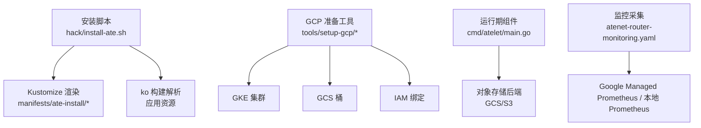
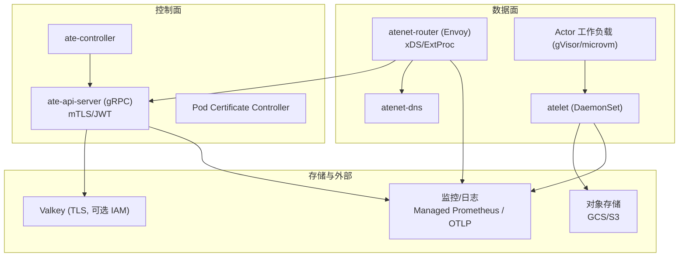
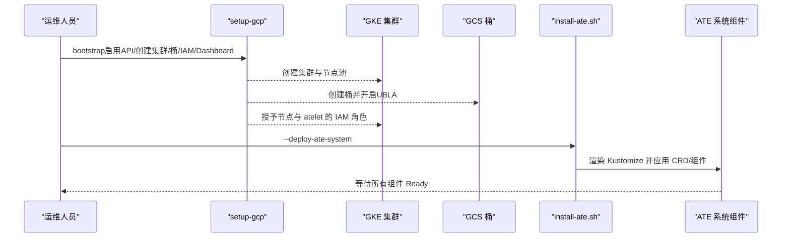
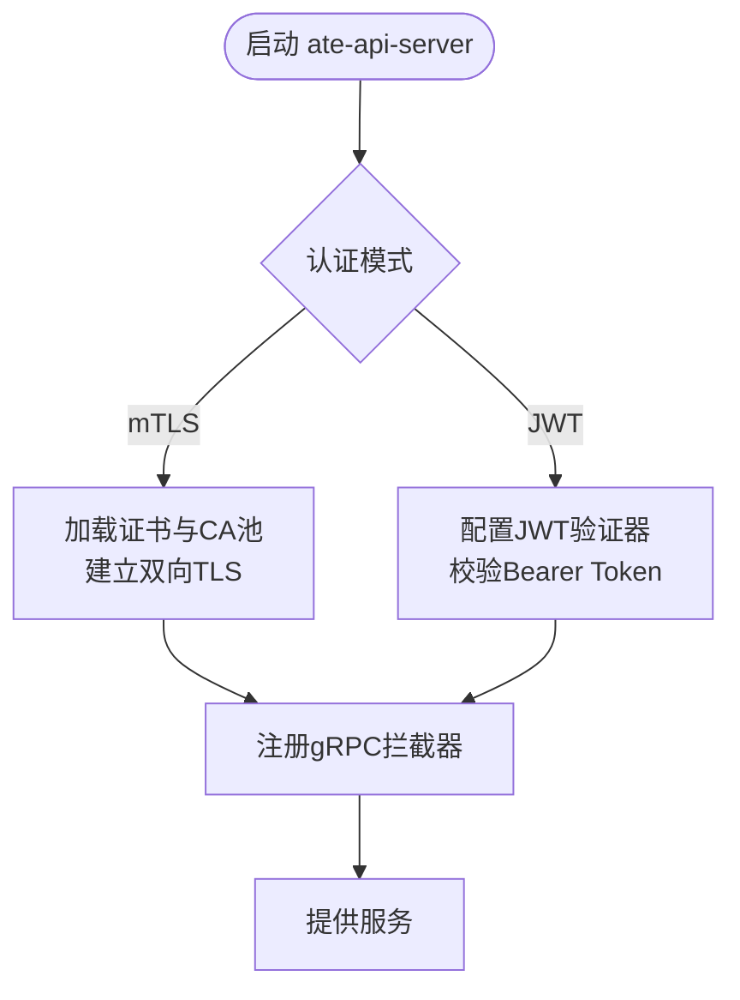
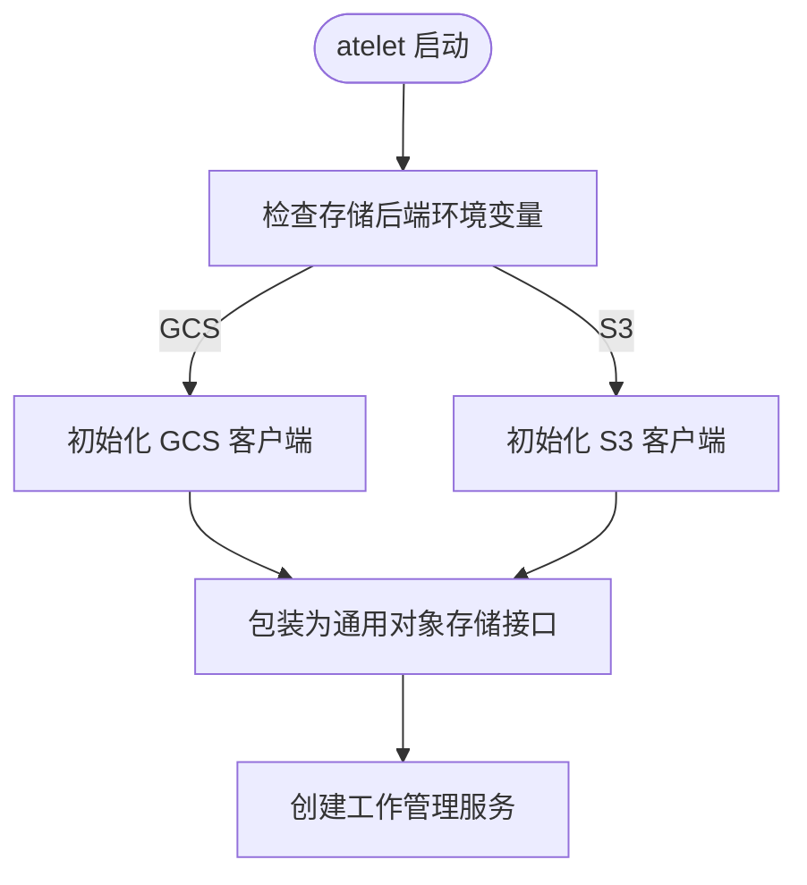
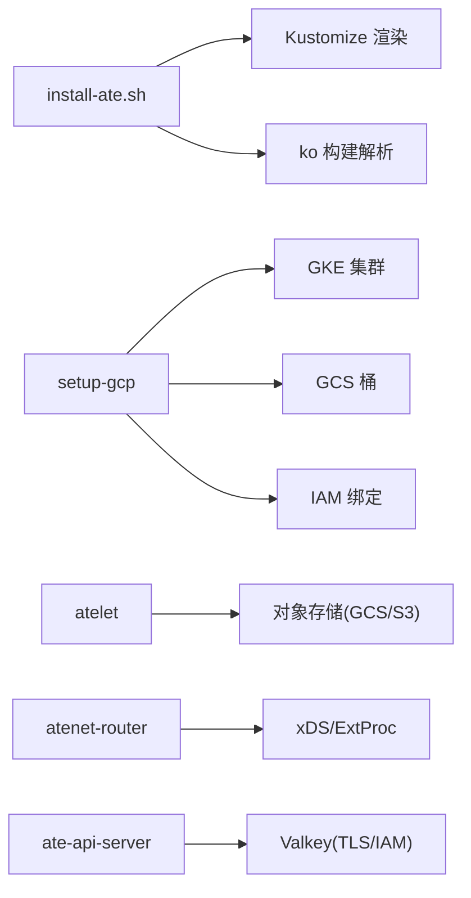

# 云平台部署

<cite>
**本文引用的文件**
- [README.md](file://README.md)
- [install-ate.sh](file://hack/install-ate.sh)
- [setup-gcp/README.md](file://tools/setup-gcp/README.md)
- [setup-gcp/main.go](file://tools/setup-gcp/main.go)
- [setup-gcp/cmd/bootstrap.go](file://tools/setup-gcp/cmd/bootstrap.go)
- [setup-gcp/cmd/iam.go](file://tools/setup-gcp/cmd/iam.go)
- [setup-gcp/cmd/bucket.go](file://tools/setup-gcp/cmd/bucket.go)
- [atelet/main.go](file://cmd/atelet/main.go)
- [atenet-router-monitoring.yaml](file://manifests/ate-install/atenet-router-monitoring.yaml)
- [observability.md](file://docs/observability.md)
- [threat-model.md](file://docs/threat-model.md)
</cite>

## 目录
1. [简介](#简介)
2. [项目结构](#项目结构)
3. [核心组件](#核心组件)
4. [架构总览](#架构总览)
5. [详细组件分析](#详细组件分析)
6. [依赖关系分析](#依赖关系分析)
7. [性能与成本优化](#性能与成本优化)
8. [故障排查指南](#故障排查指南)
9. [结论](#结论)
10. [附录：多平台部署清单](#附录多平台部署清单)

## 简介
本指南面向生产环境，提供在主流云平台（GKE、AWS EKS、Azure AKS）上部署 Agent Substrate 的完整步骤。内容涵盖：
- IAM 权限配置与最小权限原则
- 网络安全设置（mTLS、网络策略、隔离）
- 存储后端选择（GCS、S3）
- 云平台特定优化（自动扩缩容、负载均衡、监控集成）
- 认证与授权（JWT、mTLS、证书管理）
- 成本优化建议与性能调优参数
- 迁移指南（从其他平台迁移到目标云）

说明：当前仓库提供了 GCP 的自动化准备工具与安装脚本，以及可切换 S3 后端的 atelet 实现；EKS/AKS 的适配需基于相同 Kustomize 与 Helm/Kustomize 模式进行等价替换。

## 项目结构
与生产部署直接相关的顶层结构与关键入口：
- 安装与编排
  - hack/install-ate.sh：统一安装入口，支持按组件部署、Kustomize 渲染、ko 构建解析、等待就绪等
  - manifests/ate-install/*：系统组件基础与覆盖（含 Kind/JWT 覆盖）
- GCP 准备工具
  - tools/setup-gcp/*：启用 API、创建 GKE/GCS、IAM 绑定、Dashboard 创建
- 运行时组件
  - cmd/atelet/main.go：节点侧守护进程，负责快照拉取与状态迁移，支持 GCS/S3 后端
  - manifests/ate-install/atenet-router-monitoring.yaml：Envoy 指标采集（Prometheus）
- 文档
  - docs/observability.md：可观测性指南（含 GCP 专属 Dashboard）
  - docs/threat-model.md：威胁模型与安全建议（mTLS、隔离、最小权限）

图表来源
- [install-ate.sh:147-167](file://hack/install-ate.sh#L147-L167)
- [setup-gcp/cmd/bootstrap.go:24-80](file://tools/setup-gcp/cmd/bootstrap.go#L24-L80)
- [setup-gcp/cmd/iam.go:51-133](file://tools/setup-gcp/cmd/iam.go#L51-L133)
- [setup-gcp/cmd/bucket.go:31-89](file://tools/setup-gcp/cmd/bucket.go#L31-L89)
- [atelet/main.go:126-161](file://cmd/atelet/main.go#L126-L161)
- [atenet-router-monitoring.yaml:15-35](file://manifests/ate-install/atenet-router-monitoring.yaml#L15-L35)

章节来源
- [README.md:97-186](file://README.md#L97-L186)
- [install-ate.sh:147-167](file://hack/install-ate.sh#L147-L167)
- [setup-gcp/README.md:1-134](file://tools/setup-gcp/README.md#L1-L134)

## 核心组件
- ate-api-server：控制面 gRPC 服务，支持 mTLS 与 JWT 两种认证模式
- ate-controller：控制器，协调 WorkerPool/ActorTemplate 等资源
- atenet：DNS + Envoy 路由与代理，提供动态转发与 xDS 更新
- atelet：节点侧守护进程，负责快照拉取、恢复与状态迁移，支持 GCS/S3
- Valkey：会话与状态持久化（通过 TLS 与可选 IAM 认证）
- Pod Certificate Controller：签发与分发证书，支撑 mTLS 与 DNS 证书池

章节来源
- [README.md:211-225](file://README.md#L211-L225)
- [install-ate.sh:267-310](file://hack/install-ate.sh#L267-L310)
- [install-ate.sh:312-325](file://hack/install-ate.sh#L312-L325)

## 架构总览
下图展示了生产环境下各组件交互与数据流，包括认证、存储与监控路径。

图表来源
- [install-ate.sh:267-310](file://hack/install-ate.sh#L267-L310)
- [install-ate.sh:312-325](file://hack/install-ate.sh#L312-L325)
- [atenet-router-monitoring.yaml:15-35](file://manifests/ate-install/atenet-router-monitoring.yaml#L15-L35)
- [observability.md:180-194](file://docs/observability.md#L180-L194)

## 详细组件分析

### GKE 生产部署流程（推荐）
- 前置条件
  - 已安装 Go、kubectl、docker/gcloud，并具备管理员权限
  - 使用 Application Default Credentials（ADC）或 Workload Identity
- 准备 GCP 资源
  - 启用所需 API、创建 GKE 集群、创建 GCS 桶、授予 IAM 权限、创建 Cloud Monitoring Dashboards
- 部署系统
  - 使用安装脚本渲染 Kustomize 并应用资源，等待各组件就绪
- 验证与示例
  - 部署示例应用并通过端口转发访问路由

图表来源
- [setup-gcp/cmd/bootstrap.go:24-80](file://tools/setup-gcp/cmd/bootstrap.go#L24-L80)
- [setup-gcp/cmd/bucket.go:31-89](file://tools/setup-gcp/cmd/bucket.go#L31-L89)
- [setup-gcp/cmd/iam.go:51-133](file://tools/setup-gcp/cmd/iam.go#L51-L133)
- [install-ate.sh:267-310](file://hack/install-ate.sh#L267-L310)

章节来源
- [README.md:130-186](file://README.md#L130-L186)
- [setup-gcp/README.md:1-134](file://tools/setup-gcp/README.md#L1-L134)
- [install-ate.sh:147-167](file://hack/install-ate.sh#L147-L167)

### AWS EKS 部署要点
- IAM 与网络
  - 为节点组与服务账号配置最小权限（读取镜像仓库、访问 S3）
  - 使用 IRSA（IAM Roles for Service Accounts）将 S3 访问权限绑定到 atelet 的服务账号
- 存储后端
  - 使用环境变量切换到 S3 后端，并按标准 AWS 环境变量配置客户端（如端点、区域、凭证）
  - 如需兼容非 AWS S3，可通过路径风格开关
- 监控
  - 使用托管 Prometheus 或自建 Prometheus 抓取 Envoy 指标
- 部署方式
  - 使用相同的 Kustomize 与 ko 流程，替换 GKE 相关覆盖为 EKS 覆盖（例如节点池标签、Taint/Toleration、Ingress/LoadBalancer 类型）

章节来源
- [atelet/main.go:126-161](file://cmd/atelet/main.go#L126-L161)
- [install-ate.sh:147-167](file://hack/install-ate.sh#L147-L167)

### Azure AKS 部署要点
- IAM 与网络
  - 使用 Workload Identity 将 S3 兼容对象存储（或 Azure Blob）访问权限绑定到 atelet 的服务账号
  - 配置节点池与 Taint/Toleration，确保 atelet 调度到专用节点
- 存储后端
  - 若使用 S3 兼容后端，沿用 AWS 环境变量；若使用 Azure Blob，需在 atelet 中扩展对应后端（参考 S3 分支的实现模式）
- 监控
  - 使用 Azure Monitor 或自建 Prometheus 抓取指标
- 部署方式
  - 复用 Kustomize 与 ko 流程，替换 AKS 覆盖（Ingress/LoadBalancer、节点池、网络插件）

章节来源
- [install-ate.sh:147-167](file://hack/install-ate.sh#L147-L167)
- [atelet/main.go:126-161](file://cmd/atelet/main.go#L126-L161)

### 认证与授权（mTLS 与 JWT）
- 认证模式
  - mTLS：默认模式，组件间双向 TLS 通信
  - JWT：通过 Bearer Token 校验，适用于外部客户端或跨边界调用
- 证书与密钥
  - 安装脚本会生成并注入 CA 池、Session ID CA、Service DNS CA 等 Secret
  - 通过 Pod Certificate Controller 签发与分发证书，形成信任链
- 配置入口
  - 安装脚本根据环境变量与上下文自动推导 K8s JWT Issuer
  - 支持通过 Kustomize 覆盖调整认证行为

图表来源
- [install-ate.sh:135-145](file://hack/install-ate.sh#L135-L145)
- [install-ate.sh:188-251](file://hack/install-ate.sh#L188-L251)
- [internal/ateapiauth/server.go:81-129](file://internal/ateapiauth/server.go#L81-L129)

章节来源
- [install-ate.sh:135-145](file://hack/install-ate.sh#L135-L145)
- [install-ate.sh:188-251](file://hack/install-ate.sh#L188-L251)
- [internal/ateapiauth/server.go:81-129](file://internal/ateapiauth/server.go#L81-L129)

### 存储后端选择（GCS/S3）
- 默认后端
  - GCS：通过 ADC/Workload Identity 获取凭据，无需显式密钥
- 可选后端
  - S3：通过环境变量配置客户端，支持路径风格开关以兼容非 AWS 实现
- 权限与隔离
  - 使用最小权限原则，仅授予 atelet 对目标桶的读写权限
  - 结合条件 IAM 与命名空间隔离，避免越权访问

图表来源
- [atelet/main.go:126-161](file://cmd/atelet/main.go#L126-L161)
- [setup-gcp/cmd/bucket.go:31-89](file://tools/setup-gcp/cmd/bucket.go#L31-L89)
- [setup-gcp/cmd/iam.go:91-133](file://tools/setup-gcp/cmd/iam.go#L91-L133)

章节来源
- [atelet/main.go:126-161](file://cmd/atelet/main.go#L126-L161)
- [setup-gcp/cmd/bucket.go:31-89](file://tools/setup-gcp/cmd/bucket.go#L31-L89)
- [setup-gcp/cmd/iam.go:91-133](file://tools/setup-gcp/cmd/iam.go#L91-L133)

### 监控与可观测性
- 指标采集
  - Envoy sidecar 的 /stats/prometheus 端点由 PodMonitoring 抓取，进入 Google Managed Prometheus
  - 系统组件通过 OTLP 上报指标与追踪
- Dashboard
  - GCP 专属 Dashboard 定义位于 setup-gcp/dashboards，随 bootstrap 自动创建与幂等更新
- 注意
  - 在 Kind 环境中，部分组件指向本地 collector，而 atenet-router 仍指向 GKE collector 端点

章节来源
- [atenet-router-monitoring.yaml:15-35](file://manifests/ate-install/atenet-router-monitoring.yaml#L15-L35)
- [observability.md:180-194](file://docs/observability.md#L180-L194)

## 依赖关系分析
- 安装脚本依赖
  - Kustomize 渲染 manifests/ate-install/*
  - ko 构建解析并应用资源
- GCP 准备工具依赖
  - 启用 API、创建 GKE/GCS、IAM 绑定、Dashboard 创建
- 运行期依赖
  - atelet 依赖对象存储（GCS/S3）
  - atenet 依赖 xDS 与 ExtProc 机制
  - ate-api-server 依赖 Valkey（TLS，可选 IAM）

图表来源
- [install-ate.sh:147-167](file://hack/install-ate.sh#L147-L167)
- [setup-gcp/cmd/bootstrap.go:24-80](file://tools/setup-gcp/cmd/bootstrap.go#L24-L80)
- [setup-gcp/cmd/iam.go:51-133](file://tools/setup-gcp/cmd/iam.go#L51-L133)
- [setup-gcp/cmd/bucket.go:31-89](file://tools/setup-gcp/cmd/bucket.go#L31-L89)
- [atelet/main.go:126-161](file://cmd/atelet/main.go#L126-L161)

章节来源
- [install-ate.sh:147-167](file://hack/install-ate.sh#L147-L167)
- [setup-gcp/cmd/bootstrap.go:24-80](file://tools/setup-gcp/cmd/bootstrap.go#L24-L80)

## 性能与成本优化
- 自动扩缩容
  - 使用 KEDA 或 HPA 基于 CPU/内存/自定义指标（如 atenet.router.route.duration）对 WorkerPool 进行弹性伸缩
  - 针对突发流量，合理设置预热与冷却时间，避免频繁扩缩容
- 负载均衡
  - 使用云厂商 Ingress/LoadBalancer 暴露 atenet-router，并结合健康检查与连接池参数
- 监控集成
  - 启用端到端延迟直方图与业务 SLI，结合告警规则（P99/P95）
- 存储优化
  - 对象存储选择就近区域，减少跨区传输延迟
  - 使用压缩与分片策略降低快照大小与传输开销
- 安全与隔离
  - 强制 mTLS 与 NetworkPolicy 默认拒绝，按需放行
  - 控制平面与数据面隔离，避免共享节点

[本节为通用指导，不直接分析具体文件]

## 故障排查指南
- 认证失败
  - 检查 mTLS 证书链是否完整、JWT Issuer 是否正确、Bearer Token 是否有效
- 存储访问错误
  - 确认 IAM/IRSA/Workload Identity 绑定正确，桶/仓库权限最小且生效
  - 检查 S3 路径风格与环境变量
- 监控缺失
  - 确认 PodMonitoring 与 Collector 连通性，区分 Kind 与 GKE 的采集端点差异
- 组件未就绪
  - 查看安装脚本等待逻辑与各组件 Rollout 状态

章节来源
- [install-ate.sh:304-310](file://hack/install-ate.sh#L304-L310)
- [observability.md:180-194](file://docs/observability.md#L180-L194)
- [threat-model.md:72-133](file://docs/threat-model.md#L72-L133)

## 结论
本指南基于仓库提供的 GCP 准备工具与安装脚本，给出了在多云平台上的生产部署路径与最佳实践。通过统一的 Kustomize/ko 流程与可插拔的对象存储后端，可在 GKE/EKS/AKS 上快速落地。配合 mTLS/JWT、NetworkPolicy、最小权限 IAM 与完善的监控告警，可实现高可用、低延迟与可扩展的 Agent 基础设施。

[本节为总结，不直接分析具体文件]

## 附录：多平台部署清单
- GKE
  - 使用 setup-gcp bootstrap 一键准备
  - 使用 install-ate.sh 部署系统
  - 监控：Cloud Monitoring Dashboards + Managed Prometheus
- EKS
  - 使用 IRSA 绑定 atelet 到 S3 权限
  - 使用环境变量切换 S3 后端
  - 监控：Managed Prometheus 或自建
- AKS
  - 使用 Workload Identity 绑定 atelet 到对象存储权限
  - 使用环境变量切换 S3 后端（或扩展 Azure Blob 后端）
  - 监控：Azure Monitor 或自建

章节来源
- [setup-gcp/README.md:1-134](file://tools/setup-gcp/README.md#L1-L134)
- [install-ate.sh:147-167](file://hack/install-ate.sh#L147-L167)
- [atelet/main.go:126-161](file://cmd/atelet/main.go#L126-L161)
