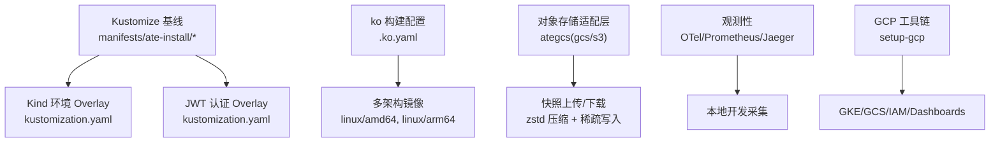
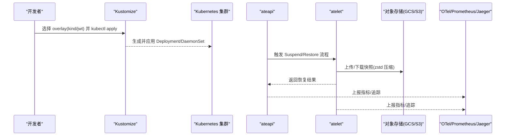
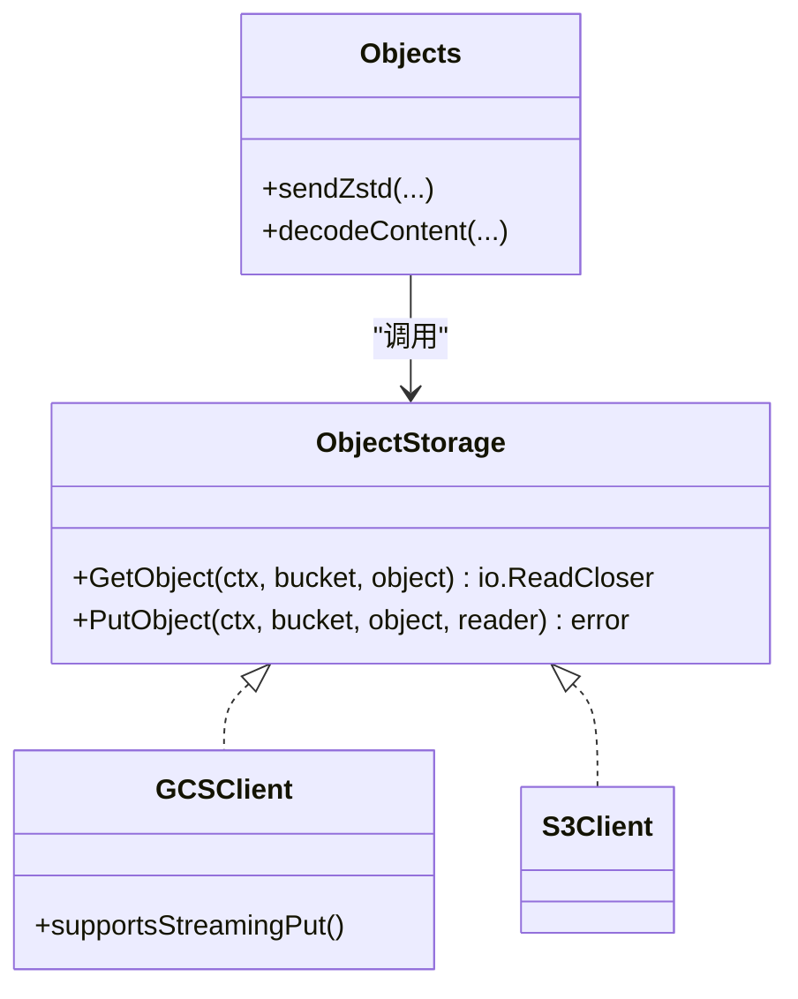
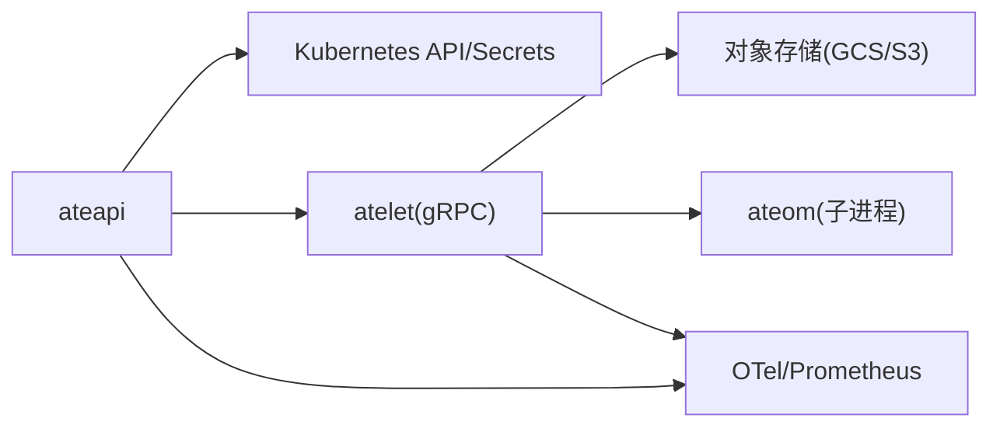

# 多云部署策略

<cite>
**本文引用的文件**   
- [README.md](file://README.md)
- [.ko.yaml](file://.ko.yaml)
- [manifests/ate-install/kind/kustomization.yaml](file://manifests/ate-install/kind/kustomization.yaml)
- [manifests/ate-install/jwt/kustomization.yaml](file://manifests/ate-install/jwt/kustomization.yaml)
- [cmd/atelet/main.go](file://cmd/atelet/main.go)
- [cmd/atelet/internal/ategcs/gcs.go](file://cmd/atelet/internal/ategcs/gcs.go)
- [cmd/atelet/internal/ategcs/s3.go](file://cmd/atelet/internal/ategcs/s3.go)
- [cmd/atelet/internal/ategcs/objects.go](file://cmd/atelet/internal/ategcs/objects.go)
- [cmd/ateapi/internal/controlapi/workload_spec.go](file://cmd/ateapi/internal/controlapi/workload_spec.go)
- [pkg/api/v1alpha1/actortemplate_types.go](file://pkg/api/v1alpha1/actortemplate_types.go)
- [tools/setup-gcp/README.md](file://tools/setup-gcp/README.md)
- [docs/observability.md](file://docs/observability.md)
- [docs/threat-model.md](file://docs/threat-model.md)
</cite>

## 目录
1. [简介](#简介)
2. [项目结构](#项目结构)
3. [核心组件](#核心组件)
4. [架构总览](#架构总览)
5. [详细组件分析](#详细组件分析)
6. [依赖关系分析](#依赖关系分析)
7. [性能考量](#性能考量)
8. [故障排查指南](#故障排查指南)
9. [结论](#结论)
10. [附录](#附录)

## 简介
本文件面向在多云环境下统一部署 Agent Substrate 的工程师与平台团队，围绕以下目标提供可落地的策略与实践：
- 使用 Kustomize 实现跨云平台的配置管理（环境变量抽象、存储后端适配、认证机制统一）
- 容器镜像的多平台构建与分发策略（镜像仓库选择、版本管理）
- 统一的监控与日志收集方案（支持跨云平台数据聚合）
- 灾难恢复策略、数据备份方案、故障转移机制
- 成本比较分析与迁移工具链建议

Agent Substrate 基于 Kubernetes 运行“代理型”工作负载，通过高复用 Worker Pod 承载大量 Actor，结合快照/恢复能力实现快速休眠与唤醒。其控制面与数据面解耦，天然适合在多集群/多云场景下以一致的方式编排与运维。

## 项目结构
从部署视角，本项目提供了：
- 多环境 Kustomize 基线（kind、jwt 等 overlay），用于在不同环境中注入差异配置
- 对象存储后端适配层（GCS/S3），通过环境变量切换
- 多架构镜像构建配置（ko）
- 观测性栈（Prometheus/OpenTelemetry Collector/Jaeger）与 GCP Dashboard 定义
- 工具链（setup-gcp）用于 GCP 资源初始化与仪表盘创建



图表来源
- [manifests/ate-install/kind/kustomization.yaml:15-59](file://manifests/ate-install/kind/kustomization.yaml#L15-L59)
- [manifests/ate-install/jwt/kustomization.yaml:15-65](file://manifests/ate-install/jwt/kustomization.yaml#L15-L65)
- [.ko.yaml:15-28](file://.ko.yaml#L15-L28)
- [cmd/atelet/internal/ategcs/gcs.go:1-67](file://cmd/atelet/internal/ategcs/gcs.go#L1-L67)
- [cmd/atelet/internal/ategcs/s3.go:1-58](file://cmd/atelet/internal/ategcs/s3.go#L1-L58)
- [cmd/atelet/internal/ategcs/objects.go:156-181](file://cmd/atelet/internal/ategcs/objects.go#L156-L181)
- [docs/observability.md:119-194](file://docs/observability.md#L119-L194)
- [tools/setup-gcp/README.md:1-31](file://tools/setup-gcp/README.md#L1-L31)

章节来源
- [README.md:1-225](file://README.md#L1-L225)

## 核心组件
- 控制面 API 服务（ateapi）：对外暴露 gRPC 接口，负责 Actor/Worker 生命周期管理与调度
- 节点守护进程（atelet）：在每个节点上协调快照、镜像拉取、工作负载恢复
- 网络控制器（atenet）：DNS、Envoy 路由与侧车代理
- 控制器（atecontroller）：对 CRD 进行声明式 reconcile
- 对象存储适配层（ategcs）：封装 GCS/S3 的 Put/Get 操作，并处理 zstd 压缩与稀疏写入
- 观测性组件：OpenTelemetry Collector、Prometheus、Jaeger（本地）；GCP Cloud Monitoring（生产）

章节来源
- [README.md:215-225](file://README.md#L215-L225)

## 架构总览
下图展示了多云部署的关键路径：Kustomize 生成各环境清单 → 应用至 K8s 集群 → atelet 根据环境变量选择对象存储后端 → 完成快照上传/下载与恢复。



图表来源
- [cmd/atelet/main.go:126-174](file://cmd/atelet/main.go#L126-L174)
- [cmd/atelet/internal/ategcs/objects.go:156-181](file://cmd/atelet/internal/ategcs/objects.go#L156-L181)
- [docs/observability.md:119-194](file://docs/observability.md#L119-L194)

## 详细组件分析

### 1) 使用 Kustomize 实现跨云配置管理
- 环境变量抽象
  - 通过 Kustomize patches 为 ate-api-server 与 atelet 注入 OTEL_EXPORTER_OTLP_ENDPOINT，使不同环境指向各自的 OTel Collector
  - 参考路径：[manifests/ate-install/kind/kustomization.yaml:30-59](file://manifests/ate-install/kind/kustomization.yaml#L30-L59)
- 存储后端适配
  - 通过环境变量 ATE_STORAGE_BACKEND 切换后端：默认 GCS，设置为 s3 则启用 AWS SDK v2 客户端，并支持 AWS_S3_USE_PATH_STYLE
  - 参考路径：[cmd/atelet/main.go:126-174](file://cmd/atelet/main.go#L126-L174)
- 认证机制统一
  - 使用 jwt overlay 为 ate-api-server、ate-controller、atenet-router 注入 --auth-mode=jwt 与 token 文件参数，统一 JWT 鉴权
  - 参考路径：[manifests/ate-install/jwt/kustomization.yaml:27-65](file://manifests/ate-install/jwt/kustomization.yaml#L27-L65)
- 环境变量解析与 Secret 引用
  - ActorTemplate 中的 EnvVar 仅支持 value 或 valueFrom.secretKeyRef，并在控制面解析后下发到 ateletpb.WorkloadSpec
  - 参考路径：[pkg/api/v1alpha1/actortemplate_types.go:169-200](file://pkg/api/v1alpha1/actortemplate_types.go#L169-L200)、[cmd/ateapi/internal/controlapi/workload_spec.go:77-102](file://cmd/ateapi/internal/controlapi/workload_spec.go#L77-L102)

```mermaid
flowchart TD
Start(["开始"]) --> ReadKust["读取 Kustomize overlay"]
ReadKust --> PatchEnv["注入 OTEL 环境变量"]
PatchEnv --> SwitchBackend{"ATE_STORAGE_BACKEND ?"}
SwitchBackend --> |GCS(默认)| UseGCS["初始化 GCS 客户端"]
SwitchBackend --> |S3| UseS3["初始化 S3 客户端(AWS SDK v2)"]
UseGCS --> Apply["kubectl apply 到集群"]
UseS3 --> Apply
Apply --> End(["完成"])
```

图表来源
- [manifests/ate-install/kind/kustomization.yaml:30-59](file://manifests/ate-install/kind/kustomization.yaml#L30-L59)
- [cmd/atelet/main.go:126-174](file://cmd/atelet/main.go#L126-L174)

章节来源
- [manifests/ate-install/kind/kustomization.yaml:15-59](file://manifests/ate-install/kind/kustomization.yaml#L15-L59)
- [manifests/ate-install/jwt/kustomization.yaml:15-65](file://manifests/ate-install/jwt/kustomization.yaml#L15-L65)
- [cmd/atelet/main.go:126-174](file://cmd/atelet/main.go#L126-L174)
- [cmd/ateapi/internal/controlapi/workload_spec.go:77-102](file://cmd/ateapi/internal/controlapi/workload_spec.go#L77-L102)
- [pkg/api/v1alpha1/actortemplate_types.go:169-200](file://pkg/api/v1alpha1/actortemplate_types.go#L169-L200)

### 2) 容器镜像多平台构建与分发
- 多平台构建
  - 通过 .ko.yaml 设置 defaultPlatforms 为 linux/amd64 与 linux/arm64，并针对特定组件覆盖基础镜像（如 ateom-microvm 需要 debian:stable-slim）
  - 参考路径：[.ko.yaml:15-28](file://.ko.yaml#L15-L28)
- 镜像仓库选择与版本管理
  - 建议在多云场景采用单一全局镜像仓库（如 GCR/ECR/ACR 的镜像转发或镜像同步方案），配合语义化版本与 Git Tag 绑定，确保跨云一致性
  - 结合 CI/CD 流水线，将 ko 构建产物推送至统一仓库，并在 Kustomize overlay 中引用固定 digest 或 tag

章节来源
- [.ko.yaml:15-28](file://.ko.yaml#L15-L28)

### 3) 对象存储后端适配与快照优化
- 后端抽象
  - GCS 与 S3 均实现 ObjectStorage 接口，支持 GetObject/PutObject
  - 参考路径：[cmd/atelet/internal/ategcs/gcs.go:1-67](file://cmd/atelet/internal/ategcs/gcs.go#L1-L67)、[cmd/atelet/internal/ategcs/s3.go:1-58](file://cmd/atelet/internal/ategcs/s3.go#L1-L58)
- 上传策略
  - GCS 支持流式 Put（无需 seekable body），可直接管道压缩输出，避免临时大文件
  - S3/rustfs 需要 seekable body，因此先压缩到临时文件再上传
  - 参考路径：[cmd/atelet/internal/ategcs/objects.go:156-181](file://cmd/atelet/internal/ategcs/objects.go#L156-L181)
- 下载与稀疏写入
  - 自动检测 sparse-extent 格式与纯 zstd 流，写回时支持稀疏写入以减少磁盘占用
  - 参考路径：[cmd/atelet/internal/ategcs/objects.go:341-363](file://cmd/atelet/internal/ategcs/objects.go#L341-L363)



图表来源
- [cmd/atelet/internal/ategcs/gcs.go:1-67](file://cmd/atelet/internal/ategcs/gcs.go#L1-L67)
- [cmd/atelet/internal/ategcs/s3.go:1-58](file://cmd/atelet/internal/ategcs/s3.go#L1-L58)
- [cmd/atelet/internal/ategcs/objects.go:156-181](file://cmd/atelet/internal/ategcs/objects.go#L156-L181)

章节来源
- [cmd/atelet/internal/ategcs/gcs.go:1-67](file://cmd/atelet/internal/ategcs/gcs.go#L1-L67)
- [cmd/atelet/internal/ategcs/s3.go:1-58](file://cmd/atelet/internal/ategcs/s3.go#L1-L58)
- [cmd/atelet/internal/ategcs/objects.go:156-181](file://cmd/atelet/internal/ategcs/objects.go#L156-L181)
- [cmd/atelet/internal/ategcs/objects.go:341-363](file://cmd/atelet/internal/ategcs/objects.go#L341-L363)

### 4) 统一监控与日志收集方案
- 本地开发（Kind）
  - 通过 Kustomize 注入 OTEL_EXPORTER_OTLP_ENDPOINT 指向 in-cluster Collector
  - Prometheus 抓取 ateapi/atelet 指标，Jaeger 用于分布式追踪
  - 参考路径：[manifests/ate-install/kind/kustomization.yaml:30-59](file://manifests/ate-install/kind/kustomization.yaml#L30-L59)、[docs/observability.md:119-194](file://docs/observability.md#L119-L194)
- 生产（GKE/GCP）
  - 使用 setup-gcp 工具创建 Cloud Monitoring Dashboards，集中展示系统级与业务级指标
  - 参考路径：[tools/setup-gcp/README.md:1-31](file://tools/setup-gcp/README.md#L1-L31)
- 跨云聚合建议
  - 在各云部署独立 Collector，汇聚到中心化的时序数据库（如自建 VictoriaMetrics 或托管方案），并通过统一标签（cluster、region、env）进行关联

章节来源
- [manifests/ate-install/kind/kustomization.yaml:30-59](file://manifests/ate-install/kind/kustomization.yaml#L30-L59)
- [docs/observability.md:119-194](file://docs/observability.md#L119-L194)
- [tools/setup-gcp/README.md:1-31](file://tools/setup-gcp/README.md#L1-L31)

### 5) 灾难恢复、数据备份与故障转移
- 快照与恢复
  - atelet 负责将工作负载状态打包为快照，上传至对象存储；恢复时按顺序执行下载、解压、OCI bundle 准备与 ateom 恢复
  - 参考路径：[cmd/atelet/main.go:577-623](file://cmd/atelet/main.go#L577-L623)
- 安全与完整性
  - 威胁模型强调快照完整性校验与访问控制，建议引入签名/摘要校验与最小权限原则
  - 参考路径：[docs/threat-model.md:126-133](file://docs/threat-model.md#L126-L133)
- 故障转移策略
  - 利用 K8s 原生滚动更新与多副本，结合对象存储的跨地域复制（如 GCS Cross-Region Replication、S3 Cross-Region Replication）实现 RPO/RTO 目标
  - 在多云场景，优先保证关键数据（快照、持久卷）的跨区域冗余，控制面组件可按区域就近部署

章节来源
- [cmd/atelet/main.go:577-623](file://cmd/atelet/main.go#L577-L623)
- [docs/threat-model.md:126-133](file://docs/threat-model.md#L126-L133)

### 6) 成本比较分析与迁移工具链
- 成本维度
  - 计算：按区域/机型对比 CPU/内存单价与预留实例折扣
  - 存储：对象存储容量、请求次数、跨域复制费用
  - 网络：跨区/跨云流量费用
  - 观测：日志与追踪数据的保留周期与导出费用
- 迁移工具链
  - 使用 setup-gcp 作为 GCP 侧的一键初始化入口（API、GKE、GCS、IAM、Dashboards）
  - 在其他云侧，建议编写等效脚本（如 terraform/pulumi）复用相同 Kustomize overlay 与环境变量约定，实现“一次定义、多处落地”
  - 参考路径：[tools/setup-gcp/README.md:1-31](file://tools/setup-gcp/README.md#L1-L31)

章节来源
- [tools/setup-gcp/README.md:1-31](file://tools/setup-gcp/README.md#L1-L31)

## 依赖关系分析
- 组件耦合
  - atelet 依赖对象存储后端（GCS/S3）与 ateom 子进程
  - ateapi 依赖 Kubernetes API 与 Secret 缓存
  - Kustomize overlay 仅做配置注入，不改变二进制行为
- 外部依赖
  - AWS SDK v2（S3）、Google Cloud Storage SDK
  - OpenTelemetry、Prometheus、Jaeger（本地）
  - GCP Cloud Monitoring（生产）



图表来源
- [cmd/ateapi/internal/controlapi/workload_spec.go:186-191](file://cmd/ateapi/internal/controlapi/workload_spec.go#L186-L191)
- [cmd/atelet/main.go:126-174](file://cmd/atelet/main.go#L126-L174)
- [docs/observability.md:119-194](file://docs/observability.md#L119-L194)

章节来源
- [cmd/ateapi/internal/controlapi/workload_spec.go:186-191](file://cmd/ateapi/internal/controlapi/workload_spec.go#L186-L191)
- [cmd/atelet/main.go:126-174](file://cmd/atelet/main.go#L126-L174)
- [docs/observability.md:119-194](file://docs/observability.md#L119-L194)

## 性能考量
- 快照上传/下载
  - GCS 流式上传可减少临时 IO，提升吞吐
  - S3 需缓冲到临时文件，注意磁盘空间与 IO 压力
  - 参考路径：[cmd/atelet/internal/ategcs/objects.go:156-181](file://cmd/atelet/internal/ategcs/objects.go#L156-L181)
- 恢复耗时分解
  - 下载、OCI 解压、ateom 恢复三个阶段分别打点，便于定位瓶颈
  - 参考路径：[cmd/atelet/main.go:577-582](file://cmd/atelet/main.go#L577-L582)
- 指标与追踪
  - 通过 OTel/Prometheus/Jaeger 建立端到端视图，关注 RPC 延迟、快照大小与恢复时长
  - 参考路径：[docs/observability.md:119-194](file://docs/observability.md#L119-L194)

章节来源
- [cmd/atelet/internal/ategcs/objects.go:156-181](file://cmd/atelet/internal/ategcs/objects.go#L156-L181)
- [cmd/atelet/main.go:577-582](file://cmd/atelet/main.go#L577-L582)
- [docs/observability.md:119-194](file://docs/observability.md#L119-L194)

## 故障排查指南
- 常见问题定位
  - 对象存储不可用：检查 ATE_STORAGE_BACKEND 与对应云凭据（ADC/AWS 环境变量）
  - 快照恢复失败：查看 atelet 日志中的阶段耗时与错误码，确认对象是否存在与权限是否足够
  - 指标未上报：确认 OTEL_EXPORTER_OTLP_ENDPOINT 是否正确注入且可达
- 相关代码位置
  - 存储后端初始化与错误处理：[cmd/atelet/main.go:126-174](file://cmd/atelet/main.go#L126-L174)
  - 上传/下载逻辑与错误包装：[cmd/atelet/internal/ategcs/objects.go:156-181](file://cmd/atelet/internal/ategcs/objects.go#L156-L181)
  - 观测性配置注入：[manifests/ate-install/kind/kustomization.yaml:30-59](file://manifests/ate-install/kind/kustomization.yaml#L30-L59)

章节来源
- [cmd/atelet/main.go:126-174](file://cmd/atelet/main.go#L126-L174)
- [cmd/atelet/internal/ategcs/objects.go:156-181](file://cmd/atelet/internal/ategcs/objects.go#L156-L181)
- [manifests/ate-install/kind/kustomization.yaml:30-59](file://manifests/ate-install/kind/kustomization.yaml#L30-L59)

## 结论
通过在 Kustomize overlay 中抽象环境变量、在 atelet 中以环境变量切换对象存储后端、在 jwt overlay 中统一认证模式，并结合多架构镜像构建与统一的观测性栈，可以在多云环境下实现一致的部署体验。配合快照/恢复与跨域复制策略，可满足高可用与灾备要求。建议以 setup-gcp 为模板，在其他云侧实现等价工具链，形成“一套清单、多套落地”的标准化实践。

## 附录
- 术语
  - Actor：被管理的无状态/有状态工作单元
  - Worker：承载多个 Actor 的物理 Pod
  - Snapshot：工作负载完整状态的快照，包含内存与文件系统
- 参考文档
  - 可观测性指南：[docs/observability.md](file://docs/observability.md)
  - 威胁模型与安全建议：[docs/threat-model.md](file://docs/threat-model.md)
  - GCP 工具链说明：[tools/setup-gcp/README.md](file://tools/setup-gcp/README.md)
