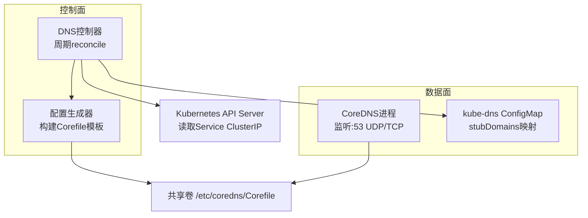
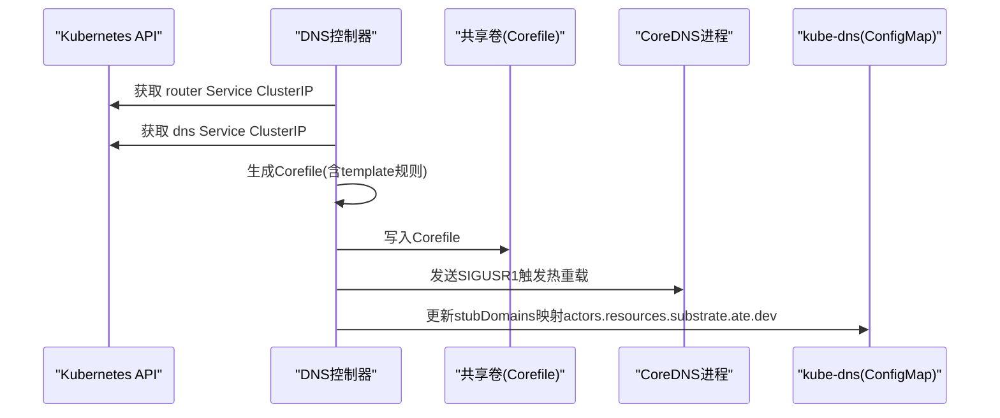
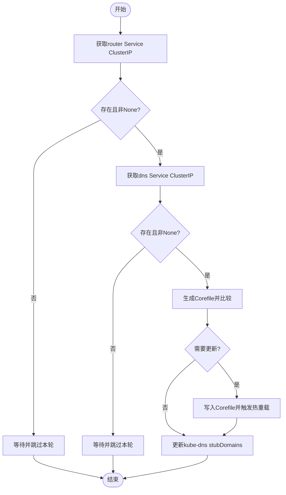
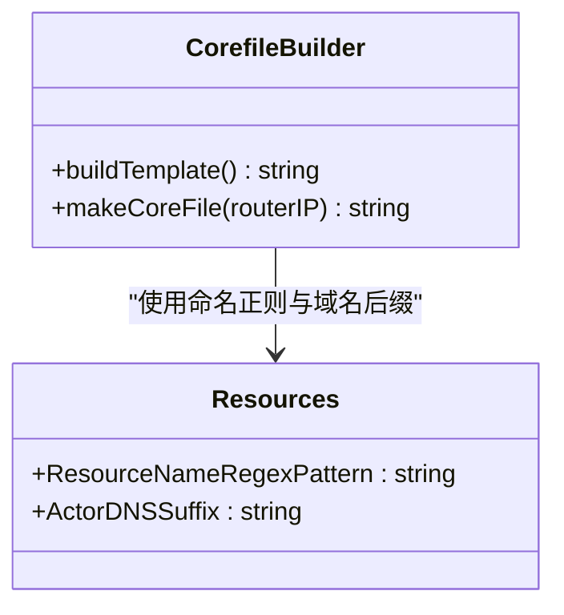
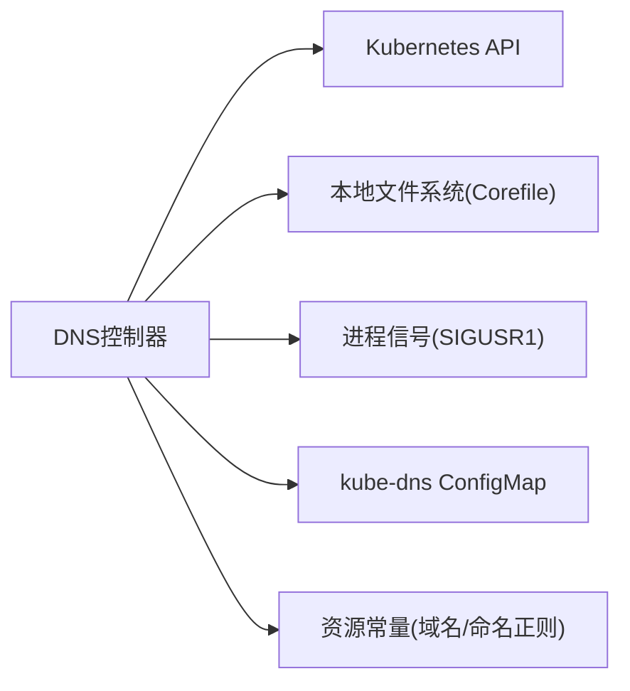

# DNS服务集成

<cite>
**本文引用的文件**   
- [cmd/atenet/internal/dns/README.md](file://cmd/atenet/internal/dns/README.md)
- [cmd/atenet/internal/dns/dns.go](file://cmd/atenet/internal/dns/dns.go)
- [cmd/atenet/internal/dns/corefile.go](file://cmd/atenet/internal/dns/corefile.go)
- [cmd/atenet/internal/dns/dns_test.go](file://cmd/atenet/internal/dns/dns_test.go)
- [cmd/atenet/internal/dns/corefile_test.go](file://cmd/atenet/internal/dns/corefile_test.go)
- [cmd/atenet/internal/dns.go](file://cmd/atenet/internal/dns.go)
- [internal/resources/actor.go](file://internal/resources/actor.go)
- [manifests/ate-install/atenet-dns.yaml](file://manifests/ate-install/atenet-dns.yaml)
</cite>

## 目录
1. [简介](#简介)
2. [项目结构](#项目结构)
3. [核心组件](#核心组件)
4. [架构总览](#架构总览)
5. [详细组件分析](#详细组件分析)
6. [依赖关系分析](#依赖关系分析)
7. [性能与优化](#性能与优化)
8. [监控与可观测性](#监控与可观测性)
9. [故障排查指南](#故障排查指南)
10. [结论](#结论)

## 简介
本文件系统性说明本项目中DNS服务的集成配置与工作原理，重点覆盖：
- CoreDNS的配置生成与动态重载机制
- 与Kubernetes Service的集成（名称解析、命名空间隔离）
- 自定义插件思路与扩展点（基于CoreDNS模板与reload能力）
- 缓存策略与性能调优建议
- 监控指标与常见问题的定位方法

## 项目结构
DNS相关代码位于 atenet 子命令内部，采用“控制器+配置生成”的模式：
- 入口命令：提供dns子命令，负责初始化Kubernetes客户端并启动DNS控制器
- 控制器：周期性拉取集群Service信息，生成CoreDNS Corefile并写入共享卷，触发CoreDNS进程热重载
- 配置生成：根据资源命名规则与域名后缀，构造匹配规则与A记录答案
- 部署清单：以Deployment形式运行CoreDNS，并通过InitContainer预置最小可用Corefile，由控制器后续更新

图表来源
- [cmd/atenet/internal/dns/dns.go:50-117](file://cmd/atenet/internal/dns/dns.go#L50-L117)
- [cmd/atenet/internal/dns/corefile.go:32-64](file://cmd/atenet/internal/dns/corefile.go#L32-L64)
- [manifests/ate-install/atenet-dns.yaml:74-131](file://manifests/ate-install/atenet-dns.yaml#L74-L131)

章节来源
- [cmd/atenet/internal/dns/README.md:1-37](file://cmd/atenet/internal/dns/README.md#L1-L37)
- [cmd/atenet/internal/dns.go:42-107](file://cmd/atenet/internal/dns.go#L42-L107)
- [manifests/ate-install/atenet-dns.yaml:74-131](file://manifests/ate-install/atenet-dns.yaml#L74-L131)

## 核心组件
- DNS控制器（Controller）
  - 职责：周期性获取router与dns服务的ClusterIP，生成Corefile并写入共享卷；更新kube-system:kube-dns的stubDomains；通过信号通知CoreDNS热重载。
  - 关键流程：Run循环 -> reconcile -> reconcileCoreDNSConfig -> reconcileKubeDNSConfig -> Reloader.Reload。
- 配置生成器（corefile模板）
  - 职责：根据Actor域名后缀与命名正则，生成CoreDNS zone与template规则，将匹配到的查询返回到router服务地址。
- 进程重载器（ConfigReloader）
  - 职责：在本地进程间通过查找coredns进程PID并发送SIGUSR1，触发CoreDNS热重载。
- 资源常量与工具
  - 职责：定义Actor域名后缀与命名规范，供模板与校验使用。

章节来源
- [cmd/atenet/internal/dns/dns.go:42-117](file://cmd/atenet/internal/dns/dns.go#L42-L117)
- [cmd/atenet/internal/dns/corefile.go:25-64](file://cmd/atenet/internal/dns/corefile.go#L25-L64)
- [internal/resources/actor.go:22-39](file://internal/resources/actor.go#L22-L39)

## 架构总览
DNS控制器作为编排者，不直接处理DNS查询，而是确保CoreDNS与集群DNS转发链路的配置一致性与时效性。

图表来源
- [cmd/atenet/internal/dns/dns.go:71-189](file://cmd/atenet/internal/dns/dns.go#L71-L189)
- [cmd/atenet/internal/dns/corefile.go:32-64](file://cmd/atenet/internal/dns/corefile.go#L32-L64)

## 详细组件分析

### DNS控制器（Controller）
- 生命周期
  - 启动时输出日志与使用的模板信息
  - 按固定间隔执行reconcile，直到上下文取消
- reconcile步骤
  - 读取ate-system命名空间下router与dns两个Service的ClusterIP，若不存在或为None则跳过等待
  - 生成并对比本地Corefile，差异则覆盖写入并触发热重载
  - 更新kube-system:kube-dns的stubDomains，将actors.resources.substrate.ate.dev指向当前dns服务IP
- 错误处理
  - 对缺失资源进行告警并跳过
  - 对读写失败、JSON序列化失败等错误返回具体错误信息

图表来源
- [cmd/atenet/internal/dns/dns.go:71-189](file://cmd/atenet/internal/dns/dns.go#L71-L189)

章节来源
- [cmd/atenet/internal/dns/dns.go:50-117](file://cmd/atenet/internal/dns/dns.go#L50-L117)
- [cmd/atenet/internal/dns/dns.go:119-189](file://cmd/atenet/internal/dns/dns.go#L119-L189)
- [cmd/atenet/internal/dns/dns_test.go:42-146](file://cmd/atenet/internal/dns/dns_test.go#L42-L146)

### CoreDNS配置生成（corefile模板）
- 模板组成
  - 启用log、errors、health(:8080)、ready(:8181)、reload等插件
  - 针对actors.resources.substrate.ate.dev域，使用template IN A指令
  - match表达式严格匹配<actor>.<atespace>.actors.resources.substrate.ate.dev格式
  - answer返回对应A记录，TTL=60秒，目标IP为router服务ClusterIP
- 生成逻辑
  - 使用资源命名正则与域名后缀拼接match规则
  - 将router IP注入answer行，最终输出完整Corefile文本

图表来源
- [cmd/atenet/internal/dns/corefile.go:32-64](file://cmd/atenet/internal/dns/corefile.go#L32-L64)
- [internal/resources/actor.go:22-39](file://internal/resources/actor.go#L22-L39)

章节来源
- [cmd/atenet/internal/dns/corefile.go:25-64](file://cmd/atenet/internal/dns/corefile.go#L25-L64)
- [cmd/atenet/internal/dns/corefile_test.go:24-65](file://cmd/atenet/internal/dns/corefile_test.go#L24-L65)
- [internal/resources/actor.go:22-39](file://internal/resources/actor.go#L22-L39)

### 进程重载器（ConfigReloader）
- 实现方式
  - 扫描/proc，匹配comm为coredns的进程ID
  - 向该进程发送SIGUSR1，触发CoreDNS热重载
- 健壮性
  - 找不到进程或发送信号失败会记录错误并返回

章节来源
- [cmd/atenet/internal/dns/dns.go:191-252](file://cmd/atenet/internal/dns/dns.go#L191-L252)

### 入口命令与参数
- 子命令dns
  - 支持--log-level、--kubeconfig、--interval、--corefile-path
  - 初始化Kubernetes客户端，创建DNS控制器并启动Run循环

章节来源
- [cmd/atenet/internal/dns.go:42-107](file://cmd/atenet/internal/dns.go#L42-L107)

### 部署与权限
- Deployment
  - 运行CoreDNS镜像，暴露53端口UDP/TCP
  - 通过init容器预置最小Corefile，随后由控制器更新
  - 健康检查与就绪探针分别挂载8080与8181端口
- RBAC
  - 允许在ate-system与kube-system命名空间读写ConfigMap
  - 允许在ate-system命名空间读取Services

章节来源
- [manifests/ate-install/atenet-dns.yaml:15-73](file://manifests/ate-install/atenet-dns.yaml#L15-L73)
- [manifests/ate-install/atenet-dns.yaml:74-131](file://manifests/ate-install/atenet-dns.yaml#L74-L131)

## 依赖关系分析
- 控制器依赖
  - Kubernetes client-go用于读取Service与更新ConfigMap
  - 文件系统用于读写Corefile
  - 操作系统进程接口用于发送信号
- 配置依赖
  - internal/resources定义的Actor域名后缀与命名正则
- 运行时依赖
  - CoreDNS进程需处于同一Pod或共享进程命名空间以便信号传递

图表来源
- [cmd/atenet/internal/dns/dns.go:71-189](file://cmd/atenet/internal/dns/dns.go#L71-L189)
- [internal/resources/actor.go:22-39](file://internal/resources/actor.go#L22-L39)

章节来源
- [cmd/atenet/internal/dns/dns.go:71-189](file://cmd/atenet/internal/dns/dns.go#L71-L189)
- [internal/resources/actor.go:22-39](file://internal/resources/actor.go#L22-L39)

## 性能与优化
- 缓存策略
  - Corefile模板中answer行的TTL设置为60秒，可在模板生成处调整TTL以满足不同场景需求
- 查询频率限制
  - 当前未内置限流插件；如需限流，可在Corefile模板中添加相应插件并在模板生成处启用
- 负载均衡策略
  - 当前A记录指向单一router服务ClusterIP；如需多后端负载，可在模板层改为CNAME或多A记录策略（需在模板生成逻辑中扩展）
- 调度与副本
  - 部署清单默认单副本；可根据QPS提升副本数并结合外部负载均衡器（如NodePort/LoadBalancer）分发流量

章节来源
- [cmd/atenet/internal/dns/corefile.go:44-50](file://cmd/atenet/internal/dns/corefile.go#L44-L50)
- [manifests/ate-install/atenet-dns.yaml:74-131](file://manifests/ate-install/atenet-dns.yaml#L74-L131)

## 监控与可观测性
- CoreDNS健康与就绪
  - health端点(:8080)与ready端点(:8181)已启用，可用于存活与就绪探针
- 日志
  - 控制器与CoreDNS均输出结构化日志，便于聚合与分析
- 指标
  - 当前DNS控制器未内置Prometheus指标导出；可通过日志聚合与CoreDNS自身指标（如启用metrics插件）进行采集

章节来源
- [cmd/atenet/internal/dns/corefile.go:36-40](file://cmd/atenet/internal/dns/corefile.go#L36-L40)
- [cmd/atenet/internal/dns/dns.go:51-68](file://cmd/atenet/internal/dns/dns.go#L51-L68)

## 故障排查指南
- 常见问题与定位
  - router或dns服务尚未分配ClusterIP：控制器会记录警告并跳过，待服务就绪后自动继续
  - kube-dns ConfigMap不存在：控制器会记录警告并跳过，不影响Corefile更新
  - Corefile未生效：确认共享卷路径是否正确、是否成功写入、是否收到SIGUSR1信号
  - 查询未命中：核对域名是否符合actors.resources.substrate.ate.dev模式，以及match正则是否被正确生成
- 验证步骤
  - 查看控制器日志，确认reconcile是否成功、是否触发重载
  - 检查共享卷中的Corefile内容是否与预期一致
  - 检查kube-system:kube-dns的stubDomains是否包含actors.resources.substrate.ate.dev并指向当前dns服务IP
  - 使用dig/nslookup测试解析结果与TTL

章节来源
- [cmd/atenet/internal/dns/dns.go:71-117](file://cmd/atenet/internal/dns/dns.go#L71-L117)
- [cmd/atenet/internal/dns/dns.go:143-189](file://cmd/atenet/internal/dns/dns.go#L143-L189)
- [cmd/atenet/internal/dns/dns_test.go:148-199](file://cmd/atenet/internal/dns/dns_test.go#L148-L199)

## 结论
本项目通过轻量级DNS控制器与CoreDNS模板化配置，实现了面向Actor资源的动态DNS解析与热重载。其优势在于：
- 配置集中生成、版本可控、变更即时生效
- 与Kubernetes原生资源紧密集成，具备良好可扩展性
- 通过健康与就绪探针保障可用性

未来可在模板层引入更多插件（如限流、缓存、指标），并根据业务规模调整TTL与副本策略，以获得更优的性能与稳定性。
