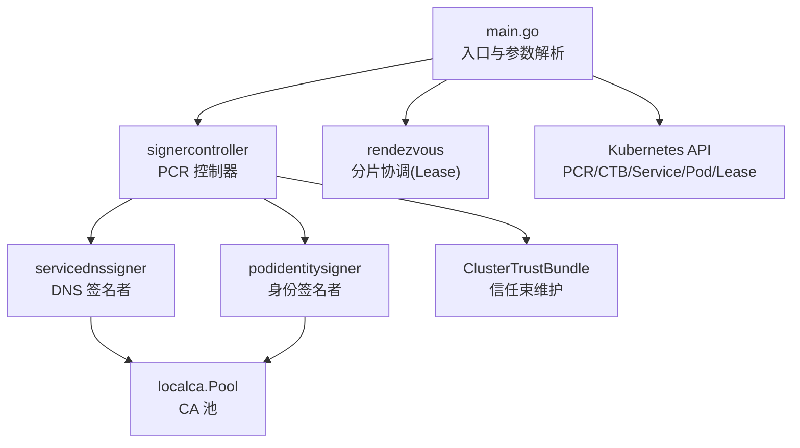
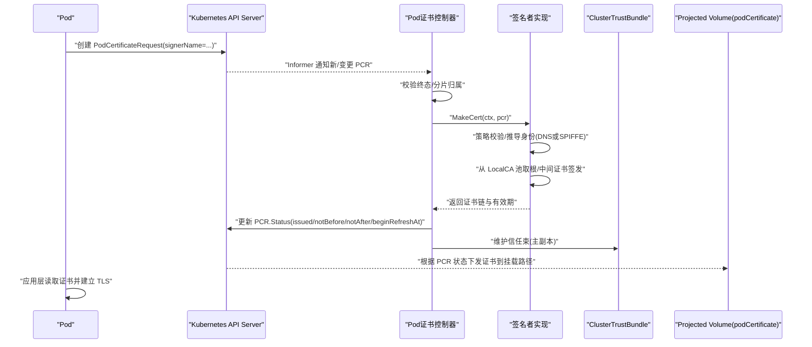
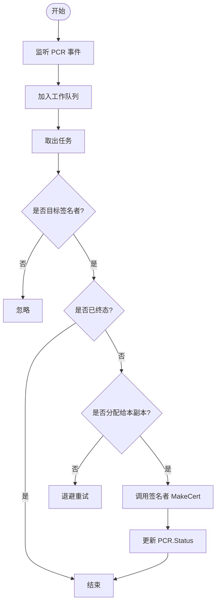
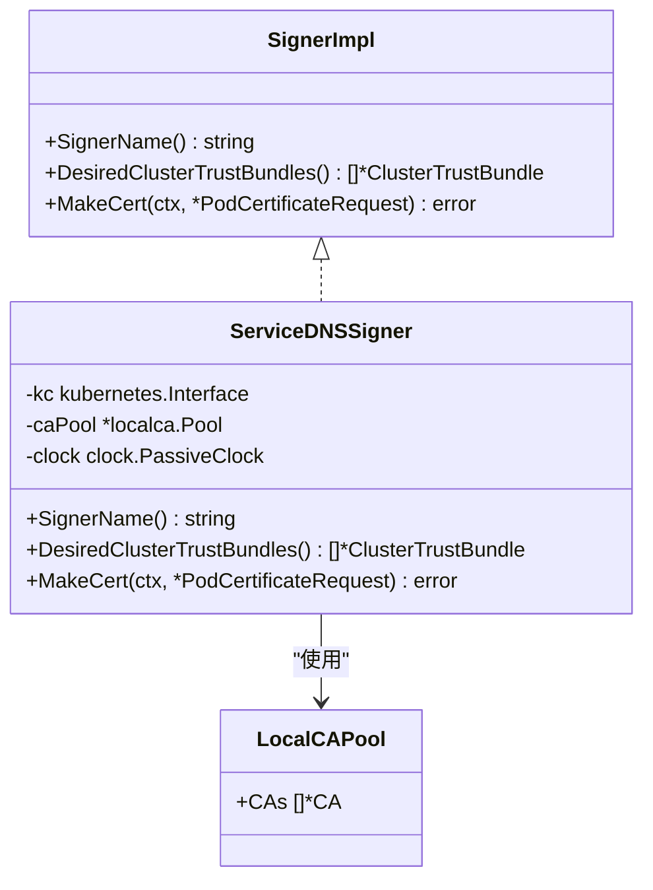
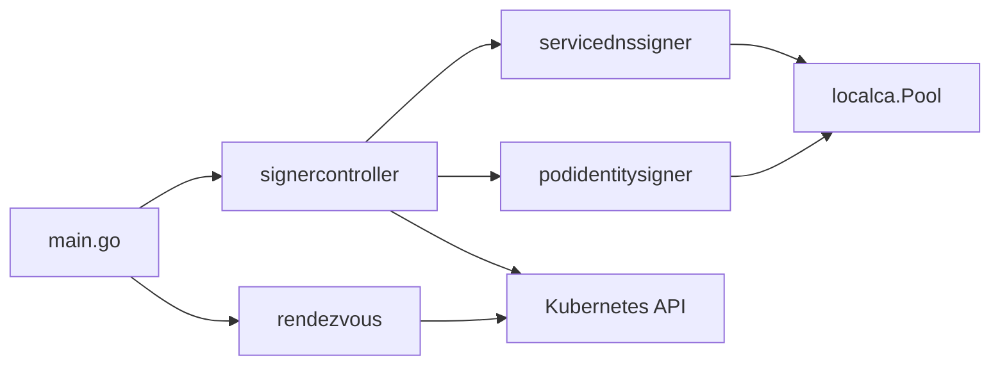

# Pod证书控制器

<cite>
**本文引用的文件列表**
- [cmd/podcertcontroller/main.go](file://cmd/podcertcontroller/main.go)
- [cmd/podcertcontroller/internal/signercontroller/signercontroller.go](file://cmd/podcertcontroller/internal/signercontroller/signercontroller.go)
- [cmd/podcertcontroller/internal/servicednssigner/servicednssigner.go](file://cmd/podcertcontroller/internal/servicednssigner/servicednssigner.go)
- [cmd/podcertcontroller/internal/podidentitysigner/podidentitysigner.go](file://cmd/podcertcontroller/internal/podidentitysigner/podidentitysigner.go)
- [internal/localca/localca.go](file://internal/localca/localca.go)
- [cmd/podcertcontroller/internal/rendezvous/rendezvous.go](file://cmd/podcertcontroller/internal/rendezvous/rendezvous.go)
- [manifests/ate-install/pod-certificate-controller.yaml](file://manifests/ate-install/pod-certificate-controller.yaml)
- [manifests/ate-install/valkey.yaml](file://manifests/ate-install/valkey.yaml)
</cite>

## 目录
1. [简介](#简介)
2. [项目结构](#项目结构)
3. [核心组件](#核心组件)
4. [架构总览](#架构总览)
5. [详细组件分析](#详细组件分析)
6. [依赖关系分析](#依赖关系分析)
7. [性能与可扩展性](#性能与可扩展性)
8. [监控与故障诊断](#监控与故障诊断)
9. [结论](#结论)
10. [附录：配置清单与最佳实践](#附录配置清单与最佳实践)

## 简介
本文件系统性说明 Pod 证书控制器的作用、实现原理与运维配置。该控制器通过 Kubernetes 的 PodCertificateRequest（PCR）机制，为 Pod 自动签发和管理 TLS 证书，支持两类签名者：
- servicedns.podcert.ate.dev/identity：基于服务 DNS 名称签发证书，适用于服务间 mTLS 通信。
- podidentity.podcert.ate.dev/identity：基于 Pod 身份（等价于 KSA Token 语义）签发证书，用于工作负载身份认证。

控制器使用本地 CA 池进行证书签发，并通过 ClusterTrustBundle 将信任根分发到集群中，配合 Projected Volume 的 podCertificate 源完成证书注入与自动轮换。

## 项目结构
Pod 证书控制器位于 cmd/podcertcontroller，核心由以下模块组成：
- main.go：入口，解析参数、初始化 CA 池、启动各签名者控制器与分片协调器。
- signercontroller：通用 PCR 处理控制器，负责监听 PCR、分片调度、更新状态与维持信任束。
- servicednssigner：servicedns 签名者实现，按服务选择器推导可签发的 DNS 名称并签发证书。
- podidentitysigner：podidentity 签名者实现，按 Pod 的 ServiceAccount 生成 SPIFFE URI 并签发证书。
- rendezvous：基于 Lease 的 Rendezvous Hashing 分片协调，避免多副本重复处理。
- localca：本地 CA 池序列化/反序列化与 ED25519 根密钥生成工具。
- manifests：部署清单，包含 RBAC、Deployment、CA 池 Secret 挂载等。

图表来源
- [cmd/podcertcontroller/main.go:80-157](file://cmd/podcertcontroller/main.go#L80-L157)
- [cmd/podcertcontroller/internal/signercontroller/signercontroller.go:62-114](file://cmd/podcertcontroller/internal/signercontroller/signercontroller.go#L62-L114)
- [cmd/podcertcontroller/internal/servicednssigner/servicednssigner.go:48-90](file://cmd/podcertcontroller/internal/servicednssigner/servicednssigner.go#L48-L90)
- [cmd/podcertcontroller/internal/podidentitysigner/podidentitysigner.go:48-90](file://cmd/podcertcontroller/internal/podidentitysigner/podidentitysigner.go#L48-L90)
- [internal/localca/localca.go:30-51](file://internal/localca/localca.go#L30-L51)
- [cmd/podcertcontroller/internal/rendezvous/rendezvous.go:106-143](file://cmd/podcertcontroller/internal/rendezvous/rendezvous.go#L106-L143)

章节来源
- [cmd/podcertcontroller/main.go:80-157](file://cmd/podcertcontroller/main.go#L80-L157)
- [manifests/ate-install/pod-certificate-controller.yaml:123-196](file://manifests/ate-install/pod-certificate-controller.yaml#L123-L196)

## 核心组件
- 入口与参数
  - 支持 in-cluster/kubeconfig 两种连接方式；提供 sharding 参数用于多副本分片；加载两个 CA 池文件路径。
- 分片协调器（Rendezvous）
  - 基于 Lease 的 Rendezvous Hashing，保证每个 PCR 仅由一个副本处理，同时允许短暂并发幂等处理。
- 通用控制器（SignerController）
  - 监听所有命名空间的 PCR，过滤目标 SignerName，检查是否已终态，计算分片归属后调用具体签名者 MakeCert，并周期维护 ClusterTrustBundle。
- 签名者实现
  - servicednssigner：列出当前命名空间的服务，匹配选择器找到目标 Pod，生成对应 .svc 域名作为 DNSNames，签发双向 TLS 证书。
  - podidentitysigner：读取 Pod 的 ServiceAccount，构造 SPIFFE URI，签发仅客户端认证的证书。
- 本地 CA 池（LocalCA）
  - 以 JSON 形式持久化 CA 私钥与证书链，支持从 Secret 或文件加载；提供 ED25519 根密钥生成能力。

章节来源
- [cmd/podcertcontroller/main.go:56-78](file://cmd/podcertcontroller/main.go#L56-L78)
- [cmd/podcertcontroller/internal/signercontroller/signercontroller.go:38-75](file://cmd/podcertcontroller/internal/signercontroller/signercontroller.go#L38-L75)
- [cmd/podcertcontroller/internal/servicednssigner/servicednssigner.go:92-210](file://cmd/podcertcontroller/internal/servicednssigner/servicednssigner.go#L92-L210)
- [cmd/podcertcontroller/internal/podidentitysigner/podidentitysigner.go:92-175](file://cmd/podcertcontroller/internal/podidentitysigner/podidentitysigner.go#L92-L175)
- [internal/localca/localca.go:30-120](file://internal/localca/localca.go#L30-L120)

## 架构总览
下图展示从 Pod 发起证书请求到控制器签发并注入的端到端流程。

图表来源
- [cmd/podcertcontroller/internal/signercontroller/signercontroller.go:104-201](file://cmd/podcertcontroller/internal/signercontroller/signercontroller.go#L104-L201)
- [cmd/podcertcontroller/internal/servicednssigner/servicednssigner.go:168-209](file://cmd/podcertcontroller/internal/servicednssigner/servicednssigner.go#L168-L209)
- [cmd/podcertcontroller/internal/podidentitysigner/podidentitysigner.go:133-175](file://cmd/podcertcontroller/internal/podidentitysigner/podidentitysigner.go#L133-L175)
- [manifests/ate-install/valkey.yaml:212-218](file://manifests/ate-install/valkey.yaml#L212-L218)

## 详细组件分析

### 组件一：通用控制器（SignerController）
职责
- 监听 PCR，去重与速率限制。
- 过滤非目标 SignerName，跳过已终态请求。
- 通过 Rendezvous 分片决定由哪个副本处理。
- 调用具体签名者 MakeCert，并周期维护 ClusterTrustBundle。

关键流程
- informer 事件入队 -> worker 拉取 -> handlePCR -> MakeCert -> 更新 Status。
- ensureBundles 周期性同步期望的 ClusterTrustBundle。

图表来源
- [cmd/podcertcontroller/internal/signercontroller/signercontroller.go:116-201](file://cmd/podcertcontroller/internal/signercontroller/signercontroller.go#L116-L201)

章节来源
- [cmd/podcertcontroller/internal/signercontroller/signercontroller.go:62-114](file://cmd/podcertcontroller/internal/signercontroller/signercontroller.go#L62-L114)
- [cmd/podcertcontroller/internal/signercontroller/signercontroller.go:167-201](file://cmd/podcertcontroller/internal/signercontroller/signercontroller.go#L167-L201)
- [cmd/podcertcontroller/internal/signercontroller/signercontroller.go:203-249](file://cmd/podcertcontroller/internal/signercontroller/signercontroller.go#L203-L249)

### 组件二：servicedns.podcert.ate.dev/identity 签名者
职责
- 根据 Pod 所属 Service 推导可签发的 DNS 名称集合。
- 使用本地 CA 池签发双向 TLS 证书（ClientAuth + ServerAuth）。
- 设置证书有效期与 beginRefreshAt，驱动客户端侧自动轮换。

身份验证与权限控制
- 通过 kube-apiserver 的 PCR 节点隔离与签名者授权（RBAC signers.sign）保障请求合法性。
- 控制器内部再次校验 Pod UID 与服务选择器匹配，确保仅对受控 Pod 签发。

证书生命周期管理
- 默认最长有效期 24h，若请求 MaxExpirationSeconds 更小则采用请求值。
- NotBefore 提前 2 分钟，BeginRefreshAt 在到期前 30 分钟，便于客户端预热轮换。

图表来源
- [cmd/podcertcontroller/internal/signercontroller/signercontroller.go:38-42](file://cmd/podcertcontroller/internal/signercontroller/signercontroller.go#L38-L42)
- [cmd/podcertcontroller/internal/servicednssigner/servicednssigner.go:41-54](file://cmd/podcertcontroller/internal/servicednssigner/servicednssigner.go#L41-L54)
- [internal/localca/localca.go:30-39](file://internal/localca/localca.go#L30-L39)

章节来源
- [cmd/podcertcontroller/internal/servicednssigner/servicednssigner.go:92-210](file://cmd/podcertcontroller/internal/servicednssigner/servicednssigner.go#L92-L210)
- [manifests/ate-install/pod-certificate-controller.yaml:62-70](file://manifests/ate-install/pod-certificate-controller.yaml#L62-L70)

### 组件三：podidentity.podcert.ate.dev/identity 签名者
职责
- 读取 Pod 的 ServiceAccount，构造 SPIFFE URI（spiffe://cluster.local/ns/{ns}/sa/{sa}）。
- 签发仅客户端认证的证书，用于工作负载身份认证。

身份验证与权限控制
- 校验 Pod UID 与 PCR 一致，防止伪造。
- 通过 RBAC 限制仅允许特定签名者名称被调用。

证书生命周期管理
- 与 DNS 签名者相同的有效期与刷新时间策略。

章节来源
- [cmd/podcertcontroller/internal/podidentitysigner/podidentitysigner.go:92-175](file://cmd/podcertcontroller/internal/podidentitysigner/podidentitysigner.go#L92-L175)

### 组件四：本地 CA 池（LocalCA）
职责
- 提供 CA 池的序列化/反序列化，支持 PKCS#8/PEM 多种私钥格式。
- 提供 ED25519 根密钥生成，便于离线准备 CA 池。

数据流
- 启动时从文件或 Secret 加载 pool.json，反序列化为 Pool 对象供签名者使用。
- 未来可结合外部密钥管理服务实现动态轮转与高可用。

章节来源
- [internal/localca/localca.go:53-120](file://internal/localca/localca.go#L53-L120)
- [internal/localca/localca.go:159-192](file://internal/localca/localca.go#L159-L192)
- [cmd/podcertcontroller/main.go:123-149](file://cmd/podcertcontroller/main.go#L123-L149)

### 组件五：分片协调（Rendezvous）
职责
- 基于 Lease 的 Rendezvous Hashing，将 PCR 均匀分配到多个控制器副本。
- 定期续租，剔除不健康副本，保证稳定状态下近似均摊。

章节来源
- [cmd/podcertcontroller/internal/rendezvous/rendezvous.go:106-143](file://cmd/podcertcontroller/internal/rendezvous/rendezvous.go#L106-L143)
- [cmd/podcertcontroller/internal/rendezvous/rendezvous.go:205-250](file://cmd/podcertcontroller/internal/rendezvous/rendezvous.go#L205-L250)

## 依赖关系分析
- 控制器对外依赖：
  - certificates.k8s.io/v1beta1：PodCertificateRequest、ClusterTrustBundle、Signers。
  - core/v1：Services、Pods。
  - coordination.k8s.io/v1：Leases（分片协调）。
- 内部依赖：
  - localca.Pool：CA 池读写。
  - rendezvous.Hasher：分片分配。

图表来源
- [cmd/podcertcontroller/main.go:123-149](file://cmd/podcertcontroller/main.go#L123-L149)
- [cmd/podcertcontroller/internal/signercontroller/signercontroller.go:62-114](file://cmd/podcertcontroller/internal/signercontroller/signercontroller.go#L62-L114)
- [cmd/podcertcontroller/internal/rendezvous/rendezvous.go:106-143](file://cmd/podcertcontroller/internal/rendezvous/rendezvous.go#L106-L143)

章节来源
- [manifests/ate-install/pod-certificate-controller.yaml:20-76](file://manifests/ate-install/pod-certificate-controller.yaml#L20-L76)

## 性能与可扩展性
- 分片并行：Rendezvous 使多副本并行处理不同 PCR，提升吞吐。
- 速率限制：工作队列使用默认速率限制器，避免突发放大。
- 索引优化：PCR Informer 使用 NamespaceIndex，加速按命名空间查询。
- 建议
  - 针对大规模 Service 场景，可考虑维护“Pod -> 覆盖服务”的索引以减少全量 List。
  - 将 CA 池迁移至外部密钥管理服务，支持在线轮转与高可用。

[本节为通用指导，无需源码引用]

## 监控与故障诊断
- 日志
  - 控制器使用结构化日志输出错误与处理信息，可通过容器日志收集系统集中查看。
- 事件
  - RBAC 允许创建 events，可用于记录异常与审计。
- 指标
  - 建议在控制器中暴露 Prometheus 指标（如处理延迟、失败计数、证书过期倒计时），以便告警。
- 常见问题定位
  - 证书未下发：检查 PCR 状态条件是否为 issued/denied/failed；确认分片是否分配给当前副本；查看控制器日志中的错误信息。
  - 信任链不可用：确认 ClusterTrustBundle 是否存在且内容正确；检查客户端是否挂载了正确的 CA。
  - 权限不足：核对 RBAC 是否授予 signers.sign 与相关资源访问权限。
  - 多副本冲突：观察 Lease 是否按时续期；确认 Rendezvous 成员列表是否正确。

章节来源
- [cmd/podcertcontroller/internal/signercontroller/signercontroller.go:141-161](file://cmd/podcertcontroller/internal/signercontroller/signercontroller.go#L141-L161)
- [manifests/ate-install/pod-certificate-controller.yaml:71-76](file://manifests/ate-install/pod-certificate-controller.yaml#L71-L76)

## 结论
Pod 证书控制器通过标准化的 PCR 接口与本地 CA 池，实现了面向服务 DNS 与工作负载身份的自动化证书签发与管理。借助 Rendezvous 分片与 ClusterTrustBundle 信任分发，系统在多副本环境下具备良好扩展性与一致性。配合 Projected Volume 的 podCertificate 源，可实现证书自动注入与平滑轮换，满足生产环境安全与可用性要求。

[本节为总结，无需源码引用]

## 附录：配置清单与最佳实践

### 部署与 RBAC
- 命名空间与 SA：控制器运行在专用命名空间，使用独立 SA。
- ClusterRole/Binding：授予 signers.sign、podcertificaterequests.*、clustertrustbundles.*、services/pods 读权限。
- Role/Binding：leases 操作用于分片协调。

章节来源
- [manifests/ate-install/pod-certificate-controller.yaml:20-122](file://manifests/ate-install/pod-certificate-controller.yaml#L20-L122)

### 启动参数与环境变量
- --in-cluster / --kubeconfig：选择集群连接方式。
- --sharding-pod-namespace/name/uid/application-name：分片标识。
- --service-dns-ca-pool / --pod-identity-ca-pool：CA 池文件路径。

章节来源
- [cmd/podcertcontroller/main.go:56-78](file://cmd/podcertcontroller/main.go#L56-L78)
- [manifests/ate-install/pod-certificate-controller.yaml:144-150](file://manifests/ate-install/pod-certificate-controller.yaml#L144-L150)

### CA 池管理
- 生成 CA：使用 localca.GenerateED25519CA 生成根密钥与自签根证书。
- 导出池：使用 localca.Marshal 导出 JSON 到 Secret 或文件。
- 加载池：启动时 Unmarshal 并注入到签名者。

章节来源
- [internal/localca/localca.go:159-192](file://internal/localca/localca.go#L159-L192)
- [internal/localca/localca.go:53-81](file://internal/localca/localca.go#L53-L81)
- [cmd/podcertcontroller/main.go:123-149](file://cmd/podcertcontroller/main.go#L123-L149)

### 证书注入与自动轮换
- 在 Pod 中使用 projected volumes 的 podCertificate 源，指定 signerName、keyType、credentialBundlePath。
- 控制器设置 BeginRefreshAt，客户端应在到期前主动触发新一轮 PCR 以获取新证书。
- 示例参考 Valkey 部署中挂载 credential-bundle.pem 的方式。

章节来源
- [manifests/ate-install/valkey.yaml:212-218](file://manifests/ate-install/valkey.yaml#L212-L218)
- [cmd/podcertcontroller/internal/servicednssigner/servicednssigner.go:199-209](file://cmd/podcertcontroller/internal/servicednssigner/servicednssigner.go#L199-L209)
- [cmd/podcertcontroller/internal/podidentitysigner/podidentitysigner.go:164-175](file://cmd/podcertcontroller/internal/podidentitysigner/podidentitysigner.go#L164-L175)

### 客户端认证配置
- DNS 签名者：证书包含 ClientAuth 与 ServerAuth，适合双向 TLS。
- 身份签名者：证书仅含 ClientAuth，URI SAN 携带 SPIFFE 身份，服务端据此做鉴权。

章节来源
- [cmd/podcertcontroller/internal/servicednssigner/servicednssigner.go:163-166](file://cmd/podcertcontroller/internal/servicednssigner/servicednssigner.go#L163-L166)
- [cmd/podcertcontroller/internal/podidentitysigner/podidentitysigner.go:124-131](file://cmd/podcertcontroller/internal/podidentitysigner/podidentitysigner.go#L124-L131)

### 密钥管理与最佳实践
- 将 CA 私钥与证书链保存在受保护的 Secret 中，严格控制访问。
- 定期轮转 CA 池，先发布新根，再逐步替换旧根，确保客户端信任过渡。
- 为不同用途（DNS/身份）使用独立 CA 池，降低风险面。
- 启用只读文件系统与安全上下文，最小化权限。

章节来源
- [manifests/ate-install/pod-certificate-controller.yaml:164-188](file://manifests/ate-install/pod-certificate-controller.yaml#L164-L188)
