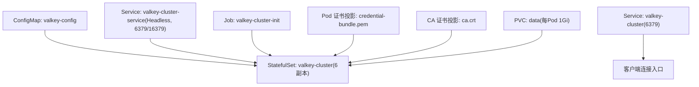
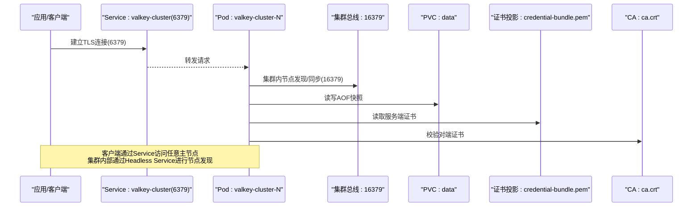
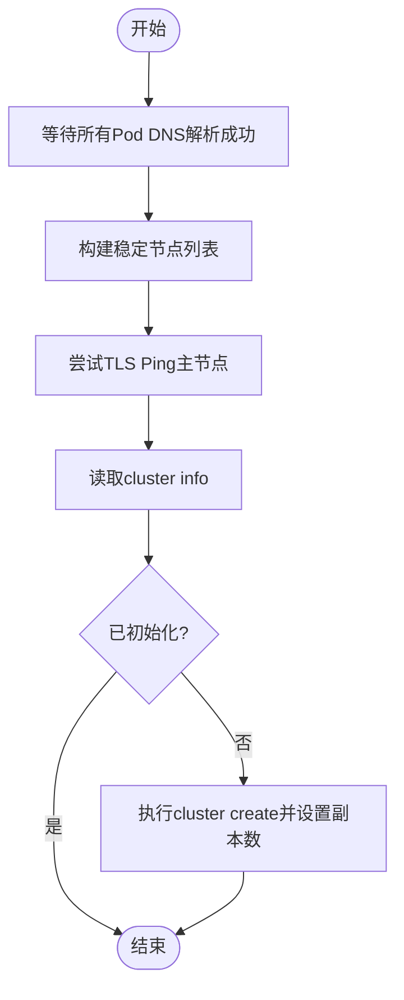
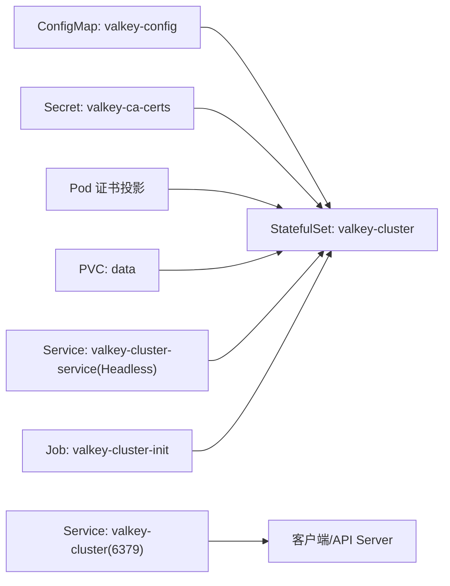

# Valkey缓存集群

<cite>
**本文引用的文件**
- [manifests/ate-install/valkey.yaml](file://manifests/ate-install/valkey.yaml)
- [cmd/ateapi/main.go](file://cmd/ateapi/main.go)
- [docs/dev/valkey-direct-access.md](file://docs/dev/valkey-direct-access.md)
</cite>

## 目录
1. [简介](#简介)
2. [项目结构](#项目结构)
3. [核心组件](#核心组件)
4. [架构总览](#架构总览)
5. [详细组件分析](#详细组件分析)
6. [依赖关系分析](#依赖关系分析)
7. [性能考虑](#性能考虑)
8. [故障排查指南](#故障排查指南)
9. [结论](#结论)
10. [附录](#附录)

## 简介
本文件面向在 Kubernetes 上部署与运维 Valkey 缓存集群的工程师，基于仓库中的清单与客户端实现，系统说明以下要点：
- 部署架构：6 节点 StatefulSet、持久化存储卷声明模板、TLS 安全通信配置。
- 初始化 Job：节点发现、集群创建、副本分配流程。
- ConfigMap 关键配置项：cluster-enabled、appendonly、TLS 证书加载等。
- 监控与恢复：健康检查、数据备份、扩容缩容操作建议。
- 性能调优与常见问题排查方法。

## 项目结构
Valkey 集群相关资源定义集中在安装清单中，客户端 TLS 构建逻辑位于 API Server 启动代码中，直接访问文档提供调试入口。

图表来源
- [manifests/ate-install/valkey.yaml:15-42](file://manifests/ate-install/valkey.yaml#L15-L42)
- [manifests/ate-install/valkey.yaml:43-72](file://manifests/ate-install/valkey.yaml#L43-L72)
- [manifests/ate-install/valkey.yaml:73-148](file://manifests/ate-install/valkey.yaml#L73-L148)
- [manifests/ate-install/valkey.yaml:150-226](file://manifests/ate-install/valkey.yaml#L150-L226)

章节来源
- [manifests/ate-install/valkey.yaml:15-226](file://manifests/ate-install/valkey.yaml#L15-L226)

## 核心组件
- ConfigMap（valkey-config）
  - 启用集群模式、AOF 持久化、TLS 端口与证书路径、客户端认证与自动重载间隔等。
- Service
  - Headless Service 暴露 6379（数据）与 16379（集群总线），用于 Pod 间发现与内部通信。
  - 普通 Service 暴露 6379，作为客户端统一接入点。
- StatefulSet（valkey-cluster）
  - 6 副本，并行管理策略；容器启动时动态追加 announce 信息，确保集群拓扑使用稳定 DNS。
  - 挂载配置、证书、CA 与数据盘。
- Job（valkey-cluster-init）
  - 等待所有 Pod DNS 解析成功，检测是否已初始化，未初始化则调用 cluster create 并设置副本数。
- 客户端 TLS 构建（API Server）
  - 支持自定义 CA、ServerName、客户端证书，最小 TLS 版本为 1.2。

章节来源
- [manifests/ate-install/valkey.yaml:15-42](file://manifests/ate-install/valkey.yaml#L15-L42)
- [manifests/ate-install/valkey.yaml:43-72](file://manifests/ate-install/valkey.yaml#L43-L72)
- [manifests/ate-install/valkey.yaml:73-148](file://manifests/ate-install/valkey.yaml#L73-L148)
- [manifests/ate-install/valkey.yaml:150-226](file://manifests/ate-install/valkey.yaml#L150-L226)
- [cmd/ateapi/main.go:280-314](file://cmd/ateapi/main.go#L280-L314)

## 架构总览
下图展示了从客户端到 Valkey 集群的数据面与控制面交互，以及证书与存储的挂载关系。

图表来源
- [manifests/ate-install/valkey.yaml:43-72](file://manifests/ate-install/valkey.yaml#L43-L72)
- [manifests/ate-install/valkey.yaml:73-148](file://manifests/ate-install/valkey.yaml#L73-L148)
- [manifests/ate-install/valkey.yaml:15-42](file://manifests/ate-install/valkey.yaml#L15-L42)

## 详细组件分析

### ConfigMap 关键配置项
- 集群与持久化
  - cluster-enabled yes：开启集群模式。
  - cluster-config-file nodes.conf：集群拓扑持久化文件。
  - cluster-node-timeout 5000：节点超时时间（毫秒）。
  - appendonly yes：开启 AOF 持久化。
  - protected-mode no：关闭保护模式（配合 TLS 与客户端认证）。
- TLS 与安全
  - port 0 / tls-port 6379：禁用明文端口，仅监听 TLS。
  - tls-cluster yes / tls-replication yes：集群与复制通道均走 TLS。
  - tls-cert-file / tls-key-file：指向 Pod 证书投影路径。
  - tls-ca-cert-file：CA 证书路径。
  - tls-auth-clients yes：强制客户端证书认证。
  - tls-auto-reload-interval 43200：定时重载证书（秒）。

章节来源
- [manifests/ate-install/valkey.yaml:15-42](file://manifests/ate-install/valkey.yaml#L15-L42)

### StatefulSet 部署与持久化
- 副本与编排
  - replicas: 6，podManagementPolicy: Parallel，加速启动。
  - serviceName: valkey-cluster-service（Headless），保证稳定 DNS。
- 启动命令增强
  - 动态追加 cluster-announce-hostname、cluster-announce-tls-port、cluster-announce-bus-port、cluster-preferred-endpoint-type hostname，使集群拓扑使用稳定的 Pod DNS。
- 存储
  - volumeClaimTemplates 定义 data PVC，ReadWriteOnce，默认 1Gi。
- 证书与配置挂载
  - configMap 挂载至 /etc/valkey。
  - podCertificate 投影至 /run/servicedns.podcert.ate.dev/credential-bundle.pem。
  - Secret 投影 CA 至 /etc/valkey-ca/ca.crt。

章节来源
- [manifests/ate-install/valkey.yaml:73-148](file://manifests/ate-install/valkey.yaml#L73-L148)

### 初始化 Job 工作原理
- 节点发现
  - 循环等待 0..5 号 Pod 的 DNS 解析成功。
- 集群状态探测
  - 通过 TLS 连接到 valkey-cluster-0，执行 ping 与 cluster info，判断是否已初始化。
- 集群创建与副本分配
  - 若未初始化，调用 cluster create 传入全部节点列表，并设置 --cluster-replicas 1，完成槽位分配与主从关系建立。
- 证书与 CA
  - 使用与 Pod 相同的证书与 CA 路径，确保 TLS 握手一致。

图表来源
- [manifests/ate-install/valkey.yaml:150-226](file://manifests/ate-install/valkey.yaml#L150-L226)

章节来源
- [manifests/ate-install/valkey.yaml:150-226](file://manifests/ate-install/valkey.yaml#L150-L226)

### 客户端 TLS 配置（API Server）
- 最小 TLS 版本 1.2。
- 可选自定义 CA、ServerName、客户端证书（来自凭证包）。
- 启动时重试连接，确保集群就绪后再提供服务。

章节来源
- [cmd/ateapi/main.go:280-314](file://cmd/ateapi/main.go#L280-L314)

### 直接访问与调试
- 提供在 Pod 内以 TLS 方式进入 valkey-cli 的方法，便于诊断。
- 注意避免在生产环境执行破坏性命令。

章节来源
- [docs/dev/valkey-direct-access.md:1-11](file://docs/dev/valkey-direct-access.md#L1-L11)

## 依赖关系分析
- 资源依赖
  - StatefulSet 依赖 ConfigMap（配置）、Secret（CA）、Pod 证书投影（服务端证书）、PVC（数据）。
  - Job 依赖相同证书与 CA，且依赖所有 Pod DNS 可用。
- 网络依赖
  - Headless Service 暴露 6379 与 16379，分别用于数据与集群总线。
  - 普通 Service 暴露 6379，作为客户端入口。
- 客户端依赖
  - API Server 使用 TLS 连接集群，需正确配置 CA、ServerName、客户端证书。

图表来源
- [manifests/ate-install/valkey.yaml:15-42](file://manifests/ate-install/valkey.yaml#L15-L42)
- [manifests/ate-install/valkey.yaml:43-72](file://manifests/ate-install/valkey.yaml#L43-L72)
- [manifests/ate-install/valkey.yaml:73-148](file://manifests/ate-install/valkey.yaml#L73-L148)
- [manifests/ate-install/valkey.yaml:150-226](file://manifests/ate-install/valkey.yaml#L150-L226)

章节来源
- [manifests/ate-install/valkey.yaml:15-226](file://manifests/ate-install/valkey.yaml#L15-L226)
- [cmd/ateapi/main.go:280-314](file://cmd/ateapi/main.go#L280-L314)

## 性能考虑
- 集群与网络
  - 合理设置 cluster-node-timeout，平衡故障检测与抖动容忍。
  - 确保 6379 与 16379 端口低延迟互通，避免跨 AZ 高延迟。
- 持久化
  - appendonly 开启 AOF，权衡数据安全与写入吞吐；可根据负载调整刷盘策略（如按需或每秒）。
- 存储容量
  - 当前 PVC 默认 1Gi，按数据规模评估并扩展 StorageClass 配额。
- 客户端连接
  - API Server 使用 TLS 连接，注意证书链与 ServerName 匹配，减少握手失败重试。
- 扩缩容
  - 增加副本后需重新运行初始化 Job 或手动添加节点与槽位迁移，确保主从比例均衡。

[本节为通用指导，不直接分析具体文件]

## 故障排查指南
- 集群未初始化
  - 现象：Job 反复等待或提示未初始化。
  - 排查：确认所有 Pod DNS 可解析；检查 TLS 证书与 CA 是否正确挂载；查看 cluster info 输出。
- TLS 握手失败
  - 现象：客户端无法连接或报证书错误。
  - 排查：核对 tls-cert-file/tls-key-file/tls-ca-cert-file 路径；确认客户端 CA、ServerName、客户端证书配置一致。
- 节点不可达
  - 现象：集群总线 16379 不通。
  - 排查：检查 Headless Service 与 Pod 端口映射；确认防火墙/网络策略放行 6379 与 16379。
- 数据丢失风险
  - 现象：重启后数据不一致。
  - 排查：确认 appendonly 开启且 PVC 绑定正常；必要时结合外部备份策略。
- 直接访问验证
  - 使用提供的 valkey-cli 命令进入 Pod 进行连通性与状态检查，避免在生产执行破坏性命令。

章节来源
- [manifests/ate-install/valkey.yaml:150-226](file://manifests/ate-install/valkey.yaml#L150-L226)
- [docs/dev/valkey-direct-access.md:1-11](file://docs/dev/valkey-direct-access.md#L1-L11)

## 结论
本方案通过 StatefulSet + Headless Service 提供稳定拓扑与多副本能力，借助 Pod 证书与 CA 投影实现端到端 TLS 安全通信，并通过初始化 Job 自动化完成集群创建与副本分配。配合 AOF 与 PVC 保障数据持久化，结合客户端 TLS 配置与直连调试手段，形成一套可观测、可恢复、可扩展的 Valkey 集群部署范式。

[本节为总结，不直接分析具体文件]

## 附录

### 安装与配置步骤（概览）
- 部署前准备
  - 准备 CA 证书 Secret（valkey-ca-certs）。
  - 确保集群具备 Pod 证书签发器（servicedns.podcert.ate.dev/identity）。
- 部署资源
  - 应用 manifests/ate-install/valkey.yaml，依次创建 ConfigMap、Service、StatefulSet、Job。
- 验证
  - 观察 Job 日志，确认“Cluster initialization complete!”。
  - 使用客户端或服务端直连方式验证连通性与集群状态。

章节来源
- [manifests/ate-install/valkey.yaml:15-226](file://manifests/ate-install/valkey.yaml#L15-L226)

### 监控与健康检查
- 健康检查
  - 通过 TLS ping 与 cluster info 判定集群状态。
  - 关注节点超时与槽位分布是否均衡。
- 指标采集
  - 可在集群侧导出运行时指标（例如 Prometheus），并结合现有监控体系集成。
- 告警
  - 针对节点离线、主从不同步、磁盘空间不足等设置告警阈值。

[本节为通用指导，不直接分析具体文件]

### 数据备份与恢复
- 备份
  - 基于 AOF 文件与 PVC 快照进行定期备份。
  - 可将数据导出到对象存储或冷备介质。
- 恢复
  - 停止写入，替换数据卷并重启节点，待集群重建主从关系后逐步恢复流量。

[本节为通用指导，不直接分析具体文件]

### 扩容与缩容
- 扩容
  - 增加 StatefulSet 副本数后，需重新运行初始化 Job 或手动将新节点加入集群并迁移槽位，保持主从比例。
- 缩容
  - 先下线从节点，再迁移槽位，最后删除对应 Pod 与 PVC（谨慎操作）。

[本节为通用指导，不直接分析具体文件]
