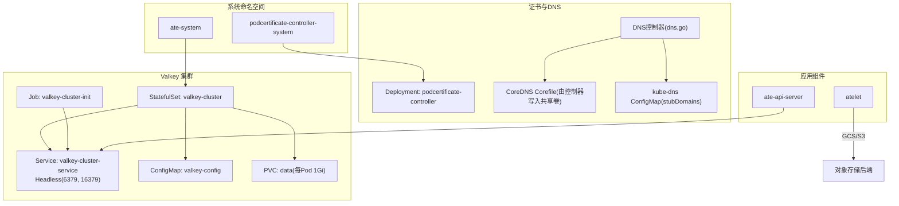
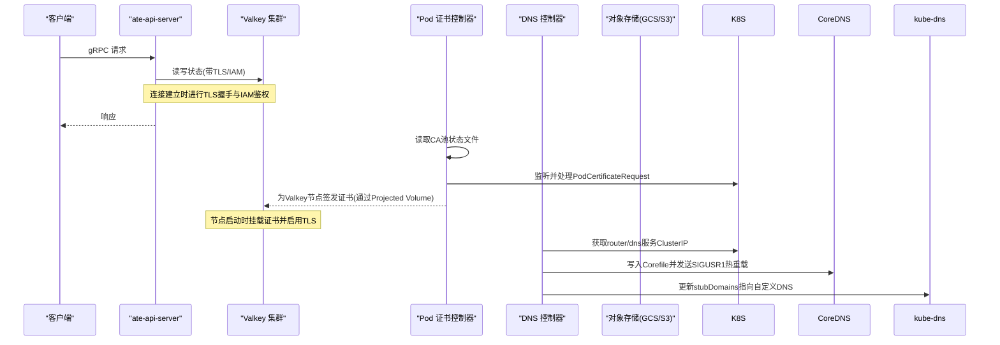
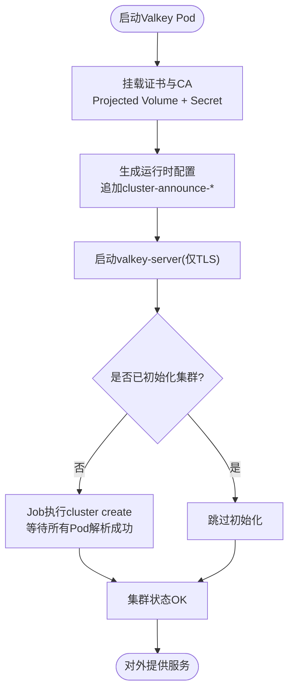
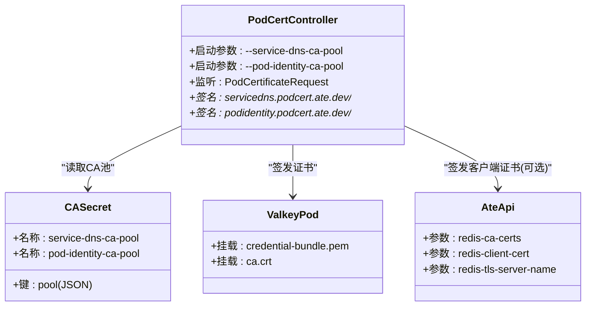
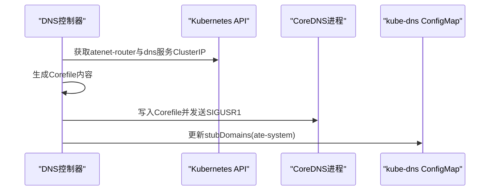
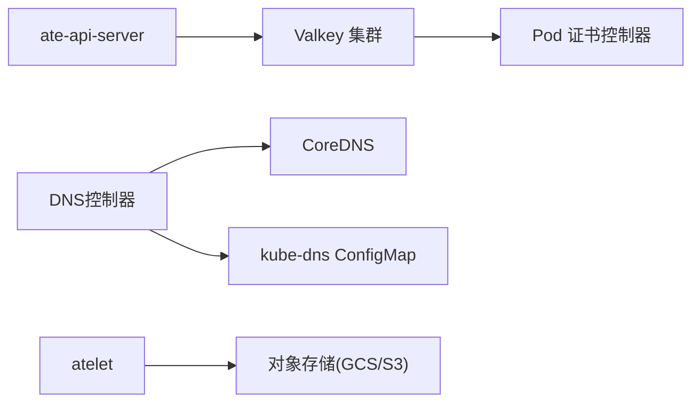

# 依赖服务管理

<cite>
**本文引用的文件**   
- [README.md](file://README.md)
- [valkey.yaml](file://manifests/ate-install/valkey.yaml)
- [pod-certificate-controller.yaml](file://manifests/ate-install/pod-certificate-controller.yaml)
- [main.go (podcertcontroller)](file://cmd/podcertcontroller/main.go)
- [dns.go (atenet DNS控制器)](file://cmd/atenet/internal/dns/dns.go)
- [corefile.go (CoreDNS模板)](file://cmd/atenet/internal/dns/corefile.go)
- [main.go (ateapi)](file://cmd/ateapi/main.go)
- [main.go (atelet)](file://cmd/atelet/main.go)
- [observability.md](file://docs/observability.md)
- [valkey-direct-access.md](file://docs/dev/valkey-direct-access.md)
</cite>

## 目录
1. [简介](#简介)
2. [项目结构](#项目结构)
3. [核心组件](#核心组件)
4. [架构总览](#架构总览)
5. [详细组件分析](#详细组件分析)
6. [依赖关系分析](#依赖关系分析)
7. [性能与高可用考量](#性能与高可用考量)
8. [监控与告警配置](#监控与告警配置)
9. [故障排查指南](#故障排查指南)
10. [升级与维护指南](#升级与维护指南)
11. [结论](#结论)

## 简介
本文件面向运维与平台工程师，系统性说明 Agent Substrate 的依赖服务安装与配置要点，重点覆盖：
- Valkey 缓存集群的部署、持久化、高可用与备份恢复策略
- Pod 证书控制器的作用、CA 池管理与证书签发流程、信任链配置
- DNS 服务与对象存储后端的集成配置
- 依赖服务的健康检查、指标采集、故障检测与告警建议
- 依赖服务的升级与维护实践

## 项目结构
与依赖服务相关的清单与实现主要分布在以下位置：
- manifests/ate-install：Valkey 集群与 Pod 证书控制器等基础设施清单
- cmd/ateapi：控制面 API 服务，连接 Valkey 并支持 TLS/IAM 认证
- cmd/atenet/internal/dns：DNS 控制器，动态生成 CoreDNS 配置并更新 kube-dns stubDomains
- cmd/podcertcontroller：Pod 证书控制器，提供两个自定义签名器（servicedns 与 podidentity）
- docs：可观测性与直接访问 Valkey 的操作指引

图表来源
- [valkey.yaml:1-227](file://manifests/ate-install/valkey.yaml#L1-L227)
- [pod-certificate-controller.yaml:1-197](file://manifests/ate-install/pod-certificate-controller.yaml#L1-L197)
- [dns.go (atenet DNS控制器):1-253](file://cmd/atenet/internal/dns/dns.go#L1-L253)
- [corefile.go (CoreDNS模板):1-40](file://cmd/atenet/internal/dns/corefile.go#L1-L40)
- [main.go (ateapi):248-331](file://cmd/ateapi/main.go#L248-L331)
- [main.go (atelet):126-161](file://cmd/atelet/main.go#L126-L161)

章节来源
- [README.md:97-124](file://README.md#L97-L124)

## 核心组件
- Valkey 缓存集群：以 StatefulSet 部署，启用集群模式与 TLS，使用 Headless Service 暴露节点域名，通过 Job 完成集群初始化。数据持久化到 PVC，AOF 开启。
- Pod 证书控制器：提供 servicedns.podcert.ate.dev/* 与 podidentity.podcert.ate.dev/* 两个自定义签名器，加载 CA 池状态，签发证书供 Valkey 与 ate-api-server 使用。
- DNS 控制器：周期性拉取 atenet-router 与 dns 服务 ClusterIP，生成 CoreDNS Corefile 并触发热重载；同时向 kube-dns 注入 ate-system 的 stubDomains。
- ate-api-server：通过 TLS + 可选 IAM 认证连接 Valkey 集群，具备重试与健康探测逻辑。
- atelet：默认使用 GCS 作为对象存储后端，也可切换为 S3，用于快照上传/下载。

章节来源
- [valkey.yaml:15-148](file://manifests/ate-install/valkey.yaml#L15-L148)
- [pod-certificate-controller.yaml:123-197](file://manifests/ate-install/pod-certificate-controller.yaml#L123-L197)
- [dns.go (atenet DNS控制器):71-189](file://cmd/atenet/internal/dns/dns.go#L71-L189)
- [main.go (ateapi):248-331](file://cmd/ateapi/main.go#L248-L331)
- [main.go (atelet):126-161](file://cmd/atelet/main.go#L126-L161)

## 架构总览
下图展示了关键依赖之间的交互关系与数据流：

图表来源
- [main.go (ateapi):248-331](file://cmd/ateapi/main.go#L248-L331)
- [pod-certificate-controller.yaml:123-197](file://manifests/ate-install/pod-certificate-controller.yaml#L123-L197)
- [main.go (podcertcontroller):123-149](file://cmd/podcertcontroller/main.go#L123-L149)
- [dns.go (atenet DNS控制器):71-189](file://cmd/atenet/internal/dns/dns.go#L71-L189)
- [valkey.yaml:90-148](file://manifests/ate-install/valkey.yaml#L90-L148)

## 详细组件分析

### Valkey 缓存集群
- 部署形态
  - StatefulSet 副本数 6，并行启动，每个 Pod 独立 PVC 1Gi，启用 appendonly。
  - Headless Service 暴露 6379 与 16379 端口，便于集群总线通信与节点发现。
- 高可用与集群
  - 启用 cluster-enabled，设置 cluster-node-timeout，配合 replicas=6 与初始化 Job 自动创建集群。
  - 通过 cluster-announce-hostname 与 preferred-endpoint-type hostname 确保基于 Pod 域名的稳定拓扑。
- 安全与证书
  - 强制 TLS，禁用明文端口；服务端证书与私钥来自 Pod 证书控制器签发的凭证包；CA 证书来自 Secret。
  - 客户端（如 ate-api-server）可选择使用自定义 CA、ServerName 与双向 TLS 证书。
- 持久化与备份恢复
  - 数据落盘至 PVC，AOF 开启。建议结合底层存储快照或定期导出 RDB/AOF 进行离线备份。
  - 集群重建可通过删除 PVC 并重新运行初始化 Job 完成（生产需谨慎）。
- 运维与直连调试
  - 提供在 Pod 内通过 valkey-cli 直连的方式，便于问题定位。

图表来源
- [valkey.yaml:90-148](file://manifests/ate-install/valkey.yaml#L90-L148)
- [valkey.yaml:150-227](file://manifests/ate-install/valkey.yaml#L150-L227)

章节来源
- [valkey.yaml:15-148](file://manifests/ate-install/valkey.yaml#L15-L148)
- [valkey.yaml:150-227](file://manifests/ate-install/valkey.yaml#L150-L227)
- [valkey-direct-access.md:1-11](file://docs/dev/valkey-direct-access.md#L1-L11)

### Pod 证书控制器
- 角色与作用
  - 提供两个自定义签名器：servicedns.podcert.ate.dev/* 与 podidentity.podcert.ate.dev/*。
  - 从本地文件加载 CA 池状态，对 PodCertificateRequest 进行签名与发布。
- CA 池管理
  - 通过命令行参数指定 service-dns-ca-pool 与 pod-identity-ca-pool 的文件路径。
  - 清单中通过 projected volume 将 Secret 中的 pool 映射为 JSON 文件供控制器读取。
- 签发流程与信任链
  - 控制器读取 CA 池 -> 校验请求 -> 使用对应 CA 签发证书 -> 返回给请求方。
  - Valkey 与 ate-api-server 分别通过挂载证书与 CA 参与信任链验证。

图表来源
- [pod-certificate-controller.yaml:123-197](file://manifests/ate-install/pod-certificate-controller.yaml#L123-L197)
- [main.go (podcertcontroller):123-149](file://cmd/podcertcontroller/main.go#L123-L149)
- [valkey.yaml:126-140](file://manifests/ate-install/valkey.yaml#L126-L140)
- [main.go (ateapi):287-314](file://cmd/ateapi/main.go#L287-L314)

章节来源
- [pod-certificate-controller.yaml:1-197](file://manifests/ate-install/pod-certificate-controller.yaml#L1-L197)
- [main.go (podcertcontroller):1-158](file://cmd/podcertcontroller/main.go#L1-L158)

### DNS 服务与对象存储后端集成
- DNS 控制器
  - 周期拉取 atenet-router 与 dns 服务的 ClusterIP，生成 CoreDNS Corefile 并写回共享卷，随后向 coredns 进程发送信号触发热重载。
  - 同步更新 kube-system/kube-dns ConfigMap 的 stubDomains，使 ate-system 下的域名解析到自定义 DNS。
- 对象存储后端（atelet）
  - 默认使用 GCS（无认证匿名客户端用于镜像拉取），主路径通过 Workload Identity/ADC 获取凭据。
  - 支持切换为 S3，通过标准 AWS 环境变量配置，并可启用 path-style。

图表来源
- [dns.go (atenet DNS控制器):71-189](file://cmd/atenet/internal/dns/dns.go#L71-L189)
- [corefile.go (CoreDNS模板):1-40](file://cmd/atenet/internal/dns/corefile.go#L1-L40)

章节来源
- [dns.go (atenet DNS控制器):1-253](file://cmd/atenet/internal/dns/dns.go#L1-L253)
- [corefile.go (CoreDNS模板):1-40](file://cmd/atenet/internal/dns/corefile.go#L1-L40)
- [main.go (atelet):126-161](file://cmd/atelet/main.go#L126-L161)

## 依赖关系分析
- ate-api-server 依赖 Valkey 集群（TLS + 可选 IAM 认证），并在启动阶段进行 Ping 重试以确保可用性。
- Valkey 节点依赖 Pod 证书控制器签发的证书与 CA 池，以实现 mTLS 与双向认证。
- DNS 控制器依赖 Kubernetes 服务资源与 kube-dns ConfigMap，负责动态路由与解析。
- atelet 依赖对象存储后端（GCS/S3）用于快照上传/下载。

图表来源
- [main.go (ateapi):248-331](file://cmd/ateapi/main.go#L248-L331)
- [pod-certificate-controller.yaml:123-197](file://manifests/ate-install/pod-certificate-controller.yaml#L123-L197)
- [dns.go (atenet DNS控制器):71-189](file://cmd/atenet/internal/dns/dns.go#L71-L189)
- [main.go (atelet):126-161](file://cmd/atelet/main.go#L126-L161)

章节来源
- [main.go (ateapi):248-331](file://cmd/ateapi/main.go#L248-L331)
- [main.go (atelet):126-161](file://cmd/atelet/main.go#L126-L161)

## 性能与高可用考量
- Valkey
  - 副本数与分片：当前清单为 6 个节点，适合中等规模场景；可根据 QPS 与内存需求调整副本与分片数量。
  - 网络与端口：业务端口 6379，集群总线 16379，需确保跨节点可达且防火墙放行。
  - 持久化：AOF 开启，建议根据写入压力评估 fsync 策略与磁盘 IOPS。
- ate-api-server
  - 连接重试：内置最多 30 次 Ping 重试，每次间隔约 2 秒，避免冷启动抖动导致失败。
  - TLS 与 IAM：建议在生产环境启用 TLS 与 IAM 认证，减少密钥泄露风险。
- DNS 控制器
  - 热重载：通过 SIGUSR1 触发 CoreDNS 热重载，避免重启带来的中断。
  - StubDomains：确保 kube-dns 正确注入 ate-system 的解析规则，避免跨命名空间解析失败。

[本节为通用指导，不直接分析具体文件]

## 监控与告警配置
- 指标与追踪
  - 各组件均通过 OpenTelemetry 输出指标与追踪，Kind 环境默认包含 Prometheus/Jaeger，GKE 环境对接 Google Cloud Monitoring/Trace。
  - 关键指标包括 gRPC 调用延迟、错误率、快照大小等。
- 健康检查
  - CoreDNS 暴露 /health 与 /ready 端点；DNS 控制器会周期性 reconcile，异常时会记录日志。
  - ate-api-server 启动阶段对 Valkey 进行 Ping 重试，失败则终止启动，便于快速发现问题。
- 告警建议
  - 针对 Valkey 集群状态、节点存活、延迟与错误率设置阈值告警。
  - 针对 DNS 控制器 reconcile 错误、kube-dns ConfigMap 更新失败设置告警。
  - 针对 ate-api-server 与 atelet 的 gRPC 错误率与延迟设置告警。

章节来源
- [observability.md:103-194](file://docs/observability.md#L103-L194)
- [dns.go (atenet DNS控制器):50-88](file://cmd/atenet/internal/dns/dns.go#L50-L88)
- [main.go (ateapi):316-331](file://cmd/ateapi/main.go#L316-L331)

## 故障排查指南
- Valkey 无法连接
  - 检查 ate-api-server 的 TLS 配置（CA、ServerName、客户端证书）与 IAM 凭据是否正确。
  - 确认 Valkey 集群已初始化且状态为 OK，必要时查看初始化 Job 日志。
  - 使用文档提供的 valkey-cli 方式进入 Pod 进行连通性测试。
- Pod 证书控制器未签发证书
  - 检查 CA 池 Secret 是否存在且格式正确，控制器是否成功加载。
  - 查看 PodCertificateRequest 的状态与事件，确认签名器权限与 RBAC 配置。
- DNS 解析异常
  - 确认 DNS 控制器已成功更新 Corefile 与 kube-dns stubDomains。
  - 检查 atenet-router 与 dns 服务是否已分配 ClusterIP。
- 对象存储不可用
  - 检查 GCS ADC 或 S3 环境变量与凭据，确认网络可达与桶权限。

章节来源
- [valkey-direct-access.md:1-11](file://docs/dev/valkey-direct-access.md#L1-L11)
- [main.go (ateapi):287-331](file://cmd/ateapi/main.go#L287-L331)
- [pod-certificate-controller.yaml:20-77](file://manifests/ate-install/pod-certificate-controller.yaml#L20-L77)
- [dns.go (atenet DNS控制器):71-189](file://cmd/atenet/internal/dns/dns.go#L71-L189)
- [main.go (atelet):126-161](file://cmd/atelet/main.go#L126-L161)

## 升级与维护指南
- Valkey 升级
  - 滚动更新 StatefulSet 镜像版本，注意兼容性与 AOF/RDB 格式。
  - 升级前建议对 PVC 做快照或导出备份；升级后验证集群状态与读写能力。
- Pod 证书控制器升级
  - 更新 Deployment 镜像，确保 CA 池 Secret 结构与路径不变。
  - 观察 PodCertificateRequest 处理情况，确认新版本的签名行为一致。
- DNS 控制器升级
  - 更新 atenet 组件镜像，验证 Corefile 生成与 kube-dns 更新是否正常。
  - 若变更了 Corefile 模板，需确认 reload 机制生效。
- 对象存储后端升级
  - GCS：保持 ADC 工作负载身份不变，关注 SDK 版本兼容性。
  - S3：核对环境变量与 path-style 配置，确保桶策略与网络 ACL 有效。

[本节为通用指导，不直接分析具体文件]

## 结论
通过合理部署与配置 Valkey 集群、Pod 证书控制器、DNS 控制器以及对象存储后端，Agent Substrate 能够在高可用与安全的前提下提供高性能的代理工作负载管理能力。建议在上线前完善监控与告警体系，并制定完善的备份与回滚策略，确保系统在演进过程中保持稳定与可观测。
