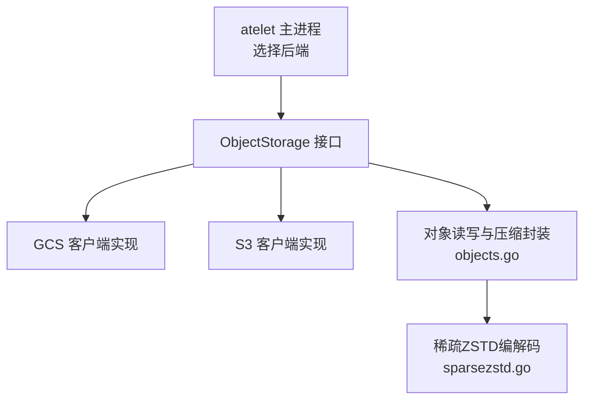
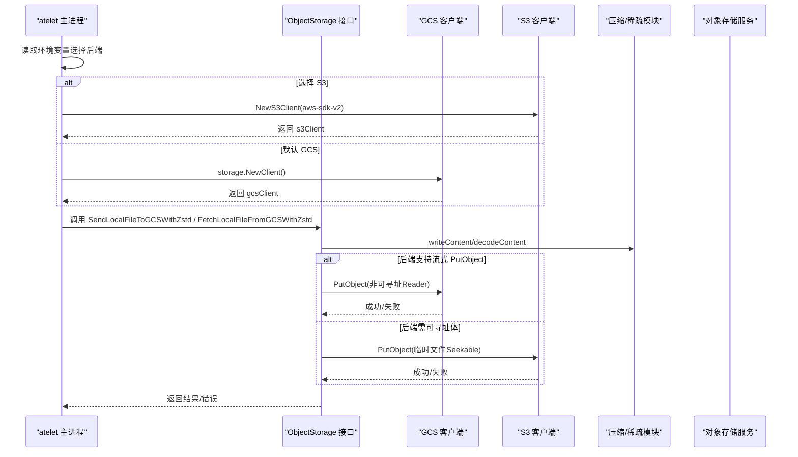
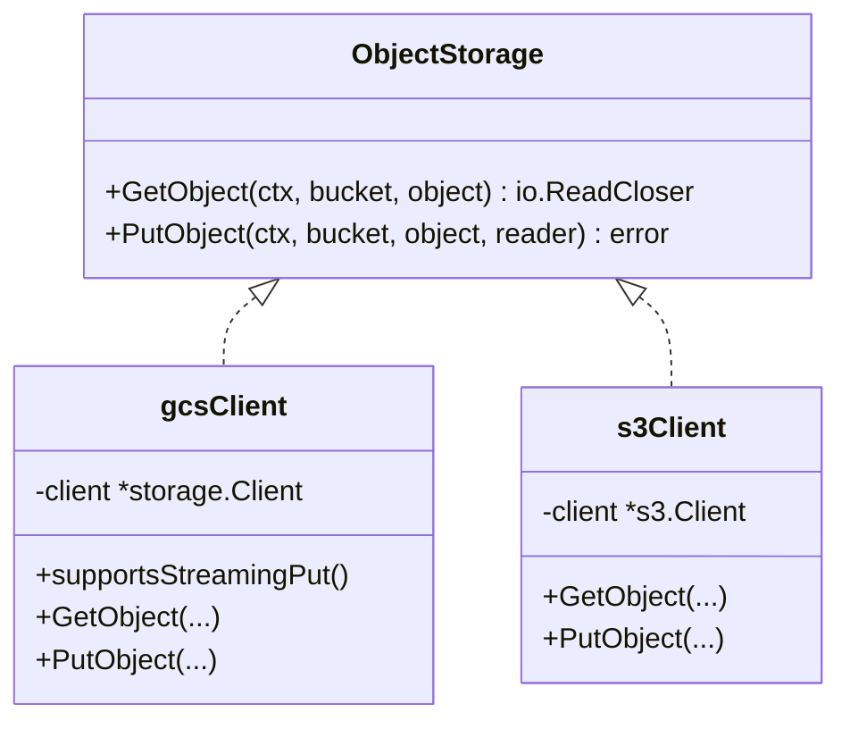
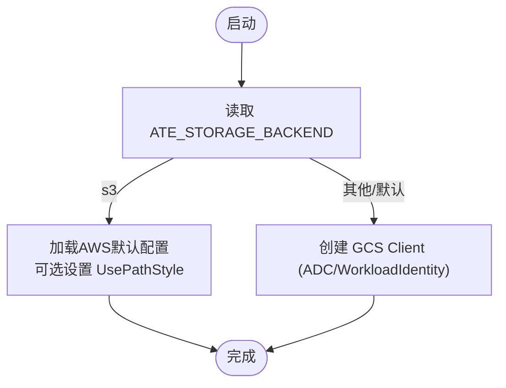
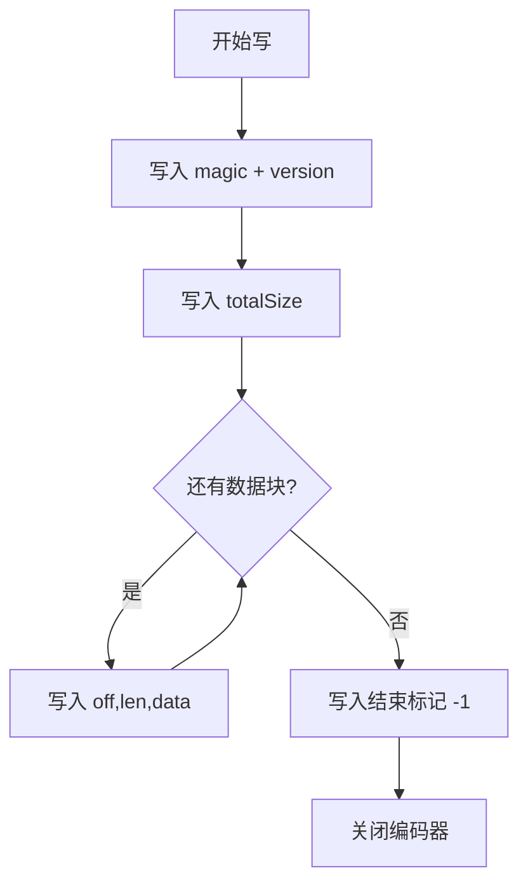
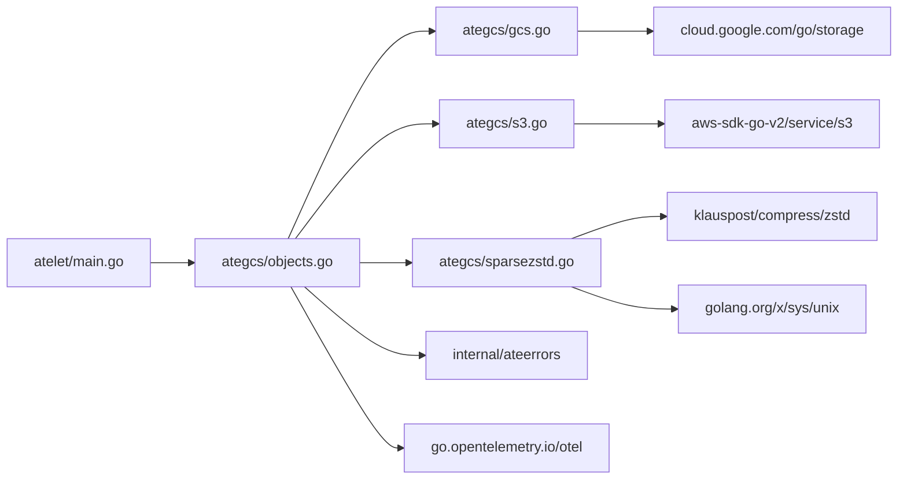

# 对象存储后端

<cite>
**本文引用的文件**   
- [cmd/atelet/main.go](file://cmd/atelet/main.go)
- [cmd/atelet/internal/ategcs/gcs.go](file://cmd/atelet/internal/ategcs/gcs.go)
- [cmd/atelet/internal/ategcs/s3.go](file://cmd/atelet/internal/ategcs/s3.go)
- [cmd/atelet/internal/ategcs/objects.go](file://cmd/atelet/internal/ategcs/objects.go)
- [cmd/atelet/internal/ategcs/sparsezstd.go](file://cmd/atelet/internal/ategcs/sparsezstd.go)
- [cmd/atelet/internal/ategcs/objects_test.go](file://cmd/atelet/internal/ategcs/objects_test.go)
- [cmd/atelet/internal/ategcs/sparsezstd_test.go](file://cmd/atelet/internal/ategcs/sparsezstd_test.go)
</cite>

## 目录
1. [简介](#简介)
2. [项目结构](#项目结构)
3. [核心组件](#核心组件)
4. [架构总览](#架构总览)
5. [详细组件分析](#详细组件分析)
6. [依赖关系分析](#依赖关系分析)
7. [性能考虑](#性能考虑)
8. [故障恢复与迁移指南](#故障恢复与迁移指南)
9. [结论](#结论)
10. [附录](#附录)

## 简介
本文件面向“对象存储后端”的配置与集成，聚焦于 GCS 与 S3 两种后端的实现原理、连接配置与认证方式、数据传输协议；并深入解析快照数据的存储格式与压缩算法（稀疏 ZSTD、增量备份思路、版本管理）；同时提供生命周期管理建议、性能调优要点以及故障恢复与数据迁移指南。内容严格基于仓库源码进行分析与总结。

## 项目结构
与对象存储后端直接相关的代码集中在 atelet 子命令的 ategcs 包中，负责：
- 抽象统一的 ObjectStorage 接口
- 分别实现 GCS 与 S3 客户端
- 实现上传/下载流程中的压缩与稀疏处理
- 在 atelet 主进程中选择并初始化具体后端

图表来源
- [cmd/atelet/main.go:126-161](file://cmd/atelet/main.go#L126-L161)
- [cmd/atelet/internal/ategcs/objects.go:37-40](file://cmd/atelet/internal/ategcs/objects.go#L37-L40)
- [cmd/atelet/internal/ategcs/gcs.go:27-33](file://cmd/atelet/internal/ategcs/gcs.go#L27-L33)
- [cmd/atelet/internal/ategcs/s3.go:29-35](file://cmd/atelet/internal/ategcs/s3.go#L29-L35)
- [cmd/atelet/internal/ategcs/objects.go:141-154](file://cmd/atelet/internal/ategcs/objects.go#L141-L154)
- [cmd/atelet/internal/ategcs/sparsezstd.go:29-46](file://cmd/atelet/internal/ategcs/sparsezstd.go#L29-L46)

章节来源
- [cmd/atelet/main.go:126-161](file://cmd/atelet/main.go#L126-L161)
- [cmd/atelet/internal/ategcs/objects.go:37-40](file://cmd/atelet/internal/ategcs/objects.go#L37-L40)

## 核心组件
- ObjectStorage 接口：统一 GetObject/PutObject 能力，屏蔽 GCS/S3 差异
- GCS 客户端：支持流式 PutObject，无需可寻址体，适合与压缩管道直连
- S3 客户端：PutObject 需要可寻址体（SDK 签名与 Content-Length），采用缓冲路径
- 压缩与稀疏：writeContent/decodeContent 自动选择稀疏 ZSTD 或普通 ZSTD；对大内存镜像优先使用稀疏 ZSTD
- 上传策略：根据后端是否支持流式 PutObject 选择 sendStreamingZstd 或 sendBufferedZstd

章节来源
- [cmd/atelet/internal/ategcs/objects.go:37-40](file://cmd/atelet/internal/ategcs/objects.go#L37-L40)
- [cmd/atelet/internal/ategcs/gcs.go:46-53](file://cmd/atelet/internal/ategcs/gcs.go#L46-L53)
- [cmd/atelet/internal/ategcs/s3.go:51-58](file://cmd/atelet/internal/ategcs/s3.go#L51-L58)
- [cmd/atelet/internal/ategcs/objects.go:141-154](file://cmd/atelet/internal/ategcs/objects.go#L141-L154)
- [cmd/atelet/internal/ategcs/objects.go:171-181](file://cmd/atelet/internal/ategcs/objects.go#L171-L181)

## 架构总览
下图展示了从 atelet 启动到对象存储读写的整体流程，包括后端选择、压缩/稀疏处理、网络传输与错误包装。

图表来源
- [cmd/atelet/main.go:126-161](file://cmd/atelet/main.go#L126-L161)
- [cmd/atelet/internal/ategcs/objects.go:95-118](file://cmd/atelet/internal/ategcs/objects.go#L95-L118)
- [cmd/atelet/internal/ategcs/objects.go:171-181](file://cmd/atelet/internal/ategcs/objects.go#L171-L181)
- [cmd/atelet/internal/ategcs/gcs.go:55-66](file://cmd/atelet/internal/ategcs/gcs.go#L55-L66)
- [cmd/atelet/internal/ategcs/s3.go:51-58](file://cmd/atelet/internal/ategcs/s3.go#L51-L58)

## 详细组件分析

### GCS 与 S3 客户端实现
- GCS 客户端
  - 通过 cloud.google.com/go/storage 创建 Client
  - GetObject 返回 ReadCloser；GetObject 不存在或桶不存在时包装为统一错误码
  - PutObject 使用 NewWriter 写入，io.Copy + Close 合并错误
  - 标记 supportsStreamingPut，表示接受非可寻址 Reader，避免中间缓冲
- S3 客户端
  - 通过 aws-sdk-go-v2/service/s3 创建 Client
  - GetObject 返回 Body；NoSuchKey 转换为统一错误码
  - PutObject 使用 SDK 原生 PutObject，要求可寻址体（由上层缓冲路径提供）

图表来源
- [cmd/atelet/internal/ategcs/objects.go:37-40](file://cmd/atelet/internal/ategcs/objects.go#L37-L40)
- [cmd/atelet/internal/ategcs/gcs.go:27-33](file://cmd/atelet/internal/ategcs/gcs.go#L27-L33)
- [cmd/atelet/internal/ategcs/gcs.go:35-44](file://cmd/atelet/internal/ategcs/gcs.go#L35-L44)
- [cmd/atelet/internal/ategcs/gcs.go:55-66](file://cmd/atelet/internal/ategcs/gcs.go#L55-L66)
- [cmd/atelet/internal/ategcs/s3.go:29-35](file://cmd/atelet/internal/ategcs/s3.go#L29-L35)
- [cmd/atelet/internal/ategcs/s3.go:37-49](file://cmd/atelet/internal/ategcs/s3.go#L37-L49)
- [cmd/atelet/internal/ategcs/s3.go:51-58](file://cmd/atelet/internal/ategcs/s3.go#L51-L58)

章节来源
- [cmd/atelet/internal/ategcs/gcs.go:27-66](file://cmd/atelet/internal/ategcs/gcs.go#L27-L66)
- [cmd/atelet/internal/ategcs/s3.go:29-58](file://cmd/atelet/internal/ategcs/s3.go#L29-L58)

### 连接配置与认证方式
- 后端选择与环境变量
  - ATE_STORAGE_BACKEND：选择 "s3" 则启用 S3，否则默认 GCS
  - AWS_S3_USE_PATH_STYLE：当值为 "true" 时，S3 客户端启用路径风格（兼容部分 S3 兼容服务）
- 认证
  - GCS：默认使用 Workload Identity 或应用默认凭据（ADC）
  - S3：遵循 AWS 标准环境变量与凭据链（如 AK/SK、IAM Role、配置文件等）
- 客户端初始化
  - GCS：storage.NewClient(ctx)
  - S3：config.LoadDefaultConfig(ctx) 后 s3.NewFromConfig(cfg, ...)

图表来源
- [cmd/atelet/main.go:126-149](file://cmd/atelet/main.go#L126-L149)
- [cmd/atelet/main.go:138-142](file://cmd/atelet/main.go#L138-L142)

章节来源
- [cmd/atelet/main.go:126-149](file://cmd/atelet/main.go#L126-L149)
- [cmd/atelet/main.go:138-142](file://cmd/atelet/main.go#L138-L142)

### 数据传输协议与上传策略
- 协议
  - GCS：HTTP(S) REST API（cloud.google.com/go/storage）
  - S3：HTTP(S) REST API（aws-sdk-go-v2/service/s3）
- 上传策略
  - 若后端实现 streamingPutter（GCS）：sendStreamingZstd 将压缩与上传重叠，无中间文件
  - 否则（S3）：sendBufferedZstd 先压缩到可寻址临时文件，再 PutObject
- 下载
  - Open/FetchFromGCS 提供流式读取；FetchLocalFileFromGCSWithZstd 自动解压并落盘

章节来源
- [cmd/atelet/internal/ategcs/objects.go:171-181](file://cmd/atelet/internal/ategcs/objects.go#L171-L181)
- [cmd/atelet/internal/ategcs/objects.go:214-251](file://cmd/atelet/internal/ategcs/objects.go#L214-L251)
- [cmd/atelet/internal/ategcs/objects.go:270-297](file://cmd/atelet/internal/ategcs/objects.go#L270-L297)
- [cmd/atelet/internal/ategcs/objects.go:42-77](file://cmd/atelet/internal/ategcs/objects.go#L42-L77)

### 快照数据存储格式与压缩算法
- 格式头
  - 稀疏 ZSTD 格式以固定 magic 开头，随后是 little-endian 版本号
  - 版本号用于向后兼容：不支持的版本会拒绝读取
- 数据结构
  - 元数据包含逻辑大小 totalSize
  - 随后是一系列 extent 帧：偏移 off、长度 len、len 字节数据
  - 以特殊结束标记 sparseEndOffset(-1) 终止
- 压缩
  - 使用 zstd，编码器级别 SpeedFastest，并发度按 CPU 核数
  - 稀疏路径仅压缩实际数据块（SEEK_DATA/SEEK_HOLE），跳过空洞
- 降级兼容
  - 非文件输入走普通 ZSTD 流（无 magic），下载端自动识别并兼容旧快照

图表来源
- [cmd/atelet/internal/ategcs/sparsezstd.go:29-46](file://cmd/atelet/internal/ategcs/sparsezstd.go#L29-L46)
- [cmd/atelet/internal/ategcs/sparsezstd.go:63-135](file://cmd/atelet/internal/ategcs/sparsezstd.go#L63-L135)
- [cmd/atelet/internal/ategcs/sparsezstd.go:141-196](file://cmd/atelet/internal/ategcs/sparsezstd.go#L141-L196)
- [cmd/atelet/internal/ategcs/objects.go:341-384](file://cmd/atelet/internal/ategcs/objects.go#L341-L384)

章节来源
- [cmd/atelet/internal/ategcs/sparsezstd.go:29-46](file://cmd/atelet/internal/ategcs/sparsezstd.go#L29-L46)
- [cmd/atelet/internal/ategcs/sparsezstd.go:63-135](file://cmd/atelet/internal/ategcs/sparsezstd.go#L63-L135)
- [cmd/atelet/internal/ategcs/sparsezstd.go:141-196](file://cmd/atelet/internal/ategcs/sparsezstd.go#L141-L196)
- [cmd/atelet/internal/ategcs/objects.go:341-384](file://cmd/atelet/internal/ategcs/objects.go#L341-L384)

### 增量备份与版本管理
- 当前实现未内置增量快照或对象级版本控制逻辑
- 建议在对象命名空间中使用前缀/路径区分不同版本（例如按时间戳或序列号）
- 结合对象存储的生命周期策略进行归档与清理（见下一节）

[本节为概念性说明，不直接分析具体文件]

### 存储桶生命周期管理
- 仓库未内建生命周期策略配置逻辑
- 建议实践
  - 保留策略：按天/周/月分层保留，过期删除或转冷存储
  - 自动清理：对临时上传中间对象设置较短 TTL
  - 跨区域复制：在云厂商控制台或 CLI 配置跨区复制规则，确保高可用与灾难恢复
- 注意：上述为通用运维建议，非代码内实现

[本节为概念性说明，不直接分析具体文件]

## 依赖关系分析
- 外部依赖
  - GCS：cloud.google.com/go/storage
  - S3：github.com/aws/aws-sdk-go-v2/service/s3
  - 压缩：github.com/klauspost/compress/zstd
  - 系统调用：golang.org/x/sys/unix（SEEK_DATA/SEEK_HOLE）
- 内部依赖
  - ateerrors：统一错误码包装
  - otel：Tracer 埋点

图表来源
- [cmd/atelet/main.go:126-161](file://cmd/atelet/main.go#L126-L161)
- [cmd/atelet/internal/ategcs/objects.go:30-33](file://cmd/atelet/internal/ategcs/objects.go#L30-33)
- [cmd/atelet/internal/ategcs/gcs.go:23-25](file://cmd/atelet/internal/ategcs/gcs.go#L23-25)
- [cmd/atelet/internal/ategcs/s3.go:24-27](file://cmd/atelet/internal/ategcs/s3.go#L24-27)
- [cmd/atelet/internal/ategcs/sparsezstd.go:25-27](file://cmd/atelet/internal/ategcs/sparsezstd.go#L25-27)

章节来源
- [cmd/atelet/internal/ategcs/objects.go:30-33](file://cmd/atelet/internal/ategcs/objects.go#L30-33)
- [cmd/atelet/internal/ategcs/gcs.go:23-25](file://cmd/atelet/internal/ategcs/gcs.go#L23-25)
- [cmd/atelet/internal/ategcs/s3.go:24-27](file://cmd/atelet/internal/ategcs/s3.go#L24-27)
- [cmd/atelet/internal/ategcs/sparsezstd.go:25-27](file://cmd/atelet/internal/ategcs/sparsezstd.go#L25-27)

## 性能考虑
- 压缩与并发
  - 使用 zstd.SpeedFastest，降低 CPU 占用，提升吞吐
  - 编码器并发度按 CPU 核数，充分利用多核
- 上传路径优化
  - GCS：流式上传，压缩与网络 PUT 并行，避免中间文件
  - S3：缓冲到可寻址临时文件，满足 SDK 签名与 Content-Length 需求
- 稀疏 I/O
  - 利用 SEEK_DATA/SEEK_HOLE 仅扫描与压缩实际数据块，显著减少 IO 与 CPU
- 日志与观测
  - 关键操作记录压缩/解压耗时、逻辑大小与实际写入量，便于定位瓶颈

章节来源
- [cmd/atelet/internal/ategcs/objects.go:156-181](file://cmd/atelet/internal/ategcs/objects.go#L156-L181)
- [cmd/atelet/internal/ategcs/objects.go:214-251](file://cmd/atelet/internal/ategcs/objects.go#L214-L251)
- [cmd/atelet/internal/ategcs/sparsezstd.go:82-84](file://cmd/atelet/internal/ategcs/sparsezstd.go#L82-L84)
- [cmd/atelet/internal/ategcs/sparsezstd.go:97-127](file://cmd/atelet/internal/ategcs/sparsezstd.go#L97-L127)

## 故障恢复与迁移指南
- 常见错误与诊断
  - 对象不存在/桶不存在：Get 路径会包装为统一错误码，便于上层重试或告警
  - 网络中断/权限不足：PutObject 合并本地读取错误与远端关闭错误，利于排查
- 恢复步骤
  - 校验对象完整性：对比逻辑大小与解压后的文件大小
  - 回滚策略：保留上一版本快照，失败时切换至历史版本
- 迁移建议
  - 对象重命名/移动：通过对象存储提供的工具或 API 批量迁移
  - 版本兼容：新版本只向前兼容，遇到未知版本会拒绝读取，避免误解析
  - 测试验证：在预生产环境执行端到端上传/下载/解压校验

章节来源
- [cmd/atelet/internal/ategcs/gcs.go:35-44](file://cmd/atelet/internal/ategcs/gcs.go#L35-L44)
- [cmd/atelet/internal/ategcs/s3.go:37-49](file://cmd/atelet/internal/ategcs/s3.go#L37-L49)
- [cmd/atelet/internal/ategcs/sparsezstd.go:141-148](file://cmd/atelet/internal/ategcs/sparsezstd.go#L141-L148)

## 结论
该对象存储后端通过统一的 ObjectStorage 接口抽象了 GCS 与 S3 的差异，结合稀疏 ZSTD 压缩与智能上传策略，在保证正确性的前提下显著提升大内存镜像快照的性能与效率。对于生命周期管理与版本控制，建议在上层通过命名规范与对象存储策略配合实现。

## 附录
- 环境变量清单
  - ATE_STORAGE_BACKEND：选择 "s3" 或默认 GCS
  - AWS_S3_USE_PATH_STYLE：S3 路径风格开关
- 参考入口
  - 上传：SendLocalFileToGCSWithZstd
  - 下载：FetchLocalFileFromGCSWithZstd
  - 流式读取：Open/FetchFromGCS

章节来源
- [cmd/atelet/main.go:126-149](file://cmd/atelet/main.go#L126-L149)
- [cmd/atelet/main.go:138-142](file://cmd/atelet/main.go#L138-L142)
- [cmd/atelet/internal/ategcs/objects.go:95-118](file://cmd/atelet/internal/ategcs/objects.go#L95-L118)
- [cmd/atelet/internal/ategcs/objects.go:270-297](file://cmd/atelet/internal/ategcs/objects.go#L270-L297)
- [cmd/atelet/internal/ategcs/objects.go:42-77](file://cmd/atelet/internal/ategcs/objects.go#L42-L77)
