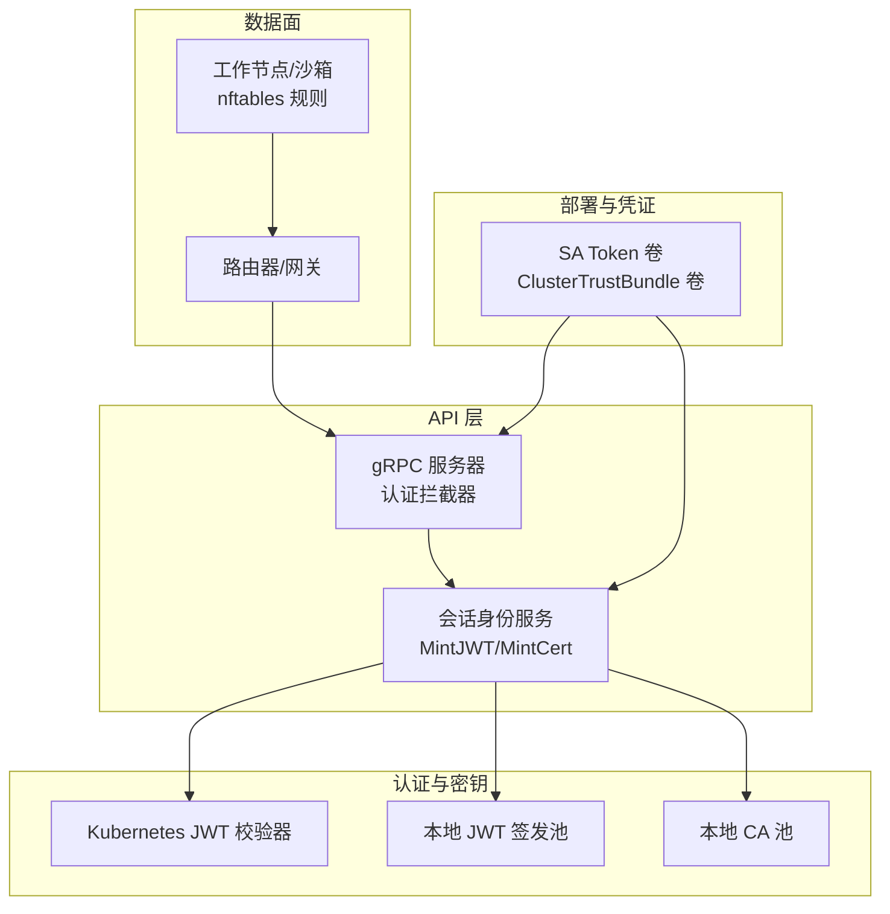
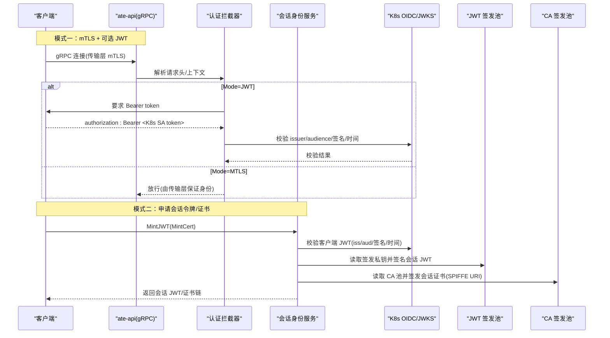
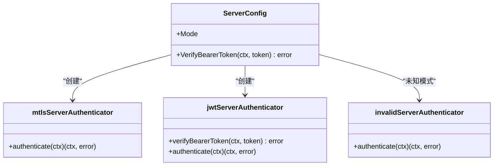
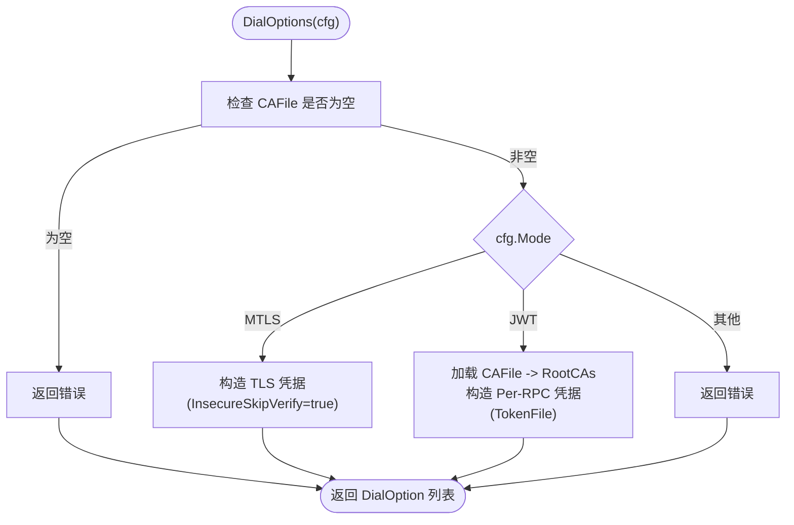
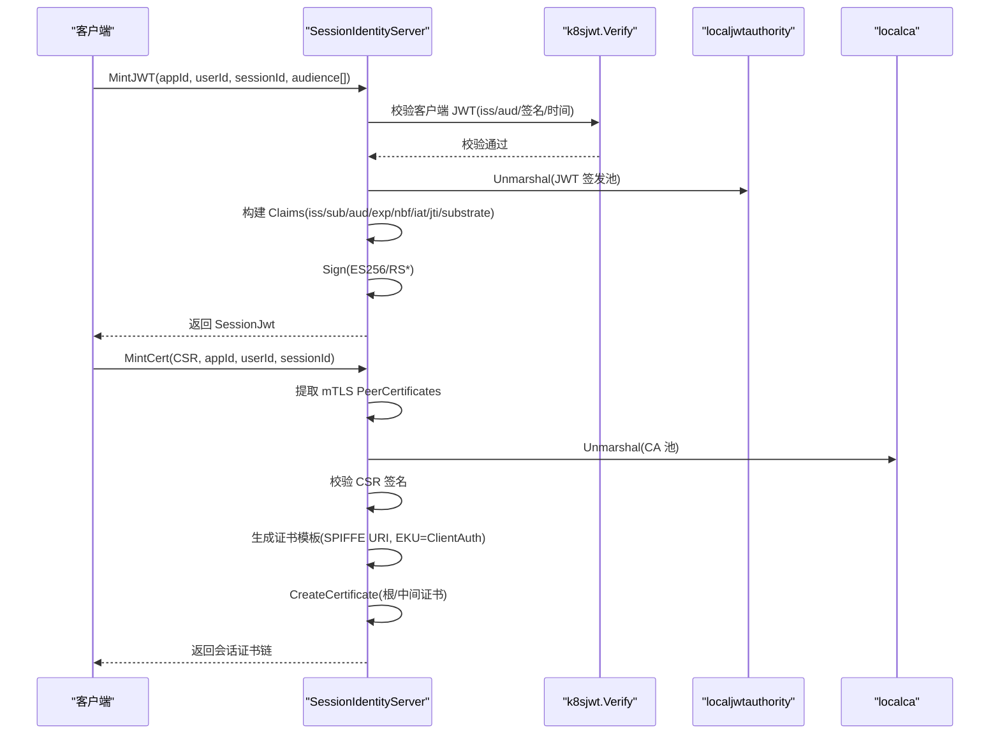
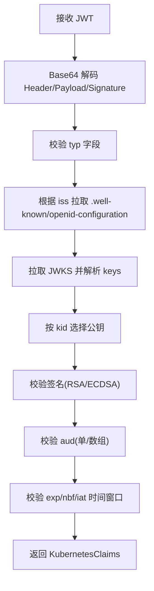
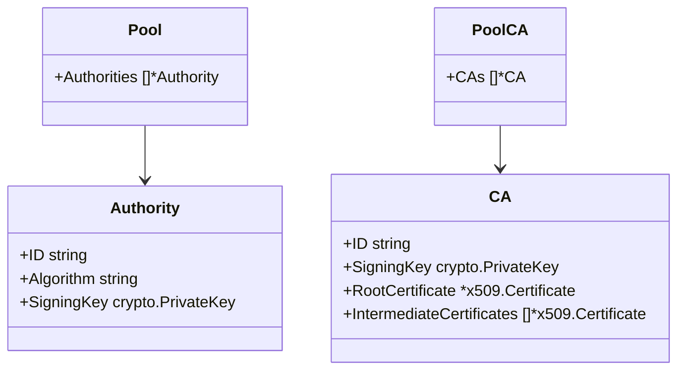
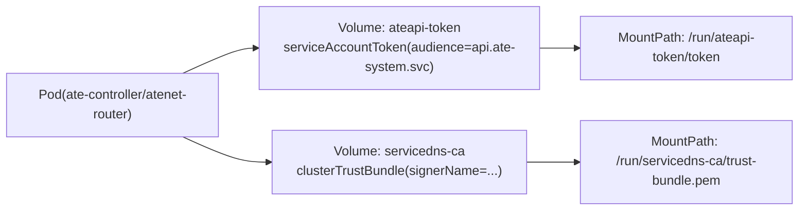
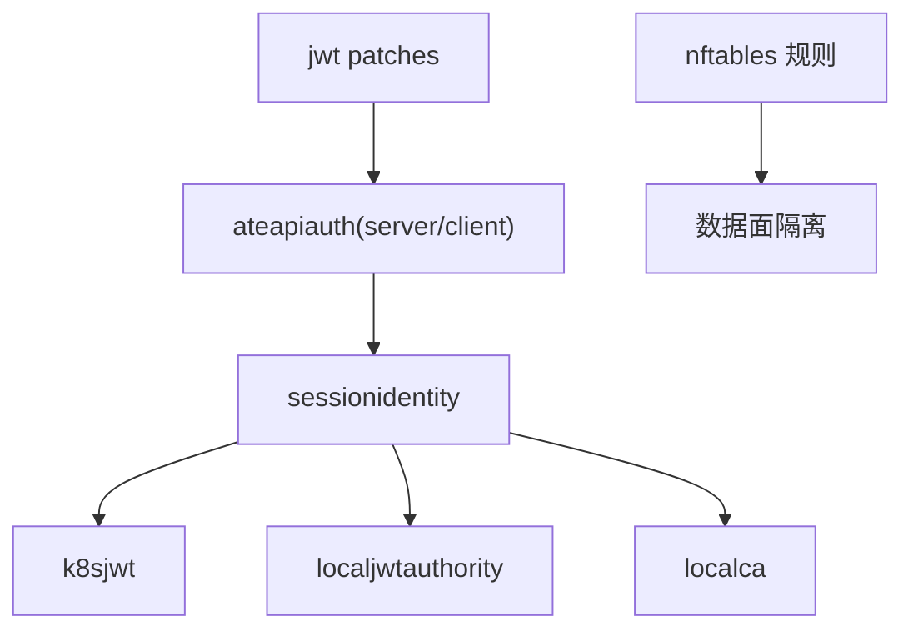

# 安全配置

<cite>
**本文引用的文件**   
- [internal/ateapiauth/server.go](file://internal/ateapiauth/server.go)
- [internal/ateapiauth/client.go](file://internal/ateapiauth/client.go)
- [cmd/ateapi/internal/sessionidentity/sessionidentity.go](file://cmd/ateapi/internal/sessionidentity/sessionidentity.go)
- [cmd/ateapi/internal/k8sjwt/k8sjwt.go](file://cmd/ateapi/internal/k8sjwt/k8sjwt.go)
- [cmd/ateapi/internal/sessionidjwt/sessionidjwt.go](file://cmd/ateapi/internal/sessionidjwt/sessionidjwt.go)
- [internal/localjwtauthority/localjwtauthority.go](file://internal/localjwtauthority/localjwtauthority.go)
- [internal/localca/localca.go](file://internal/localca/localca.go)
- [manifests/ate-install/jwt/patches.yaml](file://manifests/ate-install/jwt/patches.yaml)
- [pkg/proto/ateapipb/ateapi_grpc.pb.go](file://pkg/proto/ateapipb/ateapi_grpc.pb.go)
- [benchmarking/monitoring.yaml](file://benchmarking/monitoring.yaml)
- [cmd/ateom-gvisor/main.go](file://cmd/ateom-gvisor/main.go)
- [cmd/ateom-microvm/net.go](file://cmd/ateom-microvm/net.go)
- [docs/threat-model.md](file://docs/threat-model.md)
</cite>

## 目录
1. [简介](#简介)
2. [项目结构](#项目结构)
3. [核心组件](#核心组件)
4. [架构总览](#架构总览)
5. [详细组件分析](#详细组件分析)
6. [依赖关系分析](#依赖关系分析)
7. [性能与可用性考虑](#性能与可用性考虑)
8. [故障排查指南](#故障排查指南)
9. [结论](#结论)
10. [附录](#附录)

## 简介
本指南面向在 Kubernetes 上部署和运行 Substrate 的运维与安全工程师，提供完整的安全配置说明。内容覆盖：
- mTLS 与 JWT 两种认证模式的区别、适用场景与配置方法
- 证书与密钥管理（CA/JWT 签发池）
- 身份验证流程（客户端与服务端）
- RBAC 权限模型与访问控制策略（ServiceAccount、Role/ClusterRole）
- 网络安全配置（Ingress、网络策略、nftables 规则）
- 安全最佳实践（密码策略、审计日志、漏洞扫描）
- 安全事件响应与灾难恢复计划

## 项目结构
与安全相关的代码主要分布在以下模块：
- gRPC 认证拦截器与客户端拨号选项：internal/ateapiauth
- 会话身份服务（MintJWT/MintCert）：cmd/ateapi/internal/sessionidentity
- Kubernetes JWT 校验器：cmd/ateapi/internal/k8sjwt
- 本地 JWT 签发池与 CA 池：internal/localjwtauthority、internal/localca
- 部署补丁（挂载 SA Token 与 ClusterTrustBundle）：manifests/ate-install/jwt/patches.yaml
- 运行时网络隔离（nftables）：cmd/ateom-gvisor/main.go、cmd/ateom-microvm/net.go
- 威胁模型参考：docs/threat-model.md

图表来源
- [internal/ateapiauth/server.go:1-182](file://internal/ateapiauth/server.go#L1-L182)
- [cmd/ateapi/internal/sessionidentity/sessionidentity.go:1-226](file://cmd/ateapi/internal/sessionidentity/sessionidentity.go#L1-L226)
- [cmd/ateapi/internal/k8sjwt/k8sjwt.go:1-459](file://cmd/ateapi/internal/k8sjwt/k8sjwt.go#L1-L459)
- [internal/localjwtauthority/localjwtauthority.go:1-138](file://internal/localjwtauthority/localjwtauthority.go#L1-L138)
- [internal/localca/localca.go:1-193](file://internal/localca/localca.go#L1-L193)
- [manifests/ate-install/jwt/patches.yaml:1-84](file://manifests/ate-install/jwt/patches.yaml#L1-L84)

章节来源
- [internal/ateapiauth/server.go:1-182](file://internal/ateapiauth/server.go#L1-L182)
- [cmd/ateapi/internal/sessionidentity/sessionidentity.go:1-226](file://cmd/ateapi/internal/sessionidentity/sessionidentity.go#L1-L226)
- [cmd/ateapi/internal/k8sjwt/k8sjwt.go:1-459](file://cmd/ateapi/internal/k8sjwt/k8sjwt.go#L1-L459)
- [internal/localjwtauthority/localjwtauthority.go:1-138](file://internal/localjwtauthority/localjwtauthority.go#L1-L138)
- [internal/localca/localca.go:1-193](file://internal/localca/localca.go#L1-L193)
- [manifests/ate-install/jwt/patches.yaml:1-84](file://manifests/ate-install/jwt/patches.yaml#L1-L84)

## 核心组件
- gRPC 认证拦截器（服务端）
  - 支持 ModeMTLS 与 ModeJWT 两种模式；ModeJWT 要求每个 RPC 携带 authorization: Bearer <token>
  - 通过 UnaryServerInterceptor 与 StreamServerInterceptor 统一拦截
- gRPC 客户端拨号选项
  - ModeMTLS：默认跳过服务端证书校验（用于内部 mTLS 阶段），后续可接入 CA 校验
  - ModeJWT：基于 CAFile 校验服务端证书，并通过 per-RPC 凭据注入 Bearer token
- 会话身份服务
  - MintJWT：校验调用方 K8s SA JWT，使用本地 JWT 签发池签发会话 JWT
  - MintCert：基于 mTLS 对等证书校验，使用本地 CA 池签发会话证书（含 SPIFFE URI）
- Kubernetes JWT 校验器
  - 从 OIDC Discovery 获取 JWKS，按 kid 选择公钥，校验签名、issuer、audience、时间窗口
- 本地密钥材料
  - localjwtauthority：JWT 签发私钥池（支持 ES256/RS*）
  - localca：X.509 CA 池（ED25519 根证书，签发中间证书与叶子证书）
- 部署补丁
  - 为 ate-controller 与 atenet-router 挂载 ServiceAccountToken 与 ClusterTrustBundle

章节来源
- [internal/ateapiauth/server.go:35-182](file://internal/ateapiauth/server.go#L35-L182)
- [internal/ateapiauth/client.go:34-117](file://internal/ateapiauth/client.go#L34-L117)
- [cmd/ateapi/internal/sessionidentity/sessionidentity.go:71-226](file://cmd/ateapi/internal/sessionidentity/sessionidentity.go#L71-L226)
- [cmd/ateapi/internal/k8sjwt/k8sjwt.go:118-261](file://cmd/ateapi/internal/k8sjwt/k8sjwt.go#L118-L261)
- [internal/localjwtauthority/localjwtauthority.go:29-138](file://internal/localjwtauthority/localjwtauthority.go#L29-L138)
- [internal/localca/localca.go:30-193](file://internal/localca/localca.go#L30-L193)
- [manifests/ate-install/jwt/patches.yaml:15-84](file://manifests/ate-install/jwt/patches.yaml#L15-L84)

## 架构总览
下图展示了 mTLS 与 JWT 两种认证路径以及会话身份服务的交互。

图表来源
- [internal/ateapiauth/server.go:81-152](file://internal/ateapiauth/server.go#L81-L152)
- [internal/ateapiauth/client.go:57-95](file://internal/ateapiauth/client.go#L57-L95)
- [cmd/ateapi/internal/sessionidentity/sessionidentity.go:71-226](file://cmd/ateapi/internal/sessionidentity/sessionidentity.go#L71-L226)
- [cmd/ateapi/internal/k8sjwt/k8sjwt.go:118-261](file://cmd/ateapi/internal/k8sjwt/k8sjwt.go#L118-L261)
- [internal/localjwtauthority/localjwtauthority.go:76-101](file://internal/localjwtauthority/localjwtauthority.go#L76-L101)
- [internal/localca/localca.go:83-120](file://internal/localca/localca.go#L83-L120)

## 详细组件分析

### 组件A：gRPC 认证拦截器（服务端）
- 功能要点
  - 解析 Mode：mtls（默认）或 jwt
  - ModeMTLS：不做强应用层鉴权，仅依赖传输层 mTLS
  - ModeJWT：强制要求 authorization: Bearer <token>，并通过回调 VerifyBearerToken 完成校验
- 关键接口
  - UnaryServerInterceptor / StreamServerInterceptor
  - serverAuthenticator 接口实现 mtlsServerAuthenticator / jwtServerAuthenticator

图表来源
- [internal/ateapiauth/server.go:35-182](file://internal/ateapiauth/server.go#L35-L182)

章节来源
- [internal/ateapiauth/server.go:35-182](file://internal/ateapiauth/server.go#L35-L182)

### 组件B：gRPC 客户端拨号与凭据注入
- 功能要点
  - ModeMTLS：当前默认 InsecureSkipVerify=true（便于内部测试），需在生产环境启用 CA 校验
  - ModeJWT：加载 CAFile，设置 TLS RootCAs，并为每个 RPC 注入 authorization: Bearer <token>
- 关键类型
  - ClientConfig：Mode、CAFile、ServerName、TokenFile
  - fileTokenCreds：每请求读取 TokenFile，自动处理 K8s 令牌轮换

图表来源
- [internal/ateapiauth/client.go:57-117](file://internal/ateapiauth/client.go#L57-L117)

章节来源
- [internal/ateapiauth/client.go:34-117](file://internal/ateapiauth/client.go#L34-L117)

### 组件C：会话身份服务（MintJWT/MintCert）
- 功能要点
  - MintJWT：校验客户端 K8s SA JWT（issuer/audience/签名/时间），使用本地 JWT 签发池签发会话 JWT，包含 app/user/session 子声明
  - MintCert：基于 mTLS 对等证书校验，使用本地 CA 池签发会话证书，设置 SPIFFE URI 标识
- 关键依赖
  - k8sjwt.Verify：OIDC Discovery + JWKS 拉取与校验
  - localjwtauthority.Unmarshal：加载签发私钥池
  - localca.Unmarshal：加载 CA 池（根证书+中间证书）

图表来源
- [cmd/ateapi/internal/sessionidentity/sessionidentity.go:71-226](file://cmd/ateapi/internal/sessionidentity/sessionidentity.go#L71-L226)
- [cmd/ateapi/internal/k8sjwt/k8sjwt.go:118-261](file://cmd/ateapi/internal/k8sjwt/k8sjwt.go#L118-L261)
- [internal/localjwtauthority/localjwtauthority.go:76-101](file://internal/localjwtauthority/localjwtauthority.go#L76-L101)
- [internal/localca/localca.go:83-120](file://internal/localca/localca.go#L83-L120)

章节来源
- [cmd/ateapi/internal/sessionidentity/sessionidentity.go:71-226](file://cmd/ateapi/internal/sessionidentity/sessionidentity.go#L71-L226)
- [cmd/ateapi/internal/k8sjwt/k8sjwt.go:118-261](file://cmd/ateapi/internal/k8sjwt/k8sjwt.go#L118-L261)
- [internal/localjwtauthority/localjwtauthority.go:29-138](file://internal/localjwtauthority/localjwtauthority.go#L29-L138)
- [internal/localca/localca.go:30-193](file://internal/localca/localca.go#L30-L193)

### 组件D：Kubernetes JWT 校验器
- 功能要点
  - 解析 header/payload/signature，校验 typ 字段
  - 根据 iss 发现 OIDC 文档并拉取 JWKS，按 kid 选择公钥
  - 校验签名（RSA PKCS1v15/ECDSA P256/P384/P521）
  - 校验 aud（单字符串或数组）、exp/nbf/iat 时间窗口
- 输出
  - KubernetesClaims：包含命名空间、SA、Pod、Secret、Node 等绑定信息

图表来源
- [cmd/ateapi/internal/k8sjwt/k8sjwt.go:118-261](file://cmd/ateapi/internal/k8sjwt/k8sjwt.go#L118-L261)

章节来源
- [cmd/ateapi/internal/k8sjwt/k8sjwt.go:118-261](file://cmd/ateapi/internal/k8sjwt/k8sjwt.go#L118-L261)

### 组件E：本地密钥材料（JWT 签发池与 CA 池）
- JWT 签发池（localjwtauthority）
  - 支持 ES256/RS* 算法，提供 Marshal/Unmarshal 序列化
  - GenerateECDSAP256Authority 生成 ECDSA P256 私钥
- CA 池（localca）
  - 支持 ED25519 根证书自签，序列化为 DER/PEM
  - 提供 GenerateED25519CA 生成根证书

图表来源
- [internal/localjwtauthority/localjwtauthority.go:29-138](file://internal/localjwtauthority/localjwtauthority.go#L29-L138)
- [internal/localca/localca.go:30-193](file://internal/localca/localca.go#L30-L193)

章节来源
- [internal/localjwtauthority/localjwtauthority.go:29-138](file://internal/localjwtauthority/localjwtauthority.go#L29-L138)
- [internal/localca/localca.go:30-193](file://internal/localca/localca.go#L30-L193)

### 组件F：部署补丁（SA Token 与 ClusterTrustBundle）
- 为 ate-controller 与 atenet-router 注入：
  - serviceAccountToken：audience=api.ate-system.svc，expirationSeconds=3600，挂载到 /run/ateapi-token/token
  - clusterTrustBundle：signerName=servicedns.podcert.ate.dev/identity，标签选择 canarying=live，挂载到 /run/servicedns-ca/trust-bundle.pem

图表来源
- [manifests/ate-install/jwt/patches.yaml:15-84](file://manifests/ate-install/jwt/patches.yaml#L15-L84)

章节来源
- [manifests/ate-install/jwt/patches.yaml:15-84](file://manifests/ate-install/jwt/patches.yaml#L15-L84)

## 依赖关系分析
- 组件耦合
  - sessionidentity 依赖 k8sjwt、localjwtauthority、localca
  - ateapiauth 拦截器独立于业务逻辑，仅负责认证前置校验
  - 客户端拨号选项与服务器认证模式一一对应
- 外部依赖
  - Kubernetes OIDC/JWKS 端点
  - 集群信任束（ClusterTrustBundle）
  - nftables（数据面隔离）

图表来源
- [cmd/ateapi/internal/sessionidentity/sessionidentity.go:1-226](file://cmd/ateapi/internal/sessionidentity/sessionidentity.go#L1-L226)
- [cmd/ateapi/internal/k8sjwt/k8sjwt.go:1-459](file://cmd/ateapi/internal/k8sjwt/k8sjwt.go#L1-L459)
- [internal/localjwtauthority/localjwtauthority.go:1-138](file://internal/localjwtauthority/localjwtauthority.go#L1-L138)
- [internal/localca/localca.go:1-193](file://internal/localca/localca.go#L1-L193)
- [internal/ateapiauth/server.go:1-182](file://internal/ateapiauth/server.go#L1-L182)
- [internal/ateapiauth/client.go:1-117](file://internal/ateapiauth/client.go#L1-L117)
- [cmd/ateom-gvisor/main.go:672-701](file://cmd/ateom-gvisor/main.go#L672-L701)
- [cmd/ateom-microvm/net.go:396-460](file://cmd/ateom-microvm/net.go#L396-L460)

章节来源
- [cmd/ateapi/internal/sessionidentity/sessionidentity.go:1-226](file://cmd/ateapi/internal/sessionidentity/sessionidentity.go#L1-L226)
- [cmd/ateapi/internal/k8sjwt/k8sjwt.go:1-459](file://cmd/ateapi/internal/k8sjwt/k8sjwt.go#L1-L459)
- [internal/localjwtauthority/localjwtauthority.go:1-138](file://internal/localjwtauthority/localjwtauthority.go#L1-L138)
- [internal/localca/localca.go:1-193](file://internal/localca/localca.go#L1-L193)
- [internal/ateapiauth/server.go:1-182](file://internal/ateapiauth/server.go#L1-L182)
- [internal/ateapiauth/client.go:1-117](file://internal/ateapiauth/client.go#L1-L117)
- [cmd/ateom-gvisor/main.go:672-701](file://cmd/ateom-gvisor/main.go#L672-L701)
- [cmd/ateom-microvm/net.go:396-460](file://cmd/ateom-microvm/net.go#L396-L460)

## 性能与可用性考虑
- 密钥缓存
  - 建议将 JWT 签发池与 CA 池加载到内存并定期刷新，避免每次请求都读盘
- 令牌轮换
  - 客户端每请求读取 TokenFile，天然支持 K8s 令牌原地更新
- 证书校验
  - 生产环境务必启用 CA 校验（关闭 InsecureSkipVerify），并最小化 RootCAs
- 网络隔离
  - 使用 NetworkPolicy 默认拒绝，显式允许必要流量
  - 数据面使用 nftables 表隔离 Actor 流量，避免污染 CNI 链

[本节为通用指导，无需特定文件引用]

## 故障排查指南
- 常见错误定位
  - 缺少 Bearer token：检查客户端是否以 ModeJWT 拨号并正确注入 authorization 头
  - 未找到 CA 证书：确认 CAFile 路径与内容有效
  - 未知 key ID：核对 JWKS 中 kid 与 JWT header.kid 一致
  - 过期或未生效：检查 exp/nbf/iat 时间窗口与时钟同步
  - CSR 签名失败：确认 CSR 与私钥匹配且格式正确
- 日志与观测
  - 关注认证拦截器与会话身份服务的错误日志
  - 结合 Prometheus/Grafana 监控认证失败率与延迟

章节来源
- [internal/ateapiauth/server.go:141-152](file://internal/ateapiauth/server.go#L141-L152)
- [internal/ateapiauth/client.go:74-95](file://internal/ateapiauth/client.go#L74-L95)
- [cmd/ateapi/internal/k8sjwt/k8sjwt.go:178-261](file://cmd/ateapi/internal/k8sjwt/k8sjwt.go#L178-L261)
- [cmd/ateapi/internal/sessionidentity/sessionidentity.go:144-226](file://cmd/ateapi/internal/sessionidentity/sessionidentity.go#L144-L226)

## 结论
通过组合 mTLS 与 JWT 认证、严格的密钥管理与 RBAC 授权，配合网络策略与数据面隔离，Substrate 可在 Kubernetes 环境中实现端到端的安全通信与细粒度访问控制。建议在生产环境全面启用 CA 校验、最小权限原则与持续审计，建立完善的应急响应与灾备流程。

[本节为总结性内容，无需特定文件引用]

## 附录

### A. mTLS 与 JWT 认证模式对比与配置要点
- 区别
  - mTLS：身份由传输层证书建立，适合组件间可信内网通信
  - JWT：在 mTLS 基础上增加应用层身份校验，适合跨边界或需要用户/会话级授权的场景
- 配置要点
  - 服务端：设置 Mode=mtls 或 Mode=jwt；Mode=jwt 需提供 VerifyBearerToken
  - 客户端：Mode=jwt 时配置 CAFile 与 TokenFile；Mode=mtls 建议逐步启用 CA 校验
  - 部署：为控制器与路由器挂载 SA Token 与 ClusterTrustBundle

章节来源
- [internal/ateapiauth/server.go:35-70](file://internal/ateapiauth/server.go#L35-L70)
- [internal/ateapiauth/client.go:34-95](file://internal/ateapiauth/client.go#L34-L95)
- [manifests/ate-install/jwt/patches.yaml:15-84](file://manifests/ate-install/jwt/patches.yaml#L15-L84)

### B. 证书与密钥管理
- JWT 签发池
  - 使用 ES256/RS* 算法，定期轮换私钥，保持向后兼容
- CA 池
  - 使用 ED25519 根证书，签发中间证书与叶子证书，限制用途（ClientAuth）
- 存储与分发
  - 将密钥池与证书链以 Secret/ConfigMap 形式分发至相关 Pod，限制访问权限

章节来源
- [internal/localjwtauthority/localjwtauthority.go:29-138](file://internal/localjwtauthority/localjwtauthority.go#L29-L138)
- [internal/localca/localca.go:30-193](file://internal/localca/localca.go#L30-L193)

### C. RBAC 权限模型与访问控制策略
- ServiceAccount
  - 为各组件创建最小权限 SA，并仅授予必要资源与动词
- Role/ClusterRole
  - 示例：Prometheus 在 benchmarking 命名空间仅需 get/list/watch nodes/services/endpoints/pods/ingresses
- 绑定
  - 使用 RoleBinding 将 SA 与 Role 关联，遵循最小权限原则

章节来源
- [benchmarking/monitoring.yaml:15-51](file://benchmarking/monitoring.yaml#L15-L51)

### D. 网络安全配置
- Ingress 控制器
  - 对外暴露入口时启用 TLS 终止与 WAF，限制来源 IP 与速率
- 网络策略
  - 默认拒绝所有入站/出站，仅开放必要端口与命名空间
- 防火墙规则
  - 在云厂商层面限制对控制平面与数据库的直接访问
- 数据面隔离
  - 使用 nftables 表隔离 Actor 流量，避免影响宿主与 CNI 链

章节来源
- [docs/threat-model.md:72-82](file://docs/threat-model.md#L72-L82)
- [cmd/ateom-gvisor/main.go:672-701](file://cmd/ateom-gvisor/main.go#L672-L701)
- [cmd/ateom-microvm/net.go:396-460](file://cmd/ateom-microvm/net.go#L396-L460)

### E. 安全最佳实践
- 密码策略
  - 强随机密钥，定期轮换，禁止硬编码
- 审计日志
  - 记录认证失败、授权拒绝、证书签发与密钥访问
- 漏洞扫描
  - 镜像与依赖库定期扫描，及时修复高危漏洞
- 最小权限
  - 严格限定 SA 权限与网络可达范围

[本节为通用指导，无需特定文件引用]

### F. 安全事件响应与灾难恢复
- 事件响应
  - 定义告警阈值（认证失败率、异常证书签发）
  - 快速吊销机制（轮换 CA/JWT 私钥、撤销受影响的令牌/证书）
- 灾难恢复
  - 备份密钥池与证书链，确保可离线恢复
  - 演练恢复流程，验证 RTO/RPO 目标

[本节为通用指导，无需特定文件引用]
