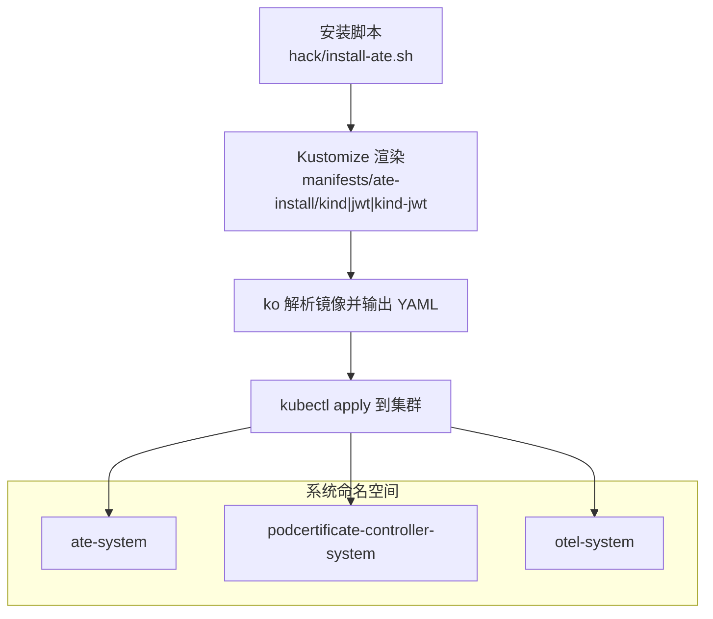
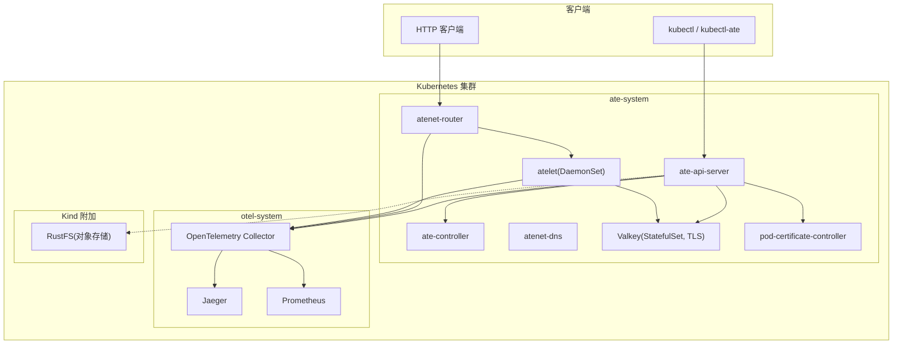
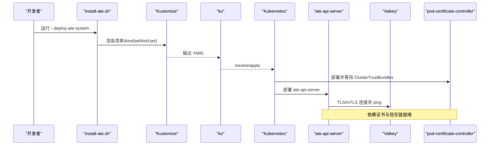

# 安装部署

<cite>
**本文引用的文件**   
- [README.md](file://README.md)
- [install-ate.sh](file://hack/install-ate.sh)
- [install-ate-kind.sh](file://hack/install-ate-kind.sh)
- [kustomization.yaml（kind）](file://manifests/ate-install/kind/kustomization.yaml)
- [kustomization.yaml（jwt）](file://manifests/ate-install/jwt/kustomization.yaml)
- [kustomization.yaml（kind-jwt）](file://manifests/ate-install/kind-jwt/kustomization.yaml)
- [valkey.yaml](file://manifests/ate-install/valkey.yaml)
- [rustfs.yaml](file://manifests/ate-install/kind/rustfs.yaml)
- [otel-collector.yaml](file://manifests/ate-install/kind/otel-collector.yaml)
- [prometheus.yaml](file://manifests/ate-install/kind/prometheus.yaml)
- [valkey-direct-access.md](file://docs/dev/valkey-direct-access.md)
- [main.go（ateapi）](file://cmd/ateapi/main.go)
</cite>

## 目录
1. [简介](#简介)
2. [项目结构](#项目结构)
3. [核心组件](#核心组件)
4. [架构总览](#架构总览)
5. [详细组件分析](#详细组件分析)
6. [依赖关系分析](#依赖关系分析)
7. [性能与容量规划](#性能与容量规划)
8. [故障排除指南](#故障排除指南)
9. [版本兼容性与升级迁移](#版本兼容性与升级迁移)
10. [结论](#结论)

## 简介
本指南面向在本地开发环境（Kind）、生产环境（GKE）及其他 Kubernetes 集群中安装和部署 Agent Substrate 的用户。内容涵盖：
- 不同环境的部署要求与差异
- 安装脚本参数与环境变量说明
- 各组件清单结构与配置项（资源限制、副本数、存储等）
- 依赖服务（Valkey 缓存、对象存储、DNS/证书服务等）的安装与配置
- 生产最佳实践（安全、监控告警、备份恢复）
- 故障排除与常见问题定位
- 版本兼容性矩阵与升级迁移建议

## 项目结构
Agent Substrate 的部署相关清单位于 manifests/ate-install，安装脚本位于 hack 目录，通过 Kustomize 与 ko 组合完成多环境渲染与镜像解析。

图表来源
- [install-ate.sh:147-167](file://hack/install-ate.sh#L147-L167)
- [kustomization.yaml（kind）:15-29](file://manifests/ate-install/kind/kustomization.yaml#L15-L29)
- [kustomization.yaml（jwt）:15-28](file://manifests/ate-install/jwt/kustomization.yaml#L15-L28)
- [kustomization.yaml（kind-jwt）:15-22](file://manifests/ate-install/kind-jwt/kustomization.yaml#L15-L22)

章节来源
- [README.md:97-175](file://README.md#L97-L175)
- [install-ate.sh:147-167](file://hack/install-ate.sh#L147-L167)

## 核心组件
- ate-api-server：控制面 API 服务，负责 Actor/Worker 生命周期管理与状态存储（Valkey）。
- ate-controller：控制器，协调 WorkerPool/ActorTemplate 等 CRD。
- atenet-router/dns：网络路由与 DNS 服务，提供流量转发与内部域名解析。
- atelet：节点级守护进程，管理物理 Worker Pod、快照与状态迁移。
- pod-certificate-controller：Pod 证书签发与信任链管理。
- Valkey：TLS 集群模式的状态存储后端。
- 可选：RustFS（Kind 示例对象存储）、OpenTelemetry Collector + Jaeger + Prometheus（可观测性）。

章节来源
- [README.md:211-225](file://README.md#L211-L225)
- [install-ate.sh:267-310](file://hack/install-ate.sh#L267-L310)

## 架构总览
下图展示了 Kind 与 GKE 两种部署路径下的主要组件交互与数据流。

图表来源
- [kustomization.yaml（kind）:18-28](file://manifests/ate-install/kind/kustomization.yaml#L18-L28)
- [valkey.yaml:73-149](file://manifests/ate-install/valkey.yaml#L73-L149)
- [otel-collector.yaml:56-114](file://manifests/ate-install/kind/otel-collector.yaml#L56-L114)
- [prometheus.yaml:111-205](file://manifests/ate-install/kind/prometheus.yaml#L111-L205)
- [rustfs.yaml:44-92](file://manifests/ate-install/kind/rustfs.yaml#L44-L92)

## 详细组件分析

### 安装脚本与参数
- 入口脚本：hack/install-ate.sh
- Kind 快捷封装：hack/install-ate-kind.sh（设置 KO_DOCKER_REPO、平台、ATE_INSTALL_KIND 等）

常用参数（节选）
- --deploy-ate-system：部署核心系统（CRDs、atelet、apiserver 等）
- --delete-ate-system：删除核心系统
- --delete-all：删除核心系统与所有已注册 Demo
- --auth-mode=mtls|jwt：选择 ate-api-server 认证模式（默认 mtls）
- --deploy-atelet / --deploy-ate-apiserver / --deploy-atenet：单独部署某组件
- --create-*：创建所需的 Secret/ConfigMap（JWT 池、CA 池、Valkey CA、API Server 环境变量等）
- --deploy-benchmarks / --delete-benchmarks：部署或清理基准测试栈
- --benchmark-worker-count N：基准测试时 WorkerPool 副本数

关键环境变量
- KUBECTL_CONTEXT：指定 kubeconfig context
- PROJECT_ID / CLUSTER_LOCATION / CLUSTER_NAME：用于生成 JWT Issuer 与 gcloud 凭据
- ATE_API_AUTH_MODE：认证模式（mtls/jwt），也可通过 --auth-mode 传入
- ATE_INSTALL_KIND：是否使用 Kind 覆盖集
- KO_DOCKER_REPO / KO_DEFAULTPLATFORMS：本地构建与推送镜像仓库及目标平台
- BUCKET_NAME：对象存储桶名（Kind 示例默认 ate-snapshots）

章节来源
- [install-ate.sh:58-98](file://hack/install-ate.sh#L58-L98)
- [install-ate.sh:135-167](file://hack/install-ate.sh#L135-L167)
- [install-ate.sh:217-251](file://hack/install-ate.sh#L217-L251)
- [install-ate-kind.sh:22-38](file://hack/install-ate-kind.sh#L22-L38)

### 清单结构与覆盖策略
- base：manifests/ate-install/*.yaml（通用清单）
- kind：manifests/ate-install/kind/*（包含 RustFS、OTEL、Prometheus 等）
- jwt/kind-jwt：启用 JWT 模式的覆盖集

覆盖要点
- Kind 覆盖：引入 rustfs、otel-collector、prometheus，并对 ate-api-server 与 atelet 注入 OTEL 端点
- JWT 覆盖：为 ate-api-server、ate-controller、atenet-router 追加 --auth-mode=jwt 与 token 文件参数

章节来源
- [kustomization.yaml（kind）:18-28](file://manifests/ate-install/kind/kustomization.yaml#L18-L28)
- [kustomization.yaml（jwt）:27-64](file://manifests/ate-install/jwt/kustomization.yaml#L27-L64)
- [kustomization.yaml（kind-jwt）:21-58](file://manifests/ate-install/kind-jwt/kustomization.yaml#L21-L58)

### 依赖服务：Valkey（TLS 集群）
- 部署形态：StatefulSet（6 副本），Headless Service + 普通 Service
- 安全：强制 TLS（禁用明文端口），双向认证，自动重载证书
- 初始化：Job 等待所有 Pod DNS 解析后执行 cluster create
- 存储：每个节点 1Gi RWO PVC
- 连接方式：ate-api-server 通过 TLS 与 mTLS 连接，服务端名与 CA 由 ConfigMap 注入

配置要点
- 监听端口：6379（TLS），总线端口：16379
- 证书来源：ServiceDNS 签发的凭证包 + valkey-ca-certs Secret
- 集群模式：cluster-enabled yes，持久化 appendonly yes

章节来源
- [valkey.yaml:15-149](file://manifests/ate-install/valkey.yaml#L15-L149)
- [valkey.yaml:150-227](file://manifests/ate-install/valkey.yaml#L150-L227)
- [install-ate.sh:169-186](file://hack/install-ate.sh#L169-L186)
- [install-ate.sh:217-251](file://hack/install-ate.sh#L217-L251)
- [main.go（ateapi）:280-314](file://cmd/ateapi/main.go#L280-L314)

### 依赖服务：对象存储（Kind 示例 RustFS）
- 部署形态：Deployment（1 副本）+ PVC（1Gi）
- 访问：ClusterIP Service，控制台端口 9001
- 初始化 Job：使用 AWS CLI 创建 ate-snapshots 桶
- 注意：生产环境建议使用云厂商对象存储（如 GCS/S3），并通过 IAM/凭据管理

章节来源
- [rustfs.yaml:15-92](file://manifests/ate-install/kind/rustfs.yaml#L15-L92)
- [rustfs.yaml:93-134](file://manifests/ate-install/kind/rustfs.yaml#L93-L134)

### 依赖服务：DNS/证书（pod-certificate-controller）
- 作用：签发 Pod 证书与 DNS 证书，生成 ClusterTrustBundle 供其他组件验证
- 安装顺序：先于 ate-api-server 启动，确保信任链可用
- 产物：service-dns-ca-pool、pod-identity-ca-pool 等 Secret

章节来源
- [install-ate.sh:287-298](file://hack/install-ate.sh#L287-L298)
- [install-ate.sh:204-215](file://hack/install-ate.sh#L204-L215)

### 可观测性（Kind 示例）
- OpenTelemetry Collector：接收 OTLP traces/metrics，转发至 Jaeger/Prometheus
- Jaeger：All-in-One 追踪后端
- Prometheus：抓取 OTEL 暴露的指标

章节来源
- [otel-collector.yaml:25-54](file://manifests/ate-install/kind/otel-collector.yaml#L25-L54)
- [otel-collector.yaml:56-114](file://manifests/ate-install/kind/otel-collector.yaml#L56-L114)
- [prometheus.yaml:58-110](file://manifests/ate-install/kind/prometheus.yaml#L58-L110)

### 认证模式（mTLS vs JWT）
- mTLS：默认模式，基于证书的双向认证
- JWT：通过 --auth-mode=jwt 启用，配合 token 文件与 OIDC Issuer 校验
- Kind/JWT 覆盖：在 kind-jwt 覆盖集中统一注入参数

章节来源
- [install-ate.sh:135-145](file://hack/install-ate.sh#L135-L145)
- [kustomization.yaml（jwt）:27-64](file://manifests/ate-install/jwt/kustomization.yaml#L27-L64)
- [kustomization.yaml（kind-jwt）:21-58](file://manifests/ate-install/kind-jwt/kustomization.yaml#L21-L58)

## 依赖关系分析

图表来源
- [install-ate.sh:267-310](file://hack/install-ate.sh#L267-L310)
- [install-ate.sh:147-167](file://hack/install-ate.sh#L147-L167)
- [valkey.yaml:150-227](file://manifests/ate-install/valkey.yaml#L150-L227)

## 性能与容量规划
- Valkey
  - 副本数：6（含主从），单节点 1Gi 存储；根据热点键与写入量评估是否需要扩容或更换高性能磁盘
  - 网络：开启 TLS 会带来额外 CPU 开销，建议在具备足够 CPU 资源的节点上调度
- ate-api-server
  - 并发与内存：受 Redis 集群吞吐与网络延迟影响；建议至少 2 副本以支持滚动更新与高可用
- atenet-router
  - 作为入站流量入口，需关注 QPS 与连接数；结合 Ingress/LoadBalancer 进行水平扩展
- atelet
  - DaemonSet 每节点一个实例，需保证节点具备足够的 CPU/内存以承载快照/恢复操作
- 可观测性
  - Prometheus 存储建议持久化；Jaeger 可根据链路规模调整采样率与存储后端

[本节为通用指导，不直接分析具体文件]

## 故障排除指南
- 无法连接 Valkey
  - 检查 Valkey StatefulSet 与 Service 是否就绪，确认 TLS 证书与 CA 是否正确挂载
  - 参考文档：[valkey-direct-access.md:1-11](file://docs/dev/valkey-direct-access.md#L1-L11)
  - 验证 ate-api-server 的 TLS 配置与服务端名
- 认证失败（JWT）
  - 确认 --auth-mode=jwt 已生效，token 文件存在且可读
  - 检查 OIDC Issuer 地址是否正确（GKE 场景由脚本自动推导）
- 证书未就绪
  - 确认 pod-certificate-controller 已部署并创建了 ClusterTrustBundles
- 对象存储不可用（Kind）
  - 检查 RustFS Pod 与 PVC 状态，确认初始化 Job 成功创建 ate-snapshots 桶
- 可观测性无数据
  - 确认 OTEL Collector 与 Jaeger/Prometheus 服务可达，应用侧 OTEL_EXPORTER_OTLP_ENDPOINT 正确

章节来源
- [valkey-direct-access.md:1-11](file://docs/dev/valkey-direct-access.md#L1-L11)
- [install-ate.sh:287-298](file://hack/install-ate.sh#L287-L298)
- [install-ate.sh:217-251](file://hack/install-ate.sh#L217-L251)
- [rustfs.yaml:93-134](file://manifests/ate-install/kind/rustfs.yaml#L93-L134)

## 版本兼容性与升级迁移
- Kubernetes 版本
  - 官方目标：最新稳定版与前一个次要版本
- Go 工具链
  - go.mod 指定 Go 版本，请确保本地与 CI 环境一致
- 升级建议
  - 先升级控制面组件（ate-api-server、ate-controller、atenet），再升级 atelet
  - 变更清单前，先在 Kind 环境验证覆盖集与参数
  - 若切换认证模式（mTLS→JWT），需同步更新覆盖集与 Secret/ConfigMap
- 回滚策略
  - 保留上一版本镜像标签与清单，必要时回滚 Deployment/StatefulSet 版本

章节来源
- [README.md:69-72](file://README.md#L69-L72)
- [go.mod:1-3](file://go.mod#L1-L3)

## 结论
通过统一的安装脚本与 Kustomize 覆盖集，Agent Substrate 可在 Kind 与 GKE 等多环境中快速部署。Valkey 的 TLS 集群与 Pod 证书体系提供了强安全基线；结合 OTEL/Jaeger/Prometheus 可实现端到端可观测。生产环境建议采用托管对象存储与专用监控方案，并根据负载特征合理规划副本与资源配额。
