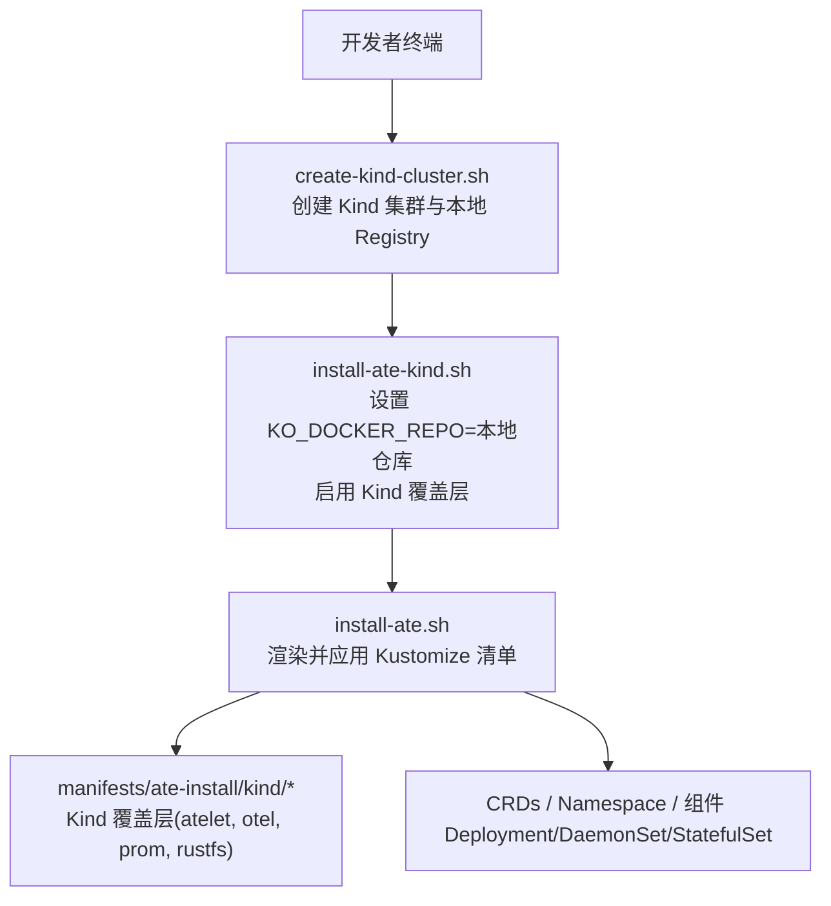
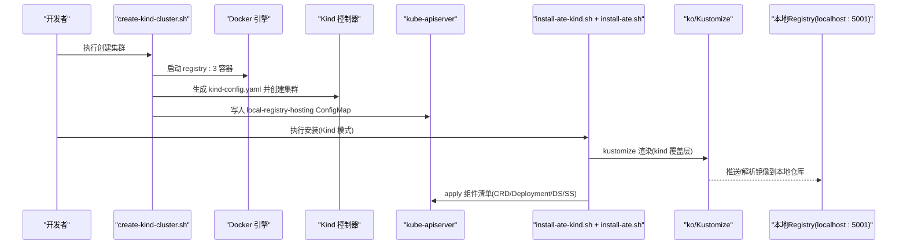
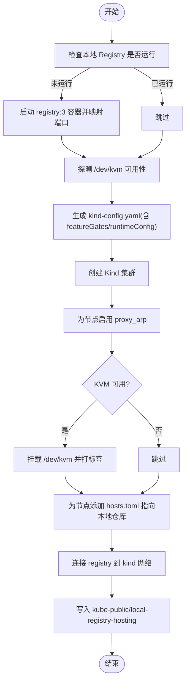
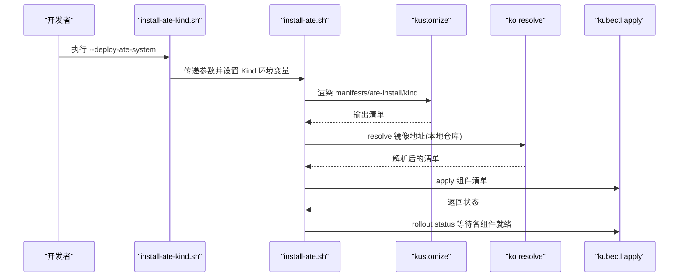
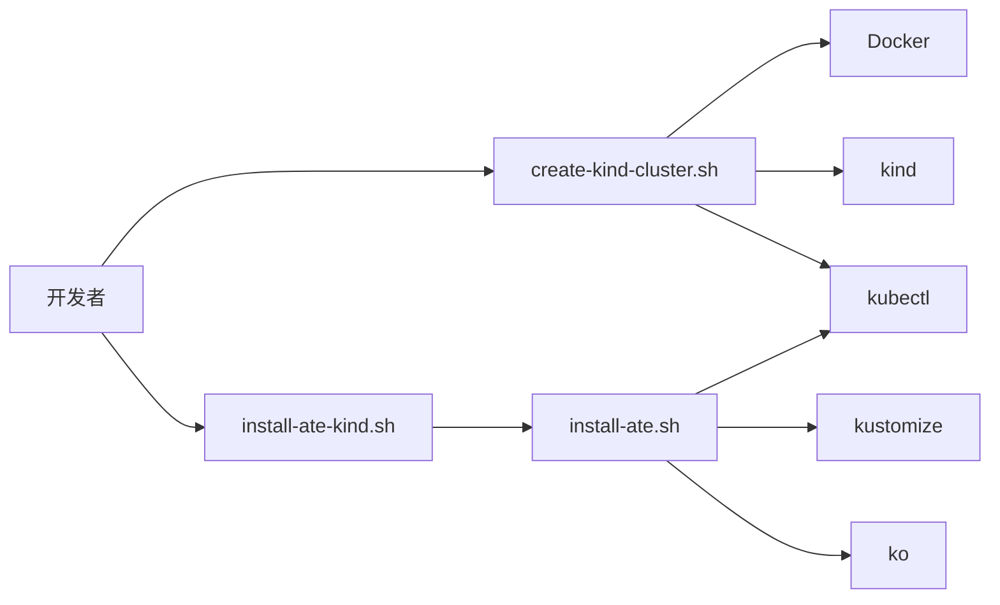

# 本地开发环境

<cite>
**本文引用的文件**   
- [README.md](file://README.md)
- [hack/create-kind-cluster.sh](file://hack/create-kind-cluster.sh)
- [hack/delete-kind-cluster.sh](file://hack/delete-kind-cluster.sh)
- [hack/install-ate-kind.sh](file://hack/install-ate-kind.sh)
- [hack/install-ate.sh](file://hack/install-ate.sh)
- [hack/kind.sh](file://hack/kind.sh)
- [manifests/ate-install/kind/kustomization.yaml](file://manifests/ate-install/kind/kustomization.yaml)
- [manifests/ate-install/kind/atelet/kustomization.yaml](file://manifests/ate-install/kind/atelet/kustomization.yaml)
- [cmd/kubectl-ate/internal/cmd/admin_debug_redis_flush.go](file://cmd/kubectl-ate/internal/cmd/admin_debug_redis_flush.go)
- [cmd/ateapi/internal/debugapi/service.go](file://cmd/ateapi/internal/debugapi/service.go)
- [cmd/ateapi/internal/debugapi/debug_clear.go](file://cmd/ateapi/internal/debugapi/debug_clear.go)
</cite>

## 目录
1. [简介](#简介)
2. [项目结构](#项目结构)
3. [核心组件](#核心组件)
4. [架构总览](#架构总览)
5. [详细组件分析](#详细组件分析)
6. [依赖分析](#依赖分析)
7. [性能与资源建议](#性能与资源建议)
8. [故障排除指南](#故障排除指南)
9. [结论](#结论)
10. [附录：常用命令速查](#附录常用命令速查)

## 简介
本指南面向希望在本地使用 Kind 进行 Agent Substrate 开发的工程师，提供从零到一的完整安装与配置说明。内容涵盖：
- 本地依赖要求（Docker、kubectl、Go）
- 一键创建 Kind 集群与本地镜像仓库
- 通过脚本安装 ATE 系统、Valkey、RustFS 等依赖
- Kind 特定配置项与自定义方法（资源限制、存储、网络、KVM/microvm 支持）
- 开发工作流最佳实践（热重载、调试、日志查看）
- 常见问题排查

## 项目结构
与本地开发相关的脚本与清单主要位于 hack 与 manifests 目录：
- hack：包含创建/删除 Kind 集群、安装 ATE 系统、演示应用的一键脚本
- manifests/ate-install/kind：Kind 环境的 Kustomize 覆盖层，用于在 Kind 上部署 atelet、Prometheus、OpenTelemetry Collector、RustFS 等

图表来源
- [hack/create-kind-cluster.sh:60-92](file://hack/create-kind-cluster.sh#L60-L92)
- [hack/install-ate-kind.sh:22-38](file://hack/install-ate-kind.sh#L22-L38)
- [hack/install-ate.sh:147-167](file://hack/install-ate.sh#L147-L167)
- [manifests/ate-install/kind/kustomization.yaml](file://manifests/ate-install/kind/kustomization.yaml)

章节来源
- [README.md:97-123](file://README.md#L97-L123)
- [hack/create-kind-cluster.sh:1-139](file://hack/create-kind-cluster.sh#L1-L139)
- [hack/install-ate-kind.sh:1-39](file://hack/install-ate-kind.sh#L1-L39)
- [hack/install-ate.sh:147-167](file://hack/install-ate.sh#L147-L167)

## 核心组件
- Kind 集群与本地 Registry：由 create-kind-cluster.sh 负责创建 Kind 集群，并在宿主机启动一个 registry:3 容器作为本地镜像仓库，同时为节点注入 hosts.toml 以允许从 localhost:5001 拉取镜像。
- ATE 安装器：install-ate-kind.sh 将环境变量切换为 Kind 模式（如 KO_DOCKER_REPO、ATE_INSTALL_KIND），然后调用 install-ate.sh 完成 CRD、命名空间、组件的部署。
- install-ate.sh：根据是否处于 Kind 模式选择 Kustomize 覆盖层（kind 或 kind-jwt），渲染并解析镜像地址后通过 ko resolve 应用到集群。
- Kind 工具封装：hack/kind.sh 统一通过 run-tool.sh 调用 kind 二进制，便于版本管理与复用。

章节来源
- [hack/create-kind-cluster.sh:26-43](file://hack/create-kind-cluster.sh#L26-L43)
- [hack/create-kind-cluster.sh:110-124](file://hack/create-kind-cluster.sh#L110-L124)
- [hack/install-ate-kind.sh:22-38](file://hack/install-ate-kind.sh#L22-L38)
- [hack/install-ate.sh:147-167](file://hack/install-ate.sh#L147-L167)
- [hack/kind.sh:17-21](file://hack/kind.sh#L17-L21)

## 架构总览
下图展示了本地开发时，从“创建集群”到“安装系统”的关键流程与数据流向。

图表来源
- [hack/create-kind-cluster.sh:26-43](file://hack/create-kind-cluster.sh#L26-L43)
- [hack/create-kind-cluster.sh:60-92](file://hack/create-kind-cluster.sh#L60-L92)
- [hack/create-kind-cluster.sh:126-138](file://hack/create-kind-cluster.sh#L126-L138)
- [hack/install-ate-kind.sh:22-38](file://hack/install-ate-kind.sh#L22-L38)
- [hack/install-ate.sh:147-167](file://hack/install-ate.sh#L147-L167)

## 详细组件分析

### Kind 集群创建与配置
- 本地镜像仓库：脚本会检查并启动一个名为 kind-registry 的 registry:3 容器，映射到宿主机的 127.0.0.1:5001 与 [::1]:5001，并将该仓库加入每个 Kind 节点的 containerd 证书配置中，使集群内 Pod 可从 localhost:5001 拉取镜像。
- KVM/microvm 支持：自动探测 /dev/kvm，若可用则将其挂载进 Kind 节点，并为节点打上标签 ate.dev/sandboxClass=microvm，以便 microvm WorkerPool 调度。
- 特性门控：默认开启 ClusterTrustBundle、ClusterTrustBundleProjection、PodCertificateRequest 以及 certificates.k8s.io/v1beta1 运行时配置，满足 podcertcontroller 需求。
- gVisor 网络：为 Kind 节点启用 Proxy ARP，解决 gVisor 场景下 loopback 跨 Pod 通信问题。
- 注册表文档化：在 kube-public 命名空间写入 local-registry-hosting ConfigMap，方便后续使用。

图表来源
- [hack/create-kind-cluster.sh:26-43](file://hack/create-kind-cluster.sh#L26-L43)
- [hack/create-kind-cluster.sh:51-86](file://hack/create-kind-cluster.sh#L51-L86)
- [hack/create-kind-cluster.sh:94-108](file://hack/create-kind-cluster.sh#L94-L108)
- [hack/create-kind-cluster.sh:110-124](file://hack/create-kind-cluster.sh#L110-L124)
- [hack/create-kind-cluster.sh:126-138](file://hack/create-kind-cluster.sh#L126-L138)

章节来源
- [hack/create-kind-cluster.sh:1-139](file://hack/create-kind-cluster.sh#L1-L139)

### 一键安装 ATE 系统（Kind 模式）
- 环境变量切换：install-ate-kind.sh 设置 NO_DEV_ENV=true、KO_DOCKER_REPO=localhost:5001、KO_DEFAULTPLATFORMS=linux/${goarch}、ATE_INSTALL_KIND=true、BUCKET_NAME=ate-snapshots，并清理 GCP 相关变量，确保纯本地运行。
- 渲染与部署：install-ate.sh 在 Kind 模式下使用 manifests/ate-install/kind 覆盖层，结合 Kustomize 与 ko resolve 将镜像地址替换为本地仓库，再 apply 到集群。
- 组件就绪等待：脚本对 ate-api-server、ate-controller、atenet-router、valkey-cluster、atelet 等资源执行 rollout status 等待就绪。

图表来源
- [hack/install-ate-kind.sh:22-38](file://hack/install-ate-kind.sh#L22-L38)
- [hack/install-ate.sh:147-167](file://hack/install-ate.sh#L147-L167)
- [hack/install-ate.sh:304-310](file://hack/install-ate.sh#L304-L310)

章节来源
- [hack/install-ate-kind.sh:1-39](file://hack/install-ate-kind.sh#L1-L39)
- [hack/install-ate.sh:147-167](file://hack/install-ate.sh#L147-L167)
- [hack/install-ate.sh:304-310](file://hack/install-ate.sh#L304-L310)

### Kind 特定的覆盖层与自定义方法
- 覆盖层位置：manifests/ate-install/kind 目录包含针对 Kind 的覆盖清单（如 atelet、otel-collector、prometheus、rustfs）。
- atelet 覆盖：manifests/ate-install/kind/atelet 用于在 Kind 环境下调整 atelet DaemonSet 的部署细节（例如镜像源、资源限制等）。
- 自定义建议：
  - 资源限制：通过修改对应覆盖层的 Deployment/DaemonSet/StatefulSet 的 resources.requests/limits 字段进行调整。
  - 存储配置：如需持久化快照或中间数据，可在覆盖层中为 StatefulSet 挂载 PVC 或调整现有卷声明。
  - 网络设置：如需额外网络插件或 Ingress，可在覆盖层中添加相应资源；gVisor 场景下保持 Proxy ARP 启用。
  - 认证模式：可通过 --auth-mode=mtls|jwt 控制 API 认证方式；在 Kind 下也可使用 kind-jwt 覆盖层。

章节来源
- [manifests/ate-install/kind/kustomization.yaml](file://manifests/ate-install/kind/kustomization.yaml)
- [manifests/ate-install/kind/atelet/kustomization.yaml](file://manifests/ate-install/kind/atelet/kustomization.yaml)
- [hack/install-ate.sh:147-167](file://hack/install-ate.sh#L147-L167)

### 开发工作流最佳实践
- 代码热重载：
  - 推荐在本地构建镜像并推送到 localhost:5001，然后通过 kubectl set image 或编辑 Deployment/DS 的镜像字段触发滚动更新，实现快速迭代。
  - 对于需要频繁变更的组件（如 atenet、ate-api-server），可配合 ko build 与 kubectl apply 的组合提升效率。
- 调试技巧：
  - 使用 kubectl logs 查看组件日志；对 ate-api-server 可使用内置 debug 接口清空 Redis 缓存（谨慎使用）。
  - 使用 kubectl port-forward 暴露 atenet-router 服务到本地端口，便于直接访问路由入口。
- 日志查看：
  - 关注 ate-api-server、ate-controller、atenet-router、atelet、valkey-cluster 等关键组件的日志。
  - 若启用了 Prometheus/OpenTelemetry，可在覆盖层中确认其 Service/ServiceMonitor 是否就绪。

章节来源
- [README.md:114-123](file://README.md#L114-L123)
- [cmd/kubectl-ate/internal/cmd/admin_debug_redis_flush.go:25-48](file://cmd/kubectl-ate/internal/cmd/admin_debug_redis_flush.go#L25-L48)
- [cmd/ateapi/internal/debugapi/service.go:22-35](file://cmd/ateapi/internal/debugapi/service.go#L22-L35)
- [cmd/ateapi/internal/debugapi/debug_clear.go:24-32](file://cmd/ateapi/internal/debugapi/debug_clear.go#L24-L32)

## 依赖分析
- 外部依赖：
  - Docker：用于运行 Kind 节点与本地 Registry。
  - kubectl：与集群交互。
  - Go：构建与运行工具链（包括 ko、kind 等）。
- 内部依赖：
  - create-kind-cluster.sh 依赖 docker、kind、kubectl。
  - install-ate-kind.sh 依赖 go、ko、kubectl、kustomize。
  - install-ate.sh 依赖 kubectl、kustomize、ko，并根据 Kind 模式选择覆盖层。

图表来源
- [hack/create-kind-cluster.sh:1-139](file://hack/create-kind-cluster.sh#L1-L139)
- [hack/install-ate-kind.sh:1-39](file://hack/install-ate-kind.sh#L1-L39)
- [hack/install-ate.sh:147-167](file://hack/install-ate.sh#L147-L167)

章节来源
- [README.md:97-123](file://README.md#L97-L123)
- [hack/create-kind-cluster.sh:1-139](file://hack/create-kind-cluster.sh#L1-L139)
- [hack/install-ate-kind.sh:1-39](file://hack/install-ate-kind.sh#L1-L39)
- [hack/install-ate.sh:147-167](file://hack/install-ate.sh#L147-L167)

## 性能与资源建议
- CPU/内存：
  - Kind 控制平面与 ate-api-server、ate-controller、atenet-router 等组件建议在本地分配足够的 CPU/内存，避免频繁 GC 导致延迟抖动。
  - Valkey 作为状态存储，建议为其 StatefulSet 设置合理的 requests/limits，并确保有足够磁盘空间。
- 存储：
  - 若启用快照持久化，请为 RustFS 或相关卷提供充足的容量。
  - 在 Kind 中，建议使用 hostPath 或本地 PV 类型卷，注意宿主机磁盘空间。
- 网络：
  - 保持 Proxy ARP 启用，确保 gVisor 场景下的 Pod 间通信正常。
  - 如需更高吞吐，可考虑在 Kind 节点上调整内核参数或使用更高效的 CNI。

[本节为通用指导，不直接分析具体文件]

## 故障排除指南
- 无法从本地仓库拉取镜像：
  - 确认本地 registry 容器正在运行且端口映射正确。
  - 检查 Kind 节点中的 /etc/containerd/certs.d/localhost:5001/hosts.toml 是否存在且指向 http://kind-registry:5000。
  - 确认 local-registry-hosting ConfigMap 已写入 kube-public。
- 组件未就绪：
  - 使用 rollout status 查看具体组件状态，必要时查看组件日志定位问题。
  - 若 valkey-cluster 未就绪，检查其 StatefulSet 及 PVC 绑定情况。
- 微虚拟机不可用：
  - 若未检测到 /dev/kvm，microvm 支持将被禁用，但 gVisor 仍可正常工作。
  - 若需启用 microvm，请在宿主机启用虚拟化并重新运行创建集群脚本。
- 认证模式错误：
  - 使用 --auth-mode=mtls|jwt 指定正确的认证模式；无效值会导致安装失败。
- 清理环境：
  - 使用 delete-kind-cluster.sh 安全删除 Kind 集群与本地 registry（仅删除由本项目创建的 registry）。

章节来源
- [hack/create-kind-cluster.sh:110-124](file://hack/create-kind-cluster.sh#L110-L124)
- [hack/create-kind-cluster.sh:126-138](file://hack/create-kind-cluster.sh#L126-L138)
- [hack/install-ate.sh:135-145](file://hack/install-ate.sh#L135-L145)
- [hack/delete-kind-cluster.sh:33-48](file://hack/delete-kind-cluster.sh#L33-L48)

## 结论
通过本指南，你可以在本地快速搭建基于 Kind 的开发环境，并使用一键脚本完成 ATE 系统的部署。借助 Kind 覆盖层与 ko 的镜像解析能力，你可以灵活调整资源、存储与网络配置，并通过热重载与调试技巧提升开发效率。遇到问题时，参考故障排除部分即可快速定位与修复。

[本节为总结性内容，不直接分析具体文件]

## 附录：常用命令速查
- 创建 Kind 集群与本地 Registry：
  - hack/create-kind-cluster.sh
- 安装 ATE 系统（Kind 模式）：
  - hack/install-ate-kind.sh --deploy-ate-system
- 安装示例应用：
  - hack/install-ate-kind.sh --deploy-demo-counter
- 安装 kubectl-ate 插件：
  - go install ./cmd/kubectl-ate
- 创建 atespace 与 actor：
  - kubectl ate create atespace demo
  - kubectl ate create actor my-counter-1 -a demo --template ate-demo-counter/counter
- 转发 atenet-router 到本地端口：
  - kubectl port-forward -n ate-system svc/atenet-router 8000:80
- 删除 Kind 集群与本地 Registry：
  - hack/delete-kind-cluster.sh

章节来源
- [README.md:97-123](file://README.md#L97-L123)
