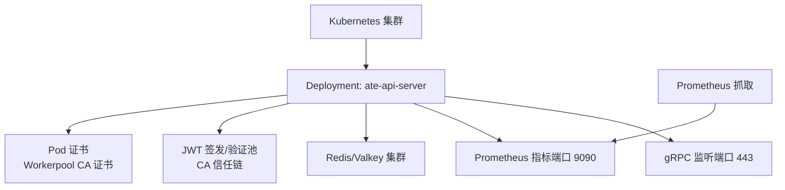
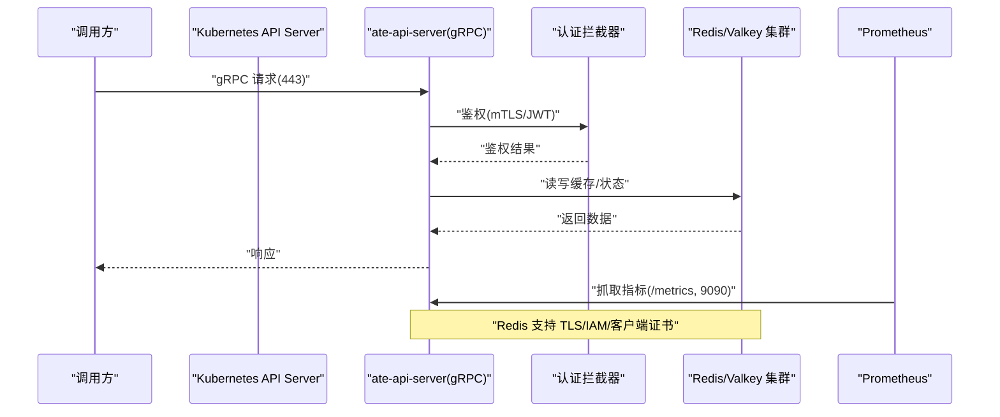
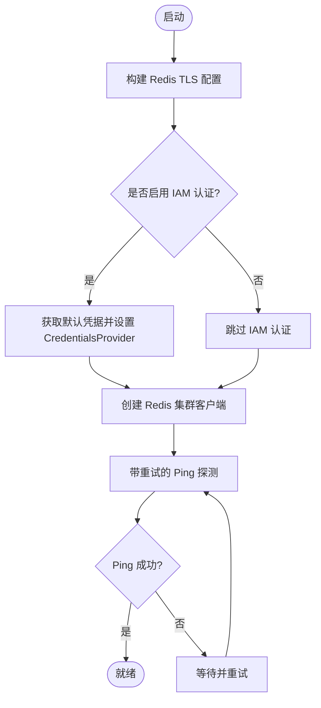
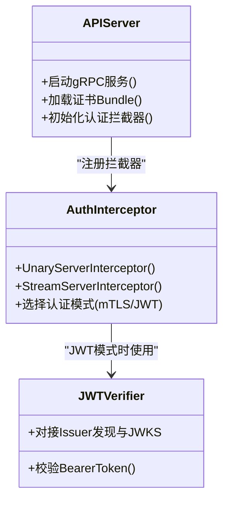
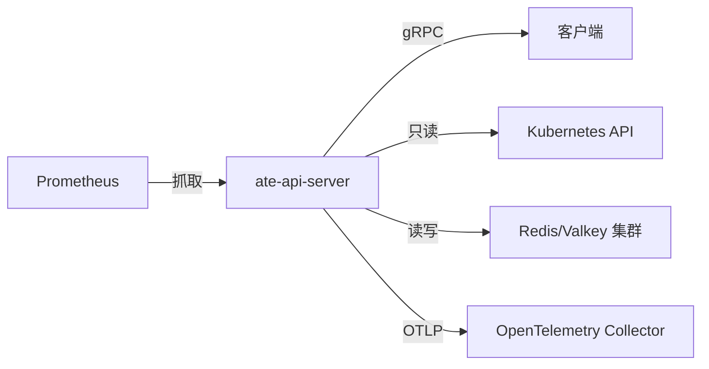

# API服务器配置

<cite>
**本文引用的文件**   
- [ate-api-server.yaml](file://manifests/ate-install/ate-api-server.yaml)
- [main.go](file://cmd/ateapi/main.go)
- [server.go](file://internal/ateapiauth/server.go)
- [credbundle.go](file://cmd/ateapi/internal/credbundle/credbundle.go)
- [prometheus.yaml](file://manifests/ate-install/kind/prometheus.yaml)
- [kustomization.yaml](file://manifests/ate-install/jwt/kustomization.yaml)
- [kustomization.yaml](file://manifests/ate-install/kind-jwt/kustomization.yaml)
</cite>

## 目录
1. [简介](#简介)
2. [项目结构](#项目结构)
3. [核心组件](#核心组件)
4. [架构总览](#架构总览)
5. [详细组件分析](#详细组件分析)
6. [依赖关系分析](#依赖关系分析)
7. [性能考虑](#性能考虑)
8. [故障排查指南](#故障排查指南)
9. [结论](#结论)
10. [附录](#附录)

## 简介
本文件聚焦于 ate-api-server 组件在 Kubernetes 中的清单与运行时配置，系统性说明以下关键点：
- RBAC（ClusterRole、ClusterRoleBinding）与服务账户（ServiceAccount）的权限边界
- Deployment 的资源定义与环境变量注入方式
- gRPC 服务监听地址与 TLS 证书挂载
- Redis/Valkey 集群连接配置（含 IAM 认证、TLS、客户端证书）
- JWT 认证模式与相关参数
- 健康检查探针与 Prometheus 监控集成
- 存储卷挂载最佳实践
- 常见问题排查方法与性能调优建议

## 项目结构
与 ate-api-server 相关的清单与代码主要分布在以下位置：
- 安装清单：manifests/ate-install/ate-api-server.yaml
- 程序入口与启动逻辑：cmd/ateapi/main.go
- 认证拦截器实现：internal/ateapiauth/server.go
- 证书包解析工具：cmd/ateapi/internal/credbundle/credbundle.go
- Prometheus 抓取示例：manifests/ate-install/kind/prometheus.yaml
- JWT 模式补丁：manifests/ate-install/jwt/kustomization.yaml、manifests/ate-install/kind-jwt/kustomization.yaml

图表来源
- [ate-api-server.yaml:58-201](file://manifests/ate-install/ate-api-server.yaml#L58-L201)
- [main.go:182-206](file://cmd/ateapi/main.go#L182-L206)

章节来源
- [ate-api-server.yaml:1-201](file://manifests/ate-install/ate-api-server.yaml#L1-L201)
- [main.go:1-206](file://cmd/ateapi/main.go#L1-L206)

## 核心组件
- 权限与身份
  - ClusterRole 仅授予对 Pod 及自定义资源（ActorTemplates、WorkerPools、SandboxConfigs）的只读访问。
  - ServiceAccount 绑定到该 ClusterRole，确保最小权限原则。
- 部署与网络
  - Deployment 暴露 gRPC 443 端口与 Prometheus 9090 端口。
  - Service 将内部 ClusterIP 暴露为 ate-system/api:443。
- 外部依赖
  - Redis/Valkey 集群：支持 TLS、可选 IAM 认证、可选客户端证书。
  - JWT：支持 mTLS 或 JWT 两种认证模式；JWT 模式下需配置 Issuer/Audience 以及会话 ID 签名密钥池与 CA 池。
- 可观测性
  - 通过注解启用 Prometheus 抓取；提供 /readyz 健康端点。
  - OpenTelemetry 追踪导出至 OTLP Collector。

章节来源
- [ate-api-server.yaml:16-201](file://manifests/ate-install/ate-api-server.yaml#L16-L201)
- [main.go:56-77](file://cmd/ateapi/main.go#L56-L77)
- [main.go:182-206](file://cmd/ateapi/main.go#L182-L206)

## 架构总览
下图展示了 ate-api-server 在集群中的关键交互：RBAC 授权、gRPC 服务端、Redis 持久化、JWT 校验、证书挂载与监控采集。

图表来源
- [main.go:182-206](file://cmd/ateapi/main.go#L182-L206)
- [server.go:81-129](file://internal/ateapiauth/server.go#L81-L129)
- [main.go:248-331](file://cmd/ateapi/main.go#L248-L331)
- [prometheus.yaml:64-110](file://manifests/ate-install/kind/prometheus.yaml#L64-L110)

## 详细组件分析

### 权限与身份（ClusterRole、ClusterRoleBinding、ServiceAccount）
- ClusterRole 仅包含必要的只读操作：
  - 核心资源 pods：get/watch/list
  - 自定义资源 actortemplates、workerpools、sandboxconfigs：get/watch/list
- ServiceAccount 限定在 ate-system 命名空间，避免跨命名空间越权。
- ClusterRoleBinding 将 SA 与 CR 绑定，作用域为集群。

注意：清单中明确未授予 Secret 的集群级读取权限，各租户/演示应通过命名空间级别的 Role + RoleBinding 针对具体 Secret 进行细粒度授权。

章节来源
- [ate-api-server.yaml:16-56](file://manifests/ate-install/ate-api-server.yaml#L16-L56)

### 服务账户与 RBAC 绑定
- ServiceAccount 名称与命名空间与 Deployment 中 serviceAccountName 一致。
- ClusterRoleBinding 使用 roleRef 指向同名 ClusterRole。

章节来源
- [ate-api-server.yaml:37-56](file://manifests/ate-install/ate-api-server.yaml#L37-L56)

### Deployment 资源定义与环境变量
- 副本数：默认 1（可按需水平扩展）。
- 容器镜像：使用 ko 构建产物路径。
- 启动参数（args）：
  - --grpc-listen-addr=0.0.0.0:443
  - --grpc-server-cred-bundle=/run/servicedns.podcert.ate.dev/credential-bundle.pem
  - --redis-cluster-address=@env
  - --redis-ca-certs=/etc/valkey-ca/ca.crt
  - --redis-use-iam-auth=@env
  - --redis-tls-server-name=@env
  - --redis-client-cert=@env
  - --client-jwt-issuer=@env
  - --client-jwt-audience=api.ate-system.svc
  - --session-id-jwt-pool=/run/session-id-jwt-pool/pool.json
  - --session-id-ca-pool=/run/session-id-ca-pool/pool.json
  - --workerpool-ca-certs=/run/workerpool-ca-certs/trust-bundle.pem
- 环境变量（env/envFrom）：
  - POD_NAME/POD_NAMESPACE/POD_UID 用于 OTEL 资源属性。
  - OTEL_EXPORTER_OTLP_ENDPOINT 指向 OTLP Collector。
  - envFrom 引用可选 ConfigMap（name: ate-api-server-envvars），用于覆盖 @env 占位符对应的值。

@env 机制：当参数值为 @env 时，程序会从指定环境变量读取实际值，便于不同开发者在不修改清单的情况下定制 Redis/JWT 等配置。

章节来源
- [ate-api-server.yaml:78-133](file://manifests/ate-install/ate-api-server.yaml#L78-L133)
- [main.go:208-228](file://cmd/ateapi/main.go#L208-L228)

### gRPC 服务监听地址与 TLS 证书挂载
- 监听地址：由 --grpc-listen-addr 控制，默认 :443；清单设置为 0.0.0.0:443。
- 服务端证书：
  - 通过 --grpc-server-cred-bundle 指定“凭证包”文件路径。
  - 该文件由 Pod 证书机制动态生成并挂载到 /run/servicedns.podcert.ate.dev/credential-bundle.pem。
  - 程序在启动时加载该 bundle，构造 gRPC TransportCredentials，并可选择性启用客户端证书校验（基于 workerpool CA）。
- 端口映射：容器端口 443 对外暴露，Service 映射为 ate-system/api:443。

章节来源
- [ate-api-server.yaml:82-84](file://manifests/ate-install/ate-api-server.yaml#L82-L84)
- [ate-api-server.yaml:145-151](file://manifests/ate-install/ate-api-server.yaml#L145-L151)
- [main.go:165-170](file://cmd/ateapi/main.go#L165-L170)
- [main.go:351-373](file://cmd/ateapi/main.go#L351-L373)
- [credbundle.go:41-92](file://cmd/ateapi/internal/credbundle/credbundle.go#L41-L92)

### Redis/Valkey 集群连接配置
- 集群地址：--redis-cluster-address，支持从环境变量注入（@env）。
- TLS 根证书：--redis-ca-certs 指定 CA 文件路径。
- 主机名校验：--redis-tls-server-name 指定 SNI/ServerName。
- 客户端证书：--redis-client-cert 指定客户端证书/私钥 bundle。
- IAM 认证：--redis-use-iam-auth 开启后，程序会尝试获取默认凭据并作为 Redis 访问令牌。
- 连接重试：启动时会多次 Ping Redis，失败则等待并重试，直至成功或超时。

图表来源
- [main.go:248-331](file://cmd/ateapi/main.go#L248-L331)

章节来源
- [main.go:248-331](file://cmd/ateapi/main.go#L248-L331)

### JWT 认证配置
- 认证模式：
  - mTLS（默认）：基于传输层双向 TLS 进行身份识别。
  - JWT：要求每个 RPC 携带有效的 Bearer Token，并由服务端根据 Issuer/Audience 校验。
- 关键参数：
  - --auth-mode：mtls 或 jwt。
  - --client-jwt-issuer：客户端 JWT 的期望签发者。
  - --client-jwt-audience：客户端 JWT 的期望受众。
  - --session-id-jwt-pool：会话 ID JWT 签发密钥池文件。
  - --session-id-ca-pool：会话 ID JWT 签发 CA 信任池文件。
  - --workerpool-ca-certs：用于校验 WorkerPool 客户端证书的 CA 集合。
- 在 kind-jwt 与 jwt 的 Kustomize 补丁中，会将 --auth-mode 切换为 jwt，并为其他组件注入 token 文件路径以配合 JWT 模式。

图表来源
- [main.go:171-196](file://cmd/ateapi/main.go#L171-L196)
- [server.go:81-129](file://internal/ateapiauth/server.go#L81-L129)
- [kustomization.yaml:27-38](file://manifests/ate-install/jwt/kustomization.yaml#L27-L38)
- [kustomization.yaml:29-32](file://manifests/ate-install/kind-jwt/kustomization.yaml#L29-L32)

章节来源
- [main.go:56-77](file://cmd/ateapi/main.go#L56-L77)
- [main.go:171-196](file://cmd/ateapi/main.go#L171-L196)
- [server.go:81-129](file://internal/ateapiauth/server.go#L81-L129)
- [kustomization.yaml:27-38](file://manifests/ate-install/jwt/kustomization.yaml#L27-L38)
- [kustomization.yaml:29-32](file://manifests/ate-install/kind-jwt/kustomization.yaml#L29-L32)

### 健康检查探针
- ReadinessProbe：HTTP GET /readyz，端口 9090，初始延迟 5s，周期 2s。
- 指标服务：metrics 服务同时暴露 /readyz 能力，便于编排系统判断就绪状态。

章节来源
- [ate-api-server.yaml:138-143](file://manifests/ate-install/ate-api-server.yaml#L138-L143)
- [main.go:198-201](file://cmd/ateapi/main.go#L198-L201)

### Prometheus 监控集成
- 通过 Pod 注解启用抓取：
  - prometheus.io/scrape: "true"
  - prometheus.io/port: "9090"
- Prometheus 抓取配置示例：
  - 基于 kubernetes_sd_configs 发现 Pod，按注解过滤与重标记。
  - 目标命名空间包含 ate-system 与 otel-system。

章节来源
- [ate-api-server.yaml:73-76](file://manifests/ate-install/ate-api-server.yaml#L73-L76)
- [prometheus.yaml:64-110](file://manifests/ate-install/kind/prometheus.yaml#L64-L110)

### 存储卷挂载与证书管理
- 服务 DNS Pod 证书：
  - 使用 projected volumes 的 podCertificate 源，自动签发并挂载 credential-bundle.pem。
- 会话 ID JWT 签发池：
  - secret 投影，挂载 pool.json。
- Valkey CA 证书：
  - secret 投影，挂载 ca.crt。
- 会话 ID CA 信任池：
  - secret 投影，挂载 pool.json。
- Workerpool CA 证书：
  - clusterTrustBundle 投影，按标签选择器选择 live 版本。

最佳实践要点
- 所有敏感文件均通过 projected volume 挂载，避免硬编码。
- 证书与密钥文件设为只读，降低误写风险。
- 使用 labelSelector 精准选择证书版本，避免滚动更新时的不一致。

章节来源
- [ate-api-server.yaml:145-184](file://manifests/ate-install/ate-api-server.yaml#L145-L184)

## 依赖关系分析
- 外部依赖
  - Redis/Valkey：高可用集群，支持 TLS、IAM、客户端证书。
  - Kubernetes API：读取 Pod 与自定义资源（只读）。
  - OTLP Collector：接收追踪数据。
  - Prometheus：抓取指标。
- 内部模块
  - 认证拦截器：统一处理 mTLS/JWT 鉴权。
  - 证书解析：解析 Pod 证书 bundle 与 CA 池。

图表来源
- [main.go:182-206](file://cmd/ateapi/main.go#L182-L206)
- [main.go:248-331](file://cmd/ateapi/main.go#L248-L331)
- [prometheus.yaml:64-110](file://manifests/ate-install/kind/prometheus.yaml#L64-L110)

章节来源
- [main.go:182-206](file://cmd/ateapi/main.go#L182-L206)
- [main.go:248-331](file://cmd/ateapi/main.go#L248-L331)
- [prometheus.yaml:64-110](file://manifests/ate-install/kind/prometheus.yaml#L64-L110)

## 性能考虑
- 连接与重试
  - Redis 连接采用带重试的 Ping 策略，有助于在集群不稳定时提升启动成功率。
- 指标与追踪
  - 合理设置 Prometheus scrape_interval 与超时，避免过度抓取造成负载。
  - 使用 OTLP 上报追踪，结合采样策略平衡可观测性与开销。
- 资源限制
  - 为容器设置合理的 CPU/Memory requests/limits，保障调度与稳定性。
- 水平扩展
  - 在无状态前提下，可通过增加 Deployment replicas 提升吞吐；注意 Redis 集群容量与连接数上限。

[本节为通用指导，不直接分析具体文件]

## 故障排查指南
- gRPC 无法连接
  - 确认监听地址与端口（443）是否正确，且 Service 已正确映射。
  - 检查服务端证书 bundle 是否挂载成功，路径与内容是否符合预期。
- Redis 连接失败
  - 检查 --redis-cluster-address 是否可达，TLS CA 与 ServerName 是否匹配。
  - 若启用 IAM 认证，确认工作负载具备相应凭据与权限。
  - 查看启动日志中的重试信息，定位首次连通失败原因。
- JWT 认证失败
  - 核对 --client-jwt-issuer 与 --client-jwt-audience 是否与客户端签发一致。
  - 在 JWT 模式下，确认会话 ID 签发密钥池与 CA 池文件存在且可读。
  - 参考 Kustomize 补丁，确认 auth-mode 与其他组件的 token 文件路径配置一致。
- 健康检查异常
  - 确认 /readyz 端点在 9090 端口可访问，探针参数（initialDelaySeconds、periodSeconds）合理。
- Prometheus 未抓取
  - 确认 Pod 注解 prometheus.io/scrape 与 prometheus.io/port 正确。
  - 检查 Prometheus 抓取配置的目标命名空间与 relabel 规则。

章节来源
- [ate-api-server.yaml:138-143](file://manifests/ate-install/ate-api-server.yaml#L138-L143)
- [main.go:248-331](file://cmd/ateapi/main.go#L248-L331)
- [kustomization.yaml:27-38](file://manifests/ate-install/jwt/kustomization.yaml#L27-L38)
- [kustomization.yaml:29-32](file://manifests/ate-install/kind-jwt/kustomization.yaml#L29-L32)
- [prometheus.yaml:64-110](file://manifests/ate-install/kind/prometheus.yaml#L64-L110)

## 结论
ate-api-server 的 Kubernetes 清单遵循最小权限与安全最佳实践：通过 RBAC 限权、ServiceAccount 隔离、证书与密钥的受控挂载、mTLS/JWT 双模式认证、以及完善的健康检查与监控集成，提供了稳定可靠的 gRPC 服务运行环境。在生产环境中，建议结合业务规模调整副本数与资源配额，完善 Redis 集群容量规划，并确保证书轮换与审计流程完备。

[本节为总结性内容，不直接分析具体文件]

## 附录
- 常用环境变量与参数对照
  - Redis 集群地址：ATE_API_REDIS_ADDRESS（对应 --redis-cluster-address=@env）
  - Redis IAM 认证开关：ATE_API_REDIS_USE_IAM_AUTH（对应 --redis-use-iam-auth=@env）
  - Redis TLS ServerName：ATE_API_REDIS_TLS_SERVER_NAME（对应 --redis-tls-server-name=@env）
  - Redis 客户端证书：ATE_API_REDIS_CLIENT_CERT（对应 --redis-client-cert=@env）
  - JWT Issuer：ATE_API_K8SJWT_ISSUER（对应 --client-jwt-issuer=@env）

章节来源
- [main.go:208-228](file://cmd/ateapi/main.go#L208-L228)
- [ate-api-server.yaml:84-92](file://manifests/ate-install/ate-api-server.yaml#L84-L92)
