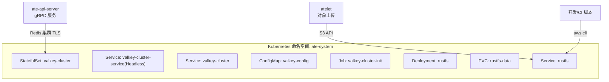
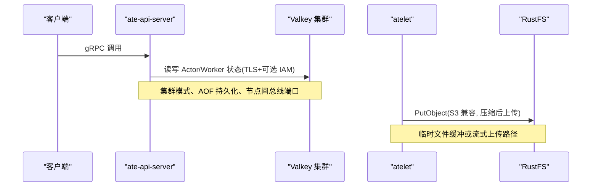
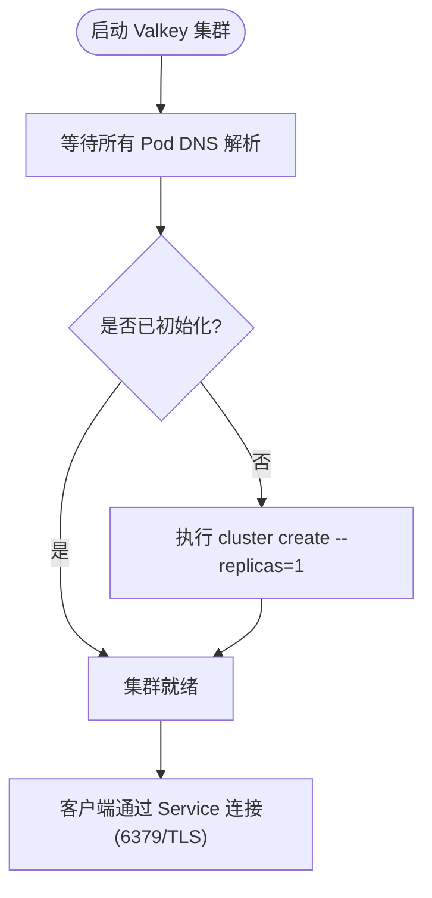
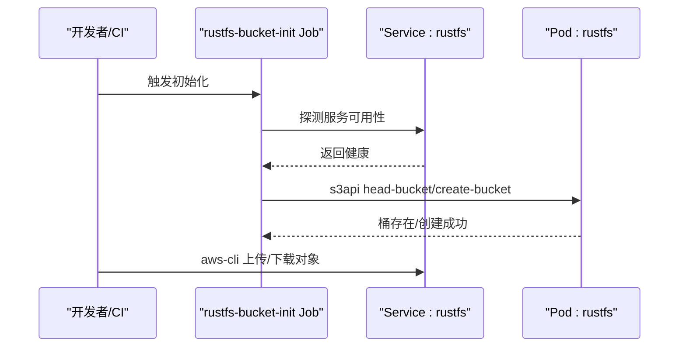
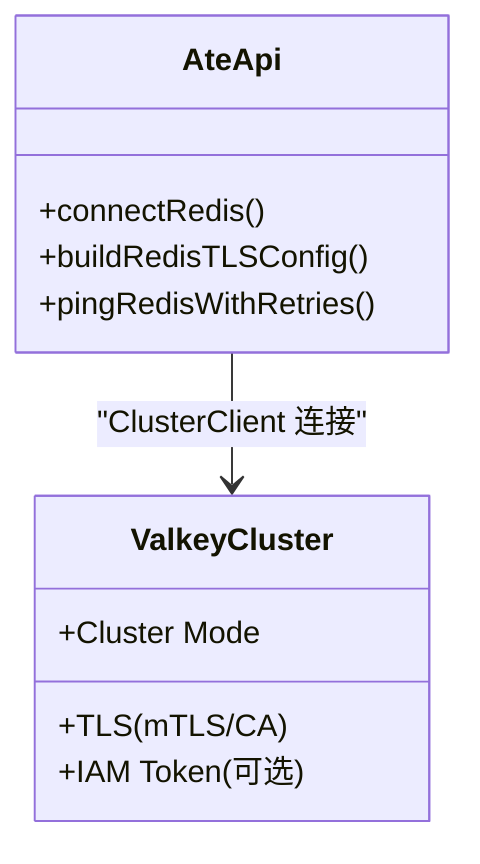
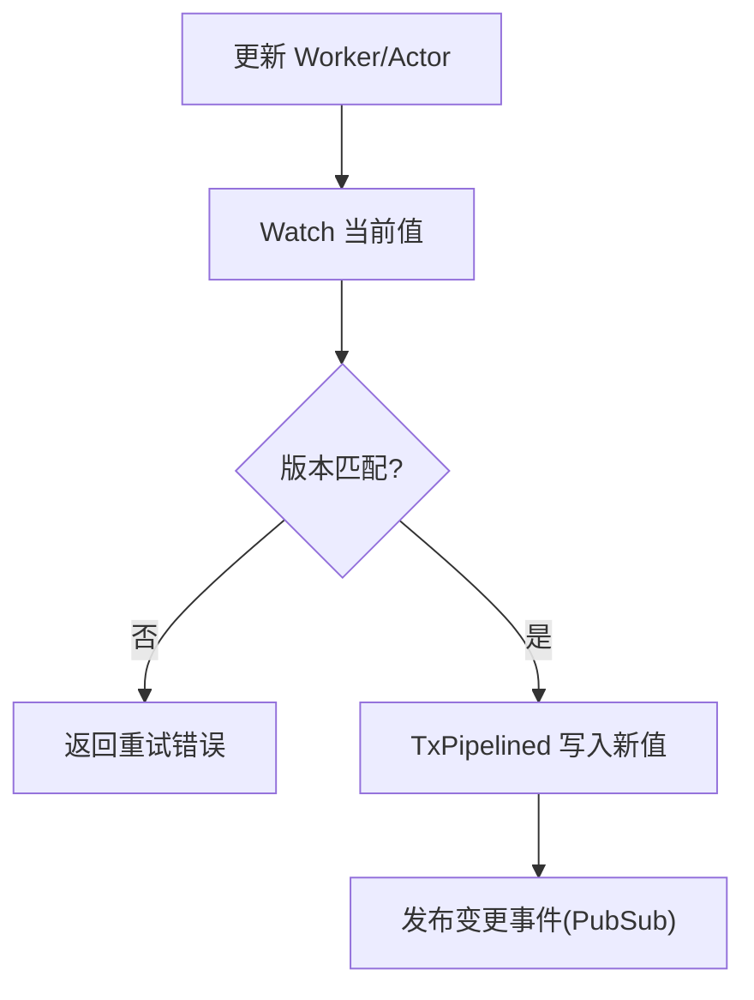
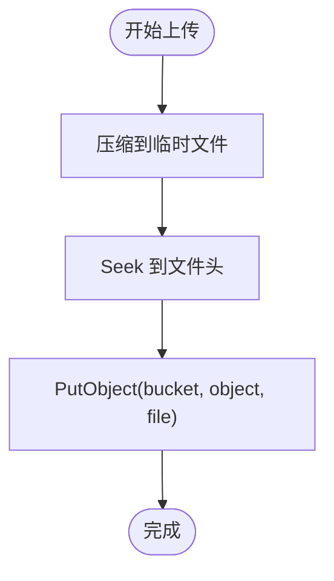
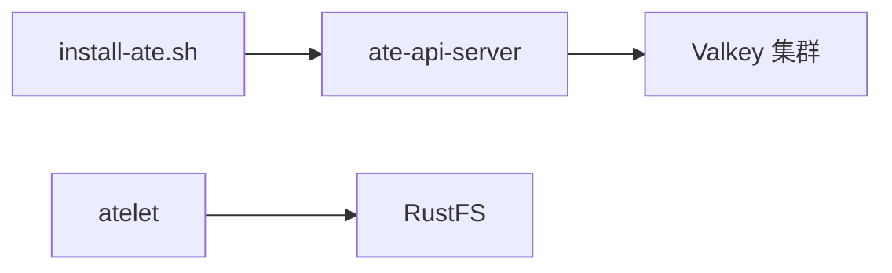

# 存储组件配置

<cite>
**本文引用的文件**   
- [valkey.yaml](file://manifests/ate-install/valkey.yaml)
- [rustfs.yaml](file://manifests/ate-install/kind/rustfs.yaml)
- [main.go](file://cmd/ateapi/main.go)
- [ateredis.go](file://cmd/ateapi/internal/store/ateredis/ateredis.go)
- [objects.go](file://cmd/atelet/internal/ategcs/objects.go)
- [stage-to-rustfs.sh](file://hack/microvm-assets/stage-to-rustfs.sh)
- [install-ate.sh](file://hack/install-ate.sh)
- [valkey-direct-access.md](file://docs/dev/valkey-direct-access.md)
</cite>

## 目录
1. [简介](#简介)
2. [项目结构](#项目结构)
3. [核心组件](#核心组件)
4. [架构总览](#架构总览)
5. [详细组件分析](#详细组件分析)
6. [依赖关系分析](#依赖关系分析)
7. [性能与容量规划](#性能与容量规划)
8. [监控与可观测性](#监控与可观测性)
9. [故障转移与高可用](#故障转移与高可用)
10. [备份与恢复](#备份与恢复)
11. [排障指南](#排障指南)
12. [结论](#结论)

## 简介
本文件面向生产环境，系统性说明存储组件的 Kubernetes 清单配置与运维要点，覆盖：
- Valkey（Redis 兼容）缓存服务：集群模式、TLS 安全、持久化、初始化流程、客户端连接与安全。
- RustFS 对象存储：部署、S3 兼容访问、存储桶管理、访问密钥与权限控制。
- 高可用、数据备份恢复、容量规划、性能调优、监控指标收集与故障转移等生产级实践。

## 项目结构
与存储相关的核心清单位于 manifests 目录，配套脚本与文档在 hack 与 docs 下。

图表来源
- [valkey.yaml:1-227](file://manifests/ate-install/valkey.yaml#L1-L227)
- [rustfs.yaml:1-134](file://manifests/ate-install/kind/rustfs.yaml#L1-L134)

章节来源
- [valkey.yaml:1-227](file://manifests/ate-install/valkey.yaml#L1-L227)
- [rustfs.yaml:1-134](file://manifests/ate-install/kind/rustfs.yaml#L1-L134)

## 核心组件
- Valkey（Redis 兼容）
  - 以 StatefulSet 部署 6 副本，启用集群模式与 TLS，使用 Headless Service 暴露节点 DNS，并通过普通 Service 提供统一入口。
  - 通过 Job 等待所有 Pod DNS 解析后，执行 cluster create，自动分配槽位并设置副本数。
  - 每个 Pod 挂载独立 PVC，开启 appendonly 持久化。
- RustFS（S3 兼容对象存储）
  - 以 Deployment 单副本运行，监听 9000（API）与 9001（Console），挂载 PVC 作为后端存储。
  - 通过 Job 使用 aws-cli 创建默认存储桶（如 ate-snapshots）。
  - 支持 S3 协议访问，便于与现有生态集成。

章节来源
- [valkey.yaml:15-149](file://manifests/ate-install/valkey.yaml#L15-L149)
- [rustfs.yaml:15-134](file://manifests/ate-install/kind/rustfs.yaml#L15-L134)

## 架构总览
Valkey 作为 ate-api-server 的状态存储，RustFS 作为 atelet 的对象存储后端。两者均通过 Kubernetes Service 暴露，且采用 TLS 与证书注入保障通信安全。

图表来源
- [main.go:248-331](file://cmd/ateapi/main.go#L248-L331)
- [valkey.yaml:73-149](file://manifests/ate-install/valkey.yaml#L73-L149)
- [objects.go:183-212](file://cmd/atelet/internal/ategcs/objects.go#L183-L212)
- [rustfs.yaml:44-92](file://manifests/ate-install/kind/rustfs.yaml#L44-L92)

## 详细组件分析

### Valkey（Redis 兼容）缓存服务
- 集群与网络
  - 启用集群模式，节点超时时间、集群配置文件、AOF 持久化开关均已配置。
  - 使用 Headless Service 暴露各 Pod 的稳定 DNS，同时提供普通 Service 作为客户端入口。
  - 容器启动时动态追加 announce 信息，确保集群发现使用 hostname。
- 安全与认证
  - 强制 TLS，禁用明文端口；加载证书与 CA，支持客户端双向认证与证书自动重载。
  - 客户端侧支持自定义 CA、ServerName 校验与 mTLS 客户端证书；可选 Google IAM 令牌认证。
- 持久化
  - 每个 Pod 通过 volumeClaimTemplates 申请 RWO 卷，数据目录 /data，开启 appendonly。
- 初始化流程
  - Job 等待所有 Pod DNS 解析，检查是否已初始化，未初始化则执行 cluster create 并设置副本数。
- 客户端连接
  - 构建 ClusterClient，支持 TLS、IAM 令牌源注入，带重试 Ping 以确保就绪。

图表来源
- [valkey.yaml:150-227](file://manifests/ate-install/valkey.yaml#L150-L227)

章节来源
- [valkey.yaml:15-149](file://manifests/ate-install/valkey.yaml#L15-L149)
- [valkey.yaml:150-227](file://manifests/ate-install/valkey.yaml#L150-L227)
- [main.go:248-331](file://cmd/ateapi/main.go#L248-L331)
- [main.go:287-314](file://cmd/ateapi/main.go#L287-L314)
- [install-ate.sh:225-227](file://hack/install-ate.sh#L225-L227)
- [valkey-direct-access.md:1-11](file://docs/dev/valkey-direct-access.md#L1-L11)

### RustFS 对象存储
- 部署与服务
  - Deployment 单副本，监听 9000（API）、9001（Console），通过 ClusterIP Service 暴露。
  - 使用 PVC 提供持久化存储，容器以非 root 用户运行。
- 初始化与桶管理
  - 通过 Job 使用 aws-cli 轮询等待服务就绪，若目标桶不存在则创建。
- 访问与权限
  - 通过环境变量配置访问密钥（Access Key/Secret Key），S3 兼容接口供 atelet 与外部工具使用。
- 典型用法
  - 开发/CI 可通过 port-forward 本地访问，或使用 aws-cli 指定 endpoint 进行上传/列举等操作。

图表来源
- [rustfs.yaml:93-134](file://manifests/ate-install/kind/rustfs.yaml#L93-L134)
- [stage-to-rustfs.sh:34-57](file://hack/microvm-assets/stage-to-rustfs.sh#L34-L57)

章节来源
- [rustfs.yaml:15-134](file://manifests/ate-install/kind/rustfs.yaml#L15-L134)
- [stage-to-rustfs.sh:34-57](file://hack/microvm-assets/stage-to-rustfs.sh#L34-L57)

### ate-api-server 与 Valkey 的连接与安全
- 参数与环境变量
  - 支持通过命令行参数与环境变量注入集群地址、CA 证书、ServerName、客户端证书以及是否启用 IAM 认证。
- TLS 与认证
  - 最小 TLS 版本为 1.2；支持自定义 CA、ServerName 校验与 mTLS 客户端证书。
  - 可选启用 Google IAM 令牌作为 Redis/Valkey 的认证凭据。
- 连接建立
  - 构造 ClusterOptions，注入 TLS 与可选 CredentialsProvider，创建 ClusterClient 并带重试 Ping。

图表来源
- [main.go:56-77](file://cmd/ateapi/main.go#L56-L77)
- [main.go:248-331](file://cmd/ateapi/main.go#L248-L331)
- [main.go:287-314](file://cmd/ateapi/main.go#L287-L314)

章节来源
- [main.go:56-77](file://cmd/ateapi/main.go#L56-L77)
- [main.go:248-331](file://cmd/ateapi/main.go#L248-L331)
- [main.go:287-314](file://cmd/ateapi/main.go#L287-L314)

### ateredis 存储层与集群约束
- 数据模型与键空间
  - Actor/Worker/Atespace 均以 JSON 序列化存储于特定键空间，遵循 Redis Lua 与集群槽位限制。
- 事务与一致性
  - 使用 Watch/Pipelined 实现乐观锁更新；对跨槽位的原子操作需避免。
- 分页扫描
  - 基于 SCAN 的分页遍历，按主节点排序并记录游标，保证跨分片稳定分页。
- 分布式锁
  - 基于 SETNX 与 Lua 脚本实现加锁/释放。

图表来源
- [ateredis.go:408-466](file://cmd/ateapi/internal/store/ateredis/ateredis.go#L408-L466)
- [ateredis.go:523-584](file://cmd/ateapi/internal/store/ateredis/ateredis.go#L523-L584)
- [ateredis.go:649-702](file://cmd/ateapi/internal/store/ateredis/ateredis.go#L649-L702)
- [ateredis.go:770-792](file://cmd/ateapi/internal/store/ateredis/ateredis.go#L770-L792)

章节来源
- [ateredis.go:1-800](file://cmd/ateapi/internal/store/ateredis/ateredis.go#L1-L800)

### atelet 对象上传路径
- 上传策略
  - 对于需要 seekable body 的后端（S3/RustFS），先将内容压缩到临时文件，再发起 PutObject。
  - 日志包含稀疏/填充字节统计与耗时，便于定位性能瓶颈。

图表来源
- [objects.go:183-212](file://cmd/atelet/internal/ategcs/objects.go#L183-L212)

章节来源
- [objects.go:183-212](file://cmd/atelet/internal/ategcs/objects.go#L183-L212)

## 依赖关系分析
- ate-api-server 依赖 Valkey 集群（TLS + 可选 IAM），用于 Actor/Worker 状态存储。
- atelet 依赖 RustFS（S3 兼容），用于镜像/快照等对象存储。
- 安装脚本将 Valkey 地址与 TLS ServerName 注入到 ate-api-server 的参数中。

图表来源
- [install-ate.sh:225-227](file://hack/install-ate.sh#L225-L227)
- [main.go:248-331](file://cmd/ateapi/main.go#L248-L331)
- [rustfs.yaml:44-92](file://manifests/ate-install/kind/rustfs.yaml#L44-L92)

章节来源
- [install-ate.sh:225-227](file://hack/install-ate.sh#L225-L227)
- [main.go:248-331](file://cmd/ateapi/main.go#L248-L331)
- [rustfs.yaml:44-92](file://manifests/ate-install/kind/rustfs.yaml#L44-L92)

## 性能与容量规划
- Valkey
  - 集群规模：默认 6 副本，建议根据热点与吞吐评估分片数量与副本数。
  - 持久化：appendonly 开启，注意磁盘 IO 与延迟；结合 SSD 与合适的 IOPS。
  - 内存：合理设置 maxmemory 与淘汰策略，避免 OOM；关注大 key 与热 key。
  - 网络：启用 TLS 会带来 CPU 开销，建议在高配节点运行。
- RustFS
  - 单副本适合开发与测试；生产建议多副本与外部对象存储（如云厂商 S3/GCS）。
  - 存储介质：选择低延迟、高吞吐的块存储；监控 PVC 使用率与扩容阈值。
  - 上传路径：压缩与临时文件会占用磁盘与 CPU，可按负载调整并发与缓冲区大小。

[本节为通用指导，不直接分析具体文件]

## 监控与可观测性
- 指标与追踪
  - ate-api-server 内置 Prometheus 指标与 OpenTelemetry 追踪，可在 metrics 端口采集。
- 关键指标建议
  - Valkey：连接数、命令延迟、命中率、内存使用、持久化落盘延迟、集群槽位分布。
  - RustFS：请求 QPS、延迟、错误率、对象大小分布、PVC 使用率。
- 告警建议
  - 连接失败、TLS 握手错误、集群节点不可用、PVC 使用率超阈、上传失败率上升。

[本节为通用指导，不直接分析具体文件]

## 故障转移与高可用
- Valkey
  - 集群模式自带故障转移；确保副本数≥1，节点超时与心跳配置合理。
  - 客户端应支持重连与重试；当前实现包含带退避的重试 Ping。
- RustFS
  - 单副本不具备 HA；生产建议迁移至托管对象存储或多副本方案。
  - 若必须本地部署，考虑多副本 + 外部共享存储或迁移至云对象存储。

章节来源
- [valkey.yaml:36-41](file://manifests/ate-install/valkey.yaml#L36-L41)
- [main.go:316-331](file://cmd/ateapi/main.go#L316-L331)

## 备份与恢复
- Valkey
  - 利用 appendonly 文件与快照机制；定期备份 PVC 数据目录。
  - 灾难恢复：在新集群重建 PVC 并恢复数据，重启 Valkey 即可加载。
- RustFS
  - 使用 S3 兼容工具（如 aws-cli）对桶进行同步/导出；也可对 PVC 做快照。
  - 恢复：将数据导入新桶或挂载到新 PVC，重新初始化桶（若为空）。

[本节为通用指导，不直接分析具体文件]

## 排障指南
- 无法连接 Valkey
  - 检查 TLS 证书与 CA、ServerName 是否正确；确认客户端证书与 IAM 令牌配置。
  - 查看重试日志与连接错误，确认集群是否已初始化。
- RustFS 不可用
  - 检查 Service 与 Pod 状态；确认端口转发或 Endpoint 可达。
  - 使用 aws-cli 验证桶是否存在与权限是否正确。
- 直接调试 Valkey
  - 参考文档中的 valkey-cli 直连方式，注意携带 TLS 与证书参数。

章节来源
- [main.go:287-314](file://cmd/ateapi/main.go#L287-L314)
- [valkey-direct-access.md:1-11](file://docs/dev/valkey-direct-access.md#L1-L11)
- [stage-to-rustfs.sh:34-57](file://hack/microvm-assets/stage-to-rustfs.sh#L34-L57)

## 结论
- Valkey 集群提供了高可用、强一致性的状态存储能力，配合 TLS 与可选 IAM 认证满足生产安全要求。
- RustFS 在开发/测试场景便捷易用，生产建议迁移至托管对象存储以获得更好的可扩展性与可靠性。
- 在生产环境中，应重视容量规划、性能调优、监控告警与备份恢复策略，确保系统稳定与可恢复。
