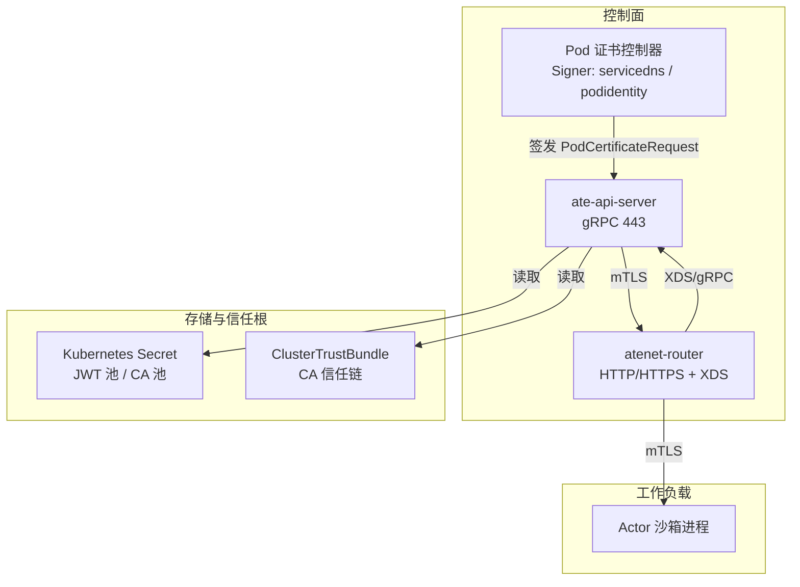
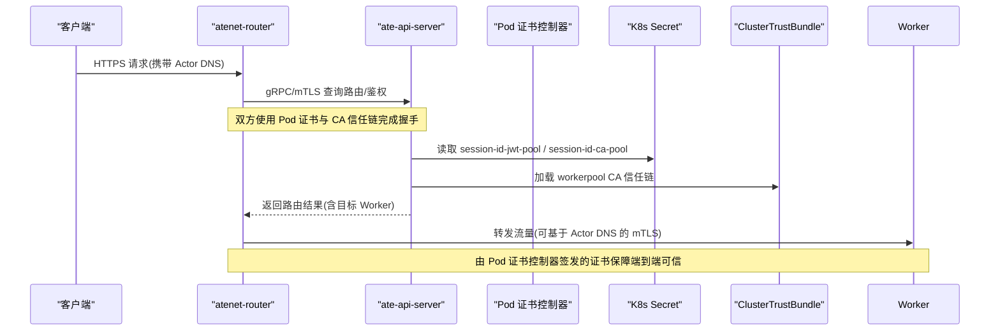
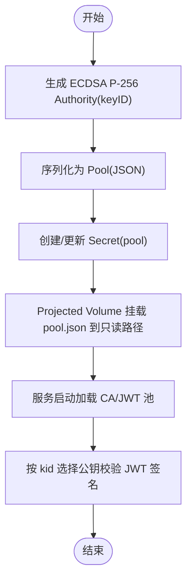
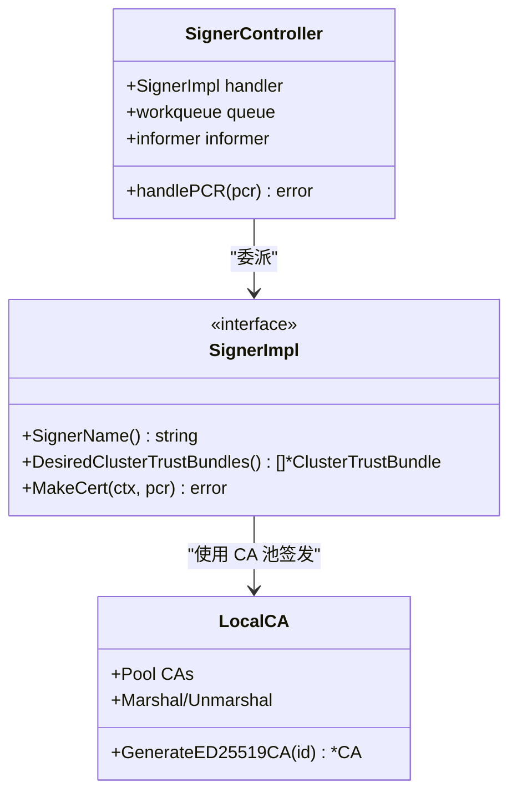
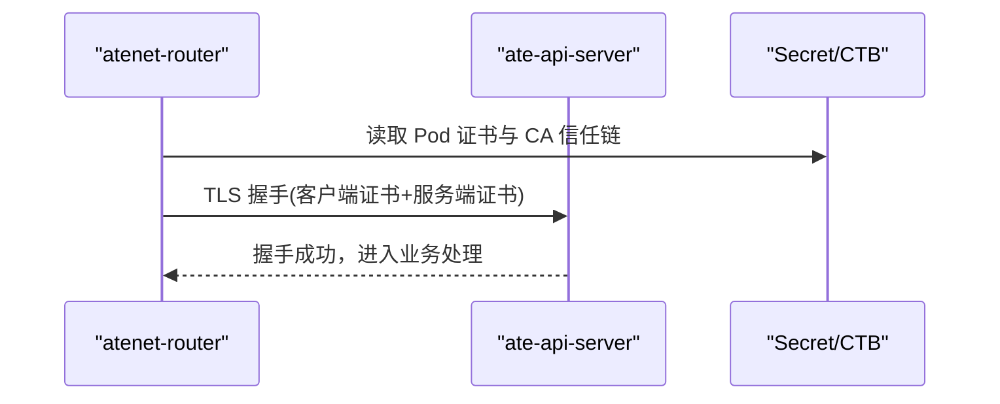
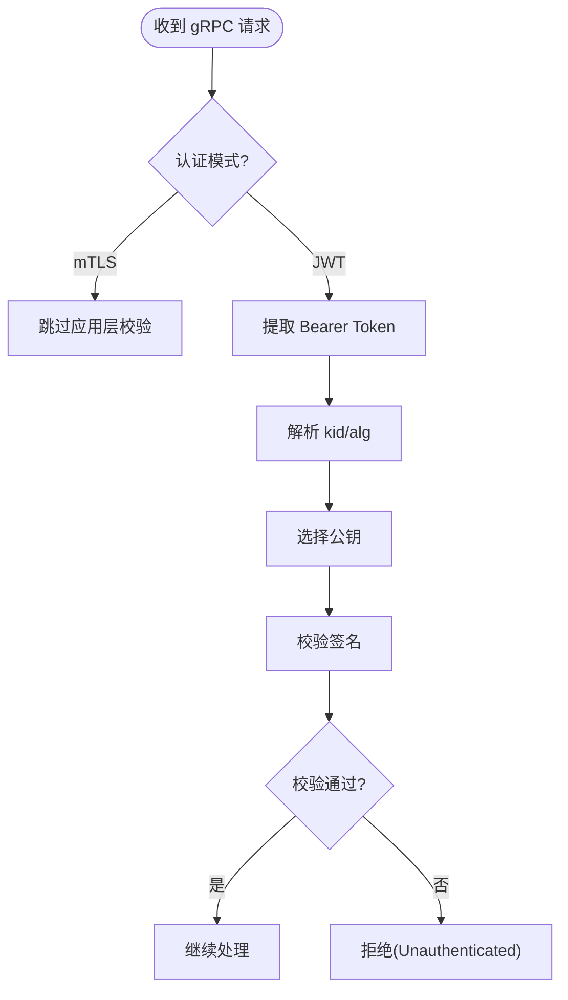
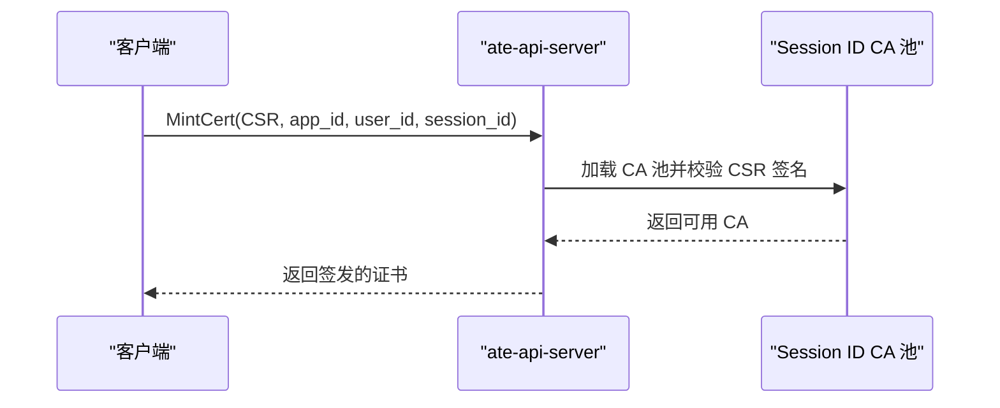
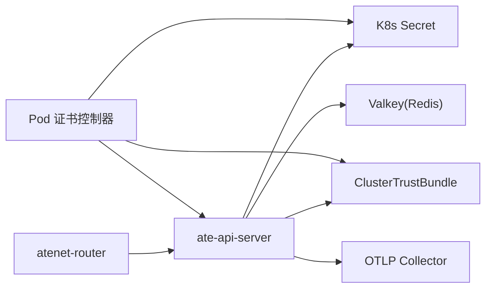

# 安全配置

<cite>
**本文引用的文件**   
- [README.md](file://README.md)
- [ate-api-server.yaml](file://manifests/ate-install/ate-api-server.yaml)
- [atenet-router.yaml](file://manifests/ate-install/atenet-router.yaml)
- [pod-certificate-controller.yaml](file://manifests/ate-install/pod-certificate-controller.yaml)
- [admin_make_jwt_pool.go](file://cmd/kubectl-ate/internal/cmd/admin_make_jwt_pool.go)
- [localca.go](file://internal/localca/localca.go)
- [server.go](file://internal/ateapiauth/server.go)
- [k8sjwt.go](file://cmd/ateapi/internal/k8sjwt/k8sjwt.go)
- [sessionidentity.go](file://cmd/ateapi/internal/sessionidentity/sessionidentity.go)
- [threat-model.md](file://docs/threat-model.md)
</cite>

## 目录
1. [简介](#简介)
2. [项目结构](#项目结构)
3. [核心组件](#核心组件)
4. [架构总览](#架构总览)
5. [详细组件分析](#详细组件分析)
6. [依赖关系分析](#依赖关系分析)
7. [性能与可用性考虑](#性能与可用性考虑)
8. [故障排查指南](#故障排查指南)
9. [结论](#结论)
10. [附录](#附录)

## 简介
本文件聚焦于系统安全相关的 Kubernetes 清单与实现，覆盖以下关键主题：
- JWT 密钥池配置与管理（会话标识签发）
- Pod 证书控制器部署与 CA 证书管理
- mTLS 双向认证在控制面与数据面的落地
- 身份认证与授权、网络安全策略、Secret 管理
- 证书轮换与安全最佳实践
- 多租户隔离、访问控制列表、审计日志等高级安全能力
- 安全漏洞扫描、合规性检查与安全事件响应建议

## 项目结构
从清单与代码层面，安全相关的关键位置如下：
- 控制面 API 服务与网络路由的安全配置位于 manifests/ate-install 下的 ate-api-server.yaml 与 atenet-router.yaml
- Pod 证书控制器与 CA 池挂载位于 pod-certificate-controller.yaml
- JWT 密钥池生成工具位于 cmd/kubectl-ate/internal/cmd/admin_make_jwt_pool.go
- 本地 CA 池序列化/反序列化与 ED25519 CA 生成逻辑位于 internal/localca/localca.go
- gRPC 服务端认证拦截器（mTLS/JWT 模式）位于 internal/ateapiauth/server.go
- K8s SA Bearer Token 校验逻辑位于 cmd/ateapi/internal/k8sjwt/k8sjwt.go
- 会话身份证书签发流程涉及 cmd/ateapi/internal/sessionidentity/sessionidentity.go
- 威胁模型与检测响应建议见 docs/threat-model.md

图表来源
- [ate-api-server.yaml:58-185](file://manifests/ate-install/ate-api-server.yaml#L58-L185)
- [atenet-router.yaml:102-196](file://manifests/ate-install/atenet-router.yaml#L102-L196)
- [pod-certificate-controller.yaml:123-196](file://manifests/ate-install/pod-certificate-controller.yaml#L123-L196)

章节来源
- [README.md:215-225](file://README.md#L215-L225)

## 核心组件
- 控制面 API 服务（ate-api-server）
  - 暴露 gRPC 443，启用 mTLS；支持可选的 JWT 模式（Bearer Token 校验）
  - 挂载 session-id-jwt-pool、session-id-ca-pool、workerpool-ca-certs 等受控卷
  - 通过 ServiceAccount 与 RBAC 最小权限访问集群资源
- 网络路由器（atenet-router）
  - 提供 HTTP/HTTPS 入口，内部通过 Envoy + XDS 动态下发路由
  - 使用 Pod 证书注入 credential-bundle.pem，与 ate-api-server 建立 mTLS
- Pod 证书控制器
  - 提供两个自定义 Signer：servicedns.podcert.ate.dev/* 与 podidentity.podcert.ate.dev/*
  - 将 CA 池以 Secret 形式投影到容器只读卷，避免私钥落盘
- JWT 密钥池
  - 通过 kubectl-ate admin make-jwt-pool 生成并写入 Secret，供控制面验证会话标识
- 本地 CA 池
  - 支持 JSON 序列化/反序列化，ED25519 根 CA 生成，用于会话证书签发与验证

章节来源
- [ate-api-server.yaml:58-185](file://manifests/ate-install/ate-api-server.yaml#L58-L185)
- [atenet-router.yaml:102-196](file://manifests/ate-install/atenet-router.yaml#L102-L196)
- [pod-certificate-controller.yaml:123-196](file://manifests/ate-install/pod-certificate-controller.yaml#L123-L196)
- [admin_make_jwt_pool.go:30-86](file://cmd/kubectl-ate/internal/cmd/admin_make_jwt_pool.go#L30-L86)
- [localca.go:30-192](file://internal/localca/localca.go#L30-L192)
- [server.go:35-129](file://internal/ateapiauth/server.go#L35-L129)

## 架构总览
下图展示了控制面与服务侧的身份与加密链路，以及证书签发与信任分发路径。

图表来源
- [ate-api-server.yaml:144-185](file://manifests/ate-install/ate-api-server.yaml#L144-L185)
- [atenet-router.yaml:186-196](file://manifests/ate-install/atenet-router.yaml#L186-L196)
- [pod-certificate-controller.yaml:149-188](file://manifests/ate-install/pod-certificate-controller.yaml#L149-L188)

## 详细组件分析

### JWT 密钥池配置与会话标识签发
- 生成与注入
  - 使用 kubectl-ate admin make-jwt-pool 生成 ECDSA P-256 密钥对，打包为 Pool 并写入 Secret 的 pool 键
  - 控制面通过 projected volume 将 Secret 中的 pool.json 挂载到只读路径，启动时加载
- 校验流程
  - 服务端根据 JWT header 中的 kid 选择对应公钥进行签名校验，支持 RS256/RS384/RS512 与 ES256 等算法族
- 最佳实践
  - 定期轮换：新增新 keyID 的 Authority 并滚动更新 Secret，旧 Key 保留一段时间以兼容在线令牌
  - 最小权限：仅允许必要组件读取该 Secret，避免泄露
  - 审计：记录签发与校验失败事件，便于溯源

图表来源
- [admin_make_jwt_pool.go:30-86](file://cmd/kubectl-ate/internal/cmd/admin_make_jwt_pool.go#L30-L86)
- [k8sjwt.go:263-294](file://cmd/ateapi/internal/k8sjwt/k8sjwt.go#L263-L294)
- [ate-api-server.yaml:152-159](file://manifests/ate-install/ate-api-server.yaml#L152-L159)

章节来源
- [admin_make_jwt_pool.go:30-86](file://cmd/kubectl-ate/internal/cmd/admin_make_jwt_pool.go#L30-L86)
- [k8sjwt.go:263-294](file://cmd/ateapi/internal/k8sjwt/k8sjwt.go#L263-L294)
- [ate-api-server.yaml:152-159](file://manifests/ate-install/ate-api-server.yaml#L152-L159)

### Pod 证书控制器与 CA 证书管理
- 控制器职责
  - 监听 PodCertificateRequest，按 SignerName 路由至具体实现（如 servicedns / podidentity）
  - 维护 ClusterTrustBundle，作为下游组件的信任根
- 部署要点
  - 通过 Role/ClusterRole 授予最小权限（仅读写必要的 certificates.k8s.io 资源）
  - 使用 Lease 做协调，单副本运行
  - 将 service-dns-ca-pool 与 pod-identity-ca-pool 以 Secret 形式投影为只读卷
- 证书生命周期
  - 按需签发短期证书，结合 Trust Bundle 的 canarying 标签切换新旧根

图表来源
- [pod-certificate-controller.yaml:20-122](file://manifests/ate-install/pod-certificate-controller.yaml#L20-L122)
- [pod-certificate-controller.yaml:149-188](file://manifests/ate-install/pod-certificate-controller.yaml#L149-L188)
- [localca.go:30-192](file://internal/localca/localca.go#L30-L192)

章节来源
- [pod-certificate-controller.yaml:20-122](file://manifests/ate-install/pod-certificate-controller.yaml#L20-L122)
- [pod-certificate-controller.yaml:149-188](file://manifests/ate-install/pod-certificate-controller.yaml#L149-L188)
- [localca.go:30-192](file://internal/localca/localca.go#L30-L192)

### mTLS 双向认证（控制面与数据面）
- 控制面（ate-api-server）
  - 监听 443，启用 mTLS；通过 --grpc-server-cred-bundle 指定证书束
  - 通过 --client-jwt-issuer/--client-jwt-audience 支持可选的 JWT 模式
- 路由器（atenet-router）
  - 通过 Pod 证书注入 credential-bundle.pem，并以 --ateapi-ca-file 指向 CA 信任链
  - 与 ate-api-server 建立 mTLS 通道，确保控制面通信可信
- 数据面（Router -> Actor）
  - 建议使用基于 Actor DNS 的证书进行双向认证，防止误路由与中间人攻击

图表来源
- [ate-api-server.yaml:82-93](file://manifests/ate-install/ate-api-server.yaml#L82-L93)
- [atenet-router.yaml:137-139](file://manifests/ate-install/atenet-router.yaml#L137-L139)
- [atenet-router.yaml:186-196](file://manifests/ate-install/atenet-router.yaml#L186-L196)

章节来源
- [ate-api-server.yaml:82-93](file://manifests/ate-install/ate-api-server.yaml#L82-L93)
- [atenet-router.yaml:137-139](file://manifests/ate-install/atenet-router.yaml#L137-L139)
- [atenet-router.yaml:186-196](file://manifests/ate-install/atenet-router.yaml#L186-L196)

### 身份认证与授权（gRPC 拦截器与 K8s SA）
- 认证模式
  - ModeMTLS：仅依赖传输层 mTLS，不做强应用层校验
  - ModeJWT：要求每个 RPC 携带 K8s SA Bearer Token，并由服务端校验
- 校验细节
  - 解析 JWT header 的 kid，选择对应公钥，执行签名校验（RSA/ECDSA）
- 建议
  - 对外部调用者启用 JWT 模式，配合严格的 audience/issuer 校验
  - 内部组件间优先使用 mTLS，减少密钥暴露面

图表来源
- [server.go:35-129](file://internal/ateapiauth/server.go#L35-L129)
- [k8sjwt.go:263-294](file://cmd/ateapi/internal/k8sjwt/k8sjwt.go#L263-L294)

章节来源
- [server.go:35-129](file://internal/ateapiauth/server.go#L35-L129)
- [k8sjwt.go:263-294](file://cmd/ateapi/internal/k8sjwt/k8sjwt.go#L263-L294)

### 会话身份证书签发（Session Identity）
- 流程概述
  - 客户端提交 CSR，服务端加载 session-id CA 池，校验 CSR 签名后签发证书
  - 证书绑定 app_id/user_id/session_id，增强身份映射的可追溯性
- 注意事项
  - 严格校验 CSR 签名与字段完整性
  - 证书有效期尽量短，结合轮换机制降低泄露风险

图表来源
- [sessionidentity.go:159-189](file://cmd/ateapi/internal/sessionidentity/sessionidentity.go#L159-L189)
- [ate-api-server.yaml:168-175](file://manifests/ate-install/ate-api-server.yaml#L168-L175)

章节来源
- [sessionidentity.go:159-189](file://cmd/ateapi/internal/sessionidentity/sessionidentity.go#L159-L189)
- [ate-api-server.yaml:168-175](file://manifests/ate-install/ate-api-server.yaml#L168-L175)

### 网络安全策略与多租户隔离
- 默认拒绝
  - 使用 NetworkPolicy 默认拒绝跨命名空间/跨工作负载访问，仅显式放行必要端口
- 控制面与数据面隔离
  - 控制面组件不与不可信沙箱同节点部署，避免横向移动
- 多租户
  - 借助 atespace 与命名空间进行逻辑隔离，结合 RBAC 限制跨租户操作
- 访问控制列表
  - 在路由器或网关层实施 L7 ACL，结合 Actor 身份与策略动态下发

章节来源
- [threat-model.md:72-117](file://docs/threat-model.md#L72-L117)

### Secret 管理与证书轮换
- Secret 最小化
  - 仅挂载必要键值，使用 readOnlyRootFilesystem 与只读卷
- 轮换策略
  - 新增新 CA/JWT Key，滚动更新 Secret，设置过渡期容忍旧凭证
  - 使用 ClusterTrustBundle 的 canarying 标签平滑切换信任根
- 审计与告警
  - 对 Secret 变更、证书签发失败、校验失败等事件进行集中采集与告警

章节来源
- [pod-certificate-controller.yaml:175-188](file://manifests/ate-install/pod-certificate-controller.yaml#L175-L188)
- [ate-api-server.yaml:144-185](file://manifests/ate-install/ate-api-server.yaml#L144-L185)

### 审计日志与事件响应
- 审计日志
  - 为所有对外 API 组件开启审计日志，包括快照/GCS 访问与 ateapi 请求
- 威胁检测
  - 集成外部威胁检测系统，收集控制面与节点侧遥测
- 快速处置
  - 支持动态策略更新与隔离，必要时触发快照挂起并标记快照不可恢复

章节来源
- [threat-model.md:134-141](file://docs/threat-model.md#L134-L141)

## 依赖关系分析
- 组件耦合
  - atenet-router 依赖 ate-api-server 的路由与鉴权信息
  - ate-api-server 依赖 Secret/CTB 提供的密钥与信任根
  - Pod 证书控制器依赖 certificates.k8s.io 资源与 Secret/CTB 的读写权限
- 外部依赖
  - Redis（Valkey）用于状态存储，需启用 TLS 与 IAM 认证
  - OpenTelemetry Collector 用于指标与追踪导出

图表来源
- [ate-api-server.yaml:82-118](file://manifests/ate-install/ate-api-server.yaml#L82-L118)
- [atenet-router.yaml:126-139](file://manifests/ate-install/atenet-router.yaml#L126-L139)
- [pod-certificate-controller.yaml:149-188](file://manifests/ate-install/pod-certificate-controller.yaml#L149-L188)

章节来源
- [ate-api-server.yaml:82-118](file://manifests/ate-install/ate-api-server.yaml#L82-L118)
- [atenet-router.yaml:126-139](file://manifests/ate-install/atenet-router.yaml#L126-L139)
- [pod-certificate-controller.yaml:149-188](file://manifests/ate-install/pod-certificate-controller.yaml#L149-L188)

## 性能与可用性考虑
- 证书签发与校验开销
  - 使用 ED25519 与短效证书降低计算与传播成本
- 缓存与限流
  - 在路由器层缓存路由结果，结合速率限制与配额保护后端
- 高可用
  - 控制面组件多副本部署，合理设置探针与优雅退出

[本节为通用指导，无需源码引用]

## 故障排查指南
- 常见问题定位
  - 证书未挂载或路径错误：检查 projected volumes 与 secret/ctb 名称
  - mTLS 握手失败：核对客户端与服务端证书链与 SAN
  - JWT 校验失败：确认 issuer/audience/kid 匹配与公钥可用
- 日志与指标
  - 查看组件 readinessProbe 与 metrics 端口
  - 关注 events 与审计日志，定位异常时间点

章节来源
- [ate-api-server.yaml:138-143](file://manifests/ate-install/ate-api-server.yaml#L138-L143)
- [atenet-router.yaml:118-121](file://manifests/ate-install/atenet-router.yaml#L118-L121)

## 结论
通过在控制面与数据面全面启用 mTLS、引入 Pod 证书控制器与 CA 池管理、采用 JWT 密钥池与会话身份证书，并结合 RBAC、NetworkPolicy、Secret 最小化与审计日志，本系统实现了端到端的强身份与加密通信。配合轮换策略与威胁检测，可在保证低延迟的同时满足生产环境的安全与合规要求。

[本节为总结，无需源码引用]

## 附录
- 参考清单与命令
  - 安装与部署：参见 README 中的 Quickstart 与 GKE 快速开始
  - CLI 工具：kubectl-ate 提供 admin make-jwt-pool 等安全运维命令

章节来源
- [README.md:97-175](file://README.md#L97-L175)
