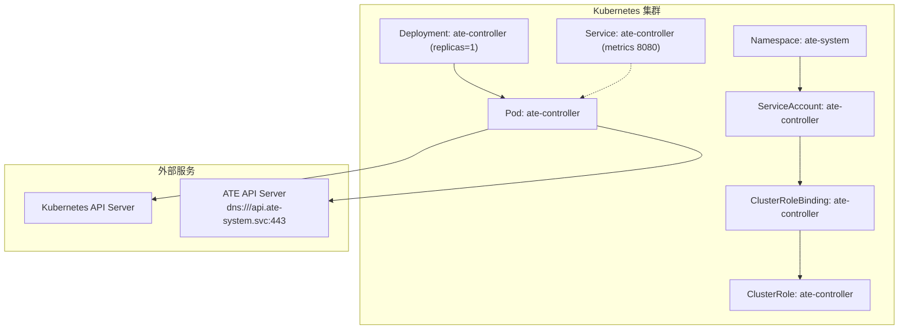
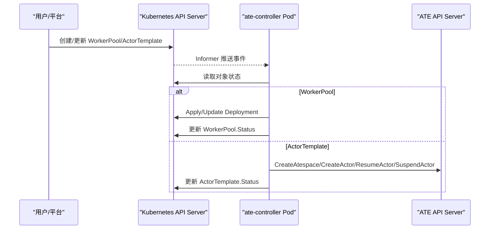
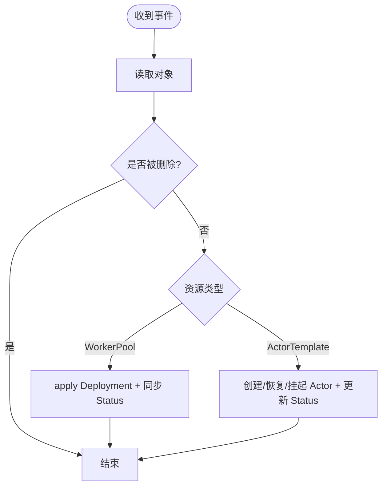
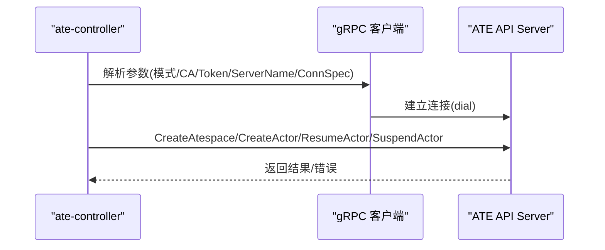
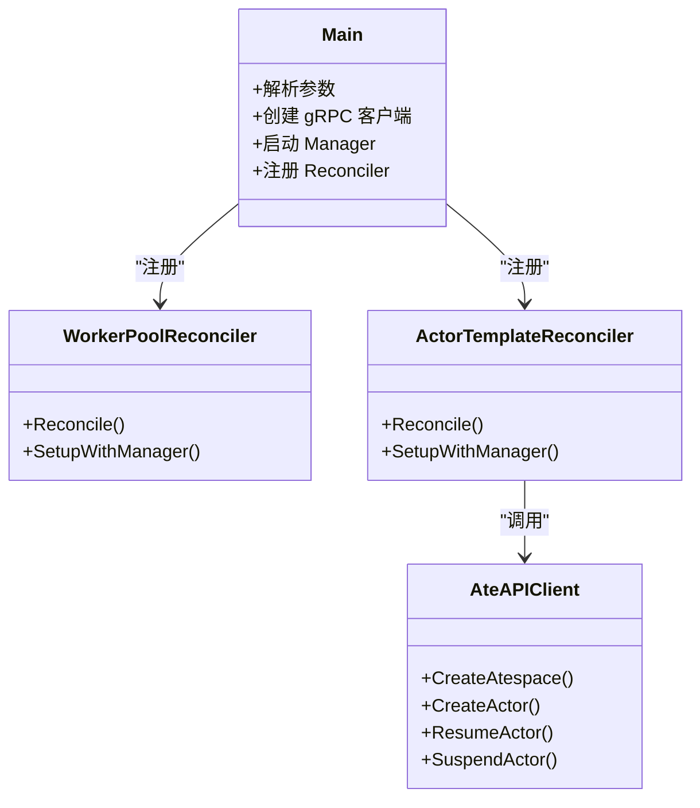

# 控制器配置

<cite>
**本文引用的文件**   
- [ate-controller.yaml](file://manifests/ate-install/ate-controller.yaml)
- [role.yaml](file://manifests/ate-install/generated/role.yaml)
- [main.go](file://cmd/atecontroller/main.go)
- [workerpool_controller.go](file://cmd/atecontroller/internal/controllers/workerpool_controller.go)
- [actortemplate_controller.go](file://cmd/atecontroller/internal/controllers/actortemplate_controller.go)
- [workerpool_apply.go](file://cmd/atecontroller/internal/controllers/workerpool_apply.go)
- [groupversion_info.go](file://pkg/api/v1alpha1/groupversion_info.go)
</cite>

## 目录
1. [简介](#简介)
2. [项目结构](#项目结构)
3. [核心组件](#核心组件)
4. [架构总览](#架构总览)
5. [详细组件分析](#详细组件分析)
6. [依赖关系分析](#依赖关系分析)
7. [性能与容量规划](#性能与容量规划)
8. [故障恢复与排障](#故障恢复与排障)
9. [结论](#结论)
10. [附录：清单字段速查](#附录清单字段速查)

## 简介
本文件面向运维与平台工程师，系统性说明 ate-controller 组件在 Kubernetes 中的部署与配置要点，包括：
- RBAC 权限与 ServiceAccount 绑定
- Deployment 副本、资源限制与健康探针
- 与 Kubernetes API 服务器的通信方式
- CRD 资源监听与事件处理机制
- 日志级别调整、可观测性与调试方法
- 故障恢复与常见问题排查建议

## 项目结构
与 ate-controller 相关的清单与源码组织如下：
- 安装清单位于 manifests/ate-install/，包含 Namespace、ServiceAccount、ClusterRoleBinding、Service、Deployment 等
- RBAC 规则由代码注解生成，输出到 manifests/ate-install/generated/role.yaml
- 控制器入口与 gRPC 客户端初始化在 cmd/atecontroller/main.go
- 控制器逻辑在 cmd/atecontroller/internal/controllers/*
- CRD GroupVersion 定义在 pkg/api/v1alpha1/groupversion_info.go

图表来源
- [ate-controller.yaml:1-100](file://manifests/ate-install/ate-controller.yaml#L1-L100)
- [role.yaml:1-83](file://manifests/ate-install/generated/role.yaml#L1-L83)
- [main.go:1-124](file://cmd/atecontroller/main.go#L1-L124)

章节来源
- [ate-controller.yaml:1-100](file://manifests/ate-install/ate-controller.yaml#L1-L100)
- [role.yaml:1-83](file://manifests/ate-install/generated/role.yaml#L1-L83)
- [main.go:1-124](file://cmd/atecontroller/main.go#L1-L124)

## 核心组件
- 控制平面入口与参数
  - 通过命令行参数配置与 ateapi 的通信模式、CA、服务端名称、令牌文件以及连接目标
  - 使用 controller-runtime 启动 Manager，注册 CRD Scheme，并挂载健康检查端点
- 控制器类型
  - WorkerPoolReconciler：将 WorkerPool 同步为 Deployment，并回写状态
  - ActorTemplateReconciler：驱动“黄金 Actor”生命周期（创建、恢复、挂起、快照）并与 ateapi 交互
- 权限模型
  - 通过 ClusterRole 授予对 core、apps 及 ate.dev 资源的访问能力
  - 通过 ClusterRoleBinding 将 ServiceAccount 与 ClusterRole 绑定

章节来源
- [main.go:36-124](file://cmd/atecontroller/main.go#L36-L124)
- [workerpool_controller.go:35-121](file://cmd/atecontroller/internal/controllers/workerpool_controller.go#L35-L121)
- [actortemplate_controller.go:48-211](file://cmd/atecontroller/internal/controllers/actortemplate_controller.go#L48-L211)
- [role.yaml:15-83](file://manifests/ate-install/generated/role.yaml#L15-L83)

## 架构总览
控制器运行于 ate-system 命名空间，以 ServiceAccount ate-controller 身份访问 Kubernetes API，并通过 gRPC 与 ateapi 通信。其职责是：
- 监听 CRD 变更（WorkerPool、ActorTemplate）
- 根据期望状态应用或更新下游资源（如 Deployment）
- 调用 ateapi 完成 Actor 生命周期管理（创建/恢复/挂起/快照）

图表来源
- [main.go:82-124](file://cmd/atecontroller/main.go#L82-L124)
- [workerpool_controller.go:45-121](file://cmd/atecontroller/internal/controllers/workerpool_controller.go#L45-L121)
- [actortemplate_controller.go:66-188](file://cmd/atecontroller/internal/controllers/actortemplate_controller.go#L66-L188)

## 详细组件分析

### 清单与服务账户（ServiceAccount）
- 命名空间：ate-system
- ServiceAccount：
  - ate-client（用于客户端侧）
  - ate-controller（控制器运行身份）
- ClusterRoleBinding：将 ate-controller SA 绑定到 ClusterRole ate-controller

章节来源
- [ate-controller.yaml:20-50](file://manifests/ate-install/ate-controller.yaml#L20-L50)

### RBAC 权限设置
- ClusterRole ate-controller 允许：
  - core 组：configmaps、secrets 的 get/list/watch；pods 的 create/delete/get/list/patch/update/watch
  - apps 组：deployments 的 create/delete/get/list/patch/update/watch
  - ate.dev 组：actortemplates、workerpools 的完整 CRUD + status/finalizers 操作
- 这些权限由控制器源码中的 kubebuilder 注解生成，最终输出至 role.yaml

章节来源
- [role.yaml:15-83](file://manifests/ate-install/generated/role.yaml#L15-L83)
- [workerpool_controller.go:40-44](file://cmd/atecontroller/internal/controllers/workerpool_controller.go#L40-L44)
- [actortemplate_controller.go:55-62](file://cmd/atecontroller/internal/controllers/actortemplate_controller.go#L55-L62)

### Deployment 部署规格
- 副本数：默认 1
- 容器端口：
  - metrics: 8080/TCP
  - healthz: 8081/TCP
- 镜像：ko 构建产物路径指向 atecontroller 二进制
- 启动参数（示例）：
  - --ateapi-ca-file=/run/servicedns-ca/trust-bundle.pem
- 标签选择器：app=ate-controller
- ServiceAccountName：ate-controller

章节来源
- [ate-controller.yaml:72-100](file://manifests/ate-install/ate-controller.yaml#L72-L100)

### 与 Kubernetes API 服务器的通信配置
- 使用 controller-runtime 的 ctrl.GetConfigOrDie() 自动发现 kubeconfig 或在集群内使用 InCluster 配置
- 支持标准认证插件（OIDC、云厂商等），无需额外配置即可在托管集群中工作

章节来源
- [main.go:82-88](file://cmd/atecontroller/main.go#L82-L88)

### CRD 资源监听与事件处理机制
- 注册的 GroupVersion：ate.dev/v1alpha1
- 监听的资源：
  - WorkerPool -> 同步为 Deployment，并回写 Status.Replicas
  - ActorTemplate -> 驱动“黄金 Actor”生命周期，与 ateapi 交互并更新 Status
- 事件处理流程：
  - Reconcile 获取对象 -> 处理删除标记 -> 执行具体 reconcile 逻辑 -> 更新状态

图表来源
- [workerpool_controller.go:45-121](file://cmd/atecontroller/internal/controllers/workerpool_controller.go#L45-L121)
- [actortemplate_controller.go:66-188](file://cmd/atecontroller/internal/controllers/actortemplate_controller.go#L66-L188)
- [groupversion_info.go:25-36](file://pkg/api/v1alpha1/groupversion_info.go#L25-L36)

### 控制器与 ateapi 的通信配置
- 连接目标：默认 dns:///api.ate-system.svc:443
- 认证模式：
  - mtls（默认）：不校验证书，依赖 Pod 注入的 mTLS 凭据进行身份
  - jwt：校验服务器证书 CA，并使用 ServiceAccount Token 作为 Bearer 凭证
- 相关参数：
  - --ateapi-auth
  - --ateapi-ca-file
  - --ateapi-server-name
  - --ateapi-token-file
  - --ateapi-conn-spec

图表来源
- [main.go:36-78](file://cmd/atecontroller/main.go#L36-L78)
- [actortemplate_controller.go:81-188](file://cmd/atecontroller/internal/controllers/actortemplate_controller.go#L81-L188)

### 事件处理细节与状态回写
- WorkerPool：
  - 使用 SSA Apply 创建/更新 Deployment
  - 从 Deployment.Status.Replicas 同步回 WorkerPool.Status
- ActorTemplate：
  - 阶段机：Initial -> ResumeGoldenActor -> WaitGoldenActor -> Ready
  - 等待就绪后挂起 Actor 并提取快照 URI 前缀写入 Status

章节来源
- [workerpool_controller.go:73-112](file://cmd/atecontroller/internal/controllers/workerpool_controller.go#L73-L112)
- [workerpool_apply.go:27-83](file://cmd/atecontroller/internal/controllers/workerpool_apply.go#L27-L83)
- [actortemplate_controller.go:81-188](file://cmd/atecontroller/internal/controllers/actortemplate_controller.go#L81-L188)

## 依赖关系分析
- 运行时依赖
  - controller-runtime：提供 Manager、Informer、Client、Healthz/Readyz
  - k8s client-go：CRD 编解码与 REST 客户端
  - gRPC：与 ateapi 通信
- 组件耦合
  - main.go 负责初始化 gRPC 客户端与 Manager，并注册两个 Reconciler
  - Reconciler 仅依赖 Client/Scheme 与 ateapi 客户端，保持低耦合

图表来源
- [main.go:82-124](file://cmd/atecontroller/main.go#L82-L124)
- [workerpool_controller.go:114-121](file://cmd/atecontroller/internal/controllers/workerpool_controller.go#L114-L121)
- [actortemplate_controller.go:190-193](file://cmd/atecontroller/internal/controllers/actortemplate_controller.go#L190-L193)

## 性能与容量规划
- 副本数量
  - 默认 replicas=1；如需高可用或多活，可按需增加，但需注意幂等与冲突处理
- 资源限制
  - 当前清单未显式设置 CPU/内存 requests/limits；建议在 Deployment 中补充，避免节点资源争用
- 日志级别
  - 默认启用开发模式日志；生产环境建议关闭 UseDevMode 并调整 zap 配置
- 指标与探测
  - metrics 端口 8080 已暴露；healthz/readyz 端口 8081 已开启
  - 建议配置 Prometheus 抓取 metrics，并基于 readiness/liveness 探针提升稳定性

[本节为通用指导，不涉及特定文件分析]

## 故障恢复与排障
- 常见启动问题
  - 无法连接 Kubernetes API：检查 kubeconfig 或 InCluster 配置、网络策略与 RBAC
  - 无法连接 ateapi：检查 --ateapi-conn-spec、--ateapi-auth 模式、CA 与 Token 文件路径
- 权限不足
  - 确认 ClusterRole 与 ClusterRoleBinding 已正确应用，且 SA 名称一致
- 控制器未生效
  - 查看 Controller 日志与事件；确认 CRD 已安装且版本匹配
  - 检查 WorkerPool/ActorTemplate 的 Status 条件与最后更新时间
- 健康检查
  - 通过 /healthz 与 /readyz 验证控制器存活与就绪状态

章节来源
- [main.go:109-124](file://cmd/atecontroller/main.go#L109-L124)
- [role.yaml:15-83](file://manifests/ate-install/generated/role.yaml#L15-L83)
- [ate-controller.yaml:92-100](file://manifests/ate-install/ate-controller.yaml#L92-L100)

## 结论
ate-controller 采用标准的 controller-runtime 模式，结合 RBAC 与 ServiceAccount 实现最小权限原则；通过 gRPC 与 ateapi 协作完成 Actor 生命周期管理。清单提供了基础部署所需的最小集合，生产环境应补充资源限制、日志与监控配置，并根据业务规模调整副本数与调优参数。

[本节为总结性内容，不涉及特定文件分析]

## 附录：清单字段速查
- 命名空间：ate-system
- ServiceAccount：
  - ate-client
  - ate-controller
- ClusterRoleBinding：ate-controller -> ClusterRole ate-controller
- Service：
  - 名称：ate-controller
  - 端口：metrics 8080/TCP
- Deployment：
  - 名称：ate-controller
  - 副本：1
  - 容器端口：metrics 8080/TCP, healthz 8081/TCP
  - 启动参数：--ateapi-ca-file=/run/servicedns-ca/trust-bundle.pem

章节来源
- [ate-controller.yaml:15-100](file://manifests/ate-install/ate-controller.yaml#L15-L100)
