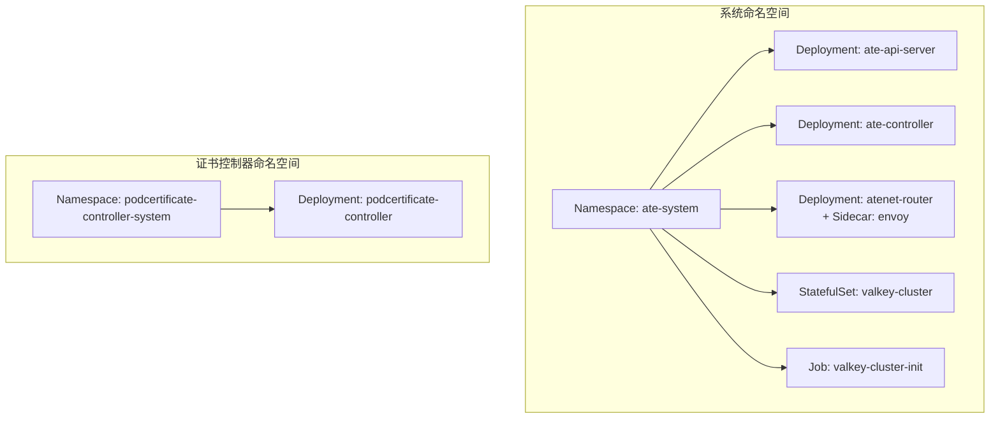
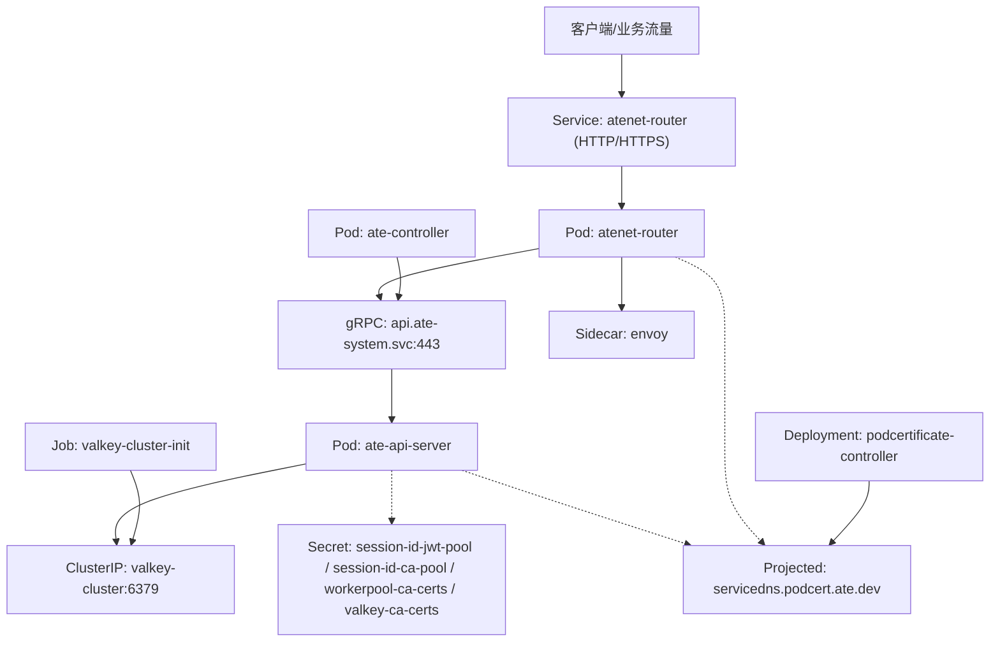
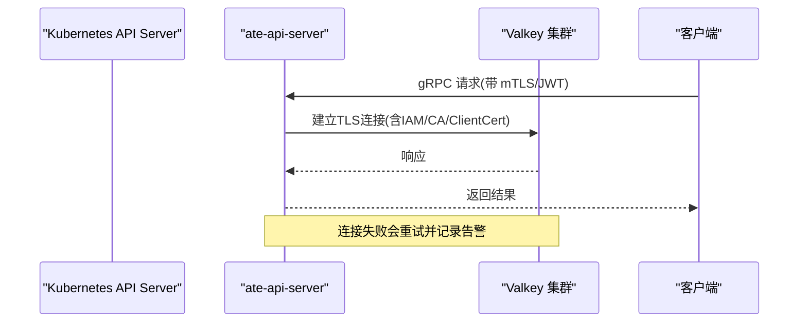
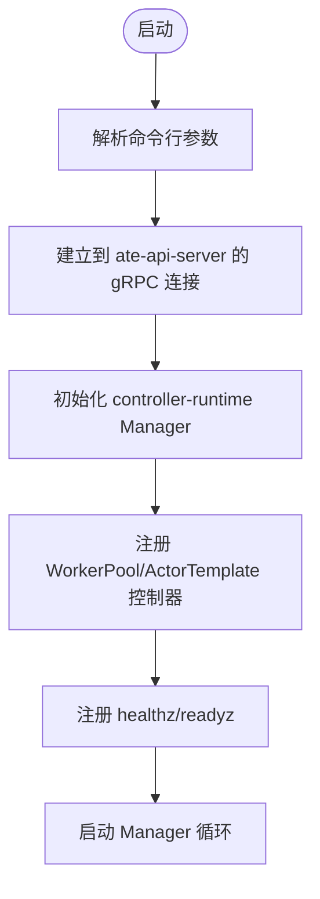
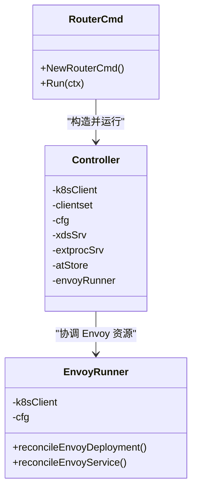
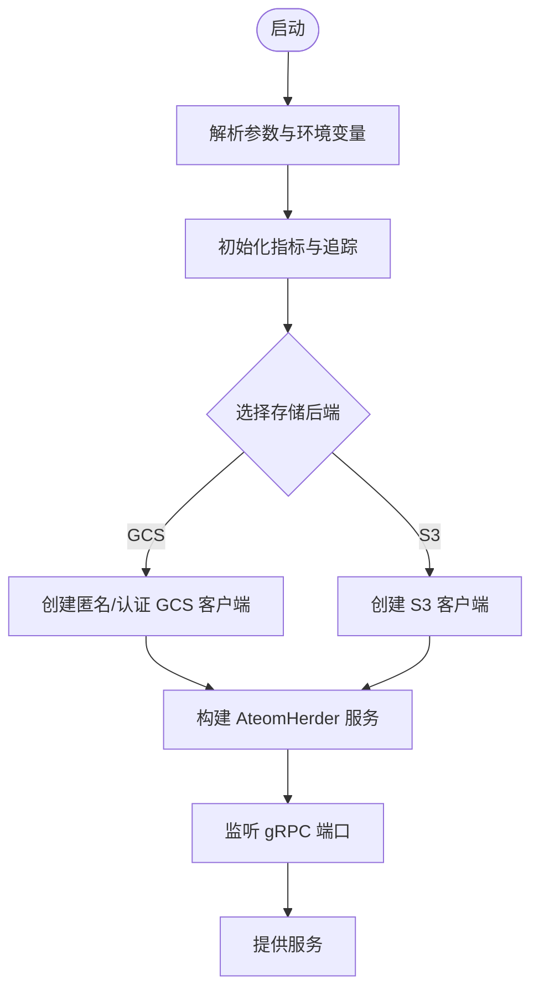
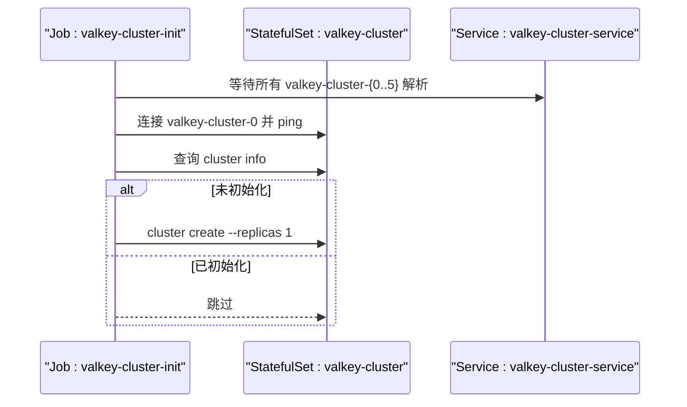
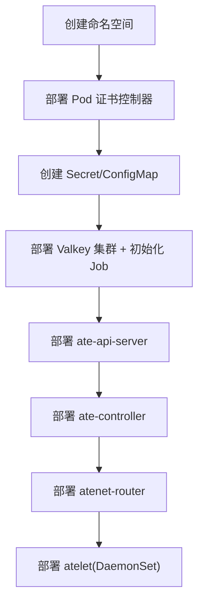

# 组件清单配置

<cite>
**本文引用的文件**   
- [ate-api-server.yaml](file://manifests/ate-install/ate-api-server.yaml)
- [ate-controller.yaml](file://manifests/ate-install/ate-controller.yaml)
- [atenet-router.yaml](file://manifests/ate-install/atenet-router.yaml)
- [atelet.yaml](file://manifests/ate-install/atelet.yaml)
- [valkey.yaml](file://manifests/ate-install/valkey.yaml)
- [pod-certificate-controller.yaml](file://manifests/ate-install/pod-certificate-controller.yaml)
- [ate-system-namespace.yaml](file://manifests/ate-install/ate-system-namespace.yaml)
- [main.go](file://cmd/ateapi/main.go)
- [router.go](file://cmd/atenet/internal/router.go)
- [controller.go](file://cmd/atenet/internal/router/controller.go)
- [envoyrunner.go](file://cmd/atenet/internal/router/envoyrunner.go)
- [workload_spec.go](file://cmd/ateapi/internal/controlapi/workload_spec.go)
- [atecontroller_main.go](file://cmd/atecontroller/main.go)
</cite>

## 目录
1. [简介](#简介)
2. [项目结构](#项目结构)
3. [核心组件](#核心组件)
4. [架构总览](#架构总览)
5. [详细组件分析](#详细组件分析)
6. [依赖关系与启动顺序](#依赖关系与启动顺序)
7. [性能与容量规划](#性能与容量规划)
8. [故障排查指南](#故障排查指南)
9. [结论](#结论)
10. [附录：自定义配置模板](#附录自定义配置模板)

## 简介
本文件面向在 Kubernetes 上部署 Substrate 的运维与平台工程师，聚焦于以下组件的清单配置与最佳实践：
- ate-api-server（控制面 gRPC API）
- ate-controller（CRD 控制器）
- atenet-router（xDS + Envoy 网关）
- atelet（节点侧工作负载编排代理）
- valkey（集群型键值存储）

文档涵盖资源定义、环境变量、存储卷挂载、安全上下文、健康检查、副本数、CPU/内存限制等配置要点，并给出前置条件（CRD、Secret、ConfigMap、证书池）、组件间依赖与启动顺序说明，以及可复用的自定义配置模板。

## 项目结构
清单位于 manifests/ate-install 目录下，按组件拆分；同时包含 Pod 证书控制器与命名空间等资源。

图表来源
- [ate-system-namespace.yaml:1-18](file://manifests/ate-install/ate-system-namespace.yaml#L1-L18)
- [ate-api-server.yaml:58-185](file://manifests/ate-install/ate-api-server.yaml#L58-L185)
- [ate-controller.yaml:72-100](file://manifests/ate-install/ate-controller.yaml#L72-L100)
- [atenet-router.yaml:102-196](file://manifests/ate-install/atenet-router.yaml#L102-L196)
- [valkey.yaml:73-149](file://manifests/ate-install/valkey.yaml#L73-L149)
- [pod-certificate-controller.yaml:123-197](file://manifests/ate-install/pod-certificate-controller.yaml#L123-L197)

章节来源
- [ate-system-namespace.yaml:1-18](file://manifests/ate-install/ate-system-namespace.yaml#L1-L18)

## 核心组件
本节概述各组件在清单中的关键配置项与职责边界，后续章节将逐项深入。

- ate-api-server
  - 提供 gRPC 控制面服务，连接 Valkey 集群，加载 mTLS/JWT 认证与信任根，暴露 /readyz 健康端点。
  - 通过 projected volume 注入 Pod 证书、CA 池、JWT 池等敏感材料。
  - 支持从 ConfigMap 注入运行时参数（@env 占位符）。
- ate-controller
  - 基于 controller-runtime 监听 CRD，调用 ate-api-server 完成工作池与 Actor 模板的协调。
  - 对外暴露 metrics 端口，注册 healthz/readyz。
- atenet-router
  - 运行 xDS 服务器与 Envoy ExtProc 处理链，动态管理内部 Envoy 实例（Deployment/Service），并通过 Service 暴露 HTTP/HTTPS。
  - 使用 Pod 证书为 Envoy 提供 TLS 身份。
- atelet
  - DaemonSet 在每个节点运行，负责拉取镜像、准备 OCI bundle、与 ateom 交互执行/恢复工作负载。
  - 通过 hostPath 挂载本地状态目录。
- valkey
  - StatefulSet 以 6 副本运行，启用 TLS 与集群模式，由 Job 初始化集群拓扑。
  - 通过 Headless Service 与普通 Service 暴露数据面与管理面。

章节来源
- [ate-api-server.yaml:58-185](file://manifests/ate-install/ate-api-server.yaml#L58-L185)
- [ate-controller.yaml:72-100](file://manifests/ate-install/ate-controller.yaml#L72-L100)
- [atenet-router.yaml:102-196](file://manifests/ate-install/atenet-router.yaml#L102-L196)
- [atelet.yaml:46-126](file://manifests/ate-install/atelet.yaml#L46-L126)
- [valkey.yaml:73-149](file://manifests/ate-install/valkey.yaml#L73-L149)

## 架构总览
下图展示组件间的运行时依赖与通信路径。

图表来源
- [atenet-router.yaml:198-216](file://manifests/ate-install/atenet-router.yaml#L198-L216)
- [ate-api-server.yaml:186-201](file://manifests/ate-install/ate-api-server.yaml#L186-L201)
- [valkey.yaml:43-72](file://manifests/ate-install/valkey.yaml#L43-L72)
- [pod-certificate-controller.yaml:123-197](file://manifests/ate-install/pod-certificate-controller.yaml#L123-L197)

## 详细组件分析

### ate-api-server 清单详解
- 资源对象
  - ClusterRole/ClusterRoleBinding/ServiceAccount：最小权限读取 Pods 与 CRD 列表/监视。
  - Deployment：单副本，gRPC 监听 443，Prometheus 指标 9090，/readyz 健康检查。
  - Service：ClusterIP，名称 api，端口 443。
- 环境变量与参数
  - 通过 args 传入 Redis/TLS/JWT/CA 相关路径或地址，其中若干参数支持 @env 占位符，由代码在启动时从同名环境变量解析。
  - envFrom 引用可选 ConfigMap（开发者可按需覆盖 redis 地址、JWT issuer 等）。
- 存储卷挂载
  - servicedns：projected podCertificate，供服务端 TLS 凭证。
  - session-id-jwt-pool/session-id-ca-pool/workerpool-ca-certs：projected secret/clusterTrustBundle。
  - valkey-ca-certs：projected secret，用于连接 Valkey 的 CA。
- 安全上下文
  - 未显式设置 runAsUser/capabilities，遵循容器镜像默认用户；建议在生产中明确设置非 root 用户与只读根文件系统。
- 健康检查
  - readinessProbe 指向 /readyz:9090。
- 关键实现参考
  - 启动流程、Redis 连接、mTLS/JWT 构建、/readyz 暴露等逻辑见入口 main。

图表来源
- [main.go:248-331](file://cmd/ateapi/main.go#L248-L331)
- [main.go:182-206](file://cmd/ateapi/main.go#L182-L206)

章节来源
- [ate-api-server.yaml:16-201](file://manifests/ate-install/ate-api-server.yaml#L16-L201)
- [main.go:56-77](file://cmd/ateapi/main.go#L56-L77)
- [main.go:208-228](file://cmd/ateapi/main.go#L208-L228)
- [main.go:248-331](file://cmd/ateapi/main.go#L248-L331)
- [main.go:182-206](file://cmd/ateapi/main.go#L182-L206)

### ate-controller 清单详解
- 资源对象
  - Namespace、ServiceAccount、ClusterRoleBinding、Service（metrics 8080）、Deployment（单副本）。
- 环境变量与参数
  - 通过 --ateapi-conn-spec 指定 ate-api-server 地址，默认 dns:///api.ate-system.svc:443。
  - 支持 --ateapi-auth/--ateapi-ca-file/--ateapi-token-file 等参数进行客户端认证。
- 健康检查
  - 注册 healthz/readyz 到 manager。
- 关键实现参考
  - 控制器注册、与 ate-api-server 的 gRPC 连接建立。

图表来源
- [atecontroller_main.go:53-123](file://cmd/atecontroller/main.go#L53-L123)

章节来源
- [ate-controller.yaml:15-100](file://manifests/ate-install/ate-controller.yaml#L15-L100)
- [atecontroller_main.go:36-46](file://cmd/atecontroller/main.go#L36-L46)
- [atecontroller_main.go:53-123](file://cmd/atecontroller/main.go#L53-L123)

### atenet-router 清单详解
- 资源对象
  - ServiceAccount/ClusterRole/ClusterRoleBinding：仅读取 ActorTemplates。
  - ConfigMap：静态 Envoy 配置（ADS/xDS 指向本地 18000）。
  - Deployment：双容器（atenet-router + envoy），分别暴露不同端口。
  - Service：ClusterIP，HTTP 80 -> 8080，HTTPS 443 -> 8443。
- 环境变量与参数
  - router 子命令参数包括 namespace、端口、ATE API 地址、OTLP 收集器地址、Envoy 证书路径、ATE API CA 等。
  - 支持 standalone 模式（不创建受管 Deployment/Service）。
- 存储卷挂载
  - envoy-config：挂载 ConfigMap 到 /etc/envoy。
  - servicedns：projected podCertificate，供 Envoy 使用。
- 安全上下文
  - 未显式设置，建议使用非 root 用户与只读根文件系统。
- 动态管理
  - 运行时根据配置创建/更新名为 atenet-router-envoy 的 Deployment 与对应 Service，供外部流量访问。

图表来源
- [router.go:27-67](file://cmd/atenet/internal/router.go#L27-L67)
- [controller.go:26-53](file://cmd/atenet/internal/router/controller.go#L26-L53)
- [envoyrunner.go:36-47](file://cmd/atenet/internal/router/envoyrunner.go#L36-L47)
- [envoyrunner.go:142-222](file://cmd/atenet/internal/router/envoyrunner.go#L142-L222)
- [envoyrunner.go:224-258](file://cmd/atenet/internal/router/envoyrunner.go#L224-L258)

章节来源
- [atenet-router.yaml:15-216](file://manifests/ate-install/atenet-router.yaml#L15-L216)
- [router.go:27-67](file://cmd/atenet/internal/router.go#L27-L67)
- [controller.go:26-53](file://cmd/atenet/internal/router/controller.go#L26-L53)
- [envoyrunner.go:142-222](file://cmd/atenet/internal/router/envoyrunner.go#L142-L222)
- [envoyrunner.go:224-258](file://cmd/atenet/internal/router/envoyrunner.go#L224-L258)

### atelet 清单详解
- 资源对象
  - ServiceAccount/ClusterRole/ClusterRoleBinding：读取 Pods。
  - DaemonSet：每节点一个 Pod，hostPort 暴露 gRPC 9085 与 Prometheus 9090。
- 环境变量与参数
  - --gcp-auth-for-image-pulls=true 启用 GCP ADC 拉取镜像。
  - ATE_STORAGE_BACKEND=gcs（默认），也可切换 s3。
- 存储卷挂载
  - hostPath /var/lib/ateom-gvisor：持久化节点级状态（OCI bundle、快照等）。
- 安全上下文
  - runAsUser/runAsGroup=0，drop ALL capabilities；注释说明仅需 root 写宿主目录，无需额外能力。
- 健康检查
  - 清单未显式配置探针；可在生产中添加 liveness/readiness。

图表来源
- [atelet.yaml:46-126](file://manifests/ate-install/atelet.yaml#L46-L126)
- [main.go:74-183](file://cmd/atelet/main.go#L74-L183)

章节来源
- [atelet.yaml:15-126](file://manifests/ate-install/atelet.yaml#L15-L126)
- [main.go:74-183](file://cmd/atelet/main.go#L74-L183)

### valkey 清单详解
- 资源对象
  - ConfigMap：valkey.conf，启用 TLS、集群模式、自动重载证书。
  - Service（Headless）：valkey-cluster-service，暴露 6379/16379。
  - Service（ClusterIP）：valkey-cluster，聚合数据端口。
  - StatefulSet：6 副本，并行启动策略，每个 Pod 追加 announce 主机名与端口。
  - Job：valkey-cluster-init，等待所有 Pod DNS 解析后，检测是否已初始化，否则执行 cluster create。
- 存储卷挂载
  - config：挂载 valkey.conf。
  - servicedns：projected podCertificate，供 TLS 双向认证。
  - valkey-ca-certs：projected secret，CA 证书。
  - data：volumeClaimTemplate，RWO 1Gi。
- 安全上下文
  - 未显式设置，建议在生产中为非 root 用户与只读根文件系统。

图表来源
- [valkey.yaml:150-227](file://manifests/ate-install/valkey.yaml#L150-L227)
- [valkey.yaml:73-149](file://manifests/ate-install/valkey.yaml#L73-L149)

章节来源
- [valkey.yaml:15-227](file://manifests/ate-install/valkey.yaml#L15-L227)

### Pod 证书控制器（前置依赖）
- 作用
  - 提供 servicedns.podcert.ate.dev/* 与 podidentity.podcert.ate.dev/* 签名器，签发 Pod 证书与集群信任束。
- 资源对象
  - Namespace、ClusterRole/Binding、Role/Binding、Deployment。
- 卷挂载
  - 通过 projected secret 挂载 service-dns-pool.json 与 pod-identity-pool.json。
- 安全上下文
  - readOnlyRootFilesystem、drop ALL、仅添加 NET_BIND_SERVICE。

章节来源
- [pod-certificate-controller.yaml:1-197](file://manifests/ate-install/pod-certificate-controller.yaml#L1-L197)

## 依赖关系与启动顺序
为保证系统稳定启动，建议遵循如下顺序与前置条件：

1) 基础环境
- 创建命名空间 ate-system。
- 安装 Pod 证书控制器（提供证书签发能力）。

2) 密钥与配置
- 创建 Secret：session-id-jwt-pool、session-id-ca-pool、workerpool-ca-certs、valkey-ca-certs。
- 按需创建 ConfigMap：ate-api-server-envvars（用于覆盖 Redis/JWT 等运行时参数）。

3) 数据存储
- 部署 valkey StatefulSet 与初始化 Job，确保集群就绪。

4) 控制面
- 部署 ate-api-server（依赖上述 Secret/ConfigMap/证书）。
- 部署 ate-controller（依赖 ate-api-server 可达）。

5) 网络与路由
- 部署 atenet-router（依赖 ate-api-server、证书）。

6) 节点侧
- 部署 atelet（DaemonSet，随节点调度）。

[此图为概念性流程图，不直接映射具体源码文件]

## 性能与容量规划
以下为通用建议，结合清单现状给出调整方向：

- CPU/内存限制与请求
  - 为 ate-api-server、ate-controller、atenet-router、valkey 容器设置 requests/limits，避免资源争用。
  - 对 atelet 所在节点评估磁盘 I/O 与内存，合理设置 limit 防止 OOM。
- 副本数量
  - ate-api-server、ate-controller、atenet-router 初始为 1 副本；生产建议至少 2 副本以实现高可用（注意有状态组件如 valkey 采用多副本而非水平扩展）。
- 健康检查
  - ate-api-server 已配置 readinessProbe；建议在 ate-controller、atenet-router、valkey 容器也配置 liveness/readiness，提升自愈能力。
- 存储
  - valkey 使用 RWO PVC，单节点写入；如需更高吞吐与可用性，考虑更大规格磁盘与 SSD。
- 网络
  - atenet-router 暴露 HTTP/HTTPS 端口，配合 Ingress/LoadBalancer 使用；注意限流与熔断。
- 监控与追踪
  - 各组件均暴露 Prometheus 指标；OpenTelemetry 端点指向集群内 collector，确保 collector 可用。

[本节为通用指导，不直接分析具体文件]

## 故障排查指南
- ate-api-server 无法连接 Valkey
  - 检查 Redis 地址、CA、ServerName、客户端证书是否正确挂载与可读。
  - 确认 IAM 认证开关与凭据可用。
  - 查看日志中重试与错误信息。
- ate-controller 无法连接 ate-api-server
  - 校验 --ateapi-conn-spec、认证模式与 CA/Token 文件。
  - 确认 Service 名称与端口可达。
- atenet-router 无法获取 xDS 配置
  - 检查本地 ADS 端口与 Envoy 配置一致性。
  - 确认 ate-api-server 可达且鉴权通过。
- valkey 集群未初始化
  - 检查 Job 日志，确认所有 Pod DNS 解析成功。
  - 若已存在旧数据，可能需要清理 PVC 后重新初始化。
- atelet 无法拉取镜像或写入宿主目录
  - 检查 GCP ADC 或 S3 配置。
  - 确认 hostPath 目录存在且可写。

章节来源
- [main.go:248-331](file://cmd/ateapi/main.go#L248-L331)
- [valkey.yaml:150-227](file://manifests/ate-install/valkey.yaml#L150-L227)

## 结论
通过合理的清单配置与前置条件准备，Substrate 的核心组件可以在 Kubernetes 上稳定运行。建议在生产环境中完善健康检查、资源限制、安全上下文与监控告警，并根据实际负载调优副本数与存储规格。

[本节为总结性内容，不直接分析具体文件]

## 附录：自定义配置模板
以下为可直接替换使用的片段示例（请根据实际环境修改名称、路径与值）：

- 为 ate-api-server 注入运行时参数（ConfigMap）
  - 创建一个 ConfigMap，包含 ATE_API_REDIS_ADDRESS、ATE_API_K8SJWT_ISSUER、ATE_API_REDIS_USE_IAM_AUTH、ATE_API_REDIS_TLS_SERVER_NAME、ATE_API_REDIS_CLIENT_CERT 等键。
  - 在 Deployment 的 envFrom 中引用该 ConfigMap（清单已支持 optional）。
  - 参考：[ate-api-server.yaml:115-118](file://manifests/ate-install/ate-api-server.yaml#L115-L118)、[main.go:208-228](file://cmd/ateapi/main.go#L208-L228)

- 为 atenet-router 启用 JWT 模式访问 ate-api-server
  - 设置 --ateapi-auth=jwt，并提供 --ateapi-ca-file 与 --ateapi-token-file。
  - 参考：[router.go:61-64](file://cmd/atenet/internal/router.go#L61-L64)

- 为 valkey 更换 CA 或证书
  - 更新 Secret valkey-ca-certs 与 projected volume 映射。
  - 参考：[valkey.yaml:133-141](file://manifests/ate-install/valkey.yaml#L133-L141)

- 为 ate-controller 指定 ate-api-server 地址
  - 修改 --ateapi-conn-spec 为自定义 DNS 或 IP:Port。
  - 参考：[atecontroller_main.go:40-46](file://cmd/atecontroller/main.go#L40-L46)

- 为 atelet 切换存储后端为 S3
  - 设置环境变量 ATE_STORAGE_BACKEND=s3，并按 AWS SDK 要求配置凭据。
  - 参考：[main.go:128-149](file://cmd/atelet/main.go#L128-L149)

章节来源
- [ate-api-server.yaml:115-118](file://manifests/ate-install/ate-api-server.yaml#L115-L118)
- [main.go:208-228](file://cmd/ateapi/main.go#L208-L228)
- [router.go:61-64](file://cmd/atenet/internal/router.go#L61-L64)
- [valkey.yaml:133-141](file://manifests/ate-install/valkey.yaml#L133-L141)
- [atecontroller_main.go:40-46](file://cmd/atecontroller/main.go#L40-L46)
- [main.go:128-149](file://cmd/atelet/main.go#L128-L149)
