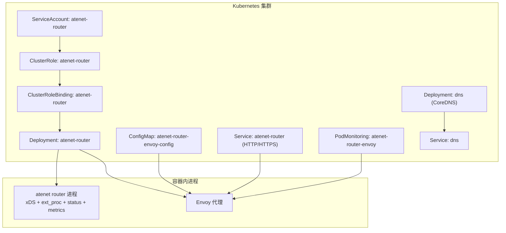
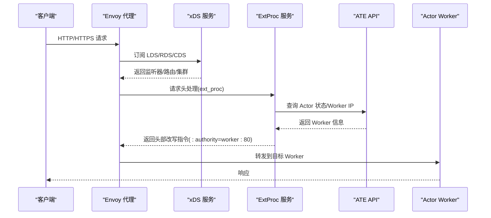
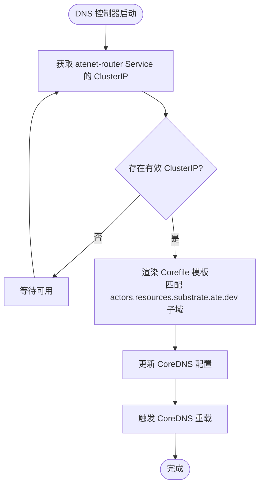
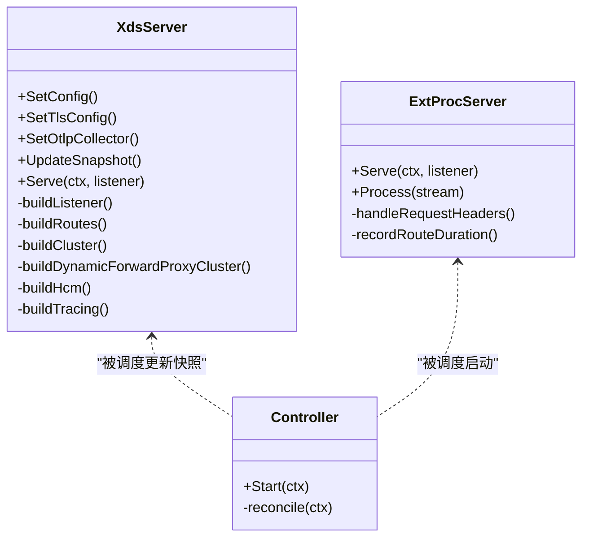
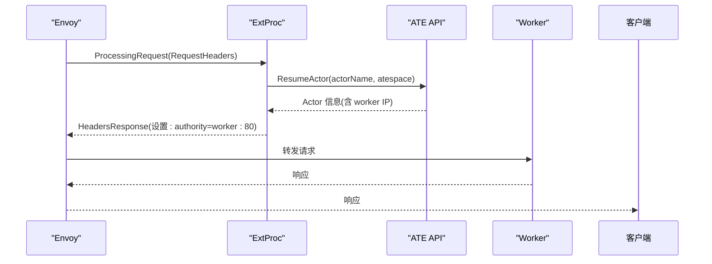
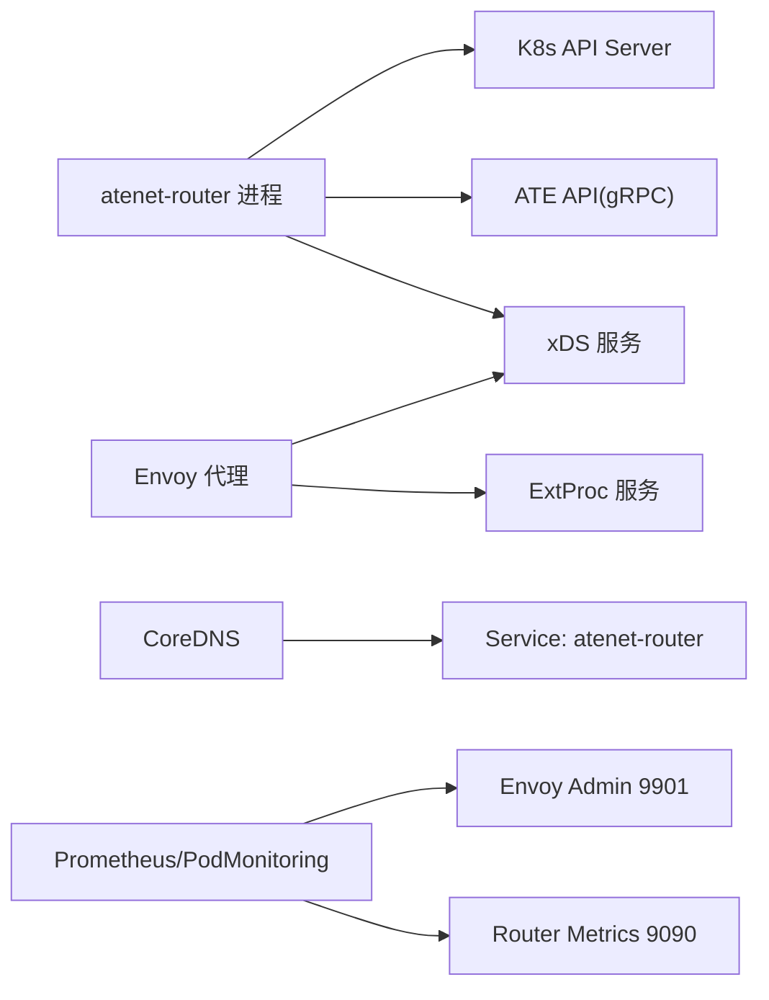

# 网络路由器配置

<cite>
**本文引用的文件**   
- [atenet-router.yaml](file://manifests/ate-install/atenet-router.yaml)
- [atenet-dns.yaml](file://manifests/ate-install/atenet-dns.yaml)
- [atenet-router-monitoring.yaml](file://manifests/ate-install/atenet-router-monitoring.yaml)
- [README.md（router）](file://cmd/atenet/internal/router/README.md)
- [README.md（DNS）](file://cmd/atenet/internal/dns/README.md)
- [xds.go](file://cmd/atenet/internal/router/xds.go)
- [extproc.go](file://cmd/atenet/internal/router/extproc.go)
- [controller.go](file://cmd/atenet/internal/router/controller.go)
- [envoyrunner.go](file://cmd/atenet/internal/router/envoyrunner.go)
- [status.go](file://cmd/atenet/internal/router/status.go)
- [metrics.go](file://cmd/atenet/internal/router/metrics.go)
- [dns.go](file://cmd/atenet/internal/dns/dns.go)
- [router_client.go](file://internal/e2e/router_client.go)
</cite>

## 目录
1. [简介](#简介)
2. [项目结构](#项目结构)
3. [核心组件](#核心组件)
4. [架构总览](#架构总览)
5. [详细组件分析](#详细组件分析)
6. [依赖关系分析](#依赖关系分析)
7. [性能与调优](#性能与调优)
8. [故障排查指南](#故障排查指南)
9. [结论](#结论)
10. [附录：关键清单字段速查](#附录关键清单字段速查)

## 简介
本文件聚焦于 atenet-router 组件在 Kubernetes 中的部署与配置，覆盖 ServiceAccount 权限、Deployment 容器编排、环境变量与启动参数、DNS 解析集成、Envoy 数据面与 xDS 控制面通信、动态路由规则生成、负载均衡策略、流量管理与安全认证等高级能力，并提供性能调优、监控告警与故障排查建议。

## 项目结构
与 atenet-router 相关的清单与实现主要分布在以下位置：
- 清单定义：manifests/ate-install/ 下的 atenet-router.yaml、atenet-dns.yaml、atenet-router-monitoring.yaml
- 控制面实现：cmd/atenet/internal/router/ 下的 xds.go、extproc.go、controller.go、envoyrunner.go、status.go、metrics.go
- DNS 控制器：cmd/atenet/internal/dns/ 下的 dns.go 及 README

图表来源
- [atenet-router.yaml:1-216](file://manifests/ate-install/atenet-router.yaml#L1-L216)
- [atenet-dns.yaml:15-131](file://manifests/ate-install/atenet-dns.yaml#L15-L131)
- [atenet-router-monitoring.yaml:1-35](file://manifests/ate-install/atenet-router-monitoring.yaml#L1-L35)

章节来源
- [atenet-router.yaml:1-216](file://manifests/ate-install/atenet-router.yaml#L1-L216)
- [atenet-dns.yaml:15-131](file://manifests/ate-install/atenet-dns.yaml#L15-L131)
- [atenet-router-monitoring.yaml:1-35](file://manifests/ate-install/atenet-router-monitoring.yaml#L1-L35)

## 核心组件
- ServiceAccount 与 RBAC：为 atenet-router 提供最小化权限，仅允许读取 ate.dev/actortemplates 资源，用于驱动动态路由。
- Deployment：包含两个容器
  - atenet-router：运行 xDS 服务、ExtProc 外部处理 gRPC、状态页与指标采集
  - envoy：作为数据面代理，通过 xDS 从 atenet-router 获取监听器、路由与集群配置
- ConfigMap：提供 Envoy 的 bootstrap 配置，指向本地 xDS 服务
- Service：对外暴露 HTTP(80) 与 HTTPS(443) 入口
- PodMonitoring：抓取 Envoy admin /stats/prometheus 端点，便于 Prometheus 可视化

章节来源
- [atenet-router.yaml:15-216](file://manifests/ate-install/atenet-router.yaml#L15-L216)
- [README.md（router）:1-26](file://cmd/atenet/internal/router/README.md#L1-L26)

## 架构总览
atnet-router 采用“控制面+数据面”同 Pod 部署模式：
- 控制面：xDS 服务器负责向 Envoy 推送 Listener/Route/Cluster；ExtProc 负责根据请求 Host 解析 Actor 引用并动态决定目标 Worker IP
- 数据面：Envoy 接收入站 HTTP/HTTPS 流量，经 ext_proc 处理后，将 :authority 重写为目标 Worker 地址并通过 dynamic_forward_proxy 转发

图表来源
- [xds.go:148-225](file://cmd/atenet/internal/router/xds.go#L148-L225)
- [extproc.go:80-188](file://cmd/atenet/internal/router/extproc.go#L80-L188)
- [controller.go:88-110](file://cmd/atenet/internal/router/controller.go#L88-L110)

## 详细组件分析

### ServiceAccount 与 RBAC 权限
- ServiceAccount：ate-system 命名空间下 atenet-router
- ClusterRole：对 ate.dev 组的 actortemplates 资源具备 get/watch/list 权限
- ClusterRoleBinding：将上述 Role 绑定至 atenet-router ServiceAccount

该权限模型确保路由器仅能观测 ActorTemplate 以生成路由快照，不拥有写权限，符合最小权限原则。

章节来源
- [atenet-router.yaml:15-48](file://manifests/ate-install/atenet-router.yaml#L15-L48)

### Deployment 与容器编排
- 副本数：1
- 标签：app=atenet-router
- 注解：启用 Prometheus 抓取（端口 9090）
- 容器 atenet-router
  - 镜像：ko 构建产物
  - 启动参数（节选）：router、standalone、namespace、port-http、port-xds、port-extproc、extproc-address、ateapi-address、status-port、port-https、envoy-cert-path、otlp-collector-address、ateapi-ca-file
  - 环境变量：POD_NAME、POD_NAMESPACE、POD_UID、OTEL_RESOURCE_ATTRIBUTES、OTEL_EXPORTER_OTLP_ENDPOINT
  - 暴露端口：xds(18000)、extproc(50051)、status(4040)、metrics(9090)
- 容器 envoy
  - 镜像：envoyproxy/envoy:v1.30-latest
  - 启动命令：加载 /etc/envoy/envoy.yaml，开启调试日志级别
  - 暴露端口：http(8080)、https(8443)、admin(9901)
  - 挂载：envoy-config（来自 ConfigMap）、servicedns（podCertificate 投影卷）
- Volume
  - envoy-config：ConfigMap atenet-router-envoy-config
  - servicedns：projected podCertificate，路径 /run/servicedns.podcert.ate.dev

章节来源
- [atenet-router.yaml:102-197](file://manifests/ate-install/atenet-router.yaml#L102-L197)

### 环境变量与启动参数说明
- 运行时标识与环境注入
  - POD_NAME/POD_NAMESPACE/POD_UID：由 K8s fieldRef 注入，用于 OpenTelemetry 资源属性
  - OTEL_RESOURCE_ATTRIBUTES：构造 OTel 资源标签
  - OTEL_EXPORTER_OTLP_ENDPOINT：指定 OTLP 收集器地址
- 路由器功能开关与端口
  - --standalone：是否独立运行（不管理外部 Envoy Deployment）
  - --namespace：工作命名空间
  - --port-http/--port-https：HTTP/HTTPS 监听端口
  - --port-xds：xDS 服务端口
  - --port-extproc：ExtProc gRPC 端口
  - --extproc-address：ExtProc 监听地址
  - --status-port：状态页端口
  - --ateapi-address：ATE API 服务端地址
  - --envoy-cert-path：HTTPS 证书路径
  - --otlp-collector-address：OTLP 收集器地址
  - --ateapi-ca-file：ATE API CA 文件路径

章节来源
- [atenet-router.yaml:126-156](file://manifests/ate-install/atenet-router.yaml#L126-L156)

### DNS 服务配置与集成
- DNS 控制器职责：将 <actor-name>.<atespace>.actors.resources.substrate.ate.dev 解析为 atenet-router 的 Service ClusterIP
- 部署形态：Deployment + Service，使用 CoreDNS 镜像，支持 TCP/UDP 53
- 初始化：initContainer 写入基础 Corefile，主容器运行 CoreDNS
- 控制器逻辑：周期性获取 atenet-router Service 的 ClusterIP，更新 Corefile 模板并触发 reload

图表来源
- [dns.go:71-88](file://cmd/atenet/internal/dns/dns.go#L71-L88)
- [README.md（DNS）:1-37](file://cmd/atenet/internal/dns/README.md#L1-L37)
- [atenet-dns.yaml:76-131](file://manifests/ate-install/atenet-dns.yaml#L76-L131)

章节来源
- [README.md（DNS）:1-37](file://cmd/atenet/internal/dns/README.md#L1-L37)
- [dns.go:71-88](file://cmd/atenet/internal/dns/dns.go#L71-L88)
- [atenet-dns.yaml:76-131](file://manifests/ate-install/atenet-dns.yaml#L76-L131)

### Envoy 代理集成与 xDS 通信
- Bootstrap 配置：静态声明 xds_cluster 指向本地 127.0.0.1:18000，启用 ADS（Aggregated Discovery Service）
- xDS 服务：在 atenet-router 进程中实现，提供 LDS/RDS/CDS/EPS 等发现服务
- 监听器与路由
  - HTTP 监听器：默认 8080
  - HTTPS 监听器：可选，基于证书文件或内存内容
  - 路由：将所有请求转发至 dynamic_forward_proxy_cluster
- 过滤器链
  - ext_proc：调用本地 ExtProc 进行请求头处理与路由决策
  - dynamic_forward_proxy：按 :authority 动态解析并转发
  - router：最终路由转发
- 追踪与访问日志
  - 可配置 OTLP 收集器，启用 OpenTelemetry 追踪
  - 输出标准输出访问日志

图表来源
- [xds.go:71-225](file://cmd/atenet/internal/router/xds.go#L71-L225)
- [extproc.go:38-128](file://cmd/atenet/internal/router/extproc.go#L38-L128)
- [controller.go:26-110](file://cmd/atenet/internal/router/controller.go#L26-L110)

章节来源
- [xds.go:148-225](file://cmd/atenet/internal/router/xds.go#L148-L225)
- [extproc.go:80-188](file://cmd/atenet/internal/router/extproc.go#L80-L188)
- [controller.go:88-110](file://cmd/atenet/internal/router/controller.go#L88-L110)

### 动态路由规则与 ExtProc 流程
- 请求进入 Envoy 后，ext_proc 拦截请求头
- 解析 Host 为 <actor-name>.<atespace>，调用 ATE API 恢复或定位 Actor
- 若成功，返回头部改写指令，将 :authority 设置为 worker_ip:80
- Envoy 通过 dynamic_forward_proxy 解析并转发到目标 Worker

图表来源
- [extproc.go:130-188](file://cmd/atenet/internal/router/extproc.go#L130-L188)

章节来源
- [extproc.go:130-188](file://cmd/atenet/internal/router/extproc.go#L130-L188)

### 负载均衡策略
- 上游连接与协议选项：显式启用 HTTP/2 协议选项
- 负载均衡策略：ROUND_ROBIN（适用于 ext_proc 集群与 OTLP 集群）
- 动态转发代理集群：由 dynamic_forward_proxy 按 :authority 动态选择后端，不受固定 LB 策略限制

章节来源
- [xds.go:227-272](file://cmd/atenet/internal/router/xds.go#L227-L272)
- [xds.go:286-334](file://cmd/atenet/internal/router/xds.go#L286-L334)
- [xds.go:336-355](file://cmd/atenet/internal/router/xds.go#L336-L355)

### 安全认证与 TLS
- HTTPS 监听器：支持通过证书文件或内存内容配置 TLS
- 证书来源：通过 projected volume 挂载 podCertificate，路径映射到容器内部
- ATE API 通信：可通过 CA 文件指定信任根，保障与 API 的安全通道

章节来源
- [atenet-router.yaml:137-139](file://manifests/ate-install/atenet-router.yaml#L137-L139)
- [atenet-router.yaml:184-196](file://manifests/ate-install/atenet-router.yaml#L184-L196)
- [xds.go:533-576](file://cmd/atenet/internal/router/xds.go#L533-L576)

### 监控与可观测性
- 指标采集
  - atenet-router 暴露 Prometheus 指标端口 9090
  - 自定义指标：atenet.router.route.duration（ExtProc 处理耗时直方图）
- 追踪
  - 支持 OTLP gRPC 上报，可在 HCM 层启用 OpenTelemetry Tracing
- 日志
  - Envoy 访问日志输出到标准输出
  - 组件日志级别可通过启动参数调整
- 健康检查
  - 状态页 /statusz 提供运行态信息与最近请求记录
  - DNS 侧 CoreDNS 提供 /health 与 /ready 探针

章节来源
- [atenet-router.yaml:118-121](file://manifests/ate-install/atenet-router.yaml#L118-L121)
- [metrics.go:24-51](file://cmd/atenet/internal/router/metrics.go#L24-L51)
- [xds.go:468-501](file://cmd/atenet/internal/router/xds.go#L468-L501)
- [status.go:132-171](file://cmd/atenet/internal/router/status.go#L132-L171)
- [atenet-dns.yaml:127-131](file://manifests/ate-install/atenet-dns.yaml#L127-L131)
- [atenet-router-monitoring.yaml:1-35](file://manifests/ate-install/atenet-router-monitoring.yaml#L1-L35)

## 依赖关系分析
- 控制面依赖
  - K8s API：读取 ActorTemplate 资源（get/watch/list）
  - ATE API：通过 gRPC 查询 Actor 状态与 Worker 信息
- 数据面依赖
  - Envoy：通过 xDS 获取配置，通过 ext_proc 获取路由决策
  - DNS：CoreDNS 将特定域名解析到 atenet-router Service
- 可观测性依赖
  - OTLP 收集器：接收追踪与指标
  - Prometheus：抓取 Envoy /stats/prometheus 与 atenet-router 指标

图表来源
- [controller.go:88-110](file://cmd/atenet/internal/router/controller.go#L88-L110)
- [extproc.go:80-128](file://cmd/atenet/internal/router/extproc.go#L80-L128)
- [xds.go:196-225](file://cmd/atenet/internal/router/xds.go#L196-L225)
- [atenet-dns.yaml:76-131](file://manifests/ate-install/atenet-dns.yaml#L76-L131)
- [atenet-router-monitoring.yaml:21-35](file://manifests/ate-install/atenet-router-monitoring.yaml#L21-L35)

章节来源
- [controller.go:88-110](file://cmd/atenet/internal/router/controller.go#L88-L110)
- [extproc.go:80-128](file://cmd/atenet/internal/router/extproc.go#L80-L128)
- [xds.go:196-225](file://cmd/atenet/internal/router/xds.go#L196-L225)
- [atenet-dns.yaml:76-131](file://manifests/ate-install/atenet-dns.yaml#L76-L131)
- [atenet-router-monitoring.yaml:21-35](file://manifests/ate-install/atenet-router-monitoring.yaml#L21-L35)

## 性能与调优
- 连接与超时
  - xDS 连接超时：0.25s（bootstrap 中 xds_cluster）
  - ext_proc 消息超时：5s（HCM ext_proc 配置）
  - 路由超时：10s（RDS 路由动作）
- 负载均衡
  - ROUND_ROBIN 用于 ext_proc 与 OTLP 集群
  - dynamic_forward_proxy 按 :authority 动态选择后端
- 追踪采样
  - 默认随机采样 100%（无父 traceparent 的请求），下游服务可根据 ParentBased 策略控制整体采样率
- 日志级别
  - 可通过 --component-log-level 调整 upstream/router/ext_proc 等模块日志级别
- 指标桶边界
  - atenet.router.route.duration 直方图已定义多档桶边界，适合低延迟场景

章节来源
- [atenet-router.yaml:84-91](file://manifests/ate-install/atenet-router.yaml#L84-L91)
- [xds.go:386-466](file://cmd/atenet/internal/router/xds.go#L386-L466)
- [xds.go:357-384](file://cmd/atenet/internal/router/xds.go#L357-L384)
- [xds.go:468-501](file://cmd/atenet/internal/router/xds.go#L468-L501)
- [metrics.go:34-51](file://cmd/atenet/internal/router/metrics.go#L34-L51)

## 故障排查指南
- 无法解析域名
  - 确认 DNS 控制器已获取 atenet-router Service 的 ClusterIP 并更新了 Corefile
  - 检查 CoreDNS 健康端点 /health 与 /ready
- 路由失败或 404
  - 查看状态页 /statusz 的最近请求记录，关注 action 与 target
  - 检查 ExtProc 错误分类（not_found/error/cancelled）
- 追踪未上报
  - 确认 OTLP 收集器地址与端口正确，且网络可达
  - 检查 Envoy 的 tracing 配置是否生效
- 指标缺失
  - 确认 Prometheus 抓取 atenet-router 9090 与 Envoy 9901 端点
  - 检查 PodMonitoring 配置是否正确
- 测试连通性
  - e2e 工具会解析 Service 并选择就绪 Pod 建立 port-forward，可用于验证路由可达性

章节来源
- [status.go:132-171](file://cmd/atenet/internal/router/status.go#L132-L171)
- [extproc.go:201-213](file://cmd/atenet/internal/router/extproc.go#L201-L213)
- [xds.go:468-501](file://cmd/atenet/internal/router/xds.go#L468-L501)
- [atenet-router-monitoring.yaml:21-35](file://manifests/ate-install/atenet-router-monitoring.yaml#L21-L35)
- [router_client.go:50-86](file://internal/e2e/router_client.go#L50-L86)

## 结论
atnet-router 通过“控制面+数据面”同 Pod 部署，结合 xDS 与 ext_proc 实现了高度动态的路由能力。配合 DNS 控制器将 Actor 域名统一解析到路由器，形成端到端的透明转发链路。RBAC 最小权限、TLS 证书挂载、OTLP 追踪与 Prometheus 指标共同构成可观测与安全的基础设施。生产环境可按需扩展副本、调整超时与采样策略，并结合 PodMonitoring 与状态页进行持续运维。

## 附录：关键清单字段速查
- ServiceAccount/ClusterRole/ClusterRoleBinding
  - 名称：atenet-router
  - 权限：ate.dev/actortemplates get/watch/list
- Deployment
  - 名称：atenet-router
  - 容器：atenet-router、envoy
  - 端口：xds(18000)、extproc(50051)、status(4040)、metrics(9090)、http(8080)、https(8443)、admin(9901)
  - 卷：envoy-config(ConfigMap)、servicedns(projected podCertificate)
- Service
  - 名称：atenet-router
  - 类型：ClusterIP
  - 端口映射：80→8080(HTTP)、443→8443(HTTPS)
- DNS
  - 名称：dns
  - 镜像：coredns/coredns:1.11.1
  - 端口：53(TCP/UDP)
  - 健康探针：/health(8080)、/ready(8181)
- 监控
  - PodMonitoring：抓取 Envoy admin /stats/prometheus

章节来源
- [atenet-router.yaml:15-216](file://manifests/ate-install/atenet-router.yaml#L15-L216)
- [atenet-dns.yaml:76-131](file://manifests/ate-install/atenet-dns.yaml#L76-L131)
- [atenet-router-monitoring.yaml:21-35](file://manifests/ate-install/atenet-router-monitoring.yaml#L21-L35)
