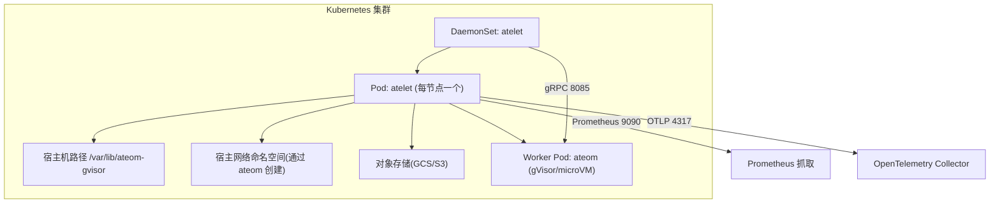
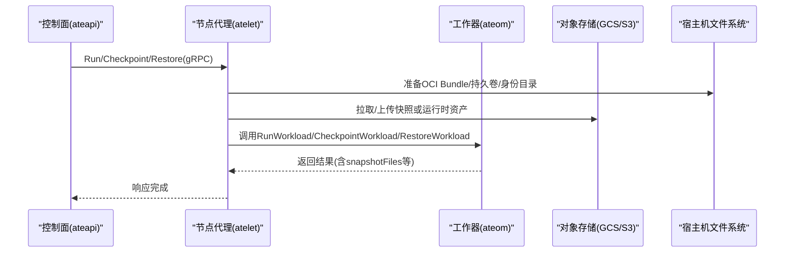
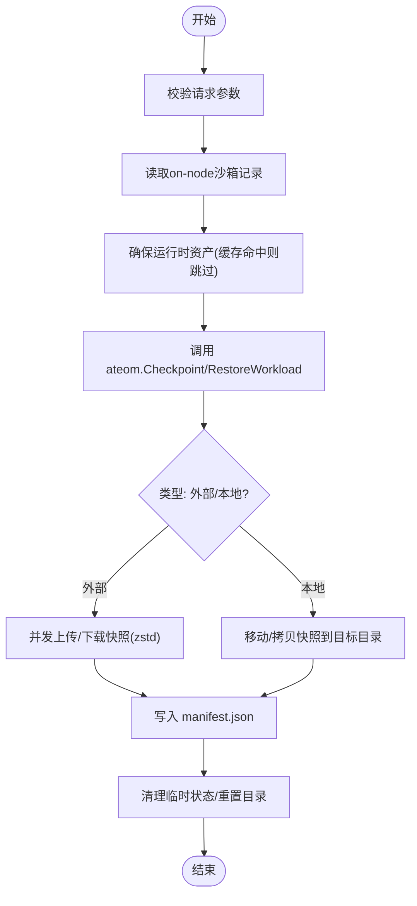
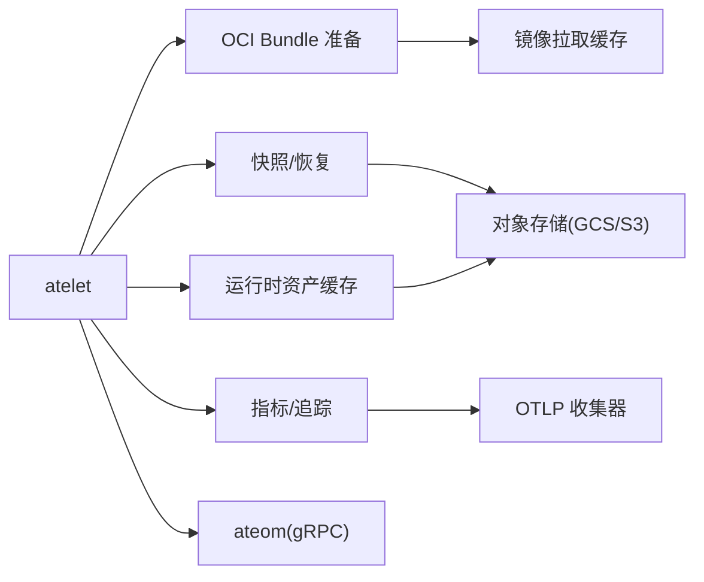

# 节点代理配置

<cite>
**本文引用的文件**   
- [atelet.yaml](file://manifests/ate-install/atelet.yaml)
- [main.go](file://cmd/atelet/main.go)
- [oci.go](file://cmd/atelet/oci.go)
- [sandbox_assets.go](file://cmd/atelet/sandbox_assets.go)
- [serverboot.go](file://internal/serverboot/serverboot.go)
- [informer.go](file://cmd/ateapi/internal/controlapi/informer.go)
- [dialer.go](file://cmd/ateapi/internal/controlapi/dialer.go)
</cite>

## 目录
1. [简介](#简介)
2. [项目结构](#项目结构)
3. [核心组件](#核心组件)
4. [架构总览](#架构总览)
5. [详细组件分析](#详细组件分析)
6. [依赖关系分析](#依赖关系分析)
7. [性能考虑](#性能考虑)
8. [故障诊断指南](#故障诊断指南)
9. [结论](#结论)
10. [附录](#附录)

## 简介
本文件聚焦于 atelet 组件的 Kubernetes 清单与运行时配置，覆盖以下关键主题：
- DaemonSet 部署模式与主机命名空间访问策略
- SecurityContext 安全上下文与最小权限原则
- 沙箱运行时集成（gVisor/microVM）与快照操作（Checkpoint/Restore）
- 资源清理、本地与外部快照存储、OCI 镜像拉取缓存
- 运行时可观测性（指标、追踪）、工作负载调度与错误重试
- 节点级故障诊断、性能优化与安全加固建议

## 项目结构
atelet 作为节点代理以 DaemonSet 形式在每个节点运行，负责：
- 接收控制面请求，准备 OCI Bundle 并调用 ateom 执行工作负载
- 管理沙箱运行时资产（如 gVisor runsc）的下载与校验
- 处理快照（Checkpoint/Restore），支持本地与外部对象存储后端
- 暴露 Prometheus 指标与 OTLP 遥测端点

图表来源
- [atelet.yaml:46-126](file://manifests/ate-install/atelet.yaml#L46-L126)
- [main.go:171-183](file://cmd/atelet/main.go#L171-L183)
- [serverboot.go:176-192](file://internal/serverboot/serverboot.go#L176-L192)

章节来源
- [atelet.yaml:46-126](file://manifests/ate-install/atelet.yaml#L46-L126)
- [main.go:171-183](file://cmd/atelet/main.go#L171-L183)
- [serverboot.go:176-192](file://internal/serverboot/serverboot.go#L176-L192)

## 核心组件
- 进程入口与参数
  - 监听端口、指标地址、GCR/GCP 认证开关、本地镜像仓库替换等命令行参数
  - 初始化日志、追踪、指标，启动 Prometheus HTTP 服务
- 工作负载编排
  - 准备 OCI Bundle（pause 与应用容器）、持久卷挂载点、身份绑定目录
  - 通过 gRPC 与 ateom 通信，驱动 Run/Checkpoint/Restore
- 沙箱运行时资产管理
  - 按架构选择运行时资产（runsc 或 microVM 多组件），内容寻址校验与缓存
  - 支持匿名公开桶与认证客户端回退
- 快照与恢复
  - 外部快照上传/下载（zstd 压缩），本地快照移动与清单落盘
  - 记录 snapshotFiles 到 manifest.json，确保跨节点 Restore 自描述
- 可观测性与健康检查
  - Prometheus /metrics 暴露；可选 /readyz；OTLP 上报

章节来源
- [main.go:64-100](file://cmd/atelet/main.go#L64-L100)
- [main.go:171-183](file://cmd/atelet/main.go#L171-L183)
- [main.go:215-271](file://cmd/atelet/main.go#L215-L271)
- [main.go:309-380](file://cmd/atelet/main.go#L309-L380)
- [main.go:454-583](file://cmd/atelet/main.go#L454-L583)
- [oci.go:60-116](file://cmd/atelet/oci.go#L60-L116)
- [sandbox_assets.go:95-111](file://cmd/atelet/sandbox_assets.go#L95-L111)
- [sandbox_assets.go:120-184](file://cmd/atelet/sandbox_assets.go#L120-L184)
- [serverboot.go:176-192](file://internal/serverboot/serverboot.go#L176-L192)

## 架构总览
atelet 在节点上以 root 用户运行，仅对宿主机目录进行读写，不直接操作 netlink/设备/命名空间。这些能力由 ateom worker pod 承担。atelet 通过 hostPort 暴露 gRPC 给控制面，同时暴露 Prometheus 指标端口供集群内抓取。

图表来源
- [main.go:215-271](file://cmd/atelet/main.go#L215-L271)
- [main.go:309-380](file://cmd/atelet/main.go#L309-L380)
- [main.go:454-583](file://cmd/atelet/main.go#L454-L583)
- [sandbox_assets.go:120-184](file://cmd/atelet/sandbox_assets.go#L120-L184)

## 详细组件分析

### DaemonSet 部署与安全上下文
- 部署方式
  - 使用 DaemonSet 在每个节点调度一个 atelet Pod
  - 通过 hostPort 暴露 gRPC(8085) 和 Prometheus(9090)，便于控制面与监控系统直连
- 安全上下文
  - 以 root 运行，但显式 drop ALL Linux capabilities，遵循最小权限
  - 仅需要读写 /var/lib/ateom-gvisor 宿主目录，无需额外内核能力
- 环境变量与遥测
  - OTEL_RESOURCE_ATTRIBUTES 注入 K8s 元数据
  - OTEL_EXPORTER_OTLP_ENDPOINT 指向集群内 OTLP 收集器
  - ATE_STORAGE_BACKEND 指定对象存储后端（默认 gcs）
- 存储卷
  - hostPath 挂载 /var/lib/ateom-gvisor，用于存放静态运行时资产、快照与 OCI bundle

章节来源
- [atelet.yaml:46-126](file://manifests/ate-install/atelet.yaml#L46-L126)

### 沙箱运行时集成（gVisor/microVM）
- 运行时资产选择
  - 根据节点架构从 SandboxAssets 中选择对应二进制（gVisor 为 runsc；microVM 包含多个组件）
  - 首次下载后按 SHA256 内容寻址缓存，后续命中即走本地
- 安全校验与大小限制
  - 强制校验 SHA256，超限拒绝，避免磁盘耗尽
  - 先尝试匿名公开桶（如 gs://gvisor），失败再回退至认证客户端
- 与 ateom 协作
  - 将 runsc 路径与 RuntimeAssetPaths 传递给 ateom，由其驱动实际容器生命周期

章节来源
- [sandbox_assets.go:95-111](file://cmd/atelet/sandbox_assets.go#L95-L111)
- [sandbox_assets.go:120-184](file://cmd/atelet/sandbox_assets.go#L120-L184)
- [main.go:255-268](file://cmd/atelet/main.go#L255-L268)

### 快照操作（Checkpoint/Restore）
- Checkpoint
  - 读取 on-node 记录的 sandbox 版本，确保与上次 Run 一致
  - 调用 ateom.CheckpointWorkload，获取 snapshotFiles 列表
  - 外部快照：并发上传 zstd 压缩文件，最后写入 manifest.json
  - 本地快照：移动到本地目录，写入 manifest.json
- Restore
  - 从外部或本地加载 manifest.json，并行下载/拷贝快照与准备 OCI bundle
  - 调用 ateom.RestoreWorkload，完成后写回 on-node 记录
- 度量与可观测性
  - 记录每个快照文件大小直方图，便于容量与性能分析

图表来源
- [main.go:309-380](file://cmd/atelet/main.go#L309-L380)
- [main.go:454-583](file://cmd/atelet/main.go#L454-L583)
- [sandbox_assets.go:206-241](file://cmd/atelet/sandbox_assets.go#L206-L241)

### OCI Bundle 准备与容器隔离
- 镜像拉取与解压
  - 通过内存拉取缓存加速重复拉取，支持 localhost 替换
  - 安全解压：使用 os.OpenRoot 限制写入范围，严格校验 tar 条目，防止越界与符号链接攻击
- 容器规格生成
  - 设置 PID/Network/IPC/UTS/Mount 命名空间
  - 挂载 /proc、/dev、只读 /sys、resolv.conf
  - 可选挂载身份目录（/run/ate/actor-id）与持久卷
- 权限与能力
  - 容器内以 root 运行，仅授予审计/kill/低端口绑定能力，遵循最小化

章节来源
- [oci.go:60-116](file://cmd/atelet/oci.go#L60-L116)
- [oci.go:177-300](file://cmd/atelet/oci.go#L177-L300)
- [oci.go:338-493](file://cmd/atelet/oci.go#L338-L493)

### 可观测性与健康检查
- 指标
  - Prometheus /metrics 暴露，端口 9090，hostPort 暴露
  - 自定义指标：快照大小直方图
- 追踪
  - OTLP gRPC 上报，资源属性注入 K8s 元数据
- 就绪探针
  - serverboot 提供 /readyz 能力（按需启用）

章节来源
- [serverboot.go:176-192](file://internal/serverboot/serverboot.go#L176-L192)
- [main.go:92-102](file://cmd/atelet/main.go#L92-L102)
- [atelet.yaml:62-64](file://manifests/ate-install/atelet.yaml#L62-L64)

### 工作负载调度与控制面交互
- 控制面发现 atelet Pod
  - 基于 namespace 与 label app=atelet 的 SharedInformer
  - 按 nodeName 建立索引，便于定位目标节点
- 连接复用
  - LRU 缓存 atelet gRPC 连接，降低握手开销

章节来源
- [informer.go:35-51](file://cmd/ateapi/internal/controlapi/informer.go#L35-L51)
- [dialer.go:31-45](file://cmd/ateapi/internal/controlapi/dialer.go#L31-L45)

## 依赖关系分析
- atelet 对外依赖
  - 对象存储：GCS（默认）或 S3（通过环境变量切换）
  - 镜像仓库：支持 GCR ADC 认证与本地仓库替换
  - OTLP 收集器：用于指标与追踪上报
  - ateom worker：通过 gRPC 驱动容器生命周期
- 内部模块
  - memorypullcache：镜像拉取内存缓存
  - ategcs：统一对象存储接口（GCS/S3）
  - serverboot：通用启动、日志、指标、追踪

图表来源
- [main.go:116-169](file://cmd/atelet/main.go#L116-L169)
- [sandbox_assets.go:120-184](file://cmd/atelet/sandbox_assets.go#L120-L184)
- [serverboot.go:124-147](file://internal/serverboot/serverboot.go#L124-L147)

## 性能考虑
- 镜像拉取
  - 使用内存拉取缓存减少重复网络 IO
  - 本地开发场景可通过 localhost 替换加速
- 快照 I/O
  - 外部快照采用并发上传/下载与 zstd 压缩，提升吞吐
  - 本地快照优先移动/拷贝，避免不必要复制
- 资源清理
  - 每次 Run/Restore 前重置 actor 目录，避免脏状态影响
- 连接复用
  - atelet gRPC 连接 LRU 缓存，降低延迟

[本节为通用指导，不直接分析具体文件]

## 故障诊断指南
- 常见问题定位
  - 无法拉取镜像：检查 GCR ADC 与本地仓库替换参数
  - 快照上传失败：确认对象存储后端与凭据，关注 DataLoss 错误码
  - 本地快照缺失：检查 /var/lib/ateom-gvisor 权限与可用空间
  - 运行时资产校验失败：核对 SHA256 与大小上限
- 可观测性手段
  - 查看 Prometheus 指标（/metrics）与 OTLP 追踪
  - 关注 atelet 日志中的“快照大小”、“Restore 耗时分解”等关键信息
- 控制面侧排查
  - 确认 atelet Pod 被正确发现（label/app=atelet）
  - 检查 atelet gRPC 连通性与连接缓存命中情况

章节来源
- [main.go:98-102](file://cmd/atelet/main.go#L98-L102)
- [main.go:454-583](file://cmd/atelet/main.go#L454-L583)
- [sandbox_assets.go:120-184](file://cmd/atelet/sandbox_assets.go#L120-L184)
- [informer.go:35-51](file://cmd/ateapi/internal/controlapi/informer.go#L35-L51)
- [dialer.go:31-45](file://cmd/ateapi/internal/controlapi/dialer.go#L31-L45)

## 结论
atelet 以 DaemonSet 部署于每个节点，通过最小权限的安全上下文与严格的文件/镜像安全校验，结合对象存储与内存缓存，实现高效的沙箱运行时管理与快照能力。配合 Prometheus 与 OTLP 的可观测性体系，以及控制面的高效发现与连接复用，可在生产环境中稳定支撑大规模工作负载的运行与恢复。

[本节为总结，不直接分析具体文件]

## 附录

### 清单关键配置项速览
- 部署
  - 名称空间：ate-system
  - 标签：app=atelet
  - 服务账户：atelet（具备 pods get/watch/list）
- 端口
  - gRPC：8085（hostPort）
  - Prometheus：9090（hostPort）
- 安全上下文
  - runAsUser/runAsGroup: 0
  - capabilities.drop: ALL
- 环境变量
  - OTEL_*：遥测相关
  - ATE_STORAGE_BACKEND：gcs/s3
- 卷
  - hostPath: /var/lib/ateom-gvisor

章节来源
- [atelet.yaml:15-126](file://manifests/ate-install/atelet.yaml#L15-L126)
