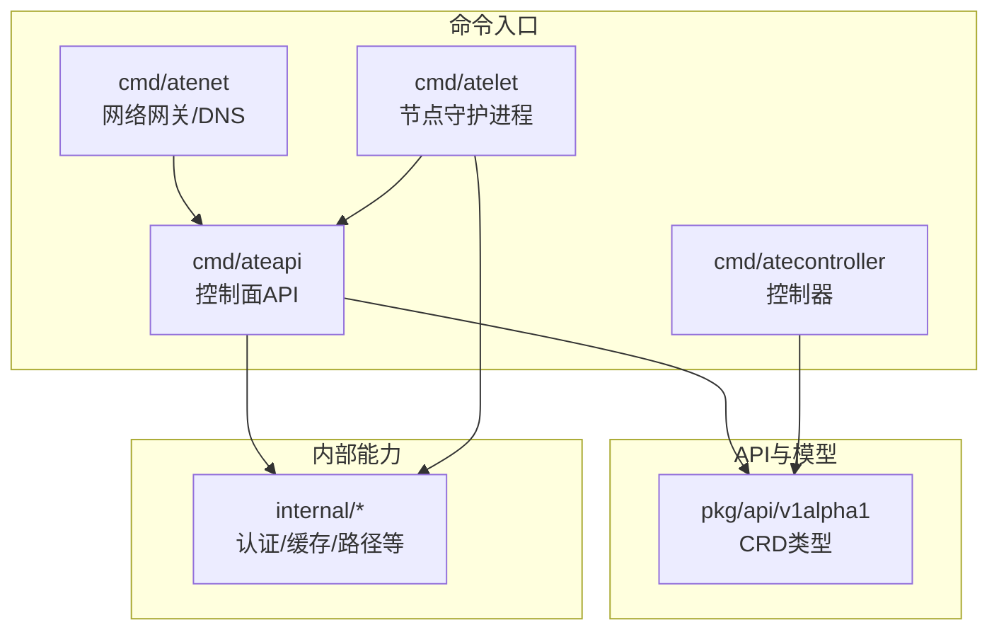
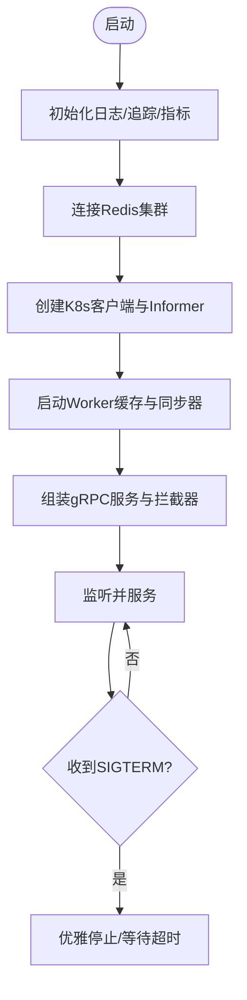
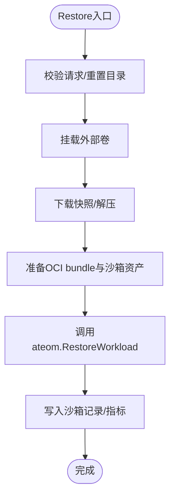
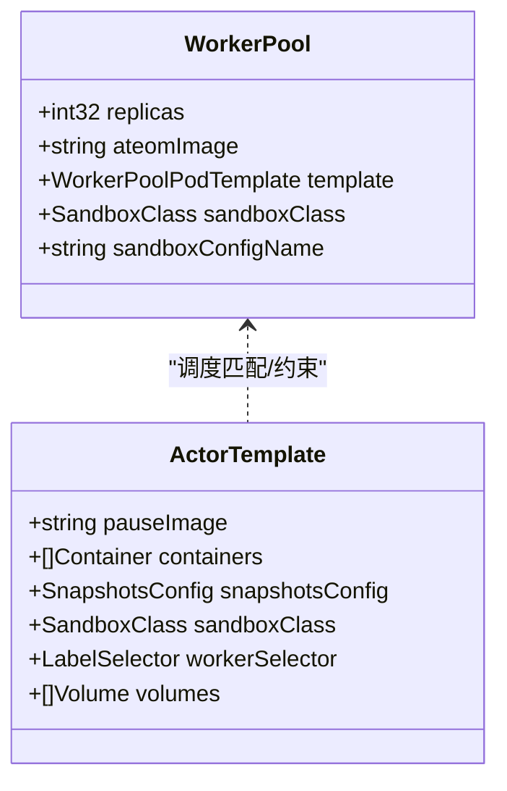
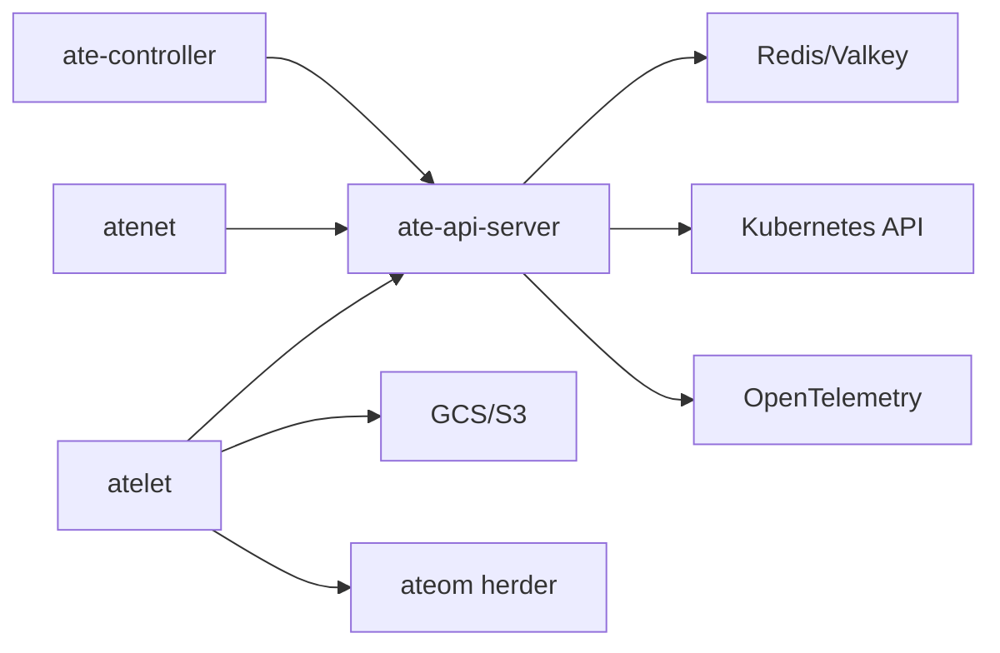

# Speckit开发框架

<cite>
**本文引用的文件**
- [README.md](file://README.md)
- [go.mod](file://go.mod)
- [cmd/ateapi/main.go](file://cmd/ateapi/main.go)
- [cmd/atecontroller/main.go](file://cmd/atecontroller/main.go)
- [cmd/atenet/main.go](file://cmd/atenet/main.go)
- [cmd/atelet/main.go](file://cmd/atelet/main.go)
- [pkg/api/v1alpha1/workerpool_types.go](file://pkg/api/v1alpha1/workerpool_types.go)
- [pkg/api/v1alpha1/actortemplate_types.go](file://pkg/api/v1alpha1/actortemplate_types.go)
- [docs/architecture.md](file://docs/architecture.md)
</cite>

## 目录
1. [简介](#简介)
2. [项目结构](#项目结构)
3. [核心组件](#核心组件)
4. [架构总览](#架构总览)
5. [详细组件分析](#详细组件分析)
6. [依赖关系分析](#依赖关系分析)
7. [性能考量](#性能考量)
8. [故障排查指南](#故障排查指南)
9. [结论](#结论)
10. [附录](#附录)

## 简介
本仓库实现了一个面向大规模“智能体/代理”工作负载的高密度运行时平台。其控制面提供完整的沙箱生命周期管理，支持亚秒级挂起/恢复、海量多路复用、以及多种沙箱后端（gVisor与microVM）。系统基于Kubernetes进行基础设施编排，并通过专用控制面与数据面组件实现低延迟调度、路由与状态迁移。

该框架的核心思想是将大量“Actor（应用实例）”映射到少量“Worker（就绪的工作节点）”，在空闲时挂起释放资源，在事件到达时快速恢复并处理请求，从而实现高吞吐与低延迟的混合部署。

**章节来源**
- [README.md:8-17](file://README.md#L8-L17)
- [docs/architecture.md:5-14](file://docs/architecture.md#L5-L14)

## 项目结构
仓库采用按功能域划分的模块化组织：
- cmd：可执行程序入口，包括控制面API服务、控制器、网络网关、节点守护进程等
- pkg：对外暴露的CRD类型定义与客户端生成代码
- internal：内部通用库（认证、拦截器、镜像缓存、快照路径等）
- docs：架构与设计文档
- manifests：Kubernetes部署清单
- demos：示例应用与工作负载
- benchmarking：基准测试与压测工具



**图表来源**
- [cmd/ateapi/main.go:17-57](file://cmd/ateapi/main.go#L17-L57)
- [cmd/atecontroller/main.go:16-34](file://cmd/atecontroller/main.go#L16-L34)
- [cmd/atenet/main.go:17-21](file://cmd/atenet/main.go#L17-L21)
- [cmd/atelet/main.go:17-67](file://cmd/atelet/main.go#L17-L67)
- [pkg/api/v1alpha1/workerpool_types.go:17-20](file://pkg/api/v1alpha1/workerpool_types.go#L17-L20)
- [pkg/api/v1alpha1/actortemplate_types.go:17-20](file://pkg/api/v1alpha1/actortemplate_types.go#L17-L20)

**章节来源**
- [README.md:237-252](file://README.md#L237-L252)
- [go.mod:1-62](file://go.mod#L1-L62)

## 核心组件
- 控制面API服务（ate-api-server）：暴露gRPC接口，负责Actor生命周期编排、调度、状态存储（Redis/Valkey）、指标与追踪。
- 控制器（ate-controller）：基于controller-runtime监听并 reconcile WorkerPool、ActorTemplate、NetworkPolicy等CRD，驱动底层Pod与配置。
- 网络栈（atenet）：统一DNS与Envoy路由，结合外部处理器触发Actor唤醒与转发。
- 节点守护（atelet）：在每个节点上协调宿主机Pod、镜像缓存、快照上传/下载，并与ateom交互执行Run/Checkpoint/Restore。
- CRD模型：WorkerPool、ActorTemplate、SandboxConfig等声明式资源，描述运行环境与期望状态。

**章节来源**
- [cmd/ateapi/main.go:89-250](file://cmd/ateapi/main.go#L89-L250)
- [cmd/atecontroller/main.go:69-147](file://cmd/atecontroller/main.go#L69-L147)
- [cmd/atenet/main.go:17-21](file://cmd/atenet/main.go#L17-L21)
- [cmd/atelet/main.go:87-228](file://cmd/atelet/main.go#L87-L228)
- [pkg/api/v1alpha1/workerpool_types.go:54-126](file://pkg/api/v1alpha1/workerpool_types.go#L54-L126)
- [pkg/api/v1alpha1/actortemplate_types.go:354-418](file://pkg/api/v1alpha1/actortemplate_types.go#L354-L418)

## 架构总览
系统由控制面、节点层与网络层组成，通过gRPC与对象存储协同完成Actor的创建、激活、休眠与删除。

```mermaid
sequenceDiagram
participant Client as "客户端"
participant DNS as "atenet DNS"
participant GW as "atenet-router"
participant API as "ate-api-server"
participant Atelet as "atelet"
participant Ateom as "ateom(沙箱herder)"
participant Store as "快照存储(GCS/S3)"
Client->>DNS : 解析actor域名
DNS-->>Client : 返回网关地址
Client->>GW : HTTP请求(Host=actor)
GW->>API : ResumeActor(atespace, actor)
API->>Atelet : Restore(actorUID, snapshot)
Atelet->>Store : 下载快照/解压
Atelet->>Ateom : RestoreWorkload
Ateom-->>Atelet : 就绪
Atelet-->>API : worker IP
API-->>GW : 分配结果
GW->>Ateom : mTLS隧道转发至端口443
Ateom->>Actor : 转发请求
Actor-->>Ateom : 响应
Ateom-->>GW : 响应
GW-->>Client : 响应
```

**图表来源**
- [docs/architecture.md:358-386](file://docs/architecture.md#L358-L386)
- [cmd/ateapi/main.go:180-235](file://cmd/ateapi/main.go#L180-L235)
- [cmd/atelet/main.go:547-749](file://cmd/atelet/main.go#L547-L749)

**章节来源**
- [docs/architecture.md:174-203](file://docs/architecture.md#L174-L203)
- [docs/architecture.md:298-351](file://docs/architecture.md#L298-L351)

## 详细组件分析

### 控制面API服务（ate-api-server）
职责
- 启动gRPC服务，注册Control/ActorIdentity/Debug服务
- 连接Redis集群作为高性能状态存储
- 初始化Tracing/Metrics，设置鉴权与拦截器链
- 维护Worker缓存与Informer同步，暴露指标

关键流程
- 启动日志与追踪初始化
- 建立Redis连接并健康检查
- 构建Kubernetes客户端与共享Informer
- 启动Worker池同步器与指标注册
- 组装gRPC服务器并优雅关停



**图表来源**
- [cmd/ateapi/main.go:89-250](file://cmd/ateapi/main.go#L89-L250)
- [cmd/ateapi/main.go:320-403](file://cmd/ateapi/main.go#L320-L403)

**章节来源**
- [cmd/ateapi/main.go:89-250](file://cmd/ateapi/main.go#L89-L250)
- [cmd/ateapi/main.go:278-318](file://cmd/ateapi/main.go#L278-L318)
- [cmd/ateapi/main.go:320-403](file://cmd/ateapi/main.go#L320-L403)

### 控制器（ate-controller）
职责
- 使用controller-runtime管理器监听CRD变更
- 注册并运行WorkerPool、NetworkPolicy、ActorTemplate reconciler
- 通过gRPC连接控制面API，下发指令或查询状态

关键点
- 构建ATE API gRPC客户端（支持证书或Token认证）
- 注入OTel参数以影响工作负载遥测行为
- 健康检查端点

**章节来源**
- [cmd/atecontroller/main.go:64-147](file://cmd/atecontroller/main.go#L64-L147)

### 网络栈（atenet）
职责
- 提供统一的Actor发现DNS后缀
- Envoy外部处理器提取Host头中的Actor标识，调用控制面唤醒并获取路由
- 建立mTLS隧道将流量转发到目标Worker的atunnel

说明
- 入口main仅委托给内部Execute，具体逻辑位于internal包中

**章节来源**
- [cmd/atenet/main.go:17-21](file://cmd/atenet/main.go#L17-L21)
- [docs/architecture.md:333-351](file://docs/architecture.md#L333-L351)

### 节点守护（atelet）
职责
- 在每个节点上管理本地OCI镜像缓存
- 协调快照的上传/下载（GCS/S3），并记录快照大小指标
- 通过ateom herder接口执行Run/Checkpoint/Restore
- 挂载/卸载外部卷，准备容器bundle，确保沙箱二进制版本一致性

关键流程（恢复）
- 校验请求、重置目录、挂载卷
- 并发下载快照与准备OCI bundle
- 调用ateom.RestoreWorkload并记录耗时分解
- 写入沙箱记录以便后续Checkpoint



**图表来源**
- [cmd/atelet/main.go:547-749](file://cmd/atelet/main.go#L547-L749)

**章节来源**
- [cmd/atelet/main.go:87-228](file://cmd/atelet/main.go#L87-L228)
- [cmd/atelet/main.go:292-353](file://cmd/atelet/main.go#L292-L353)
- [cmd/atelet/main.go:391-473](file://cmd/atelet/main.go#L391-L473)
- [cmd/atelet/main.go:547-749](file://cmd/atelet/main.go#L547-L749)

### CRD模型
- WorkerPool：声明Worker Pod集合、镜像、调度策略、沙箱类别与配置引用，支持HPA缩放
- ActorTemplate：定义不可变的应用模板（容器、卷、环境变量、快照策略、沙箱类别、选择器等），用于生成“黄金快照”



**图表来源**
- [pkg/api/v1alpha1/workerpool_types.go:54-126](file://pkg/api/v1alpha1/workerpool_types.go#L54-L126)
- [pkg/api/v1alpha1/actortemplate_types.go:354-418](file://pkg/api/v1alpha1/actortemplate_types.go#L354-L418)

**章节来源**
- [pkg/api/v1alpha1/workerpool_types.go:22-126](file://pkg/api/v1alpha1/workerpool_types.go#L22-L126)
- [pkg/api/v1alpha1/actortemplate_types.go:97-153](file://pkg/api/v1alpha1/actortemplate_types.go#L97-L153)
- [pkg/api/v1alpha1/actortemplate_types.go:273-352](file://pkg/api/v1alpha1/actortemplate_types.go#L273-L352)
- [pkg/api/v1alpha1/actortemplate_types.go:354-418](file://pkg/api/v1alpha1/actortemplate_types.go#L354-L418)

## 依赖关系分析
- 控制面依赖：
  - Kubernetes client-go与自定义CRD客户端
  - Redis/Valkey集群用于高频状态读写
  - OpenTelemetry用于指标与追踪
  - gRPC鉴权与拦截器链
- 节点层依赖：
  - OCI镜像缓存（本地目录）
  - GCS/S3对象存储用于快照持久化
  - ateom herder gRPC接口执行沙箱操作
- 网络层依赖：
  - Envoy ext_proc与DNS解析
  - mTLS隧道到Worker atunnel



**图表来源**
- [cmd/ateapi/main.go:125-181](file://cmd/ateapi/main.go#L125-L181)
- [cmd/atecontroller/main.go:69-129](file://cmd/atecontroller/main.go#L69-L129)
- [cmd/atelet/main.go:133-201](file://cmd/atelet/main.go#L133-L201)

**章节来源**
- [go.mod:1-62](file://go.mod#L1-L62)
- [cmd/ateapi/main.go:125-181](file://cmd/ateapi/main.go#L125-L181)
- [cmd/atelet/main.go:133-201](file://cmd/atelet/main.go#L133-L201)

## 性能考量
- 控制面避免直接写K8s API做高频状态更新，改用Redis/Valkey以降低延迟与压力
- 恢复流程并发下载快照与准备OCI bundle，减少冷启动时间
- 通过Worker预热与缓存，降低首次激活延迟
- 指标与追踪覆盖关键路径（如快照大小、恢复阶段耗时）

[本节为通用指导，不直接分析具体文件]

## 故障排查指南
常见问题与定位要点
- Redis连接失败：检查集群地址、TLS配置与IAM认证；服务启动时会重试Ping
- gRPC鉴权失败：确认客户端JWT颁发者、受众与CA配置；服务端拦截器会拒绝非法令牌
- 快照上传/下载失败：核对对象存储后端配置与权限；注意错误码与元数据
- 恢复慢：关注download/bundles/ateom三阶段耗时；检查镜像缓存命中率与磁盘IOPS
- 控制器无法连接API：验证ateapi连接规格、证书与Token模式

建议步骤
- 查看各组件metrics与healthz/readyz端点
- 启用更详细的日志级别（debug/info/warn/error）
- 对关键路径添加追踪上下文，定位瓶颈

**章节来源**
- [cmd/ateapi/main.go:320-403](file://cmd/ateapi/main.go#L320-L403)
- [cmd/ateapi/main.go:194-235](file://cmd/ateapi/main.go#L194-L235)
- [cmd/atelet/main.go:516-545](file://cmd/atelet/main.go#L516-L545)
- [cmd/atelet/main.go:743-748](file://cmd/atelet/main.go#L743-L748)

## 结论
该框架通过“控制面+节点层+网络层”的分层设计，实现了Agent类工作负载的高密度、低延迟运行环境。借助Kubernetes进行基础设施编排，配合专用控制面与数据面组件，系统在Actor生命周期管理、状态持久化与请求路由方面具备工程化落地能力。未来可在自动扩缩容、安全策略与可观测性等方面持续增强。

[本节为总结性内容，不直接分析具体文件]

## 附录
- 术语
  - Actor：应用实例（如Agent），具有独立身份与状态
  - Worker：预热的物理Pod，承载Actor运行
  - Snapshot：内存与文件系统状态的快照，支持GCS/S3持久化
  - Atespace：命名空间级别的隔离单元
- 参考
  - 架构文档与API指南见docs目录
  - 示例与安装脚本见demos与hack目录

[本节为补充信息，不直接分析具体文件]