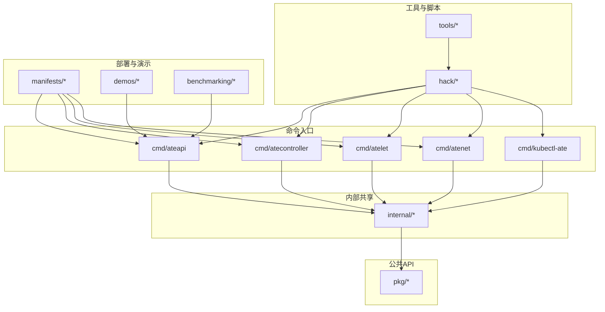
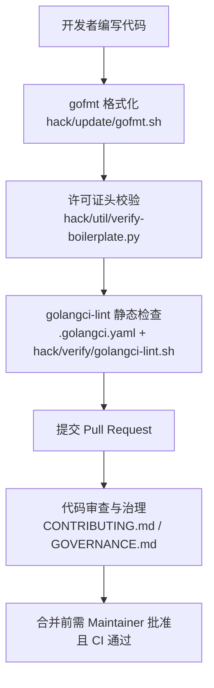
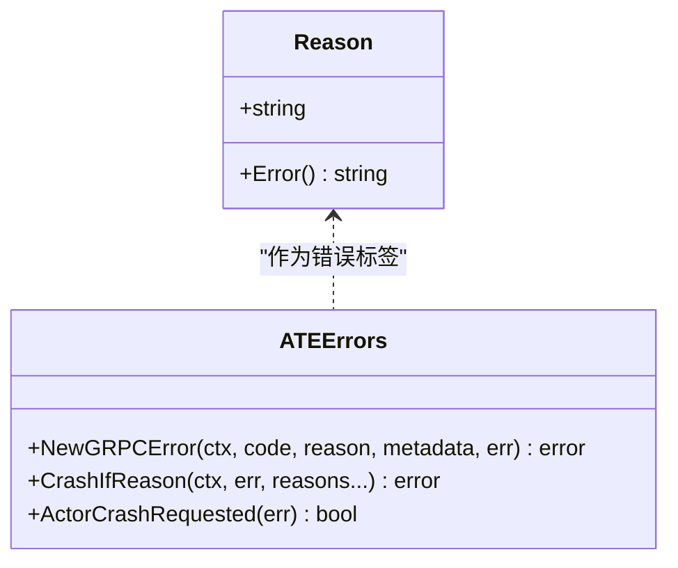
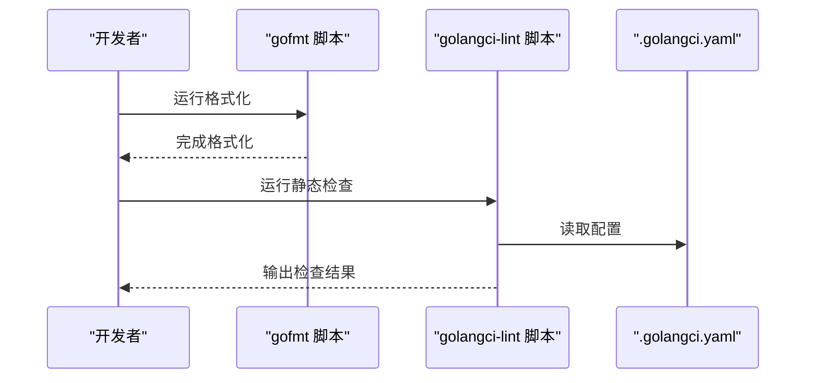
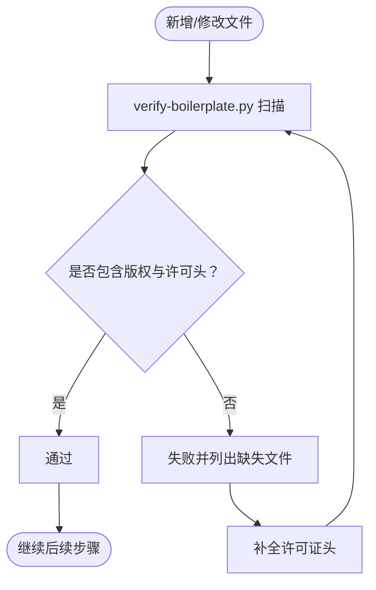
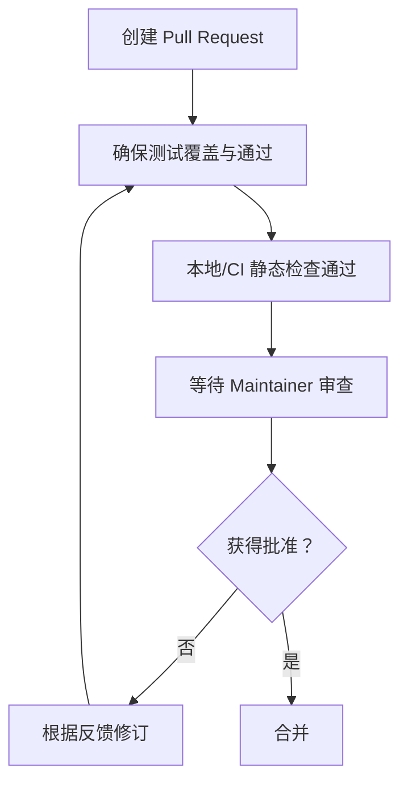
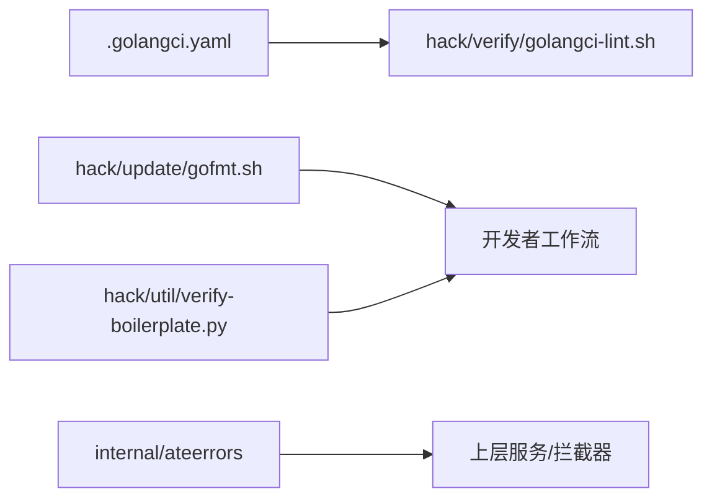

# 代码规范与风格

<cite>
**本文引用的文件**   
- [docs/code-style-guide.md](file://docs/code-style-guide.md)
- [docs/dev/code-layout.md](file://docs/dev/code-layout.md)
- [.golangci.yaml](file://.golangci.yaml)
- [hack/boilerplate/go.txt](file://hack/boilerplate/go.txt)
- [hack/util/verify-boilerplate.py](file://hack/util/verify-boilerplate.py)
- [hack/verify/golangci-lint.sh](file://hack/verify/golangci-lint.sh)
- [hack/update/gofmt.sh](file://hack/update/gofmt.sh)
- [internal/ateerrors/ateerrors.go](file://internal/ateerrors/ateerrors.go)
- [CONTRIBUTING.md](file://CONTRIBUTING.md)
- [GOVERNANCE.md](file://GOVERNANCE.md)
</cite>

## 目录
1. [简介](#简介)
2. [项目结构](#项目结构)
3. [核心组件](#核心组件)
4. [架构总览](#架构总览)
5. [详细组件分析](#详细组件分析)
6. [依赖关系分析](#依赖关系分析)
7. [性能考量](#性能考量)
8. [故障排查指南](#故障排查指南)
9. [结论](#结论)
10. [附录](#附录)

## 简介
本规范面向仓库中的 Go 代码，目标是统一命名约定、文件组织、包结构、注释与文档、错误处理、质量检查工具配置与使用、代码审查流程以及许可证头文件的自动添加与维护。本规范以 Effective Go、Google Go 风格指南和 gofmt 为基础，并记录本项目特有的决策与实践。

## 项目结构
仓库采用按职责与可复用性分层组织的布局：
- cmd/<binary>/：每个子目录对应一个可执行二进制；main.go 保持精简（参数解析、装配、信号处理），私有逻辑放入 internal/。
- internal/：跨多个二进制共享但不对外的包。
- pkg/：对外暴露的稳定 API（谨慎使用，GA 后任何导出项都受兼容性约束）。
- hack/：人类使用的脚本（开发环境、验证、生成等）；不导入为 Go 包。
- tools/：Go 编写的构建期或运维工具，每个工具独立 go.mod。
- manifests/：Kubernetes 部署清单。
- demos/：示例应用。
- benchmarking/：压测工具与工作负载。

图表来源
- [docs/dev/code-layout.md:44-104](file://docs/dev/code-layout.md#L44-L104)

章节来源
- [docs/dev/code-layout.md:36-104](file://docs/dev/code-layout.md#L36-L104)

## 核心组件
本节聚焦与“代码规范与风格”直接相关的工程化能力：
- 代码风格与测试约定
- golangci-lint 静态检查配置
- 许可证头校验与格式化
- 结构化错误与 gRPC 状态映射
- 贡献与审查流程

章节来源
- [docs/code-style-guide.md:1-47](file://docs/code-style-guide.md#L1-L47)
- [.golangci.yaml:1-110](file://.golangci.yaml#L1-L110)
- [hack/boilerplate/go.txt:1-15](file://hack/boilerplate/go.txt#L1-L15)
- [hack/util/verify-boilerplate.py:1-140](file://hack/util/verify-boilerplate.py#L1-L140)
- [hack/verify/golangci-lint.sh:1-31](file://hack/verify/golangci-lint.sh#L1-L31)
- [hack/update/gofmt.sh:1-48](file://hack/update/gofmt.sh#L1-L48)
- [internal/ateerrors/ateerrors.go:1-130](file://internal/ateerrors/ateerrors.go#L1-L130)
- [CONTRIBUTING.md:28-68](file://CONTRIBUTING.md#L28-L68)
- [GOVERNANCE.md:35-74](file://GOVERNANCE.md#L35-L74)

## 架构总览
下图展示了从开发者到 CI 的规范落地路径：本地格式化与头文件校验 → 静态检查 → 提交与合并策略。

图表来源
- [hack/update/gofmt.sh:1-48](file://hack/update/gofmt.sh#L1-L48)
- [hack/util/verify-boilerplate.py:1-140](file://hack/util/verify-boilerplate.py#L1-L140)
- [.golangci.yaml:1-110](file://.golangci.yaml#L1-L110)
- [hack/verify/golangci-lint.sh:1-31](file://hack/verify/golangci-lint.sh#L1-L31)
- [CONTRIBUTING.md:28-68](file://CONTRIBUTING.md#L28-L68)
- [GOVERNANCE.md:35-74](file://GOVERNANCE.md#L35-L74)

## 详细组件分析

### 命名约定与包结构
- 遵循 Effective Go、Google Go 风格指南与 gofmt。
- 包放置原则：
  - 仅被单一二进制使用：cmd/<binary>/internal/<pkg>
  - 多二进制共享但不对外：internal/<pkg>
  - 对外稳定 API：pkg/<pkg>（谨慎使用，GA 后任何导出项均视为兼容承诺）
  - 生成的 protobuf 包：公开控制面 API 放 pkg/proto/<name>，内部 API 放 internal/proto/<name>
  - 脚本/工具：hack/（shell）或 tools/<name>（Go，独立 go.mod）

章节来源
- [docs/dev/code-layout.md:36-104](file://docs/dev/code-layout.md#L36-L104)

### 注释与文档规范
- 函数与包文档：遵循标准库 doc 注释约定，确保对外 API 有清晰说明。
- TODO 标记：在代码中以 TODO(<issue-number>): ... 形式记录待决事项，便于追踪。
- 测试文档：通过表驱动测试与 t.Run 子测试组织用例，必要时在测试文件中补充简要说明。

章节来源
- [docs/code-style-guide.md:43-47](file://docs/code-style-guide.md#L43-L47)

### 错误处理最佳实践
- 结构化错误与 gRPC 状态：
  - 使用统一的 Reason 枚举对失败原因进行领域级分类，并通过 ErrorInfo 附加到 gRPC status。
  - 提供 NewGRPCError 构造带 ErrorInfo 的结构化错误，支持 reason 与 metadata。
  - 提供 CrashIfReason 将特定 Reason 提升为需要崩溃 Actor 的 DataLoss 错误。
  - 提供 ActorCrashRequested 读取 ErrorInfo 元数据判断是否需要崩溃 Actor。
- 错误传播：
  - 在 RPC 边界显式校验必填字段，避免依赖默认零值；缺失时返回 INVALID_ARGUMENT 或具体错误。
  - 非结构化错误在拦截器层统一收敛为 Internal，保留原始信息用于诊断。

图表来源
- [internal/ateerrors/ateerrors.go:1-130](file://internal/ateerrors/ateerrors.go#L1-L130)

章节来源
- [internal/ateerrors/ateerrors.go:1-130](file://internal/ateerrors/ateerrors.go#L1-L130)
- [docs/code-style-guide.md:12-35](file://docs/code-style-guide.md#L12-L35)

### 代码质量检查工具配置与使用
- golangci-lint：
  - 版本与运行：version: "2"，超时 5 分钟。
  - 预设与启用：default: standard（errcheck、govet、ineffassign、staticcheck、unused），额外启用 misspell（仅注释模式，美式拼写）。
  - 排除规则：
    - 路径：hack/tools、LICENSES
    - 生成代码：*.pb.go、*.pb.gw.go、zz_generated.*.go、pkg/client/*
    - 测试文件：_test.go 忽略 errcheck
    - staticcheck QF* 建议忽略（纯样式改写）
    - 常见忽略模式：Close()/os.Remove/json.Encoder.Encode 在清理/写入路径中忽略返回值
  - 本地与 CI：
    - 本地/CI 统一通过 hack/verify/golangci-lint.sh 调用，设置 GOOS=linux 保证类型检查一致性。
- gofmt：
  - 使用 hack/update/gofmt.sh 对变更目录进行格式化，确保团队一致风格。

图表来源
- [.golangci.yaml:1-110](file://.golangci.yaml#L1-L110)
- [hack/verify/golangci-lint.sh:1-31](file://hack/verify/golangci-lint.sh#L1-L31)
- [hack/update/gofmt.sh:1-48](file://hack/update/gofmt.sh#L1-L48)

章节来源
- [.golangci.yaml:1-110](file://.golangci.yaml#L1-L110)
- [hack/verify/golangci-lint.sh:1-31](file://hack/verify/golangci-lint.sh#L1-L31)
- [hack/update/gofmt.sh:1-48](file://hack/update/gofmt.sh#L1-L48)

### 许可证头文件的自动添加与维护
- 模板：Apache 2.0 头文件模板位于 hack/boilerplate/go.txt。
- 校验：
  - 使用 hack/util/verify-boilerplate.py 扫描仓库文件，要求包含 Copyright 年份与 Apache 2.0 许可文本片段。
  - 跳过第三方与 vendor、LICENSES 目录及若干非源码文件。
- 维护：
  - 新增文件应包含正确年份与许可头；CI 会拒绝缺少头部的文件。
  - 更新年份由脚本根据当前年份校验范围，确保合规。

图表来源
- [hack/boilerplate/go.txt:1-15](file://hack/boilerplate/go.txt#L1-L15)
- [hack/util/verify-boilerplate.py:1-140](file://hack/util/verify-boilerplate.py#L1-L140)

章节来源
- [hack/boilerplate/go.txt:1-15](file://hack/boilerplate/go.txt#L1-L15)
- [hack/util/verify-boilerplate.py:1-140](file://hack/util/verify-boilerplate.py#L1-L140)

### 代码审查清单与标准流程
- 所有提交均需审查，使用 GitHub Pull Requests。
- 必须附带测试；未通过测试的代码不会合并。
- 合并条件：至少一名 Maintainer 批准且 CI 全部通过；作者不应自行批准或合并自己的 PR（紧急修复除外）。
- 设计变更需提前发起 Issue/Discussion，留出反馈时间；重大变更需 Maintainer 支持。

图表来源
- [CONTRIBUTING.md:28-68](file://CONTRIBUTING.md#L28-L68)
- [GOVERNANCE.md:35-74](file://GOVERNANCE.md#L35-L74)

章节来源
- [CONTRIBUTING.md:28-68](file://CONTRIBUTING.md#L28-L68)
- [GOVERNANCE.md:35-74](file://GOVERNANCE.md#L35-L74)

## 依赖关系分析
- 代码风格与检查工具链：
  - .golangci.yaml 定义 linters 与排除规则，被 hack/verify/golangci-lint.sh 调用。
  - gofmt 脚本负责格式化，配合 verify-boilerplate.py 完成头部校验。
- 错误处理模块：
  - internal/ateerrors 提供 Reason 与 gRPC 状态映射，供上层服务与拦截器使用。

图表来源
- [.golangci.yaml:1-110](file://.golangci.yaml#L1-L110)
- [hack/verify/golangci-lint.sh:1-31](file://hack/verify/golangci-lint.sh#L1-L31)
- [hack/update/gofmt.sh:1-48](file://hack/update/gofmt.sh#L1-L48)
- [hack/util/verify-boilerplate.py:1-140](file://hack/util/verify-boilerplate.py#L1-L140)
- [internal/ateerrors/ateerrors.go:1-130](file://internal/ateerrors/ateerrors.go#L1-L130)

章节来源
- [.golangci.yaml:1-110](file://.golangci.yaml#L1-L110)
- [hack/verify/golangci-lint.sh:1-31](file://hack/verify/golangci-lint.sh#L1-L31)
- [hack/update/gofmt.sh:1-48](file://hack/update/gofmt.sh#L1-L48)
- [hack/util/verify-boilerplate.py:1-140](file://hack/util/verify-boilerplate.py#L1-L140)
- [internal/ateerrors/ateerrors.go:1-130](file://internal/ateerrors/ateerrors.go#L1-L130)

## 性能考量
- 静态检查与格式化应在本地快速迭代，CI 中严格把关；合理配置 golangci-lint 的超时与排除规则，避免不必要的扫描开销。
- 错误构造与传播应避免重复包装，尽量在边界处一次性附加 ErrorInfo，减少运行时开销。

[本节为通用指导，无需引用具体文件]

## 故障排查指南
- golangci-lint 在 macOS 上因平台相关包导致 typecheck 失败：
  - 通过 hack/verify/golangci-lint.sh 设置 GOOS=linux，使本地与 CI 行为一致，避免其他问题被抑制。
- 许可证头缺失：
  - 使用 verify-boilerplate.py 定位缺失文件，依据模板补齐版权与许可文本。
- 错误码与 Reason 不匹配：
  - 检查 NewGRPCError 的 reason 与 metadata 是否正确传递，确认上层拦截器是否保留了 ErrorInfo。

章节来源
- [hack/verify/golangci-lint.sh:1-31](file://hack/verify/golangci-lint.sh#L1-L31)
- [hack/util/verify-boilerplate.py:1-140](file://hack/util/verify-boilerplate.py#L1-L140)
- [internal/ateerrors/ateerrors.go:1-130](file://internal/ateerrors/ateerrors.go#L1-L130)

## 结论
本规范围绕“可读、可维护、可协作”的目标，明确了命名与包结构、注释与文档、错误处理、质量检查与审查流程，以及许可证头自动化管理。通过统一的工具链与严格的 CI 门禁，可有效降低技术债与协作成本，保障长期演进的质量与稳定性。

[本节为总结，无需引用具体文件]

## 附录
- 参考基准：Effective Go、Google Go 风格指南、gofmt。
- 仓库布局与放置清单详见 docs/dev/code-layout.md。
- 贡献与治理流程详见 CONTRIBUTING.md 与 GOVERNANCE.md。

章节来源
- [docs/dev/code-layout.md:36-104](file://docs/dev/code-layout.md#L36-L104)
- [CONTRIBUTING.md:28-68](file://CONTRIBUTING.md#L28-L68)
- [GOVERNANCE.md:35-74](file://GOVERNANCE.md#L35-L74)
